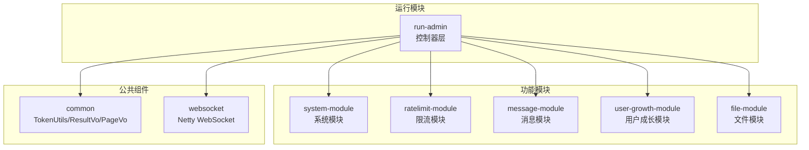
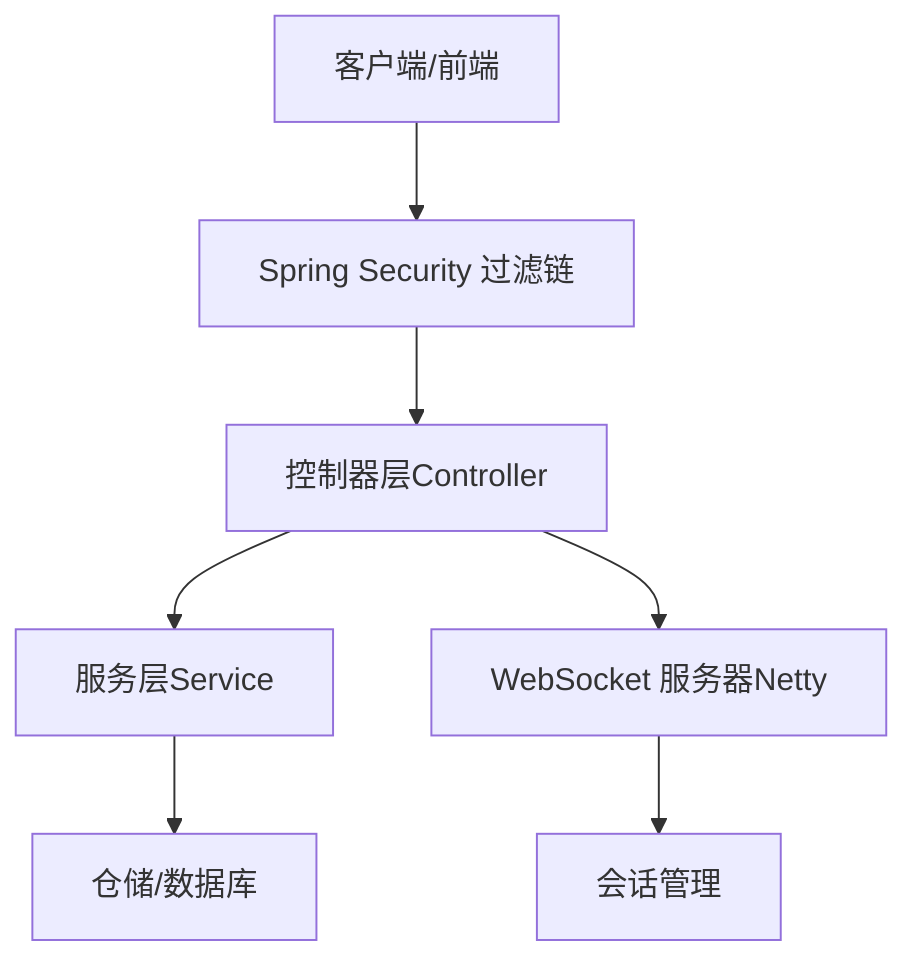
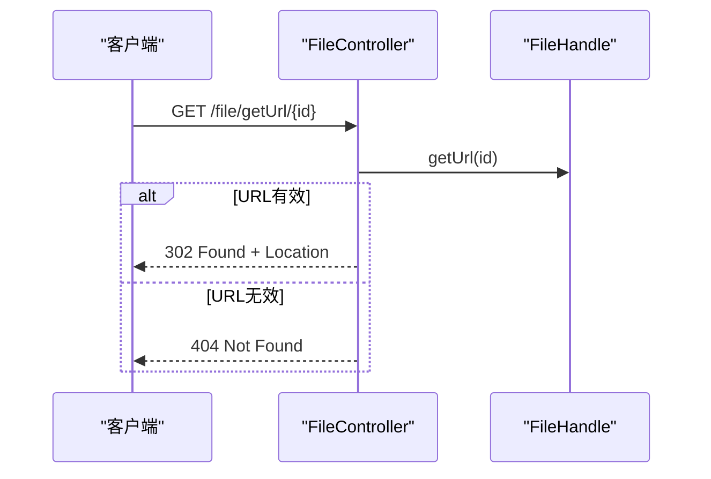
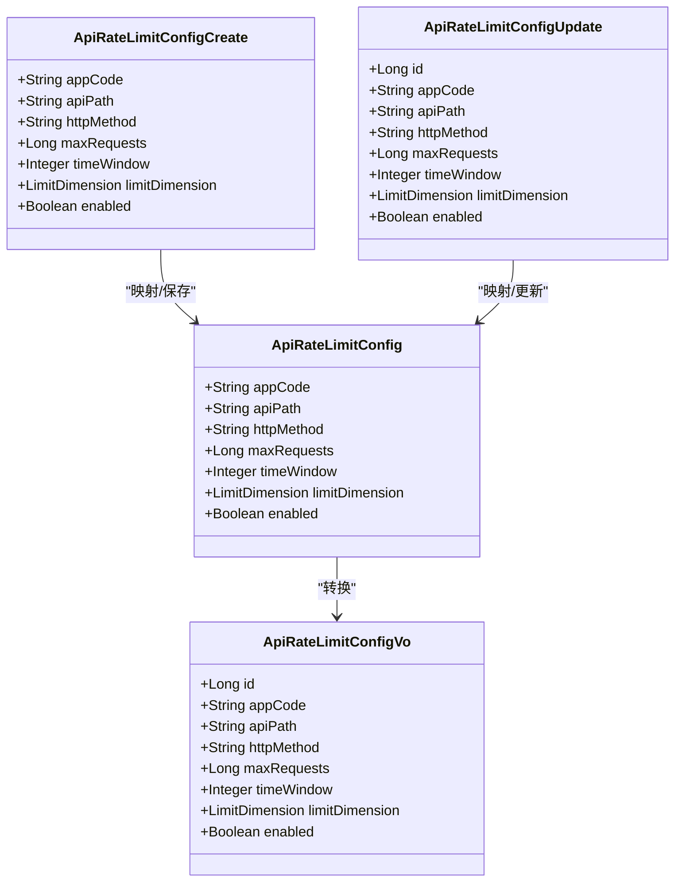
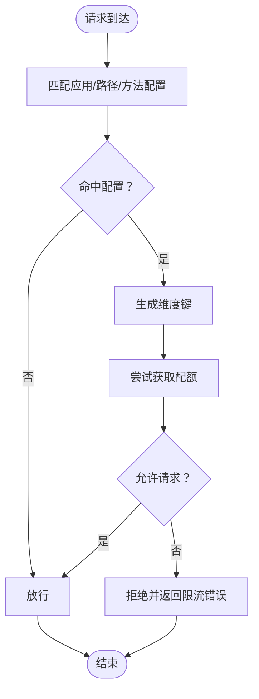
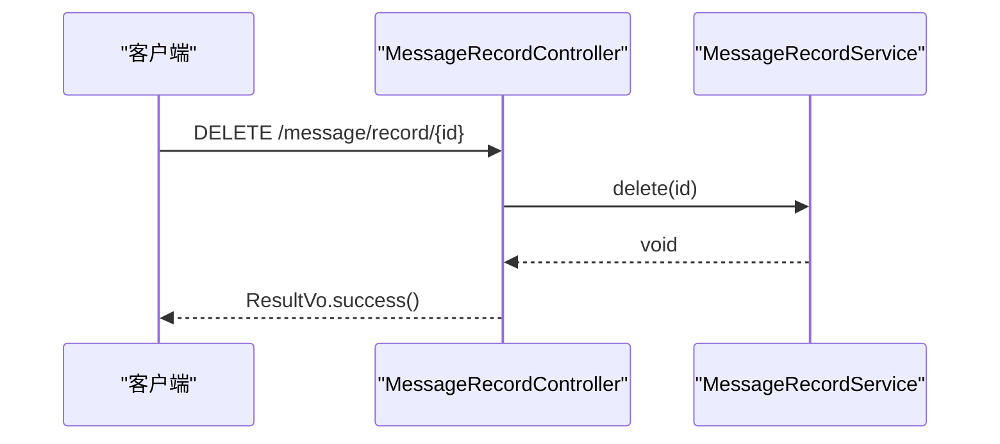
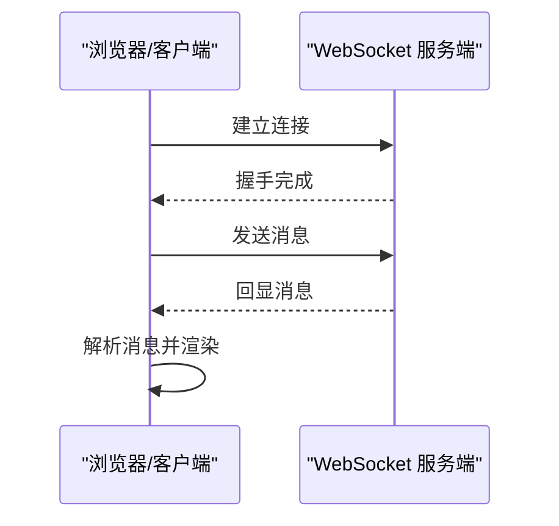
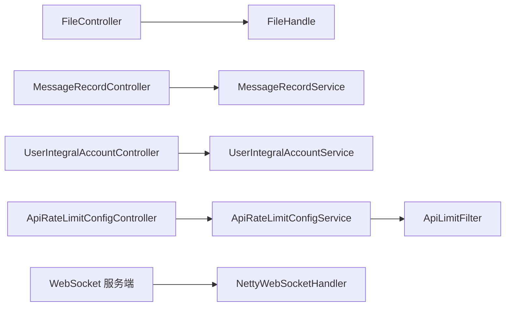

# API接口文档

<cite>
**本文引用的文件**
- [run-admin/src/main/java/com/fastproject/module/file/controller/FileController.java](file://run-admin/src/main/java/com/fastproject/module/file/controller/FileController.java)
- [file-api/src/main/java/com/fastproject/file/api/FileHandle.java](file://file-api/src/main/java/com/fastproject/file/api/FileHandle.java)
- [run-admin/src/main/java/com/fastproject/module/ratelimit/controller/ApiRateLimitConfigController.java](file://run-admin/src/main/java/com/fastproject/module/ratelimit/controller/ApiRateLimitConfigController.java)
- [ratelimit-module/src/main/java/com//fastproject/ratelimit/vo/api/ApiRateLimitConfigCreate.java](file://ratelimit-module/src/main/java/com/fastproject/ratelimit/vo/api/ApiRateLimitConfigCreate.java)
- [ratelimit-module/src/main/java/com//fastproject/ratelimit/vo/api/ApiRateLimitConfigUpdate.java](file://ratelimit-module/src/main/java/com/fastproject/ratelimit/vo/api/ApiRateLimitConfigUpdate.java)
- [ratelimit-module/src/main/java/com//fastproject/ratelimit/vo/api/ApiRateLimitConfigVo.java](file://ratelimit-module/src/main/java/com/fastproject/ratelimit/vo/api/ApiRateLimitConfigVo.java)
- [ratelimit-module/src/main/java/com//fastproject/ratelimit/domain/ApiRateLimitConfig.java](file://ratelimit-module/src/main/java/com/fastproject/ratelimit/domain/ApiRateLimitConfig.java)
- [ratelimit-module/src/main/java/com//fastproject/ratelimit/config/ApiLimitFilter.java](file://ratelimit-module/src/main/java/com/fastproject/ratelimit/config/ApiLimitFilter.java)
- [run-admin/src/main/java/com/fastproject/module/message/controller/MessageRecordController.java](file://run-admin/src/main/java/com/fastproject/module/message/controller/MessageRecordController.java)
- [message-module/src/main/java/com/fastproject/message/service/MessageRecordService.java](file://message-module/src/main/java/com/fastproject/message/service/MessageRecordService.java)
- [run-admin/src/main/java/com/fastproject/module/usergrowth/controller/UserIntegralAccountController.java](file://run-admin/src/main/java/com/fastproject/module/usergrowth/controller/UserIntegralAccountController.java)
- [common/src/main/java/com/fastproject/utils/TokenUtils.java](file://common/src/main/java/com/fastproject/utils/TokenUtils.java)
- [run-admin/src/main/java/com/fastproject/module/security/config/SecurityConfig.java](file://run-admin/src/main/java/com/fastproject/module/security/config/SecurityConfig.java)
- [websocket/src/main/java/com/fastproject/netty/NettyWebSocketHandler.java](file://websocket/src/main/java/com/fastproject/netty/NettyWebSocketHandler.java)
- [fast-ui/apps/admin-vue/src/api/ratelimit/apiConfig.ts](file://fast-ui/apps/admin-vue/src/api/ratelimit/apiConfig.ts)
- [fast-ui/apps/customer-service-vue/src/utils/websocket.ts](file://fast-ui/apps/customer-service-vue/src/utils/websocket.ts)
- [AGENTS.md](file://AGENTS.md)
</cite>

## 目录
1. [简介](#简介)
2. [项目结构](#项目结构)
3. [核心组件](#核心组件)
4. [架构总览](#架构总览)
5. [详细组件分析](#详细组件分析)
6. [依赖关系分析](#依赖关系分析)
7. [性能考量](#性能考量)
8. [故障排查指南](#故障排查指南)
9. [结论](#结论)
10. [附录](#附录)

## 简介
本文件为 Fast 项目的完整 API 接口文档，覆盖 RESTful API 与 WebSocket 实时通信协议。内容包括：
- 所有 REST 端点的 HTTP 方法、URL 模式、请求参数与响应格式
- 认证授权机制、参数校验规则与数据格式规范
- WebSocket 消息格式与实时通信协议
- API 版本管理策略与向后兼容性保障
- 测试工具与调试方法
- 客户端集成指南与最佳实践

## 项目结构
后端采用多模块分层设计，遵循“领域驱动”的分包与职责划分：
- 控制器层：位于 run-admin 模块的 module/*/controller 下，统一暴露 REST 接口
- 服务层：位于 system-module、ratelimit-module、message-module、user-growth-module 等
- 领域模型与仓储：JPA 实体与仓库接口
- VO/DTO：按 CRUD 语义拆分，确保输入输出清晰
- 公共工具：TokenUtils、ResultVo、PageVo 等

图表来源
- [AGENTS.md](file://AGENTS.md#L309-L416)

章节来源
- [AGENTS.md](file://AGENTS.md#L309-L416)

## 核心组件
- 认证与安全：基于 JWT 的 TokenUtils，结合 Spring Security 过滤链与方法级鉴权注解
- 结果封装：ResultVo 统一响应结构；PageVo 统一分页结构
- 限流：ApiLimitFilter 在过滤器阶段进行维度化限流
- 文件：FileController 通过 FileHandle 接口获取文件 URL 并重定向
- 消息：MessageRecordController 提供消息记录的增删改查与分页
- 用户成长：UserIntegralAccountController 提供积分账户的增删改查与分页
- WebSocket：NettyWebSocketHandler 处理握手与会话管理

章节来源
- [common/src/main/java/com/fastproject/utils/TokenUtils.java](file://common/src/main/java/com/fastproject/utils/TokenUtils.java#L1-L229)
- [run-admin/src/main/java/com/fastproject/module/security/config/SecurityConfig.java](file://run-admin/src/main/java/com/fastproject/module/security/config/SecurityConfig.java#L1-L32)
- [ratelimit-module/src/main/java/com//fastproject/ratelimit/config/ApiLimitFilter.java](file://ratelimit-module/src/main/java/com/fastproject/ratelimit/config/ApiLimitFilter.java#L102-L121)
- [run-admin/src/main/java/com/fastproject/module/file/controller/FileController.java](file://run-admin/src/main/java/com/fastproject/module/file/controller/FileController.java#L1-L42)
- [run-admin/src/main/java/com/fastproject/module/message/controller/MessageRecordController.java](file://run-admin/src/main/java/com/fastproject/module/message/controller/MessageRecordController.java#L1-L67)
- [run-admin/src/main/java/com/fastproject/module/usergrowth/controller/UserIntegralAccountController.java](file://run-admin/src/main/java/com/fastproject/module/usergrowth/controller/UserIntegralAccountController.java#L1-L63)
- [websocket/src/main/java/com/fastproject/netty/NettyWebSocketHandler.java](file://websocket/src/main/java/com/fastproject/netty/NettyWebSocketHandler.java#L33-L51)

## 架构总览
下图展示 REST 与 WebSocket 的整体交互关系。

图表来源
- [run-admin/src/main/java/com/fastproject/module/security/config/SecurityConfig.java](file://run-admin/src/main/java/com/fastproject/module/security/config/SecurityConfig.java#L25-L32)
- [websocket/src/main/java/com/fastproject/netty/NettyWebSocketHandler.java](file://websocket/src/main/java/com/fastproject/netty/NettyWebSocketHandler.java#L33-L51)

## 详细组件分析

### 文件接口（FileController）
- 功能：根据文件 ID 获取文件 URL，并进行 302 重定向
- 认证：无显式登录要求（公开接口）
- 参数与响应：
  - GET /file/getUrl/{id}
  - 成功：302 Found，Location 为文件 URL
  - 失败：404 Not Found

图表来源
- [run-admin/src/main/java/com/fastproject/module/file/controller/FileController.java](file://run-admin/src/main/java/com/fastproject/module/file/controller/FileController.java#L22-L40)
- [file-api/src/main/java/com/fastproject/file/api/FileHandle.java](file://file-api/src/main/java/com/fastproject/file/api/FileHandle.java#L7-L21)

章节来源
- [run-admin/src/main/java/com/fastproject/module/file/controller/FileController.java](file://run-admin/src/main/java/com/fastproject/module/file/controller/FileController.java#L1-L42)
- [file-api/src/main/java/com/fastproject/file/api/FileHandle.java](file://file-api/src/main/java/com/fastproject/file/api/FileHandle.java#L1-L22)

### API 限流配置接口（ApiRateLimitConfigController）
- 功能：对特定应用、API 路径与 HTTP 方法设置限流策略
- 权限：基于 @PreAuthorize 的 RBAC 权限控制
- 参数与响应：统一使用 ResultVo 包裹，分页使用 PageVo
- 关键字段：
  - appCode：应用代码
  - apiPath：API 路径
  - httpMethod：HTTP 方法（GET/POST/PUT/DELETE 等）
  - maxRequests：时间窗口内的最大请求数
  - timeWindow：时间窗口（秒）
  - limitDimension：限流维度（如用户、IP、应用等）
  - enabled：是否启用

图表来源
- [ratelimit-module/src/main/java/com/ fastproject/ratelimit/vo/api/ApiRateLimitConfigCreate.java](file://ratelimit-module/src/main/java/com/fastproject/ratelimit/vo/api/ApiRateLimitConfigCreate.java#L1-L46)
- [ratelimit-module/src/main/java/com/ fastproject/ratelimit/vo/api/ApiRateLimitConfigUpdate.java](file://ratelimit-module/src/main/java/com/fastproject/ratelimit/vo/api/ApiRateLimitConfigUpdate.java#L1-L51)
- [ratelimit-module/src/main/java/com/ fastproject/ratelimit/vo/api/ApiRateLimitConfigVo.java](file://ratelimit-module/src/main/java/com/fastproject/ratelimit/vo/api/ApiRateLimitConfigVo.java#L1-L51)
- [ratelimit-module/src/main/java/com/ fastproject/ratelimit/domain/ApiRateLimitConfig.java](file://ratelimit-module/src/main/java/com/fastproject/ratelimit/domain/ApiRateLimitConfig.java#L1-L64)

REST 端点清单
- 新增：POST /ratelimit/api-config
  - 请求体：ApiRateLimitConfigCreate
  - 响应：ResultVo<Object>
  - 权限：admin:ratelimit:api-config:add
- 修改：PUT /ratelimit/api-config
  - 请求体：ApiRateLimitConfigUpdate
  - 响应：ResultVo<Object>
  - 权限：admin:ratelimit:api-config:update
- 删除：DELETE /ratelimit/api-config/{id}
  - 路径参数：id
  - 响应：ResultVo<Object>
  - 权限：admin:ratelimit:api-config:delete
- 批量删除：DELETE /ratelimit/api-config/batch
  - 请求体：id 数组
  - 响应：ResultVo<Object>
  - 权限：admin:ratelimit:api-config:delete
- 分页查询：POST /ratelimit/api-config/page
  - 请求体：ApiRateLimitConfigQuery（继承分页基类）
  - 响应：ResultVo<PageVo<List<ApiRateLimitConfigVo>>>
  - 权限：admin:ratelimit:api-config:query
- 详情：GET /ratelimit/api-config/{id}
  - 路径参数：id
  - 响应：ResultVo<ApiRateLimitConfigVo>
  - 权限：admin:ratelimit:api-config:query

限流实现流程
- 过滤器在进入控制器前匹配配置并执行限流
- 维度键由具体维度策略生成（如用户ID/IP等）
- 使用漏桶/令牌桶等算法进行计数与放行

图表来源
- [ratelimit-module/src/main/java/com/ fastproject/ratelimit/config/ApiLimitFilter.java](file://ratelimit-module/src/main/java/com/fastproject/ratelimit/config/ApiLimitFilter.java#L102-L121)

章节来源
- [run-admin/src/main/java/com/fastproject/module/ratelimit/controller/ApiRateLimitConfigController.java](file://run-admin/src/main/java/com/fastproject/module/ratelimit/controller/ApiRateLimitConfigController.java#L1-L62)
- [ratelimit-module/src/main/java/com/ fastproject/ratelimit/vo/api/ApiRateLimitConfigCreate.java](file://ratelimit-module/src/main/java/com/fastproject/ratelimit/vo/api/ApiRateLimitConfigCreate.java#L1-L46)
- [ratelimit-module/src/main/java/com/ fastproject/ratelimit/vo/api/ApiRateLimitConfigUpdate.java](file://ratelimit-module/src/main/java/com/fastproject/ratelimit/vo/api/ApiRateLimitConfigUpdate.java#L1-L51)
- [ratelimit-module/src/main/java/com/ fastproject/ratelimit/vo/api/ApiRateLimitConfigVo.java](file://ratelimit-module/src/main/java/com/fastproject/ratelimit/vo/api/ApiRateLimitConfigVo.java#L1-L51)
- [ratelimit-module/src/main/java/com/ fastproject/ratelimit/domain/ApiRateLimitConfig.java](file://ratelimit-module/src/main/java/com/fastproject/ratelimit/domain/ApiRateLimitConfig.java#L1-L64)
- [ratelimit-module/src/main/java/com/ fastproject/ratelimit/config/ApiLimitFilter.java](file://ratelimit-module/src/main/java/com/fastproject/ratelimit/config/ApiLimitFilter.java#L102-L121)

### 消息记录接口（MessageRecordController）
- 功能：消息记录的删除、批量删除、分页查询与详情
- 权限：基于 @PreAuthorize 的 RBAC 权限控制
- 数据模型：MessageRecordService 定义标准 CRUD 与分页能力

图表来源
- [run-admin/src/main/java/com/fastproject/module/message/controller/MessageRecordController.java](file://run-admin/src/main/java/com/fastproject/module/message/controller/MessageRecordController.java#L27-L36)
- [message-module/src/main/java/com/fastproject/message/service/MessageRecordService.java](file://message-module/src/main/java/com/fastproject/message/service/MessageRecordService.java#L1-L25)

章节来源
- [run-admin/src/main/java/com/fastproject/module/message/controller/MessageRecordController.java](file://run-admin/src/main/java/com/fastproject/module/message/controller/MessageRecordController.java#L1-L67)
- [message-module/src/main/java/com/fastproject/message/service/MessageRecordService.java](file://message-module/src/main/java/com/fastproject/message/service/MessageRecordService.java#L1-L25)

### 用户积分账户接口（UserIntegralAccountController）
- 功能：积分账户的新增、修改、删除、批量删除、详情与分页查询
- 参数校验：使用 @Validated 对请求体进行参数校验
- 权限：基于 @PreAuthorize 的 RBAC 权限控制

章节来源
- [run-admin/src/main/java/com/fastproject/module/usergrowth/controller/UserIntegralAccountController.java](file://run-admin/src/main/java/com/fastproject/module/usergrowth/controller/UserIntegralAccountController.java#L1-L63)

### WebSocket 实时通信协议
- 连接地址：默认 ./ws（可在客户端初始化时指定）
- 握手事件：握手完成后，服务端将 Channel 加入会话管理
- 消息处理：当前服务端为演示目的回显收到的消息，客户端将其解析为聊天消息并加入会话

图表来源
- [websocket/src/main/java/com/fastproject/netty/NettyWebSocketHandler.java](file://websocket/src/main/java/com/fastproject/netty/NettyWebSocketHandler.java#L33-L51)
- [fast-ui/apps/customer-service-vue/src/utils/websocket.ts](file://fast-ui/apps/customer-service-vue/src/utils/websocket.ts#L1-L47)

章节来源
- [websocket/src/main/java/com/fastproject/netty/NettyWebSocketHandler.java](file://websocket/src/main/java/com/fastproject/netty/NettyWebSocketHandler.java#L33-L51)
- [fast-ui/apps/customer-service-vue/src/utils/websocket.ts](file://fast-ui/apps/customer-service-vue/src/utils/websocket.ts#L1-L47)

## 依赖关系分析
- 控制器依赖服务接口，服务接口依赖仓储与领域模型
- 限流过滤器独立于控制器，前置拦截请求并执行限流判定
- WebSocket 与 REST 服务并行运行，通过 Netty 处理长连接

图表来源
- [run-admin/src/main/java/com/fastproject/module/file/controller/FileController.java](file://run-admin/src/main/java/com/fastproject/module/file/controller/FileController.java#L1-L42)
- [file-api/src/main/java/com/fastproject/file/api/FileHandle.java](file://file-api/src/main/java/com/fastproject/file/api/FileHandle.java#L1-L22)
- [run-admin/src/main/java/com/fastproject/module/message/controller/MessageRecordController.java](file://run-admin/src/main/java/com/fastproject/module/message/controller/MessageRecordController.java#L1-L67)
- [message-module/src/main/java/com/fastproject/message/service/MessageRecordService.java](file://message-module/src/main/java/com/fastproject/message/service/MessageRecordService.java#L1-L25)
- [run-admin/src/main/java/com/fastproject/module/usergrowth/controller/UserIntegralAccountController.java](file://run-admin/src/main/java/com/fastproject/module/usergrowth/controller/UserIntegralAccountController.java#L1-L63)
- [run-admin/src/main/java/com/fastproject/module/ratelimit/controller/ApiRateLimitConfigController.java](file://run-admin/src/main/java/com/fastproject/module/ratelimit/controller/ApiRateLimitConfigController.java#L1-L62)
- [ratelimit-module/src/main/java/com/ fastproject/ratelimit/config/ApiLimitFilter.java](file://ratelimit-module/src/main/java/com/fastproject/ratelimit/config/ApiLimitFilter.java#L102-L121)
- [websocket/src/main/java/com/fastproject/netty/NettyWebSocketHandler.java](file://websocket/src/main/java/com/fastproject/netty/NettyWebSocketHandler.java#L33-L51)

## 性能考量
- 本地缓存：TokenUtils 使用本地缓存加速用户信息读取，减少 Redis 访问
- 限流缓存：ApiLimitFilter 对配置进行本地缓存，降低重复查询成本
- 连接复用：WebSocket 使用 Netty，支持高并发长连接
- 分页查询：统一 PageVo，避免一次性加载大量数据

章节来源
- [common/src/main/java/com/fastproject/utils/TokenUtils.java](file://common/src/main/java/com/fastproject/utils/TokenUtils.java#L30-L36)
- [ratelimit-module/src/main/java/com/ fastproject/ratelimit/config/ApiLimitFilter.java](file://ratelimit-module/src/main/java/com/fastproject/ratelimit/config/ApiLimitFilter.java#L102-L121)

## 故障排查指南
- 401/403 认证失败：确认请求头携带正确的 Authorization（Bearer Token），并检查 Token 是否过期或被顶号
- 404 资源不存在：检查 URL 路径与参数是否正确
- 429 限流：检查限流配置是否合理，维度键是否正确生成
- WebSocket 连接失败：确认连接地址与跨域配置，查看浏览器控制台与服务端日志

章节来源
- [common/src/main/java/com/fastproject/utils/TokenUtils.java](file://common/src/main/java/com/fastproject/utils/TokenUtils.java#L185-L229)
- [run-admin/src/main/java/com/fastproject/module/security/config/SecurityConfig.java](file://run-admin/src/main/java/com/fastproject/module/security/config/SecurityConfig.java#L1-L32)
- [ratelimit-module/src/main/java/com/ fastproject/ratelimit/config/ApiLimitFilter.java](file://ratelimit-module/src/main/java/com/fastproject/ratelimit/config/ApiLimitFilter.java#L102-L121)

## 结论
本项目提供了清晰的 REST API 与 WebSocket 实时通信能力，配合统一的结果封装、权限控制与限流机制，能够满足企业级应用的稳定性与扩展性需求。建议在客户端集成时严格遵循认证流程与参数校验规则，并结合限流策略进行压测与容量规划。

## 附录

### 认证与授权机制
- 登录与注销：TokenUtils 提供登录、校验与注销能力，支持多设备登录限制
- 过滤链：SecurityConfig 配置 CORS、会话策略与过滤器链
- 方法级权限：@PreAuthorize 注解用于细粒度权限控制

章节来源
- [common/src/main/java/com/fastproject/utils/TokenUtils.java](file://common/src/main/java/com/fastproject/utils/TokenUtils.java#L185-L229)
- [run-admin/src/main/java/com/fastproject/module/security/config/SecurityConfig.java](file://run-admin/src/main/java/com/fastproject/module/security/config/SecurityConfig.java#L1-L32)

### 数据格式规范
- 统一响应：ResultVo 包裹业务结果
- 分页结构：PageVo 包含列表与分页元信息
- 请求体：按 CRUD 语义拆分 VO（Create/Update/Query/Vo）

章节来源
- [AGENTS.md](file://AGENTS.md#L309-L416)

### API 版本管理与兼容性
- 建议策略：在 URL 中引入版本前缀（如 /api/v1/...），并在变更时保持向后兼容或提供迁移指引
- 兼容性保障：对非破坏性变更保留旧接口一段时间，逐步引导客户端升级

章节来源
- [AGENTS.md](file://AGENTS.md#L309-L416)

### API 测试工具与调试方法
- 前端示例：fast-ui 提供 TypeScript 接口封装与 WebSocket 客户端示例
- 接口调用：参考 apiConfig.ts 中的请求封装，统一设置 x-request-id 等头部

章节来源
- [fast-ui/apps/admin-vue/src/api/ratelimit/apiConfig.ts](file://fast-ui/apps/admin-vue/src/api/ratelimit/apiConfig.ts#L64-L107)
- [fast-ui/apps/customer-service-vue/src/utils/websocket.ts](file://fast-ui/apps/customer-service-vue/src/utils/websocket.ts#L1-L47)

### 客户端集成指南与最佳实践
- 统一鉴权：在每次请求中携带 Authorization 头，遵循 Bearer Token 规范
- 错误处理：针对 401/403/404/429 场景编写统一的错误提示与重试逻辑
- 限流适配：在客户端侧实现退避重试与排队策略，避免触发服务端限流
- WebSocket：连接断开后自动重连，消息发送前进行本地校验与去重

章节来源
- [fast-ui/apps/admin-vue/src/api/ratelimit/apiConfig.ts](file://fast-ui/apps/admin-vue/src/api/ratelimit/apiConfig.ts#L64-L107)
- [fast-ui/apps/customer-service-vue/src/utils/websocket.ts](file://fast-ui/apps/customer-service-vue/src/utils/websocket.ts#L1-L47)