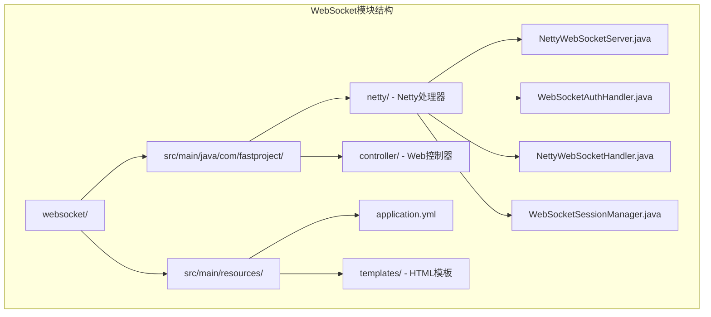
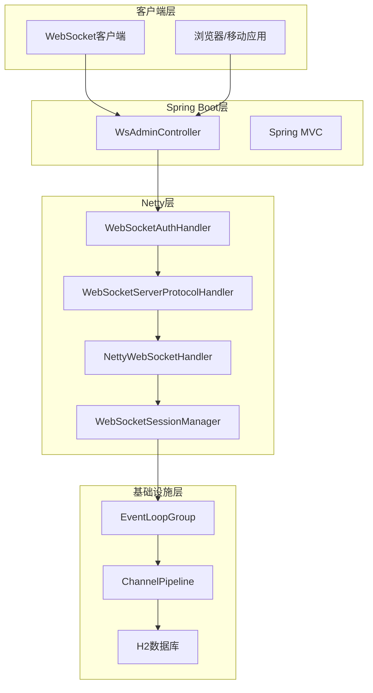
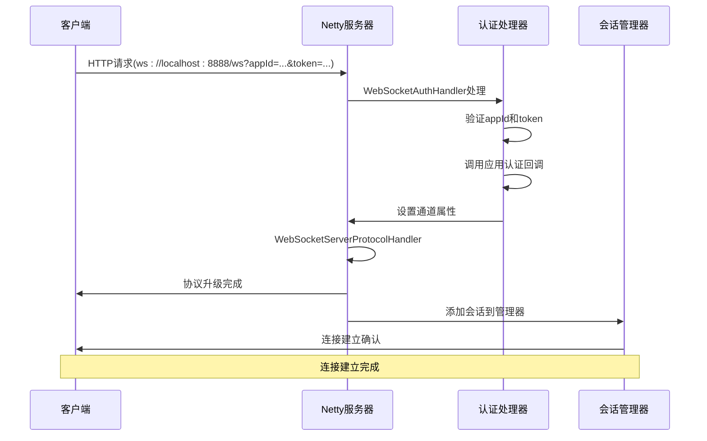
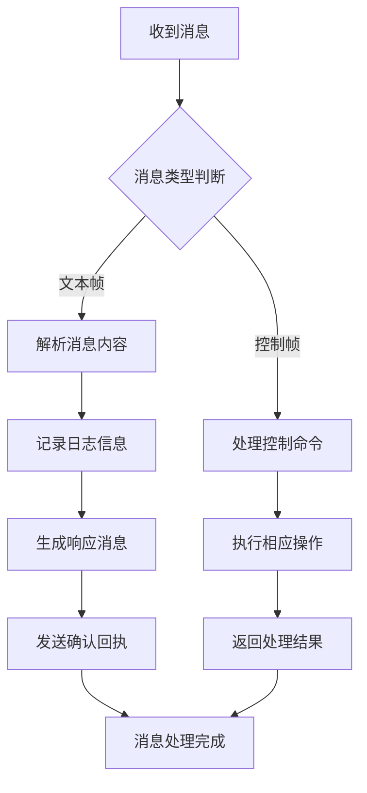
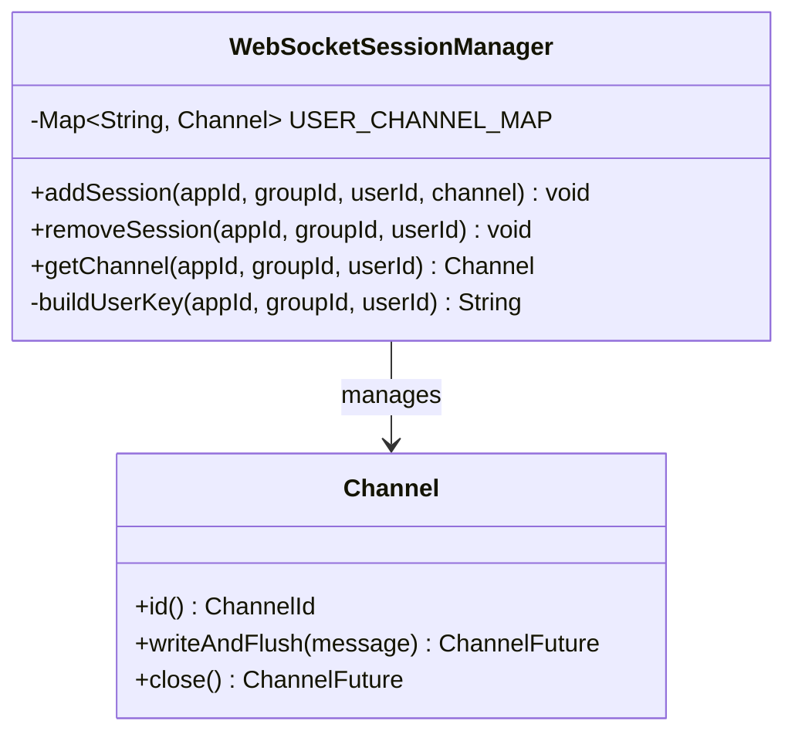
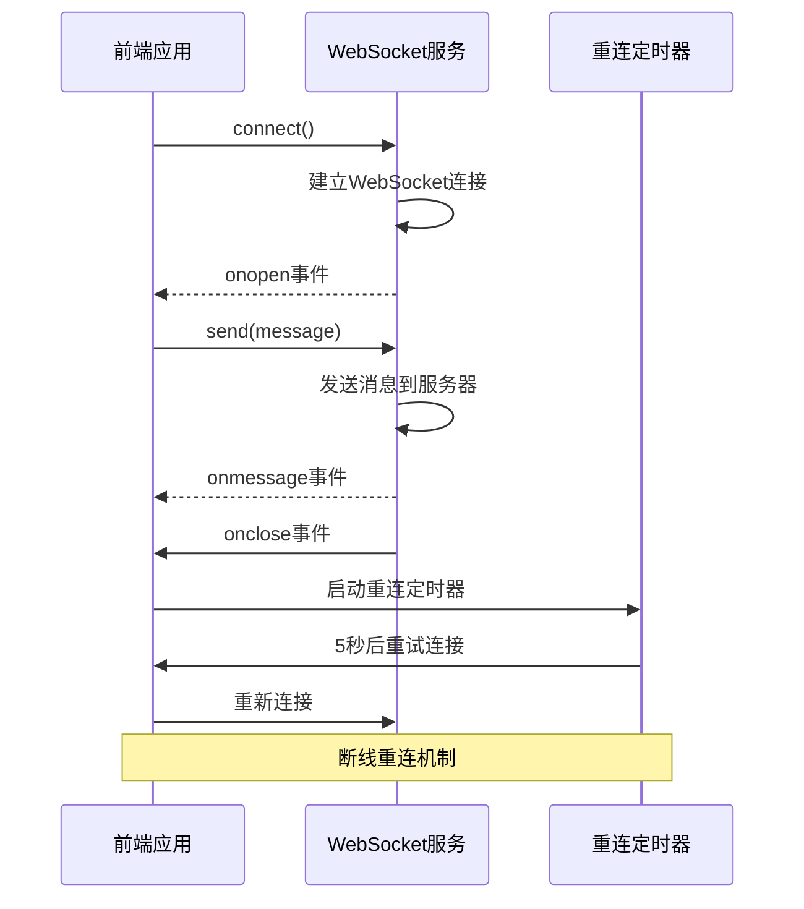
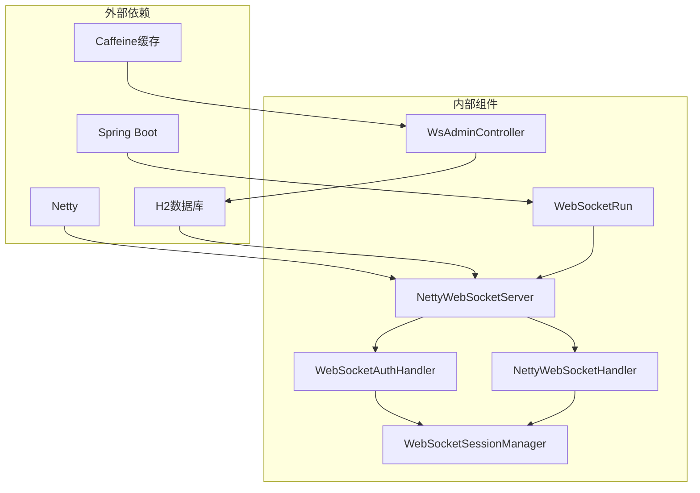

# WebSocket实时通信API

<cite>
**本文档引用的文件**
- [WebSocketRun.java](file://websocket/src/main/java/com/fastproject/WebSocketRun.java)
- [NettyWebSocketServer.java](file://websocket/src/main/java/com/fastproject/netty/NettyWebSocketServer.java)
- [NettyWebSocketServerInitializer.java](file://websocket/src/main/java/com/fastproject/netty/NettyWebSocketServerInitializer.java)
- [WebSocketAuthHandler.java](file://websocket/src/main/java/com/fastproject/netty/WebSocketAuthHandler.java)
- [NettyWebSocketHandler.java](file://websocket/src/main/java/com/fastproject/netty/NettyWebSocketHandler.java)
- [WebSocketSessionManager.java](file://websocket/src/main/java/com/fastproject/netty/WebSocketSessionManager.java)
- [WsAdminController.java](file://websocket/src/main/java/com/fastproject/controller/WsAdminController.java)
- [application.yml](file://websocket/src/main/resources/application.yml)
- [websocket.ts](file://fast-ui/apps/customer-service-vue/src/utils/websocket.ts)
- [index.html](file://websocket/src/main/resources/templates/index.html)
- [edit_app.html](file://websocket/src/main/resources/templates/edit_app.html)
</cite>

## 目录
1. [简介](#简介)
2. [项目结构](#项目结构)
3. [核心组件](#核心组件)
4. [架构概览](#架构概览)
5. [详细组件分析](#详细组件分析)
6. [依赖关系分析](#依赖关系分析)
7. [性能考虑](#性能考虑)
8. [故障排除指南](#故障排除指南)
9. [结论](#结论)

## 简介

FastProject WebSocket实时通信模块是一个基于Netty构建的高性能WebSocket服务端框架，专为实时通信场景设计。该模块提供了完整的WebSocket连接管理、消息路由、用户会话管理和实时通信协议支持。

本模块采用Spring Boot集成Netty的方式，实现了以下核心功能：
- 基于HTTP的WebSocket握手协议
- 应用程序级别的连接认证
- 用户会话管理和状态维护
- 心跳检测和断线重连机制
- 实时消息路由和广播功能

## 项目结构

WebSocket模块采用分层架构设计，主要包含以下核心目录：

**图表来源**
- [WebSocketRun.java](file://websocket/src/main/java/com/fastproject/WebSocketRun.java#L1-L12)
- [NettyWebSocketServer.java](file://websocket/src/main/java/com/fastproject/netty/NettyWebSocketServer.java#L1-L103)

**章节来源**
- [WebSocketRun.java](file://websocket/src/main/java/com/fastproject/WebSocketRun.java#L1-L12)
- [application.yml](file://websocket/src/main/resources/application.yml#L1-L28)

## 核心组件

### NettyWebSocketServer
NettyWebSocketServer是WebSocket服务的核心启动类，负责整个Netty服务的生命周期管理。

**主要特性：**
- 独立线程池管理，避免阻塞Spring主线程
- 支持优雅关闭和资源清理
- 可配置的监听端口和路径
- 事件循环组的正确初始化和关闭

**配置参数：**
- `netty.websocket.port`: 监听端口，默认8888
- `netty.websocket.path`: WebSocket路径，默认/ws

### WebSocketAuthHandler
WebSocket认证处理器负责处理WebSocket连接的认证流程。

**认证流程：**
1. 从URL查询参数提取appId、token、userId、groupId
2. 通过ApplicationService查找应用配置
3. 调用应用的认证回调接口进行二次验证
4. 设置通道属性并继续处理链

### NettyWebSocketHandler
业务处理器负责实际的WebSocket消息处理。

**处理逻辑：**
- 接收文本帧消息并记录日志
- 向客户端回显确认消息
- 管理握手完成后的会话状态
- 处理连接断开和异常情况

### WebSocketSessionManager
会话管理器提供用户连接状态的集中管理。

**管理功能：**
- 用户连接的添加和移除
- 基于appId:groupId:userId的键值管理
- 并发安全的通道存储
- 在线用户统计和状态维护

**章节来源**
- [NettyWebSocketServer.java](file://websocket/src/main/java/com/fastproject/netty/NettyWebSocketServer.java#L20-L103)
- [WebSocketAuthHandler.java](file://websocket/src/main/java/com/fastproject/netty/WebSocketAuthHandler.java#L20-L105)
- [NettyWebSocketHandler.java](file://websocket/src/main/java/com/fastproject/netty/NettyWebSocketHandler.java#L1-L82)
- [WebSocketSessionManager.java](file://websocket/src/main/java/com/fastproject/netty/WebSocketSessionManager.java#L1-L63)

## 架构概览

WebSocket模块采用分层架构，结合Spring Boot和Netty的优势：

**图表来源**
- [NettyWebSocketServerInitializer.java](file://websocket/src/main/java/com/fastproject/netty/NettyWebSocketServerInitializer.java#L15-L55)
- [WsAdminController.java](file://websocket/src/main/java/com/fastproject/controller/WsAdminController.java#L21-L155)

## 详细组件分析

### 连接建立流程

WebSocket连接建立遵循标准的HTTP到WebSocket升级过程：

**图表来源**
- [WebSocketAuthHandler.java](file://websocket/src/main/java/com/fastproject/netty/WebSocketAuthHandler.java#L31-L95)
- [NettyWebSocketHandler.java](file://websocket/src/main/java/com/fastproject/netty/NettyWebSocketHandler.java#L37-L51)

### 消息处理流程

消息处理采用异步非阻塞模式，支持高并发场景：

**图表来源**
- [NettyWebSocketHandler.java](file://websocket/src/main/java/com/fastproject/netty/NettyWebSocketHandler.java#L21-L31)

### 会话管理机制

会话管理器采用ConcurrentHashMap实现线程安全的连接状态管理：

**图表来源**
- [WebSocketSessionManager.java](file://websocket/src/main/java/com/fastproject/netty/WebSocketSessionManager.java#L14-L63)

**章节来源**
- [NettyWebSocketServerInitializer.java](file://websocket/src/main/java/com/fastproject/netty/NettyWebSocketServerInitializer.java#L29-L53)
- [NettyWebSocketHandler.java](file://websocket/src/main/java/com/fastproject/netty/NettyWebSocketHandler.java#L14-L82)

### 控制器API接口

WsAdminController提供WebSocket管理界面的REST API：

| 接口 | 方法 | 路径 | 功能描述 |
|------|------|------|----------|
| 获取会话 | GET | `/api/session` | 获取当前登录用户信息 |
| 获取应用列表 | GET | `/api/apps` | 获取所有WebSocket应用配置 |
| 用户登录 | POST | `/login` | 用户身份验证和会话创建 |
| 用户注册 | POST | `/register` | 创建第一个管理员账户 |
| 用户登出 | GET | `/logout` | 清除用户会话 |

**章节来源**
- [WsAdminController.java](file://websocket/src/main/java/com/fastproject/controller/WsAdminController.java#L59-L155)

### 客户端WebSocket服务

前端提供完整的WebSocket客户端实现，支持自动重连机制：

**图表来源**
- [websocket.ts](file://fast-ui/apps/customer-service-vue/src/utils/websocket.ts#L13-L85)

**章节来源**
- [websocket.ts](file://fast-ui/apps/customer-service-vue/src/utils/websocket.ts#L1-L95)

## 依赖关系分析

WebSocket模块的依赖关系清晰明确，各组件职责分离：

**图表来源**
- [WebSocketRun.java](file://websocket/src/main/java/com/fastproject/WebSocketRun.java#L1-L12)
- [WsAdminController.java](file://websocket/src/main/java/com/fastproject/controller/WsAdminController.java#L26-L38)

**章节来源**
- [application.yml](file://websocket/src/main/resources/application.yml#L13-L28)

## 性能考虑

### 连接池配置
- **EventLoopGroup**: 使用独立的事件循环组分离接受连接和处理业务
- **线程数量**: bossGroup使用1个线程，workerGroup使用CPU核心数的线程数
- **内存管理**: 采用零拷贝和直接内存减少GC压力

### 缓存策略
- **登录尝试限制**: 使用Caffeine缓存限制IP的登录尝试频率
- **缓存配置**: 最大10条记录，1分钟过期时间
- **统计监控**: 启用缓存统计便于性能分析

### 内存优化
- **并发容器**: 使用ConcurrentHashMap保证线程安全
- **对象复用**: Netty的ByteBuf和消息对象复用
- **及时清理**: 连接断开时及时清理会话和资源

## 故障排除指南

### 常见问题及解决方案

**连接认证失败**
- 检查appId是否存在且有效
- 验证token格式和有效期
- 确认应用的认证回调地址可用
- 查看服务器日志获取详细错误信息

**连接无法建立**
- 确认WebSocket路径配置正确
- 检查防火墙和端口访问权限
- 验证客户端URL格式
- 查看网络连接状态

**消息发送失败**
- 检查客户端连接状态
- 验证消息格式和大小限制
- 确认服务器负载情况
- 查看服务器异常日志

**会话管理异常**
- 检查会话超时设置
- 验证用户标识符唯一性
- 确认并发访问控制
- 查看内存使用情况

**章节来源**
- [WebSocketAuthHandler.java](file://websocket/src/main/java/com/fastproject/netty/WebSocketAuthHandler.java#L42-L87)
- [NettyWebSocketHandler.java](file://websocket/src/main/java/com/fastproject/netty/NettyWebSocketHandler.java#L74-L80)

## 结论

FastProject WebSocket实时通信模块提供了一个完整、高性能的WebSocket解决方案。通过Spring Boot与Netty的有机结合，该模块具备以下优势：

**技术优势：**
- 基于Netty的高性能异步处理
- 完整的连接生命周期管理
- 灵活的应用程序认证机制
- 可扩展的消息路由架构

**应用场景：**
- 实时聊天和客服系统
- 实时数据推送和通知
- 在线游戏和协作工具
- 物联网设备通信

**扩展建议：**
- 集成Redis实现分布式会话管理
- 添加消息持久化支持
- 实现消息队列解耦
- 增加监控和告警机制

该模块为构建企业级实时通信应用提供了坚实的技术基础，可根据具体需求进行功能扩展和性能优化。