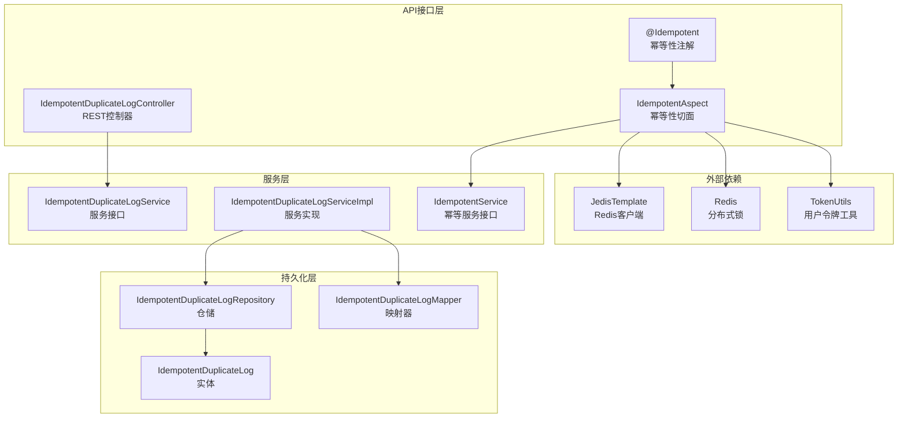
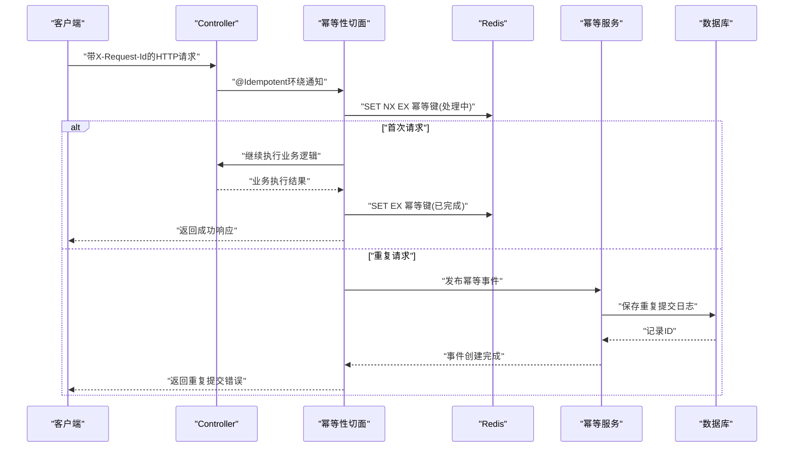
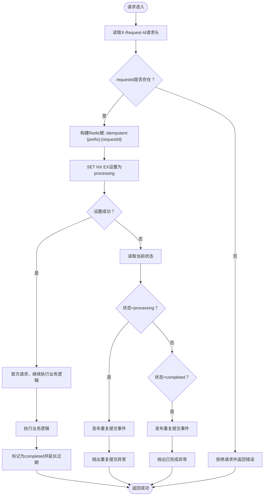
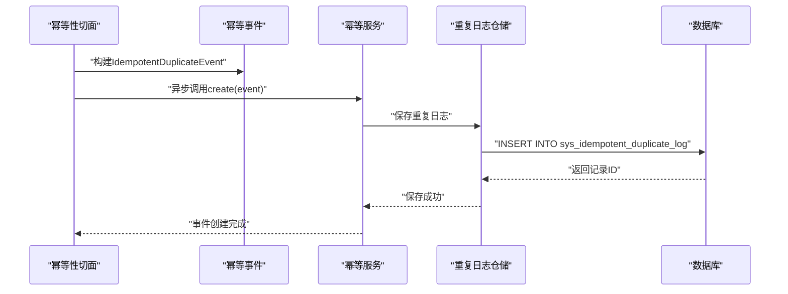
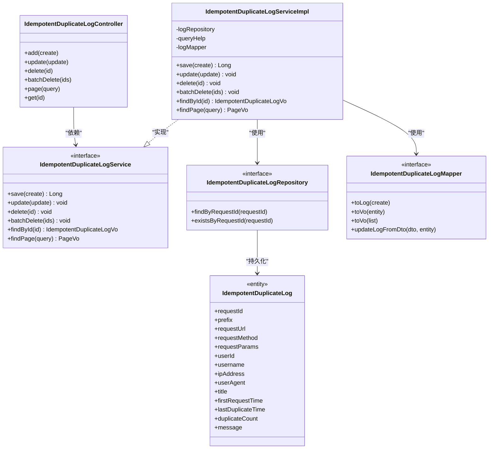

# 幂等性控制API

<cite>
**本文档引用的文件**
- [IdempotentDuplicateLogController.java](file://run-admin/src/main/java/com/fastproject/module/idempotent/controller/IdempotentDuplicateLogController.java)
- [IdempotentService.java](file://idempotent-api/src/main/java/com/fastproject/idempotent/api/IdempotentService.java)
- [IdempotentAspect.java](file://idempotent-api/src/main/java/com/fastproject/idempotent/aspect/IdempotentAspect.java)
- [Idempotent.java](file://idempotent-api/src/main/java/com/fastproject/idempotent/annotation/Idempotent.java)
- [IdempotentDuplicateEvent.java](file://idempotent-api/src/main/java/com/fastproject/idempotent/api/IdempotentDuplicateEvent.java)
- [IdempotentDuplicateLogService.java](file://idempotent-module/src/main/java/com/fastproject/idempotent/service/IdempotentDuplicateLogService.java)
- [IdempotentDuplicateLogServiceImpl.java](file://idempotent-module/src/main/java/com/fastproject/idempotent/service/impl/IdempotentDuplicateLogServiceImpl.java)
- [IdempotentDuplicateLogCreate.java](file://idempotent-module/src/main/java/com/fastproject/idempotent/vo/IdempotentDuplicateLogCreate.java)
- [IdempotentDuplicateLogQuery.java](file://idempotent-module/src/main/java/com/fastproject/idempotent/vo/IdempotentDuplicateLogQuery.java)
- [IdempotentDuplicateLogUpdate.java](file://idempotent-module/src/main/java/com/fastproject/idempotent/vo/IdempotentDuplicateLogUpdate.java)
- [IdempotentDuplicateLogVo.java](file://idempotent-module/src/main/java/com/fastproject/idempotent/vo/IdempotentDuplicateLogVo.java)
- [IdempotentDuplicateLog.java](file://idempotent-module/src/main/java/com/fastproject/idempotent/domain/IdempotentDuplicateLog.java)
- [IdempotentDuplicateLogMapper.java](file://idempotent-module/src/main/java/com/fastproject/idempotent/mapper/IdempotentDuplicateLogMapper.java)
- [IdempotentDuplicateLogRepository.java](file://idempotent-module/src/main/java/com/fastproject/idempotent/repository/db/IdempotentDuplicateLogRepository.java)
</cite>

## 目录
1. [简介](#简介)
2. [项目结构](#项目结构)
3. [核心组件](#核心组件)
4. [架构概览](#架构概览)
5. [详细组件分析](#详细组件分析)
6. [依赖关系分析](#依赖关系分析)
7. [性能考虑](#性能考虑)
8. [故障排查指南](#故障排查指南)
9. [结论](#结论)

## 简介
本文件为幂等性控制模块的完整API接口文档，涵盖幂等性控制、重复请求检测、幂等事件处理等核心功能。文档详细说明了以下内容：
- 幂等键生成策略与Redis分布式锁使用
- 重复请求检测机制与幂等事件处理流程
- 幂等重复提交记录的增删改查接口
- 幂等性在分布式系统中的应用场景与最佳实践

## 项目结构
幂等性控制模块由API接口层、注解与切面层、服务与持久化层组成，采用分层架构设计，职责清晰、耦合度低。

**图表来源**
- [IdempotentDuplicateLogController.java](file://run-admin/src/main/java/com/fastproject/module/idempotent/controller/IdempotentDuplicateLogController.java#L21-L82)
- [Idempotent.java](file://idempotent-api/src/main/java/com/fastproject/idempotent/annotation/Idempotent.java#L24-L57)
- [IdempotentAspect.java](file://idempotent-api/src/main/java/com/fastproject/idempotent/aspect/IdempotentAspect.java#L36-L211)
- [IdempotentService.java](file://idempotent-api/src/main/java/com/fastproject/idempotent/api/IdempotentService.java#L9-L19)
- [IdempotentDuplicateLogService.java](file://idempotent-module/src/main/java/com/fastproject/idempotent/service/IdempotentDuplicateLogService.java#L14-L46)
- [IdempotentDuplicateLogServiceImpl.java](file://idempotent-module/src/main/java/com/fastproject/idempotent/service/impl/IdempotentDuplicateLogServiceImpl.java#L35-L144)
- [IdempotentDuplicateLog.java](file://idempotent-module/src/main/java/com/fastproject/idempotent/domain/IdempotentDuplicateLog.java#L24-L97)
- [IdempotentDuplicateLogMapper.java](file://idempotent-module/src/main/java/com/fastproject/idempotent/mapper/IdempotentDuplicateLogMapper.java#L21-L44)
- [IdempotentDuplicateLogRepository.java](file://idempotent-module/src/main/java/com/fastproject/idempotent/repository/db/IdempotentDuplicateLogRepository.java#L14-L26)

**章节来源**
- [IdempotentDuplicateLogController.java](file://run-admin/src/main/java/com/fastproject/module/idempotent/controller/IdempotentDuplicateLogController.java#L21-L82)
- [Idempotent.java](file://idempotent-api/src/main/java/com/fastproject/idempotent/annotation/Idempotent.java#L24-L57)
- [IdempotentAspect.java](file://idempotent-api/src/main/java/com/fastproject/idempotent/aspect/IdempotentAspect.java#L36-L211)

## 核心组件
- 幂等性注解：用于标记Controller方法，基于前端生成的requestId实现分布式幂等控制。
- 幂等性切面：通过Redis实现分布式锁，检测重复请求并发布幂等事件。
- 幂等重复提交记录服务：提供记录的增删改查与分页查询能力。
- 幂等重复提交记录实体与映射：定义数据库表结构与DTO/VO转换。

**章节来源**
- [Idempotent.java](file://idempotent-api/src/main/java/com/fastproject/idempotent/annotation/Idempotent.java#L24-L57)
- [IdempotentAspect.java](file://idempotent-api/src/main/java/com/fastproject/idempotent/aspect/IdempotentAspect.java#L36-L211)
- [IdempotentDuplicateLogService.java](file://idempotent-module/src/main/java/com/fastproject/idempotent/service/IdempotentDuplicateLogService.java#L14-L46)
- [IdempotentDuplicateLog.java](file://idempotent-module/src/main/java/com/fastproject/idempotent/domain/IdempotentDuplicateLog.java#L24-L97)

## 架构概览
幂等性控制的整体流程如下：
1. 前端在请求头中携带requestId。
2. 后端通过@Idempotent注解触发幂等性切面。
3. 切面使用Redis进行分布式锁检查，判断请求是否重复。
4. 若为重复请求，发布幂等事件并记录重复提交日志；若为首次请求，则执行业务逻辑并标记完成。
5. 管理端可通过REST接口对重复提交日志进行管理。

**图表来源**
- [IdempotentAspect.java](file://idempotent-api/src/main/java/com/fastproject/idempotent/aspect/IdempotentAspect.java#L52-L117)
- [IdempotentService.java](file://idempotent-api/src/main/java/com/fastproject/idempotent/api/IdempotentService.java#L17-L18)
- [IdempotentDuplicateLogServiceImpl.java](file://idempotent-module/src/main/java/com/fastproject/idempotent/service/impl/IdempotentDuplicateLogServiceImpl.java#L42-L54)

## 详细组件分析

### REST API接口规范

#### 资源：幂等重复提交记录
- 基础路径：`/idempotent/duplicate-log`

##### 1) 新增记录
- 方法：POST
- 路径：`/idempotent/duplicate-log`
- 权限：`admin:idempotent:duplicate-log:add`
- 请求体：IdempotentDuplicateLogCreate
- 响应：ResultVo<Object>，返回新增记录ID

##### 2) 修改记录
- 方法：PUT
- 路径：`/idempotent/duplicate-log`
- 权限：`admin:idempotent:duplicate-log:update`
- 请求体：IdempotentDuplicateLogUpdate
- 响应：ResultVo<Object>，无具体数据

##### 3) 删除记录
- 方法：DELETE
- 路径：`/idempotent/duplicate-log/{id}`
- 权限：`admin:idempotent:duplicate-log:delete`
- 路径参数：id(Long)
- 响应：ResultVo<Object>，无具体数据

##### 4) 批量删除
- 方法：DELETE
- 路径：`/idempotent/duplicate-log/batch`
- 权限：`admin:idempotent:duplicate-log:delete`
- 请求体：List<Long>，记录ID列表
- 响应：ResultVo<Object>，无具体数据

##### 5) 分页查询
- 方法：POST
- 路径：`/idempotent/duplicate-log/page`
- 权限：`admin:idempotent:duplicate-log:page`
- 请求体：IdempotentDuplicateLogQuery
- 响应：ResultVo<PageVo<List<IdempotentDuplicateLogVo>>>

##### 6) 详情查询
- 方法：GET
- 路径：`/idempotent/duplicate-log/{id}`
- 权限：`admin:idempotent:duplicate-log:page`
- 路径参数：id(Long)
- 响应：ResultVo<IdempotentDuplicateLogVo>

**章节来源**
- [IdempotentDuplicateLogController.java](file://run-admin/src/main/java/com/fastproject/module/idempotent/controller/IdempotentDuplicateLogController.java#L29-L81)
- [IdempotentDuplicateLogService.java](file://idempotent-module/src/main/java/com/fastproject/idempotent/service/IdempotentDuplicateLogService.java#L19-L44)

#### 请求参数与响应格式

##### 请求体类型
- IdempotentDuplicateLogCreate：新增记录时使用的参数对象
- IdempotentDuplicateLogUpdate：更新记录时使用的参数对象
- IdempotentDuplicateLogQuery：分页查询时使用的查询条件对象

##### 响应包装
- ResultVo<T>：统一响应包装，包含状态码、消息与数据
- PageVo<List<T>>：分页响应包装，包含总数与数据列表

**章节来源**
- [IdempotentDuplicateLogCreate.java](file://idempotent-module/src/main/java/com/fastproject/idempotent/vo/IdempotentDuplicateLogCreate.java#L11-L82)
- [IdempotentDuplicateLogUpdate.java](file://idempotent-module/src/main/java/com/fastproject/idempotent/vo/IdempotentDuplicateLogUpdate.java#L11-L87)
- [IdempotentDuplicateLogQuery.java](file://idempotent-module/src/main/java/com/fastproject/idempotent/vo/IdempotentDuplicateLogQuery.java#L14-L65)

### 幂等性设计原理与Redis分布式锁

#### 幂等键生成
- 键格式：`idempotent:{prefix}:{requestId}`
- 前缀：由@Idempotent注解的prefix属性决定，默认"defalut"
- 过期时间：由expireTime属性决定，默认60秒

#### 分布式锁策略
- 首次请求：使用SET NX EX原子操作设置键值为"processing"
- 重复请求：直接读取键值，若为"processing"或"completed"则判定重复
- 完成标记：将键值设为"completed"并延长过期时间

**图表来源**
- [IdempotentAspect.java](file://idempotent-api/src/main/java/com/fastproject/idempotent/aspect/IdempotentAspect.java#L52-L117)
- [Idempotent.java](file://idempotent-api/src/main/java/com/fastproject/idempotent/annotation/Idempotent.java#L26-L40)

**章节来源**
- [IdempotentAspect.java](file://idempotent-api/src/main/java/com/fastproject/idempotent/aspect/IdempotentAspect.java#L158-L207)
- [Idempotent.java](file://idempotent-api/src/main/java/com/fastproject/idempotent/annotation/Idempotent.java#L26-L40)

### 幂等事件处理流程
- 事件对象：IdempotentDuplicateEvent，封装重复请求的关键信息
- 事件发布：在检测到重复请求时异步发布事件
- 日志记录：服务层接收事件并持久化到数据库

**图表来源**
- [IdempotentAspect.java](file://idempotent-api/src/main/java/com/fastproject/idempotent/aspect/IdempotentAspect.java#L122-L148)
- [IdempotentService.java](file://idempotent-api/src/main/java/com/fastproject/idempotent/api/IdempotentService.java#L17-L18)
- [IdempotentDuplicateLogServiceImpl.java](file://idempotent-module/src/main/java/com/fastproject/idempotent/service/impl/IdempotentDuplicateLogServiceImpl.java#L42-L54)

**章节来源**
- [IdempotentDuplicateEvent.java](file://idempotent-api/src/main/java/com/fastproject/idempotent/api/IdempotentDuplicateEvent.java#L18-L84)
- [IdempotentDuplicateLogServiceImpl.java](file://idempotent-module/src/main/java/com/fastproject/idempotent/service/impl/IdempotentDuplicateLogServiceImpl.java#L42-L54)

### 数据模型与持久化

#### 实体与字段
- 表名：sys_idempotent_duplicate_log
- 关键字段：requestId、prefix、requestUrl、requestMethod、requestParams、userId、username、ipAddress、userAgent、title、firstRequestTime、lastDuplicateTime、duplicateCount、message

#### 查询条件
支持按以下字段进行模糊或精确查询：
- requestId、prefix、requestUrl、requestMethod
- userId、username、ipAddress、title
- firstRequestTimeStart、firstRequestTimeEnd

**章节来源**
- [IdempotentDuplicateLog.java](file://idempotent-module/src/main/java/com/fastproject/idempotent/domain/IdempotentDuplicateLog.java#L24-L97)
- [IdempotentDuplicateLogQuery.java](file://idempotent-module/src/main/java/com/fastproject/idempotent/vo/IdempotentDuplicateLogQuery.java#L14-L65)
- [IdempotentDuplicateLogServiceImpl.java](file://idempotent-module/src/main/java/com/fastproject/idempotent/service/impl/IdempotentDuplicateLogServiceImpl.java#L103-L136)

## 依赖关系分析

**图表来源**
- [IdempotentDuplicateLogController.java](file://run-admin/src/main/java/com/fastproject/module/idempotent/controller/IdempotentDuplicateLogController.java#L22-L81)
- [IdempotentDuplicateLogService.java](file://idempotent-module/src/main/java/com/fastproject/idempotent/service/IdempotentDuplicateLogService.java#L14-L46)
- [IdempotentDuplicateLogServiceImpl.java](file://idempotent-module/src/main/java/com/fastproject/idempotent/service/impl/IdempotentDuplicateLogServiceImpl.java#L35-L144)
- [IdempotentDuplicateLogRepository.java](file://idempotent-module/src/main/java/com/fastproject/idempotent/repository/db/IdempotentDuplicateLogRepository.java#L14-L26)
- [IdempotentDuplicateLogMapper.java](file://idempotent-module/src/main/java/com/fastproject/idempotent/mapper/IdempotentDuplicateLogMapper.java#L21-L44)
- [IdempotentDuplicateLog.java](file://idempotent-module/src/main/java/com/fastproject/idempotent/domain/IdempotentDuplicateLog.java#L24-L97)

**章节来源**
- [IdempotentDuplicateLogController.java](file://run-admin/src/main/java/com/fastproject/module/idempotent/controller/IdempotentDuplicateLogController.java#L22-L81)
- [IdempotentDuplicateLogServiceImpl.java](file://idempotent-module/src/main/java/com/fastproject/idempotent/service/impl/IdempotentDuplicateLogServiceImpl.java#L35-L144)

## 性能考虑
- Redis原子操作：使用SET NX EX确保幂等键设置的原子性，避免竞态条件。
- 异步事件：重复请求事件采用异步发布，减少主流程阻塞。
- 分页查询：基于JPA Specification的动态查询，支持多字段组合筛选。
- 缓存策略：Redis键设置合理过期时间，避免长期占用内存。

## 故障排查指南
- 请求头缺失：若未携带X-Request-Id，将直接拒绝请求。请确保前端正确设置请求头。
- 重复提交：检测到重复请求时会抛出业务异常，提示"请求正在处理中，请勿重复提交"。
- 已完成请求：若请求已被处理完成，再次提交会提示"请求已处理完成，请勿重复提交"。
- 数据库约束：新增/更新时若请求ID已存在，将抛出"请求ID已存在"异常。

**章节来源**
- [IdempotentAspect.java](file://idempotent-api/src/main/java/com/fastproject/idempotent/aspect/IdempotentAspect.java#L68-L97)
- [IdempotentDuplicateLogServiceImpl.java](file://idempotent-module/src/main/java/com/fastproject/idempotent/service/impl/IdempotentDuplicateLogServiceImpl.java#L46-L68)

## 结论
本API文档全面覆盖了幂等性控制模块的功能与接口规范，包括：
- 幂等键生成与Redis分布式锁的实现细节
- 重复请求检测与幂等事件处理流程
- 幂等重复提交记录的完整增删改查接口
- 在分布式系统中的应用建议与最佳实践

通过严格的幂等性控制与完善的日志记录机制，系统能够有效防止重复提交带来的数据不一致问题，提升用户体验与系统稳定性。