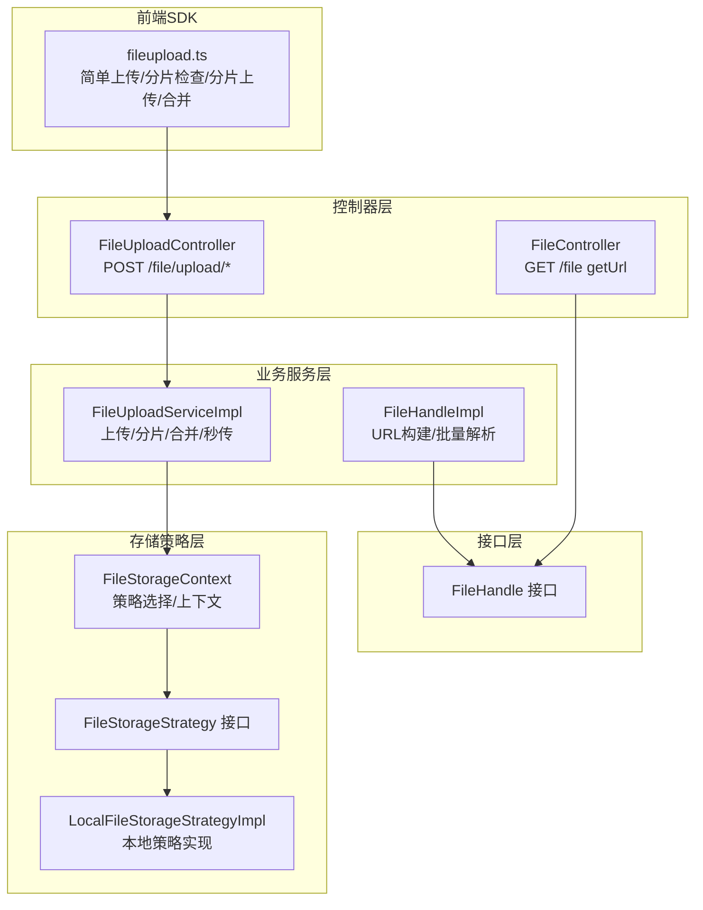
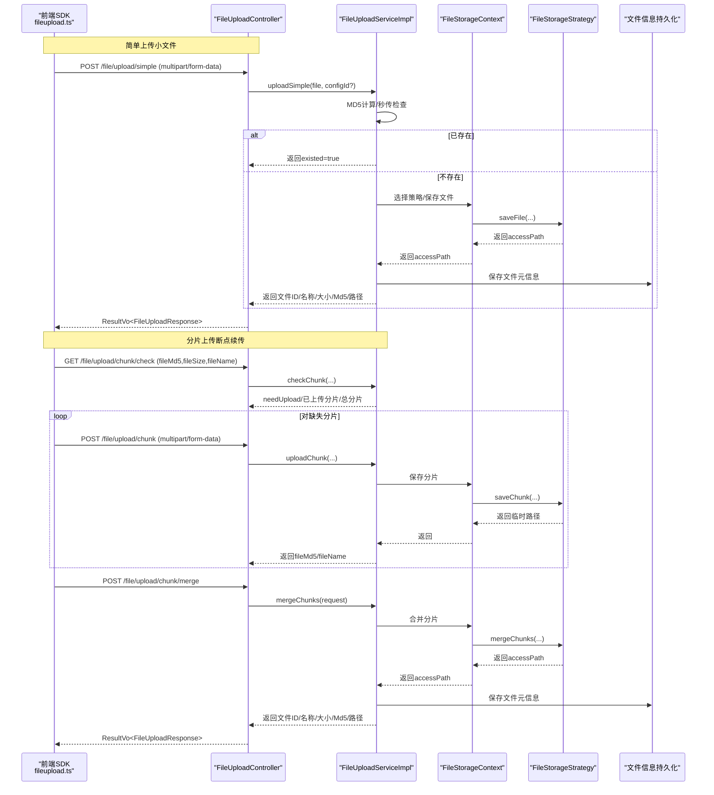
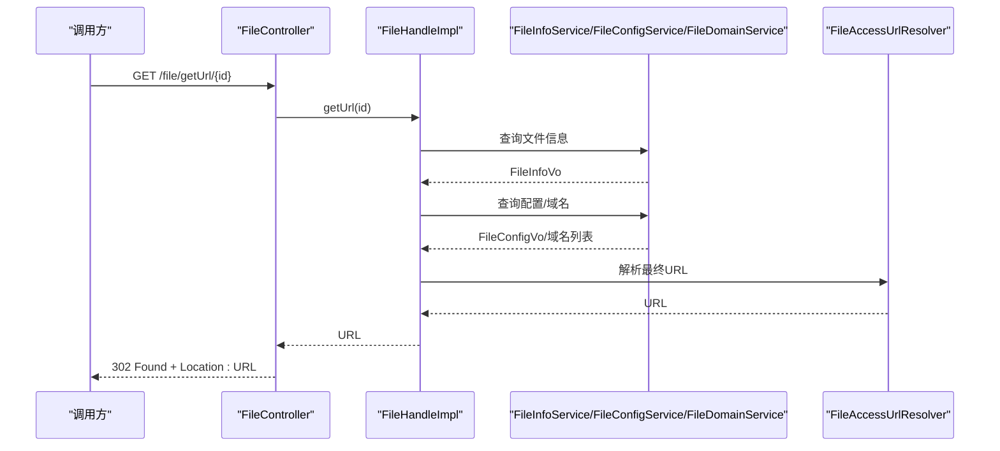
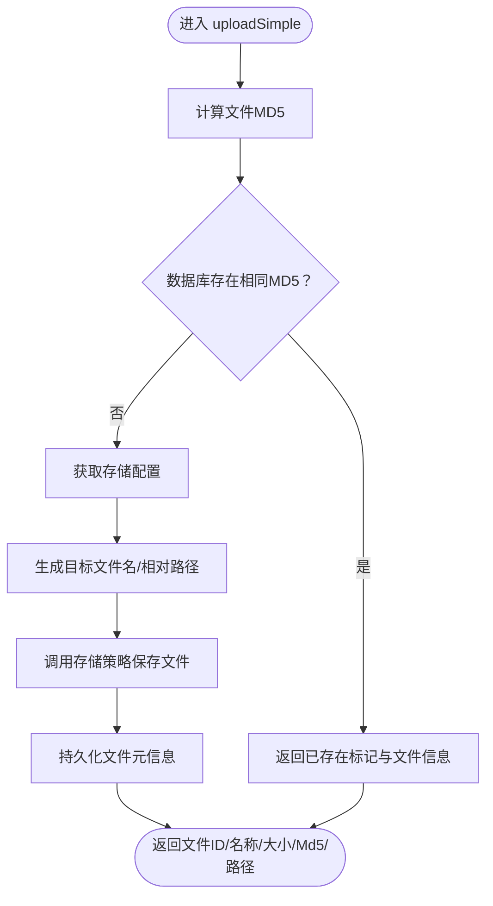
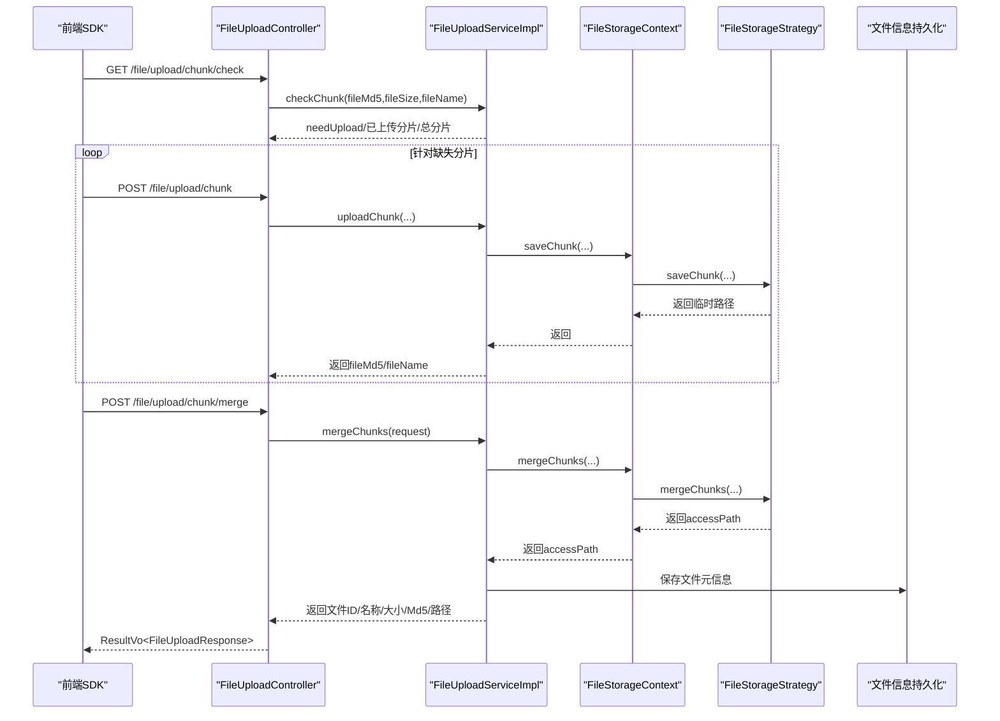
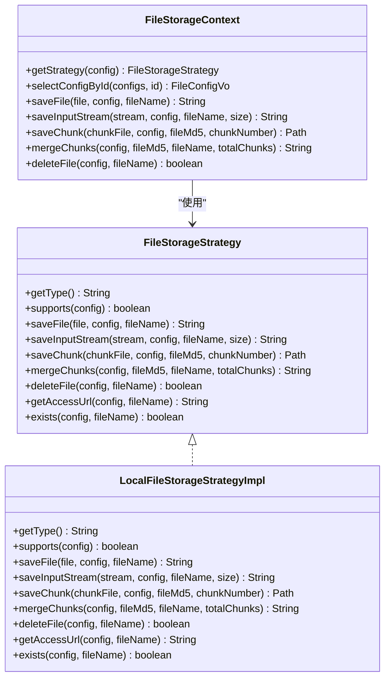
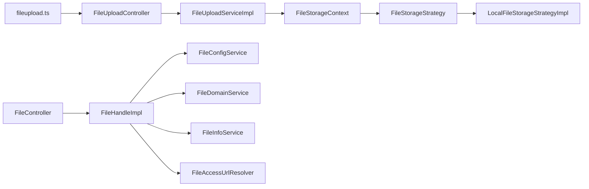

# 文件上传API

<cite>
**本文引用的文件**
- [FileHandle.java](file://file-api/src/main/java/com/fastproject/file/api/FileHandle.java)
- [FileHandleImpl.java](file://file-module/src/main/java/com/fastproject/file/api/FileHandleImpl.java)
- [FileController.java](file://run-admin/src/main/java/com/fastproject/module/file/controller/FileController.java)
- [FileUploadController.java](file://run-admin/src/main/java/com/fastproject/module/file/controller/FileUploadController.java)
- [FileUploadServiceImpl.java](file://file-module/src/main/java/com/fastproject/file/service/impl/FileUploadServiceImpl.java)
- [FileStorageStrategy.java](file://file-module/src/main/java/com/fastproject/file/storage/FileStorageStrategy.java)
- [LocalFileStorageStrategyImpl.java](file://file-module/src/main/java/com/fastproject/file/storage/impl/LocalFileStorageStrategyImpl.java)
- [FileStorageContext.java](file://file-module/src/main/java/com/fastproject/file/storage/FileStorageContext.java)
- [FileUploadResponse.java](file://file-module/src/main/java/com/fastproject/file/vo/upload/FileUploadResponse.java)
- [ChunkCheckResponse.java](file://file-module/src/main/java/com/fastproject/file/vo/upload/ChunkCheckResponse.java)
- [fileupload.ts](file://fast-ui/apps/admin-vue/src/api/file/fileupload.ts)
</cite>

## 目录
1. [简介](#简介)
2. [项目结构](#项目结构)
3. [核心组件](#核心组件)
4. [架构总览](#架构总览)
5. [详细组件分析](#详细组件分析)
6. [依赖关系分析](#依赖关系分析)
7. [性能与配置](#性能与配置)
8. [故障排查指南](#故障排查指南)
9. [结论](#结论)
10. [附录](#附录)

## 简介
本文件上传API文档面向后端与前端开发者，系统性说明文件上传、分片上传与断点续传的完整接口规范，涵盖以下能力：
- 单文件直传（小文件）
- 大文件分片上传与断点续传
- 文件访问URL生成与批量解析
- 响应数据结构、请求参数、权限控制、错误处理与进度跟踪
- 存储策略选择与配置项说明

## 项目结构
围绕文件上传功能的关键模块与职责如下：
- 接口层：对外暴露上传与URL解析接口
- 控制器层：REST API入口，负责鉴权与路由
- 业务服务层：实现上传逻辑、分片管理、秒传检测、文件类型识别与持久化
- 存储策略层：抽象统一的存储策略接口，支持本地/远程等多策略
- 前端SDK：封装上传请求、进度回调与分片流程

图表来源
- [FileController.java](file://run-admin/src/main/java/com/fastproject/module/file/controller/FileController.java#L15-L41)
- [FileUploadController.java](file://run-admin/src/main/java/com/fastproject/module/file/controller/FileUploadController.java#L18-L39)
- [FileUploadServiceImpl.java](file://file-module/src/main/java/com/fastproject/file/service/impl/FileUploadServiceImpl.java#L34-L106)
- [FileHandleImpl.java](file://file-module/src/main/java/com/fastproject/file/api/FileHandleImpl.java#L24-L104)
- [FileStorageContext.java](file://file-module/src/main/java/com/fastproject/file/storage/FileStorageContext.java#L19-L45)
- [FileStorageStrategy.java](file://file-module/src/main/java/com/fastproject/file/storage/FileStorageStrategy.java#L10-L105)
- [LocalFileStorageStrategyImpl.java](file://file-module/src/main/java/com/fastproject/file/storage/impl/LocalFileStorageStrategyImpl.java#L22-L170)
- [fileupload.ts](file://fast-ui/apps/admin-vue/src/api/file/fileupload.ts#L1-L98)

章节来源
- [FileController.java](file://run-admin/src/main/java/com/fastproject/module/file/controller/FileController.java#L15-L41)
- [FileUploadController.java](file://run-admin/src/main/java/com/fastproject/module/file/controller/FileUploadController.java#L18-L39)
- [FileUploadServiceImpl.java](file://file-module/src/main/java/com/fastproject/file/service/impl/FileUploadServiceImpl.java#L34-L106)
- [FileHandleImpl.java](file://file-module/src/main/java/com/fastproject/file/api/FileHandleImpl.java#L24-L104)
- [FileStorageContext.java](file://file-module/src/main/java/com/fastproject/file/storage/FileStorageContext.java#L19-L45)
- [FileStorageStrategy.java](file://file-module/src/main/java/com/fastproject/file/storage/FileStorageStrategy.java#L10-L105)
- [LocalFileStorageStrategyImpl.java](file://file-module/src/main/java/com/fastproject/file/storage/impl/LocalFileStorageStrategyImpl.java#L22-L170)
- [fileupload.ts](file://fast-ui/apps/admin-vue/src/api/file/fileupload.ts#L1-L98)

## 核心组件
- FileHandle 接口：提供根据文件ID获取访问URL的能力；支持单个与批量解析。
- FileUploadController：提供小文件直传、分片检查、分片上传、分片合并等接口。
- FileUploadServiceImpl：实现上传主流程，包括MD5计算、秒传判断、分片缓存、合并校验、文件类型识别与入库。
- FileStorageStrategy：统一的存储策略接口，定义保存文件、保存输入流、保存分片、合并分片、删除、访问URL、存在性检查等能力。
- LocalFileStorageStrategyImpl：本地文件存储策略的具体实现，负责落盘、分片合并、清理临时分片、生成访问URL。
- FileStorageContext：存储策略上下文，负责根据配置选择具体策略，并提供统一的保存/合并/删除等操作入口。
- 前端SDK fileupload.ts：封装简单上传、分片检查、分片上传、合并请求与进度回调。

章节来源
- [FileHandle.java](file://file-api/src/main/java/com/fastproject/file/api/FileHandle.java#L7-L21)
- [FileUploadController.java](file://run-admin/src/main/java/com/fastproject/module/file/controller/FileUploadController.java#L18-L39)
- [FileUploadServiceImpl.java](file://file-module/src/main/java/com/fastproject/file/service/impl/FileUploadServiceImpl.java#L34-L106)
- [FileStorageStrategy.java](file://file-module/src/main/java/com/fastproject/file/storage/FileStorageStrategy.java#L10-L105)
- [LocalFileStorageStrategyImpl.java](file://file-module/src/main/java/com/fastproject/file/storage/impl/LocalFileStorageStrategyImpl.java#L22-L170)
- [FileStorageContext.java](file://file-module/src/main/java/com/fastproject/file/storage/FileStorageContext.java#L19-L45)
- [fileupload.ts](file://fast-ui/apps/admin-vue/src/api/file/fileupload.ts#L1-L98)

## 架构总览
文件上传整体流程分为“简单上传”和“分片上传（含断点续传）”两条主线，二者共享统一的存储策略与文件信息持久化。

图表来源
- [FileUploadController.java](file://run-admin/src/main/java/com/fastproject/module/file/controller/FileUploadController.java#L18-L39)
- [FileUploadServiceImpl.java](file://file-module/src/main/java/com/fastproject/file/service/impl/FileUploadServiceImpl.java#L50-L106)
- [FileUploadServiceImpl.java](file://file-module/src/main/java/com/fastproject/file/service/impl/FileUploadServiceImpl.java#L108-L128)
- [FileUploadServiceImpl.java](file://file-module/src/main/java/com/fastproject/file/service/impl/FileUploadServiceImpl.java#L130-L157)
- [FileUploadServiceImpl.java](file://file-module/src/main/java/com/fastproject/file/service/impl/FileUploadServiceImpl.java#L159-L213)
- [FileStorageContext.java](file://file-module/src/main/java/com/fastproject/file/storage/FileStorageContext.java#L30-L45)
- [FileStorageStrategy.java](file://file-module/src/main/java/com/fastproject/file/storage/FileStorageStrategy.java#L31-L76)

## 详细组件分析

### 1) 文件访问URL解析（FileHandle）
- 单个ID解析：根据文件ID查询文件信息，结合存储配置与域名解析出最终访问URL。
- 批量ID解析：批量查询文件信息，按配置分组批量加载配置与域名，组装返回集合。

图表来源
- [FileController.java](file://run-admin/src/main/java/com/fastproject/module/file/controller/FileController.java#L22-L40)
- [FileHandleImpl.java](file://file-module/src/main/java/com/fastproject/file/api/FileHandleImpl.java#L33-L102)

章节来源
- [FileHandle.java](file://file-api/src/main/java/com/fastproject/file/api/FileHandle.java#L7-L21)
- [FileHandleImpl.java](file://file-module/src/main/java/com/fastproject/file/api/FileHandleImpl.java#L24-L104)
- [FileController.java](file://run-admin/src/main/java/com/fastproject/module/file/controller/FileController.java#L15-L41)

### 2) 简单上传（小文件直传）
- 请求
  - 方法：POST
  - 路径：/file/upload/simple
  - 权限：需具备上传权限
  - 表单字段：
    - file：必填，文件对象
    - configId：可选，存储配置ID
- 响应
  - data：FileUploadResponse
- 流程要点
  - 先进行MD5计算并尝试“秒传”：若数据库中存在相同MD5的文件，则直接返回已存在标记与文件信息
  - 若不存在，则选择存储配置，生成目标文件名与路径，调用存储策略保存，随后持久化文件元信息

图表来源
- [FileUploadServiceImpl.java](file://file-module/src/main/java/com/fastproject/file/service/impl/FileUploadServiceImpl.java#L50-L106)

章节来源
- [FileUploadController.java](file://run-admin/src/main/java/com/fastproject/module/file/controller/FileUploadController.java#L26-L39)
- [FileUploadServiceImpl.java](file://file-module/src/main/java/com/fastproject/file/service/impl/FileUploadServiceImpl.java#L50-L106)
- [FileUploadResponse.java](file://file-module/src/main/java/com/fastproject/file/vo/upload/FileUploadResponse.java#L8-L64)

### 3) 分片上传与断点续传
- 分片检查（秒传检查）
  - 请求
    - 方法：GET
    - 路径：/file/upload/chunk/check
    - 参数：fileMd5、fileSize、fileName
  - 响应：ChunkCheckResponse
    - needUpload：是否需要上传
    - fileId：若已存在则返回文件ID
    - uploadedChunks：已上传分片序号列表
    - totalChunks：总分片数
- 单个分片上传
  - 请求
    - 方法：POST
    - 路径：/file/upload/chunk
    - 表单字段：file、fileMd5、fileName、fileSize、fileType、chunkNumber、totalChunks、chunkSize、configId（可选）
  - 响应：FileUploadResponse（包含fileMd5、fileName）
- 分片合并
  - 请求
    - 方法：POST
    - 路径：/file/upload/chunk/merge
    - 表单字段：fileMd5、fileName、fileSize、fileType、totalChunks、configId（可选）
  - 响应：FileUploadResponse（包含文件ID/名称/大小/Md5/路径）

图表来源
- [FileUploadController.java](file://run-admin/src/main/java/com/fastproject/module/file/controller/FileUploadController.java#L18-L39)
- [FileUploadServiceImpl.java](file://file-module/src/main/java/com/fastproject/file/service/impl/FileUploadServiceImpl.java#L108-L128)
- [FileUploadServiceImpl.java](file://file-module/src/main/java/com/fastproject/file/service/impl/FileUploadServiceImpl.java#L130-L157)
- [FileUploadServiceImpl.java](file://file-module/src/main/java/com/fastproject/file/service/impl/FileUploadServiceImpl.java#L159-L213)
- [ChunkCheckResponse.java](file://file-module/src/main/java/com/fastproject/file/vo/upload/ChunkCheckResponse.java#L10-L48)
- [FileUploadResponse.java](file://file-module/src/main/java/com/fastproject/file/vo/upload/FileUploadResponse.java#L8-L64)

章节来源
- [FileUploadController.java](file://run-admin/src/main/java/com/fastproject/module/file/controller/FileUploadController.java#L18-L39)
- [FileUploadServiceImpl.java](file://file-module/src/main/java/com/fastproject/file/service/impl/FileUploadServiceImpl.java#L108-L128)
- [FileUploadServiceImpl.java](file://file-module/src/main/java/com/fastproject/file/service/impl/FileUploadServiceImpl.java#L130-L157)
- [FileUploadServiceImpl.java](file://file-module/src/main/java/com/fastproject/file/service/impl/FileUploadServiceImpl.java#L159-L213)
- [ChunkCheckResponse.java](file://file-module/src/main/java/com/fastproject/file/vo/upload/ChunkCheckResponse.java#L10-L48)
- [FileUploadResponse.java](file://file-module/src/main/java/com/fastproject/file/vo/upload/FileUploadResponse.java#L8-L64)

### 4) 存储策略与配置
- 存储策略接口 FileStorageStrategy
  - 支持类型标识、配置匹配、保存文件/输入流、保存分片、合并分片、删除、访问URL、存在性检查
- 本地存储策略 LocalFileStorageStrategyImpl
  - 类型标识：localFileStorageStrategy
  - 功能：本地文件写入、分片保存与合并、访问URL拼接、删除、存在性检查
- 存储上下文 FileStorageContext
  - 根据配置选择策略，提供统一的保存/合并/删除入口，并维护配置缓存

图表来源
- [FileStorageStrategy.java](file://file-module/src/main/java/com/fastproject/file/storage/FileStorageStrategy.java#L10-L105)
- [LocalFileStorageStrategyImpl.java](file://file-module/src/main/java/com/fastproject/file/storage/impl/LocalFileStorageStrategyImpl.java#L22-L170)
- [FileStorageContext.java](file://file-module/src/main/java/com/fastproject/file/storage/FileStorageContext.java#L19-L45)

章节来源
- [FileStorageStrategy.java](file://file-module/src/main/java/com/fastproject/file/storage/FileStorageStrategy.java#L10-L105)
- [LocalFileStorageStrategyImpl.java](file://file-module/src/main/java/com/fastproject/file/storage/impl/LocalFileStorageStrategyImpl.java#L22-L170)
- [FileStorageContext.java](file://file-module/src/main/java/com/fastproject/file/storage/FileStorageContext.java#L19-L45)

### 5) 前端集成与进度跟踪
- 简单上传：通过FormData提交文件与可选配置ID，支持onUploadProgress回调计算百分比
- 分片检查：GET请求携带fileMd5、fileSize、fileName，返回needUpload与已上传分片列表
- 分片上传：逐片提交，包含fileMd5、fileName、fileSize、fileType、chunkNumber、totalChunks、chunkSize、configId（可选）
- 分片合并：提交合并请求，包含fileMd5、fileName、fileSize、fileType、totalChunks、configId（可选）

章节来源
- [fileupload.ts](file://fast-ui/apps/admin-vue/src/api/file/fileupload.ts#L1-L98)

## 依赖关系分析
- 控制器依赖服务：FileUploadController依赖FileUploadServiceImpl；FileController依赖FileHandle
- 服务依赖存储上下文：FileUploadServiceImpl通过FileStorageContext调用具体存储策略
- 存储策略依赖配置与路径工具：LocalFileStorageStrategyImpl依赖FileConfigVo与FileStoragePathHelper
- 前端SDK依赖控制器：fileupload.ts调用各上传接口并处理进度

图表来源
- [FileUploadController.java](file://run-admin/src/main/java/com/fastproject/module/file/controller/FileUploadController.java#L18-L39)
- [FileUploadServiceImpl.java](file://file-module/src/main/java/com/fastproject/file/service/impl/FileUploadServiceImpl.java#L34-L106)
- [FileStorageContext.java](file://file-module/src/main/java/com/fastproject/file/storage/FileStorageContext.java#L19-L45)
- [FileStorageStrategy.java](file://file-module/src/main/java/com/fastproject/file/storage/FileStorageStrategy.java#L10-L105)
- [LocalFileStorageStrategyImpl.java](file://file-module/src/main/java/com/fastproject/file/storage/impl/LocalFileStorageStrategyImpl.java#L22-L170)
- [FileController.java](file://run-admin/src/main/java/com/fastproject/module/file/controller/FileController.java#L15-L41)
- [FileHandleImpl.java](file://file-module/src/main/java/com/fastproject/file/api/FileHandleImpl.java#L24-L104)

章节来源
- [FileUploadController.java](file://run-admin/src/main/java/com/fastproject/module/file/controller/FileUploadController.java#L18-L39)
- [FileUploadServiceImpl.java](file://file-module/src/main/java/com/fastproject/file/service/impl/FileUploadServiceImpl.java#L34-L106)
- [FileStorageContext.java](file://file-module/src/main/java/com/fastproject/file/storage/FileStorageContext.java#L19-L45)
- [FileStorageStrategy.java](file://file-module/src/main/java/com/fastproject/file/storage/FileStorageStrategy.java#L10-L105)
- [LocalFileStorageStrategyImpl.java](file://file-module/src/main/java/com/fastproject/file/storage/impl/LocalFileStorageStrategyImpl.java#L22-L170)
- [FileController.java](file://run-admin/src/main/java/com/fastproject/module/file/controller/FileController.java#L15-L41)
- [FileHandleImpl.java](file://file-module/src/main/java/com/fastproject/file/api/FileHandleImpl.java#L24-L104)

## 性能与配置
- 分片大小：默认5MB（可在服务实现中调整）
- 并发与缓存：服务内部使用并发安全的分片集合缓存，提升分片检查效率
- 存储策略：通过FileStorageContext按配置动态选择策略，支持本地与远程存储
- 文件类型：自动识别扩展名并创建或复用文件类型记录，便于后续分类与统计
- 进度跟踪：前端SDK提供onUploadProgress回调，基于loaded/total计算百分比

章节来源
- [FileUploadServiceImpl.java](file://file-module/src/main/java/com/fastproject/file/service/impl/FileUploadServiceImpl.java#L44-L48)
- [FileUploadServiceImpl.java](file://file-module/src/main/java/com/fastproject/file/service/impl/FileUploadServiceImpl.java#L305-L333)
- [fileupload.ts](file://fast-ui/apps/admin-vue/src/api/file/fileupload.ts#L63-L69)

## 故障排查指南
- 无可用存储配置
  - 现象：获取配置时抛出异常
  - 处理：确认系统中存在启用的存储配置
- 不支持的存储类型
  - 现象：策略选择阶段抛出异常
  - 处理：核对配置type与策略实现类型一致
- 本地存储路径为空
  - 现象：保存文件时报错
  - 处理：确保配置中storagePath已正确设置且末尾带分隔符
- 分片未全部上传即合并
  - 现象：合并阶段抛出异常
  - 处理：先执行分片检查，补齐缺失分片后再合并
- 秒传命中但URL解析失败
  - 现象：返回已存在但URL为空
  - 处理：检查文件访问域名与存储路径配置

章节来源
- [FileUploadServiceImpl.java](file://file-module/src/main/java/com/fastproject/file/service/impl/FileUploadServiceImpl.java#L229-L235)
- [FileStorageContext.java](file://file-module/src/main/java/com/fastproject/file/storage/FileStorageContext.java#L36-L45)
- [LocalFileStorageStrategyImpl.java](file://file-module/src/main/java/com/fastproject/file/storage/impl/LocalFileStorageStrategyImpl.java#L158-L167)
- [FileUploadServiceImpl.java](file://file-module/src/main/java/com/fastproject/file/service/impl/FileUploadServiceImpl.java#L167-L171)
- [FileController.java](file://run-admin/src/main/java/com/fastproject/module/file/controller/FileController.java#L31-L39)

## 结论
本文件上传API以清晰的分层设计实现了简单上传与分片上传两大场景，配合统一的存储策略与URL解析能力，满足中小规模到大文件的多样化需求。通过前端SDK与后端接口的协同，可便捷地实现进度跟踪、断点续传与秒传优化。

## 附录

### A. 接口清单与参数说明
- 获取文件URL（单个）
  - 方法：GET
  - 路径：/file/getUrl/{id}
  - 权限：无硬性要求（由业务决定）
  - 响应：302 Found + Location: URL
- 小文件直传
  - 方法：POST
  - 路径：/file/upload/simple
  - 权限：需具备上传权限
  - 表单字段：file（必填）、configId（可选）
- 分片检查（秒传检查）
  - 方法：GET
  - 路径：/file/upload/chunk/check
  - 参数：fileMd5、fileSize、fileName
  - 响应：needUpload、fileId（可选）、uploadedChunks、totalChunks
- 分片上传
  - 方法：POST
  - 路径：/file/upload/chunk
  - 表单字段：file（必填）、fileMd5、fileName、fileSize、fileType、chunkNumber、totalChunks、chunkSize、configId（可选）
- 分片合并
  - 方法：POST
  - 路径：/file/upload/chunk/merge
  - 表单字段：fileMd5、fileName、fileSize、fileType、totalChunks、configId（可选）

章节来源
- [FileController.java](file://run-admin/src/main/java/com/fastproject/module/file/controller/FileController.java#L22-L40)
- [FileUploadController.java](file://run-admin/src/main/java/com/fastproject/module/file/controller/FileUploadController.java#L26-L39)
- [FileUploadServiceImpl.java](file://file-module/src/main/java/com/fastproject/file/service/impl/FileUploadServiceImpl.java#L108-L128)
- [FileUploadServiceImpl.java](file://file-module/src/main/java/com/fastproject/file/service/impl/FileUploadServiceImpl.java#L130-L157)
- [FileUploadServiceImpl.java](file://file-module/src/main/java/com/fastproject/file/service/impl/FileUploadServiceImpl.java#L159-L213)

### B. 数据模型与响应结构
- FileUploadResponse
  - 字段：fileId、fileName、fileSize、fileMd5、accessPath、existed、uploadedChunks
- ChunkCheckResponse
  - 字段：needUpload、fileId（可选）、uploadedChunks、totalChunks

章节来源
- [FileUploadResponse.java](file://file-module/src/main/java/com/fastproject/file/vo/upload/FileUploadResponse.java#L8-L64)
- [ChunkCheckResponse.java](file://file-module/src/main/java/com/fastproject/file/vo/upload/ChunkCheckResponse.java#L10-L48)