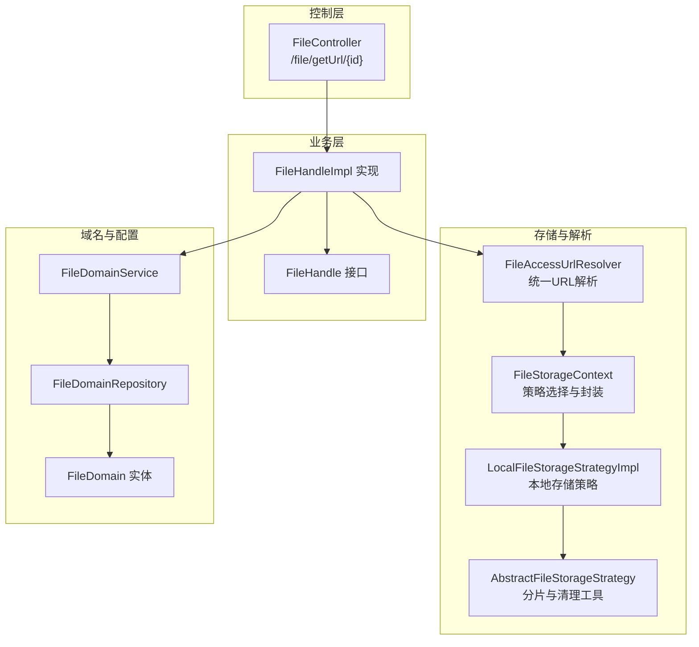
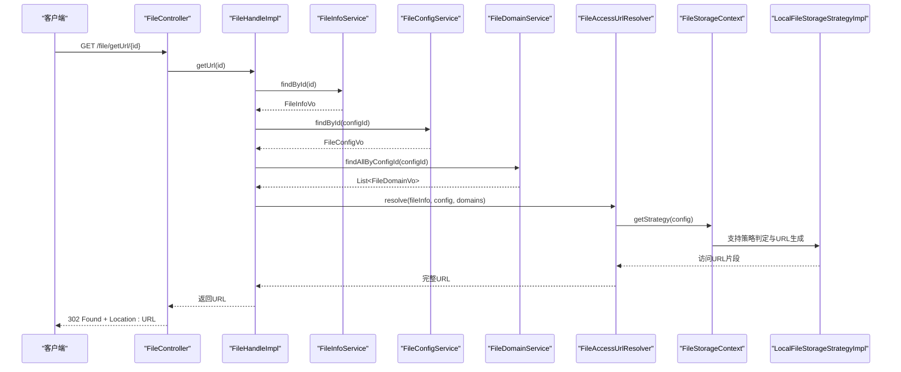
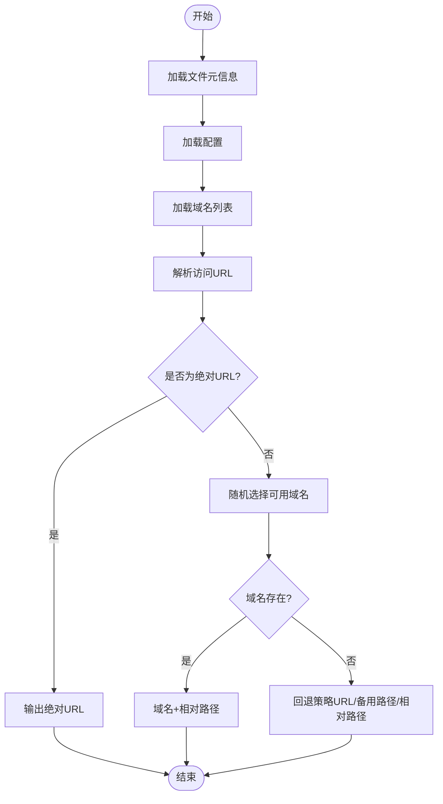
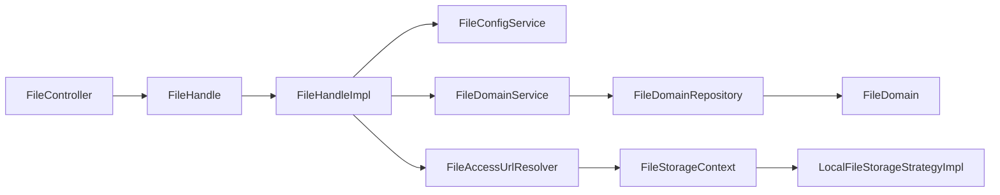

# 文件下载API

<cite>
**本文引用的文件**
- [run-admin/src/main/java/com/fastproject/module/file/controller/FileController.java](file://run-admin/src/main/java/com/fastproject/module/file/controller/FileController.java)
- [file-api/src/main/java/com/fastproject/file/api/FileHandle.java](file://file-api/src/main/java/com/fastproject/file/api/FileHandle.java)
- [file-module/src/main/java/com/fastproject/file/api/FileHandleImpl.java](file://file-module/src/main/java/com/fastproject/file/api/FileHandleImpl.java)
- [file-module/src/main/java/com/fastproject/file/storage/FileAccessUrlResolver.java](file://file-module/src/main/java/com/fastproject/file/storage/FileAccessUrlResolver.java)
- [file-module/src/main/java/com/fastproject/file/storage/FileStorageContext.java](file://file-module/src/main/java/com/fastproject/file/storage/FileStorageContext.java)
- [file-module/src/main/java/com/fastproject/file/storage/impl/LocalFileStorageStrategyImpl.java](file://file-module/src/main/java/com/fastproject/file/storage/impl/LocalFileStorageStrategyImpl.java)
- [file-module/src/main/java/com/fastproject/file/storage/AbstractFileStorageStrategy.java](file://file-module/src/main/java/com/fastproject/file/storage/AbstractFileStorageStrategy.java)
- [file-module/src/main/java/com/fastproject/file/service/FileDomainService.java](file://file-module/src/main/java/com/fastproject/file/service/FileDomainService.java)
- [file-module/src/main/java/com/fastproject/file/repository/db/FileDomainRepository.java](file://file-module/src/main/java/com/fastproject/file/repository/db/FileDomainRepository.java)
- [file-module/src/main/java/com/fastproject/file/domain/FileDomain.java](file://file-module/src/main/java/com/fastproject/file/domain/FileDomain.java)
- [file-api/src/main/java/com/fastproject/file/vo/FileUrlVo.java](file://file-api/src/main/java/com/fastproject/file/vo/FileUrlVo.java)
- [fast-ui/apps/admin-vue/src/api/file/fileinfo.ts](file://fast-ui/apps/admin-vue/src/api/file/fileinfo.ts)
</cite>

## 目录
1. [简介](#简介)
2. [项目结构](#项目结构)
3. [核心组件](#核心组件)
4. [架构总览](#架构总览)
5. [详细组件分析](#详细组件分析)
6. [依赖关系分析](#依赖关系分析)
7. [性能考量](#性能考量)
8. [故障排查指南](#故障排查指南)
9. [结论](#结论)
10. [附录](#附录)

## 简介
本文件下载API文档面向后端服务与前端调用方，系统性说明文件下载接口的HTTP方法、URL路径、请求参数、响应格式与行为；覆盖直接下载、带权限验证的下载、批量URL生成等场景；并阐述文件访问控制、域名与存储策略解析、以及下载统计与文件信息管理的相关接口与流程。

## 项目结构
围绕文件下载能力的关键模块与文件如下：
- 控制层：/file 路由下的下载入口
- 业务层：FileHandle 接口及实现，负责根据文件ID生成可访问URL
- 存储层：FileAccessUrlResolver 统一解析访问URL，结合 FileStorageContext 与具体存储策略
- 域名与配置：FileDomainService/Repository/Domain 管理域名与状态
- 前端对接：admin-vue 中的文件信息与类型统计API

图表来源
- [run-admin/src/main/java/com/fastproject/module/file/controller/FileController.java](file://run-admin/src/main/java/com/fastproject/module/file/controller/FileController.java#L1-L41)
- [file-module/src/main/java/com/fastproject/file/api/FileHandleImpl.java](file://file-module/src/main/java/com/fastproject/file/api/FileHandleImpl.java#L1-L103)
- [file-module/src/main/java/com/fastproject/file/storage/FileAccessUrlResolver.java](file://file-module/src/main/java/com/fastproject/file/storage/FileAccessUrlResolver.java#L1-L76)
- [file-module/src/main/java/com/fastproject/file/storage/FileStorageContext.java](file://file-module/src/main/java/com/fastproject/file/storage/FileStorageContext.java#L1-L128)
- [file-module/src/main/java/com/fastproject/file/storage/impl/LocalFileStorageStrategyImpl.java](file://file-module/src/main/java/com/fastproject/file/storage/impl/LocalFileStorageStrategyImpl.java#L1-L170)
- [file-module/src/main/java/com/fastproject/file/storage/AbstractFileStorageStrategy.java](file://file-module/src/main/java/com/fastproject/file/storage/AbstractFileStorageStrategy.java#L1-L59)
- [file-module/src/main/java/com/fastproject/file/service/FileDomainService.java](file://file-module/src/main/java/com/fastproject/file/service/FileDomainService.java#L1-L66)
- [file-module/src/main/java/com/fastproject/file/repository/db/FileDomainRepository.java](file://file-module/src/main/java/com/fastproject/file/repository/db/FileDomainRepository.java#L1-L42)
- [file-module/src/main/java/com/fastproject/file/domain/FileDomain.java](file://file-module/src/main/java/com/fastproject/file/domain/FileDomain.java#L1-L34)

章节来源
- [run-admin/src/main/java/com/fastproject/module/file/controller/FileController.java](file://run-admin/src/main/java/com/fastproject/module/file/controller/FileController.java#L1-L41)
- [file-module/src/main/java/com/fastproject/file/api/FileHandleImpl.java](file://file-module/src/main/java/com/fastproject/file/api/FileHandleImpl.java#L1-L103)

## 核心组件
- 下载控制器：提供对外HTTP接口，接收文件ID并返回重定向URL
- 文件处理器：根据文件ID查询元信息，组装访问URL
- URL解析器：综合配置、域名与存储策略，生成最终可访问URL
- 存储上下文：选择具体存储策略并封装常用操作
- 本地存储策略：实现本地文件访问URL拼接与分片合并
- 域名服务：提供域名的增删改查与启用状态管理

章节来源
- [file-api/src/main/java/com/fastproject/file/api/FileHandle.java](file://file-api/src/main/java/com/fastproject/file/api/FileHandle.java#L1-L22)
- [file-module/src/main/java/com/fastproject/file/storage/FileAccessUrlResolver.java](file://file-module/src/main/java/com/fastproject/file/storage/FileAccessUrlResolver.java#L1-L76)
- [file-module/src/main/java/com/fastproject/file/storage/FileStorageContext.java](file://file-module/src/main/java/com/fastproject/file/storage/FileStorageContext.java#L1-L128)
- [file-module/src/main/java/com/fastproject/file/storage/impl/LocalFileStorageStrategyImpl.java](file://file-module/src/main/java/com/fastproject/file/storage/impl/LocalFileStorageStrategyImpl.java#L1-L170)

## 架构总览
文件下载从HTTP请求到最终URL生成的端到端流程如下：

图表来源
- [run-admin/src/main/java/com/fastproject/module/file/controller/FileController.java](file://run-admin/src/main/java/com/fastproject/module/file/controller/FileController.java#L22-L40)
- [file-module/src/main/java/com/fastproject/file/api/FileHandleImpl.java](file://file-module/src/main/java/com/fastproject/file/api/FileHandleImpl.java#L33-L102)
- [file-module/src/main/java/com/fastproject/file/storage/FileAccessUrlResolver.java](file://file-module/src/main/java/com/fastproject/file/storage/FileAccessUrlResolver.java#L24-L58)
- [file-module/src/main/java/com/fastproject/file/storage/FileStorageContext.java](file://file-module/src/main/java/com/fastproject/file/storage/FileStorageContext.java#L36-L45)
- [file-module/src/main/java/com/fastproject/file/storage/impl/LocalFileStorageStrategyImpl.java](file://file-module/src/main/java/com/fastproject/file/storage/impl/LocalFileStorageStrategyImpl.java#L140-L146)

## 详细组件分析

### 下载接口定义
- 路径：/file/getUrl/{id}
- 方法：GET
- 请求参数：
  - 路径变量 id：文件ID（字符串形式）
- 成功响应：
  - 状态码：302 Found
  - 响应头：Location 为可访问URL
- 异常与错误：
  - 当URL为空或无效时，返回404 Not Found

章节来源
- [run-admin/src/main/java/com/fastproject/module/file/controller/FileController.java](file://run-admin/src/main/java/com/fastproject/module/file/controller/FileController.java#L22-L40)

### URL生成与解析流程
- 输入：文件ID（字符串）
- 步骤：
  1) 根据ID查询文件元信息
  2) 查询所属配置与域名列表
  3) 使用解析器按优先级拼接URL：
     - 若策略返回绝对URL则直接使用
     - 否则随机选择可用域名前缀
     - 再回退到策略URL或备用访问路径
     - 最终回退到规范化相对路径
- 输出：可直接访问的URL字符串

图表来源
- [file-module/src/main/java/com/fastproject/file/api/FileHandleImpl.java](file://file-module/src/main/java/com/fastproject/file/api/FileHandleImpl.java#L85-L102)
- [file-module/src/main/java/com/fastproject/file/storage/FileAccessUrlResolver.java](file://file-module/src/main/java/com/fastproject/file/storage/FileAccessUrlResolver.java#L24-L58)

章节来源
- [file-module/src/main/java/com/fastproject/file/api/FileHandleImpl.java](file://file-module/src/main/java/com/fastproject/file/api/FileHandleImpl.java#L33-L102)
- [file-module/src/main/java/com/fastproject/file/storage/FileAccessUrlResolver.java](file://file-module/src/main/java/com/fastproject/file/storage/FileAccessUrlResolver.java#L24-L58)

### 权限验证与安全控制
- 当前下载接口未在控制器层进行权限校验（未见注解如 @PreAuthorize），建议在生产环境对公开下载接口增加鉴权与授权控制，例如基于角色或资源权限的校验。
- 建议在业务层或解析层增加访问控制逻辑，如：
  - 校验文件状态与可见性
  - 校验当前用户与文件归属关系
  - 校验下载频次与白名单限制

章节来源
- [run-admin/src/main/java/com/fastproject/module/file/controller/FileController.java](file://run-admin/src/main/java/com/fastproject/module/file/controller/FileController.java#L1-L41)

### 批量URL生成
- 接口职责：根据一组文件ID批量生成可访问URL集合
- 返回值：包含每个文件ID与其对应URL的集合对象
- 适用场景：列表页或批量导出场景，减少多次请求

章节来源
- [file-api/src/main/java/com/fastproject/file/api/FileHandle.java](file://file-api/src/main/java/com/fastproject/file/api/FileHandle.java#L15-L21)
- [file-module/src/main/java/com/fastproject/file/api/FileHandleImpl.java](file://file-module/src/main/java/com/fastproject/file/api/FileHandleImpl.java#L39-L83)
- [file-api/src/main/java/com/fastproject/file/vo/FileUrlVo.java](file://file-api/src/main/java/com/fastproject/file/vo/FileUrlVo.java#L1-L16)

### 存储策略与访问URL
- 存储策略选择：通过配置类型匹配具体策略
- 本地存储策略：
  - 访问URL拼接规则：若配置中提供访问域则以域名为前缀，否则默认前缀“/uploads”
  - 支持分片上传与合并，并清理临时分片目录
- 抽象策略基类提供分片临时目录与清理能力

章节来源
- [file-module/src/main/java/com/fastproject/file/storage/FileStorageContext.java](file://file-module/src/main/java/com/fastproject/file/storage/FileStorageContext.java#L36-L45)
- [file-module/src/main/java/com/fastproject/file/storage/impl/LocalFileStorageStrategyImpl.java](file://file-module/src/main/java/com/fastproject/file/storage/impl/LocalFileStorageStrategyImpl.java#L140-L146)
- [file-module/src/main/java/com/fastproject/file/storage/AbstractFileStorageStrategy.java](file://file-module/src/main/java/com/fastproject/file/storage/AbstractFileStorageStrategy.java#L17-L57)

### 域名管理与访问控制
- 域名实体包含配置ID、域名与状态字段
- 服务层提供：
  - 新增、修改、删除、批量删除
  - 分页查询、按域名查询、按配置ID查询
  - 获取启用域名列表
- 控制器层提供域名管理接口（用于后台配置），前端可通过该接口维护域名与状态

章节来源
- [file-module/src/main/java/com/fastproject/file/domain/FileDomain.java](file://file-module/src/main/java/com/fastproject/file/domain/FileDomain.java#L1-L34)
- [file-module/src/main/java/com/fastproject/file/service/FileDomainService.java](file://file-module/src/main/java/com/fastproject/file/service/FileDomainService.java#L1-L66)
- [file-module/src/main/java/com/fastproject/file/repository/db/FileDomainRepository.java](file://file-module/src/main/java/com/fastproject/file/repository/db/FileDomainRepository.java#L1-L42)

### 文件访问控制与下载统计
- 文件信息管理：
  - 类型统计接口：提供文件类型分布与占用空间统计
  - 分页查询、详情查询、新增与更新接口
- 建议在下载链路中集成：
  - 下载次数统计与日志
  - IP与用户维度的访问审计
  - 限速与黑名单控制

章节来源
- [fast-ui/apps/admin-vue/src/api/file/fileinfo.ts](file://fast-ui/apps/admin-vue/src/api/file/fileinfo.ts#L55-L75)

## 依赖关系分析
- 控制器依赖业务接口，业务实现依赖配置、域名与URL解析器
- URL解析器依赖存储上下文与路径助手，存储上下文再选择具体存储策略
- 域名服务与仓库配合，支撑域名的可用性与状态控制

图表来源
- [run-admin/src/main/java/com/fastproject/module/file/controller/FileController.java](file://run-admin/src/main/java/com/fastproject/module/file/controller/FileController.java#L1-L41)
- [file-module/src/main/java/com/fastproject/file/api/FileHandleImpl.java](file://file-module/src/main/java/com/fastproject/file/api/FileHandleImpl.java#L1-L103)
- [file-module/src/main/java/com/fastproject/file/storage/FileAccessUrlResolver.java](file://file-module/src/main/java/com/fastproject/file/storage/FileAccessUrlResolver.java#L1-L76)
- [file-module/src/main/java/com/fastproject/file/storage/FileStorageContext.java](file://file-module/src/main/java/com/fastproject/file/storage/FileStorageContext.java#L1-L128)
- [file-module/src/main/java/com/fastproject/file/storage/impl/LocalFileStorageStrategyImpl.java](file://file-module/src/main/java/com/fastproject/file/storage/impl/LocalFileStorageStrategyImpl.java#L1-L170)
- [file-module/src/main/java/com/fastproject/file/service/FileDomainService.java](file://file-module/src/main/java/com/fastproject/file/service/FileDomainService.java#L1-L66)
- [file-module/src/main/java/com/fastproject/file/repository/db/FileDomainRepository.java](file://file-module/src/main/java/com/fastproject/file/repository/db/FileDomainRepository.java#L1-L42)
- [file-module/src/main/java/com/fastproject/file/domain/FileDomain.java](file://file-module/src/main/java/com/fastproject/file/domain/FileDomain.java#L1-L34)

## 性能考量
- URL生成采用一次性查询文件元信息与配置/域名，批量接口按配置ID分组减少重复查询
- 域名选择使用随机算法，可在高并发下降低单点压力
- 本地存储策略支持分片上传与合并，适合大文件场景
- 建议：
  - 对热点文件ID进行缓存
  - 对URL生成结果进行短期缓存
  - 对域名列表与配置进行本地缓存或定期刷新

## 故障排查指南
- 404 Not Found：
  - 可能原因：文件ID无效、URL为空或解析失败
  - 处理建议：检查文件是否存在、配置与域名状态、解析器回退路径
- 302 Found 但无法访问：
  - 可能原因：域名不可用、访问域配置错误、存储路径异常
  - 处理建议：确认域名状态、访问域配置、存储根路径与权限
- 批量接口无结果：
  - 可能原因：传入ID为空、文件不存在、配置缺失
  - 处理建议：校验ID集合、检查文件与配置状态

章节来源
- [run-admin/src/main/java/com/fastproject/module/file/controller/FileController.java](file://run-admin/src/main/java/com/fastproject/module/file/controller/FileController.java#L31-L40)
- [file-module/src/main/java/com/fastproject/file/api/FileHandleImpl.java](file://file-module/src/main/java/com/fastproject/file/api/FileHandleImpl.java#L40-L83)

## 结论
本API提供了简洁高效的文件下载能力：通过文件ID快速生成可访问URL，并支持批量生成与域名/策略灵活解析。建议在生产环境中补充权限校验、访问控制与统计审计，以满足安全与运营需求。

## 附录

### API清单与规范

- 下载接口
  - 路径：/file/getUrl/{id}
  - 方法：GET
  - 请求参数：id（路径变量，文件ID）
  - 成功响应：302 Found，Location为URL
  - 错误响应：404 Not Found（URL为空或无效）

- 批量URL生成
  - 接口职责：根据一组文件ID生成URL集合
  - 返回值：包含每个文件ID与其对应URL的对象集合
  - 适用场景：列表页或批量导出

- 域名管理（后台）
  - 提供域名的增删改查、分页与启用状态管理
  - 前端可通过域名接口维护可用域名

- 文件信息与统计
  - 类型统计：文件类型分布与占用空间
  - 分页查询与详情查询：用于运营与审计

章节来源
- [run-admin/src/main/java/com/fastproject/module/file/controller/FileController.java](file://run-admin/src/main/java/com/fastproject/module/file/controller/FileController.java#L22-L40)
- [file-api/src/main/java/com/fastproject/file/api/FileHandle.java](file://file-api/src/main/java/com/fastproject/file/api/FileHandle.java#L15-L21)
- [file-module/src/main/java/com/fastproject/file/service/FileDomainService.java](file://file-module/src/main/java/com/fastproject/file/service/FileDomainService.java#L1-L66)
- [fast-ui/apps/admin-vue/src/api/file/fileinfo.ts](file://fast-ui/apps/admin-vue/src/api/file/fileinfo.ts#L55-L75)