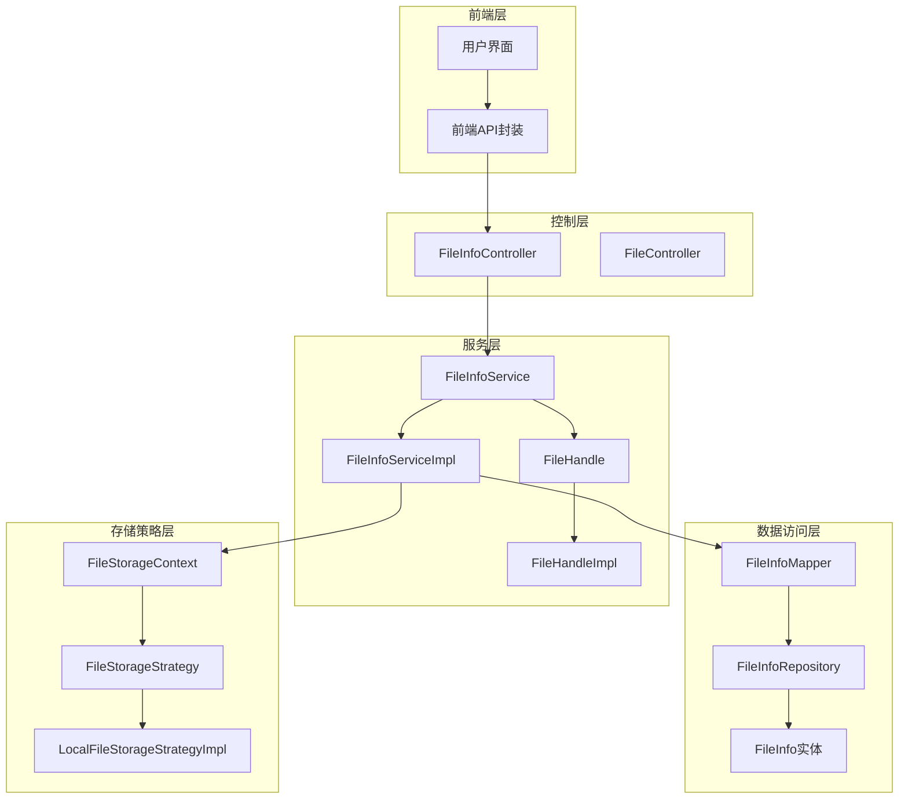
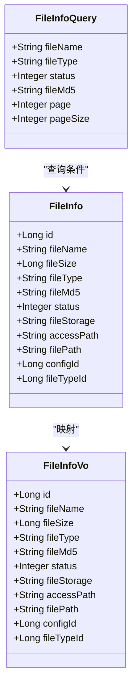
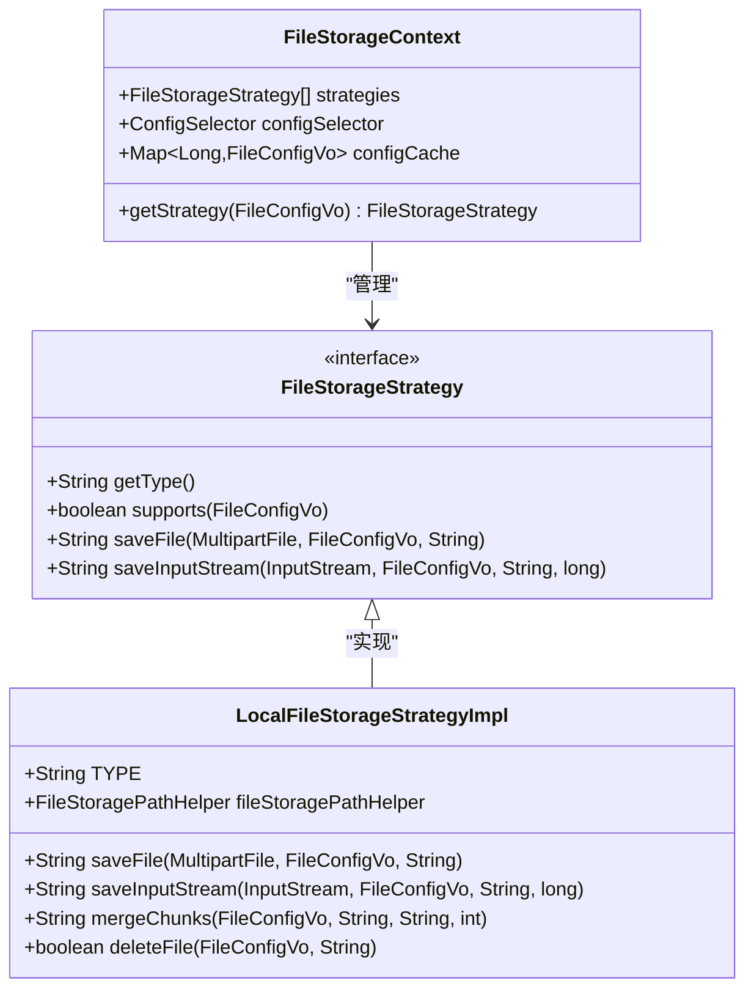
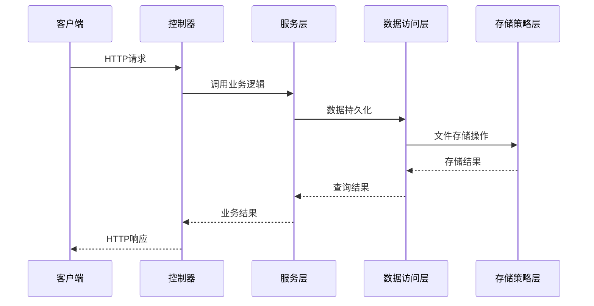
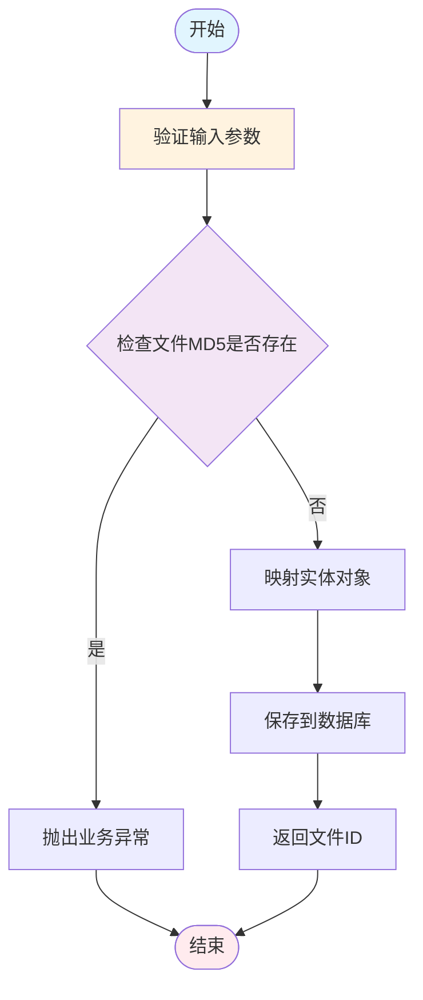
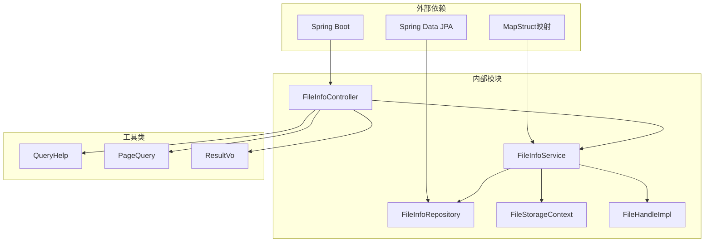

# 文件信息API

<cite>
**本文档引用的文件**
- [FileInfoController.java](file://run-admin/src/main/java/com/fastproject/module/file/controller/FileInfoController.java)
- [FileInfoService.java](file://file-module/src/main/java/com/fastproject/file/service/FileInfoService.java)
- [FileInfoServiceImpl.java](file://file-module/src/main/java/com/fastproject/file/service/impl/FileInfoServiceImpl.java)
- [FileInfoRepository.java](file://file-module/src/main/java/com/fastproject/file/repository/db/FileInfoRepository.java)
- [FileInfoMapper.java](file://file-module/src/main/java/com/fastproject/file/mapper/FileInfoMapper.java)
- [FileInfo.java](file://file-module/src/main/java/com/fastproject/file/domain/FileInfo.java)
- [FileInfoVo.java](file://file-module/src/main/java/com/fastproject/file/vo/info/FileInfoVo.java)
- [FileInfoQuery.java](file://file-module/src/main/java/com/fastproject/file/vo/info/FileInfoQuery.java)
- [FileInfoUpdate.java](file://file-module/src/main/java/com/fastproject/file/vo/info/FileInfoUpdate.java)
- [FileTypeStatVo.java](file://file-module/src/main/java/com/fastproject/file/vo/info/FileTypeStatVo.java)
- [FileStorageContext.java](file://file-module/src/main/java/com/fastproject/file/storage/FileStorageContext.java)
- [FileStorageStrategy.java](file://file-module/src/main/java/com/fastproject/file/storage/FileStorageStrategy.java)
- [LocalFileStorageStrategyImpl.java](file://file-module/src/main/java/com/fastproject/file/storage/impl/LocalFileStorageStrategyImpl.java)
- [FileHandle.java](file://file-api/src/main/java/com/fastproject/file/api/FileHandle.java)
- [FileHandleImpl.java](file://file-module/src/main/java/com/fastproject/file/api/FileHandleImpl.java)
- [fileinfo.ts](file://fast-ui/apps/admin-vue/src/api/file/fileinfo.ts)
</cite>

## 目录
1. [简介](#简介)
2. [项目结构](#项目结构)
3. [核心组件](#核心组件)
4. [架构概览](#架构概览)
5. [详细组件分析](#详细组件分析)
6. [依赖关系分析](#依赖关系分析)
7. [性能考虑](#性能考虑)
8. [故障排除指南](#故障排除指南)
9. [结论](#结论)

## 简介

文件信息API是FastProject系统中的核心模块，负责管理文件元数据、状态管理和统计分析功能。该API提供了完整的文件生命周期管理能力，包括文件信息的增删改查、状态更新、统计分析、搜索过滤、分页查询等功能。

系统采用分层架构设计，包含前端API层、后端控制层、服务层、数据访问层和存储策略层，确保了良好的可扩展性和维护性。

## 项目结构

文件信息API模块在项目中采用模块化组织方式，主要包含以下层次：

**图表来源**
- [FileInfoController.java](file://run-admin/src/main/java/com/fastproject/module/file/controller/FileInfoController.java#L1-L102)
- [FileInfoService.java](file://file-module/src/main/java/com/fastproject/file/service/FileInfoService.java#L1-L62)
- [FileInfoServiceImpl.java](file://file-module/src/main/java/com/fastproject/file/service/impl/FileInfoServiceImpl.java#L37-L76)

**章节来源**
- [FileInfoController.java](file://run-admin/src/main/java/com/fastproject/module/file/controller/FileInfoController.java#L1-L102)
- [FileInfoService.java](file://file-module/src/main/java/com/fastproject/file/service/FileInfoService.java#L1-L62)

## 核心组件

### 文件信息服务接口

文件信息服务接口定义了完整的文件管理功能，包括基础CRUD操作、统计分析和查询功能。

**章节来源**
- [FileInfoService.java](file://file-module/src/main/java/com/fastproject/file/service/FileInfoService.java#L12-L61)

### 数据模型

文件信息采用统一的数据模型设计，支持完整的文件元数据管理：

**图表来源**
- [FileInfo.java](file://file-module/src/main/java/com/fastproject/file/domain/FileInfo.java#L18-L78)
- [FileInfoVo.java](file://file-module/src/main/java/com/fastproject/file/vo/info/FileInfoVo.java#L9-L65)
- [FileInfoQuery.java](file://file-module/src/main/java/com/fastproject/file/vo/info/FileInfoQuery.java#L12-L33)

**章节来源**
- [FileInfo.java](file://file-module/src/main/java/com/fastproject/file/domain/FileInfo.java#L1-L79)
- [FileInfoVo.java](file://file-module/src/main/java/com/fastproject/file/vo/info/FileInfoVo.java#L1-L65)
- [FileInfoQuery.java](file://file-module/src/main/java/com/fastproject/file/vo/info/FileInfoQuery.java#L1-L33)

### 存储策略管理

系统支持多种存储策略，通过上下文模式实现动态选择：

**图表来源**
- [FileStorageContext.java](file://file-module/src/main/java/com/fastproject/file/storage/FileStorageContext.java#L22-L45)
- [FileStorageStrategy.java](file://file-module/src/main/java/com/fastproject/file/storage/FileStorageStrategy.java#L14-L52)
- [LocalFileStorageStrategyImpl.java](file://file-module/src/main/java/com/fastproject/file/storage/impl/LocalFileStorageStrategyImpl.java#L28-L170)

**章节来源**
- [FileStorageContext.java](file://file-module/src/main/java/com/fastproject/file/storage/FileStorageContext.java#L1-L45)
- [FileStorageStrategy.java](file://file-module/src/main/java/com/fastproject/file/storage/FileStorageStrategy.java#L1-L52)
- [LocalFileStorageStrategyImpl.java](file://file-module/src/main/java/com/fastproject/file/storage/impl/LocalFileStorageStrategyImpl.java#L1-L170)

## 架构概览

文件信息API采用经典的三层架构设计，确保了关注点分离和代码的可维护性：

**图表来源**
- [FileInfoController.java](file://run-admin/src/main/java/com/fastproject/module/file/controller/FileInfoController.java#L25-L101)
- [FileInfoServiceImpl.java](file://file-module/src/main/java/com/fastproject/file/service/impl/FileInfoServiceImpl.java#L43-L63)

## 详细组件分析

### 控制器层

文件信息控制器提供了RESTful API接口，支持完整的CRUD操作和统计查询：

**章节来源**
- [FileInfoController.java](file://run-admin/src/main/java/com/fastproject/module/file/controller/FileInfoController.java#L20-L101)

### 服务层实现

文件信息服务实现了完整的业务逻辑，包括数据验证、统计计算和错误处理：

**图表来源**
- [FileInfoServiceImpl.java](file://file-module/src/main/java/com/fastproject/file/service/impl/FileInfoServiceImpl.java#L52-L63)

**章节来源**
- [FileInfoServiceImpl.java](file://file-module/src/main/java/com/fastproject/file/service/impl/FileInfoServiceImpl.java#L37-L76)

### 数据访问层

数据访问层使用Spring Data JPA提供数据持久化能力，支持复杂查询和分页：

**章节来源**
- [FileInfoRepository.java](file://file-module/src/main/java/com/fastproject/file/repository/db/FileInfoRepository.java#L14-L30)

### 前端API封装

前端提供了完整的API封装，支持TypeScript类型安全的调用：

**章节来源**
- [fileinfo.ts](file://fast-ui/apps/admin-vue/src/api/file/fileinfo.ts#L1-L113)

## 依赖关系分析

文件信息API模块的依赖关系清晰明确，遵循了依赖倒置原则：

**图表来源**
- [FileInfoController.java](file://run-admin/src/main/java/com/fastproject/module/file/controller/FileInfoController.java#L3-L15)
- [FileInfoService.java](file://file-module/src/main/java/com/fastproject/file/service/FileInfoService.java#L3-L10)

**章节来源**
- [FileInfoController.java](file://run-admin/src/main/java/com/fastproject/module/file/controller/FileInfoController.java#L1-L102)
- [FileInfoService.java](file://file-module/src/main/java/com/fastproject/file/service/FileInfoService.java#L1-L62)

## 性能考虑

文件信息API在设计时充分考虑了性能优化：

1. **分页查询优化**：使用JPA Specification进行高效分页查询
2. **缓存策略**：存储配置采用ConcurrentHashMap进行缓存
3. **批量操作**：支持批量删除和批量查询提升效率
4. **延迟加载**：避免不必要的关联查询
5. **索引优化**：对常用查询字段建立数据库索引

## 故障排除指南

### 常见问题及解决方案

**文件MD5重复错误**
- 症状：添加文件时抛出"文件已存在"异常
- 解决方案：检查文件MD5生成逻辑或允许覆盖现有文件

**存储路径配置错误**
- 症状：本地文件存储时报"存储路径不能为空"
- 解决方案：检查文件配置中的存储路径设置

**权限不足**
- 症状：API调用返回403权限错误
- 解决方案：检查用户权限配置和角色授权

**章节来源**
- [FileInfoServiceImpl.java](file://file-module/src/main/java/com/fastproject/file/service/impl/FileInfoServiceImpl.java#L56-L58)
- [LocalFileStorageStrategyImpl.java](file://file-module/src/main/java/com/fastproject/file/storage/impl/LocalFileStorageStrategyImpl.java#L160-L167)

## 结论

文件信息API模块提供了完整的企业级文件管理解决方案，具有以下特点：

1. **功能完整**：涵盖文件生命周期的所有管理需求
2. **架构清晰**：采用分层架构设计，职责分离明确
3. **扩展性强**：支持多种存储策略和自定义扩展
4. **性能优秀**：优化的查询和缓存机制
5. **易于使用**：提供完善的前端API封装和类型定义

该模块为FastProject系统提供了可靠的文件管理基础设施，支持各种规模的应用场景。