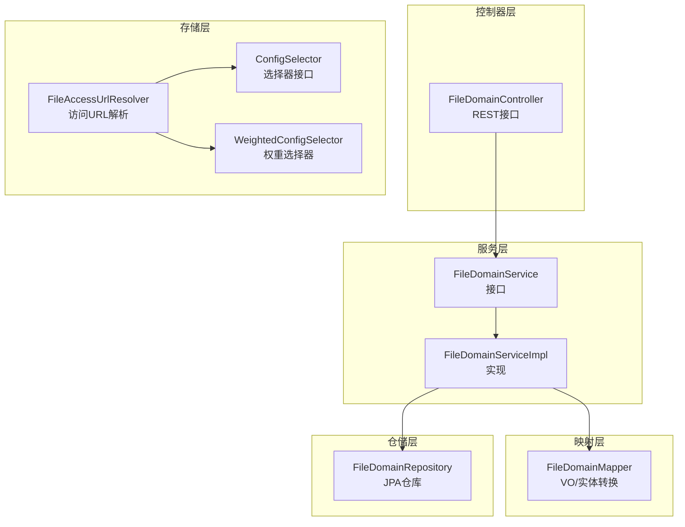
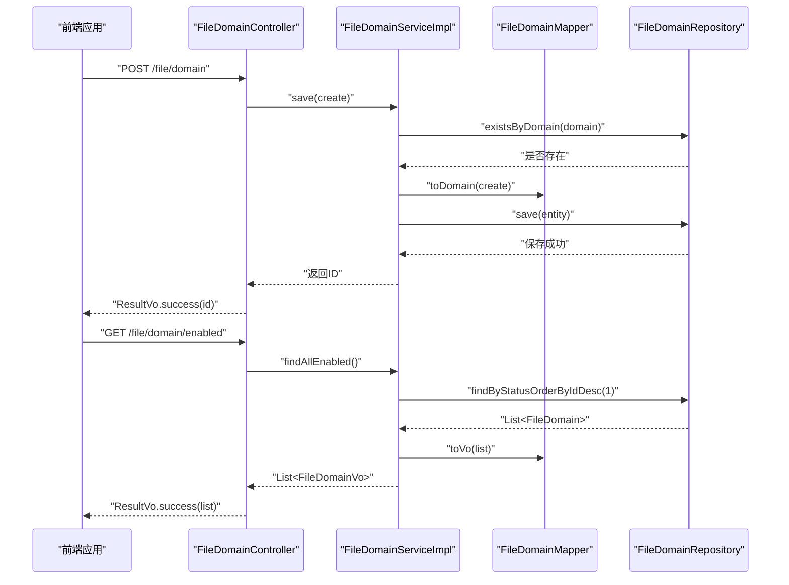
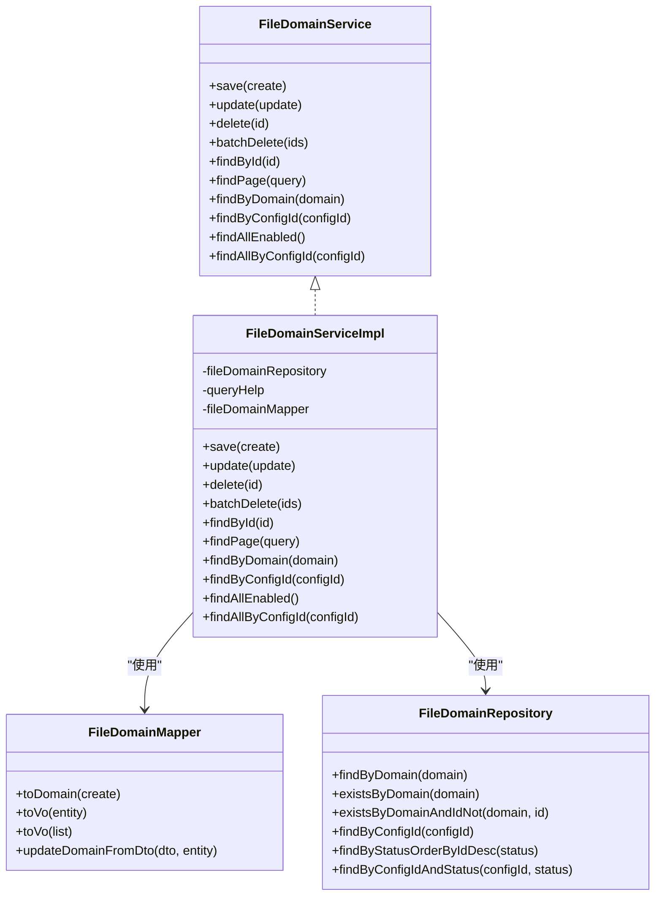
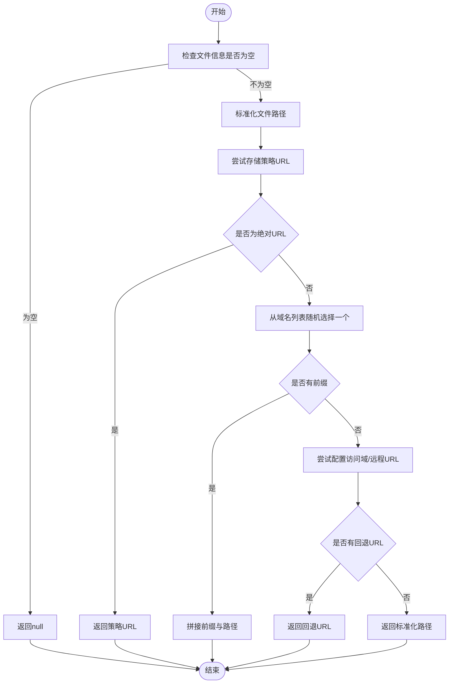
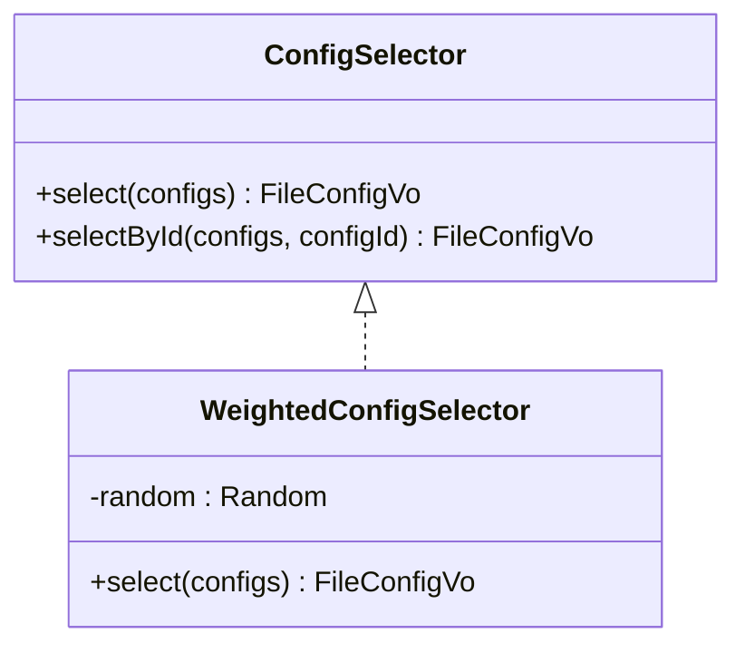
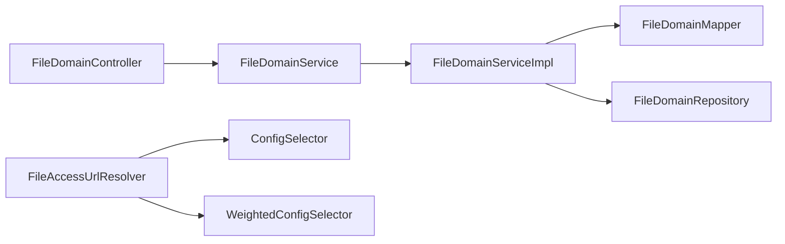

# 文件域名API

<cite>
**本文引用的文件**
- [FileDomainService.java](file://file-module/src/main/java/com//fastproject/file/service/FileDomainService.java)
- [FileDomainServiceImpl.java](file://file-module/src/main/java/com//fastproject/file/service/impl/FileDomainServiceImpl.java)
- [FileDomainController.java](file://run-admin/src/main/java/com/ fastproject/module/file/controller/FileDomainController.java)
- [FileDomainMapper.java](file://file-module/src/main/java/com/ fastproject/file/mapper/FileDomainMapper.java)
- [FileDomainRepository.java](file://file-module/src/main/java/com/ fastproject/file/repository/db/FileDomainRepository.java)
- [FileDomain.java](file://file-module/src/main/java/com/ fastproject/file/domain/FileDomain.java)
- [FileDomainCreate.java](file://file-module/src/main/java/com/ fastproject/file/vo/domain/FileDomainCreate.java)
- [FileDomainUpdate.java](file://file-module/src/main/java/com/ fastproject/file/vo/domain/FileDomainUpdate.java)
- [FileDomainQuery.java](file://file-module/src/main/java/com/ fastproject/file/vo/domain/FileDomainQuery.java)
- [FileDomainVo.java](file://file-module/src/main/java/com/ fastproject/file/vo/domain/FileDomainVo.java)
- [filedomain.ts](file://fast-ui/apps/admin-vue/src/api/file/filedomain.ts)
- [index.vue](file://fast-ui/apps/admin-vue/src/views/file/filedomain/index.vue)
- [FileAccessUrlResolver.java](file://file-module/src/main/java/com/ fastproject/file/storage/FileAccessUrlResolver.java)
- [WeightedConfigSelector.java](file://file-module/src/main/java/com/ fastproject/file/storage/WeightedConfigSelector.java)
- [ConfigSelector.java](file://file-module/src/main/java/com/ fastproject/file/storage/ConfigSelector.java)
</cite>

## 目录
1. [简介](#简介)
2. [项目结构](#项目结构)
3. [核心组件](#核心组件)
4. [架构概览](#架构概览)
5. [详细组件分析](#详细组件分析)
6. [依赖关系分析](#依赖关系分析)
7. [性能考虑](#性能考虑)
8. [故障排查指南](#故障排查指南)
9. [结论](#结论)
10. [附录](#附录)

## 简介
本文件域名API文档面向文件域名配置与管理场景，覆盖以下能力：
- 文件域名的增删改查与分页查询
- 域名唯一性校验与状态管理
- 域名与存储配置的关联关系
- 访问域名解析与多域名负载均衡策略
- 前端调用示例与典型使用场景

该系统通过控制器暴露REST接口，服务层负责业务逻辑与数据校验，仓储层负责数据库交互，映射器负责VO与领域模型转换；同时提供统一的访问URL解析器，支持基于权重的存储配置选择与多域名随机负载。

## 项目结构
文件域名模块采用典型的分层架构：
- 控制器层：对外提供REST接口
- 服务层：封装业务逻辑与数据校验
- 映射层：VO与实体之间的转换
- 仓储层：数据库访问与查询条件构建
- 存储层：访问URL解析与配置选择器

图表来源
- [FileDomainController.java](file://run-admin/src/main/java/com/ fastproject/module/file/controller/FileDomainController.java#L1-L110)
- [FileDomainService.java](file://file-module/src/main/java/com/ fastproject/file/service/FileDomainService.java#L1-L66)
- [FileDomainServiceImpl.java](file://file-module/src/main/java/com/ fastproject/file/service/impl/FileDomainServiceImpl.java#L1-L150)
- [FileDomainMapper.java](file://file-module/src/main/java/com/ fastproject/file/mapper/FileDomainMapper.java#L1-L33)
- [FileDomainRepository.java](file://file-module/src/main/java/com/ fastproject/file/repository/db/FileDomainRepository.java#L1-L43)
- [FileAccessUrlResolver.java](file://file-module/src/main/java/com/ fastproject/file/storage/FileAccessUrlResolver.java#L1-L97)
- [WeightedConfigSelector.java](file://file-module/src/main/java/com/ fastproject/file/storage/WeightedConfigSelector.java#L1-L66)
- [ConfigSelector.java](file://file-module/src/main/java/com/ fastproject/file/storage/ConfigSelector.java#L1-L38)

章节来源
- [FileDomainController.java](file://run-admin/src/main/java/com/ fastproject/module/file/controller/FileDomainController.java#L1-L110)
- [FileDomainService.java](file://file-module/src/main/java/com/ fastproject/file/service/FileDomainService.java#L1-L66)
- [FileDomainServiceImpl.java](file://file-module/src/main/java/com/ fastproject/file/service/impl/FileDomainServiceImpl.java#L1-L150)
- [FileDomainMapper.java](file://file-module/src/main/java/com/ fastproject/file/mapper/FileDomainMapper.java#L1-L33)
- [FileDomainRepository.java](file://file-module/src/main/java/com/ fastproject/file/repository/db/FileDomainRepository.java#L1-L43)
- [FileAccessUrlResolver.java](file://file-module/src/main/java/com/ fastproject/file/storage/FileAccessUrlResolver.java#L1-L97)
- [WeightedConfigSelector.java](file://file-module/src/main/java/com/ fastproject/file/storage/WeightedConfigSelector.java#L1-L66)
- [ConfigSelector.java](file://file-module/src/main/java/com/ fastproject/file/storage/ConfigSelector.java#L1-L38)

## 核心组件
- FileDomainController：提供REST接口，负责权限控制与请求转发
- FileDomainService：定义域名CRUD与查询接口
- FileDomainServiceImpl：实现业务逻辑，含唯一性校验、分页查询、状态筛选
- FileDomainMapper：VO与实体转换
- FileDomainRepository：JPA仓库，提供基础查询方法
- FileAccessUrlResolver：统一访问URL解析，支持多域名随机选择与回退策略
- WeightedConfigSelector：基于权重的配置选择器，支持按权重随机选择

章节来源
- [FileDomainController.java](file://run-admin/src/main/java/com/ fastproject/module/file/controller/FileDomainController.java#L1-L110)
- [FileDomainService.java](file://file-module/src/main/java/com/ fastproject/file/service/FileDomainService.java#L1-L66)
- [FileDomainServiceImpl.java](file://file-module/src/main/java/com/ fastproject/file/service/impl/FileDomainServiceImpl.java#L1-L150)
- [FileDomainMapper.java](file://file-module/src/main/java/com/ fastproject/file/mapper/FileDomainMapper.java#L1-L33)
- [FileDomainRepository.java](file://file-module/src/main/java/com/ fastproject/file/repository/db/FileDomainRepository.java#L1-L43)
- [FileAccessUrlResolver.java](file://file-module/src/main/java/com/ fastproject/file/storage/FileAccessUrlResolver.java#L1-L97)
- [WeightedConfigSelector.java](file://file-module/src/main/java/com/ fastproject/file/storage/WeightedConfigSelector.java#L1-L66)
- [ConfigSelector.java](file://file-module/src/main/java/com/ fastproject/file/storage/ConfigSelector.java#L1-L38)

## 架构概览
文件域名API遵循经典的分层架构，前端通过HTTP请求调用后端控制器，控制器将请求委派给服务层，服务层完成业务校验与数据处理，最终由仓储层持久化或查询数据。访问URL解析器在需要时参与域名选择与URL拼接。

图表来源
- [FileDomainController.java](file://run-admin/src/main/java/com/ fastproject/module/file/controller/FileDomainController.java#L26-L108)
- [FileDomainServiceImpl.java](file://file-module/src/main/java/com/ fastproject/file/service/impl/FileDomainServiceImpl.java#L42-L142)
- [FileDomainMapper.java](file://file-module/src/main/java/com/ fastproject/file/mapper/FileDomainMapper.java#L24-L32)
- [FileDomainRepository.java](file://file-module/src/main/java/com/ fastproject/file/repository/db/FileDomainRepository.java#L16-L41)

## 详细组件分析

### 控制器层：FileDomainController
- 路径前缀：/file/domain
- 权限注解：@PreAuthorize限制操作权限
- 主要接口：
  - 新增：POST /file/domain
  - 修改：PUT /file/domain
  - 删除：DELETE /file/domain/{id}
  - 批量删除：DELETE /file/domain/batch
  - 分页查询：POST /file/domain/page
  - 单条查询：GET /file/domain/{id}
  - 域名查询：GET /file/domain/domain/{domain}
  - 配置查询：GET /file/domain/config/{configId}
  - 启用域名：GET /file/domain/enabled

章节来源
- [FileDomainController.java](file://run-admin/src/main/java/com/ fastproject/module/file/controller/FileDomainController.java#L26-L108)

### 服务层：FileDomainService 与 FileDomainServiceImpl
- 保存：校验域名唯一性，转换为实体并持久化
- 更新：校验域名唯一性（排除自身），更新实体并持久化
- 删除：按ID删除
- 批量删除：按ID集合删除
- 分页查询：支持按配置ID、域名关键字、状态过滤
- 查询方法：按ID、域名、配置ID、启用状态查询

图表来源
- [FileDomainService.java](file://file-module/src/main/java/com/ fastproject/file/service/FileDomainService.java#L14-L66)
- [FileDomainServiceImpl.java](file://file-module/src/main/java/com/ fastproject/file/service/impl/FileDomainServiceImpl.java#L36-L149)
- [FileDomainMapper.java](file://file-module/src/main/java/com/ fastproject/file/mapper/FileDomainMapper.java#L18-L32)
- [FileDomainRepository.java](file://file-module/src/main/java/com/ fastproject/file/repository/db/FileDomainRepository.java#L14-L42)

章节来源
- [FileDomainService.java](file://file-module/src/main/java/com/ fastproject/file/service/FileDomainService.java#L14-L66)
- [FileDomainServiceImpl.java](file://file-module/src/main/java/com/ fastproject/file/service/impl/FileDomainServiceImpl.java#L42-L148)
- [FileDomainMapper.java](file://file-module/src/main/java/com/ fastproject/file/mapper/FileDomainMapper.java#L18-L32)
- [FileDomainRepository.java](file://file-module/src/main/java/com/ fastproject/file/repository/db/FileDomainRepository.java#L14-L42)

### 数据模型：FileDomain
- 表：file_domain
- 关键字段：configId（配置ID）、domain（域名）、status（状态）
- 软删除：通过SQLDelete与SQLRestriction实现

章节来源
- [FileDomain.java](file://file-module/src/main/java/com/ fastproject/file/domain/FileDomain.java#L11-L34)

### 访问URL解析与域名选择
FileAccessUrlResolver负责将文件信息与存储配置解析为可访问的URL：
- 优先策略：存储策略生成的URL（若为绝对URL则直接返回）
- 多域名选择：从传入的域名列表中随机选择一个可用域名
- 回退策略：若无域名，则尝试配置的访问域或远程URL，最后回退到相对路径

图表来源
- [FileAccessUrlResolver.java](file://file-module/src/main/java/com/ fastproject/file/storage/FileAccessUrlResolver.java#L24-L95)

章节来源
- [FileAccessUrlResolver.java](file://file-module/src/main/java/com/ fastproject/file/storage/FileAccessUrlResolver.java#L24-L95)

### 权重配置选择器
WeightedConfigSelector基于权重进行随机选择，权重越大被选中的概率越高：
- 过滤可用配置（状态=启用）
- 计算总权重并随机选择
- 支持默认权重与边界情况处理

图表来源
- [ConfigSelector.java](file://file-module/src/main/java/com/ fastproject/file/storage/ConfigSelector.java#L11-L37)
- [WeightedConfigSelector.java](file://file-module/src/main/java/com/ fastproject/file/storage/WeightedConfigSelector.java#L17-L64)

章节来源
- [ConfigSelector.java](file://file-module/src/main/java/com/ fastproject/file/storage/ConfigSelector.java#L11-L37)
- [WeightedConfigSelector.java](file://file-module/src/main/java/com/ fastproject/file/storage/WeightedConfigSelector.java#L17-L64)

## 依赖关系分析
- 控制器依赖服务接口，确保权限控制与请求转发
- 服务实现依赖仓储与映射器，完成数据转换与持久化
- 访问URL解析器依赖存储上下文与路径助手，参与域名选择与URL拼接
- 权重选择器作为策略组件，供存储上下文或业务流程选择配置

图表来源
- [FileDomainController.java](file://run-admin/src/main/java/com/ fastproject/module/file/controller/FileDomainController.java#L24-L24)
- [FileDomainService.java](file://file-module/src/main/java/com/ fastproject/file/service/FileDomainService.java#L14-L14)
- [FileDomainServiceImpl.java](file://file-module/src/main/java/com/ fastproject/file/service/impl/FileDomainServiceImpl.java#L38-L40)
- [FileDomainMapper.java](file://file-module/src/main/java/com/ fastproject/file/mapper/FileDomainMapper.java#L18-L21)
- [FileDomainRepository.java](file://file-module/src/main/java/com/ fastproject/file/repository/db/FileDomainRepository.java#L14-L14)
- [FileAccessUrlResolver.java](file://file-module/src/main/java/com/ fastproject/file/storage/FileAccessUrlResolver.java#L21-L22)
- [ConfigSelector.java](file://file-module/src/main/java/com/ fastproject/file/storage/ConfigSelector.java#L11-L11)
- [WeightedConfigSelector.java](file://file-module/src/main/java/com/ fastproject/file/storage/WeightedConfigSelector.java#L17-L17)

章节来源
- [FileDomainController.java](file://run-admin/src/main/java/com/ fastproject/module/file/controller/FileDomainController.java#L24-L24)
- [FileDomainServiceImpl.java](file://file-module/src/main/java/com/ fastproject/file/service/impl/FileDomainServiceImpl.java#L38-L40)
- [FileAccessUrlResolver.java](file://file-module/src/main/java/com/ fastproject/file/storage/FileAccessUrlResolver.java#L21-L22)

## 性能考虑
- 分页查询：服务层使用JPA分页与排序，建议前端合理设置页大小与排序字段
- 唯一性校验：保存与更新均进行域名唯一性检查，避免重复
- 随机域名选择：FileAccessUrlResolver使用ThreadLocalRandom进行O(1)随机选择
- 权重选择：权重计算与随机选择为O(n)，n为可用配置数量，建议配置数量可控

## 故障排查指南
- 域名重复：保存或更新时如提示“域名已存在”，请检查目标域名是否已被其他记录使用
- 权限不足：未满足@PreAuthorize权限要求时，接口会拒绝访问，请确认用户权限
- 无可用域名：当域名列表为空或不可用时，访问URL解析可能回退到配置或相对路径
- 配置不可用：权重选择器仅选择状态为启用的配置，若无可用配置会返回null

章节来源
- [FileDomainServiceImpl.java](file://file-module/src/main/java/com/ fastproject/file/service/impl/FileDomainServiceImpl.java#L46-L66)
- [FileDomainController.java](file://run-admin/src/main/java/com/ fastproject/module/file/controller/FileDomainController.java#L30-L30)
- [FileAccessUrlResolver.java](file://file-module/src/main/java/com/ fastproject/file/storage/FileAccessUrlResolver.java#L60-L76)
- [WeightedConfigSelector.java](file://file-module/src/main/java/com/ fastproject/file/storage/WeightedConfigSelector.java#L27-L35)

## 结论
文件域名API提供了完善的域名CRUD、分页查询与状态管理能力，并通过访问URL解析器与权重选择器实现了灵活的域名与配置选择策略。结合权限控制与唯一性校验，能够满足多域名、多配置场景下的文件访问需求。

## 附录

### API定义与示例

- 新增域名
  - 方法：POST
  - 路径：/file/domain
  - 请求体：FileDomainCreate
  - 返回：ResultVo<Long>

- 修改域名
  - 方法：PUT
  - 路径：/file/domain
  - 请求体：FileDomainUpdate
  - 返回：ResultVo<Void>

- 删除域名
  - 方法：DELETE
  - 路径：/file/domain/{id}
  - 返回：ResultVo<Void>

- 批量删除
  - 方法：DELETE
  - 路径：/file/domain/batch
  - 请求体：List<Long>
  - 返回：ResultVo<Void>

- 分页查询
  - 方法：POST
  - 路径：/file/domain/page
  - 请求体：FileDomainQuery
  - 返回：ResultVo<PageVo<List<FileDomainVo>>>

- 单条查询
  - 方法：GET
  - 路径：/file/domain/{id}
  - 返回：ResultVo<FileDomainVo>

- 域名查询
  - 方法：GET
  - 路径：/file/domain/domain/{domain}
  - 返回：ResultVo<FileDomainVo>

- 配置查询
  - 方法：GET
  - 路径：/file/domain/config/{configId}
  - 返回：ResultVo<List<FileDomainVo>>

- 启用域名
  - 方法：GET
  - 路径：/file/domain/enabled
  - 返回：ResultVo<List<FileDomainVo>>

章节来源
- [FileDomainController.java](file://run-admin/src/main/java/com/ fastproject/module/file/controller/FileDomainController.java#L29-L107)
- [filedomain.ts](file://fast-ui/apps/admin-vue/src/api/file/filedomain.ts#L39-L72)

### 前端调用示例
- 分页加载：getFileDomainPage(params)
- 单条查询：getFileDomainById(id)
- 域名查询：getFileDomainByDomain(domain)
- 配置查询：getFileDomainByConfigId(configId)
- 启用域名：getFileDomainEnabled()

章节来源
- [filedomain.ts](file://fast-ui/apps/admin-vue/src/api/file/filedomain.ts#L39-L72)
- [index.vue](file://fast-ui/apps/admin-vue/src/views/file/filedomain/index.vue#L352-L394)

### 典型应用场景
- 多域名配置：为同一存储配置绑定多个CDN域名，提升访问稳定性与带宽
- 域名优先级：通过状态字段控制域名启用/禁用，实现主备切换
- 负载均衡：在访问URL解析阶段对多个域名进行随机选择，实现简单的负载均衡
- 访问路径映射：结合存储策略与域名前缀，生成最终可访问URL
- 域名切换：通过更新域名状态或替换域名列表，快速切换访问入口

章节来源
- [FileAccessUrlResolver.java](file://file-module/src/main/java/com/ fastproject/file/storage/FileAccessUrlResolver.java#L39-L76)
- [FileDomainServiceImpl.java](file://file-module/src/main/java/com/ fastproject/file/service/impl/FileDomainServiceImpl.java#L137-L147)