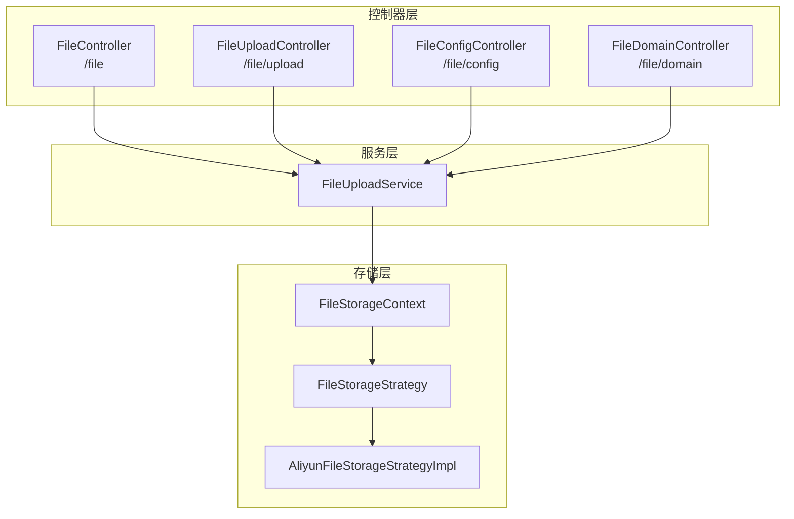
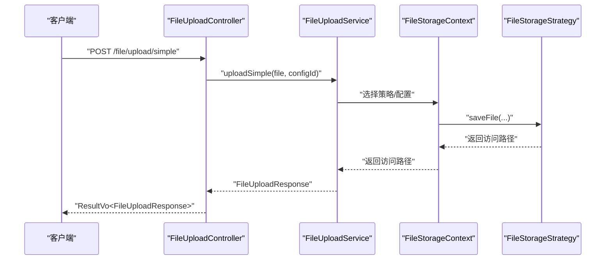
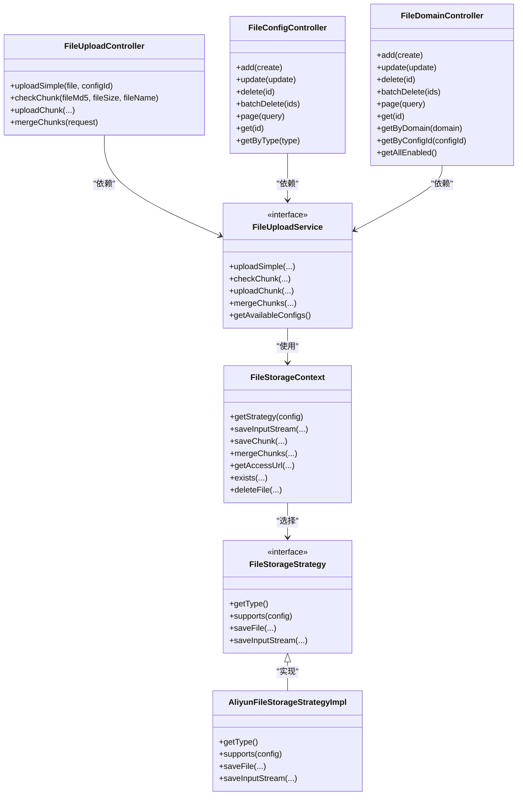
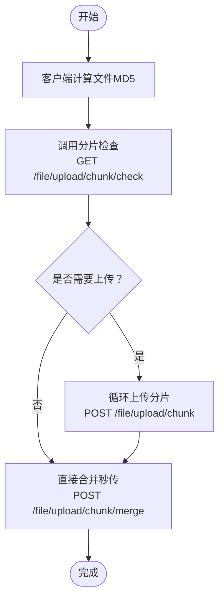

# 文件管理API

<cite>
**本文引用的文件**
- [FileController.java](file://run-admin/src/main/java/com/fastproject/module/file/controller/FileController.java)
- [FileUploadController.java](file://run-admin/src/main/java/com/fastproject/module/file/controller/FileUploadController.java)
- [FileConfigController.java](file://run-admin/src/main/java/com/fastproject/module/file/controller/FileConfigController.java)
- [FileDomainController.java](file://run-admin/src/main/java/com/fastproject/module/file/controller/FileDomainController.java)
- [fileupload.ts](file://fast-ui/apps/admin-vue/src/api/file/fileupload.ts)
- [fileconfig.ts](file://fast-ui/apps/admin-vue/src/api/file/fileconfig.ts)
- [filedomain.ts](file://fast-ui/apps/admin-vue/src/api/file/filedomain.ts)
- [FileUploadService.java](file://file-module/src/main/java/com/fastproject/file/service/FileUploadService.java)
- [FileStorageStrategy.java](file://file-module/src/main/java/com/fastproject/file/storage/FileStorageStrategy.java)
- [FileStorageContext.java](file://file-module/src/main/java/com/fastproject/file/storage/FileStorageContext.java)
- [AliyunFileStorageStrategyImpl.java](file://file-module/src/main/java/com/fastproject/file/storage/impl/AliyunFileStorageStrategyImpl.java)
- [FileConfigVo.java](file://file-module/src/main/java/com/fastproject/file/vo/config/FileConfigVo.java)
- [FileDomainVo.java](file://file-module/src/main/java/com/fastproject/file/vo/domain/FileDomainVo.java)
</cite>

## 目录
1. [简介](#简介)
2. [项目结构](#项目结构)
3. [核心组件](#核心组件)
4. [架构总览](#架构总览)
5. [详细组件分析](#详细组件分析)
6. [依赖关系分析](#依赖关系分析)
7. [性能考虑](#性能考虑)
8. [故障排除指南](#故障排除指南)
9. [结论](#结论)
10. [附录](#附录)

## 简介
本文件管理API文档面向后端与前端开发者，系统性梳理文件上传、下载、存储配置与文件管理等核心能力。重点覆盖以下方面：
- 文件上传：支持小文件直传与大文件分片上传（含秒传检查、分片上传、分片合并）
- 文件下载：通过统一入口生成或跳转到文件访问链接
- 存储配置：存储策略类型、访问域名、权重与远程配置
- 文件域名管理：按配置聚合域名、启用状态管理
- 安全与权限：基于注解的权限控制与统一响应包装
- 流程示例：从客户端计算MD5到分片上传与合并的完整链路

## 项目结构
文件管理模块由三层构成：
- 控制器层：对外暴露REST API，负责路由与权限校验
- 服务层：封装业务逻辑，协调存储策略与配置选择
- 存储层：抽象多种存储策略（本地/远程），实现具体落盘与访问URL生成

图表来源
- [FileController.java](file://run-admin/src/main/java/com/fastproject/module/file/controller/FileController.java#L15-L41)
- [FileUploadController.java](file://run-admin/src/main/java/com/fastproject/module/file/controller/FileUploadController.java#L19-L91)
- [FileConfigController.java](file://run-admin/src/main/java/com/fastproject/module/file/controller/FileConfigController.java#L20-L91)
- [FileDomainController.java](file://run-admin/src/main/java/com/fastproject/module/file/controller/FileDomainController.java#L20-L109)
- [FileUploadService.java](file://file-module/src/main/java/com/fastproject/file/service/FileUploadService.java#L14-L67)
- [FileStorageContext.java](file://file-module/src/main/java/com/fastproject/file/storage/FileStorageContext.java#L22-L127)
- [FileStorageStrategy.java](file://file-module/src/main/java/com/fastproject/file/storage/FileStorageStrategy.java#L14-L52)
- [AliyunFileStorageStrategyImpl.java](file://file-module/src/main/java/com/fastproject/file/storage/impl/AliyunFileStorageStrategyImpl.java#L38-L67)

章节来源
- [FileController.java](file://run-admin/src/main/java/com/fastproject/module/file/controller/FileController.java#L15-L41)
- [FileUploadController.java](file://run-admin/src/main/java/com/fastproject/module/file/controller/FileUploadController.java#L19-L91)
- [FileConfigController.java](file://run-admin/src/main/java/com/fastproject/module/file/controller/FileConfigController.java#L20-L91)
- [FileDomainController.java](file://run-admin/src/main/java/com/fastproject/module/file/controller/FileDomainController.java#L20-L109)

## 核心组件
- FileController：提供文件访问链接跳转能力，根据文件ID解析真实URL
- FileUploadController：提供小文件直传与大文件分片上传全流程接口
- FileConfigController：文件存储配置的增删改查与分页查询
- FileDomainController：文件域名的增删改查、按条件查询与启用域名列表
- FileUploadService：上传服务接口，定义直传、分片检查、分片上传、合并与配置查询
- FileStorageStrategy/FileStorageContext：存储策略抽象与上下文，负责策略选择、分片处理、URL生成与文件操作

章节来源
- [FileController.java](file://run-admin/src/main/java/com/fastproject/module/file/controller/FileController.java#L15-L41)
- [FileUploadController.java](file://run-admin/src/main/java/com/fastproject/module/file/controller/FileUploadController.java#L19-L91)
- [FileConfigController.java](file://run-admin/src/main/java/com/fastproject/module/file/controller/FileConfigController.java#L20-L91)
- [FileDomainController.java](file://run-admin/src/main/java/com/fastproject/module/file/controller/FileDomainController.java#L20-L109)
- [FileUploadService.java](file://file-module/src/main/java/com/fastproject/file/service/FileUploadService.java#L14-L67)
- [FileStorageStrategy.java](file://file-module/src/main/java/com/fastproject/file/storage/FileStorageStrategy.java#L14-L52)
- [FileStorageContext.java](file://file-module/src/main/java/com/fastproject/file/storage/FileStorageContext.java#L22-L127)

## 架构总览
文件管理API采用“控制器-服务-存储”分层架构，结合策略模式实现多存储后端适配。统一响应包装ResultVo，权限控制通过Spring Security注解实现。

图表来源
- [FileUploadController.java](file://run-admin/src/main/java/com/fastproject/module/file/controller/FileUploadController.java#L33-L39)
- [FileUploadService.java](file://file-module/src/main/java/com/fastproject/file/service/FileUploadService.java#L23-L23)
- [FileStorageContext.java](file://file-module/src/main/java/com/fastproject/file/storage/FileStorageContext.java#L36-L44)
- [FileStorageStrategy.java](file://file-module/src/main/java/com/fastproject/file/storage/FileStorageStrategy.java#L40-L40)

## 详细组件分析

### 文件上传API
- 小文件直传
  - 方法与路径：POST /file/upload/simple
  - 请求参数：multipart/form-data，file（必填）、configId（可选）
  - 响应：FileUploadResponse（包含文件ID、名称、大小、MD5、访问路径、是否已存在等）
  - 权限：admin:file:upload:simple
- 分片上传初始化检查
  - 方法与路径：GET /file/upload/chunk/check
  - 查询参数：fileMd5（必填）、fileSize（必填）、fileName（必填）
  - 响应：ChunkCheckResponse（needUpload、fileId、uploadedChunks、totalChunks）
  - 权限：admin:file:upload:chunk
- 单个分片上传
  - 方法与路径：POST /file/upload/chunk
  - 表单参数：file（必填）、fileMd5、fileName、fileSize、fileType、chunkNumber、totalChunks、chunkSize、configId（可选）
  - 响应：FileUploadResponse
  - 权限：admin:file:upload:chunk
- 分片合并
  - 方法与路径：POST /file/upload/chunk/merge
  - 请求体：FileChunkMergeRequest（fileMd5、fileName、fileSize、fileType、totalChunks、configId）
  - 响应：FileUploadResponse
  - 权限：admin:file:upload:chunk

前端调用参考
- 小文件直传：uploadSimple(file, configId?, onProgress?)
- 分片检查：checkChunk(fileMd5, fileSize, fileName)
- 单个分片：uploadChunk(blob, FileChunkUploadRequest, onProgress?)
- 合并分片：mergeChunks(FileChunkMergeRequest)
- 计算MD5：calculateFileMd5(file)

章节来源
- [FileUploadController.java](file://run-admin/src/main/java/com/fastproject/module/file/controller/FileUploadController.java#L33-L90)
- [fileupload.ts](file://fast-ui/apps/admin-vue/src/api/file/fileupload.ts#L49-L142)
- [FileUploadService.java](file://file-module/src/main/java/com/fastproject/file/service/FileUploadService.java#L23-L59)

### 文件下载API
- 下载链接跳转
  - 方法与路径：GET /file/getUrl/{id}
  - 路径参数：id（文件ID字符串）
  - 响应：302 Found，Location为真实访问URL；若无法解析则404
  - 场景：后端生成短链或跳转到CDN/对象存储URL

章节来源
- [FileController.java](file://run-admin/src/main/java/com/fastproject/module/file/controller/FileController.java#L22-L40)

### 存储配置API
- 新增配置
  - 方法与路径：POST /file/config
  - 请求体：FileConfigCreate（storagePath、accessDomain、status、type、description、remoteUrl、remoteToken、config）
  - 响应：ResultVo<Object>
  - 权限：admin:file:config:add
- 修改配置
  - 方法与路径：PUT /file/config
  - 请求体：FileConfigUpdate（id必填）
  - 响应：ResultVo<Object>
  - 权限：admin:file:config:update
- 删除配置
  - 方法与路径：DELETE /file/config/{id}
  - 路径参数：id
  - 响应：ResultVo<Object>
  - 权限：admin:file:config:delete
- 批量删除
  - 方法与路径：DELETE /file/config/batch
  - 请求体：Long[] ids
  - 响应：ResultVo<Object>
  - 权限：admin:file:config:delete
- 分页查询
  - 方法与路径：POST /file/config/page
  - 请求体：FileConfigQuery（page、pageSize、status、type、description）
  - 响应：ResultVo<PageVo<List<FileConfigVo>>>
  - 权限：admin:file:config:page
- 详情查询
  - 方法与路径：GET /file/config/{id}
  - 路径参数：id
  - 响应：ResultVo<FileConfigVo>
  - 权限：admin:file:config:page
- 按类型查询
  - 方法与路径：GET /file/config/type/{type}
  - 路径参数：type
  - 响应：ResultVo<FileConfigVo>
  - 权限：admin:file:config:page

前端调用参考
- 分页：getFileConfigPage(params)
- 详情：getFileConfigById(id)
- 按类型：getFileConfigByType(type)
- 新增/修改/删除/批量删除：对应create/update/delete/batchDelete

章节来源
- [FileConfigController.java](file://run-admin/src/main/java/com/fastproject/module/file/controller/FileConfigController.java#L29-L90)
- [fileconfig.ts](file://fast-ui/apps/admin-vue/src/api/file/fileconfig.ts#L49-L100)
- [FileConfigVo.java](file://file-module/src/main/java/com/fastproject/file/vo/config/FileConfigVo.java#L9-L60)

### 文件域名API
- 新增域名
  - 方法与路径：POST /file/domain
  - 请求体：FileDomainCreate（configId、domain、status）
  - 响应：ResultVo<Object>
  - 权限：admin:file:domain:add
- 修改域名
  - 方法与路径：PUT /file/domain
  - 请求体：FileDomainUpdate（id必填）
  - 响应：ResultVo<Object>
  - 权限：admin:file:domain:update
- 删除域名
  - 方法与路径：DELETE /file/domain/{id}
  - 路径参数：id
  - 响应：ResultVo<Object>
  - 权限：admin:file:domain:delete
- 批量删除
  - 方法与路径：DELETE /file/domain/batch
  - 请求体：Long[] ids
  - 响应：ResultVo<Object>
  - 权限：admin:file:domain:delete
- 分页查询
  - 方法与路径：POST /file/domain/page
  - 请求体：FileDomainQuery（page、pageSize、configId、domain、status）
  - 响应：ResultVo<PageVo<List<FileDomainVo>>>
  - 权限：admin:file:domain:page
- 详情查询
  - 方法与路径：GET /file/domain/{id}
  - 路径参数：id
  - 响应：ResultVo<FileDomainVo>
  - 权限：admin:file:domain:page
- 按域名查询
  - 方法与路径：GET /file/domain/domain/{domain}
  - 路径参数：domain
  - 响应：ResultVo<FileDomainVo>
  - 权限：admin:file:domain:page
- 按配置ID查询域名列表
  - 方法与路径：GET /file/domain/config/{configId}
  - 路径参数：configId
  - 响应：ResultVo<List<FileDomainVo>>
  - 权限：admin:file:domain:page
- 获取所有启用域名
  - 方法与路径：GET /file/domain/enabled
  - 响应：ResultVo<List<FileDomainVo>>
  - 权限：admin:file:domain:page

前端调用参考
- 分页：getFileDomainPage(params)
- 详情：getFileDomainById(id)
- 按域名：getFileDomainByDomain(domain)
- 按配置ID：getFileDomainByConfigId(configId)
- 启用域名：getFileDomainEnabled()
- 新增/修改/删除/批量删除：对应create/update/delete/batchDelete

章节来源
- [FileDomainController.java](file://run-admin/src/main/java/com/fastproject/module/file/controller/FileDomainController.java#L29-L108)
- [filedomain.ts](file://fast-ui/apps/admin-vue/src/api/file/filedomain.ts#L39-L104)
- [FileDomainVo.java](file://file-module/src/main/java/com/fastproject/file/vo/domain/FileDomainVo.java#L9-L30)

### 统一响应与权限控制
- 统一响应：ResultVo<T>，包含code、data、msg
- 权限注解：@PreAuthorize，基于权限表达式admin:file:*进行细粒度控制
- 分页模型：PageVo<T>，包含data与total

章节来源
- [FileUploadController.java](file://run-admin/src/main/java/com/fastproject/module/file/controller/FileUploadController.java#L33-L90)
- [FileConfigController.java](file://run-admin/src/main/java/com/fastproject/module/file/controller/FileConfigController.java#L29-L90)
- [FileDomainController.java](file://run-admin/src/main/java/com/fastproject/module/file/controller/FileDomainController.java#L29-L108)

## 依赖关系分析
- 控制器依赖服务接口，服务接口依赖存储上下文与策略
- 存储上下文根据配置选择具体策略，策略实现负责IO与URL生成
- 前端TS模块封装了各API的请求参数与响应类型，便于类型安全调用

图表来源
- [FileUploadController.java](file://run-admin/src/main/java/com/fastproject/module/file/controller/FileUploadController.java#L22-L91)
- [FileConfigController.java](file://run-admin/src/main/java/com/fastproject/module/file/controller/FileConfigController.java#L22-L91)
- [FileDomainController.java](file://run-admin/src/main/java/com/fastproject/module/file/controller/FileDomainController.java#L22-L109)
- [FileUploadService.java](file://file-module/src/main/java/com/fastproject/file/service/FileUploadService.java#L14-L67)
- [FileStorageContext.java](file://file-module/src/main/java/com/fastproject/file/storage/FileStorageContext.java#L22-L127)
- [FileStorageStrategy.java](file://file-module/src/main/java/com/fastproject/file/storage/FileStorageStrategy.java#L14-L52)
- [AliyunFileStorageStrategyImpl.java](file://file-module/src/main/java/com/fastproject/file/storage/impl/AliyunFileStorageStrategyImpl.java#L38-L67)

## 性能考虑
- 分片上传：建议分片大小固定且合理（如8MB以上），以平衡并发与内存占用
- 秒传检查：通过MD5与文件大小快速判断是否需要上传，减少重复传输
- URL生成：优先使用CDN或对象存储直链，缩短回源路径
- 缓存策略：存储配置可按ID缓存，降低频繁查询开销
- 并发控制：对同一文件的分片上传建议加分布式锁，避免冲突

## 故障排除指南
- 下载失败（404）：确认文件ID有效、访问域名配置正确、存储后端可访问
- 分片上传失败：检查分片参数一致性（fileMd5、fileName、totalChunks、chunkNumber），确认后端未抛出异常
- 权限不足：确认当前用户具备admin:file:*相关权限表达式授权
- 存储策略不匹配：检查配置type与后端策略实现是否一致

章节来源
- [FileController.java](file://run-admin/src/main/java/com/fastproject/module/file/controller/FileController.java#L22-L40)
- [FileUploadController.java](file://run-admin/src/main/java/com/fastproject/module/file/controller/FileUploadController.java#L50-L78)
- [FileConfigController.java](file://run-admin/src/main/java/com/fastproject/module/file/controller/FileConfigController.java#L29-L90)
- [FileDomainController.java](file://run-admin/src/main/java/com/fastproject/module/file/controller/FileDomainController.java#L29-L108)

## 结论
本文件管理API提供了从上传到下载、从配置到域名管理的完整能力。通过分层架构与策略模式，既保证了扩展性，也确保了跨存储后端的一致体验。配合前端TS封装，可快速构建稳定高效的文件管理功能。

## 附录

### 文件上传流程示例（分片上传）

图表来源
- [fileupload.ts](file://fast-ui/apps/admin-vue/src/api/file/fileupload.ts#L75-L125)
- [FileUploadController.java](file://run-admin/src/main/java/com/fastproject/module/file/controller/FileUploadController.java#L50-L90)

### 存储策略与配置选择
- FileStorageContext根据配置Vo选择对应策略
- FileStorageStrategy定义通用能力（保存文件/输入流、生成URL、分片处理等）
- AliyunFileStorageStrategyImpl演示远程存储策略实现

章节来源
- [FileStorageContext.java](file://file-module/src/main/java/com/fastproject/file/storage/FileStorageContext.java#L36-L127)
- [FileStorageStrategy.java](file://file-module/src/main/java/com/fastproject/file/storage/FileStorageStrategy.java#L14-L52)
- [AliyunFileStorageStrategyImpl.java](file://file-module/src/main/java/com/fastproject/file/storage/impl/AliyunFileStorageStrategyImpl.java#L38-L67)