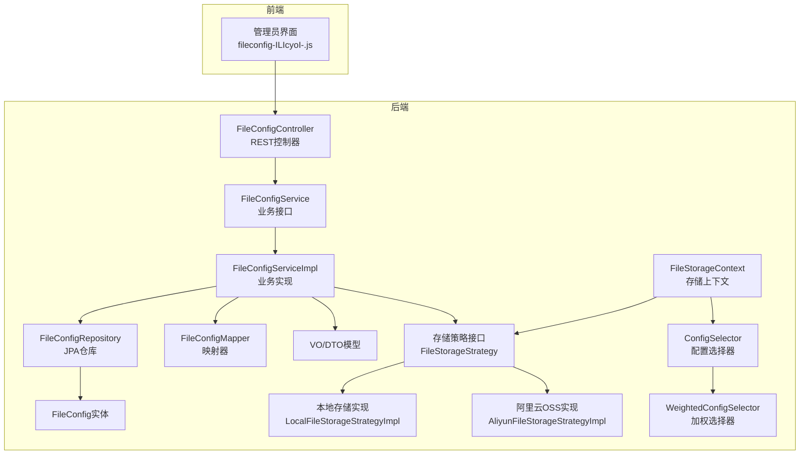
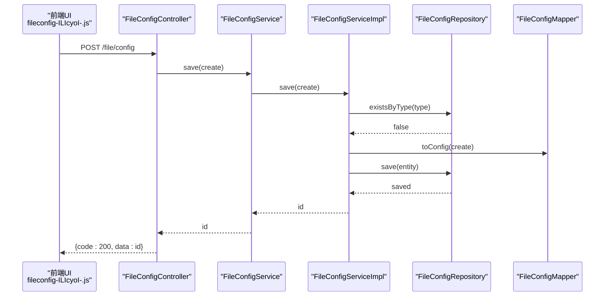
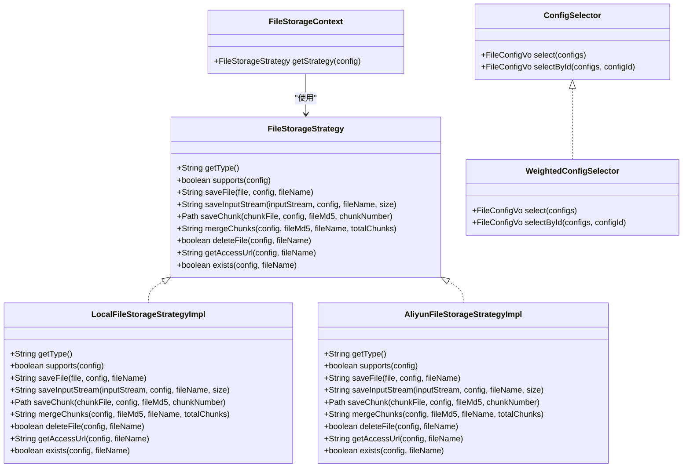
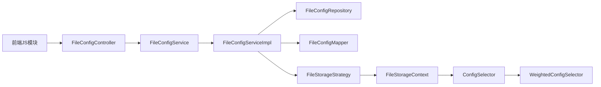

# 文件配置API

<cite>
**本文档引用的文件**
- [FileConfigController.java](file://run-admin/src/main/java/com/fastproject/module/file/controller/FileConfigController.java)
- [FileConfigService.java](file://file-module/src/main/java/com/fastproject/file/service/FileConfigService.java)
- [FileConfigServiceImpl.java](file://file-module/src/main/java/com/fastproject/file/service/impl/FileConfigServiceImpl.java)
- [FileConfigRepository.java](file://file-module/src/main/java/com/fastproject/file/repository/db/FileConfigRepository.java)
- [FileConfigMapper.java](file://file-module/src/main/java/com/fastproject/file/mapper/FileConfigMapper.java)
- [FileConfig.java](file://file-module/src/main/java/com/fastproject/file/domain/FileConfig.java)
- [FileConfigVo.java](file://file-module/src/main/java/com/fastproject/file/vo/config/FileConfigVo.java)
- [FileConfigCreate.java](file://file-module/src/main/java/com/fastproject/file/vo/config/FileConfigCreate.java)
- [FileConfigUpdate.java](file://file-module/src/main/java/com/fastproject/file/vo/config/FileConfigUpdate.java)
- [FileConfigQuery.java](file://file-module/src/main/java/com/fastproject/file/vo/config/FileConfigQuery.java)
- [FileStorageStrategy.java](file://file-module/src/main/java/com/fastproject/file/storage/FileStorageStrategy.java)
- [LocalFileStorageStrategyImpl.java](file://file-module/src/main/java/com/fastproject/file/storage/impl/LocalFileStorageStrategyImpl.java)
- [AliyunFileStorageStrategyImpl.java](file://file-module/src/main/java/com/fastproject/file/storage/impl/AliyunFileStorageStrategyImpl.java)
- [FileStorageContext.java](file://file-module/src/main/java/com/fastproject/file/storage/FileStorageContext.java)
- [ConfigSelector.java](file://file-module/src/main/java/com/fastproject/file/storage/ConfigSelector.java)
- [WeightedConfigSelector.java](file://file-module/src/main/java/com/fastproject/file/storage/WeightedConfigSelector.java)
- [fileconfig-ILIcyoI-.js](file://fast-ui/apps/admin-vue/dist/assets/js/fileconfig-ILIcyoI-.js)
</cite>

## 目录
1. [简介](#简介)
2. [项目结构](#项目结构)
3. [核心组件](#核心组件)
4. [架构概览](#架构概览)
5. [详细组件分析](#详细组件分析)
6. [依赖关系分析](#依赖关系分析)
7. [性能考虑](#性能考虑)
8. [故障排查指南](#故障排查指南)
9. [结论](#结论)

## 简介
本文件配置API文档面向文件存储配置管理，覆盖文件存储配置、文件类型管理、访问控制等配置接口的完整规范。重点说明FileConfigService接口的CRUD操作、配置参数设置、存储策略选择等功能，并提供存储配置创建、修改、删除、查询等API接口说明。同时包含配置验证规则、默认值设置、配置继承机制等技术细节。

## 项目结构
文件配置API位于后端模块与前端UI之间，采用典型的分层架构：
- 控制器层：处理HTTP请求与响应，权限校验
- 服务层：业务逻辑编排，数据转换
- 数据访问层：JPA仓库接口，数据库交互
- 存储策略层：抽象存储策略与具体实现（本地、阿里云OSS）

**图表来源**
- [FileConfigController.java](file://run-admin/src/main/java/com/fastproject/module/file/controller/FileConfigController.java#L1-L92)
- [FileConfigService.java](file://file-module/src/main/java/com/fastproject/file/service/FileConfigService.java#L1-L55)
- [FileConfigServiceImpl.java](file://file-module/src/main/java/com/fastproject/file/service/impl/FileConfigServiceImpl.java#L29-L69)
- [FileConfigRepository.java](file://file-module/src/main/java/com/fastproject/file/repository/db/FileConfigRepository.java#L1-L36)
- [FileConfigMapper.java](file://file-module/src/main/java/com/fastproject/file/mapper/FileConfigMapper.java#L1-L30)
- [FileConfig.java](file://file-module/src/main/java/com/fastproject/file/domain/FileConfig.java#L1-L66)
- [FileStorageStrategy.java](file://file-module/src/main/java/com/fastproject/file/storage/FileStorageStrategy.java#L1-L105)
- [LocalFileStorageStrategyImpl.java](file://file-module/src/main/java/com/fastproject/file/storage/impl/LocalFileStorageStrategyImpl.java#L1-L170)
- [AliyunFileStorageStrategyImpl.java](file://file-module/src/main/java/com/fastproject/file/storage/impl/AliyunFileStorageStrategyImpl.java#L1-L284)
- [FileStorageContext.java](file://file-module/src/main/java/com/fastproject/file/storage/FileStorageContext.java#L1-L45)
- [ConfigSelector.java](file://file-module/src/main/java/com/fastproject/file/storage/ConfigSelector.java#L1-L37)
- [WeightedConfigSelector.java](file://file-module/src/main/java/com/fastproject/file/storage/WeightedConfigSelector.java#L1-L48)

**章节来源**
- [FileConfigController.java](file://run-admin/src/main/java/com/fastproject/module/file/controller/FileConfigController.java#L1-L92)
- [fileconfig-ILIcyoI-.js](file://fast-ui/apps/admin-vue/dist/assets/js/fileconfig-ILIcyoI-.js#L1-L1)

## 核心组件
- FileConfigController：提供REST接口，负责权限校验与请求转发
- FileConfigService：定义CRUD与查询方法
- FileConfigServiceImpl：实现业务逻辑，包含类型唯一性校验、事务控制
- FileConfigRepository：JPA仓库，提供类型唯一性判断与状态排序查询
- FileConfigMapper：MapStruct映射器，负责DTO与实体之间的转换
- FileConfig实体与VO/DTO：定义存储配置的数据结构
- 存储策略体系：抽象接口与具体实现（本地、阿里云OSS），支持分片上传、URL生成、存在性检查等

**章节来源**
- [FileConfigService.java](file://file-module/src/main/java/com/fastproject/file/service/FileConfigService.java#L1-L55)
- [FileConfigServiceImpl.java](file://file-module/src/main/java/com/fastproject/file/service/impl/FileConfigServiceImpl.java#L29-L69)
- [FileConfigRepository.java](file://file-module/src/main/java/com/fastproject/file/repository/db/FileConfigRepository.java#L1-L36)
- [FileConfigMapper.java](file://file-module/src/main/java/com/fastproject/file/mapper/FileConfigMapper.java#L1-L30)
- [FileConfig.java](file://file-module/src/main/java/com/fastproject/file/domain/FileConfig.java#L1-L66)
- [FileConfigVo.java](file://file-module/src/main/java/com/fastproject/file/vo/config/FileConfigVo.java#L1-L61)
- [FileConfigCreate.java](file://file-module/src/main/java/com/fastproject/file/vo/config/FileConfigCreate.java#L1-L56)
- [FileConfigUpdate.java](file://file-module/src/main/java/com/fastproject/file/vo/config/FileConfigUpdate.java#L1-L61)
- [FileConfigQuery.java](file://file-module/src/main/java/com/fastproject/file/vo/config/FileConfigQuery.java#L1-L28)

## 架构概览
文件配置API遵循分层架构，前端通过JavaScript模块调用后端REST接口；后端控制器接收请求，调用服务层完成业务处理，持久化到数据库；存储策略根据配置类型动态选择具体实现。

**图表来源**
- [FileConfigController.java](file://run-admin/src/main/java/com/fastproject/module/file/controller/FileConfigController.java#L26-L33)
- [FileConfigService.java](file://file-module/src/main/java/com/fastproject/file/service/FileConfigService.java#L16-L19)
- [FileConfigServiceImpl.java](file://file-module/src/main/java/com/fastproject/file/service/impl/FileConfigServiceImpl.java#L42-L53)
- [FileConfigRepository.java](file://file-module/src/main/java/com/fastproject/file/repository/db/FileConfigRepository.java#L22-L24)
- [FileConfigMapper.java](file://file-module/src/main/java/com/fastproject/file/mapper/FileConfigMapper.java#L24-L28)

## 详细组件分析

### REST API 规范
- 路径前缀：/file/config
- 权限注解：@PreAuthorize限制操作权限
- 返回体：统一使用ResultVo包装

接口定义与行为：
- POST /file/config
  - 请求体：FileConfigCreate
  - 响应：保存后的配置ID
  - 权限：admin:file:config:add
- PUT /file/config
  - 请求体：FileConfigUpdate
  - 响应：空对象
  - 权限：admin:file:config:update
- DELETE /file/config/{id}
  - 路径参数：配置ID
  - 响应：空对象
  - 权限：admin:file:config:delete
- DELETE /file/config/batch
  - 请求体：Long数组
  - 响应：空对象
  - 权限：admin:file:config:delete
- POST /file/config/page
  - 请求体：FileConfigQuery
  - 响应：分页结果
  - 权限：admin:file:config:page
- GET /file/config/{id}
  - 路径参数：配置ID
  - 响应：单个配置
  - 权限：admin:file:config:page
- GET /file/config/type/{type}
  - 路径参数：配置类型
  - 响应：按类型查询的配置
  - 权限：admin:file:config:page

前端JS模块对应接口：
- 分页查询：/file/config/page
- 单条查询：/file/config/{id}
- 新增：/file/config
- 更新：/file/config
- 删除：/file/config/{id}
- 批量删除：/file/config/batch

**章节来源**
- [FileConfigController.java](file://run-admin/src/main/java/com/fastproject/module/file/controller/FileConfigController.java#L26-L90)
- [fileconfig-ILIcyoI-.js](file://fast-ui/apps/admin-vue/dist/assets/js/fileconfig-ILIcyoI-.js#L1-L1)

### FileConfigService 接口
- CRUD能力：save、update、delete、batchDelete
- 查询能力：findById、findPage、findByType、findAllEnabled
- 参数校验：类型唯一性检查（新增时不允许重复，更新时排除自身）

实现要点：
- 新增时检查类型是否已存在，避免重复
- 更新时同样进行类型唯一性校验，并支持部分字段更新
- 使用MapStruct进行DTO与实体转换，忽略空值属性映射

**章节来源**
- [FileConfigService.java](file://file-module/src/main/java/com/fastproject/file/service/FileConfigService.java#L1-L55)
- [FileConfigServiceImpl.java](file://file-module/src/main/java/com/fastproject/file/service/impl/FileConfigServiceImpl.java#L42-L69)
- [FileConfigMapper.java](file://file-module/src/main/java/com/fastproject/file/mapper/FileConfigMapper.java#L21-L28)

### 存储策略与配置选择
存储策略接口定义了统一的文件操作契约，包括保存、分片、合并、删除、URL生成、存在性检查等。系统内置两种策略：
- 本地文件存储：基于文件系统，支持分片与合并
- 阿里云OSS存储：基于OSS SDK，支持分片上传与私有桶预签名URL

配置选择器支持从多个配置中选择合适的存储配置，当前实现为加权随机选择，仅选择状态为启用的配置。

**图表来源**
- [FileStorageStrategy.java](file://file-module/src/main/java/com/fastproject/file/storage/FileStorageStrategy.java#L1-L105)
- [LocalFileStorageStrategyImpl.java](file://file-module/src/main/java/com/fastproject/file/storage/impl/LocalFileStorageStrategyImpl.java#L22-L170)
- [AliyunFileStorageStrategyImpl.java](file://file-module/src/main/java/com/fastproject/file/storage/impl/AliyunFileStorageStrategyImpl.java#L38-L284)
- [FileStorageContext.java](file://file-module/src/main/java/com/fastproject/file/storage/FileStorageContext.java#L22-L45)
- [ConfigSelector.java](file://file-module/src/main/java/com/fastproject/file/storage/ConfigSelector.java#L11-L37)
- [WeightedConfigSelector.java](file://file-module/src/main/java/com/fastproject/file/storage/WeightedConfigSelector.java#L15-L48)

### 配置验证规则与默认值
- 类型唯一性：新增与更新均需保证type字段唯一
- 状态约束：仅启用状态（status=1）参与策略选择
- 权重默认值：未设置时按1计算，权重越大优先级越高
- 本地存储路径：若未以分隔符结尾会自动补全
- 访问域名优先级：优先使用配置中的访问域名，否则回退到默认前缀或远程URL

**章节来源**
- [FileConfigServiceImpl.java](file://file-module/src/main/java/com/fastproject/file/service/impl/FileConfigServiceImpl.java#L45-L65)
- [WeightedConfigSelector.java](file://file-module/src/main/java/com/fastproject/file/storage/WeightedConfigSelector.java#L27-L45)
- [LocalFileStorageStrategyImpl.java](file://file-module/src/main/java/com/fastproject/file/storage/impl/LocalFileStorageStrategyImpl.java#L158-L167)
- [AliyunFileStorageStrategyImpl.java](file://file-module/src/main/java/com/fastproject/file/storage/impl/AliyunFileStorageStrategyImpl.java#L239-L254)

### 配置继承机制
- 存储配置继承：通过FileConfigVo封装配置信息，供存储策略统一使用
- URL生成继承：子策略可复用父类的URL生成逻辑，按需扩展
- 选择器继承：ConfigSelector接口提供默认实现，WeightedConfigSelector基于状态与权重进行选择

**章节来源**
- [FileConfigVo.java](file://file-module/src/main/java/com/fastproject/file/vo/config/FileConfigVo.java#L1-L61)
- [FileStorageStrategy.java](file://file-module/src/main/java/com/fastproject/file/storage/FileStorageStrategy.java#L87-L103)
- [ConfigSelector.java](file://file-module/src/main/java/com/fastproject/file/storage/ConfigSelector.java#L28-L36)

## 依赖关系分析
- 控制器依赖服务接口，确保业务逻辑与表现层解耦
- 服务实现依赖仓库与映射器，完成数据持久化与对象转换
- 存储策略依赖配置上下文与选择器，实现动态策略选择
- 前端JS模块与控制器路由一一对应，便于维护与扩展

**图表来源**
- [FileConfigController.java](file://run-admin/src/main/java/com/fastproject/module/file/controller/FileConfigController.java#L22-L24)
- [FileConfigService.java](file://file-module/src/main/java/com/fastproject/file/service/FileConfigService.java#L14-L14)
- [FileConfigServiceImpl.java](file://file-module/src/main/java/com/fastproject/file/service/impl/FileConfigServiceImpl.java#L35-L39)
- [FileStorageContext.java](file://file-module/src/main/java/com/fastproject/file/storage/FileStorageContext.java#L24-L25)

**章节来源**
- [FileConfigController.java](file://run-admin/src/main/java/com/fastproject/module/file/controller/FileConfigController.java#L1-L92)
- [FileConfigService.java](file://file-module/src/main/java/com/fastproject/file/service/FileConfigService.java#L1-L55)
- [FileConfigServiceImpl.java](file://file-module/src/main/java/com/fastproject/file/service/impl/FileConfigServiceImpl.java#L29-L69)
- [FileStorageContext.java](file://file-module/src/main/java/com/fastproject/file/storage/FileStorageContext.java#L1-L45)

## 性能考虑
- 加权选择器：在多配置场景下按权重随机选择，提升负载均衡效果
- 分片上传：支持大文件分片上传与合并，降低单次传输压力
- URL缓存：存储上下文对配置进行缓存，减少重复查找开销
- 状态过滤：仅启用配置参与选择，避免无效配置影响性能

[本节为通用指导，无需列出章节来源]

## 故障排查指南
常见问题与定位建议：
- 类型重复错误：新增或更新时提示类型已存在，检查type字段唯一性
- 存储路径为空：本地存储策略要求配置存储路径非空，确保配置正确
- 阿里云配置缺失：OSS策略需要完整的配置JSON，检查config字段内容
- URL生成失败：确认访问域名或远程URL配置，以及私有桶预签名参数

**章节来源**
- [FileConfigServiceImpl.java](file://file-module/src/main/java/com/fastproject/file/service/impl/FileConfigServiceImpl.java#L45-L65)
- [LocalFileStorageStrategyImpl.java](file://file-module/src/main/java/com/fastproject/file/storage/impl/LocalFileStorageStrategyImpl.java#L158-L167)
- [AliyunFileStorageStrategyImpl.java](file://file-module/src/main/java/com/fastproject/file/storage/impl/AliyunFileStorageStrategyImpl.java#L219-L237)

## 结论
文件配置API提供了完整的文件存储配置管理能力，涵盖CRUD操作、存储策略选择、配置验证与默认值设置等关键特性。通过清晰的分层设计与策略模式，系统具备良好的扩展性与可维护性。建议在生产环境中结合权限控制与监控告警，确保配置变更的安全与稳定。