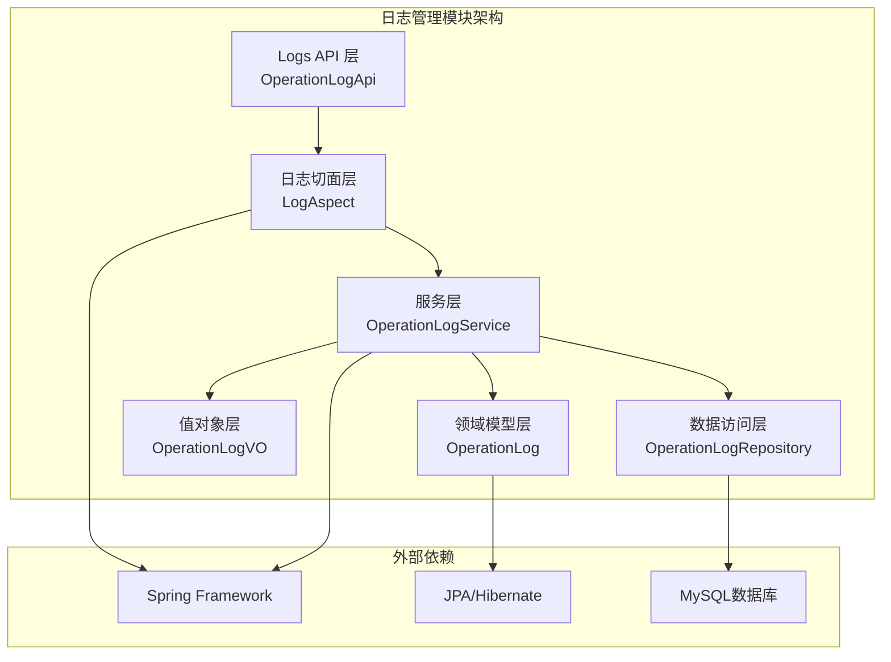
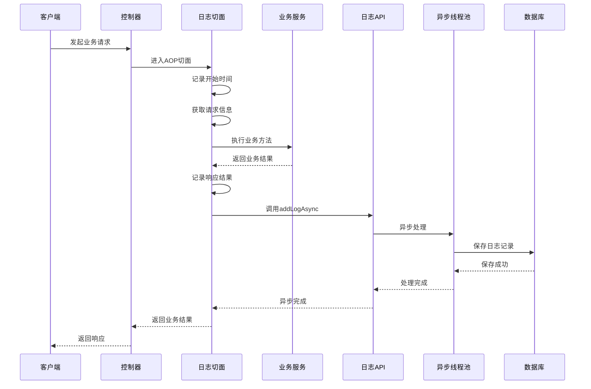
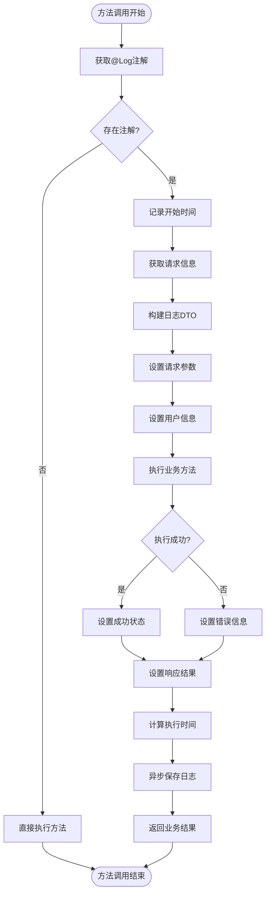
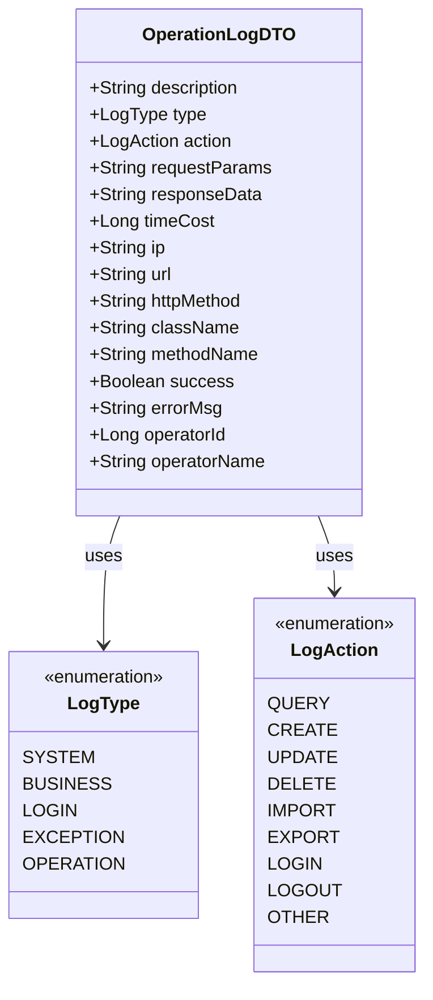
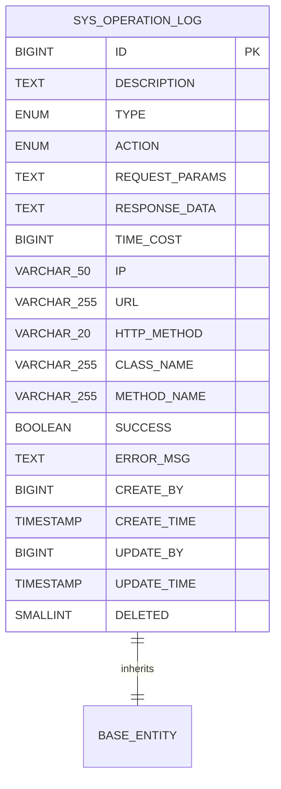
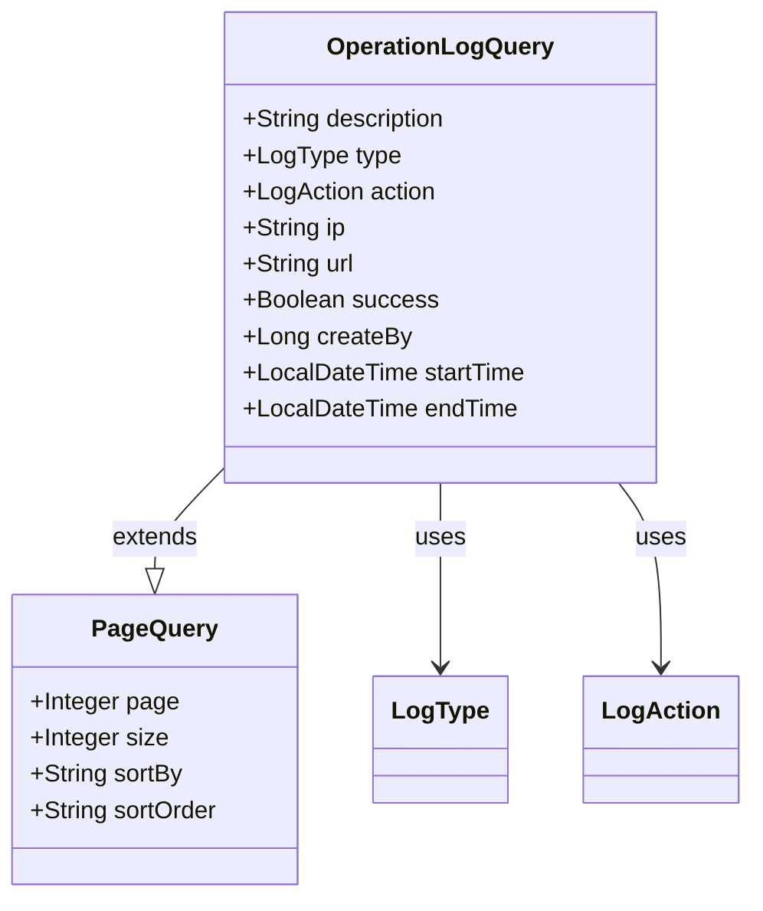
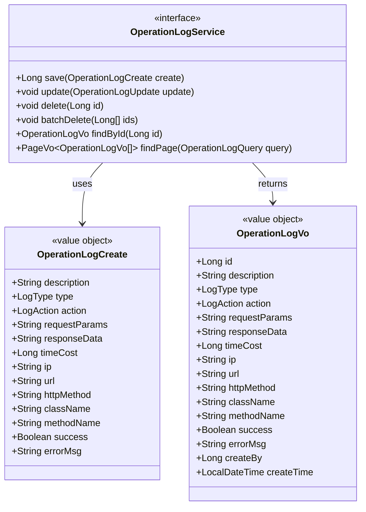

# 日志管理API

<cite>
**本文档引用的文件**
- [OperationLogApi.java](file://logs-api/src/main/java/com/fastproject/logs/api/OperationLogApi.java)
- [OperationLogDTO.java](file://logs-api/src/main/java/com/fastproject/logs/dto/OperationLogDTO.java)
- [LogType.java](file://logs-api/src/main/java/com/fastproject/logs/enums/LogType.java)
- [LogAction.java](file://logs-api/src/main/java/com/fastproject/logs/enums/LogAction.java)
- [Log.java](file://logs-api/src/main/java/com/fastproject/logs/annotation/Log.java)
- [LogAspect.java](file://logs-api/src/main/java/com/fastproject/logs/aspect/LogAspect.java)
- [OperationLog.java](file://logs-module/src/main/java/com/fastproject/logs/domain/OperationLog.java)
- [OperationLogQuery.java](file://logs-module/src/main/java/com/fastproject/logs/vo/OperationLogQuery.java)
- [OperationLogCreate.java](file://logs-module/src/main/java/com/fastproject/logs/vo/OperationLogCreate.java)
- [OperationLogVo.java](file://logs-module/src/main/java/com/fastproject/logs/vo/OperationLogVo.java)
- [OperationLogService.java](file://logs-module/src/main/java/com/fastproject/logs/service/OperationLogService.java)
- [OperationLogRepository.java](file://logs-module/src/main/java/com/fastproject/logs/repository/OperationLogRepository.java)
- [OperationLogApiImpl.java](file://logs-module/src/main/java/com/fastproject/logs/service/impl/OperationLogApiImpl.java)
</cite>

## 目录
1. [简介](#简介)
2. [项目结构](#项目结构)
3. [核心组件](#核心组件)
4. [架构概览](#架构概览)
5. [详细组件分析](#详细组件分析)
6. [依赖关系分析](#依赖关系分析)
7. [性能考虑](#性能考虑)
8. [故障排除指南](#故障排除指南)
9. [结论](#结论)

## 简介

本项目提供了一个完整的日志管理模块，支持自动日志记录、手动日志创建、日志查询和统计等功能。该模块采用Spring Boot框架构建，使用JPA进行数据持久化，通过AOP切面实现自动日志记录，并提供了RESTful API接口供其他模块调用。

日志管理模块主要包含以下核心功能：
- 自动日志记录：通过注解驱动的方式自动记录方法执行日志
- 手动日志创建：提供API接口供业务模块主动记录日志
- 日志查询：支持分页查询、条件筛选和时间范围查询
- 日志统计：支持按类型、操作动作等维度进行统计分析
- 日志导出：支持将查询结果导出为文件格式

## 项目结构

日志管理模块采用分层架构设计，主要分为以下几个层次：



**图表来源**
- [OperationLogApi.java](file://logs-api/src/main/java/com/fastproject/logs/api/OperationLogApi.java#L1-L25)
- [LogAspect.java](file://logs-api/src/main/java/com/fastproject/logs/aspect/LogAspect.java#L1-L242)
- [OperationLogService.java](file://logs-module/src/main/java/com/fastproject/logs/service/OperationLogService.java#L1-L46)
- [OperationLog.java](file://logs-module/src/main/java/com/fastproject/logs/domain/OperationLog.java#L1-L93)

**章节来源**
- [OperationLogApi.java](file://logs-api/src/main/java/com/fastproject/logs/api/OperationLogApi.java#L1-L25)
- [LogAspect.java](file://logs-api/src/main/java/com/fastproject/logs/aspect/LogAspect.java#L1-L242)
- [OperationLogService.java](file://logs-module/src/main/java/com/fastproject/logs/service/OperationLogService.java#L1-L46)

## 核心组件

### 日志类型定义

系统定义了多种日志类型，用于区分不同级别的日志记录：

| 日志类型 | 描述 | 使用场景 |
|---------|------|----------|
| SYSTEM | 系统日志 | 系统级别的操作，如定时任务、系统启动等 |
| BUSINESS | 业务日志 | 业务操作，如订单处理、数据查询等 |
| LOGIN | 登录日志 | 用户登录、登出等认证相关操作 |
| EXCEPTION | 异常日志 | 系统异常信息记录 |
| OPERATION | 操作日志 | 通用的增删改查操作 |

### 日志操作动作

系统定义了标准的操作动作枚举，用于标识具体的日志操作类型：

| 操作动作 | 描述 | 使用场景 |
|---------|------|----------|
| QUERY | 查询 | 数据查询操作 |
| CREATE | 新增 | 数据创建操作 |
| UPDATE | 修改 | 数据更新操作 |
| DELETE | 删除 | 数据删除操作 |
| IMPORT | 导入 | 数据导入操作 |
| EXPORT | 导出 | 数据导出操作 |
| LOGIN | 登录 | 用户登录操作 |
| LOGOUT | 登出 | 用户登出操作 |
| OTHER | 其他 | 其他未明确分类的操作 |

### 日志注解配置

通过`@Log`注解实现日志的自动记录，支持灵活的配置选项：

| 配置项 | 类型 | 默认值 | 描述 |
|-------|------|--------|------|
| value | String | "" | 日志描述，为空时使用方法名 |
| type | LogType | LogType.BUSINESS | 日志类型 |
| action | LogAction | LogAction.OTHER | 操作动作类型 |
| saveRequestParam | boolean | true | 是否保存请求参数 |
| saveResponseData | boolean | false | 是否保存响应结果 |
| recordTimeCost | boolean | true | 是否记录执行时间 |

**章节来源**
- [LogType.java](file://logs-api/src/main/java/com/fastproject/logs/enums/LogType.java#L1-L33)
- [LogAction.java](file://logs-api/src/main/java/com/fastproject/logs/enums/LogAction.java#L1-L53)
- [Log.java](file://logs-api/src/main/java/com/fastproject/logs/annotation/Log.java#L1-L46)

## 架构概览

日志管理模块采用事件驱动的异步处理架构，通过AOP切面实现自动日志记录，通过异步线程池处理日志存储，确保不影响主业务流程的性能。



**图表来源**
- [LogAspect.java](file://logs-api/src/main/java/com/fastproject/logs/aspect/LogAspect.java#L47-L119)
- [OperationLogApiImpl.java](file://logs-module/src/main/java/com/fastproject/logs/service/impl/OperationLogApiImpl.java#L37-L41)

**章节来源**
- [LogAspect.java](file://logs-api/src/main/java/com/fastproject/logs/aspect/LogAspect.java#L1-L242)
- [OperationLogApiImpl.java](file://logs-module/src/main/java/com/fastproject/logs/service/impl/OperationLogApiImpl.java#L1-L70)

## 详细组件分析

### 日志切面处理流程

日志切面是整个日志管理模块的核心组件，负责拦截带有`@Log`注解的方法并自动记录日志信息。



**图表来源**
- [LogAspect.java](file://logs-api/src/main/java/com/fastproject/logs/aspect/LogAspect.java#L47-L119)

#### 关键处理逻辑

1. **注解解析**：从方法签名中提取`@Log`注解配置
2. **请求信息收集**：获取IP地址、URL、HTTP方法等请求上下文
3. **用户信息绑定**：通过TokenUtils获取当前登录用户信息
4. **异常处理**：捕获业务异常并记录错误信息
5. **异步存储**：使用`@Async`注解异步保存日志，避免阻塞主线程

**章节来源**
- [LogAspect.java](file://logs-api/src/main/java/com/fastproject/logs/aspect/LogAspect.java#L1-L242)

### 日志数据传输对象

`OperationLogDTO`作为日志数据的传输载体，包含了完整的日志信息结构。



**图表来源**
- [OperationLogDTO.java](file://logs-api/src/main/java/com/fastproject/logs/dto/OperationLogDTO.java#L1-L88)
- [LogType.java](file://logs-api/src/main/java/com/fastproject/logs/enums/LogType.java#L1-L33)
- [LogAction.java](file://logs-api/src/main/java/com/fastproject/logs/enums/LogAction.java#L1-L53)

#### 字段说明

| 字段名 | 类型 | 必填 | 描述 | 默认值 |
|-------|------|------|------|--------|
| description | String | 否 | 日志描述 | 方法名或注解值 |
| type | LogType | 否 | 日志类型 | BUSINESS |
| action | LogAction | 否 | 操作动作 | OTHER |
| requestParams | String | 否 | 请求参数 | null |
| responseData | String | 否 | 响应结果 | null |
| timeCost | Long | 否 | 执行时间(毫秒) | null |
| ip | String | 否 | IP地址 | null |
| url | String | 否 | 请求URL | null |
| httpMethod | String | 否 | HTTP方法 | null |
| className | String | 否 | 类名 | null |
| methodName | String | 否 | 方法名 | null |
| success | Boolean | 否 | 是否成功 | true |
| errorMsg | String | 否 | 错误信息 | null |
| operatorId | Long | 否 | 操作人ID | null |
| operatorName | String | 否 | 操作人名称 | null |

**章节来源**
- [OperationLogDTO.java](file://logs-api/src/main/java/com/fastproject/logs/dto/OperationLogDTO.java#L1-L88)

### 日志领域模型

`OperationLog`是日志的持久化实体，映射到数据库表`sys_operation_log`。



**图表来源**
- [OperationLog.java](file://logs-module/src/main/java/com/fastproject/logs/domain/OperationLog.java#L1-L93)

#### 数据库字段映射

| 字段名 | 数据库类型 | 描述 | 约束 |
|-------|-----------|------|------|
| id | BIGINT | 主键 | PRIMARY KEY |
| description | TEXT | 日志描述 | 无 |
| type | ENUM | 日志类型 | NOT NULL |
| action | ENUM | 操作动作 | NOT NULL |
| request_params | TEXT | 请求参数 | 无 |
| response_data | TEXT | 响应结果 | 无 |
| time_cost | BIGINT | 执行时间 | 无 |
| ip | VARCHAR(50) | IP地址 | 无 |
| url | VARCHAR(255) | 请求URL | 无 |
| http_method | VARCHAR(20) | HTTP方法 | 无 |
| class_name | VARCHAR(255) | 类名 | 无 |
| method_name | VARCHAR(255) | 方法名 | 无 |
| success | BOOLEAN | 是否成功 | 无 |
| error_msg | TEXT | 错误信息 | 无 |
| create_by | BIGINT | 创建人 | 无 |
| create_time | TIMESTAMP | 创建时间 | 无 |
| update_by | BIGINT | 更新人 | 无 |
| update_time | TIMESTAMP | 更新时间 | 无 |
| deleted | SMALLINT | 逻辑删除标志 | DEFAULT 0 |

**章节来源**
- [OperationLog.java](file://logs-module/src/main/java/com/fastproject/logs/domain/OperationLog.java#L1-L93)

### 日志查询模型

系统提供了灵活的查询模型，支持多种查询条件和分页功能。



**图表来源**
- [OperationLogQuery.java](file://logs-module/src/main/java/com/fastproject/logs/vo/OperationLogQuery.java#L1-L63)

#### 查询条件说明

| 条件字段 | 类型 | 描述 | 查询方式 |
|---------|------|------|----------|
| description | String | 日志描述 | 模糊匹配 |
| type | LogType | 日志类型 | 精确匹配 |
| action | LogAction | 操作动作 | 精确匹配 |
| ip | String | IP地址 | 精确匹配 |
| url | String | 请求URL | 精确匹配 |
| success | Boolean | 是否成功 | 精确匹配 |
| createBy | Long | 创建人 | 精确匹配 |
| startTime | LocalDateTime | 开始时间 | 时间范围 |
| endTime | LocalDateTime | 结束时间 | 时间范围 |

**章节来源**
- [OperationLogQuery.java](file://logs-module/src/main/java/com/fastproject/logs/vo/OperationLogQuery.java#L1-L63)

### 日志服务接口

`OperationLogService`定义了日志管理的核心业务接口。



**图表来源**
- [OperationLogService.java](file://logs-module/src/main/java/com/fastproject/logs/service/OperationLogService.java#L1-L46)
- [OperationLogCreate.java](file://logs-module/src/main/java/com/fastproject/logs/vo/OperationLogCreate.java#L1-L78)
- [OperationLogVo.java](file://logs-module/src/main/java/com/fastproject/logs/vo/OperationLogVo.java#L1-L95)

**章节来源**
- [OperationLogService.java](file://logs-module/src/main/java/com/fastproject/logs/service/OperationLogService.java#L1-L46)
- [OperationLogCreate.java](file://logs-module/src/main/java/com/fastproject/logs/vo/OperationLogCreate.java#L1-L78)
- [OperationLogVo.java](file://logs-module/src/main/java/com/fastproject/logs/vo/OperationLogVo.java#L1-L95)

## 依赖关系分析

日志管理模块的依赖关系体现了清晰的分层架构和职责分离。

```mermaid
graph TB
subgraph "日志API层"
API[OperationLogApi]
DTO[OperationLogDTO]
ANNOTATION[@Log注解]
ENUMS[LogType/LogAction枚举]
end
subgraph "日志切面层"
ASPECT[LogAspect]
end
subgraph "日志服务层"
SERVICE[OperationLogService]
IMPL[OperationLogApiImpl]
end
subgraph "数据访问层"
REPO[OperationLogRepository]
ENTITY[OperationLog实体]
end
subgraph "外部依赖"
TOKEN[TokenUtils]
ASYNC[Async注解]
JPA[JPA/Hibernate]
DB[MySQL]
end
API --> ASPECT
ASPECT --> SERVICE
SERVICE --> IMPL
SERVICE --> REPO
REPO --> ENTITY
ENTITY --> JPA
REPO --> DB
ASPECT --> TOKEN
ASPECT --> ANNOTATION
IMPL --> ASYNC
IMPL --> REPO
IMPL --> DTO
DTO --> ENUMS
```

**图表来源**
- [LogAspect.java](file://logs-api/src/main/java/com/fastproject/logs/aspect/LogAspect.java#L1-L242)
- [OperationLogApiImpl.java](file://logs-module/src/main/java/com/fastproject/logs/service/impl/OperationLogApiImpl.java#L1-L70)
- [OperationLogRepository.java](file://logs-module/src/main/java/com/fastproject/logs/repository/OperationLogRepository.java#L1-L14)

### 组件耦合度分析

- **低耦合设计**：各层之间通过接口进行交互，减少了直接依赖
- **职责分离**：AOP切面专注于横切关注点，服务层专注业务逻辑
- **可扩展性**：通过接口抽象，便于替换实现和扩展新功能

**章节来源**
- [LogAspect.java](file://logs-api/src/main/java/com/fastproject/logs/aspect/LogAspect.java#L1-L242)
- [OperationLogApiImpl.java](file://logs-module/src/main/java/com/fastproject/logs/service/impl/OperationLogApiImpl.java#L1-L70)
- [OperationLogRepository.java](file://logs-module/src/main/java/com/fastproject/logs/repository/OperationLogRepository.java#L1-L14)

## 性能考虑

### 异步处理机制

系统采用异步方式处理日志存储，避免阻塞主业务流程：

1. **线程池配置**：使用`@Async("taskExecutor")`注解配置异步执行器
2. **非阻塞设计**：日志记录不影响主业务方法的执行时间
3. **异常隔离**：异步处理中的异常不会影响主流程的正常执行

### 内存优化策略

1. **字符串截断**：对长文本进行截断处理，防止内存溢出
2. **参数过滤**：自动过滤敏感信息和大型对象
3. **响应数据控制**：默认不保存响应数据，避免数据量过大

### 数据库优化

1. **逻辑删除**：使用`deleted`字段实现软删除，保持数据完整性
2. **索引设计**：建议在常用查询字段上建立适当索引
3. **分页查询**：默认支持分页，避免一次性加载大量数据

## 故障排除指南

### 常见问题及解决方案

#### 日志记录失败

**问题现象**：日志无法正常记录到数据库

**可能原因**：
1. 数据库连接异常
2. 数据库表结构不匹配
3. 异步线程池配置问题

**解决步骤**：
1. 检查数据库连接配置
2. 验证`sys_operation_log`表结构
3. 查看异步线程池配置和状态

#### 切面拦截失效

**问题现象**：`@Log`注解无法生效

**可能原因**：
1. AOP配置未启用
2. 注解位置不正确
3. Spring容器未扫描到切面

**解决步骤**：
1. 确认`@EnableAspectJAutoProxy`注解已配置
2. 检查方法是否在同一个类中调用（AOP代理限制）
3. 验证包扫描路径配置

#### 性能问题

**问题现象**：系统响应变慢，日志记录影响业务性能

**可能原因**：
1. 异步处理配置不当
2. 数据库写入压力过大
3. 日志数据量过大

**解决步骤**：
1. 调整异步线程池大小
2. 优化数据库写入性能
3. 调整日志记录策略（减少响应数据保存）

**章节来源**
- [LogAspect.java](file://logs-api/src/main/java/com/fastproject/logs/aspect/LogAspect.java#L1-L242)
- [OperationLogApiImpl.java](file://logs-module/src/main/java/com/fastproject/logs/service/impl/OperationLogApiImpl.java#L1-L70)

## 结论

日志管理模块通过精心设计的架构和完善的API接口，为整个系统提供了强大的日志记录和管理能力。模块具有以下特点：

1. **自动化程度高**：通过注解驱动实现自动日志记录，减少代码重复
2. **性能优异**：采用异步处理机制，不影响主业务流程
3. **扩展性强**：清晰的分层架构便于功能扩展和维护
4. **配置灵活**：支持多种日志类型和查询条件
5. **安全可靠**：内置异常处理和数据保护机制

该模块为系统的运维监控、审计追踪和问题排查提供了坚实的技术基础，是企业级应用不可或缺的重要组成部分。