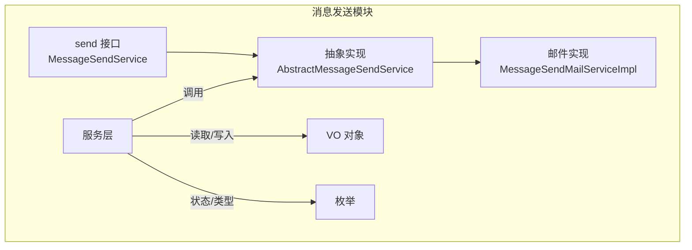
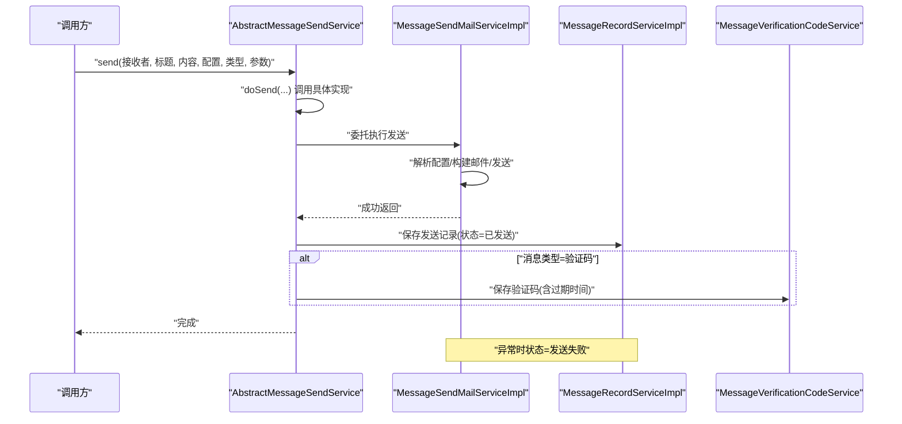
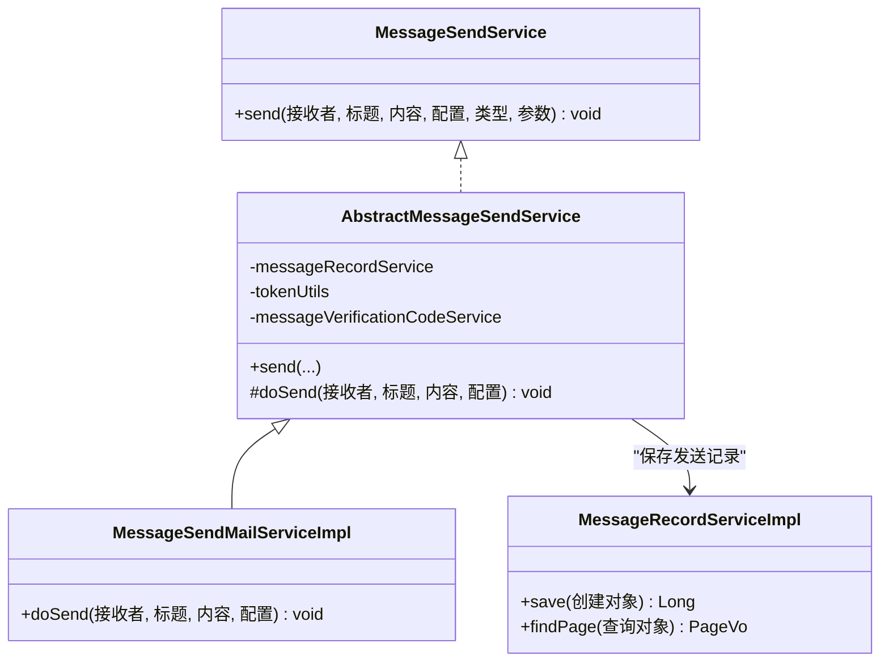
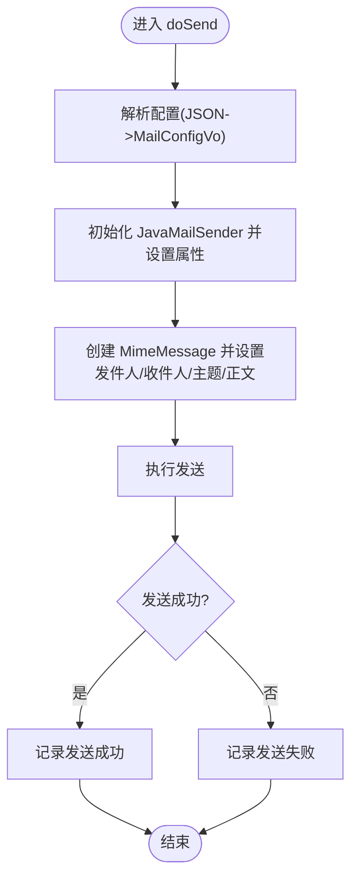
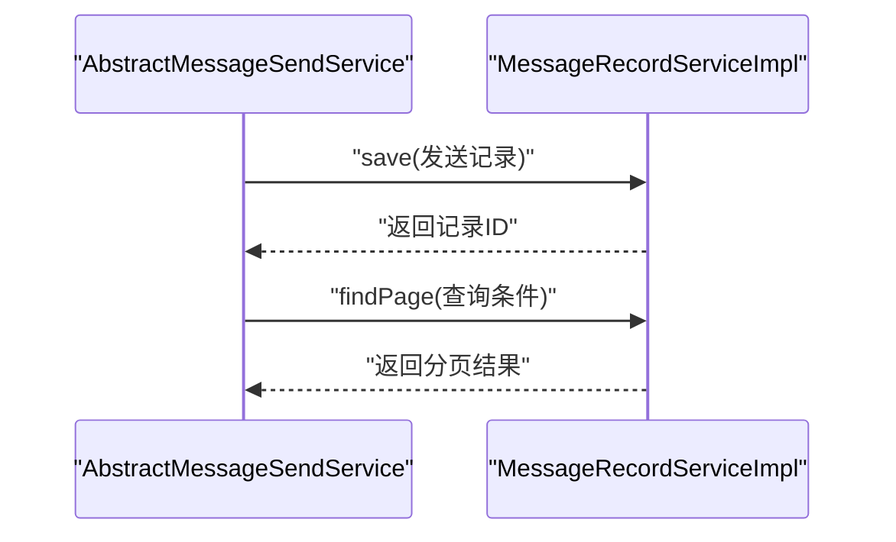
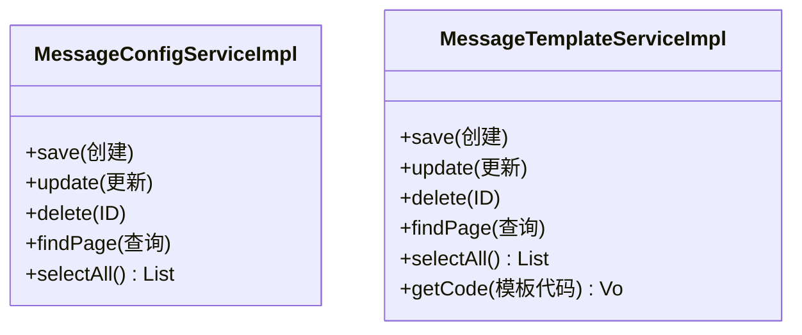
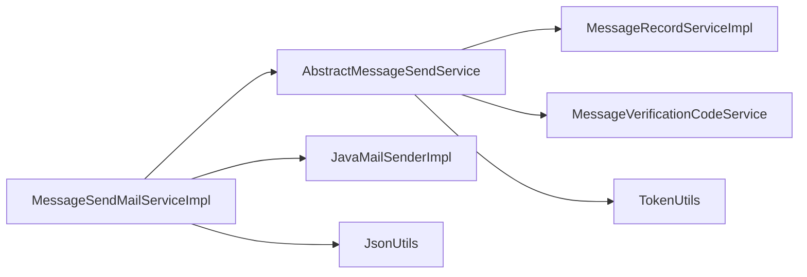

# 消息发送API

<cite>
**本文引用的文件**
- [message-module/src/main/java/com/fastproject/message/send/MessageSendService.java](file://message-module/src/main/java/com/fastproject/message/send/MessageSendService.java)
- [message-module/src/main/java/com/fastproject/message/send/impl/MessageSendMailServiceImpl.java](file://message-module/src/main/java/com/fastproject/message/send/impl/MessageSendMailServiceImpl.java)
- [message-module/src/main/java/com/fastproject/message/send/AbstractMessageSendService.java](file://message-module/src/main/java/com/fastproject/message/send/AbstractMessageSendService.java)
- [message-module/src/main/java/com/fastproject/message/service/impl/MessageRecordServiceImpl.java](file://message-module/src/main/java/com/fastproject/message/service/impl/MessageRecordServiceImpl.java)
- [message-module/src/main/java/com/fastproject/message/service/impl/MessageConfigServiceImpl.java](file://message-module/src/main/java/com/fastproject/message/service/impl/MessageConfigServiceImpl.java)
- [message-module/src/main/java/com/fastproject/message/service/impl/MessageTemplateServiceImpl.java](file://message-module/src/main/java/com/fastproject/message/service/impl/MessageTemplateServiceImpl.java)
- [message-module/src/main/java/com/fastproject/message/vo/config/MessageConfigVo.java](file://message-module/src/main/java/com/fastproject/message/vo/config/MessageConfigVo.java)
- [message-module/src/main/java/com/fastproject/message/vo/test/MessageTestSend.java](file://message-module/src/main/java/com/fastproject/message/vo/test/MessageTestSend.java)
- [message-module/src/main/java/com/fastproject/message/send/vo/MailConfigVo.java](file://message-module/src/main/java/com/fastproject/message/send/vo/MailConfigVo.java)
- [message-api/src/main/java/com/fastproject/message/enums/MessageTypeEnum.java](file://message-api/src/main/java/com/fastproject/message/enums/MessageTypeEnum.java)
- [message-api/src/main/java/com/fastproject/message/enums/MessageRecordStatusEnum.java](file://message-api/src/main/java/com/fastproject/message/enums/MessageRecordStatusEnum.java)
</cite>

## 目录
1. [简介](#简介)
2. [项目结构](#项目结构)
3. [核心组件](#核心组件)
4. [架构总览](#架构总览)
5. [详细组件分析](#详细组件分析)
6. [依赖关系分析](#依赖关系分析)
7. [性能考虑](#性能考虑)
8. [故障排查指南](#故障排查指南)
9. [结论](#结论)
10. [附录](#附录)

## 简介
本文件面向消息发送接口的使用者与维护者，系统性梳理消息发送能力，覆盖单条发送、模板变量绑定、收件人管理、发送状态跟踪、发送结果回调、失败重试机制、发送进度查询与统计分析等主题，并提供性能优化、并发控制与资源限制的技术建议。当前仓库实现了基于 JavaMail 的邮件发送能力，支持通过消息配置与模板进行参数化发送。

## 项目结构
消息发送相关代码主要位于 message-module 模块中，采用分层设计：
- send 层：定义发送接口与抽象实现，具体实现为邮件发送服务
- service 层：提供消息配置、模板、记录、验证码等业务服务
- vo 层：传输对象，包括配置、测试发送、邮件配置等
- enums 层：消息类型、记录状态等枚举

**图表来源**
- [message-module/src/main/java/com/fastproject/message/send/MessageSendService.java](file://message-module/src/main/java/com/fastproject/message/send/MessageSendService.java#L1-L26)
- [message-module/src/main/java/com/fastproject/message/send/AbstractMessageSendService.java](file://message-module/src/main/java/com/fastproject/message/send/AbstractMessageSendService.java#L1-L68)
- [message-module/src/main/java/com/fastproject/message/send/impl/MessageSendMailServiceImpl.java](file://message-module/src/main/java/com/fastproject/message/send/impl/MessageSendMailServiceImpl.java#L1-L100)

**章节来源**
- [message-module/src/main/java/com/fastproject/message/send/MessageSendService.java](file://message-module/src/main/java/com/fastproject/message/send/MessageSendService.java#L1-L26)
- [message-module/src/main/java/com/fastproject/message/send/AbstractMessageSendService.java](file://message-module/src/main/java/com/fastproject/message/send/AbstractMessageSendService.java#L1-L68)
- [message-module/src/main/java/com/fastproject/message/send/impl/MessageSendMailServiceImpl.java](file://message-module/src/main/java/com/fastproject/message/send/impl/MessageSendMailServiceImpl.java#L1-L100)

## 核心组件
- 发送接口与抽象实现
  - 接口定义了统一的发送方法，包含接收者、标题、内容、配置、消息类型与参数等关键字段
  - 抽象实现负责发送前后的通用流程：状态判定、记录创建、验证码保存（当消息类型为验证码时）
- 邮件发送实现
  - 基于 JavaMailSenderImpl，从配置中解析出 SMTP 主机、端口、用户名、密码、协议、编码、认证与 TLS 等参数
  - 支持 HTML 正文，自动设置发件人、收件人、主题
- 服务层
  - 消息记录服务：保存发送记录、分页查询、删除等
  - 消息配置服务：保存/更新/删除配置、分页查询、按状态选择
  - 模板服务：保存/更新/删除模板、分页查询、按代码获取模板
- VO 与枚举
  - MessageConfigVo：消息配置的展示对象
  - MailConfigVo：邮件配置的传输对象（JSON 映射）
  - MessageTestSend：测试发送的输入对象
  - MessageTypeEnum：消息类型（验证码/通知）
  - MessageRecordStatusEnum：发送记录状态（已发送/发送失败）

**章节来源**
- [message-module/src/main/java/com/fastproject/message/send/MessageSendService.java](file://message-module/src/main/java/com/fastproject/message/send/MessageSendService.java#L1-L26)
- [message-module/src/main/java/com/fastproject/message/send/AbstractMessageSendService.java](file://message-module/src/main/java/com/fastproject/message/send/AbstractMessageSendService.java#L1-L68)
- [message-module/src/main/java/com/fastproject/message/send/impl/MessageSendMailServiceImpl.java](file://message-module/src/main/java/com/fastproject/message/send/impl/MessageSendMailServiceImpl.java#L1-L100)
- [message-module/src/main/java/com/fastproject/message/service/impl/MessageRecordServiceImpl.java](file://message-module/src/main/java/com/fastproject/message/service/impl/MessageRecordServiceImpl.java#L1-L105)
- [message-module/src/main/java/com/fastproject/message/service/impl/MessageConfigServiceImpl.java](file://message-module/src/main/java/com/fastproject/message/service/impl/MessageConfigServiceImpl.java#L1-L132)
- [message-module/src/main/java/com/fastproject/message/service/impl/MessageTemplateServiceImpl.java](file://message-module/src/main/java/com/fastproject/message/service/impl/MessageTemplateServiceImpl.java#L1-L138)
- [message-module/src/main/java/com/fastproject/message/vo/config/MessageConfigVo.java](file://message-module/src/main/java/com/fastproject/message/vo/config/MessageConfigVo.java#L1-L40)
- [message-module/src/main/java/com/fastproject/message/vo/test/MessageTestSend.java](file://message-module/src/main/java/com/fastproject/message/vo/test/MessageTestSend.java#L1-L24)
- [message-module/src/main/java/com/fastproject/message/send/vo/MailConfigVo.java](file://message-module/src/main/java/com/fastproject/message/send/vo/MailConfigVo.java#L1-L70)
- [message-api/src/main/java/com/fastproject/message/enums/MessageTypeEnum.java](file://message-api/src/main/java/com/fastproject/message/enums/MessageTypeEnum.java#L1-L26)
- [message-api/src/main/java/com/fastproject/message/enums/MessageRecordStatusEnum.java](file://message-api/src/main/java/com/fastproject/message/enums/MessageRecordStatusEnum.java#L1-L27)

## 架构总览
消息发送的整体流程如下：
- 调用方通过发送接口发起发送请求
- 抽象实现封装通用逻辑：记录发送状态、持久化发送记录、在验证码场景下保存验证码
- 具体实现执行底层发送（如邮件），异常时统一记录失败状态
- 服务层提供配置、模板与记录的 CRUD 与查询能力

**图表来源**
- [message-module/src/main/java/com/fastproject/message/send/AbstractMessageSendService.java](file://message-module/src/main/java/com/fastproject/message/send/AbstractMessageSendService.java#L26-L63)
- [message-module/src/main/java/com/fastproject/message/send/impl/MessageSendMailServiceImpl.java](file://message-module/src/main/java/com/fastproject/message/send/impl/MessageSendMailServiceImpl.java#L47-L98)
- [message-module/src/main/java/com/fastproject/message/service/impl/MessageRecordServiceImpl.java](file://message-module/src/main/java/com/fastproject/message/service/impl/MessageRecordServiceImpl.java#L35-L41)

## 详细组件分析

### 发送接口与抽象实现
- 统一入口：send 方法接收接收者、标题、内容、配置、消息类型与参数
- 状态管理：成功标记为“已发送”，异常标记为“发送失败”
- 记录持久化：将发送记录写入数据库，包含配置ID、接收者、内容、标题、消息类型、操作人等
- 验证码处理：当消息类型为验证码时，保存验证码并设置过期时间

**图表来源**
- [message-module/src/main/java/com/fastproject/message/send/MessageSendService.java](file://message-module/src/main/java/com/fastproject/message/send/MessageSendService.java#L7-L23)
- [message-module/src/main/java/com/fastproject/message/send/AbstractMessageSendService.java](file://message-module/src/main/java/com/fastproject/message/send/AbstractMessageSendService.java#L20-L67)
- [message-module/src/main/java/com/fastproject/message/send/impl/MessageSendMailServiceImpl.java](file://message-module/src/main/java/com/fastproject/message/send/impl/MessageSendMailServiceImpl.java#L25-L98)
- [message-module/src/main/java/com/fastproject/message/service/impl/MessageRecordServiceImpl.java](file://message-module/src/main/java/com/fastproject/message/service/impl/MessageRecordServiceImpl.java#L35-L41)

**章节来源**
- [message-module/src/main/java/com/fastproject/message/send/MessageSendService.java](file://message-module/src/main/java/com/fastproject/message/send/MessageSendService.java#L7-L23)
- [message-module/src/main/java/com/fastproject/message/send/AbstractMessageSendService.java](file://message-module/src/main/java/com/fastproject/message/send/AbstractMessageSendService.java#L26-L63)

### 邮件发送实现
- 配置解析：从 MessageConfigVo 中读取 JSON 配置，映射到 MailConfigVo
- 连接与属性：设置主机、端口、用户名、密码、协议、编码、认证与 TLS
- 邮件构建：设置发件人、收件人、主题、HTML 正文
- 异常处理：捕获发送异常并抛出业务异常，同时记录失败状态

**图表来源**
- [message-module/src/main/java/com/fastproject/message/send/impl/MessageSendMailServiceImpl.java](file://message-module/src/main/java/com/fastproject/message/send/impl/MessageSendMailServiceImpl.java#L47-L98)
- [message-module/src/main/java/com/fastproject/message/send/vo/MailConfigVo.java](file://message-module/src/main/java/com/fastproject/message/send/vo/MailConfigVo.java#L23-L69)

**章节来源**
- [message-module/src/main/java/com/fastproject/message/send/impl/MessageSendMailServiceImpl.java](file://message-module/src/main/java/com/fastproject/message/send/impl/MessageSendMailServiceImpl.java#L47-L98)
- [message-module/src/main/java/com/fastproject/message/send/vo/MailConfigVo.java](file://message-module/src/main/java/com/fastproject/message/send/vo/MailConfigVo.java#L9-L20)

### 消息记录与查询
- 保存：将发送记录持久化，返回主键
- 查询：支持分页查询，按标题、接收者、消息类型、状态过滤
- 删除：支持单条与批量删除

**图表来源**
- [message-module/src/main/java/com/fastproject/message/send/AbstractMessageSendService.java](file://message-module/src/main/java/com/fastproject/message/send/AbstractMessageSendService.java#L38-L48)
- [message-module/src/main/java/com/fastproject/message/service/impl/MessageRecordServiceImpl.java](file://message-module/src/main/java/com/fastproject/message/service/impl/MessageRecordServiceImpl.java#L77-L103)

**章节来源**
- [message-module/src/main/java/com/fastproject/message/service/impl/MessageRecordServiceImpl.java](file://message-module/src/main/java/com/fastproject/message/service/impl/MessageRecordServiceImpl.java#L35-L103)

### 消息配置与模板
- 配置管理：保存/更新/删除配置；按标题、类型、状态分页查询；按状态选择全部可用配置
- 模板管理：保存/更新/删除模板；按标题、代码、类型ID、状态分页查询；按模板代码获取模板

**图表来源**
- [message-module/src/main/java/com/fastproject/message/service/impl/MessageConfigServiceImpl.java](file://message-module/src/main/java/com/fastproject/message/service/impl/MessageConfigServiceImpl.java#L38-L131)
- [message-module/src/main/java/com/fastproject/message/service/impl/MessageTemplateServiceImpl.java](file://message-module/src/main/java/com/fastproject/message/service/impl/MessageTemplateServiceImpl.java#L38-L137)

**章节来源**
- [message-module/src/main/java/com/fastproject/message/service/impl/MessageConfigServiceImpl.java](file://message-module/src/main/java/com/fastproject/message/service/impl/MessageConfigServiceImpl.java#L38-L131)
- [message-module/src/main/java/com/fastproject/message/service/impl/MessageTemplateServiceImpl.java](file://message-module/src/main/java/com/fastproject/message/service/impl/MessageTemplateServiceImpl.java#L38-L137)

### 数据结构与参数绑定
- 发送请求数据结构
  - 接收者：字符串，如邮箱地址
  - 标题：字符串
  - 内容：字符串，支持 HTML
  - 配置：MessageConfigVo，包含配置ID、类型、JSON 配置、描述、状态
  - 消息类型：MessageTypeEnum，如验证码/通知
  - 参数：Map<String, Object>，用于模板变量绑定与验证码生成
- 模板变量绑定
  - 通过参数 Map 提供占位符替换值
  - 验证码场景下，参数中应包含验证码值
- 收件人列表管理
  - 当前实现为单条发送；批量发送需在上层循环调用或扩展实现
- 发送状态跟踪
  - 使用 MessageRecordStatusEnum 标识“已发送/发送失败”
  - 发送记录包含配置ID、接收者、标题、内容、消息类型、操作人等

**章节来源**
- [message-module/src/main/java/com/fastproject/message/vo/config/MessageConfigVo.java](file://message-module/src/main/java/com/fastproject/message/vo/config/MessageConfigVo.java#L9-L39)
- [message-module/src/main/java/com/fastproject/message/vo/test/MessageTestSend.java](file://message-module/src/main/java/com/fastproject/message/vo/test/MessageTestSend.java#L10-L22)
- [message-api/src/main/java/com/fastproject/message/enums/MessageTypeEnum.java](file://message-api/src/main/java/com/fastproject/message/enums/MessageTypeEnum.java#L11-L21)
- [message-api/src/main/java/com/fastproject/message/enums/MessageRecordStatusEnum.java](file://message-api/src/main/java/com/fastproject/message/enums/MessageRecordStatusEnum.java#L11-L21)

### 高级功能与扩展点
- 发送结果回调
  - 可在抽象实现中扩展回调钩子，在发送完成后触发外部回调（当前实现未内置回调）
- 失败重试机制
  - 可在 doSend 外围增加重试策略（指数退避、最大重试次数），结合发送记录状态进行幂等判断
- 发送进度查询
  - 利用消息记录服务的分页查询能力，按状态筛选“已发送/发送失败”进行进度统计
- 发送统计分析
  - 基于消息记录表按时间、类型、状态聚合统计，结合报表工具输出

**章节来源**
- [message-module/src/main/java/com/fastproject/message/send/AbstractMessageSendService.java](file://message-module/src/main/java/com/fastproject/message/send/AbstractMessageSendService.java#L26-L48)
- [message-module/src/main/java/com/fastproject/message/service/impl/MessageRecordServiceImpl.java](file://message-module/src/main/java/com/fastproject/message/service/impl/MessageRecordServiceImpl.java#L77-L103)

## 依赖关系分析
- 组件耦合
  - AbstractMessageSendService 依赖消息记录服务与验证码服务，便于统一记录与验证码处理
  - MessageSendMailServiceImpl 依赖 JavaMailSender，职责单一且可替换
- 外部依赖
  - JavaMailSenderImpl：邮件发送核心
  - JsonUtils：配置 JSON 解析
  - TokenUtils：获取当前操作人信息
- 可能的循环依赖
  - 当前结构清晰，无明显循环依赖

**图表来源**
- [message-module/src/main/java/com/fastproject/message/send/impl/MessageSendMailServiceImpl.java](file://message-module/src/main/java/com/fastproject/message/send/impl/MessageSendMailServiceImpl.java#L35-L98)
- [message-module/src/main/java/com/fastproject/message/send/AbstractMessageSendService.java](file://message-module/src/main/java/com/fastproject/message/send/AbstractMessageSendService.java#L22-L24)

**章节来源**
- [message-module/src/main/java/com/fastproject/message/send/impl/MessageSendMailServiceImpl.java](file://message-module/src/main/java/com/fastproject/message/send/impl/MessageSendMailServiceImpl.java#L35-L98)
- [message-module/src/main/java/com/fastproject/message/send/AbstractMessageSendService.java](file://message-module/src/main/java/com/fastproject/message/send/AbstractMessageSendService.java#L22-L24)

## 性能考虑
- 并发控制策略
  - 单实例线程安全：JavaMailSender 实例每次发送时创建，避免跨线程共享导致的并发问题
  - 批量发送建议：在上层进行限流与并发控制，避免瞬时大量连接
- 资源限制配置
  - SMTP 连接池：可通过自定义 JavaMailSender 配置连接池参数（当前实现未显式配置）
  - 超时设置：建议在配置中增加连接超时与读取超时参数
- 发送性能优化
  - 模板渲染：在调用前完成模板变量绑定，减少重复计算
  - 日志级别：生产环境降低日志级别，避免频繁 I/O 影响吞吐
  - 异步发送：对非关键路径可引入异步队列，解耦请求与发送

[本节为通用性能建议，不直接分析具体文件]

## 故障排查指南
- 常见错误与定位
  - 邮件发送失败：查看日志中的异常堆栈，确认 SMTP 主机、端口、认证与 TLS 配置是否正确
  - 配置解析失败：确认 MessageConfigVo 中的配置 JSON 结构与 MailConfigVo 字段一致
  - 发送记录缺失：检查发送后是否成功保存发送记录，核对状态字段
- 排查步骤
  - 核对消息配置状态与类型
  - 校验模板代码与参数 Map 的键值
  - 查看发送记录分页查询结果，按状态筛选失败项
  - 在验证码场景下，确认验证码是否保存且未过期

**章节来源**
- [message-module/src/main/java/com/fastproject/message/send/impl/MessageSendMailServiceImpl.java](file://message-module/src/main/java/com/fastproject/message/send/impl/MessageSendMailServiceImpl.java#L94-L97)
- [message-module/src/main/java/com/fastproject/message/service/impl/MessageRecordServiceImpl.java](file://message-module/src/main/java/com/fastproject/message/service/impl/MessageRecordServiceImpl.java#L77-L103)

## 结论
该消息发送 API 以接口+抽象实现的方式提供了清晰的扩展点，当前实现聚焦于邮件发送，具备完善的发送记录与验证码处理能力。建议后续在批量发送、回调、重试与异步化等方面进一步增强，以满足高并发与复杂业务场景的需求。

[本节为总结性内容，不直接分析具体文件]

## 附录

### API 定义与调用流程
- 单条发送
  - 调用 send 方法，传入接收者、标题、内容、配置、消息类型与参数
  - 抽象实现记录状态并保存发送记录；验证码类型额外保存验证码
- 批量发送
  - 当前未提供批量发送接口，可在上层循环调用或扩展实现
- 定时发送与条件触发发送
  - 未提供定时调度与条件触发接口，可在任务调度模块中调用发送接口实现

**章节来源**
- [message-module/src/main/java/com/fastproject/message/send/MessageSendService.java](file://message-module/src/main/java/com/fastproject/message/send/MessageSendService.java#L16-L23)
- [message-module/src/main/java/com/fastproject/message/send/AbstractMessageSendService.java](file://message-module/src/main/java/com/fastproject/message/send/AbstractMessageSendService.java#L26-L63)