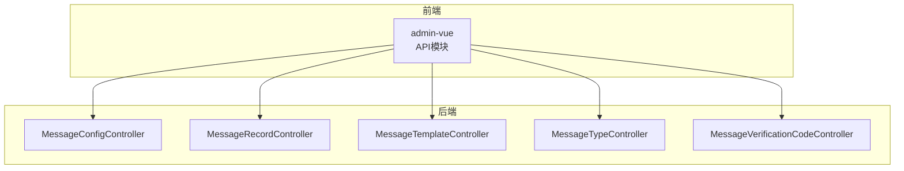
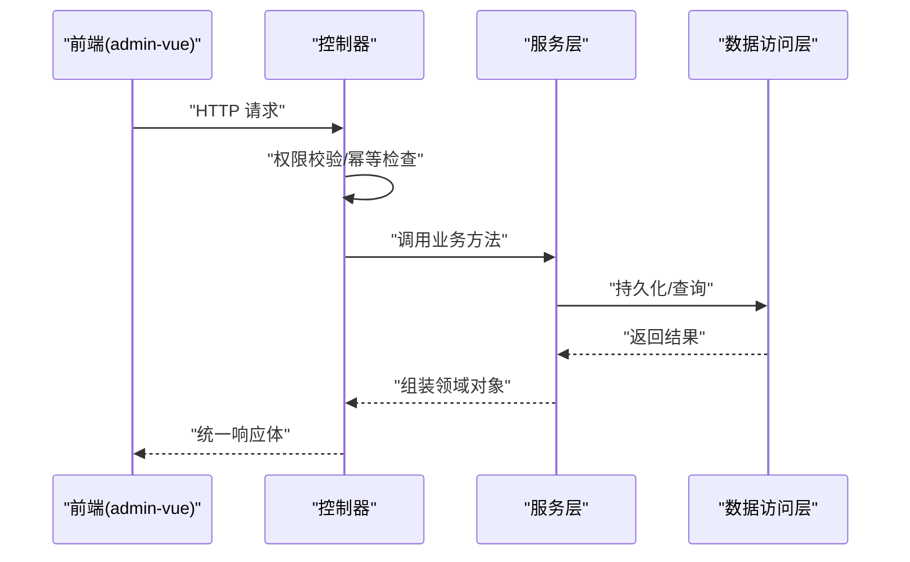
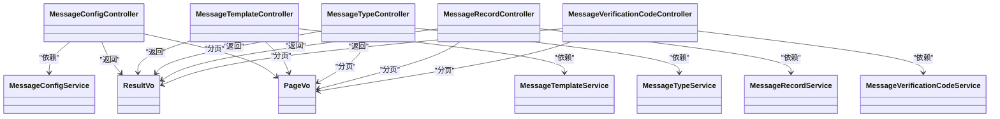

# 消息服务API

<cite>
**本文引用的文件**
- [MessageConfigController.java](file://run-admin/src/main/java/com/fastproject/module/message/controller/MessageConfigController.java)
- [MessageRecordController.java](file://run-admin/src/main/java/com/fastproject/module/message/controller/MessageRecordController.java)
- [MessageTemplateController.java](file://run-admin/src/main/java/com/fastproject/module/message/controller/MessageTemplateController.java)
- [MessageTypeController.java](file://run-admin/src/main/java/com/fastproject/module/message/controller/MessageTypeController.java)
- [MessageVerificationCodeController.java](file://run-admin/src/main/java/com/fastproject/module/message/controller/MessageVerificationCodeController.java)
- [MessageTypeEnum.java](file://message-api/src/main/java/com/fastproject/message/enums/MessageTypeEnum.java)
- [MessageRecordStatusEnum.java](file://message-api/src/main/java/com/fastproject/message/enums/MessageRecordStatusEnum.java)
- [MessageVerificationCodeStatusEnum.java](file://message-api/src/main/java/com/fastproject/message/enums/MessageVerificationCodeStatusEnum.java)
- [messageconfig.ts](file://fast-ui/apps/admin-vue/src/api/message/messageconfig.ts)
- [messagetype.ts](file://fast-ui/apps/admin-vue/src/api/message/messagetype.ts)
</cite>

## 目录
1. [简介](#简介)
2. [项目结构](#项目结构)
3. [核心组件](#核心组件)
4. [架构总览](#架构总览)
5. [详细组件分析](#详细组件分析)
6. [依赖关系分析](#依赖关系分析)
7. [性能考虑](#性能考虑)
8. [故障排查指南](#故障排查指南)
9. [结论](#结论)
10. [附录](#附录)

## 简介
本文件为消息服务模块的完整API接口文档，覆盖消息配置管理、消息发送记录、消息模板、消息类型以及验证码管理等核心功能。文档面向前后端开发者与测试人员，提供RESTful API的HTTP方法、URL路径、请求参数、响应格式及典型用例，并对消息类型定义、发送渠道配置、模板变量替换、发送状态跟踪与可靠性保障（幂等、日志、权限控制）进行规范说明。

## 项目结构
消息服务API位于后端运行模块中，采用Spring MVC控制器对外暴露REST接口；前端通过Axios封装的API模块调用后端接口。消息类型与状态枚举定义在独立的API模块中，供前后端共享。

图表来源
- [MessageConfigController.java](file://run-admin/src/main/java/com/fastproject/module/message/controller/MessageConfigController.java#L24-L101)
- [MessageRecordController.java](file://run-admin/src/main/java/com/fastproject/module/message/controller/MessageRecordController.java#L20-L67)
- [MessageTemplateController.java](file://run-admin/src/main/java/com/fastproject/module/message/controller/MessageTemplateController.java#L24-L101)
- [MessageTypeController.java](file://run-admin/src/main/java/com/fastproject/module/message/controller/MessageTypeController.java#L24-L101)
- [MessageVerificationCodeController.java](file://run-admin/src/main/java/com/fastproject/module/message/controller/MessageVerificationCodeController.java#L17-L61)

章节来源
- [MessageConfigController.java](file://run-admin/src/main/java/com/fastproject/module/message/controller/MessageConfigController.java#L24-L101)
- [MessageRecordController.java](file://run-admin/src/main/java/com/fastproject/module/message/controller/MessageRecordController.java#L20-L67)
- [MessageTemplateController.java](file://run-admin/src/main/java/com/fastproject/module/message/controller/MessageTemplateController.java#L24-L101)
- [MessageTypeController.java](file://run-admin/src/main/java/com/fastproject/module/message/controller/MessageTypeController.java#L24-L101)
- [MessageVerificationCodeController.java](file://run-admin/src/main/java/com/fastproject/module/message/controller/MessageVerificationCodeController.java#L17-L61)

## 核心组件
- 消息配置管理：负责发送渠道（如邮件、短信）的配置维护，支持分页查询、详情查看、新增、更新、删除、批量删除与下拉选择。
- 消息模板管理：负责消息模板的增删改查、分页与下拉选择，支持模板变量占位符的使用。
- 消息类型管理：定义消息分类（如验证码、通知），支持分页与下拉选择。
- 发送记录查询：提供消息发送记录的分页、详情、删除与批量删除。
- 验证码管理：提供验证码的分页、详情、删除与批量删除，便于审计与问题追踪。

章节来源
- [MessageConfigController.java](file://run-admin/src/main/java/com/fastproject/module/message/controller/MessageConfigController.java#L24-L101)
- [MessageTemplateController.java](file://run-admin/src/main/java/com/fastproject/module/message/controller/MessageTemplateController.java#L24-L101)
- [MessageTypeController.java](file://run-admin/src/main/java/com/fastproject/module/message/controller/MessageTypeController.java#L24-L101)
- [MessageRecordController.java](file://run-admin/src/main/java/com/fastproject/module/message/controller/MessageRecordController.java#L20-L67)
- [MessageVerificationCodeController.java](file://run-admin/src/main/java/com/fastproject/module/message/controller/MessageVerificationCodeController.java#L17-L61)

## 架构总览
消息服务API采用标准的MVC架构，控制器层负责接收HTTP请求、鉴权与幂等处理，服务层执行业务逻辑，返回统一结果包装对象。前端通过admin-vue的API模块发起请求，后端通过权限注解与日志注解保证安全与可观测性。

图表来源
- [MessageConfigController.java](file://run-admin/src/main/java/com/fastproject/module/message/controller/MessageConfigController.java#L34-L52)
- [MessageTemplateController.java](file://run-admin/src/main/java/com/fastproject/module/message/controller/MessageTemplateController.java#L34-L52)
- [MessageTypeController.java](file://run-admin/src/main/java/com/fastproject/module/message/controller/MessageTypeController.java#L34-L52)
- [MessageRecordController.java](file://run-admin/src/main/java/com/fastproject/module/message/controller/MessageRecordController.java#L52-L56)
- [MessageVerificationCodeController.java](file://run-admin/src/main/java/com/fastproject/module/message/controller/MessageVerificationCodeController.java#L47-L51)

## 详细组件分析

### 消息配置管理 API
- 功能概述：维护消息发送渠道配置，支持分页查询、详情查看、新增、更新、删除、批量删除与下拉选择。
- 权限与幂等：新增与更新接口启用幂等注解与业务日志，涉及权限点包括“添加”、“更新”、“删除”、“分页”。
- 统一响应：所有接口返回统一结果包装对象，包含状态码、消息与数据体。

接口清单
- 新增配置
  - 方法：POST
  - 路径：/message/config
  - 权限：admin:message:config:add
  - 幂等：是
  - 请求体：配置创建对象
  - 响应：统一结果包装对象
- 更新配置
  - 方法：PUT
  - 路径：/message/config
  - 权限：admin:message:config:update
  - 幂等：是
  - 请求体：配置更新对象
  - 响应：统一结果包装对象
- 删除配置
  - 方法：DELETE
  - 路径：/message/config/{id}
  - 权限：admin:message:config:delete
  - 请求体：无
  - 响应：统一结果包装对象
- 批量删除配置
  - 方法：DELETE
  - 路径：/message/config/batch
  - 权限：admin:message:config:delete
  - 请求体：ID数组
  - 响应：统一结果包装对象
- 分页查询
  - 方法：POST
  - 路径：/message/config/page
  - 权限：admin:message:config:page
  - 请求体：配置查询对象
  - 响应：分页结果包装对象
- 详情查询
  - 方法：GET
  - 路径：/message/config/{id}
  - 权限：admin:message:config:page
  - 响应：配置详情对象
- 下拉选择
  - 方法：GET
  - 路径：/message/config/selectAll
  - 响应：ID-标题列表

章节来源
- [MessageConfigController.java](file://run-admin/src/main/java/com/fastproject/module/message/controller/MessageConfigController.java#L34-L100)
- [messageconfig.ts](file://fast-ui/apps/admin-vue/src/api/message/messageconfig.ts#L46-L101)

### 消息模板管理 API
- 功能概述：维护消息模板，支持分页查询、详情查看、新增、更新、删除、批量删除与下拉选择。
- 权限与幂等：新增与更新接口启用幂等注解与业务日志，涉及权限点包括“添加”、“更新”、“删除”、“分页”。

接口清单
- 新增模板
  - 方法：POST
  - 路径：/message/template
  - 权限：admin:message:template:add
  - 幂等：是
  - 请求体：模板创建对象
  - 响应：统一结果包装对象
- 更新模板
  - 方法：PUT
  - 路径：/message/template
  - 权限：admin:message:template:update
  - 幂等：是
  - 请求体：模板更新对象
  - 响应：统一结果包装对象
- 删除模板
  - 方法：DELETE
  - 路径：/message/template/{id}
  - 权限：admin:message:template:delete
  - 响应：统一结果包装对象
- 批量删除模板
  - 方法：DELETE
  - 路径：/message/template/batch
  - 权限：admin:message:template:delete
  - 请求体：ID数组
  - 响应：统一结果包装对象
- 分页查询
  - 方法：POST
  - 路径：/message/template/page
  - 权限：admin:message:template:page
  - 请求体：模板查询对象
  - 响应：分页结果包装对象
- 详情查询
  - 方法：GET
  - 路径：/message/template/{id}
  - 权限：admin:message:template:page
  - 响应：模板详情对象
- 下拉选择
  - 方法：GET
  - 路径：/message/template/selectAll
  - 响应：模板列表

章节来源
- [MessageTemplateController.java](file://run-admin/src/main/java/com/fastproject/module/message/controller/MessageTemplateController.java#L34-L100)
- [messagetype.ts](file://fast-ui/apps/admin-vue/src/api/message/messagetype.ts#L46-L77)

### 消息类型管理 API
- 功能概述：定义消息分类（如验证码、通知），支持分页查询、详情查看、新增、更新、删除、批量删除与下拉选择。
- 权限与幂等：新增与更新接口启用幂等注解与业务日志，涉及权限点包括“添加”、“更新”、“删除”、“分页”。

接口清单
- 新增类型
  - 方法：POST
  - 路径：/message/type
  - 权限：admin:message:type:add
  - 幂等：是
  - 请求体：类型创建对象
  - 响应：统一结果包装对象
- 更新类型
  - 方法：PUT
  - 路径：/message/type
  - 权限：admin:message:type:update
  - 幂等：是
  - 请求体：类型更新对象
  - 响应：统一结果包装对象
- 删除类型
  - 方法：DELETE
  - 路径：/message/type/{id}
  - 权限：admin:message:type:delete
  - 响应：统一结果包装对象
- 批量删除类型
  - 方法：DELETE
  - 路径：/message/type/batch
  - 权限：admin:message:type:delete
  - 请求体：ID数组
  - 响应：统一结果包装对象
- 分页查询
  - 方法：POST
  - 路径：/message/type/page
  - 权限：admin:message:type:page
  - 请求体：类型查询对象
  - 响应：分页结果包装对象
- 详情查询
  - 方法：GET
  - 路径：/message/type/{id}
  - 权限：admin:message:type:page
  - 响应：类型详情对象
- 下拉选择
  - 方法：GET
  - 路径：/message/type/selectAll
  - 响应：ID-标题列表

章节来源
- [MessageTypeController.java](file://run-admin/src/main/java/com/fastproject/module/message/controller/MessageTypeController.java#L34-L100)
- [messagetype.ts](file://fast-ui/apps/admin-vue/src/api/message/messagetype.ts#L46-L77)

### 发送记录查询 API
- 功能概述：提供消息发送记录的分页、详情、删除与批量删除，便于审计与问题追踪。
- 权限：涉及“删除”、“分页”权限点。

接口清单
- 删除记录
  - 方法：DELETE
  - 路径：/message/record/{id}
  - 权限：admin:message:record:delete
  - 响应：统一结果包装对象
- 批量删除记录
  - 方法：DELETE
  - 路径：/message/record/batch
  - 权限：admin:message:record:delete
  - 请求体：ID数组
  - 响应：统一结果包装对象
- 分页查询
  - 方法：POST
  - 路径：/message/record/page
  - 权限：admin:message:record:page
  - 请求体：记录查询对象
  - 响应：分页结果包装对象
- 详情查询
  - 方法：GET
  - 路径：/message/record/{id}
  - 权限：admin:message:record:page
  - 响应：记录详情对象

章节来源
- [MessageRecordController.java](file://run-admin/src/main/java/com/fastproject/module/message/controller/MessageRecordController.java#L30-L65)

### 验证码管理 API
- 功能概述：提供验证码的分页、详情、删除与批量删除，便于审计与问题追踪。
- 权限：涉及“删除”、“分页”权限点。

接口清单
- 删除验证码
  - 方法：DELETE
  - 路径：/message/verificationCode/{id}
  - 权限：admin:message:verificationCode:delete
  - 响应：统一结果包装对象
- 批量删除验证码
  - 方法：DELETE
  - 路径：/message/verificationCode/batch
  - 权限：admin:message:verificationCode:delete
  - 请求体：ID数组
  - 响应：统一结果包装对象
- 分页查询
  - 方法：POST
  - 路径：/message/verificationCode/page
  - 权限：admin:message:verificationCode:page
  - 请求体：验证码查询对象
  - 响应：分页结果包装对象
- 详情查询
  - 方法：GET
  - 路径：/message/verificationCode/{id}
  - 权限：admin:message:verificationCode:page
  - 响应：验证码详情对象

章节来源
- [MessageVerificationCodeController.java](file://run-admin/src/main/java/com/fastproject/module/message/controller/MessageVerificationCodeController.java#L27-L60)

### 消息类型定义与状态枚举
- 消息类型枚举：定义消息分类，如验证码、通知等。
- 发送记录状态枚举：定义发送状态，如已发送、发送失败。
- 验证码状态枚举：定义验证码状态，如有效、已使用、已过期。

章节来源
- [MessageTypeEnum.java](file://message-api/src/main/java/com/fastproject/message/enums/MessageTypeEnum.java#L11-L25)
- [MessageRecordStatusEnum.java](file://message-api/src/main/java/com/fastproject/message/enums/MessageRecordStatusEnum.java#L11-L26)
- [MessageVerificationCodeStatusEnum.java](file://message-api/src/main/java/com/fastproject/message/enums/MessageVerificationCodeStatusEnum.java#L11-L30)

## 依赖关系分析
消息服务API的控制器依赖于对应的服务接口，服务层再依赖数据访问层完成持久化操作。统一响应包装类贯穿整个调用链，确保前后端交互的一致性。

图表来源
- [MessageConfigController.java](file://run-admin/src/main/java/com/fastproject/module/message/controller/MessageConfigController.java#L29-L99)
- [MessageTemplateController.java](file://run-admin/src/main/java/com/fastproject/module/message/controller/MessageTemplateController.java#L29-L99)
- [MessageTypeController.java](file://run-admin/src/main/java/com/fastproject/module/message/controller/MessageTypeController.java#L29-L99)
- [MessageRecordController.java](file://run-admin/src/main/java/com/fastproject/module/message/controller/MessageRecordController.java#L25-L65)
- [MessageVerificationCodeController.java](file://run-admin/src/main/java/com/fastproject/module/message/controller/MessageVerificationCodeController.java#L22-L60)

## 性能考虑
- 分页查询：建议前端传入合理的分页参数，避免一次性加载过多数据。
- 批量操作：批量删除与批量查询可减少网络往返，但需注意单次批量大小限制，避免阻塞数据库。
- 缓存策略：对于高频读取的配置与模板，可在服务层引入缓存以降低数据库压力。
- 幂等设计：新增与更新接口已启用幂等，避免重复提交导致的数据不一致。
- 日志与监控：控制器层集成业务日志注解，便于追踪请求与异常，建议结合链路追踪系统定位性能瓶颈。

## 故障排查指南
- 权限不足：若返回权限相关错误，请确认当前用户是否具备相应权限点（如“添加/更新/删除/分页”）。
- 参数校验失败：请检查请求体字段是否符合后端VO对象要求，特别是分页查询参数与枚举值范围。
- 幂等冲突：若重复提交相同请求被拒绝，请更换请求头中的唯一标识或等待幂等窗口过期。
- 数据一致性：批量删除后未生效，请检查ID集合是否正确，或尝试单条删除定位问题。

章节来源
- [MessageConfigController.java](file://run-admin/src/main/java/com/fastproject/module/message/controller/MessageConfigController.java#L34-L52)
- [MessageTemplateController.java](file://run-admin/src/main/java/com/fastproject/module/message/controller/MessageTemplateController.java#L34-L52)
- [MessageTypeController.java](file://run-admin/src/main/java/com/fastproject/module/message/controller/MessageTypeController.java#L34-L52)
- [MessageRecordController.java](file://run-admin/src/main/java/com/fastproject/module/message/controller/MessageRecordController.java#L52-L56)
- [MessageVerificationCodeController.java](file://run-admin/src/main/java/com/fastproject/module/message/controller/MessageVerificationCodeController.java#L47-L51)

## 结论
消息服务API提供了完善的消息配置、模板、类型、记录与验证码管理能力，配合权限控制、幂等设计与统一响应包装，能够满足企业级消息系统的管理与运维需求。建议在生产环境中结合缓存、异步队列与重试机制进一步提升可靠性与吞吐量。

## 附录
- 统一响应结构
  - 字段：code（状态码）、msg（消息）、data（数据）
  - 成功场景：code通常为成功标识，data为具体业务对象或分页结果
  - 失败场景：code为错误标识，msg描述错误信息
- 分页查询通用参数
  - page：页码（从1开始）
  - pageSize：每页条数
  - 其他过滤条件由各模块查询对象定义