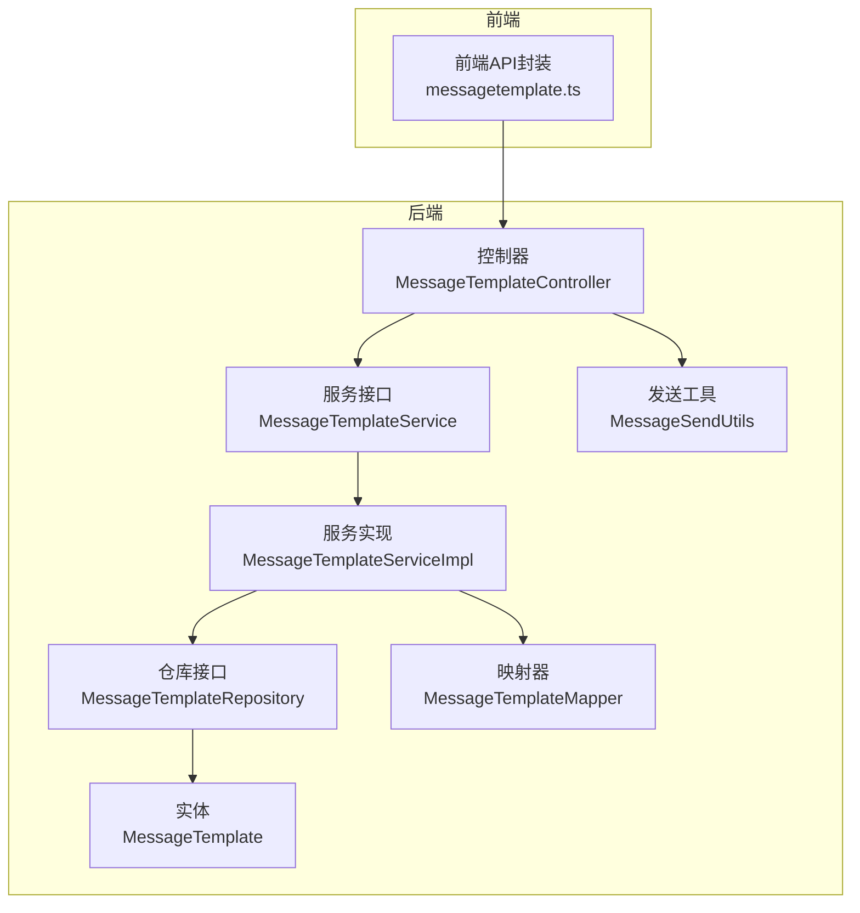
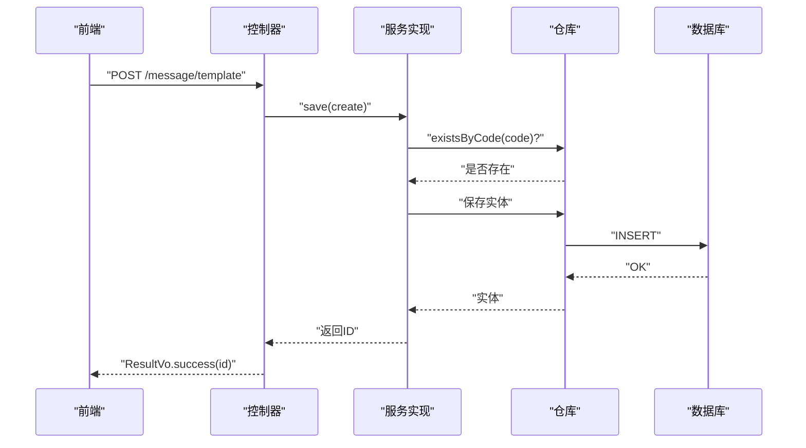
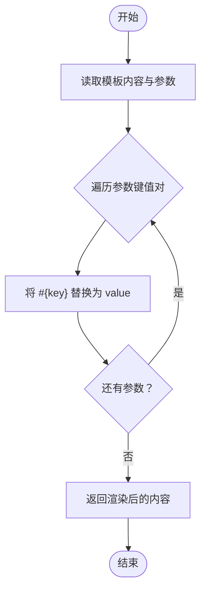
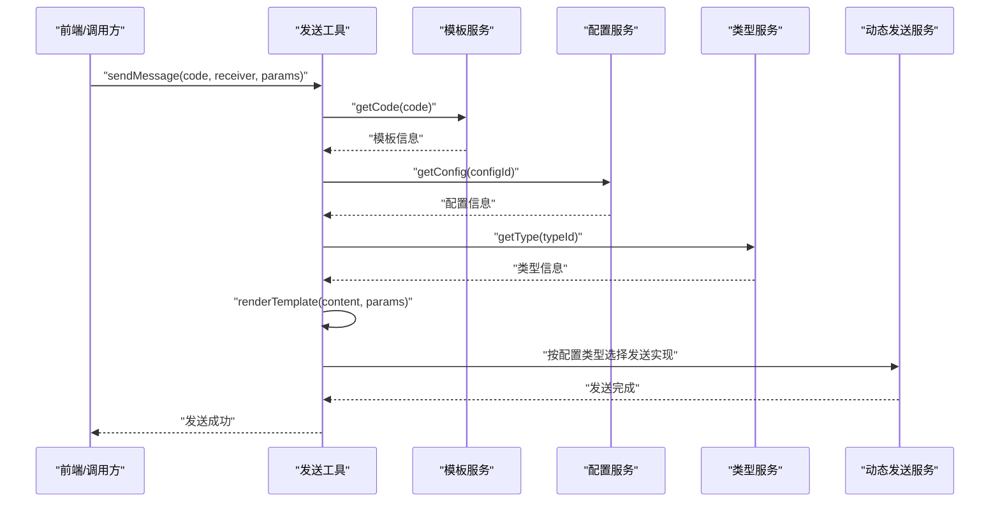
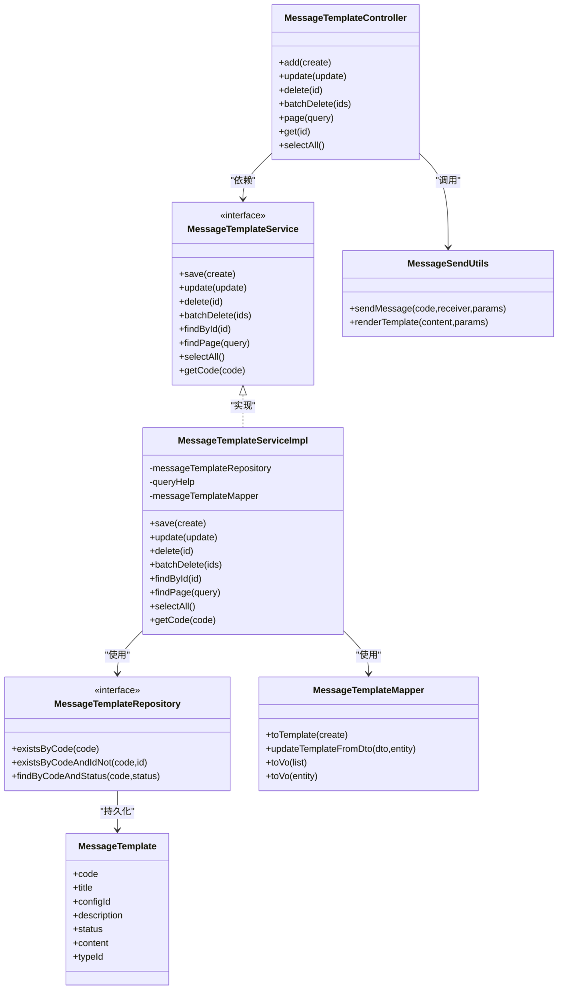
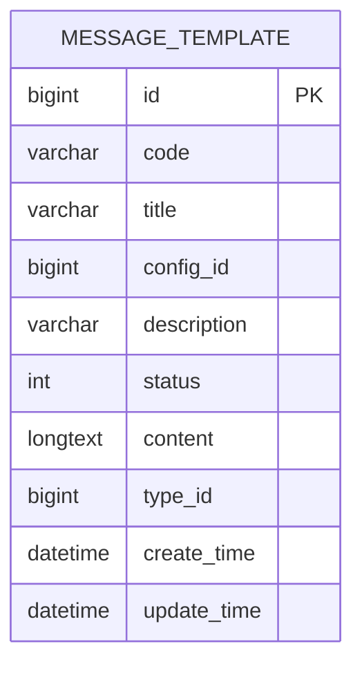

# 消息模板API

<cite>
**本文引用的文件**
- [MessageTemplateController.java](file://run-admin/src/main/java/com/astproject/module/message/controller/MessageTemplateController.java)
- [MessageTemplateService.java](file://message-module/src/main/java/com/astproject/message/service/MessageTemplateService.java)
- [MessageTemplateServiceImpl.java](file://message-module/src/main/java/com/astproject/message/service/impl/MessageTemplateServiceImpl.java)
- [MessageTemplateRepository.java](file://message-module/src/main/java/com/astproject/message/repository/db/MessageTemplateRepository.java)
- [MessageTemplateMapper.java](file://message-module/src/main/java/com/astproject/message/mapper/MessageTemplateMapper.java)
- [MessageTemplate.java](file://message-module/src/main/java/com/astproject/message/domain/MessageTemplate.java)
- [MessageTemplateCreate.java](file://message-module/src/main/java/com/astproject/message/vo/template/MessageTemplateCreate.java)
- [MessageTemplateUpdate.java](file://message-module/src/main/java/com/astproject/message/vo/template/MessageTemplateUpdate.java)
- [MessageTemplateQuery.java](file://message-module/src/main/java/com/astproject/message/vo/template/MessageTemplateQuery.java)
- [MessageTemplateVo.java](file://message-module/src/main/java/com/astproject/message/vo/template/MessageTemplateVo.java)
- [MessageSendUtils.java](file://message-module/src/main/java/com/astproject/message/send/MessageSendUtils.java)
- [messagetemplate.ts](file://fast-ui/apps/admin-vue/src/api/message/messagetemplate.ts)
</cite>

## 目录
1. [简介](#简介)
2. [项目结构](#项目结构)
3. [核心组件](#核心组件)
4. [架构总览](#架构总览)
5. [详细组件分析](#详细组件分析)
6. [依赖关系分析](#依赖关系分析)
7. [性能考虑](#性能考虑)
8. [故障排查指南](#故障排查指南)
9. [结论](#结论)
10. [附录](#附录)

## 简介
本文件为消息模板管理API的完整技术文档，覆盖REST接口设计、模板变量语法与占位符替换机制、模板渲染流程、模板分类管理、模板版本控制建议、模板预览能力、批量导入导出扩展点、模板内容验证与HTML安全过滤、性能优化策略、以及模板使用统计与发送成功率等监控指标建议。本文档同时提供前后端交互序列图、数据模型图与关键流程图，帮助开发者快速理解与集成。

## 项目结构
消息模板相关代码分布在以下模块与包中：
- 控制层：run-admin 模块中的消息模板控制器
- 业务层：message-module 模块中的服务接口与实现
- 数据访问层：message-module 中的JPA仓库与MapStruct映射器
- 领域模型：message-module 中的消息模板实体
- 前端API封装：fast-ui 中的消息模板API定义

图表来源
- [MessageTemplateController.java](file://run-admin/src/main/java/com/astproject/module/message/controller/MessageTemplateController.java#L1-L101)
- [MessageTemplateService.java](file://message-module/src/main/java/com/astproject/message/service/MessageTemplateService.java#L1-L56)
- [MessageTemplateServiceImpl.java](file://message-module/src/main/java/com/astproject/message/service/impl/MessageTemplateServiceImpl.java#L1-L138)
- [MessageTemplateRepository.java](file://message-module/src/main/java/com/astproject/message/repository/db/MessageTemplateRepository.java#L1-L16)
- [MessageTemplateMapper.java](file://message-module/src/main/java/com/astproject/message/mapper/MessageTemplateMapper.java#L1-L27)
- [MessageTemplate.java](file://message-module/src/main/java/com/astproject/message/domain/MessageTemplate.java#L1-L55)
- [MessageSendUtils.java](file://message-module/src/main/java/com/astproject/message/send/MessageSendUtils.java#L1-L86)

章节来源
- [MessageTemplateController.java](file://run-admin/src/main/java/com/astproject/module/message/controller/MessageTemplateController.java#L1-L101)
- [MessageTemplateService.java](file://message-module/src/main/java/com/astproject/message/service/MessageTemplateService.java#L1-L56)
- [MessageTemplateServiceImpl.java](file://message-module/src/main/java/com/astproject/message/service/impl/MessageTemplateServiceImpl.java#L1-L138)
- [MessageTemplateRepository.java](file://message-module/src/main/java/com/astproject/message/repository/db/MessageTemplateRepository.java#L1-L16)
- [MessageTemplateMapper.java](file://message-module/src/main/java/com/astproject/message/mapper/MessageTemplateMapper.java#L1-L27)
- [MessageTemplate.java](file://message-module/src/main/java/com/astproject/message/domain/MessageTemplate.java#L1-L55)
- [MessageSendUtils.java](file://message-module/src/main/java/com/astproject/message/send/MessageSendUtils.java#L1-L86)

## 核心组件
- 控制器：提供REST接口，负责鉴权、幂等性、日志与返回包装
- 服务接口与实现：封装业务规则（唯一性校验、分页查询、软删除、状态筛选）
- 仓库接口：基于Spring Data JPA，支持条件查询与软删除限制
- 映射器：使用MapStruct进行DTO与实体之间的转换
- 实体：持久化模型，包含模板字段与软删除策略
- 发送工具：模板渲染与发送流程的核心实现

章节来源
- [MessageTemplateController.java](file://run-admin/src/main/java/com/astproject/module/message/controller/MessageTemplateController.java#L1-L101)
- [MessageTemplateService.java](file://message-module/src/main/java/com/astproject/message/service/MessageTemplateService.java#L1-L56)
- [MessageTemplateServiceImpl.java](file://message-module/src/main/java/com/astproject/message/service/impl/MessageTemplateServiceImpl.java#L1-L138)
- [MessageTemplateRepository.java](file://message-module/src/main/java/com/astproject/message/repository/db/MessageTemplateRepository.java#L1-L16)
- [MessageTemplateMapper.java](file://message-module/src/main/java/com/astproject/message/mapper/MessageTemplateMapper.java#L1-L27)
- [MessageTemplate.java](file://message-module/src/main/java/com/astproject/message/domain/MessageTemplate.java#L1-L55)
- [MessageSendUtils.java](file://message-module/src/main/java/com/astproject/message/send/MessageSendUtils.java#L1-L86)

## 架构总览
消息模板API采用经典的三层架构：表现层（控制器）、领域层（服务）、基础设施层（仓库）。请求从控制器进入，经由服务层执行业务逻辑，再通过仓库访问数据库；模板渲染与发送在发送工具中完成。

图表来源
- [MessageTemplateController.java](file://run-admin/src/main/java/com/astproject/module/message/controller/MessageTemplateController.java#L34-L40)
- [MessageTemplateServiceImpl.java](file://message-module/src/main/java/com/astproject/message/service/impl/MessageTemplateServiceImpl.java#L39-L49)
- [MessageTemplateRepository.java](file://message-module/src/main/java/com/astproject/message/repository/db/MessageTemplateRepository.java#L11-L11)

## 详细组件分析

### REST API 定义
- 创建模板
  - 方法：POST
  - 路径：/message/template
  - 请求体：MessageTemplateCreate
  - 权限：需要权限标识 admin:message:template:add
  - 幂等：开启幂等性保护
  - 日志：业务日志，动作类型 CREATE
- 更新模板
  - 方法：PUT
  - 路径：/message/template
  - 请求体：MessageTemplateUpdate
  - 权限：admin:message:template:update
  - 幂等：开启幂等性保护
  - 日志：业务日志，动作类型 UPDATE
- 删除模板
  - 方法：DELETE
  - 路径：/message/template/{id}
  - 权限：admin:message:template:delete
  - 日志：业务日志，动作类型 DELETE
- 批量删除
  - 方法：DELETE
  - 路径：/message/template/batch
  - 请求体：数组<Long>
  - 权限：admin:message:template:delete
  - 日志：业务日志，动作类型 DELETE
- 分页查询
  - 方法：POST
  - 路径：/message/template/page
  - 请求体：MessageTemplateQuery
  - 权限：admin:message:template:page
- 获取详情
  - 方法：GET
  - 路径：/message/template/{id}
  - 权限：admin:message:template:page
- 查询所有可用模板
  - 方法：GET
  - 路径：/message/template/selectAll

章节来源
- [MessageTemplateController.java](file://run-admin/src/main/java/com/astproject/module/message/controller/MessageTemplateController.java#L34-L100)
- [messagetemplate.ts](file://fast-ui/apps/admin-vue/src/api/message/messagetemplate.ts#L53-L106)

### 模板变量语法与占位符替换机制
- 语法：#{变量名}
- 替换策略：遍历参数键值对，逐个替换模板中的占位符
- 渲染入口：MessageSendUtils.renderTemplate
- 使用场景：发送测试消息或实际消息时，将参数注入到模板内容中

图表来源
- [MessageSendUtils.java](file://message-module/src/main/java/com/astproject/message/send/MessageSendUtils.java#L78-L83)

章节来源
- [MessageSendUtils.java](file://message-module/src/main/java/com/astproject/message/send/MessageSendUtils.java#L78-L83)

### 模板渲染与发送流程
- 步骤：
  1) 根据模板码获取模板
  2) 根据模板配置ID获取配置信息
  3) 可选：根据模板类型ID获取类型信息
  4) 使用参数渲染模板内容
  5) 根据配置类型动态选择发送服务并执行发送
- 关键点：模板内容来自模板实体的content字段，渲染后作为消息正文发送

图表来源
- [MessageSendUtils.java](file://message-module/src/main/java/com/astproject/message/send/MessageSendUtils.java#L31-L60)

章节来源
- [MessageSendUtils.java](file://message-module/src/main/java/com/astproject/message/send/MessageSendUtils.java#L31-L60)

### 模板分类管理
- 类型字段：typeId（Long），用于区分不同类型的模板（如短信、邮件、站内信等）
- 建议：在系统中维护“消息类型”字典表，并通过类型ID关联模板

章节来源
- [MessageTemplate.java](file://message-module/src/main/java/com/astproject/message/domain/MessageTemplate.java#L50-L52)
- [MessageTemplateCreate.java](file://message-module/src/main/java/com/astproject/message/vo/template/MessageTemplateCreate.java#L42-L44)
- [MessageTemplateUpdate.java](file://message-module/src/main/java/com/astproject/message/vo/template/MessageTemplateUpdate.java#L46-L48)

### 模板版本控制（建议）
- 当前未见显式的版本字段或历史表设计
- 建议方案：
  - 新增version字段与历史表，保留变更记录
  - 提供版本号查询与回滚接口
  - 在渲染时按版本选择模板内容

章节来源
- [MessageTemplate.java](file://message-module/src/main/java/com/astproject/message/domain/MessageTemplate.java#L1-L55)

### 模板预览功能（建议）
- 前端可调用“查询所有可用模板”接口获取模板列表
- 测试页面支持输入参数JSON，调用发送测试消息接口进行预览
- 建议：后端提供独立的“预览渲染”接口，避免触发真实发送

章节来源
- [messagetemplate.ts](file://fast-ui/apps/admin-vue/src/api/message/messagetemplate.ts#L101-L106)
- [MessageSendUtils.java](file://message-module/src/main/java/com/astproject/message/send/MessageSendUtils.java#L78-L83)

### 批量导入导出（建议）
- 导入：提供Excel/CSV解析与批量创建接口，结合幂等性避免重复
- 导出：按筛选条件导出模板列表，支持模板内容与元数据
- 注意：导入需进行字段校验与模板内容安全过滤

章节来源
- [MessageTemplateController.java](file://run-admin/src/main/java/com/astproject/module/message/controller/MessageTemplateController.java#L68-L74)
- [MessageTemplateServiceImpl.java](file://message-module/src/main/java/com/astproject/message/service/impl/MessageTemplateServiceImpl.java#L77-L80)

### 模板内容验证与HTML安全过滤
- 内容校验：建议在保存/更新时对content进行基本格式校验（如占位符完整性、长度限制）
- HTML安全：建议引入HTML白名单过滤库，防止XSS与不受信任内容注入
- 建议：在MessageSendUtils中增加渲染前的安全过滤步骤

章节来源
- [MessageTemplateServiceImpl.java](file://message-module/src/main/java/com/astproject/message/service/impl/MessageTemplateServiceImpl.java#L39-L49)
- [MessageTemplateServiceImpl.java](file://message-module/src/main/java/com/astproject/message/service/impl/MessageTemplateServiceImpl.java#L52-L64)
- [MessageSendUtils.java](file://message-module/src/main/java/com/astproject/message/send/MessageSendUtils.java#L78-L83)

### 性能优化建议
- 分页查询：已按创建时间倒序分页，建议在常用查询字段上建立索引
- 软删除：使用逻辑删除减少物理删除成本，但需确保查询限制生效
- 缓存：对常用模板码与配置进行缓存，降低频繁查询开销
- 渲染优化：大模板内容可考虑延迟加载或CDN存储

章节来源
- [MessageTemplateServiceImpl.java](file://message-module/src/main/java/com/astproject/message/service/impl/MessageTemplateServiceImpl.java#L91-L116)
- [MessageTemplateRepository.java](file://message-module/src/main/java/com/astproject/message/repository/db/MessageTemplateRepository.java#L15-L16)

### 监控指标（建议）
- 模板使用统计：按模板码统计调用次数、成功/失败次数
- 发送成功率：计算各渠道发送成功率，识别异常
- 渲染耗时：记录模板渲染耗时，定位慢模板
- 错误率与告警：对模板缺失、配置缺失、渲染异常进行告警

章节来源
- [MessageSendUtils.java](file://message-module/src/main/java/com/astproject/message/send/MessageSendUtils.java#L31-L60)

## 依赖关系分析

图表来源
- [MessageTemplateController.java](file://run-admin/src/main/java/com/astproject/module/message/controller/MessageTemplateController.java#L1-L101)
- [MessageTemplateService.java](file://message-module/src/main/java/com/astproject/message/service/MessageTemplateService.java#L1-L56)
- [MessageTemplateServiceImpl.java](file://message-module/src/main/java/com/astproject/message/service/impl/MessageTemplateServiceImpl.java#L1-L138)
- [MessageTemplateRepository.java](file://message-module/src/main/java/com/astproject/message/repository/db/MessageTemplateRepository.java#L1-L16)
- [MessageTemplateMapper.java](file://message-module/src/main/java/com/astproject/message/mapper/MessageTemplateMapper.java#L1-L27)
- [MessageTemplate.java](file://message-module/src/main/java/com/astproject/message/domain/MessageTemplate.java#L1-L55)
- [MessageSendUtils.java](file://message-module/src/main/java/com/astproject/message/send/MessageSendUtils.java#L1-L86)

## 性能考虑
- 数据库层面：为code、typeId、status等常用查询字段建立索引；软删除使用SQL Restriction避免全表扫描
- 应用层面：分页查询默认按创建时间倒序，建议在高并发场景下增加缓存与只读副本
- 渲染层面：对大模板内容进行压缩或CDN加速；避免在渲染过程中进行外部网络请求

章节来源
- [MessageTemplateRepository.java](file://message-module/src/main/java/com/astproject/message/repository/db/MessageTemplateRepository.java#L11-L16)
- [MessageTemplateServiceImpl.java](file://message-module/src/main/java/com/astproject/message/service/impl/MessageTemplateServiceImpl.java#L91-L116)

## 故障排查指南
- 模板不存在：更新/删除时若ID不存在会抛出业务异常
- 模板代码冲突：保存/更新时若code已存在会抛出业务异常
- 查询无结果：分页查询或按code查询可能返回空
- 发送失败：模板或配置缺失会导致发送异常

章节来源
- [MessageTemplateServiceImpl.java](file://message-module/src/main/java/com/astproject/message/service/impl/MessageTemplateServiceImpl.java#L42-L44)
- [MessageTemplateServiceImpl.java](file://message-module/src/main/java/com/astproject/message/service/impl/MessageTemplateServiceImpl.java#L58-L60)
- [MessageTemplateServiceImpl.java](file://message-module/src/main/java/com/astproject/message/service/impl/MessageTemplateServiceImpl.java#L67-L72)
- [MessageSendUtils.java](file://message-module/src/main/java/com/astproject/message/send/MessageSendUtils.java#L37-L44)

## 结论
消息模板API提供了完整的模板生命周期管理能力，具备良好的扩展性与安全性基础。建议后续完善版本控制、预览渲染、批量导入导出、HTML安全过滤与监控指标体系，以满足生产环境的高可用与可观测性需求。

## 附录

### 数据模型图

图表来源
- [MessageTemplate.java](file://message-module/src/main/java/com/astproject/message/domain/MessageTemplate.java#L1-L55)