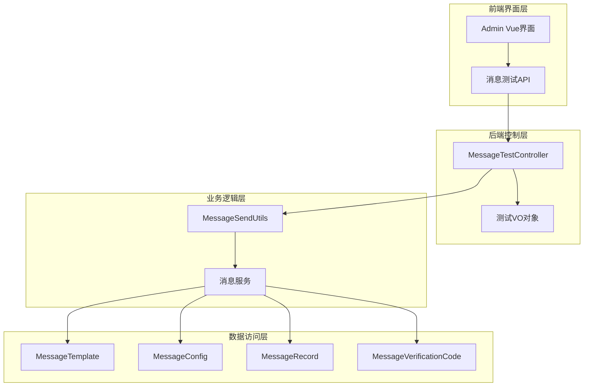
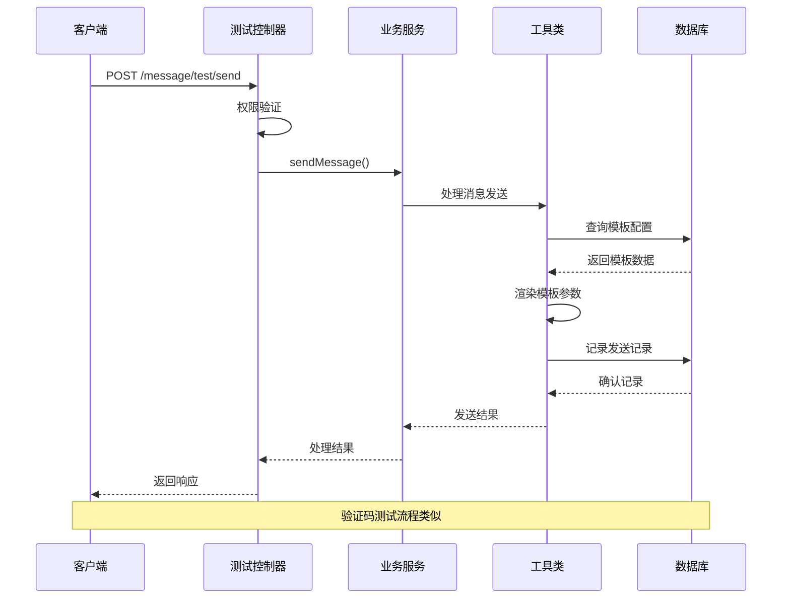
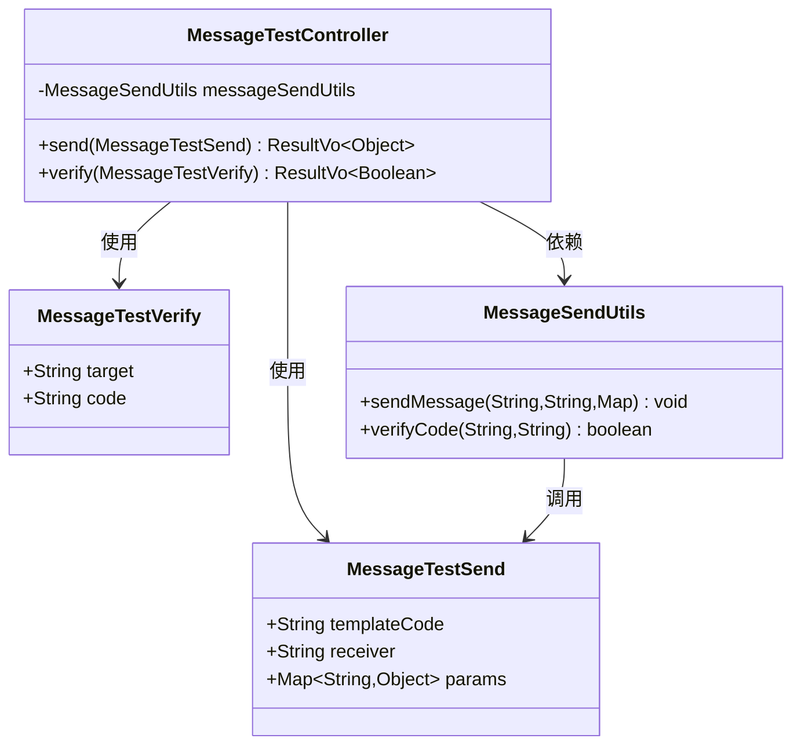
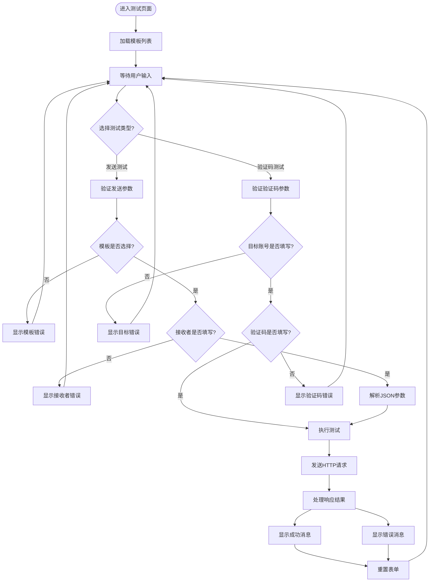
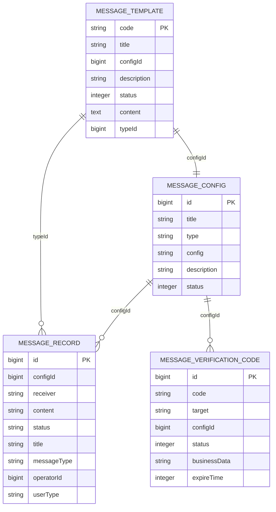
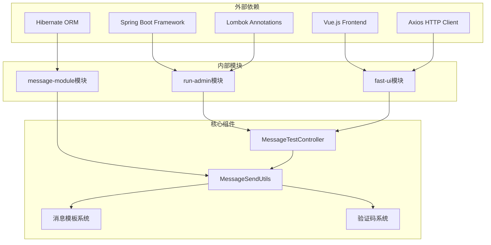

# 消息测试API

<cite>
**本文档引用的文件**
- [MessageTestController.java](file://run-admin/src/main/java/com/astproject/module/message/controller/MessageTestController.java)
- [MessageTestSend.java](file://message-module/src/main/java/com/astproject/message/vo/test/MessageTestSend.java)
- [MessageTestVerify.java](file://message-module/src/main/java/com/astproject/message/vo/test/MessageTestVerify.java)
- [MessageSendUtils.java](file://message-module/src/main/java/com/astproject/message/send/MessageSendUtils.java)
- [MessageTemplate.java](file://message-module/src/main/java/com/astproject/message/domain/MessageTemplate.java)
- [MessageConfig.java](file://message-module/src/main/java/com/astproject/message/domain/MessageConfig.java)
- [MessageRecord.java](file://message-module/src/main/java/com/astproject/message/domain/MessageRecord.java)
- [messagetest.ts](file://fast-ui/apps/admin-vue/src/api/message/messagetest.ts)
- [index.vue](file://fast-ui/apps/admin-vue/src/views/message/test/index.vue)
- [MessageVerificationCode.java](file://message-module/src/main/java/com/astproject/message/domain/MessageVerificationCode.java)
- [messagerecificationcode.ts](file://fast-ui/apps/admin-vue/src/api/message/messagerecificationcode.ts)
</cite>

## 目录
1. [简介](#简介)
2. [项目结构](#项目结构)
3. [核心组件](#核心组件)
4. [架构概览](#架构概览)
5. [详细组件分析](#详细组件分析)
6. [依赖关系分析](#依赖关系分析)
7. [性能考虑](#性能考虑)
8. [故障排除指南](#故障排除指南)
9. [结论](#结论)

## 简介
消息测试API是FastProject消息系统中的重要测试工具，为开发者和运维人员提供了完整的消息发送测试能力。该API支持多种测试场景，包括模板消息发送测试、验证码验证测试、配置验证、模板预览以及完整的发送链路测试。

该测试API具有以下核心特性：
- **多场景测试支持**：涵盖消息发送、验证码校验、配置验证等全方位测试
- **实时消息推送**：基于模板系统进行实时消息推送测试
- **权限控制**：严格的权限验证机制确保测试操作的安全性
- **日志记录**：完整的业务日志记录便于问题追踪和审计
- **测试环境隔离**：独立的测试接口避免对生产环境的影响

## 项目结构
消息测试功能在项目中采用分层架构设计，主要分布在以下几个模块：

**图表来源**
- [MessageTestController.java](file://run-admin/src/main/java/com/astproject/module/message/controller/MessageTestController.java#L1-L48)
- [MessageSendUtils.java](file://message-module/src/main/java/com/astproject/message/send/MessageSendUtils.java)
- [MessageTemplate.java](file://message-module/src/main/java/com/astproject/message/domain/MessageTemplate.java#L1-L55)

**章节来源**
- [MessageTestController.java](file://run-admin/src/main/java/com/astproject/module/message/controller/MessageTestController.java#L1-L48)
- [MessageTestSend.java](file://message-module/src/main/java/com/astproject/message/vo/test/MessageTestSend.java#L1-L24)
- [MessageTestVerify.java](file://message-module/src/main/java/com/astproject/message/vo/test/MessageTestVerify.java#L1-L19)

## 核心组件
消息测试API由多个核心组件构成，每个组件都有明确的职责分工：

### 控制器层
- **MessageTestController**：RESTful API控制器，处理所有测试相关的HTTP请求
- **权限注解**：使用@PreAuthorize确保只有具备相应权限的用户才能执行测试操作

### 数据传输对象
- **MessageTestSend**：测试发送请求的数据传输对象
- **MessageTestVerify**：验证码验证请求的数据传输对象

### 业务服务层
- **MessageSendUtils**：消息发送工具类，封装了消息发送的核心逻辑
- **模板管理系统**：负责消息模板的加载、解析和渲染

### 数据模型层
- **MessageTemplate**：消息模板实体，存储模板代码、标题、内容等信息
- **MessageConfig**：消息配置实体，管理消息发送的配置信息
- **MessageRecord**：消息发送记录实体，跟踪消息发送状态
- **MessageVerificationCode**：验证码实体，管理验证码的生成和验证

**章节来源**
- [MessageTestController.java](file://run-admin/src/main/java/com/astproject/module/message/controller/MessageTestController.java#L17-L48)
- [MessageTestSend.java](file://message-module/src/main/java/com/astproject/message/vo/test/MessageTestSend.java#L6-L23)
- [MessageTestVerify.java](file://message-module/src/main/java/com/astproject/message/vo/test/MessageTestVerify.java#L5-L18)

## 架构概览
消息测试API采用典型的三层架构设计，实现了清晰的关注点分离：

**图表来源**
- [MessageTestController.java](file://run-admin/src/main/java/com/astproject/module/message/controller/MessageTestController.java#L27-L47)
- [MessageSendUtils.java](file://message-module/src/main/java/com/astproject/message/send/MessageSendUtils.java)

### 技术栈特点
- **Spring Boot**：基于Spring Boot框架，提供自动配置和依赖注入
- **Lombok**：简化Java代码，减少样板代码
- **Hibernate**：ORM框架，提供数据库操作抽象
- **Vue.js**：前端框架，提供响应式用户界面
- **Axios**：HTTP客户端，处理前后端通信

## 详细组件分析

### 测试控制器分析
测试控制器是整个消息测试API的核心入口点，负责处理所有测试相关的HTTP请求。

**图表来源**
- [MessageTestController.java](file://run-admin/src/main/java/com/astproject/module/message/controller/MessageTestController.java#L1-L48)
- [MessageTestSend.java](file://message-module/src/main/java/com/astproject/message/vo/test/MessageTestSend.java#L1-L24)
- [MessageTestVerify.java](file://message-module/src/main/java/com/astproject/message/vo/test/MessageTestVerify.java#L1-L19)

#### 权限控制机制
控制器使用Spring Security的@PreAuthorize注解实现细粒度的权限控制：
- `admin:message:test:send` - 消息发送测试权限
- `admin:message:test:verify` - 验证码验证测试权限

#### 日志记录
所有测试操作都通过@Log注解记录业务日志，便于审计和问题追踪。

**章节来源**
- [MessageTestController.java](file://run-admin/src/main/java/com/astproject/module/message/controller/MessageTestController.java#L27-L47)

### 前端界面组件分析
前端界面提供了直观的用户交互体验，支持多种测试场景的操作。

**图表来源**
- [index.vue](file://fast-ui/apps/admin-vue/src/views/message/test/index.vue#L183-L235)

#### 前端API集成
前端通过Axios客户端与后端API进行通信，支持以下功能：
- 实时模板加载和过滤
- JSON参数格式验证
- 异步请求处理
- 错误状态管理和用户反馈

**章节来源**
- [index.vue](file://fast-ui/apps/admin-vue/src/views/message/test/index.vue#L1-L279)
- [messagetest.ts](file://fast-ui/apps/admin-vue/src/api/message/messagetest.ts#L1-L34)

### 数据模型分析
消息测试涉及多个核心数据模型，每个模型都有特定的用途和约束。

**图表来源**
- [MessageTemplate.java](file://message-module/src/main/java/com/astproject/message/domain/MessageTemplate.java#L17-L54)
- [MessageConfig.java](file://message-module/src/main/java/com/astproject/message/domain/MessageConfig.java#L17-L44)
- [MessageRecord.java](file://message-module/src/main/java/com/astproject/message/domain/MessageRecord.java#L17-L58)
- [MessageVerificationCode.java](file://message-module/src/main/java/com/astproject/message/domain/MessageVerificationCode.java)

#### 数据模型特点
- **软删除支持**：所有实体都支持软删除，通过deleted字段标识
- **状态管理**：统一的状态字段用于管理实体的生命周期
- **关联关系**：清晰的外键关系确保数据完整性
- **索引优化**：关键字段建立适当的索引提高查询性能

**章节来源**
- [MessageTemplate.java](file://message-module/src/main/java/com/astproject/message/domain/MessageTemplate.java#L1-L55)
- [MessageConfig.java](file://message-module/src/main/java/com/astproject/message/domain/MessageConfig.java#L1-L45)
- [MessageRecord.java](file://message-module/src/main/java/com/astproject/message/domain/MessageRecord.java#L1-L59)

## 依赖关系分析
消息测试API的依赖关系体现了清晰的分层架构和模块化设计。

**图表来源**
- [MessageTestController.java](file://run-admin/src/main/java/com/astproject/module/message/controller/MessageTestController.java#L1-L15)
- [MessageSendUtils.java](file://message-module/src/main/java/com/astproject/message/send/MessageSendUtils.java)

### 关键依赖关系
- **运行时依赖**：run-admin模块依赖Spring Boot提供运行时环境
- **业务依赖**：消息测试功能依赖message-module提供的业务能力
- **前端依赖**：fast-ui模块提供用户界面和API集成
- **开发依赖**：Lombok简化代码开发，Hibernate提供数据持久化

**章节来源**
- [MessageTestController.java](file://run-admin/src/main/java/com/astproject/module/message/controller/MessageTestController.java#L1-L15)
- [MessageSendUtils.java](file://message-module/src/main/java/com/astproject/message/send/MessageSendUtils.java)

## 性能考虑
消息测试API在设计时充分考虑了性能优化和可扩展性：

### 缓存策略
- **模板缓存**：消息模板在内存中缓存，避免重复查询数据库
- **配置缓存**：常用配置信息缓存，减少数据库访问频率
- **验证码缓存**：验证码验证结果缓存，提高验证效率

### 异步处理
- **异步发送**：消息发送采用异步方式，避免阻塞主线程
- **批量操作**：支持批量测试操作，提高测试效率
- **并发控制**：合理的并发控制机制，防止系统过载

### 数据库优化
- **索引优化**：关键查询字段建立适当索引
- **连接池**：数据库连接池配置优化
- **查询优化**：避免N+1查询问题

## 故障排除指南
针对消息测试API可能遇到的问题提供详细的故障排除指导：

### 常见问题及解决方案

#### 权限相关问题
**问题**：执行测试时报权限不足
**解决方案**：
1. 检查用户是否具备`admin:message:test:*`权限
2. 确认权限配置是否正确
3. 重新登录系统获取最新权限

#### 模板相关问题
**问题**：模板加载失败或找不到模板
**解决方案**：
1. 检查模板代码是否正确
2. 确认模板状态为启用状态
3. 验证模板配置是否正确

#### 验证码相关问题
**问题**：验证码验证失败
**解决方案**：
1. 检查验证码是否在有效期内
2. 确认验证码大小写是否正确
3. 验证目标账号格式是否正确

#### 网络连接问题
**问题**：API请求超时或连接失败
**解决方案**：
1. 检查网络连接状态
2. 确认后端服务正常运行
3. 查看服务器日志获取详细错误信息

**章节来源**
- [MessageTestController.java](file://run-admin/src/main/java/com/astproject/module/message/controller/MessageTestController.java#L31-L46)

## 结论
消息测试API为FastProject消息系统提供了全面、安全、高效的测试能力。通过清晰的架构设计、完善的权限控制、友好的用户界面，该API能够满足各种测试场景的需求。

### 主要优势
- **功能完整**：支持消息发送、验证码验证、配置验证等全方位测试
- **安全可靠**：严格的权限控制和日志记录机制
- **易于使用**：直观的用户界面和清晰的API设计
- **性能优异**：优化的缓存策略和异步处理机制
- **扩展性强**：模块化设计便于功能扩展和维护

### 应用价值
该测试API不仅提高了开发和测试效率，还增强了系统的稳定性和可靠性。通过提供完整的测试工具，开发者可以快速验证消息功能的正确性，及时发现和解决问题，从而提升整体软件质量。