# 消息类型API

<cite>
**本文引用的文件**
- [message-api/src/main/java/com/fastproject/message/enums/MessageTypeEnum.java](file://message-api/src/main/java/com/fastproject/message/enums/MessageTypeEnum.java)
- [message-api/src/main/java/com/fastproject/message/enums/MessageRecordStatusEnum.java](file://message-api/src/main/java/com/fastproject/message/enums/MessageRecordStatusEnum.java)
- [message-api/src/main/java/com/fastproject/message/enums/MessageVerificationCodeStatusEnum.java](file://message-api/src/main/java/com/fastproject/message/enums/MessageVerificationCodeStatusEnum.java)
- [message-module/src/main/java/com/fastproject/message/domain/MessageType.java](file://message-module/src/main/java/com/fastproject/message/domain/MessageType.java)
- [message-module/src/main/java/com/fastproject/message/domain/MessageTemplate.java](file://message-module/src/main/java/com/fastproject/message/domain/MessageTemplate.java)
- [message-module/src/main/java/com/fastproject/message/domain/MessageConfig.java](file://message-module/src/main/java/com/fastproject/message/domain/MessageConfig.java)
- [message-module/src/main/java/com/fastproject/message/domain/MessageRecord.java](file://message-module/src/main/java/com/fastproject/message/domain/MessageRecord.java)
- [message-module/src/main/java/com/fastproject/message/domain/MessageVerificationCode.java](file://message-module/src/main/java/com/fastproject/message/domain/MessageVerificationCode.java)
</cite>

## 目录
1. [简介](#简介)
2. [项目结构](#项目结构)
3. [核心组件](#核心组件)
4. [架构总览](#架构总览)
5. [详细组件分析](#详细组件分析)
6. [依赖关系分析](#依赖关系分析)
7. [性能考虑](#性能考虑)
8. [故障排查指南](#故障排查指南)
9. [结论](#结论)
10. [附录](#附录)

## 简介
本文件面向“消息类型管理API”的完整技术文档，覆盖消息类型的定义、分类、查询等RESTful接口设计与实现要点；详细说明不同消息类型的特点、适用场景、配置差异等业务逻辑；包含消息类型枚举定义、类型层级结构、类型权限控制等技术实现；提供消息类型扩展机制、自定义类型添加、类型状态管理等功能说明；记录消息类型的生命周期管理、版本兼容性处理、迁移策略等维护要点。

## 项目结构
消息类型相关能力由两个模块协同实现：
- message-api：提供消息相关的枚举定义（消息类型、记录状态、验证码状态），作为跨模块共享的契约。
- message-module：提供消息类型、模板、配置、记录、验证码等实体模型及持久化映射，支撑消息类型管理的业务实现。

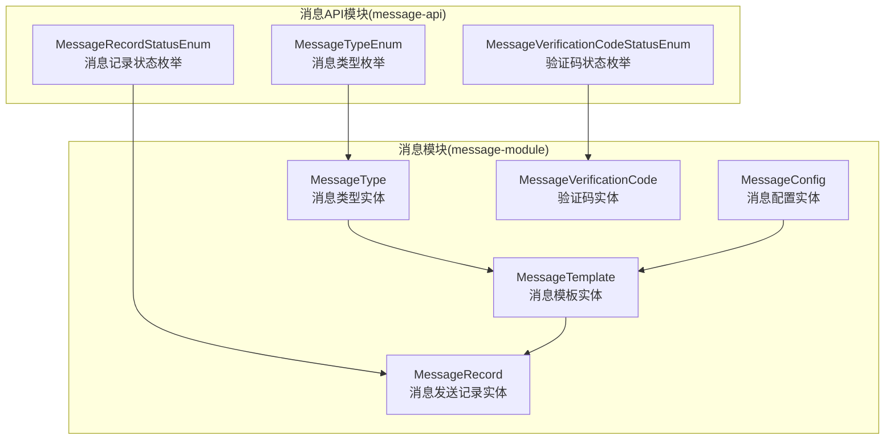

图表来源
- [message-api/src/main/java/com/fastproject/message/enums/MessageTypeEnum.java](file://message-api/src/main/java/com/fastproject/message/enums/MessageTypeEnum.java#L1-L26)
- [message-api/src/main/java/com/fastproject/message/enums/MessageRecordStatusEnum.java](file://message-api/src/main/java/com/fastproject/message/enums/MessageRecordStatusEnum.java#L1-L27)
- [message-api/src/main/java/com/fastproject/message/enums/MessageVerificationCodeStatusEnum.java](file://message-api/src/main/java/com/fastproject/message/enums/MessageVerificationCodeStatusEnum.java#L1-L31)
- [message-module/src/main/java/com/fastproject/message/domain/MessageType.java](file://message-module/src/main/java/com/fastproject/message/domain/MessageType.java#L1-L39)
- [message-module/src/main/java/com/fastproject/message/domain/MessageTemplate.java](file://message-module/src/main/java/com/fastproject/message/domain/MessageTemplate.java#L1-L55)
- [message-module/src/main/java/com/fastproject/message/domain/MessageConfig.java](file://message-module/src/main/java/com/fastproject/message/domain/MessageConfig.java#L1-L45)
- [message-module/src/main/java/com/fastproject/message/domain/MessageRecord.java](file://message-module/src/main/java/com/fastproject/message/domain/MessageRecord.java#L1-L59)
- [message-module/src/main/java/com/fastproject/message/domain/MessageVerificationCode.java](file://message-module/src/main/java/com/fastproject/message/domain/MessageVerificationCode.java#L1-L49)

章节来源
- [message-api/src/main/java/com/fastproject/message/enums/MessageTypeEnum.java](file://message-api/src/main/java/com/fastproject/message/enums/MessageTypeEnum.java#L1-L26)
- [message-api/src/main/java/com/fastproject/message/enums/MessageRecordStatusEnum.java](file://message-api/src/main/java/com/fastproject/message/enums/MessageRecordStatusEnum.java#L1-L27)
- [message-api/src/main/java/com/fastproject/message/enums/MessageVerificationCodeStatusEnum.java](file://message-api/src/main/java/com/fastproject/message/enums/MessageVerificationCodeStatusEnum.java#L1-L31)
- [message-module/src/main/java/com/fastproject/message/domain/MessageType.java](file://message-module/src/main/java/com/fastproject/message/domain/MessageType.java#L1-L39)
- [message-module/src/main/java/com/fastproject/message/domain/MessageTemplate.java](file://message-module/src/main/java/com/fastproject/message/domain/MessageTemplate.java#L1-L55)
- [message-module/src/main/java/com/fastproject/message/domain/MessageConfig.java](file://message-module/src/main/java/com/fastproject/message/domain/MessageConfig.java#L1-L45)
- [message-module/src/main/java/com/fastproject/message/domain/MessageRecord.java](file://message-module/src/main/java/com/fastproject/message/domain/MessageRecord.java#L1-L59)
- [message-module/src/main/java/com/fastproject/message/domain/MessageVerificationCode.java](file://message-module/src/main/java/com/fastproject/message/domain/MessageVerificationCode.java#L1-L49)

## 核心组件
- 消息类型枚举（MessageTypeEnum）：定义系统支持的消息类型，如验证码、通知等，用于标识消息类别。
- 消息记录状态枚举（MessageRecordStatusEnum）：定义消息发送记录的状态，如已发送、发送失败。
- 验证码状态枚举（MessageVerificationCodeStatusEnum）：定义验证码的有效性状态，如有效、已使用、已过期。
- 消息类型实体（MessageType）：持久化存储消息类型元数据，包含标题、描述、状态、代码等字段。
- 消息模板实体（MessageTemplate）：定义模板代码、标题、所属配置ID、描述、状态、内容、类型ID等。
- 消息配置实体（MessageConfig）：定义配置标题、类型（字典）、配置信息、描述、状态等。
- 消息记录实体（MessageRecord）：记录一次消息发送的详情，包含配置ID、接收人、内容、状态、标题、消息类型、操作用户、用户类型等。
- 验证码实体（MessageVerificationCode）：记录验证码的生成、校验与过期控制，包含验证码值、发送目标、配置ID、状态、业务数据、过期时间等。

章节来源
- [message-api/src/main/java/com/fastproject/message/enums/MessageTypeEnum.java](file://message-api/src/main/java/com/fastproject/message/enums/MessageTypeEnum.java#L1-L26)
- [message-api/src/main/java/com/fastproject/message/enums/MessageRecordStatusEnum.java](file://message-api/src/main/java/com/fastproject/message/enums/MessageRecordStatusEnum.java#L1-L27)
- [message-api/src/main/java/com/fastproject/message/enums/MessageVerificationCodeStatusEnum.java](file://message-api/src/main/java/com/fastproject/message/enums/MessageVerificationCodeStatusEnum.java#L1-L31)
- [message-module/src/main/java/com/fastproject/message/domain/MessageType.java](file://message-module/src/main/java/com/fastproject/message/domain/MessageType.java#L1-L39)
- [message-module/src/main/java/com/fastproject/message/domain/MessageTemplate.java](file://message-module/src/main/java/com/fastproject/message/domain/MessageTemplate.java#L1-L55)
- [message-module/src/main/java/com/fastproject/message/domain/MessageConfig.java](file://message-module/src/main/java/com/fastproject/message/domain/MessageConfig.java#L1-L45)
- [message-module/src/main/java/com/fastproject/message/domain/MessageRecord.java](file://message-module/src/main/java/com/fastproject/message/domain/MessageRecord.java#L1-L59)
- [message-module/src/main/java/com/fastproject/message/domain/MessageVerificationCode.java](file://message-module/src/main/java/com/fastproject/message/domain/MessageVerificationCode.java#L1-L49)

## 架构总览
消息类型管理API采用分层架构：
- 表现层：通过RESTful接口暴露消息类型、模板、配置、记录、验证码的增删改查与状态变更。
- 领域层：以MessageType、MessageTemplate、MessageConfig、MessageRecord、MessageVerificationCode为核心实体，承载业务规则。
- 枚举层：通过MessageTypeEnum、MessageRecordStatusEnum、MessageVerificationCodeStatusEnum统一状态与类型语义。
- 持久化层：基于JPA注解与软删除策略，确保数据安全与可审计。

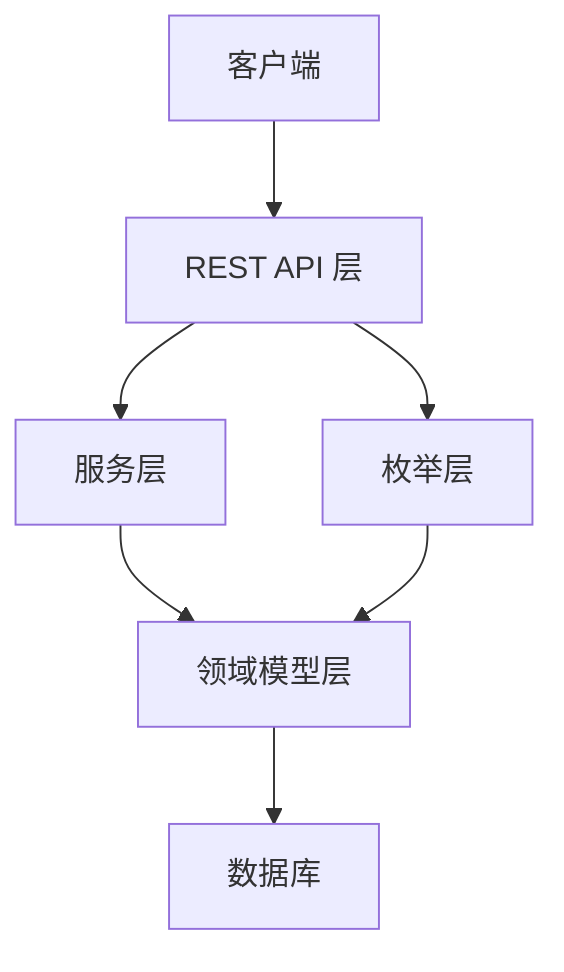

## 详细组件分析

### 消息类型枚举（MessageTypeEnum）
- 定义了系统支持的消息类型，如验证码、通知等。
- 提供code与description，便于前端展示与后端匹配。
- 作为消息记录与模板关联的类型标识依据。

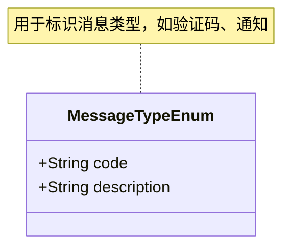

图表来源
- [message-api/src/main/java/com/fastproject/message/enums/MessageTypeEnum.java](file://message-api/src/main/java/com/fastproject/message/enums/MessageTypeEnum.java#L1-L26)

章节来源
- [message-api/src/main/java/com/fastproject/message/enums/MessageTypeEnum.java](file://message-api/src/main/java/com/fastproject/message/enums/MessageTypeEnum.java#L1-L26)

### 消息记录状态枚举（MessageRecordStatusEnum）
- 定义消息发送记录的两类状态：已发送、发送失败。
- 用于消息发送结果的统一标记与后续重试或告警策略。

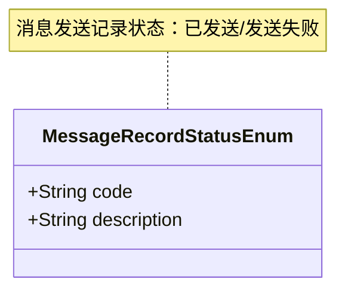

图表来源
- [message-api/src/main/java/com/fastproject/message/enums/MessageRecordStatusEnum.java](file://message-api/src/main/java/com/fastproject/message/enums/MessageRecordStatusEnum.java#L1-L27)

章节来源
- [message-api/src/main/java/com/fastproject/message/enums/MessageRecordStatusEnum.java](file://message-api/src/main/java/com/fastproject/message/enums/MessageRecordStatusEnum.java#L1-L27)

### 验证码状态枚举（MessageVerificationCodeStatusEnum）
- 定义验证码的有效性状态：有效、已使用、已过期。
- 支持验证码的幂等校验与生命周期管理。

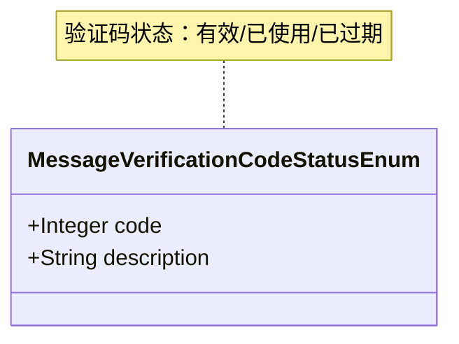

图表来源
- [message-api/src/main/java/com/fastproject/message/enums/MessageVerificationCodeStatusEnum.java](file://message-api/src/main/java/com/fastproject/message/enums/MessageVerificationCodeStatusEnum.java#L1-L31)

章节来源
- [message-api/src/main/java/com/fastproject/message/enums/MessageVerificationCodeStatusEnum.java](file://message-api/src/main/java/com/fastproject/message/enums/MessageVerificationCodeStatusEnum.java#L1-L31)

### 消息类型实体（MessageType）
- 字段：标题、描述、状态、代码。
- 软删除与逻辑过滤：通过SQL删除与限制注解实现逻辑删除与默认过滤。
- 用途：作为消息模板与记录的类型根节点，支持扩展新的消息类型。

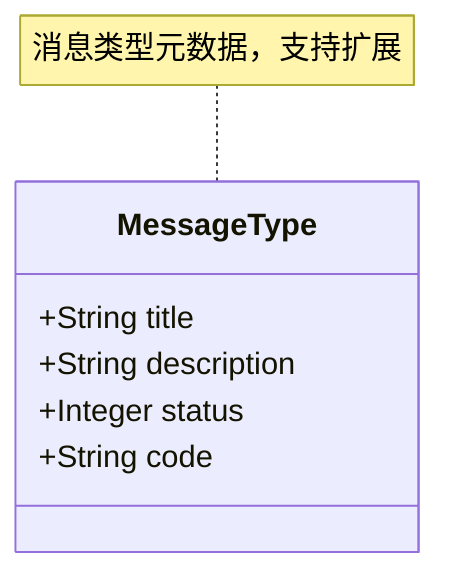

图表来源
- [message-module/src/main/java/com/fastproject/message/domain/MessageType.java](file://message-module/src/main/java/com/fastproject/message/domain/MessageType.java#L1-L39)

章节来源
- [message-module/src/main/java/com/fastproject/message/domain/MessageType.java](file://message-module/src/main/java/com/fastproject/message/domain/MessageType.java#L1-L39)

### 消息模板实体（MessageTemplate）
- 字段：模板代码、标题、所属配置ID、描述、状态、内容、类型ID。
- 关系：与消息配置（配置ID）与消息类型（类型ID）关联，形成“配置-模板-类型”的层级结构。
- 用途：承载具体的消息内容模板，支持按类型与配置进行渲染与发送。

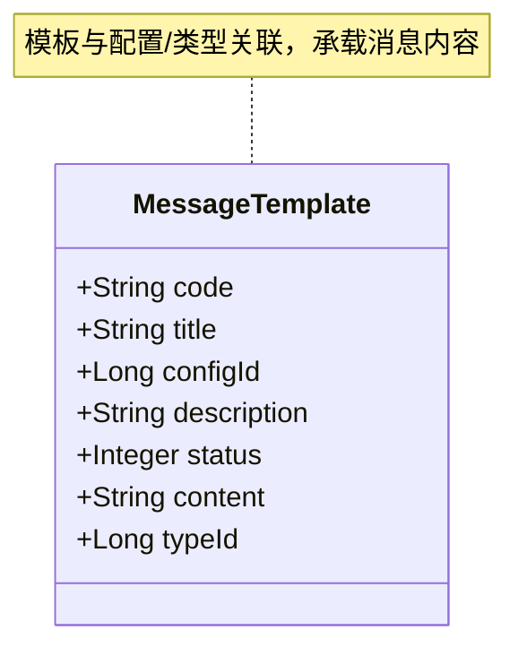

图表来源
- [message-module/src/main/java/com/fastproject/message/domain/MessageTemplate.java](file://message-module/src/main/java/com/fastproject/message/domain/MessageTemplate.java#L1-L55)

章节来源
- [message-module/src/main/java/com/fastproject/message/domain/MessageTemplate.java](file://message-module/src/main/java/com/fastproject/message/domain/MessageTemplate.java#L1-L55)

### 消息配置实体（MessageConfig）
- 字段：标题、类型（字典）、配置信息、描述、状态。
- 用途：承载发送渠道、参数、阈值等配置，为模板渲染与发送提供上下文。

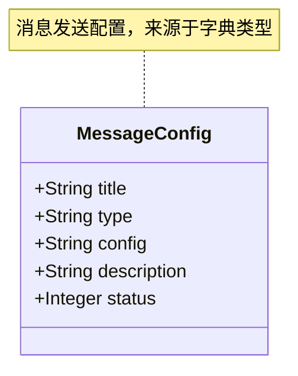

图表来源
- [message-module/src/main/java/com/fastproject/message/domain/MessageConfig.java](file://message-module/src/main/java/com/fastproject/message/domain/MessageConfig.java#L1-L45)

章节来源
- [message-module/src/main/java/com/fastproject/message/domain/MessageConfig.java](file://message-module/src/main/java/com/fastproject/message/domain/MessageConfig.java#L1-L45)

### 消息记录实体（MessageRecord）
- 字段：配置ID、接收人、内容、状态、标题、消息类型、操作用户、用户类型。
- 用途：记录一次消息发送的全链路信息，便于审计与追踪。

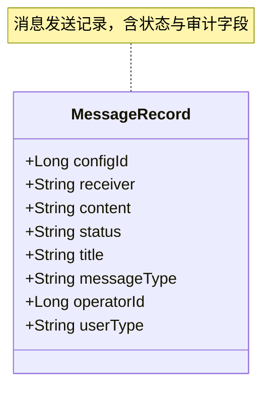

图表来源
- [message-module/src/main/java/com/fastproject/message/domain/MessageRecord.java](file://message-module/src/main/java/com/fastproject/message/domain/MessageRecord.java#L1-L59)

章节来源
- [message-module/src/main/java/com/fastproject/message/domain/MessageRecord.java](file://message-module/src/main/java/com/fastproject/message/domain/MessageRecord.java#L1-L59)

### 验证码实体（MessageVerificationCode）
- 字段：验证码、发送目标、配置ID、状态、业务数据、过期时间。
- 用途：支持验证码生成、校验与过期控制，配合验证码状态枚举实现生命周期管理。

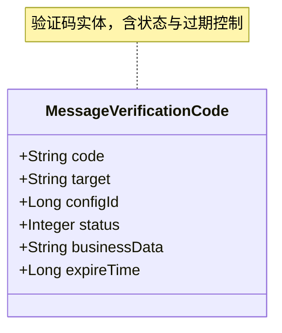

图表来源
- [message-module/src/main/java/com/fastproject/message/domain/MessageVerificationCode.java](file://message-module/src/main/java/com/fastproject/message/domain/MessageVerificationCode.java#L1-L49)

章节来源
- [message-module/src/main/java/com/fastproject/message/domain/MessageVerificationCode.java](file://message-module/src/main/java/com/fastproject/message/domain/MessageVerificationCode.java#L1-L49)

## 依赖关系分析
- 枚举层与领域层：消息类型枚举用于标识MessageType；消息记录状态枚举用于标识MessageRecord；验证码状态枚举用于标识MessageVerificationCode。
- 领域层内部：MessageType与MessageTemplate通过typeId关联；MessageTemplate与MessageConfig通过configId关联；MessageRecord与MessageTemplate在发送时建立关联。
- 软删除与逻辑过滤：各实体均采用软删除与SQL限制，避免物理删除带来的审计与一致性问题。

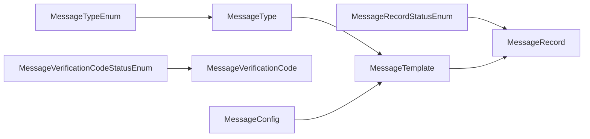

图表来源
- [message-api/src/main/java/com/fastproject/message/enums/MessageTypeEnum.java](file://message-api/src/main/java/com/fastproject/message/enums/MessageTypeEnum.java#L1-L26)
- [message-api/src/main/java/com/fastproject/message/enums/MessageRecordStatusEnum.java](file://message-api/src/main/java/com/fastproject/message/enums/MessageRecordStatusEnum.java#L1-L27)
- [message-api/src/main/java/com/fastproject/message/enums/MessageVerificationCodeStatusEnum.java](file://message-api/src/main/java/com/fastproject/message/enums/MessageVerificationCodeStatusEnum.java#L1-L31)
- [message-module/src/main/java/com/fastproject/message/domain/MessageType.java](file://message-module/src/main/java/com/fastproject/message/domain/MessageType.java#L1-L39)
- [message-module/src/main/java/com/fastproject/message/domain/MessageTemplate.java](file://message-module/src/main/java/com/fastproject/message/domain/MessageTemplate.java#L1-L55)
- [message-module/src/main/java/com/fastproject/message/domain/MessageConfig.java](file://message-module/src/main/java/com/fastproject/message/domain/MessageConfig.java#L1-L45)
- [message-module/src/main/java/com/fastproject/message/domain/MessageRecord.java](file://message-module/src/main/java/com/fastproject/message/domain/MessageRecord.java#L1-L59)
- [message-module/src/main/java/com/fastproject/message/domain/MessageVerificationCode.java](file://message-module/src/main/java/com/fastproject/message/domain/MessageVerificationCode.java#L1-L49)

## 性能考虑
- 查询优化：对常用查询条件（如状态、类型、配置ID、接收人）建立索引，减少全表扫描。
- 分页与批量：列表查询采用分页，批量写入与更新时使用批处理，降低数据库压力。
- 缓存策略：对高频读取的配置与模板内容进行缓存，结合TTL与失效策略，提升响应速度。
- 软删除与归档：启用软删除后定期归档历史数据，保持主表轻量，提高查询效率。
- 幂等与重试：发送记录与验证码状态变更需保证幂等，结合重试与退避策略，避免重复发送与状态不一致。

## 故障排查指南
- 状态不一致：检查消息记录状态与验证码状态是否与预期一致，核对状态枚举映射。
- 发送失败：查看消息记录状态是否为失败，结合模板与配置检查内容渲染与渠道参数。
- 验证码异常：确认验证码状态是否为有效，过期时间是否正确，业务数据是否匹配。
- 权限与可见性：确认软删除与SQL限制是否生效，避免误读已删除数据。

## 结论
消息类型管理API通过清晰的枚举定义与实体模型，构建了从类型、模板、配置到记录与验证码的完整闭环。借助软删除、状态枚举与层级关联，系统具备良好的扩展性、可维护性与可观测性。建议在生产环境中完善缓存、索引与归档策略，并持续优化发送流程的幂等与重试机制。

## 附录

### RESTful接口设计建议（概念性说明）
以下为消息类型管理API的典型接口设计思路（概念性，非特定源码映射）：
- GET /api/message/types：查询所有消息类型（支持分页、筛选状态、代码）
- POST /api/message/types：新增消息类型（校验代码唯一性、状态合法性）
- PUT /api/message/types/{id}：更新消息类型（禁止修改代码）
- DELETE /api/message/types/{id}：删除消息类型（软删除）
- GET /api/message/templates：查询模板列表（按类型、配置、状态筛选）
- POST /api/message/templates：新增模板（校验模板代码唯一性）
- PUT /api/message/templates/{id}：更新模板
- DELETE /api/message/templates/{id}：删除模板（软删除）
- GET /api/message/configs：查询配置列表（按类型、状态筛选）
- POST /api/message/configs：新增配置
- PUT /api/message/configs/{id}：更新配置
- GET /api/message/records：查询发送记录（按状态、类型、接收人筛选）
- POST /api/message/codes：生成验证码（绑定配置ID与过期策略）
- POST /api/message/codes/verify：校验验证码（更新状态与业务数据）

### 类型层级结构与扩展机制
- 层级结构：消息类型 -> 模板 -> 配置 -> 记录/验证码
- 扩展机制：新增消息类型时，同步创建对应模板与配置；模板内容与渲染参数由配置驱动；记录与验证码分别承载发送结果与校验生命周期。

### 生命周期管理与迁移策略
- 生命周期：类型（启用/停用）、模板（草稿/发布/下线）、配置（启用/禁用）、记录（已发送/失败）、验证码（有效/已使用/已过期）。
- 版本兼容：模板与配置采用向后兼容策略，新增字段默认值与空值处理；迁移时保留历史记录与状态。
- 迁移策略：软删除与归档先行，逐步清理历史数据；对关键字段增加默认值与校验，确保迁移过程稳定。