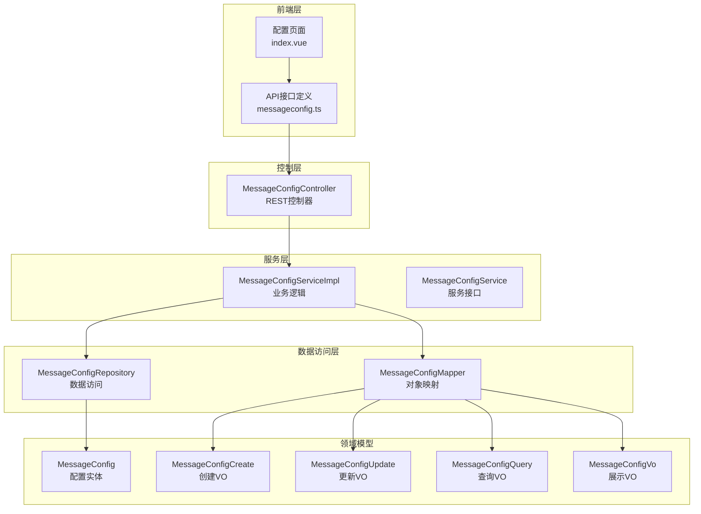
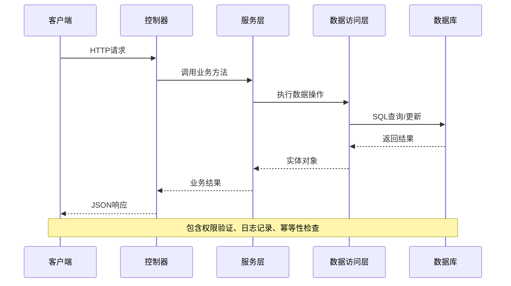
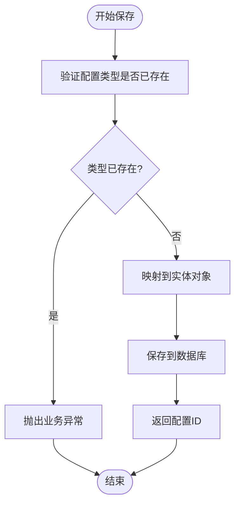
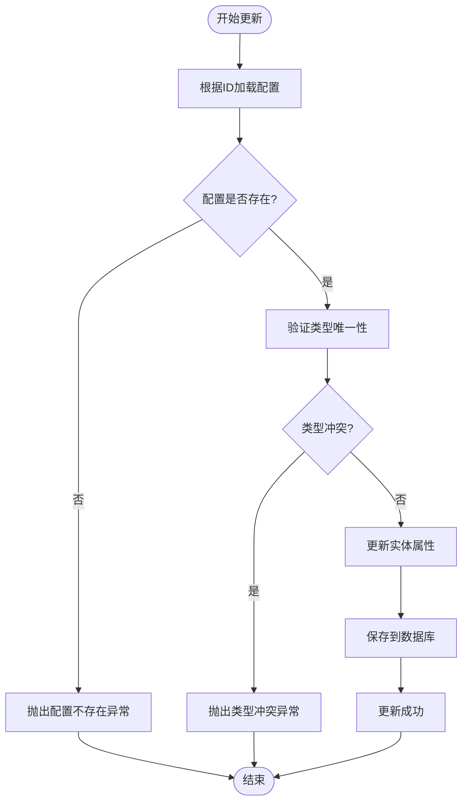
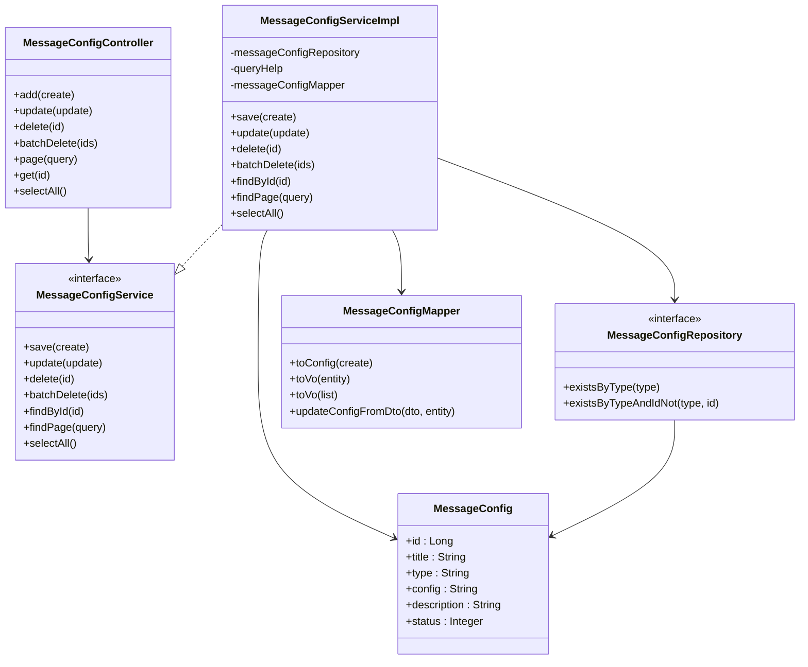

# 消息配置API

<cite>
**本文档引用的文件**
- [MessageConfigController.java](file://run-admin/src/main/java/com/fastproject/module/message/controller/MessageConfigController.java)
- [MessageConfigServiceImpl.java](file://message-module/src/main/java/com//fastproject/message/service/impl/MessageConfigServiceImpl.java)
- [MessageConfigRepository.java](file://message-module/src/main/java/com/ fastproject/message/repository/db/MessageConfigRepository.java)
- [MessageConfigMapper.java](file://message-module/src/main/java/com/ fastproject/message/mapper/MessageConfigMapper.java)
- [MessageConfig.java](file://message-module/src/main/java/com/ fastproject/message/domain/MessageConfig.java)
- [MessageConfigCreate.java](file://message-module/src/main/java/com/ fastproject/message/vo/config/MessageConfigCreate.java)
- [MessageConfigUpdate.java](file://message-module/src/main/java/com/ fastproject/message/vo/config/MessageConfigUpdate.java)
- [MessageConfigQuery.java](file://message-module/src/main/java/com/ fastproject/message/vo/config/MessageConfigQuery.java)
- [MessageConfigVo.java](file://message-module/src/main/java/com/ fastproject/message/vo/config/MessageConfigVo.java)
- [messageconfig.ts](file://fast-ui/apps/admin-vue/src/api/message/messageconfig.ts)
- [index.vue](file://fast-ui/apps/admin-vue/src/views/message/config/index.vue)
</cite>

## 目录
1. [简介](#简介)
2. [项目结构](#项目结构)
3. [核心组件](#核心组件)
4. [架构概览](#架构概览)
5. [详细组件分析](#详细组件分析)
6. [依赖关系分析](#依赖关系分析)
7. [性能考虑](#性能考虑)
8. [故障排除指南](#故障排除指南)
9. [结论](#结论)

## 简介

消息配置管理API是FastProject项目中消息系统的核心配置管理模块，负责管理各种消息发送渠道的配置信息。该API支持多种消息类型，包括但不限于邮件配置、短信配置等不同消息类型的配置管理。

本API提供了完整的RESTful接口，支持配置的创建、更新、查询、删除等操作，具有以下特点：
- 支持多种消息类型配置
- 完整的权限控制和审计日志
- 幂等性保证和防重复提交
- 分页查询和条件筛选
- 状态管理和启用禁用控制

## 项目结构

消息配置API在项目中的组织结构如下：



**图表来源**
- [MessageConfigController.java](file://run-admin/src/main/java/com/ fastproject/module/message/controller/MessageConfigController.java#L1-L101)
- [MessageConfigServiceImpl.java](file://message-module/src/main/java/com/ fastproject/message/service/impl/MessageConfigServiceImpl.java#L1-L132)
- [MessageConfigRepository.java](file://message-module/src/main/java/com/ fastproject/message/repository/db/MessageConfigRepository.java#L1-L14)
- [MessageConfigMapper.java](file://message-module/src/main/java/com/ fastproject/message/mapper/MessageConfigMapper.java#L1-L27)

**章节来源**
- [MessageConfigController.java](file://run-admin/src/main/java/com/ fastproject/module/message/controller/MessageConfigController.java#L1-L101)
- [MessageConfigServiceImpl.java](file://message-module/src/main/java/com/ fastproject/message/service/impl/MessageConfigServiceImpl.java#L1-L132)

## 核心组件

### 控制器层
消息配置控制器提供RESTful API接口，使用Spring MVC注解实现HTTP端点映射。

### 服务层
消息配置服务实现业务逻辑，包括数据验证、事务管理和业务规则处理。

### 数据访问层
使用Spring Data JPA提供数据持久化功能，支持复杂查询和分页操作。

### 领域模型
MessageConfig实体类定义了消息配置的数据结构和数据库映射关系。

**章节来源**
- [MessageConfigController.java](file://run-admin/src/main/java/com/ fastproject/module/message/controller/MessageConfigController.java#L24-L101)
- [MessageConfigServiceImpl.java](file://message-module/src/main/java/com/ fastproject/message/service/impl/MessageConfigServiceImpl.java#L29-L132)
- [MessageConfig.java](file://message-module/src/main/java/com/ fastproject/message/domain/MessageConfig.java#L1-L44)

## 架构概览

消息配置API采用经典的三层架构设计，实现了清晰的职责分离：



**图表来源**
- [MessageConfigController.java](file://run-admin/src/main/java/com/ fastproject/module/message/controller/MessageConfigController.java#L34-L52)
- [MessageConfigServiceImpl.java](file://message-module/src/main/java/com/ fastproject/message/service/impl/MessageConfigServiceImpl.java#L38-L64)

## 详细组件分析

### REST API接口定义

#### 创建消息配置
- **HTTP方法**: POST
- **URL路径**: `/message/config`
- **请求参数**: MessageConfigCreate对象
- **响应格式**: ResultVo<Long>
- **权限要求**: `admin:message:config:add`

#### 更新消息配置
- **HTTP方法**: PUT
- **URL路径**: `/message/config`
- **请求参数**: MessageConfigUpdate对象
- **响应格式**: ResultVo<Object>
- **权限要求**: `admin:message:config:update`

#### 删除消息配置
- **HTTP方法**: DELETE
- **URL路径**: `/message/config/{id}`
- **请求参数**: 路径变量id
- **响应格式**: ResultVo<Object>
- **权限要求**: `admin:message:config:delete`

#### 批量删除消息配置
- **HTTP方法**: DELETE
- **URL路径**: `/message/config/batch`
- **请求参数**: 数字数组ids
- **响应格式**: ResultVo<Object>
- **权限要求**: `admin:message:config:delete`

#### 分页查询消息配置
- **HTTP方法**: POST
- **URL路径**: `/message/config/page`
- **请求参数**: MessageConfigQuery对象
- **响应格式**: ResultVo<PageVo<List<MessageConfigVo>>>
- **权限要求**: `admin:message:config:page`

#### 获取消息配置详情
- **HTTP方法**: GET
- **URL路径**: `/message/config/{id}`
- **请求参数**: 路径变量id
- **响应格式**: ResultVo<MessageConfigVo>
- **权限要求**: `admin:message:config:page`

#### 获取所有可用配置
- **HTTP方法**: GET
- **URL路径**: `/message/config/selectAll`
- **请求参数**: 无
- **响应格式**: ResultVo<List<IdTitleVo>>
- **权限要求**: 无需特殊权限

**章节来源**
- [MessageConfigController.java](file://run-admin/src/main/java/com/ fastproject/module/message/controller/MessageConfigController.java#L31-L100)
- [messageconfig.ts](file://fast-ui/apps/admin-vue/src/api/message/messageconfig.ts#L48-L101)

### 数据模型设计

#### MessageConfig实体类
消息配置的核心数据模型，包含以下字段：

| 字段名 | 类型 | 描述 | 约束 |
|--------|------|------|------|
| id | Long | 主键ID | 自增, 非空 |
| title | String | 配置标题 | 长度限制, 非空 |
| type | String | 配置类型 | 唯一约束, 非空 |
| config | String | 配置内容(JSON) | 非空 |
| description | String | 配置描述 | 可选 |
| status | Integer | 数据状态 | 默认1-正常, 2-禁用 |
| createTime | Timestamp | 创建时间 | 自动生成 |
| updateTime | Timestamp | 更新时间 | 自动生成 |

#### 配置类型验证
系统通过数据库唯一约束确保配置类型的唯一性，防止重复配置。

**章节来源**
- [MessageConfig.java](file://message-module/src/main/java/com/ fastproject/message/domain/MessageConfig.java#L17-L44)
- [MessageConfigRepository.java](file://message-module/src/main/java/com/ fastproject/message/repository/db/MessageConfigRepository.java#L11-L13)

### 业务逻辑实现

#### 保存配置流程


**图表来源**
- [MessageConfigServiceImpl.java](file://message-module/src/main/java/com/ fastproject/message/service/impl/MessageConfigServiceImpl.java#L38-L49)

#### 更新配置流程


**图表来源**
- [MessageConfigServiceImpl.java](file://message-module/src/main/java/com/ fastproject/message/service/impl/MessageConfigServiceImpl.java#L51-L64)

### 权限控制和安全机制

#### 权限注解
- `@PreAuthorize("@ps.hasPermission('admin:message:config:add')")` - 添加权限
- `@PreAuthorize("@ps.hasPermission('admin:message:config:update')") - 更新权限  
- `@PreAuthorize("@ps.hasPermission('admin:message:config:delete')")` - 删除权限
- `@PreAuthorize("@ps.hasPermission('admin:message:config:page')")` - 查询权限

#### 幂等性保证
使用`@Idempotent`注解确保相同请求不会产生重复效果：
- 前缀: `add:message:config:` 和 `update:message:config:`
- 过期时间: 120秒
- 标题: 对应的操作名称

#### 审计日志
所有操作都记录详细的审计日志：
- 日志类型: BUSINESS
- 操作动作: CREATE/UPDATE/DELETE
- 记录详细的操作信息

**章节来源**
- [MessageConfigController.java](file://run-admin/src/main/java/com/ fastproject/module/message/controller/MessageConfigController.java#L34-L52)

### 响应数据结构

#### 统一响应格式
所有API响应都遵循统一的ResultVo格式：

```json
{
  "code": 200,
  "data": {},
  "msg": "操作成功"
}
```

#### 分页响应格式
分页查询返回PageVo包装的数据：

```json
{
  "code": 200,
  "data": {
    "data": [],
    "total": 0
  },
  "msg": "操作成功"
}
```

**章节来源**
- [messageconfig.ts](file://fast-ui/apps/admin-vue/src/api/message/messageconfig.ts#L42-L46)

## 依赖关系分析



**图表来源**
- [MessageConfigController.java](file://run-admin/src/main/java/com/ fastproject/module/message/controller/MessageConfigController.java#L24-L101)
- [MessageConfigServiceImpl.java](file://message-module/src/main/java/com/ fastproject/message/service/impl/MessageConfigServiceImpl.java#L29-L132)
- [MessageConfigRepository.java](file://message-module/src/main/java/com/ fastproject/message/repository/db/MessageConfigRepository.java#L8-L14)
- [MessageConfigMapper.java](file://message-module/src/main/java/com/ fastproject/message/mapper/MessageConfigMapper.java#L13-L27)
- [MessageConfig.java](file://message-module/src/main/java/com/ fastproject/message/domain/MessageConfig.java#L17-L44)

**章节来源**
- [MessageConfigController.java](file://run-admin/src/main/java/com/ fastproject/module/message/controller/MessageConfigController.java#L24-L101)
- [MessageConfigServiceImpl.java](file://message-module/src/main/java/com/ fastproject/message/service/impl/MessageConfigServiceImpl.java#L29-L132)

## 性能考虑

### 数据库优化
- **索引策略**: 在`type`字段上建立唯一索引，确保配置类型的唯一性
- **查询优化**: 使用Specification动态构建查询条件，支持多字段组合查询
- **分页优化**: 默认按创建时间降序排列，提高最新配置的查询效率

### 缓存策略
当前实现未包含缓存层，建议在生产环境中考虑：
- 配置类型缓存：缓存常用的消息配置类型
- 状态缓存：缓存启用状态的配置列表
- 配置内容缓存：缓存最近使用的配置内容

### 并发控制
- **事务管理**: 关键操作使用@Transactional注解确保数据一致性
- **幂等性**: 通过@Idempotent注解防止重复提交
- **乐观锁**: 可考虑添加版本号字段支持并发更新

## 故障排除指南

### 常见错误及解决方案

#### 配置类型已存在
**错误信息**: "配置类型已存在"
**可能原因**: 尝试创建或更新配置时使用了已存在的配置类型
**解决方法**: 
1. 检查现有配置类型
2. 修改配置类型为唯一值
3. 或者更新现有配置而非创建新配置

#### 配置不存在
**错误信息**: "配置不存在"
**可能原因**: 尝试更新或删除不存在的配置ID
**解决方法**:
1. 确认配置ID的有效性
2. 重新获取最新的配置列表
3. 检查数据库中是否存在该记录

#### 权限不足
**错误信息**: 403 Forbidden
**可能原因**: 当前用户缺少相应的操作权限
**解决方法**:
1. 检查用户角色和权限配置
2. 确保具备`admin:message:config:*`相关权限
3. 联系系统管理员分配权限

### 调试建议

#### 后端调试
1. 查看应用日志中的业务操作记录
2. 检查数据库连接和事务状态
3. 验证配置验证规则是否正确执行

#### 前端调试
1. 检查网络请求的响应状态码
2. 验证请求头中`x-request-id`的生成和传递
3. 确认UI组件的状态更新逻辑

**章节来源**
- [MessageConfigServiceImpl.java](file://message-module/src/main/java/com/ fastproject/message/service/impl/MessageConfigServiceImpl.java#L42-L44)
- [MessageConfigServiceImpl.java](file://message-module/src/main/java/com/ fastproject/message/service/impl/MessageConfigServiceImpl.java#L68-L72)

## 结论

消息配置管理API提供了完整的消息发送渠道配置管理能力，具有以下优势：

### 技术特性
- **完整的RESTful设计**: 符合HTTP标准的API设计
- **强类型安全**: 使用Java泛型和VO对象确保类型安全
- **权限控制完善**: 基于角色的细粒度权限管理
- **审计日志完整**: 全面的操作记录和追踪能力

### 功能完整性
- **多消息类型支持**: 支持邮件、短信等多种消息类型的配置
- **灵活的查询方式**: 支持按标题、类型、状态等多维度查询
- **批量操作支持**: 提供批量删除等高效操作
- **状态管理**: 完善的启用禁用控制机制

### 扩展性考虑
- **模块化设计**: 清晰的分层架构便于功能扩展
- **配置驱动**: 支持通过配置文件调整行为
- **插件化架构**: 便于集成新的消息发送渠道

该API为FastProject项目的消息系统提供了坚实的基础，能够满足企业级应用对消息配置管理的各种需求。