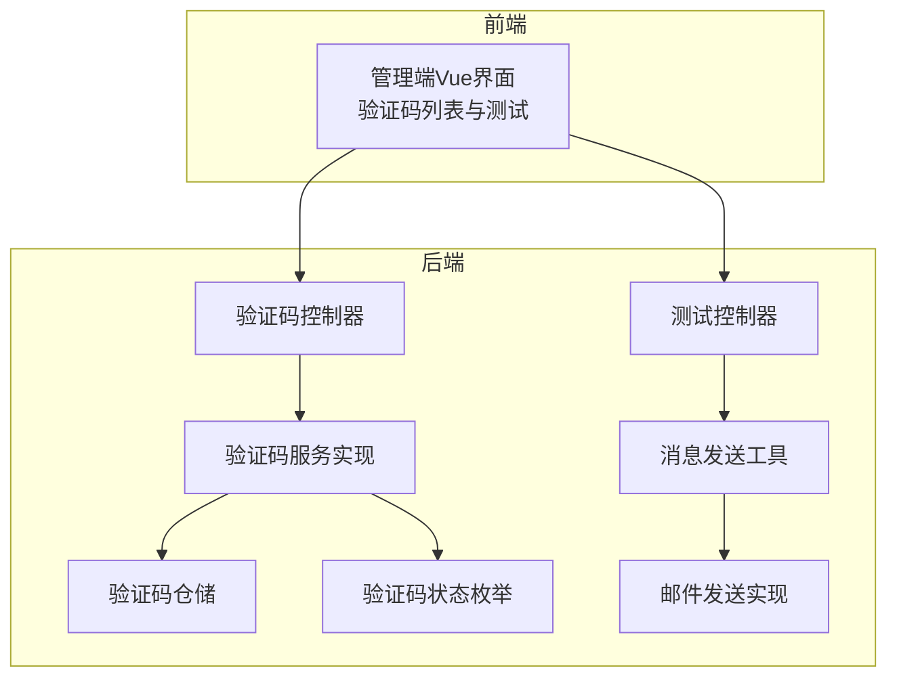
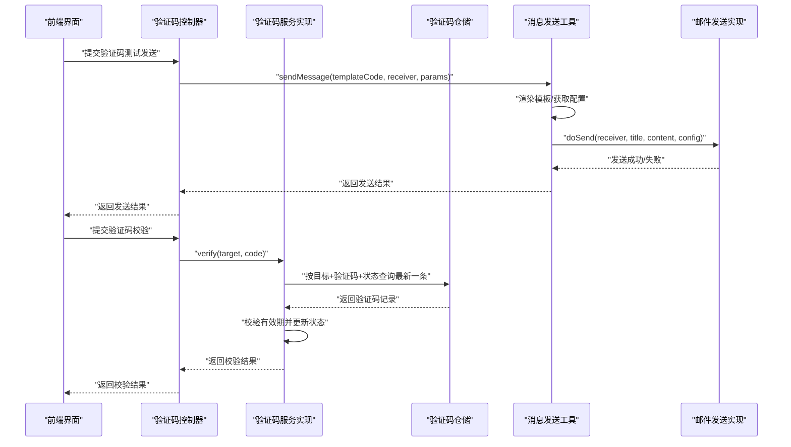
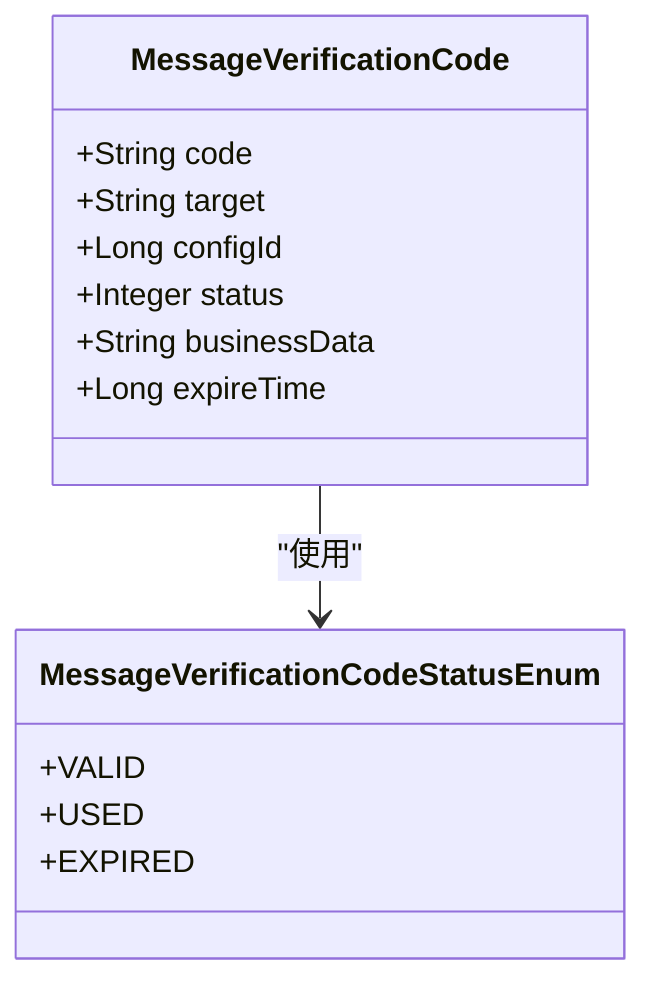
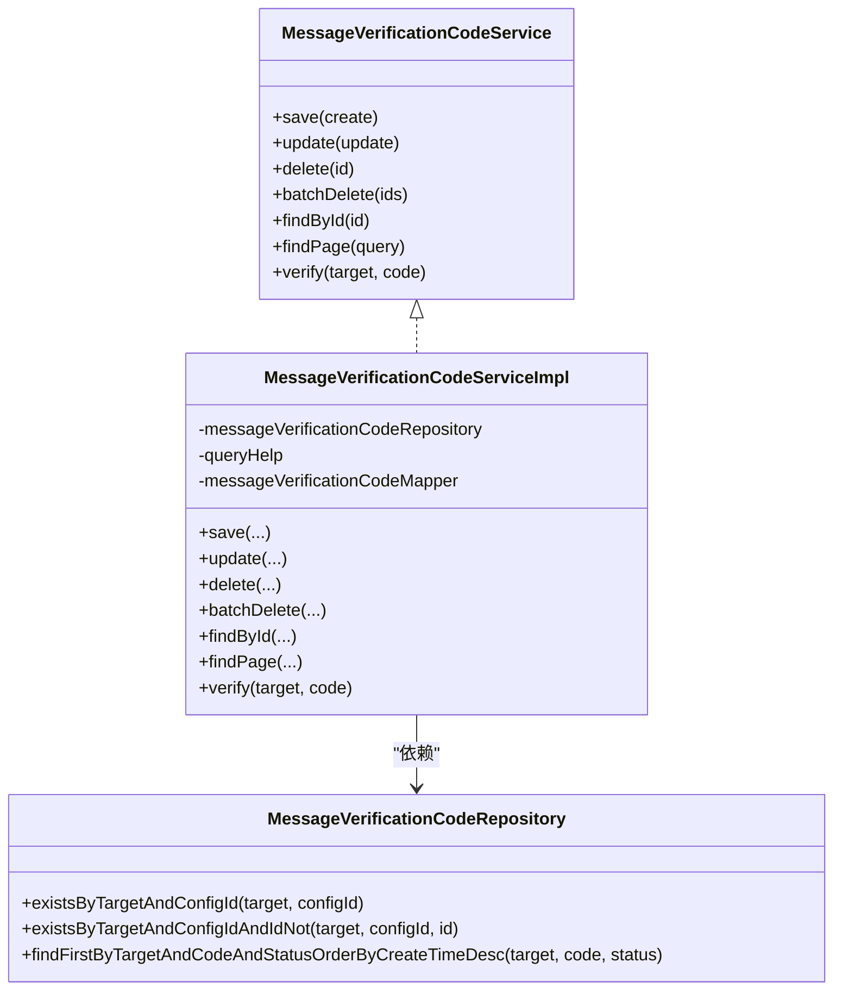
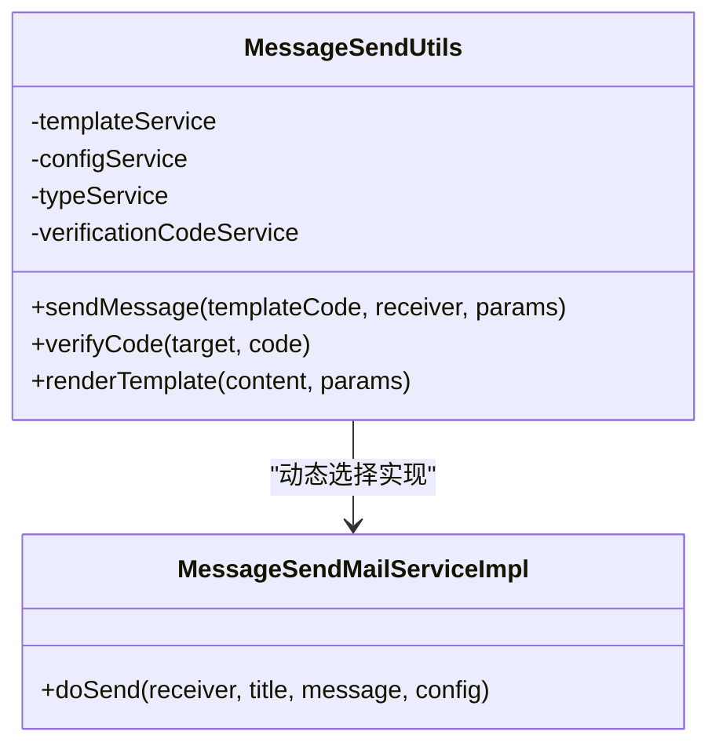
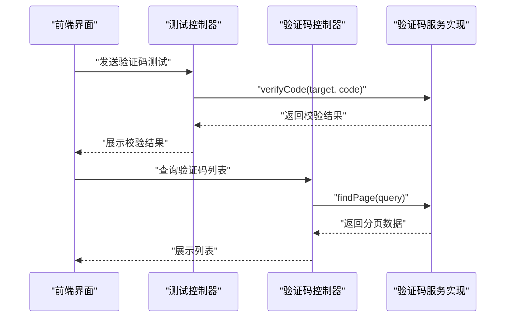
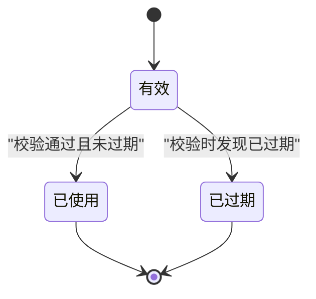
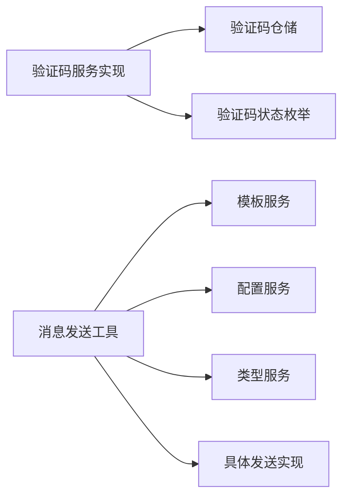

# 验证码API

<cite>
**本文引用的文件**
- [message-module/src/main/java/com/fastproject/message/domain/MessageVerificationCode.java](file://message-module/src/main/java/com/fastproject/message/domain/MessageVerificationCode.java)
- [message-module/src/main/java/com/fastproject/message/service/MessageVerificationCodeService.java](file://message-module/src/main/java/com/fastproject/message/service/MessageVerificationCodeService.java)
- [message-module/src/main/java/com/fastproject/message/service/impl/MessageVerificationCodeServiceImpl.java](file://message-module/src/main/java/com/fastproject/message/service/impl/MessageVerificationCodeServiceImpl.java)
- [message-module/src/main/java/com/fastproject/message/repository/db/MessageVerificationCodeRepository.java](file://message-module/src/main/java/com/fastproject/message/repository/db/MessageVerificationCodeRepository.java)
- [message-module/src/main/java/com/fastproject/message/vo/verificationcode/MessageVerificationCodeCreate.java](file://message-module/src/main/java/com/fastproject/message/vo/verificationcode/MessageVerificationCodeCreate.java)
- [message-module/src/main/java/com/fastproject/message/vo/test/MessageTestSend.java](file://message-module/src/main/java/com/fastproject/message/vo/test/MessageTestSend.java)
- [message-module/src/main/java/com/fastproject/message/vo/test/MessageTestVerify.java](file://message-module/src/main/java/com/fastproject/message/vo/test/MessageTestVerify.java)
- [message-module/src/main/java/com/fastproject/message/enums/MessageVerificationCodeStatusEnum.java](file://message-module/src/main/java/com/fastproject/message/enums/MessageVerificationCodeStatusEnum.java)
- [message-module/src/main/java/com/fastproject/message/send/MessageSendUtils.java](file://message-module/src/main/java/com/fastproject/message/send/MessageSendUtils.java)
- [message-module/src/main/java/com/fastproject/message/send/impl/MessageSendMailServiceImpl.java](file://message-module/src/main/java/com/fastproject/message/send/impl/MessageSendMailServiceImpl.java)
- [message-api/src/main/java/com/fastproject/message/enums/MessageRecordStatusEnum.java](file://message-api/src/main/java/com/fastproject/message/enums/MessageRecordStatusEnum.java)
- [message-api/src/main/java/com/fastproject/message/enums/MessageTypeEnum.java](file://message-api/src/main/java/com/fastproject/message/enums/MessageTypeEnum.java)
- [message-api/src/main/java/com/fastproject/message/enums/MessageVerificationCodeStatusEnum.java](file://message-api/src/main/java/com/fastproject/message/enums/MessageVerificationCodeStatusEnum.java)
- [run-admin/src/main/java/com/fastproject/module/message/controller/MessageVerificationCodeController.java](file://run-admin/src/main/java/com/fastproject/module/message/controller/MessageVerificationCodeController.java)
- [run-admin/src/main/java/com/fastproject/module/message/controller/MessageTestController.java](file://run-admin/src/main/java/com/fastproject/module/message/controller/MessageTestController.java)
- [fast-ui/apps/admin-vue/src/views/message/verificationcode/index.vue](file://fast-ui/apps/admin-vue/src/views/message/verificationcode/index.vue)
- [fast-ui/apps/admin-vue/src/views/message/test/index.vue](file://fast-ui/apps/admin-vue/src/views/message/test/index.vue)
</cite>

## 目录
1. [简介](#简介)
2. [项目结构](#项目结构)
3. [核心组件](#核心组件)
4. [架构总览](#架构总览)
5. [详细组件分析](#详细组件分析)
6. [依赖关系分析](#依赖关系分析)
7. [性能考虑](#性能考虑)
8. [故障排查指南](#故障排查指南)
9. [结论](#结论)
10. [附录](#附录)

## 简介
本文件系统性梳理验证码管理API的设计与实现，覆盖验证码生成、发送、验证、查询等完整流程；详述安全机制（有效期、状态流转）、防刷策略建议、模板定制、发送频率控制、异常处理与日志记录；并给出存储策略、清理机制与统计分析的运维建议。本文档同时提供面向前端的调用参考与后端实现映射。

## 项目结构
验证码能力由“消息模块”提供，前端通过后台控制器暴露的REST接口进行调用，测试页面用于演示验证码发送与校验流程。

图表来源
- [run-admin/src/main/java/com/fastproject/module/message/controller/MessageVerificationCodeController.java](file://run-admin/src/main/java/com/fastproject/module/message/controller/MessageVerificationCodeController.java#L1-L200)
- [run-admin/src/main/java/com/fastproject/module/message/controller/MessageTestController.java](file://run-admin/src/main/java/com/fastproject/module/message/controller/MessageTestController.java#L1-L200)
- [message-module/src/main/java/com/fastproject/message/service/impl/MessageVerificationCodeServiceImpl.java](file://message-module/src/main/java/com/fastproject/message/service/impl/MessageVerificationCodeServiceImpl.java#L1-L127)
- [message-module/src/main/java/com/fastproject/message/repository/db/MessageVerificationCodeRepository.java](file://message-module/src/main/java/com/fastproject/message/repository/db/MessageVerificationCodeRepository.java#L1-L18)
- [message-module/src/main/java/com/fastproject/message/enums/MessageVerificationCodeStatusEnum.java](file://message-module/src/main/java/com/fastproject/message/enums/MessageVerificationCodeStatusEnum.java#L1-L31)
- [message-module/src/main/java/com/fastproject/message/send/MessageSendUtils.java](file://message-module/src/main/java/com/fastproject/message/send/MessageSendUtils.java#L1-L86)
- [message-module/src/main/java/com/fastproject/message/send/impl/MessageSendMailServiceImpl.java](file://message-module/src/main/java/com/fastproject/message/send/impl/MessageSendMailServiceImpl.java#L1-L100)

章节来源
- [run-admin/src/main/java/com/fastproject/module/message/controller/MessageVerificationCodeController.java](file://run-admin/src/main/java/com/fastproject/module/message/controller/MessageVerificationCodeController.java#L1-L200)
- [run-admin/src/main/java/com/fastproject/module/message/controller/MessageTestController.java](file://run-admin/src/main/java/com/fastproject/module/message/controller/MessageTestController.java#L1-L200)
- [message-module/src/main/java/com/fastproject/message/service/impl/MessageVerificationCodeServiceImpl.java](file://message-module/src/main/java/com/fastproject/message/service/impl/MessageVerificationCodeServiceImpl.java#L1-L127)
- [message-module/src/main/java/com/fastproject/message/repository/db/MessageVerificationCodeRepository.java](file://message-module/src/main/java/com/fastproject/message/repository/db/MessageVerificationCodeRepository.java#L1-L18)
- [message-module/src/main/java/com/fastproject/message/enums/MessageVerificationCodeStatusEnum.java](file://message-module/src/main/java/com/fastproject/message/enums/MessageVerificationCodeStatusEnum.java#L1-L31)
- [message-module/src/main/java/com/fastproject/message/send/MessageSendUtils.java](file://message-module/src/main/java/com/fastproject/message/send/MessageSendUtils.java#L1-L86)
- [message-module/src/main/java/com/fastproject/message/send/impl/MessageSendMailServiceImpl.java](file://message-module/src/main/java/com/fastproject/message/send/impl/MessageSendMailServiceImpl.java#L1-L100)

## 核心组件
- 验证码实体与状态：定义验证码字段、状态枚举及软删除约束。
- 验证码服务接口与实现：提供保存、更新、删除、分页查询与校验方法。
- 验证码仓储：基于JPA的查询扩展，支持按目标、验证码、状态排序查询。
- 发送工具与邮件发送实现：封装模板渲染、配置解析与具体发送执行。
- 控制器：对外暴露验证码管理与测试接口。
- 前端界面：提供验证码列表查询与测试校验入口。

章节来源
- [message-module/src/main/java/com/fastproject/message/domain/MessageVerificationCode.java](file://message-module/src/main/java/com/fastproject/message/domain/MessageVerificationCode.java#L1-L49)
- [message-module/src/main/java/com/fastproject/message/service/MessageVerificationCodeService.java](file://message-module/src/main/java/com/fastproject/message/service/MessageVerificationCodeService.java#L1-L53)
- [message-module/src/main/java/com/fastproject/message/service/impl/MessageVerificationCodeServiceImpl.java](file://message-module/src/main/java/com/fastproject/message/service/impl/MessageVerificationCodeServiceImpl.java#L1-L127)
- [message-module/src/main/java/com/fastproject/message/repository/db/MessageVerificationCodeRepository.java](file://message-module/src/main/java/com/fastproject/message/repository/db/MessageVerificationCodeRepository.java#L1-L18)
- [message-module/src/main/java/com/fastproject/message/enums/MessageVerificationCodeStatusEnum.java](file://message-module/src/main/java/com/fastproject/message/enums/MessageVerificationCodeStatusEnum.java#L1-L31)
- [message-module/src/main/java/com/fastproject/message/send/MessageSendUtils.java](file://message-module/src/main/java/com/fastproject/message/send/MessageSendUtils.java#L1-L86)
- [message-module/src/main/java/com/fastproject/message/send/impl/MessageSendMailServiceImpl.java](file://message-module/src/main/java/com/fastproject/message/send/impl/MessageSendMailServiceImpl.java#L1-L100)
- [run-admin/src/main/java/com/fastproject/module/message/controller/MessageVerificationCodeController.java](file://run-admin/src/main/java/com/fastproject/module/message/controller/MessageVerificationCodeController.java#L1-L200)
- [run-admin/src/main/java/com/fastproject/module/message/controller/MessageTestController.java](file://run-admin/src/main/java/com/fastproject/module/message/controller/MessageTestController.java#L1-L200)
- [fast-ui/apps/admin-vue/src/views/message/verificationcode/index.vue](file://fast-ui/apps/admin-vue/src/views/message/verificationcode/index.vue#L368-L417)
- [fast-ui/apps/admin-vue/src/views/message/test/index.vue](file://fast-ui/apps/admin-vue/src/views/message/test/index.vue#L83-L153)

## 架构总览
验证码API采用分层架构：前端通过控制器发起请求，控制器调用服务层，服务层操作仓储与发送工具，最终完成验证码的持久化与发送。

图表来源
- [run-admin/src/main/java/com/fastproject/module/message/controller/MessageTestController.java](file://run-admin/src/main/java/com/fastproject/module/message/controller/MessageTestController.java#L1-L200)
- [message-module/src/main/java/com/fastproject/message/send/MessageSendUtils.java](file://message-module/src/main/java/com/fastproject/message/send/MessageSendUtils.java#L1-L86)
- [message-module/src/main/java/com/fastproject/message/send/impl/MessageSendMailServiceImpl.java](file://message-module/src/main/java/com/fastproject/message/send/impl/MessageSendMailServiceImpl.java#L1-L100)
- [message-module/src/main/java/com/fastproject/message/service/impl/MessageVerificationCodeServiceImpl.java](file://message-module/src/main/java/com/fastproject/message/service/impl/MessageVerificationCodeServiceImpl.java#L1-L127)
- [message-module/src/main/java/com/fastproject/message/repository/db/MessageVerificationCodeRepository.java](file://message-module/src/main/java/com/fastproject/message/repository/db/MessageVerificationCodeRepository.java#L1-L18)

## 详细组件分析

### 验证码实体与状态
- 实体字段：验证码值、目标账号、配置ID、状态、业务数据、过期时间。
- 状态枚举：有效、已使用、已过期。
- 软删除：通过SQL注解实现逻辑删除，避免物理删除影响审计与统计。

图表来源
- [message-module/src/main/java/com/fastproject/message/domain/MessageVerificationCode.java](file://message-module/src/main/java/com/fastproject/message/domain/MessageVerificationCode.java#L1-L49)
- [message-module/src/main/java/com/fastproject/message/enums/MessageVerificationCodeStatusEnum.java](file://message-module/src/main/java/com/fastproject/message/enums/MessageVerificationCodeStatusEnum.java#L1-L31)

章节来源
- [message-module/src/main/java/com/fastproject/message/domain/MessageVerificationCode.java](file://message-module/src/main/java/com/fastproject/message/domain/MessageVerificationCode.java#L1-L49)
- [message-module/src/main/java/com/fastproject/message/enums/MessageVerificationCodeStatusEnum.java](file://message-module/src/main/java/com/fastproject/message/enums/MessageVerificationCodeStatusEnum.java#L1-L31)

### 验证码服务与仓储
- 服务接口：提供保存、更新、删除、批量删除、按ID查询、分页查询、校验验证码等方法。
- 服务实现：保存与更新均记录日志；分页查询支持按验证码、目标、配置ID、状态过滤；校验逻辑包括有效期检查与状态更新。
- 仓储接口：提供按目标+验证码+状态查询最新一条记录的能力，便于快速定位当前有效验证码。

图表来源
- [message-module/src/main/java/com/fastproject/message/service/MessageVerificationCodeService.java](file://message-module/src/main/java/com/fastproject/message/service/MessageVerificationCodeService.java#L1-L53)
- [message-module/src/main/java/com/fastproject/message/service/impl/MessageVerificationCodeServiceImpl.java](file://message-module/src/main/java/com/fastproject/message/service/impl/MessageVerificationCodeServiceImpl.java#L1-L127)
- [message-module/src/main/java/com/fastproject/message/repository/db/MessageVerificationCodeRepository.java](file://message-module/src/main/java/com/fastproject/message/repository/db/MessageVerificationCodeRepository.java#L1-L18)

章节来源
- [message-module/src/main/java/com/fastproject/message/service/MessageVerificationCodeService.java](file://message-module/src/main/java/com/fastproject/message/service/MessageVerificationCodeService.java#L1-L53)
- [message-module/src/main/java/com/fastproject/message/service/impl/MessageVerificationCodeServiceImpl.java](file://message-module/src/main/java/com/fastproject/message/service/impl/MessageVerificationCodeServiceImpl.java#L1-L127)
- [message-module/src/main/java/com/fastproject/message/repository/db/MessageVerificationCodeRepository.java](file://message-module/src/main/java/com/fastproject/message/repository/db/MessageVerificationCodeRepository.java#L1-L18)

### 发送工具与邮件发送
- 发送工具：根据模板代码获取模板与配置，渲染模板参数，选择具体发送实现（如邮件），并记录发送过程。
- 邮件发送：解析配置JSON为邮件配置对象，设置SMTP参数，构建MIME消息并发送，异常统一捕获并抛出业务异常。

图表来源
- [message-module/src/main/java/com/fastproject/message/send/MessageSendUtils.java](file://message-module/src/main/java/com/fastproject/message/send/MessageSendUtils.java#L1-L86)
- [message-module/src/main/java/com/fastproject/message/send/impl/MessageSendMailServiceImpl.java](file://message-module/src/main/java/com/fastproject/message/send/impl/MessageSendMailServiceImpl.java#L1-L100)

章节来源
- [message-module/src/main/java/com/fastproject/message/send/MessageSendUtils.java](file://message-module/src/main/java/com/fastproject/message/send/MessageSendUtils.java#L1-L86)
- [message-module/src/main/java/com/fastproject/message/send/impl/MessageSendMailServiceImpl.java](file://message-module/src/main/java/com/fastproject/message/send/impl/MessageSendMailServiceImpl.java#L1-L100)

### 控制器与前端交互
- 验证码控制器：提供验证码管理相关接口（新增、更新、删除、分页、校验等）。
- 测试控制器：提供验证码发送与校验的测试接口，便于联调与验证。
- 前端界面：验证码列表页支持分页查询与筛选；测试页支持验证码发送与校验。

图表来源
- [run-admin/src/main/java/com/fastproject/module/message/controller/MessageTestController.java](file://run-admin/src/main/java/com/fastproject/module/message/controller/MessageTestController.java#L1-L200)
- [run-admin/src/main/java/com/fastproject/module/message/controller/MessageVerificationCodeController.java](file://run-admin/src/main/java/com/fastproject/module/message/controller/MessageVerificationCodeController.java#L1-L200)
- [message-module/src/main/java/com/fastproject/message/service/impl/MessageVerificationCodeServiceImpl.java](file://message-module/src/main/java/com/fastproject/message/service/impl/MessageVerificationCodeServiceImpl.java#L1-L127)

章节来源
- [run-admin/src/main/java/com/fastproject/module/message/controller/MessageVerificationCodeController.java](file://run-admin/src/main/java/com/fastproject/module/message/controller/MessageVerificationCodeController.java#L1-L200)
- [run-admin/src/main/java/com/fastproject/module/message/controller/MessageTestController.java](file://run-admin/src/main/java/com/fastproject/module/message/controller/MessageTestController.java#L1-L200)
- [fast-ui/apps/admin-vue/src/views/message/verificationcode/index.vue](file://fast-ui/apps/admin-vue/src/views/message/verificationcode/index.vue#L368-L417)
- [fast-ui/apps/admin-vue/src/views/message/test/index.vue](file://fast-ui/apps/admin-vue/src/views/message/test/index.vue#L83-L153)

### 校验流程与状态机
验证码校验遵循以下状态机：有效 → 使用中 → 已使用；若在有效期内被使用则标记为已使用，否则标记为已过期。

图表来源
- [message-module/src/main/java/com/fastproject/message/enums/MessageVerificationCodeStatusEnum.java](file://message-module/src/main/java/com/fastproject/message/enums/MessageVerificationCodeStatusEnum.java#L1-L31)
- [message-module/src/main/java/com/fastproject/message/service/impl/MessageVerificationCodeServiceImpl.java](file://message-module/src/main/java/com/fastproject/message/service/impl/MessageVerificationCodeServiceImpl.java#L108-L126)

章节来源
- [message-module/src/main/java/com/fastproject/message/enums/MessageVerificationCodeStatusEnum.java](file://message-module/src/main/java/com/fastproject/message/enums/MessageVerificationCodeStatusEnum.java#L1-L31)
- [message-module/src/main/java/com/fastproject/message/service/impl/MessageVerificationCodeServiceImpl.java](file://message-module/src/main/java/com/fastproject/message/service/impl/MessageVerificationCodeServiceImpl.java#L108-L126)

### 图形验证码、手机验证码、邮箱验证码
- 图形验证码：可通过模板与配置实现图片形式的验证码发送与校验。
- 手机验证码：通过短信通道发送，结合模板与配置完成发送与校验。
- 邮箱验证码：通过邮件通道发送，使用邮件发送实现类完成发送与校验。

章节来源
- [message-module/src/main/java/com/fastproject/message/send/impl/MessageSendMailServiceImpl.java](file://message-module/src/main/java/com/fastproject/message/send/impl/MessageSendMailServiceImpl.java#L1-L100)
- [message-module/src/main/java/com/fastproject/message/send/MessageSendUtils.java](file://message-module/src/main/java/com/fastproject/message/send/MessageSendUtils.java#L1-L86)

### 安全机制与防刷策略
- 有效期管理：验证码实体包含过期时间字段，服务实现会在校验时判断是否过期并更新状态。
- 状态管理：通过状态枚举与状态更新确保验证码生命周期可控。
- 防刷建议（通用实践，非当前代码实现）：
  - 同一目标+配置的发送频率限制（如每分钟最多N次）。
  - 同一IP维度的全局发送频率限制。
  - 失败次数阈值与临时封禁策略。
  - 验证码复杂度与长度策略。
  - 二次校验（如图形验证码前置）。
  - 日志与审计追踪，便于回溯与风控。

章节来源
- [message-module/src/main/java/com/fastproject/message/service/impl/MessageVerificationCodeServiceImpl.java](file://message-module/src/main/java/com/fastproject/message/service/impl/MessageVerificationCodeServiceImpl.java#L108-L126)
- [message-module/src/main/java/com/fastproject/message/domain/MessageVerificationCode.java](file://message-module/src/main/java/com/fastproject/message/domain/MessageVerificationCode.java#L1-L49)

### 模板定制与发送频率控制
- 模板定制：通过模板代码与参数渲染实现内容定制，发送工具负责模板解析与替换。
- 发送频率控制：建议在服务层或网关层增加限流与白名单策略，避免滥用。

章节来源
- [message-module/src/main/java/com/fastproject/message/send/MessageSendUtils.java](file://message-module/src/main/java/com/fastproject/message/send/MessageSendUtils.java#L73-L83)

### 异常处理与日志记录
- 异常处理：邮件发送异常统一捕获并抛出业务异常，便于上层感知与提示。
- 日志记录：服务层与发送工具均记录关键操作日志，便于问题定位与审计。

章节来源
- [message-module/src/main/java/com/fastproject/message/send/impl/MessageSendMailServiceImpl.java](file://message-module/src/main/java/com/fastproject/message/send/impl/MessageSendMailServiceImpl.java#L94-L97)
- [message-module/src/main/java/com/fastproject/message/service/impl/MessageVerificationCodeServiceImpl.java](file://message-module/src/main/java/com/fastproject/message/service/impl/MessageVerificationCodeServiceImpl.java#L36-L43)

### 存储策略、清理机制与统计分析
- 存储策略：验证码记录持久化至数据库，状态字段用于区分有效/已使用/已过期。
- 清理机制：可定期清理已过期或已使用的记录；软删除策略避免统计丢失。
- 统计分析：可基于状态与时间维度进行统计，如发送成功率、过期率、使用率等。

章节来源
- [message-module/src/main/java/com/fastproject/message/domain/MessageVerificationCode.java](file://message-module/src/main/java/com/fastproject/message/domain/MessageVerificationCode.java#L1-L49)
- [message-module/src/main/java/com/fastproject/message/enums/MessageVerificationCodeStatusEnum.java](file://message-module/src/main/java/com/fastproject/message/enums/MessageVerificationCodeStatusEnum.java#L1-L31)

## 依赖关系分析
验证码模块内部依赖清晰，服务层依赖仓储与映射工具，发送工具依赖模板、配置与类型服务，并通过Spring上下文动态选择具体发送实现。

图表来源
- [message-module/src/main/java/com/fastproject/message/service/impl/MessageVerificationCodeServiceImpl.java](file://message-module/src/main/java/com/fastproject/message/service/impl/MessageVerificationCodeServiceImpl.java#L1-L127)
- [message-module/src/main/java/com/fastproject/message/repository/db/MessageVerificationCodeRepository.java](file://message-module/src/main/java/com/fastproject/message/repository/db/MessageVerificationCodeRepository.java#L1-L18)
- [message-module/src/main/java/com/fastproject/message/enums/MessageVerificationCodeStatusEnum.java](file://message-module/src/main/java/com/fastproject/message/enums/MessageVerificationCodeStatusEnum.java#L1-L31)
- [message-module/src/main/java/com/fastproject/message/send/MessageSendUtils.java](file://message-module/src/main/java/com/fastproject/message/send/MessageSendUtils.java#L1-L86)

章节来源
- [message-module/src/main/java/com/fastproject/message/service/impl/MessageVerificationCodeServiceImpl.java](file://message-module/src/main/java/com/fastproject/message/service/impl/MessageVerificationCodeServiceImpl.java#L1-L127)
- [message-module/src/main/java/com/fastproject/message/repository/db/MessageVerificationCodeRepository.java](file://message-module/src/main/java/com/fastproject/message/repository/db/MessageVerificationCodeRepository.java#L1-L18)
- [message-module/src/main/java/com/fastproject/message/enums/MessageVerificationCodeStatusEnum.java](file://message-module/src/main/java/com/fastproject/message/enums/MessageVerificationCodeStatusEnum.java#L1-L31)
- [message-module/src/main/java/com/fastproject/message/send/MessageSendUtils.java](file://message-module/src/main/java/com/fastproject/message/send/MessageSendUtils.java#L1-L86)

## 性能考虑
- 查询优化：按目标+验证码+状态查询最新记录，建议在相关字段建立索引以提升查询效率。
- 分页查询：合理设置分页大小与排序字段，避免大偏移量导致的性能问题。
- 缓存策略：对热点模板与配置可引入缓存，减少重复解析与IO。
- 并发控制：验证码校验涉及状态更新，需关注并发场景下的数据一致性，必要时使用乐观锁或事务隔离。

## 故障排查指南
- 发送失败：检查模板是否存在、配置是否正确、SMTP参数是否匹配；查看邮件发送实现的日志与异常信息。
- 校验失败：确认验证码是否过期、状态是否为有效、目标与验证码是否匹配；查看服务实现的日志与状态更新情况。
- 查询无果：确认查询条件是否正确、分页参数是否合理、数据库中是否存在对应记录。

章节来源
- [message-module/src/main/java/com/fastproject/message/send/impl/MessageSendMailServiceImpl.java](file://message-module/src/main/java/com/fastproject/message/send/impl/MessageSendMailServiceImpl.java#L94-L97)
- [message-module/src/main/java/com/fastproject/message/service/impl/MessageVerificationCodeServiceImpl.java](file://message-module/src/main/java/com/fastproject/message/service/impl/MessageVerificationCodeServiceImpl.java#L108-L126)

## 结论
验证码API围绕“实体-服务-仓储-发送”的分层设计，实现了验证码的生成、发送、校验与查询。通过状态枚举与有效期管理保障安全性，结合模板与配置实现灵活的多渠道发送。建议在现有基础上补充发送频率控制、防刷策略与缓存优化，以进一步提升系统的稳定性与用户体验。

## 附录
- 前端调用参考
  - 验证码列表查询：在验证码列表页进行分页与筛选。
  - 验证码测试：在测试页输入目标账号与验证码进行校验。
- 后端接口映射
  - 验证码管理：由验证码控制器提供增删改查与校验接口。
  - 验证码测试：由测试控制器提供发送与校验接口。

章节来源
- [fast-ui/apps/admin-vue/src/views/message/verificationcode/index.vue](file://fast-ui/apps/admin-vue/src/views/message/verificationcode/index.vue#L368-L417)
- [fast-ui/apps/admin-vue/src/views/message/test/index.vue](file://fast-ui/apps/admin-vue/src/views/message/test/index.vue#L83-L153)
- [run-admin/src/main/java/com/fastproject/module/message/controller/MessageVerificationCodeController.java](file://run-admin/src/main/java/com/fastproject/module/message/controller/MessageVerificationCodeController.java#L1-L200)
- [run-admin/src/main/java/com/fastproject/module/message/controller/MessageTestController.java](file://run-admin/src/main/java/com/fastproject/module/message/controller/MessageTestController.java#L1-L200)