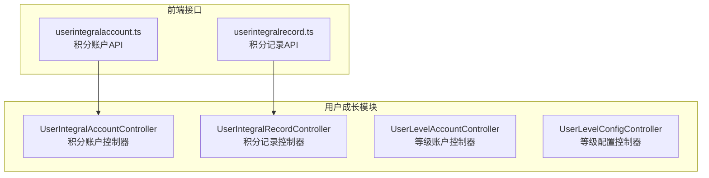
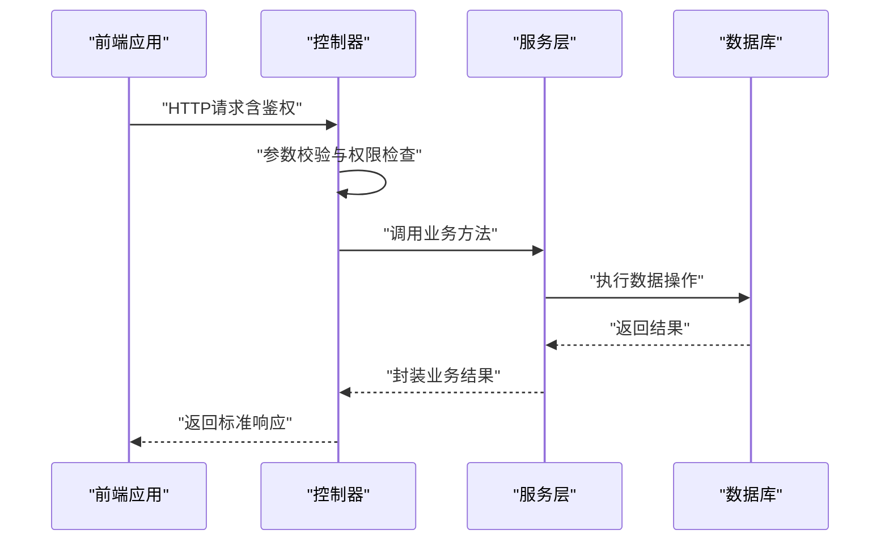
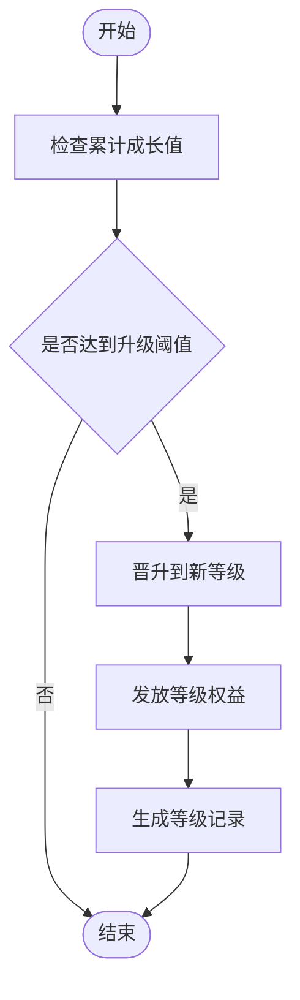
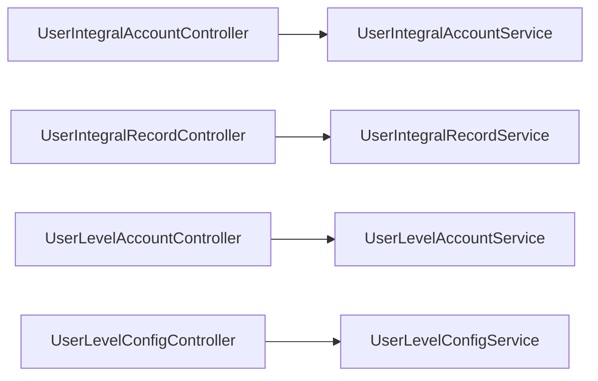

# 用户成长API

<cite>
**本文引用的文件**
- [UserIntegralAccountController.java](file://run-admin/src/main/java/com//fastproject/module/usergrowth/controller/UserIntegralAccountController.java)
- [UserIntegralRecordController.java](file://run-admin/src/main/java/com/ fastproject/module/usergrowth/controller/UserIntegralRecordController.java)
- [UserLevelAccountController.java](file://run-admin/src/main/java/com/ fastproject/module/usergrowth/controller/UserLevelAccountController.java)
- [UserLevelConfigController.java](file://run-admin/src/main/java/com/ fastproject/module/usergrowth/controller/UserLevelConfigController.java)
- [userintegralaccount.ts](file://fast-ui/apps/admin-vue/src/api/userGrowth/userintegralaccount.ts)
- [userintegralrecord.ts](file://fast-ui/apps/admin-vue/src/api/userGrowth/userintegralrecord.ts)
</cite>

## 目录
1. [简介](#简介)
2. [项目结构](#项目结构)
3. [核心组件](#核心组件)
4. [架构概览](#架构概览)
5. [详细组件分析](#详细组件分析)
6. [依赖关系分析](#依赖关系分析)
7. [性能考虑](#性能考虑)
8. [故障排除指南](#故障排除指南)
9. [结论](#结论)

## 简介
本文件为用户成长模块的完整API接口文档，涵盖积分系统、等级系统、用户成长等核心功能的RESTful API规范。文档面向后端开发者与前端对接人员，提供HTTP方法、URL路径、请求参数、响应格式及业务规则说明，并附带关键流程图与时序图帮助理解。

## 项目结构
用户成长模块位于独立的模块化工程中，采用分层架构设计：
- 控制器层：暴露RESTful API，负责接收请求、鉴权与调用服务层
- VO层：定义请求参数、查询条件与返回数据结构
- 服务层：实现业务逻辑与数据处理
- 模块入口：通过Spring Boot运行时加载模块并注册控制器

图表来源
- [UserIntegralAccountController.java](file://run-admin/src/main/java/com/ fastproject/module/usergrowth/controller/UserIntegralAccountController.java#L17-L62)
- [UserIntegralRecordController.java](file://run-admin/src/main/java/com/ fastproject/module/usergrowth/controller/UserIntegralRecordController.java#L17-L62)
- [UserLevelAccountController.java](file://run-admin/src/main/java/com/ fastproject/module/usergrowth/controller/UserLevelAccountController.java#L17-L62)
- [UserLevelConfigController.java](file://run-admin/src/main/java/com/ fastproject/module/usergrowth/controller/UserLevelConfigController.java#L17-L62)
- [userintegralaccount.ts](file://fast-ui/apps/admin-vue/src/api/userGrowth/userintegralaccount.ts#L1-L85)
- [userintegralrecord.ts](file://fast-ui/apps/admin-vue/src/api/userGrowth/userintegralrecord.ts#L68-L106)

章节来源
- [UserIntegralAccountController.java](file://run-admin/src/main/java/com/ fastproject/module/usergrowth/controller/UserIntegralAccountController.java#L1-L63)
- [UserIntegralRecordController.java](file://run-admin/src/main/java/com/ fastproject/module/usergrowth/controller/UserIntegralRecordController.java#L1-L63)
- [UserLevelAccountController.java](file://run-admin/src/main/java/com/ fastproject/module/usergrowth/controller/UserLevelAccountController.java#L1-L63)
- [UserLevelConfigController.java](file://run-admin/src/main/java/com/ fastproject/module/usergrowth/controller/UserLevelConfigController.java#L1-L63)

## 核心组件
本模块包含四个核心控制器，分别对应积分账户、积分记录、等级账户与等级配置的增删改查操作。每个控制器均遵循统一的RESTful风格，支持分页查询与批量删除，并通过权限注解进行访问控制。

- 积分账户控制器：提供积分账户的新增、修改、删除、批量删除、详情查询与分页查询
- 积分记录控制器：提供积分记录的新增、修改、删除、批量删除、详情查询与分页查询
- 等级账户控制器：提供等级账户的新增、修改、删除、批量删除、详情查询与分页查询
- 等级配置控制器：提供等级配置的新增、修改、删除、批量删除、详情查询与分页查询

章节来源
- [UserIntegralAccountController.java](file://run-admin/src/main/java/com/ fastproject/module/usergrowth/controller/UserIntegralAccountController.java#L17-L62)
- [UserIntegralRecordController.java](file://run-admin/src/main/java/com/ fastproject/module/usergrowth/controller/UserIntegralRecordController.java#L17-L62)
- [UserLevelAccountController.java](file://run-admin/src/main/java/com/ fastproject/module/usergrowth/controller/UserLevelAccountController.java#L17-L62)
- [UserLevelConfigController.java](file://run-admin/src/main/java/com/ fastproject/module/usergrowth/controller/UserLevelConfigController.java#L17-L62)

## 架构概览
用户成长模块采用前后端分离架构，前端通过Axios封装的API与后端控制器交互。控制器层负责权限校验与参数验证，随后调用对应的服务层完成业务处理。

图表来源
- [UserIntegralAccountController.java](file://run-admin/src/main/java/com/ fastproject/module/usergrowth/controller/UserIntegralAccountController.java#L24-L35)
- [UserIntegralRecordController.java](file://run-admin/src/main/java/com/ fastproject/module/usergrowth/controller/UserIntegralRecordController.java#L24-L35)
- [UserLevelAccountController.java](file://run-admin/src/main/java/com/ fastproject/module/usergrowth/controller/UserLevelAccountController.java#L24-L35)
- [UserLevelConfigController.java](file://run-admin/src/main/java/com/ fastproject/module/usergrowth/controller/UserLevelConfigController.java#L24-L35)

## 详细组件分析

### 积分账户API规范
- 基础路径：/usergrowth/userintegralaccount
- 权限前缀：usergrowth:userintegralaccount

接口一览
- 新增积分账户
  - 方法：POST
  - 路径：/usergrowth/userintegralaccount
  - 权限：usergrowth:userintegralaccount:add
  - 请求体：UserIntegralAccountCreate
  - 返回：ResultVo<Long>（主键ID）

- 修改积分账户
  - 方法：PUT
  - 路径：/usergrowth/userintegralaccount
  - 权限：usergrowth:userintegralaccount:update
  - 请求体：UserIntegralAccountUpdate
  - 返回：ResultVo<Void>

- 删除积分账户
  - 方法：DELETE
  - 路径：/usergrowth/userintegralaccount/{id}
  - 权限：usergrowth:userintegralaccount:delete
  - 参数：路径变量id（Long）
  - 返回：ResultVo<Void>

- 批量删除积分账户
  - 方法：DELETE
  - 路径：/usergrowth/userintegralaccount/batch
  - 权限：usergrowth:userintegralaccount:delete
  - 请求体：List<Long>（ids）
  - 返回：ResultVo<Void>

- 查询积分账户详情
  - 方法：GET
  - 路径：/usergrowth/userintegralaccount/{id}
  - 权限：usergrowth:userintegralaccount:query
  - 参数：路径变量id（Long）
  - 返回：ResultVo<UserIntegralAccountVo>

- 分页查询积分账户
  - 方法：POST
  - 路径：/usergrowth/userintegralaccount/page
  - 权限：usergrowth:userintegralaccount:query
  - 请求体：UserIntegralAccountQuery
  - 返回：ResultVo<PageVo<List<UserIntegralAccountVo>>>

请求参数与响应结构
- UserIntegralAccountCreate/Update：包含用户标识、成长值、状态等字段
- UserIntegralAccountQuery：包含分页参数与可选过滤条件（如用户标识、成长值、状态）
- UserIntegralAccountVo：包含账户主键、用户标识、成长值、状态等字段
- PageVo：包含data列表与total总数

章节来源
- [UserIntegralAccountController.java](file://run-admin/src/main/java/com/ fastproject/module/usergrowth/controller/UserIntegralAccountController.java#L24-L61)
- [userintegralaccount.ts](file://fast-ui/apps/admin-vue/src/api/userGrowth/userintegralaccount.ts#L10-L85)

### 积分记录API规范
- 基础路径：/usergrowth/userintegralrecord
- 权限前缀：usergrowth:userintegralrecord

接口一览
- 新增积分记录
  - 方法：POST
  - 路径：/usergrowth/userintegralrecord
  - 权限：usergrowth:userintegralrecord:add
  - 请求体：UserIntegralRecordCreate
  - 返回：ResultVo<Long>

- 修改积分记录
  - 方法：PUT
  - 路径：/usergrowth/userintegralrecord
  - 权限：usergrowth:userintegralrecord:update
  - 请求体：UserIntegralRecordUpdate
  - 返回：ResultVo<Void>

- 删除积分记录
  - 方法：DELETE
  - 路径：/usergrowth/userintegralrecord/{id}
  - 权限：usergrowth:userintegralrecord:delete
  - 参数：路径变量id（Long）
  - 返回：ResultVo<Void>

- 批量删除积分记录
  - 方法：DELETE
  - 路径：/usergrowth/userintegralrecord/batch
  - 权限：usergrowth:userintegralrecord:delete
  - 请求体：List<Long>（ids）
  - 返回：ResultVo<Void>

- 查询积分记录详情
  - 方法：GET
  - 路径：/usergrowth/userintegralrecord/{id}
  - 权限：usergrowth:userintegralrecord:query
  - 参数：路径变量id（Long）
  - 返回：ResultVo<UserIntegralRecordVo>

- 分页查询积分记录
  - 方法：POST
  - 路径：/usergrowth/userintegralrecord/page
  - 权限：usergrowth:userintegralrecord:query
  - 请求体：UserIntegralRecordQuery
  - 返回：ResultVo<PageVo<List<UserIntegralRecordVo>>>

请求参数与响应结构
- UserIntegralRecordCreate/Update：包含用户标识、变动类型、变动值、关联单据号等字段
- UserIntegralRecordQuery：包含分页参数与可选过滤条件
- UserIntegralRecordVo：包含记录主键、用户标识、变动类型、变动值、时间戳等字段

章节来源
- [UserIntegralRecordController.java](file://run-admin/src/main/java/com/ fastproject/module/usergrowth/controller/UserIntegralRecordController.java#L24-L61)
- [userintegralrecord.ts](file://fast-ui/apps/admin-vue/src/api/userGrowth/userintegralrecord.ts#L68-L106)

### 等级账户API规范
- 基础路径：/usergrowth/userlevelaccount
- 权限前缀：usergrowth:userlevelaccount

接口一览
- 新增等级账户
  - 方法：POST
  - 路径：/usergrowth/userlevelaccount
  - 权限：usergrowth:userlevelaccount:add
  - 请求体：UserLevelAccountCreate
  - 返回：ResultVo<Long>

- 修改等级账户
  - 方法：PUT
  - 路径：/usergrowth/userlevelaccount
  - 权限：usergrowth:userlevelaccount:update
  - 请求体：UserLevelAccountUpdate
  - 返回：ResultVo<Void>

- 删除等级账户
  - 方法：DELETE
  - 路径：/usergrowth/userlevelaccount/{id}
  - 权限：usergrowth:userlevelaccount:delete
  - 参数：路径变量id（Long）
  - 返回：ResultVo<Void>

- 批量删除等级账户
  - 方法：DELETE
  - 路径：/usergrowth/userlevelaccount/batch
  - 权限：usergrowth:userlevelaccount:delete
  - 请求体：List<Long>（ids）
  - 返回：ResultVo<Void>

- 查询等级账户详情
  - 方法：GET
  - 路径：/usergrowth/userlevelaccount/{id}
  - 权限：usergrowth:userlevelaccount:query
  - 参数：路径变量id（Long）
  - 返回：ResultVo<UserLevelAccountVo>

- 分页查询等级账户
  - 方法：POST
  - 路径：/usergrowth/userlevelaccount/page
  - 权限：usergrowth:userlevelaccount:query
  - 请求体：UserLevelAccountQuery
  - 返回：ResultVo<PageVo<List<UserLevelAccountVo>>>

请求参数与响应结构
- UserLevelAccountCreate/Update：包含用户标识、当前等级、累计成长值、状态等字段
- UserLevelAccountQuery：包含分页参数与可选过滤条件
- UserLevelAccountVo：包含账户主键、用户标识、当前等级、累计成长值、状态等字段

章节来源
- [UserLevelAccountController.java](file://run-admin/src/main/java/com/ fastproject/module/usergrowth/controller/UserLevelAccountController.java#L24-L61)

### 等级配置API规范
- 基础路径：/usergrowth/userlevelconfig
- 权限前缀：usergrowth:userlevelconfig

接口一览
- 新增等级配置
  - 方法：POST
  - 路径：/usergrowth/userlevelconfig
  - 权限：usergrowth:userlevelconfig:add
  - 请求体：UserLevelConfigCreate
  - 返回：ResultVo<Long>

- 修改等级配置
  - 方法：PUT
  - 路径：/usergrowth/userlevelconfig
  - 权限：usergrowth:userlevelconfig:update
  - 请求体：UserLevelConfigUpdate
  - 返回：ResultVo<Void>

- 删除等级配置
  - 方法：DELETE
  - 路径：/usergrowth/userlevelconfig/{id}
  - 权限：usergrowth:userlevelconfig:delete
  - 参数：路径变量id（Long）
  - 返回：ResultVo<Void>

- 批量删除等级配置
  - 方法：DELETE
  - 路径：/usergrowth/userlevelconfig/batch
  - 权限：usergrowth:userlevelconfig:delete
  - 请求体：List<Long>（ids）
  - 返回：ResultVo<Void>

- 查询等级配置详情
  - 方法：GET
  - 路径：/usergrowth/userlevelconfig/{id}
  - 权限：usergrowth:userlevelconfig:query
  - 参数：路径变量id（Long）
  - 返回：ResultVo<UserLevelConfigVo>

- 分页查询等级配置
  - 方法：POST
  - 路径：/usergrowth/userlevelconfig/page
  - 权限：usergrowth:userlevelconfig:query
  - 请求体：UserLevelConfigQuery
  - 返回：ResultVo<PageVo<List<UserLevelConfigVo>>>

请求参数与响应结构
- UserLevelConfigCreate/Update：包含等级编号、所需成长值阈值、等级名称等字段
- UserLevelConfigQuery：包含分页参数与可选过滤条件
- UserLevelConfigVo：包含配置主键、等级编号、阈值、等级名称等字段

章节来源
- [UserLevelConfigController.java](file://run-admin/src/main/java/com/ fastproject/module/usergrowth/controller/UserLevelConfigController.java#L24-L61)

### 数据模型与业务规则（概念性说明）
以下为用户成长系统的通用业务规则与数据模型说明，便于理解API背后的业务含义：

- 成长值与积分的关系
  - 成长值用于驱动等级晋升，积分用于权益兑换或抵扣
  - 积分变动需记录明细，便于审计与对账

- 等级晋升条件
  - 当累计成长值达到某等级阈值时晋升至新等级
  - 可设置多等级阶梯，不同等级享有差异化权益

- 权益发放机制
  - 达到特定等级或里程碑时自动发放权益
  - 权益发放需幂等处理，避免重复发放

- 记录与审计
  - 所有积分变动与等级变更均应生成记录
  - 记录包含操作人、时间、变更前/后值、原因等信息

## 依赖关系分析
- 控制器依赖服务层：各控制器通过构造函数注入对应服务，实现业务编排
- 权限控制：使用Spring Security的@PreAuthorize注解，基于权限字符串进行访问控制
- 参数校验：使用@Validated对请求体进行参数校验，确保数据合法性
- 统一响应：返回ResultVo封装统一的响应结构，包含状态码、数据与消息

图表来源
- [UserIntegralAccountController.java](file://run-admin/src/main/java/com/ fastproject/module/usergrowth/controller/UserIntegralAccountController.java#L22)
- [UserIntegralRecordController.java](file://run-admin/src/main/java/com/ fastproject/module/usergrowth/controller/UserIntegralRecordController.java#L22)
- [UserLevelAccountController.java](file://run-admin/src/main/java/com/ fastproject/module/usergrowth/controller/UserLevelAccountController.java#L22)
- [UserLevelConfigController.java](file://run-admin/src/main/java/com/ fastproject/module/usergrowth/controller/UserLevelConfigController.java#L22)

章节来源
- [UserIntegralAccountController.java](file://run-admin/src/main/java/com/ fastproject/module/usergrowth/controller/UserIntegralAccountController.java#L10-L15)
- [UserIntegralRecordController.java](file://run-admin/src/main/java/com/ fastproject/module/usergrowth/controller/UserIntegralRecordController.java#L10-L15)
- [UserLevelAccountController.java](file://run-admin/src/main/java/com/ fastproject/module/usergrowth/controller/UserLevelAccountController.java#L10-L15)
- [UserLevelConfigController.java](file://run-admin/src/main/java/com/ fastproject/module/usergrowth/controller/UserLevelConfigController.java#L10-L15)

## 性能考虑
- 分页查询：建议前端传入合理的pageSize，避免一次性返回大量数据
- 批量操作：批量删除与批量更新可减少网络往返，但需注意事务边界与错误回滚
- 缓存策略：对于只读配置类数据（如等级配置），可引入缓存以降低数据库压力
- 幂等设计：积分变动与等级晋升需保证幂等，防止重复触发权益发放

## 故障排除指南
- 权限不足
  - 现象：返回403或无权限提示
  - 处理：确认用户是否具备相应权限字符串（如usergrowth:userintegralaccount:add）

- 参数校验失败
  - 现象：返回参数校验错误
  - 处理：检查请求体字段类型与必填项，确保符合VO定义

- 主键不存在
  - 现象：查询或更新时返回空或异常
  - 处理：确认id是否存在，或检查软删除标记

- 幂等冲突
  - 现象：重复提交导致权益重复发放
  - 处理：前端在提交时携带请求ID（如x-request-id），后端进行幂等校验

## 结论
用户成长模块提供了完善的积分与等级体系API，覆盖从账户管理到配置维护的全链路能力。通过统一的权限控制、参数校验与响应格式，确保了接口的安全性与一致性。建议在实际接入时结合业务规则完善前端校验与错误处理，并在生产环境启用缓存与幂等保障机制。