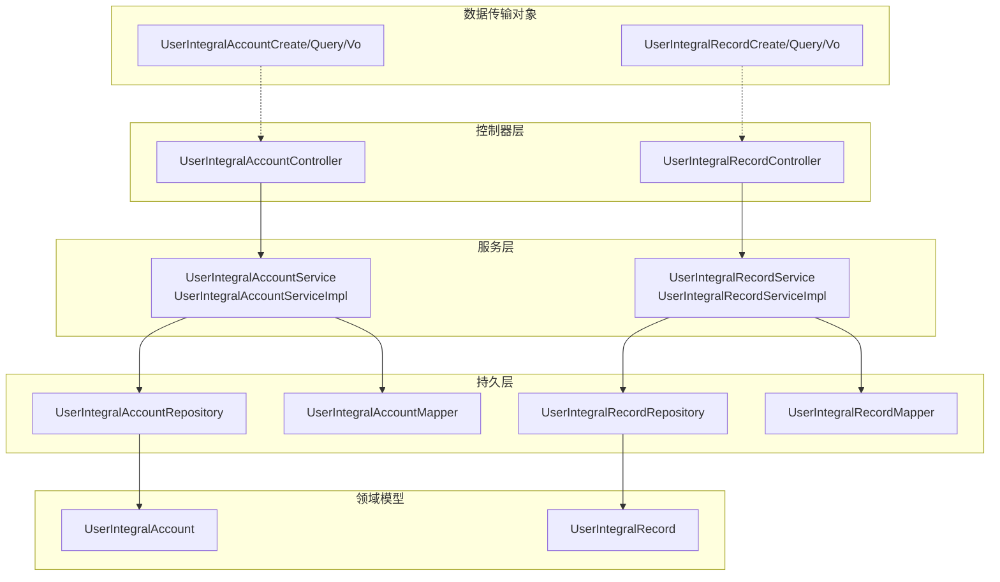
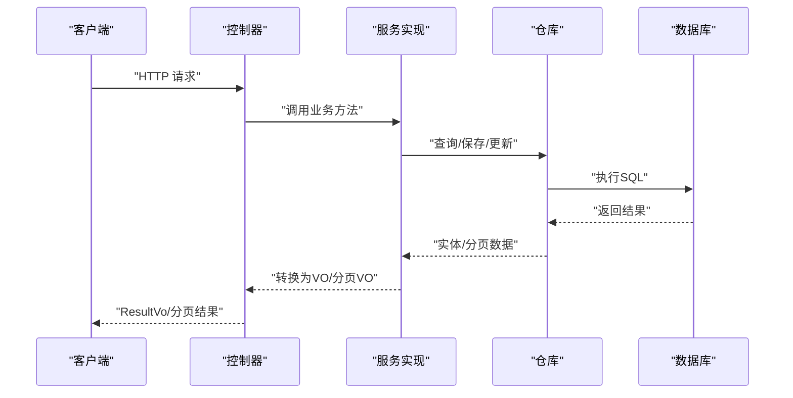
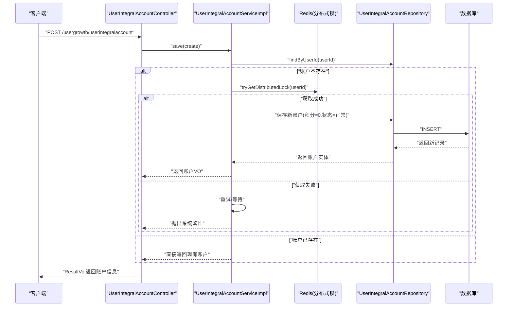
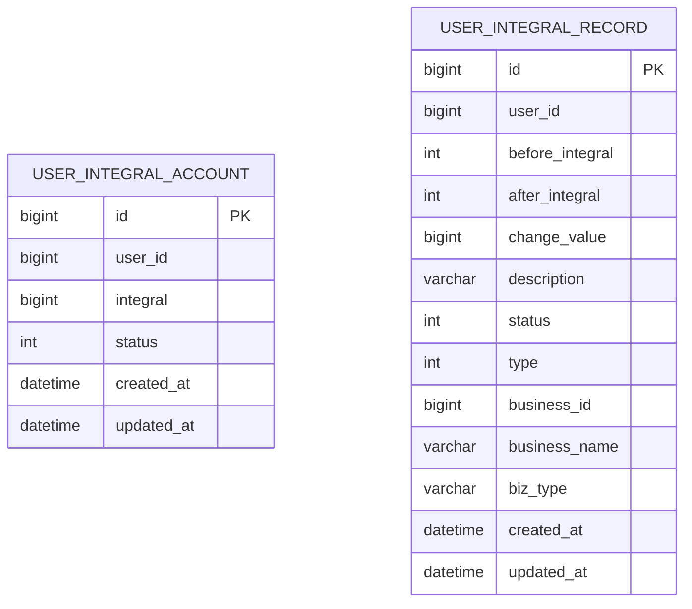
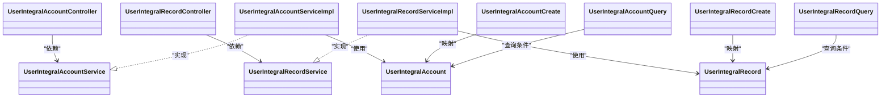

# 用户积分API

<cite>
**本文档引用的文件**
- [UserIntegralAccountController.java](file://run-admin/src/main/java/com/fastproject/module/usergrowth/controller/UserIntegralAccountController.java)
- [UserIntegralRecordController.java](file://run-admin/src/main/java/com/fastproject/module/usergrowth/controller/UserIntegralRecordController.java)
- [UserIntegralAccount.java](file://user-growth-module/src/main/java/com/fastproject/usergrowth/domain/UserIntegralAccount.java)
- [UserIntegralRecord.java](file://user-growth-module/src/main/java/com/fastproject/usergrowth/domain/UserIntegralRecord.java)
- [UserIntegralAccountCreate.java](file://user-growth-module/src/main/java/com/fastproject/usergrowth/vo/integralaccount/UserIntegralAccountCreate.java)
- [UserIntegralAccountQuery.java](file://user-growth-module/src/main/java/com/fastproject/usergrowth/vo/integralaccount/UserIntegralAccountQuery.java)
- [UserIntegralRecordCreate.java](file://user-growth-module/src/main/java/com/fastproject/usergrowth/vo/integralrecord/UserIntegralRecordCreate.java)
- [UserIntegralRecordQuery.java](file://user-growth-module/src/main/java/com/fastproject/usergrowth/vo/integralrecord/UserIntegralRecordQuery.java)
- [UserIntegralAccountService.java](file://user-growth-module/src/main/java/com/fastproject/usergrowth/service/UserIntegralAccountService.java)
- [UserIntegralRecordService.java](file://user-growth-module/src/main/java/com/fastproject/usergrowth/service/UserIntegralRecordService.java)
- [UserIntegralAccountServiceImpl.java](file://user-growth-module/src/main/java/com/fastproject/usergrowth/service/impl/UserIntegralAccountServiceImpl.java)
- [UserIntegralRecordServiceImpl.java](file://user-growth-module/src/main/java/com/fastproject/usergrowth/service/impl/UserIntegralRecordServiceImpl.java)
- [UserGrowthApi.java](file://user-growth-api/src/main/java/com/fastproject/usergrowth/api/UserGrowthApi.java)
</cite>

## 目录
1. [简介](#简介)
2. [项目结构](#项目结构)
3. [核心组件](#核心组件)
4. [架构总览](#架构总览)
5. [详细组件分析](#详细组件分析)
6. [依赖关系分析](#依赖关系分析)
7. [性能考虑](#性能考虑)
8. [故障排除指南](#故障排除指南)
9. [结论](#结论)

## 简介
本文件为用户积分系统的完整API接口文档，覆盖积分账户管理与积分记录查询两大核心功能。文档面向前后端开发者与测试人员，提供RESTful API的HTTP方法、URL路径、请求参数、响应格式及业务规则说明，并对数据模型、权限控制、错误处理与性能优化进行深入解析。

## 项目结构
用户积分系统位于独立的模块中，采用典型的分层架构：
- 控制器层：对外暴露REST API，负责权限校验与请求转发
- 服务层：封装业务逻辑，处理幂等与分布式锁
- 持久层：基于JPA/Hibernate，提供实体映射与查询帮助类
- VO/DTO：定义请求与响应的数据结构
- API接口：对外暴露统一的业务能力入口

图表来源
- [UserIntegralAccountController.java](file://run-admin/src/main/java/com/fastproject/module/usergrowth/controller/UserIntegralAccountController.java#L17-L62)
- [UserIntegralRecordController.java](file://run-admin/src/main/java/com/fastproject/module/usergrowth/controller/UserIntegralRecordController.java#L17-L62)
- [UserIntegralAccountServiceImpl.java](file://user-growth-module/src/main/java/com/fastproject/usergrowth/service/impl/UserIntegralAccountServiceImpl.java#L30-L148)
- [UserIntegralRecordServiceImpl.java](file://user-growth-module/src/main/java/com/fastproject/usergrowth/service/impl/UserIntegralRecordServiceImpl.java#L28-L114)
- [UserIntegralAccount.java](file://user-growth-module/src/main/java/com/fastproject/usergrowth/domain/UserIntegralAccount.java#L11-L33)
- [UserIntegralRecord.java](file://user-growth-module/src/main/java/com/fastproject/usergrowth/domain/UserIntegralRecord.java#L12-L69)

章节来源
- [UserIntegralAccountController.java](file://run-admin/src/main/java/com/fastproject/module/usergrowth/controller/UserIntegralAccountController.java#L1-L63)
- [UserIntegralRecordController.java](file://run-admin/src/main/java/com/fastproject/module/usergrowth/controller/UserIntegralRecordController.java#L1-L63)

## 核心组件
- 控制器：提供积分账户与积分记录的增删改查与分页查询接口
- 服务：封装业务规则（如账户创建的分布式锁、分页查询条件组装）
- 实体：映射数据库表结构，包含软删除与状态字段
- VO/DTO：定义请求参数与返回结果的数据结构
- 权限：基于注解的权限控制，确保操作安全

章节来源
- [UserIntegralAccountService.java](file://user-growth-module/src/main/java/com/fastproject/usergrowth/service/UserIntegralAccountService.java#L11-L26)
- [UserIntegralRecordService.java](file://user-growth-module/src/main/java/com/fastproject/usergrowth/service/UserIntegralRecordService.java#L11-L24)
- [UserIntegralAccount.java](file://user-growth-module/src/main/java/com/fastproject/usergrowth/domain/UserIntegralAccount.java#L1-L34)
- [UserIntegralRecord.java](file://user-growth-module/src/main/java/com/fastproject/usergrowth/domain/UserIntegralRecord.java#L1-L70)

## 架构总览
用户积分系统遵循经典的MVC+分层架构，控制器接收HTTP请求，调用服务层执行业务逻辑，服务层通过仓库与映射器访问数据库，最终返回标准响应。

图表来源
- [UserIntegralAccountController.java](file://run-admin/src/main/java/com/fastproject/module/usergrowth/controller/UserIntegralAccountController.java#L24-L61)
- [UserIntegralRecordController.java](file://run-admin/src/main/java/com/fastproject/module/usergrowth/controller/UserIntegralRecordController.java#L24-L61)
- [UserIntegralAccountServiceImpl.java](file://user-growth-module/src/main/java/com/fastproject/usergrowth/service/impl/UserIntegralAccountServiceImpl.java#L40-L97)
- [UserIntegralRecordServiceImpl.java](file://user-growth-module/src/main/java/com/fastproject/usergrowth/service/impl/UserIntegralRecordServiceImpl.java#L75-L112)

## 详细组件分析

### 用户积分账户 API

- 基础路径
  - 路径前缀：/usergrowth/userintegralaccount
  - 权限前缀：usergrowth:userintegralaccount

- 接口列表

  - 新增积分账户
    - 方法：POST
    - 路径：/usergrowth/userintegralaccount
    - 权限：usergrowth:userintegralaccount:add
    - 请求体：UserIntegralAccountCreate
      - 字段：userId（用户ID）、integral（初始积分）、status（状态）
    - 响应：ResultVo<Long>（返回新增记录ID）

  - 修改积分账户
    - 方法：PUT
    - 路径：/usergrowth/userintegralaccount
    - 权限：usergrowth:userintegralaccount:update
    - 请求体：UserIntegralAccountUpdate
    - 响应：ResultVo<Void>

  - 删除积分账户
    - 方法：DELETE
    - 路径：/usergrowth/userintegralaccount/{id}
    - 权限：usergrowth:userintegralaccount:delete
    - 路径参数：id（账户ID）
    - 响应：ResultVo<Void>

  - 批量删除积分账户
    - 方法：DELETE
    - 路径：/usergrowth/userintegralaccount/batch
    - 权限：usergrowth:userintegralaccount:delete
    - 请求体：List<Long>（账户ID列表）
    - 响应：ResultVo<Void>

  - 查询单个积分账户
    - 方法：GET
    - 路径：/usergrowth/userintegralaccount/{id}
    - 权限：usergrowth:userintegralaccount:query
    - 路径参数：id（账户ID）
    - 响应：ResultVo<UserIntegralAccountVo>

  - 分页查询积分账户
    - 方法：POST
    - 路径：/usergrowth/userintegralaccount/page
    - 权限：usergrowth:userintegralaccount:query
    - 请求体：UserIntegralAccountQuery
      - 支持过滤：userId、status
    - 响应：ResultVo<PageVo<List<UserIntegralAccountVo>>>

- 关键业务规则
  - 账户创建幂等性：通过分布式锁保证同一用户仅创建一个账户，避免并发重复创建
  - 软删除：实体使用软删除策略，查询默认过滤已删除记录
  - 状态枚举：状态字段支持正常/禁用两种状态

- 数据模型与字段说明
  - 实体字段：userId（用户标识）、integral（积分余额）、status（账户状态）
  - VO/DTO：包含上述字段，用于请求与响应

- 错误处理
  - 更新/删除不存在的数据时抛出业务异常
  - 分布式锁获取失败或重试耗尽时抛出“系统繁忙”提示

图表来源
- [UserIntegralAccountController.java](file://run-admin/src/main/java/com/fastproject/module/usergrowth/controller/UserIntegralAccountController.java#L24-L28)
- [UserIntegralAccountServiceImpl.java](file://user-growth-module/src/main/java/com/fastproject/usergrowth/service/impl/UserIntegralAccountServiceImpl.java#L99-L147)

章节来源
- [UserIntegralAccountController.java](file://run-admin/src/main/java/com/fastproject/module/usergrowth/controller/UserIntegralAccountController.java#L24-L61)
- [UserIntegralAccountServiceImpl.java](file://user-growth-module/src/main/java/com/fastproject/usergrowth/service/impl/UserIntegralAccountServiceImpl.java#L40-L147)
- [UserIntegralAccountCreate.java](file://user-growth-module/src/main/java/com/fastproject/usergrowth/vo/integralaccount/UserIntegralAccountCreate.java#L1-L26)
- [UserIntegralAccountQuery.java](file://user-growth-module/src/main/java/com/fastproject/usergrowth/vo/integralaccount/UserIntegralAccountQuery.java#L1-L24)
- [UserIntegralAccount.java](file://user-growth-module/src/main/java/com/fastproject/usergrowth/domain/UserIntegralAccount.java#L1-L34)

### 用户积分记录 API

- 基础路径
  - 路径前缀：/usergrowth/userintegralrecord
  - 权限前缀：usergrowth:userintegralrecord

- 接口列表

  - 新增积分记录
    - 方法：POST
    - 路径：/usergrowth/userintegralrecord
    - 权限：usergrowth:userintegralrecord:add
    - 请求体：UserIntegralRecordCreate
      - 字段：userId、beforeIntegral、afterIntegral、changeValue、description、status、type、businessId、businessName、bizType
    - 响应：ResultVo<Long>

  - 修改积分记录
    - 方法：PUT
    - 路径：/usergrowth/userintegralrecord
    - 权限：usergrowth:userintegralrecord:update
    - 请求体：UserIntegralRecordUpdate
    - 响应：ResultVo<Void>

  - 删除积分记录
    - 方法：DELETE
    - 路径：/usergrowth/userintegralrecord/{id}
    - 权限：usergrowth:userintegralrecord:delete
    - 路径参数：id
    - 响应：ResultVo<Void>

  - 批量删除积分记录
    - 方法：DELETE
    - 路径：/usergrowth/userintegralrecord/batch
    - 权限：usergrowth:userintegralrecord:delete
    - 请求体：List<Long>
    - 响应：ResultVo<Void>

  - 查询单条积分记录
    - 方法：GET
    - 路径：/usergrowth/userintegralrecord/{id}
    - 权限：usergrowth:userintegralrecord:query
    - 路径参数：id
    - 响应：ResultVo<UserIntegralRecordVo>

  - 分页查询积分记录
    - 方法：POST
    - 路径：/usergrowth/userintegralrecord/page
    - 权限：usergrowth:userintegralrecord:query
    - 请求体：UserIntegralRecordQuery
      - 支持过滤：userId、changeValue、description、status、type、businessId、businessName、bizType
    - 响应：ResultVo<PageVo<List<UserIntegralRecordVo>>>

- 关键业务规则
  - 记录变更：记录交易前/后的积分值与变更量，便于审计与对账
  - 业务关联：支持记录业务ID、业务名称与业务类型，便于溯源
  - 查询灵活：支持多字段模糊匹配与精确匹配组合查询

```mermaid
flowchart TD
Start(["进入分页查询"]) --> BuildSpec["构建查询条件"]
BuildSpec --> FilterUserId{"是否指定用户ID?"}
FilterUserId --> |是| AddUserId["添加用户ID相等条件"]
FilterUserId --> |否| Next1["跳过"]
AddUserId --> Next1
Next1 --> FilterChange{"是否指定变更值?"}
FilterChange --> |是| AddChange["添加变更值相等条件"]
FilterChange --> |否| Next2["跳过"]
AddChange --> Next2
Next2 --> FilterDesc{"是否指定描述?"}
FilterDesc --> |是| AddLikeDesc["添加描述模糊匹配"]
FilterDesc --> |否| Next3["跳过"]
AddLikeDesc --> Next3
Next3 --> FilterStatus{"是否指定状态?"}
FilterStatus --> |是| AddStatus["添加状态相等条件"]
FilterStatus --> |否| Next4["跳过"]
AddStatus --> Next4
Next4 --> FilterType{"是否指定类型?"}
FilterType --> |是| AddType["添加类型相等条件"]
FilterType --> |否| Next5["跳过"]
AddType --> Next5
Next5 --> FilterBizId{"是否指定业务ID?"}
FilterBizId --> |是| AddBizId["添加业务ID相等条件"]
FilterBizId --> |否| Next6["跳过"]
AddBizId --> Next6
Next6 --> FilterBizName{"是否指定业务名称?"}
FilterBizName --> |是| AddLikeBizName["添加业务名称模糊匹配"]
FilterBizName --> |否| Next7["跳过"]
AddLikeBizName --> Next7
Next7 --> FilterBizType{"是否指定业务类型?"}
FilterBizType --> |是| AddLikeBizType["添加业务类型模糊匹配"]
FilterBizType --> |否| EndSkip["结束"]
AddLikeBizType --> EndSkip
EndSkip --> ExecQuery["执行查询并分页"]
ExecQuery --> Return["返回分页结果"]
```

图表来源
- [UserIntegralRecordServiceImpl.java](file://user-growth-module/src/main/java/com/fastproject/usergrowth/service/impl/UserIntegralRecordServiceImpl.java#L75-L112)
- [UserIntegralRecordQuery.java](file://user-growth-module/src/main/java/com/fastproject/usergrowth/vo/integralrecord/UserIntegralRecordQuery.java#L1-L54)

章节来源
- [UserIntegralRecordController.java](file://run-admin/src/main/java/com/fastproject/module/usergrowth/controller/UserIntegralRecordController.java#L24-L61)
- [UserIntegralRecordServiceImpl.java](file://user-growth-module/src/main/java/com/fastproject/usergrowth/service/impl/UserIntegralRecordServiceImpl.java#L37-L112)
- [UserIntegralRecordCreate.java](file://user-growth-module/src/main/java/com/fastproject/usergrowth/vo/integralrecord/UserIntegralRecordCreate.java#L1-L62)
- [UserIntegralRecordQuery.java](file://user-growth-module/src/main/java/com/fastproject/usergrowth/vo/integralrecord/UserIntegralRecordQuery.java#L1-L54)
- [UserIntegralRecord.java](file://user-growth-module/src/main/java/com/fastproject/usergrowth/domain/UserIntegralRecord.java#L1-L70)

### 数据模型与枚举

图表来源
- [UserIntegralAccount.java](file://user-growth-module/src/main/java/com/fastproject/usergrowth/domain/UserIntegralAccount.java#L11-L33)
- [UserIntegralRecord.java](file://user-growth-module/src/main/java/com/fastproject/usergrowth/domain/UserIntegralRecord.java#L12-L69)

章节来源
- [UserIntegralAccount.java](file://user-growth-module/src/main/java/com/fastproject/usergrowth/domain/UserIntegralAccount.java#L1-L34)
- [UserIntegralRecord.java](file://user-growth-module/src/main/java/com/fastproject/usergrowth/domain/UserIntegralRecord.java#L1-L70)

### 权限与安全
- 控制器使用基于表达式的权限注解，确保只有具备相应权限的用户才能访问对应接口
- 建议在网关或中间件层统一鉴权，控制器侧仅做细粒度权限校验

章节来源
- [UserIntegralAccountController.java](file://run-admin/src/main/java/com/fastproject/module/usergrowth/controller/UserIntegralAccountController.java#L24-L48)
- [UserIntegralRecordController.java](file://run-admin/src/main/java/com/fastproject/module/usergrowth/controller/UserIntegralRecordController.java#L24-L48)

## 依赖关系分析

图表来源
- [UserIntegralAccountController.java](file://run-admin/src/main/java/com/fastproject/module/usergrowth/controller/UserIntegralAccountController.java#L3-L22)
- [UserIntegralRecordController.java](file://run-admin/src/main/java/com/fastproject/module/usergrowth/controller/UserIntegralRecordController.java#L3-L22)
- [UserIntegralAccountService.java](file://user-growth-module/src/main/java/com/fastproject/usergrowth/service/UserIntegralAccountService.java#L11-L26)
- [UserIntegralRecordService.java](file://user-growth-module/src/main/java/com/fastproject/usergrowth/service/UserIntegralRecordService.java#L11-L24)
- [UserIntegralAccountServiceImpl.java](file://user-growth-module/src/main/java/com/fastproject/usergrowth/service/impl/UserIntegralAccountServiceImpl.java#L30-L33)
- [UserIntegralRecordServiceImpl.java](file://user-growth-module/src/main/java/com/fastproject/usergrowth/service/impl/UserIntegralRecordServiceImpl.java#L28-L31)

章节来源
- [UserIntegralAccountController.java](file://run-admin/src/main/java/com/fastproject/module/usergrowth/controller/UserIntegralAccountController.java#L1-L63)
- [UserIntegralRecordController.java](file://run-admin/src/main/java/com/fastproject/module/usergrowth/controller/UserIntegralRecordController.java#L1-L63)
- [UserIntegralAccountService.java](file://user-growth-module/src/main/java/com/fastproject/usergrowth/service/UserIntegralAccountService.java#L1-L27)
- [UserIntegralRecordService.java](file://user-growth-module/src/main/java/com/fastproject/usergrowth/service/UserIntegralRecordService.java#L1-L25)

## 性能考虑
- 分页查询：默认按主键降序，建议在高频查询场景下为常用过滤字段建立索引（如userId、status、bizType等）
- 幂等与锁：账户创建使用分布式锁，避免并发重复创建；建议合理设置锁超时时间与重试间隔
- 缓存策略：可结合业务场景引入缓存（如热点账户信息），注意与数据库的一致性
- 日志与监控：服务层已记录关键日志，建议接入统一链路追踪与指标监控

## 故障排除指南
- “数据不存在”异常：更新或删除时若目标记录不存在会抛出业务异常，需确认ID正确性
- “系统繁忙，请稍后再试”：分布式锁获取失败或重试耗尽，建议稍后重试或检查Redis可用性
- 分页查询无结果：确认过滤条件是否过于严格，或是否存在软删除导致的隐藏数据

章节来源
- [UserIntegralAccountServiceImpl.java](file://user-growth-module/src/main/java/com/fastproject/usergrowth/service/impl/UserIntegralAccountServiceImpl.java#L52-L55)
- [UserIntegralAccountServiceImpl.java](file://user-growth-module/src/main/java/com/fastproject/usergrowth/service/impl/UserIntegralAccountServiceImpl.java#L134-L146)
- [UserIntegralRecordServiceImpl.java](file://user-growth-module/src/main/java/com/fastproject/usergrowth/service/impl/UserIntegralRecordServiceImpl.java#L49-L52)

## 结论
用户积分系统提供了完善的积分账户与积分记录管理能力，具备良好的扩展性与安全性。通过清晰的分层设计与严格的权限控制，能够满足日常运营与风控需求。建议在生产环境中配合缓存、索引与监控体系，持续优化查询性能与稳定性。