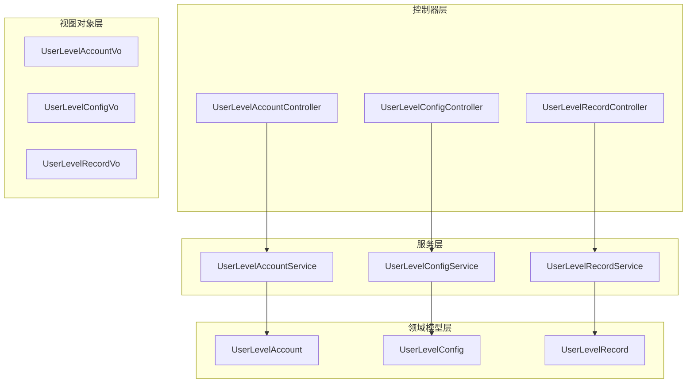
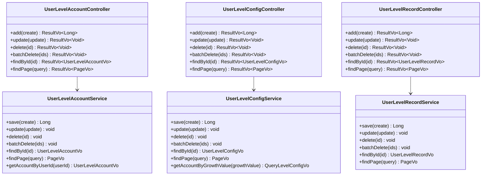
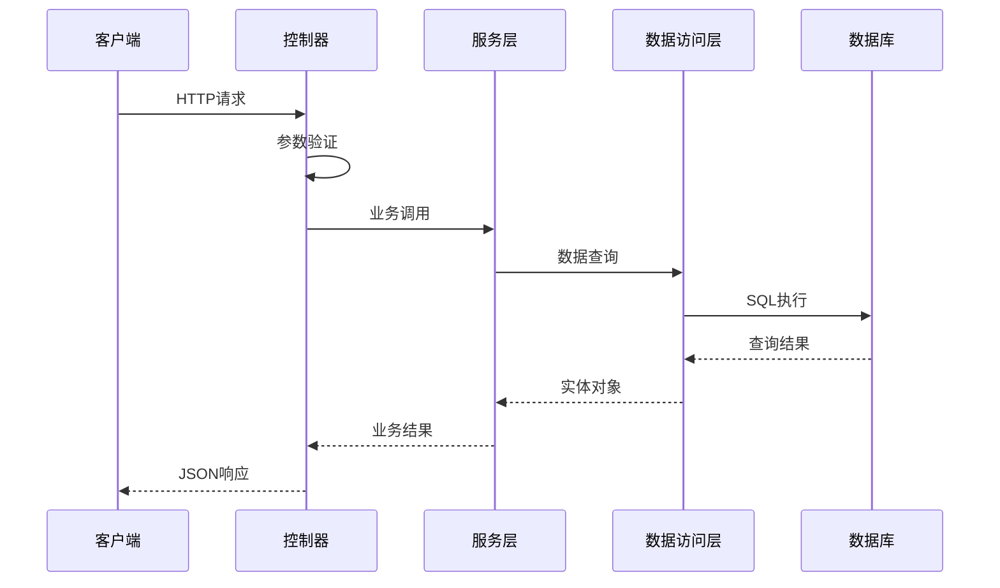
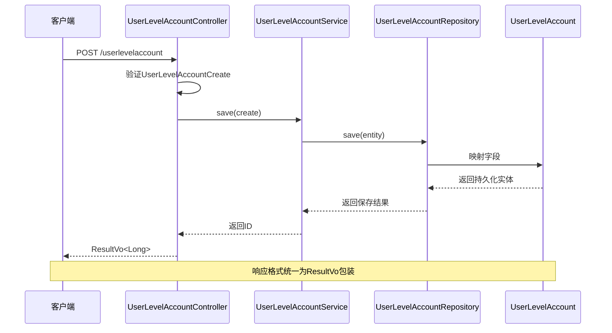
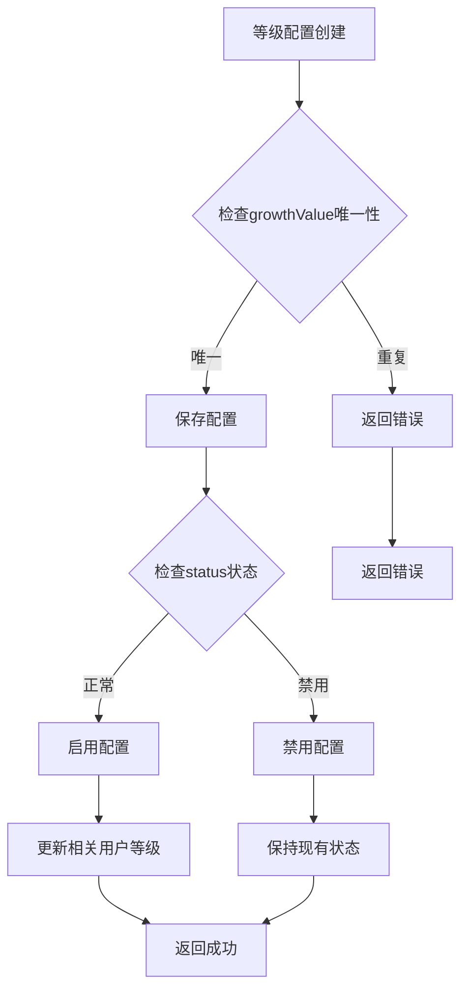
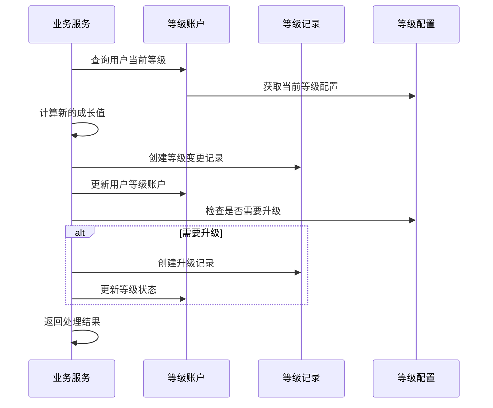
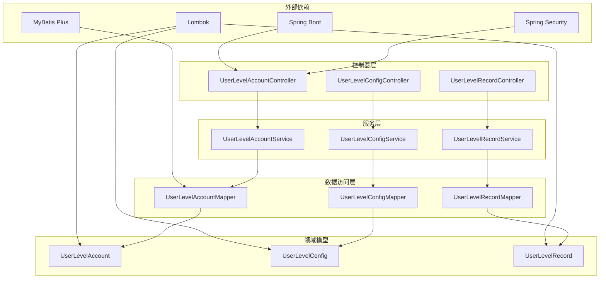

# 用户等级API

<cite>
**本文档引用的文件**
- [UserLevelAccountController.java](file://run-admin/src/main/java/com/fastproject/module/usergrowth/controller/UserLevelAccountController.java)
- [UserLevelConfigController.java](file://run-admin/src/main/java/com/fastproject/module/usergrowth/controller/UserLevelConfigController.java)
- [UserLevelRecordController.java](file://run-admin/src/main/java/com/fastproject/module/usergrowth/controller/UserLevelRecordController.java)
- [UserLevelAccountService.java](file://user-growth-module/src/main/java/com/fastproject/usergrowth/service/UserLevelAccountService.java)
- [UserLevelConfigService.java](file://user-growth-module/src/main/java/com/fastproject/usergrowth/service/UserLevelConfigService.java)
- [UserLevelRecordService.java](file://user-growth-module/src/main/java/com/fastproject/usergrowth/service/UserLevelRecordService.java)
- [UserLevelAccountCreate.java](file://user-growth-module/src/main/java/com/fastproject/usergrowth/vo/levelaccount/UserLevelAccountCreate.java)
- [UserLevelAccountVo.java](file://user-growth-module/src/main/java/com/fastproject/usergrowth/vo/levelaccount/UserLevelAccountVo.java)
- [UserLevelConfigCreate.java](file://user-growth-module/src/main/java/com/fastproject/usergrowth/vo/levelconfig/UserLevelConfigCreate.java)
- [UserLevelConfigVo.java](file://user-growth-module/src/main/java/com/fastproject/usergrowth/vo/levelconfig/UserLevelConfigVo.java)
- [UserLevelRecordCreate.java](file://user-growth-module/src/main/java/com/fastproject/usergrowth/vo/levelrecord/UserLevelRecordCreate.java)
- [UserLevelAccount.java](file://user-growth-module/src/main/java/com/fastproject/usergrowth/domain/UserLevelAccount.java)
- [UserLevelConfig.java](file://user-growth-module/src/main/java/com/fastproject/usergrowth/domain/UserLevelConfig.java)
- [UserLevelRecord.java](file://user-growth-module/src/main/java/com/fastproject/usergrowth/domain/UserLevelRecord.java)
</cite>

## 目录
1. [简介](#简介)
2. [项目结构](#项目结构)
3. [核心组件](#核心组件)
4. [架构概览](#架构概览)
5. [详细组件分析](#详细组件分析)
6. [依赖关系分析](#依赖关系分析)
7. [性能考虑](#性能考虑)
8. [故障排除指南](#故障排除指南)
9. [结论](#结论)

## 简介

用户等级系统是Fast项目中的一个核心功能模块，负责管理用户的等级账户、等级配置和等级记录。该系统提供了完整的RESTful API接口，支持等级账户的创建、查询、更新和删除操作，以及等级配置的管理和等级晋升记录的追踪。

系统采用分层架构设计，包括控制器层、服务层、数据访问层和领域模型层。通过权限控制机制确保API的安全性，支持批量操作和分页查询功能。

## 项目结构

用户等级系统主要分布在以下目录结构中：

**图表来源**
- [UserLevelAccountController.java](file://run-admin/src/main/java/com/fastproject/module/usergrowth/controller/UserLevelAccountController.java#L17-L62)
- [UserLevelConfigController.java](file://run-admin/src/main/java/com/fastproject/module/usergrowth/controller/UserLevelConfigController.java#L17-L35)
- [UserLevelRecordController.java](file://run-admin/src/main/java/com/fastproject/module/usergrowth/controller/UserLevelRecordController.java#L17-L63)

**章节来源**
- [UserLevelAccountController.java](file://run-admin/src/main/java/com/fastproject/module/usergrowth/controller/UserLevelAccountController.java#L1-L62)
- [UserLevelConfigController.java](file://run-admin/src/main/java/com/fastproject/module/usergrowth/controller/UserLevelConfigController.java#L1-L35)
- [UserLevelRecordController.java](file://run-admin/src/main/java/com/fastproject/module/usergrowth/controller/UserLevelRecordController.java#L1-L63)

## 核心组件

用户等级系统包含三个核心控制器，每个都提供完整的CRUD操作：

### 控制器层次结构

**图表来源**
- [UserLevelAccountController.java](file://run-admin/src/main/java/com/fastproject/module/usergrowth/controller/UserLevelAccountController.java#L20-L62)
- [UserLevelConfigController.java](file://run-admin/src/main/java/com/fastproject/module/usergrowth/controller/UserLevelConfigController.java#L20-L35)
- [UserLevelRecordController.java](file://run-admin/src/main/java/com/fastproject/module/usergrowth/controller/UserLevelRecordController.java#L20-L63)
- [UserLevelAccountService.java](file://user-growth-module/src/main/java/com/fastproject/usergrowth/service/UserLevelAccountService.java#L11-L27)
- [UserLevelConfigService.java](file://user-growth-module/src/main/java/com/fastproject/usergrowth/service/UserLevelConfigService.java#L8-L24)
- [UserLevelRecordService.java](file://user-growth-module/src/main/java/com/fastproject/usergrowth/service/UserLevelRecordService.java#L11-L25)

**章节来源**
- [UserLevelAccountService.java](file://user-growth-module/src/main/java/com/fastproject/usergrowth/service/UserLevelAccountService.java#L1-L27)
- [UserLevelConfigService.java](file://user-growth-module/src/main/java/com/fastproject/usergrowth/service/UserLevelConfigService.java#L1-L24)
- [UserLevelRecordService.java](file://user-growth-module/src/main/java/com/fastproject/usergrowth/service/UserLevelRecordService.java#L1-L25)

## 架构概览

用户等级系统采用经典的MVC架构模式，实现了清晰的职责分离：

**图表来源**
- [UserLevelAccountController.java](file://run-admin/src/main/java/com/fastproject/module/usergrowth/controller/UserLevelAccountController.java#L24-L28)
- [UserLevelAccountService.java](file://user-growth-module/src/main/java/com/fastproject/usergrowth/service/UserLevelAccountService.java#L13-L13)

系统的核心特性包括：
- **权限控制**：使用Spring Security注解进行细粒度权限管理
- **批量操作**：支持批量删除和批量处理功能
- **分页查询**：提供高效的分页数据检索
- **软删除**：实现逻辑删除而非物理删除
- **数据验证**：基于Bean Validation的参数验证

## 详细组件分析

### 用户等级账户管理API

#### 接口定义

| 方法 | URL路径 | 权限标识 | 功能描述 |
|------|---------|----------|----------|
| POST | `/usergrowth/userlevelaccount` | `usergrowth:userlevelaccount:add` | 创建等级账户 |
| PUT | `/usergrowth/userlevelaccount` | `usergrowth:userlevelaccount:update` | 更新等级账户 |
| DELETE | `/usergrowth/userlevelaccount/{id}` | `usergrowth:userlevelaccount:delete` | 删除单个等级账户 |
| DELETE | `/usergrowth/userlevelaccount/batch` | `usergrowth:userlevelaccount:delete` | 批量删除等级账户 |
| GET | `/usergrowth/userlevelaccount/{id}` | `usergrowth:userlevelaccount:query` | 获取等级账户详情 |
| POST | `/usergrowth/userlevelaccount/page` | `usergrowth:userlevelaccount:query` | 分页查询等级账户 |

#### 请求参数规范

**创建请求参数 (UserLevelAccountCreate)**

| 字段名 | 类型 | 必填 | 描述 | 约束 |
|--------|------|------|------|------|
| userId | Long | 是 | 用户ID | > 0 |
| growthValue | Long | 否 | 等级积分/成长值 | >= 0 |
| status | Integer | 否 | 状态 (1-正常, 2-禁用) | 1或2 |
| avatar | String | 否 | 个性图标 | 最大长度255字符 |
| avatarFrame | String | 否 | 个性头像框 | 最大长度255字符 |

**查询请求参数 (UserLevelAccountQuery)**

| 字段名 | 类型 | 必填 | 描述 | 约束 |
|--------|------|------|------|------|
| page | Integer | 是 | 页码 | >= 1 |
| pageSize | Integer | 是 | 每页大小 | 1-100 |
| userId | Long | 否 | 用户ID | > 0 |
| growthValue | Long | 否 | 等级积分 | >= 0 |
| status | Integer | 否 | 状态 | 1或2 |
| avatar | String | 否 | 个性图标 | 最大长度255字符 |
| avatarFrame | String | 否 | 个性头像框 | 最大长度255字符 |

**响应数据结构 (UserLevelAccountVo)**

| 字段名 | 类型 | 描述 | 示例 |
|--------|------|------|------|
| id | Long | 主键ID | 123 |
| userId | Long | 用户ID | 456 |
| growthValue | Long | 等级积分/成长值 | 1000 |
| status | Integer | 状态 (1-正常, 2-禁用) | 1 |
| avatar | String | 个性图标 | "avatar.png" |
| avatarFrame | String | 个性头像框 | "frame.png" |
| createTime | LocalDateTime | 创建时间 | "2024-01-01T12:00:00" |
| updateTime | LocalDateTime | 更新时间 | "2024-01-01T12:00:00" |

#### API调用流程

**图表来源**
- [UserLevelAccountController.java](file://run-admin/src/main/java/com/fastproject/module/usergrowth/controller/UserLevelAccountController.java#L24-L28)
- [UserLevelAccountService.java](file://user-growth-module/src/main/java/com/fastproject/usergrowth/service/UserLevelAccountService.java#L13-L13)
- [UserLevelAccountCreate.java](file://user-growth-module/src/main/java/com/fastproject/usergrowth/vo/levelaccount/UserLevelAccountCreate.java#L9-L35)

**章节来源**
- [UserLevelAccountController.java](file://run-admin/src/main/java/com/fastproject/module/usergrowth/controller/UserLevelAccountController.java#L24-L61)
- [UserLevelAccountCreate.java](file://user-growth-module/src/main/java/com/fastproject/usergrowth/vo/levelaccount/UserLevelAccountCreate.java#L1-L36)
- [UserLevelAccountVo.java](file://user-growth-module/src/main/java/com/fastproject/usergrowth/vo/levelaccount/UserLevelAccountVo.java#L1-L52)

### 用户等级配置管理API

#### 接口定义

| 方法 | URL路径 | 权限标识 | 功能描述 |
|------|---------|----------|----------|
| POST | `/usergrowth/userlevelconfig` | `usergrowth:userlevelconfig:add` | 创建等级配置 |
| PUT | `/usergrowth/userlevelconfig` | `usergrowth:userlevelconfig:update` | 更新等级配置 |
| DELETE | `/usergrowth/userlevelconfig/{id}` | `usergrowth:userlevelconfig:delete` | 删除单个等级配置 |
| DELETE | `/usergrowth/userlevelconfig/batch` | `usergrowth:userlevelconfig:delete` | 批量删除等级配置 |
| GET | `/usergrowth/userlevelconfig/{id}` | `usergrowth:userlevelconfig:query` | 获取等级配置详情 |
| POST | `/usergrowth/userlevelconfig/page` | `usergrowth:userlevelconfig:query` | 分页查询等级配置 |

#### 请求参数规范

**创建请求参数 (UserLevelConfigCreate)**

| 字段名 | 类型 | 必填 | 描述 | 约束 |
|--------|------|------|------|------|
| title | String | 是 | 标题 | 最大长度100字符 |
| icon | String | 否 | 图标 | 最大长度255字符 |
| growthValue | Long | 是 | 成长值积分 | >= 0 |
| status | Integer | 否 | 数据状态 (1-正常, 2-禁用) | 1或2 |
| background | String | 否 | 背景 | 最大长度255字符 |
| color | String | 否 | 颜色 | 最大长度50字符 |
| description | String | 否 | 描述 | TEXT类型 |

**查询请求参数 (UserLevelConfigQuery)**

| 字段名 | 类型 | 必填 | 描述 | 约束 |
|--------|------|------|------|------|
| page | Integer | 是 | 页码 | >= 1 |
| pageSize | Integer | 是 | 每页大小 | 1-100 |
| title | String | 否 | 标题 | 最大长度100字符 |
| icon | String | 否 | 图标 | 最大长度255字符 |
| growthValue | Long | 否 | 成长值积分 | >= 0 |
| status | Integer | 否 | 数据状态 | 1或2 |
| background | String | 否 | 背景 | 最大长度255字符 |
| color | String | 否 | 颜色 | 最大长度50字符 |
| description | String | 否 | 描述 | TEXT类型 |

**响应数据结构 (UserLevelConfigVo)**

| 字段名 | 类型 | 描述 | 示例 |
|--------|------|------|------|
| id | Long | 主键ID | 123 |
| title | String | 标题 | "VIP会员" |
| icon | String | 图标 | "vip-icon.png" |
| growthValue | Long | 成长值积分 | 1000 |
| status | Integer | 数据状态 (1-正常, 2-禁用) | 1 |
| background | String | 背景 | "#ff0000" |
| color | String | 颜色 | "red" |
| description | String | 描述 | "高级会员特权" |
| createTime | LocalDateTime | 创建时间 | "2024-01-01T12:00:00" |
| updateTime | LocalDateTime | 更新时间 | "2024-01-01T12:00:00" |

#### 等级配置业务规则

**图表来源**
- [UserLevelConfigService.java](file://user-growth-module/src/main/java/com/fastproject/usergrowth/service/UserLevelConfigService.java#L10-L10)
- [UserLevelConfigCreate.java](file://user-growth-module/src/main/java/com/fastproject/usergrowth/vo/levelconfig/UserLevelConfigCreate.java#L10-L46)

**章节来源**
- [UserLevelConfigController.java](file://run-admin/src/main/java/com/fastproject/module/usergrowth/controller/UserLevelConfigController.java#L24-L35)
- [UserLevelConfigCreate.java](file://user-growth-module/src/main/java/com/fastproject/usergrowth/vo/levelconfig/UserLevelConfigCreate.java#L1-L47)
- [UserLevelConfigVo.java](file://user-growth-module/src/main/java/com/fastproject/usergrowth/vo/levelconfig/UserLevelConfigVo.java#L1-L62)

### 用户等级记录查询API

#### 接口定义

| 方法 | URL路径 | 权限标识 | 功能描述 |
|------|---------|----------|----------|
| POST | `/usergrowth/userlevelrecord` | `usergrowth:userlevelrecord:add` | 创建等级记录 |
| PUT | `/usergrowth/userlevelrecord` | `usergrowth:userlevelrecord:update` | 更新等级记录 |
| DELETE | `/usergrowth/userlevelrecord/{id}` | `usergrowth:userlevelrecord:delete` | 删除单个等级记录 |
| DELETE | `/usergrowth/userlevelrecord/batch` | `usergrowth:userlevelrecord:delete` | 批量删除等级记录 |
| GET | `/usergrowth/userlevelrecord/{id}` | `usergrowth:userlevelrecord:query` | 获取等级记录详情 |
| POST | `/usergrowth/userlevelrecord/page` | `usergrowth:userlevelrecord:query` | 分页查询等级记录 |

#### 请求参数规范

**创建请求参数 (UserLevelRecordCreate)**

| 字段名 | 类型 | 必填 | 描述 | 约束 |
|--------|------|------|------|------|
| userId | Long | 是 | 用户ID | > 0 |
| beforeGrowthValue | Integer | 是 | 交易前成长值 | >= 0 |
| afterGrowthValue | Integer | 是 | 交易后成长值 | >= 0 |
| changeValue | Long | 是 | 变更成长值 | >= 0 |
| description | String | 否 | 说明 | TEXT类型 |
| status | Integer | 否 | 状态 (1-正常, 2-禁用) | 1或2 |
| type | Integer | 否 | 类型 | 整数类型 |
| businessId | Long | 否 | 业务ID | >= 0 |
| businessName | String | 否 | 业务名称 | 最大长度255字符 |
| bizType | String | 否 | 业务类型 | 最大长度100字符 |

**查询请求参数 (UserLevelRecordQuery)**

| 字段名 | 类型 | 必填 | 描述 | 约束 |
|--------|------|------|------|------|
| page | Integer | 是 | 页码 | >= 1 |
| pageSize | Integer | 是 | 每页大小 | 1-100 |
| userId | Long | 否 | 用户ID | > 0 |
| businessId | Long | 否 | 业务ID | >= 0 |
| bizType | String | 否 | 业务类型 | 最大长度100字符 |
| status | Integer | 否 | 状态 | 1或2 |

**响应数据结构 (UserLevelRecordVo)**

| 字段名 | 类型 | 描述 | 示例 |
|--------|------|------|------|
| id | Long | 主键ID | 123 |
| userId | Long | 用户ID | 456 |
| beforeGrowthValue | Integer | 交易前成长值 | 1000 |
| afterGrowthValue | Integer | 交易后成长值 | 1500 |
| changeValue | Long | 变更成长值 | 500 |
| description | String | 说明 | "订单奖励" |
| status | Integer | 状态 (1-正常, 2-禁用) | 1 |
| type | Integer | 类型 | 1 |
| businessId | Long | 业务ID | 789 |
| businessName | String | 业务名称 | "订单系统" |
| bizType | String | 业务类型 | "ORDER" |
| createTime | LocalDateTime | 创建时间 | "2024-01-01T12:00:00" |
| updateTime | LocalDateTime | 更新时间 | "2024-01-01T12:00:00" |

#### 等级记录业务流程

**图表来源**
- [UserLevelRecordService.java](file://user-growth-module/src/main/java/com/fastproject/usergrowth/service/UserLevelRecordService.java#L13-L13)
- [UserLevelRecordCreate.java](file://user-growth-module/src/main/java/com/fastproject/usergrowth/vo/levelrecord/UserLevelRecordCreate.java#L10-L61)

**章节来源**
- [UserLevelRecordController.java](file://run-admin/src/main/java/com/fastproject/module/usergrowth/controller/UserLevelRecordController.java#L24-L61)
- [UserLevelRecordCreate.java](file://user-growth-module/src/main/java/com/fastproject/usergrowth/vo/levelrecord/UserLevelRecordCreate.java#L1-L62)

## 依赖关系分析

用户等级系统的依赖关系体现了清晰的分层架构：

**图表来源**
- [UserLevelAccountController.java](file://run-admin/src/main/java/com/fastproject/module/usergrowth/controller/UserLevelAccountController.java#L3-L13)
- [UserLevelConfigController.java](file://run-admin/src/main/java/com/fastproject/module/usergrowth/controller/UserLevelConfigController.java#L3-L13)
- [UserLevelRecordController.java](file://run-admin/src/main/java/com/fastproject/module/usergrowth/controller/UserLevelRecordController.java#L3-L13)

系统的关键依赖特性：
- **Spring Security集成**：提供基于注解的权限控制
- **MyBatis Plus**：简化数据访问层开发
- **Lombok**：减少样板代码
- **分层架构**：清晰的职责分离

**章节来源**
- [UserLevelAccount.java](file://user-growth-module/src/main/java/com/fastproject/usergrowth/domain/UserLevelAccount.java#L1-L45)
- [UserLevelConfig.java](file://user-growth-module/src/main/java/com/fastproject/usergrowth/domain/UserLevelConfig.java#L1-L57)
- [UserLevelRecord.java](file://user-growth-module/src/main/java/com/fastproject/usergrowth/domain/UserLevelRecord.java#L1-L71)

## 性能考虑

用户等级系统在设计时充分考虑了性能优化：

### 缓存策略
- **等级配置缓存**：热门等级配置可缓存到Redis
- **用户等级缓存**：频繁查询的用户等级信息缓存
- **批量操作优化**：批量删除和批量更新使用事务处理

### 数据库优化
- **索引设计**：在userId、growthValue等常用查询字段建立索引
- **分页查询**：默认限制每页最大100条记录
- **软删除**：使用deleted字段而非物理删除，便于数据恢复

### 并发控制
- **乐观锁**：使用版本号防止并发更新冲突
- **分布式锁**：关键业务场景使用Redis分布式锁
- **异步处理**：等级变更通知等耗时操作异步执行

## 故障排除指南

### 常见问题及解决方案

**权限相关错误**
- **现象**：返回403 Forbidden
- **原因**：用户缺少相应权限
- **解决**：检查用户角色权限配置

**参数验证错误**
- **现象**：返回400 Bad Request
- **原因**：请求参数不符合验证规则
- **解决**：检查必填字段和数据类型

**数据库约束错误**
- **现象**：返回500 Internal Server Error
- **原因**：违反数据库约束条件
- **解决**：检查唯一性约束和外键关系

### 日志监控

系统提供完善的日志记录：
- **请求日志**：记录所有API请求的详细信息
- **业务日志**：记录关键业务操作
- **异常日志**：捕获并记录系统异常

**章节来源**
- [UserLevelAccountController.java](file://run-admin/src/main/java/com/fastproject/module/usergrowth/controller/UserLevelAccountController.java#L25-L25)
- [UserLevelConfigController.java](file://run-admin/src/main/java/com/fastproject/module/usergrowth/controller/UserLevelConfigController.java#L26-L26)
- [UserLevelRecordController.java](file://run-admin/src/main/java/com/fastproject/module/usergrowth/controller/UserLevelRecordController.java#L27-L27)

## 结论

用户等级系统是一个设计完善、功能完整的业务模块，具有以下特点：

**技术优势**
- 清晰的分层架构设计
- 完善的权限控制机制
- 支持批量操作和分页查询
- 统一的响应格式规范

**业务价值**
- 提供完整的等级管理体系
- 支持灵活的等级配置
- 记录详细的等级变更历史
- 便于后续扩展和维护

**扩展建议**
- 增加等级统计报表功能
- 实现等级自动计算引擎
- 添加等级特权管理系统
- 优化大数据量下的查询性能

该系统为Fast项目提供了坚实的用户等级管理基础，能够满足大多数业务场景下的等级管理需求。