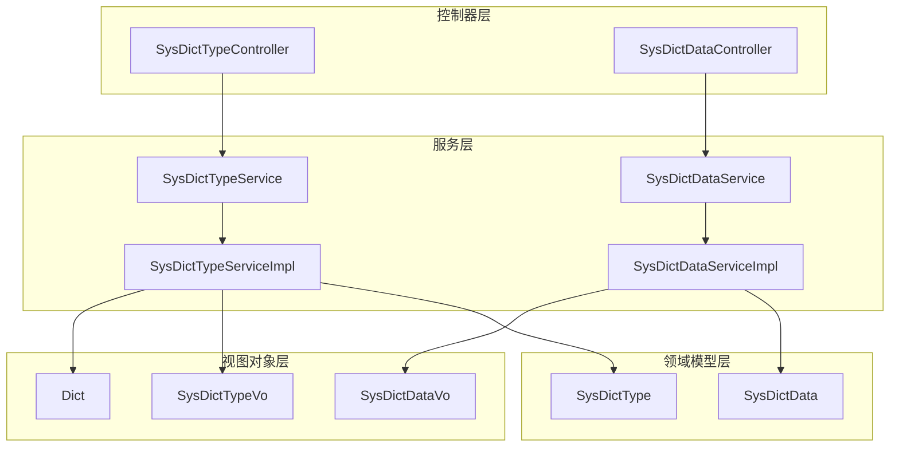
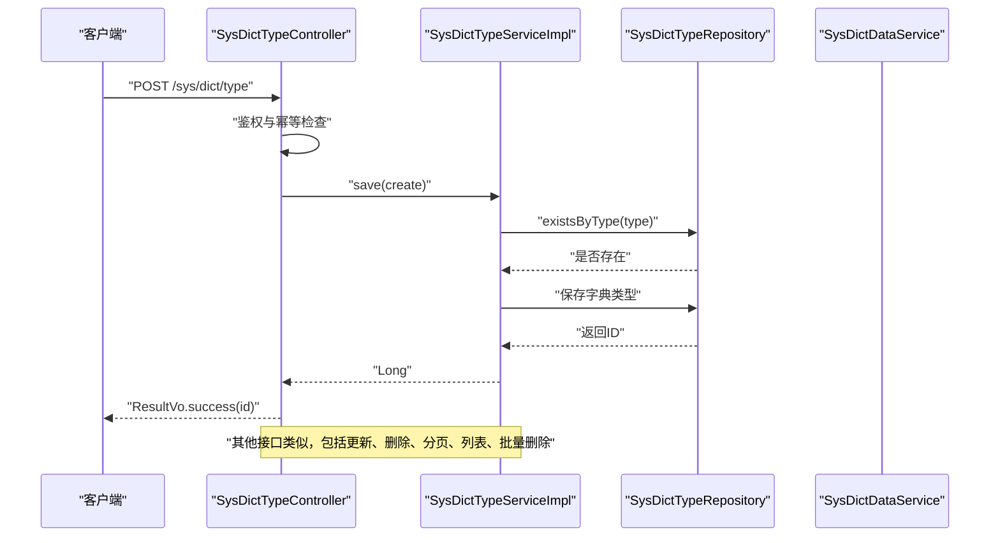
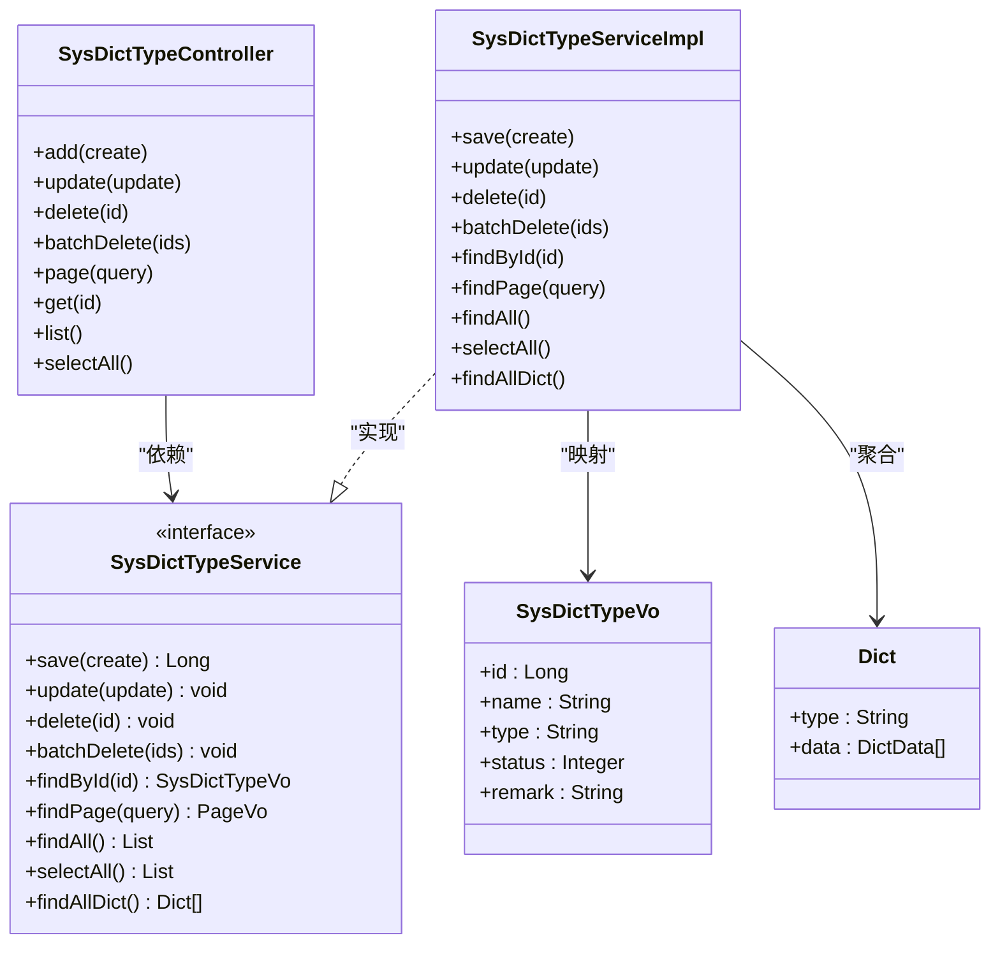
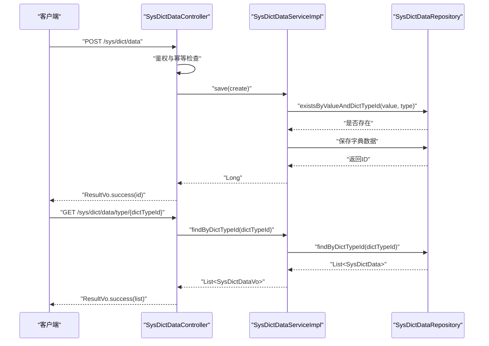
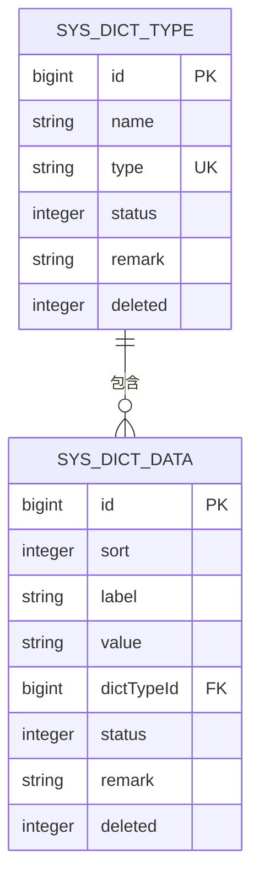
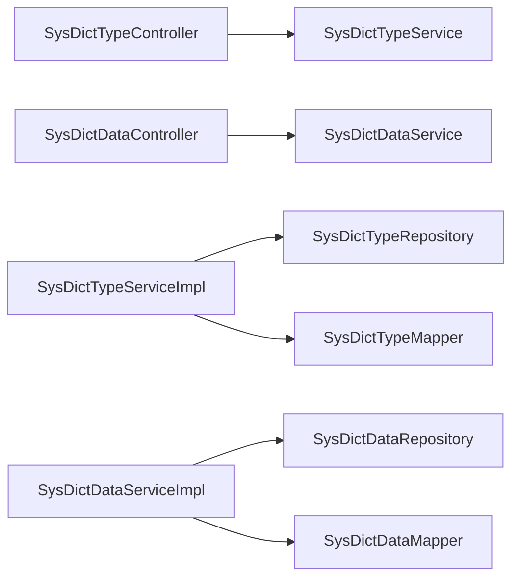

# 字典配置API

<cite>
**本文档引用的文件**
- [SysDictTypeController.java](file://run-admin/src/main/java/com/fastproject/module/system/controller/SysDictTypeController.java)
- [SysDictDataController.java](file://run-admin/src/main/java/com/fastproject/module/system/controller/SysDictDataController.java)
- [SysDictTypeService.java](file://system-module/src/main/java/com/fastproject/system/service/SysDictTypeService.java)
- [SysDictDataService.java](file://system-module/src/main/java/com/fastproject/system/service/SysDictDataService.java)
- [SysDictTypeServiceImpl.java](file://system-module/src/main/java/com/fastproject/system/service/impl/SysDictTypeServiceImpl.java)
- [SysDictDataServiceImpl.java](file://system-module/src/main/java/com/fastproject/system/service/impl/SysDictDataServiceImpl.java)
- [SysDictType.java](file://system-module/src/main/java/com/fastproject/system/domain/SysDictType.java)
- [SysDictData.java](file://system-module/src/main/java/com/fastproject/system/domain/SysDictData.java)
- [SysDictTypeVo.java](file://system-module/src/main/java/com/fastproject/system/vo/dicttype/SysDictTypeVo.java)
- [SysDictDataVo.java](file://system-module/src/main/java/com/fastproject/system/vo/dictdata/SysDictDataVo.java)
- [Dict.java](file://system-module/src/main/java/com/fastproject/system/vo/dictdata/Dict.java)
</cite>

## 目录
1. [简介](#简介)
2. [项目结构](#项目结构)
3. [核心组件](#核心组件)
4. [架构总览](#架构总览)
5. [详细组件分析](#详细组件分析)
6. [依赖关系分析](#依赖关系分析)
7. [性能考虑](#性能考虑)
8. [故障排查指南](#故障排查指南)
9. [结论](#结论)
10. [附录](#附录)

## 简介
本文件为系统字典配置管理模块的详细API文档，覆盖字典类型与字典数据的全生命周期管理，包括CRUD操作、分页查询、批量操作、状态控制、排序配置等。同时说明字典数据的分类管理、缓存策略、热更新机制以及数据一致性保障方案，并提供接口调用示例与最佳实践建议。

## 项目结构
字典配置模块采用典型的分层架构：
- 控制器层：提供RESTful接口，负责请求接收、鉴权与日志记录
- 服务层：定义业务接口与实现，处理业务逻辑与事务控制
- 领域模型层：字典类型与字典数据的实体定义
- 视图对象层：用于接口返回的轻量级数据传输对象

图表来源
- [SysDictTypeController.java](file://run-admin/src/main/java/com/forceproject/module/system/controller/SysDictTypeController.java#L23-L110)
- [SysDictDataController.java](file://run-admin/src/main/java/com/forceproject/module/system/controller/SysDictDataController.java#L23-L102)
- [SysDictTypeService.java](file://system-module/src/main/java/com/forceproject/system/service/SysDictTypeService.java#L15-L62)
- [SysDictDataService.java](file://system-module/src/main/java/com/forceproject/system/service/SysDictDataService.java#L14-L51)
- [SysDictTypeServiceImpl.java](file://system-module/src/main/java/com/forceproject/system/service/impl/SysDictTypeServiceImpl.java#L41-L180)
- [SysDictDataServiceImpl.java](file://system-module/src/main/java/com/forceproject/system/service/impl/SysDictDataServiceImpl.java#L32-L125)
- [SysDictType.java](file://system-module/src/main/java/com/forceproject/system/domain/SysDictType.java#L20-L42)
- [SysDictData.java](file://system-module/src/main/java/com/forceproject/system/domain/SysDictData.java#L20-L52)

章节来源
- [SysDictTypeController.java](file://run-admin/src/main/java/com/forceproject/module/system/controller/SysDictTypeController.java#L23-L110)
- [SysDictDataController.java](file://run-admin/src/main/java/com/forceproject/module/system/controller/SysDictDataController.java#L23-L102)
- [SysDictTypeService.java](file://system-module/src/main/java/com/forceproject/system/service/SysDictTypeService.java#L15-L62)
- [SysDictDataService.java](file://system-module/src/main/java/com/forceproject/system/service/SysDictDataService.java#L14-L51)

## 核心组件
- 字典类型控制器：提供字典类型的增删改查、分页、列表查询、批量删除等接口
- 字典数据控制器：提供字典数据的增删改查、分页、按类型查询、批量删除等接口
- 字典类型服务接口与实现：封装字典类型业务逻辑，包含唯一性校验、分页查询、状态筛选、全量字典聚合
- 字典数据服务接口与实现：封装字典数据业务逻辑，包含唯一性校验、分页查询、按类型查询
- 领域模型：SysDictType与SysDictData，定义字段与软删除策略
- 视图对象：SysDictTypeVo、SysDictDataVo、Dict，用于接口返回与前端展示

章节来源
- [SysDictTypeController.java](file://run-admin/src/main/java/com/forceproject/module/system/controller/SysDictTypeController.java#L23-L110)
- [SysDictDataController.java](file://run-admin/src/main/java/com/forceproject/module/system/controller/SysDictDataController.java#L23-L102)
- [SysDictTypeService.java](file://system-module/src/main/java/com/forceproject/system/service/SysDictTypeService.java#L15-L62)
- [SysDictDataService.java](file://system-module/src/main/java/com/forceproject/system/service/SysDictDataService.java#L14-L51)
- [SysDictTypeServiceImpl.java](file://system-module/src/main/java/com/forceproject/system/service/impl/SysDictTypeServiceImpl.java#L41-L180)
- [SysDictDataServiceImpl.java](file://system-module/src/main/java/com/forceproject/system/service/impl/SysDictDataServiceImpl.java#L32-L125)
- [SysDictType.java](file://system-module/src/main/java/com/forceproject/system/domain/SysDictType.java#L20-L42)
- [SysDictData.java](file://system-module/src/main/java/com/forceproject/system/domain/SysDictData.java#L20-L52)
- [SysDictTypeVo.java](file://system-module/src/main/java/com/forceproject/system/vo/dicttype/SysDictTypeVo.java#L8-L36)
- [SysDictDataVo.java](file://system-module/src/main/java/com/forceproject/system/vo/dictdata/SysDictDataVo.java#L8-L46)
- [Dict.java](file://system-module/src/main/java/com/forceproject/system/vo/dictdata/Dict.java#L7-L19)

## 架构总览
字典配置模块遵循分层架构，控制器负责HTTP协议与权限控制，服务层负责业务规则与事务管理，仓储层负责数据持久化。系统通过软删除与状态字段实现数据的可恢复与可控展示。

图表来源
- [SysDictTypeController.java](file://run-admin/src/main/java/com/forceproject/module/system/controller/SysDictTypeController.java#L33-L82)
- [SysDictTypeServiceImpl.java](file://system-module/src/main/java/com/forceproject/system/service/impl/SysDictTypeServiceImpl.java#L49-L125)

## 详细组件分析

### 字典类型管理API
- 基础路径：/sys/dict/type
- 权限标识：基于注解进行权限控制，如添加、修改、删除、分页等

接口定义
- 新增字典类型
  - 方法：POST
  - 路径：/sys/dict/type
  - 请求体：SysDictTypeCreate
  - 返回：ResultVo<Long>
  - 权限：admin:system:dict:type:add
  - 幂等：使用Idempotent注解，防止重复提交
  - 日志：业务日志，动作类型CREATE

- 修改字典类型
  - 方法：PUT
  - 路径：/sys/dict/type
  - 请求体：SysDictTypeUpdate
  - 返回：ResultVo<Void>
  - 权限：admin:system:dict:type:update
  - 幂等：使用Idempotent注解
  - 日志：业务日志，动作类型UPDATE

- 删除字典类型
  - 方法：DELETE
  - 路径：/sys/dict/type/{id}
  - 参数：id(Long)
  - 返回：ResultVo<Void>
  - 权限：admin:system:dict:type:delete
  - 日志：业务日志，动作类型DELETE

- 批量删除字典类型
  - 方法：DELETE
  - 路径：/sys/dict/type/batch
  - 请求体：List<Long>
  - 返回：ResultVo<Void>
  - 权限：admin:system:dict:type:delete
  - 日志：业务日志，动作类型DELETE

- 分页查询字典类型
  - 方法：POST
  - 路径：/sys/dict/type/page
  - 请求体：SysDictTypeQuery
  - 返回：ResultVo<PageVo<List<SysDictTypeVo>>>
  - 权限：admin:system:dict:type:page

- 获取字典类型详情
  - 方法：GET
  - 路径：/sys/dict/type/{id}
  - 参数：id(Long)
  - 返回：ResultVo<SysDictTypeVo>
  - 权限：admin:system:dict:type:page

- 查询所有字典类型
  - 方法：GET
  - 路径：/sys/dict/type/list
  - 返回：ResultVo<List<SysDictTypeVo>>
  - 权限：admin:system:dict:type:page

- 查询所有可用字典类型（下拉选择）
  - 方法：GET
  - 路径：/sys/dict/type/selectAll
  - 返回：ResultVo<List<SysDictTypeVo>>

服务端处理要点
- 唯一性校验：新增时校验type是否已存在；更新时排除当前记录
- 分页查询：支持按名称、类型、状态模糊或精确过滤
- 状态筛选：selectAll仅返回状态正常的字典类型
- 全量字典聚合：findAllDict一次性查询并按类型分组，构建Dict结构供前端使用

图表来源
- [SysDictTypeController.java](file://run-admin/src/main/java/com/forceproject/module/system/controller/SysDictTypeController.java#L23-L110)
- [SysDictTypeService.java](file://system-module/src/main/java/com/forceproject/system/service/SysDictTypeService.java#L15-L62)
- [SysDictTypeServiceImpl.java](file://system-module/src/main/java/com/forceproject/system/service/impl/SysDictTypeServiceImpl.java#L41-L180)
- [SysDictTypeVo.java](file://system-module/src/main/java/com/forceproject/system/vo/dicttype/SysDictTypeVo.java#L8-L36)
- [Dict.java](file://system-module/src/main/java/com/forceproject/system/vo/dictdata/Dict.java#L7-L19)

章节来源
- [SysDictTypeController.java](file://run-admin/src/main/java/com/forceproject/module/system/controller/SysDictTypeController.java#L33-L108)
- [SysDictTypeService.java](file://system-module/src/main/java/com/forceproject/system/service/SysDictTypeService.java#L15-L62)
- [SysDictTypeServiceImpl.java](file://system-module/src/main/java/com/forceproject/system/service/impl/SysDictTypeServiceImpl.java#L49-L178)
- [SysDictTypeVo.java](file://system-module/src/main/java/com/forceproject/system/vo/dicttype/SysDictTypeVo.java#L8-L36)
- [Dict.java](file://system-module/src/main/java/com/forceproject/system/vo/dictdata/Dict.java#L7-L19)

### 字典数据管理API
- 基础路径：/sys/dict/data
- 权限标识：基于注解进行权限控制，如添加、修改、删除、分页等

接口定义
- 新增字典数据
  - 方法：POST
  - 路径：/sys/dict/data
  - 请求体：SysDictDataCreate
  - 返回：ResultVo<Long>
  - 权限：admin:system:dict:data:add
  - 幂等：使用Idempotent注解
  - 日志：业务日志，动作类型CREATE

- 修改字典数据
  - 方法：PUT
  - 路径：/sys/dict/data
  - 请求体：SysDictDataUpdate
  - 返回：ResultVo<Void>
  - 权限：admin:system:dict:data:update
  - 幂等：使用Idempotent注解
  - 日志：业务日志，动作类型UPDATE

- 删除字典数据
  - 方法：DELETE
  - 路径：/sys/dict/data/{id}
  - 参数：id(Long)
  - 返回：ResultVo<Void>
  - 权限：admin:system:dict:data:delete
  - 日志：业务日志，动作类型DELETE

- 批量删除字典数据
  - 方法：DELETE
  - 路径：/sys/dict/data/batch
  - 请求体：List<Long>
  - 返回：ResultVo<Void>
  - 权限：admin:system:dict:data:delete
  - 日志：业务日志，动作类型DELETE

- 分页查询字典数据
  - 方法：POST
  - 路径：/sys/dict/data/page
  - 请求体：SysDictDataQuery
  - 返回：ResultVo<PageVo<List<SysDictDataVo>>>
  - 权限：admin:system:dict:data:page

- 获取字典数据详情
  - 方法：GET
  - 路径：/sys/dict/data/{id}
  - 参数：id(Long)
  - 返回：ResultVo<SysDictDataVo>
  - 权限：admin:system:dict:data:page

- 根据字典类型ID查询字典数据
  - 方法：GET
  - 路径：/sys/dict/data/type/{dictTypeId}
  - 参数：dictTypeId(Long)
  - 返回：ResultVo<List<SysDictDataVo>>
  - 权限：admin:system:dict:data:page

服务端处理要点
- 唯一性校验：新增时校验同一类型下的value是否已存在；更新时排除当前记录
- 分页查询：支持按标签、值、类型ID、状态过滤，按sort升序排列
- 按类型查询：直接根据dictTypeId返回该类型下的所有数据

图表来源
- [SysDictDataController.java](file://run-admin/src/main/java/com/forceproject/module/system/controller/SysDictDataController.java#L33-L100)
- [SysDictDataServiceImpl.java](file://system-module/src/main/java/com/forceproject/system/service/impl/SysDictDataServiceImpl.java#L38-L123)

章节来源
- [SysDictDataController.java](file://run-admin/src/main/java/com/forceproject/module/system/controller/SysDictDataController.java#L33-L100)
- [SysDictDataService.java](file://system-module/src/main/java/com/forceproject/system/service/SysDictDataService.java#L14-L51)
- [SysDictDataServiceImpl.java](file://system-module/src/main/java/com/forceproject/system/service/impl/SysDictDataServiceImpl.java#L38-L123)
- [SysDictDataVo.java](file://system-module/src/main/java/com/forceproject/system/vo/dictdata/SysDictDataVo.java#L8-L46)

### 数据模型与字段说明
- 字典类型（SysDictType）
  - 字段：id、name、type、status、remark
  - 约束：type唯一；支持软删除（deleted字段）

- 字典数据（SysDictData）
  - 字段：id、sort、label、value、dictTypeId、status、remark
  - 约束：同一类型下value唯一；支持软删除（deleted字段）

- 视图对象（SysDictTypeVo、SysDictDataVo）
  - 用于接口返回，包含必要展示字段

- 聚合视图（Dict）
  - 结构：type(String) + data(List<DictData>)
  - DictData：label(String) + value(String)

图表来源
- [SysDictType.java](file://system-module/src/main/java/com/forceproject/system/domain/SysDictType.java#L20-L42)
- [SysDictData.java](file://system-module/src/main/java/com/forceproject/system/domain/SysDictData.java#L20-L52)

章节来源
- [SysDictType.java](file://system-module/src/main/java/com/forceproject/system/domain/SysDictType.java#L20-L42)
- [SysDictData.java](file://system-module/src/main/java/com/forceproject/system/domain/SysDictData.java#L20-L52)
- [SysDictTypeVo.java](file://system-module/src/main/java/com/forceproject/system/vo/dicttype/SysDictTypeVo.java#L8-L36)
- [SysDictDataVo.java](file://system-module/src/main/java/com/forceproject/system/vo/dictdata/SysDictDataVo.java#L8-L46)
- [Dict.java](file://system-module/src/main/java/com/forceproject/system/vo/dictdata/Dict.java#L7-L19)

### 缓存策略与热更新机制
- 全量字典聚合：服务端提供findAllDict接口，一次性查询所有正常状态的字典类型与数据，按类型分组构建Dict结构，便于前端一次性加载
- 状态控制：selectAll仅返回状态正常的字典类型，确保前端下拉选择的准确性
- 排序配置：字典数据按sort字段升序排列，保证展示顺序一致
- 数据一致性：软删除与状态字段结合，避免物理删除带来的数据不一致；唯一性约束在新增/更新时严格校验

最佳实践
- 前端首次进入页面时调用/sys/dict/type/list或/sys/dict/type/selectAll获取基础字典类型
- 调用/sys/dict/data/type/{dictTypeId}按需获取对应类型的数据
- 对于频繁访问的字典数据，可在应用层引入本地缓存（如ConcurrentHashMap）并在字典变更后主动失效或刷新
- 使用幂等键避免重复提交导致的数据异常

章节来源
- [SysDictTypeServiceImpl.java](file://system-module/src/main/java/com/forceproject/system/service/impl/SysDictTypeServiceImpl.java#L141-L178)
- [SysDictDataServiceImpl.java](file://system-module/src/main/java/com/forceproject/system/service/impl/SysDictDataServiceImpl.java#L119-L123)

## 依赖关系分析
- 控制器依赖服务接口，实现松耦合
- 服务实现依赖仓储与映射器，处理业务规则
- 领域模型通过JPA注解映射数据库表，启用软删除与查询限制
- 视图对象用于接口返回，避免直接暴露领域模型

图表来源
- [SysDictTypeController.java](file://run-admin/src/main/java/com/forceproject/module/system/controller/SysDictTypeController.java#L23-L110)
- [SysDictDataController.java](file://run-admin/src/main/java/com/forceproject/module/system/controller/SysDictDataController.java#L23-L102)
- [SysDictTypeServiceImpl.java](file://system-module/src/main/java/com/forceproject/system/service/impl/SysDictTypeServiceImpl.java#L41-L180)
- [SysDictDataServiceImpl.java](file://system-module/src/main/java/com/forceproject/system/service/impl/SysDictDataServiceImpl.java#L32-L125)

章节来源
- [SysDictTypeServiceImpl.java](file://system-module/src/main/java/com/forceproject/system/service/impl/SysDictTypeServiceImpl.java#L41-L180)
- [SysDictDataServiceImpl.java](file://system-module/src/main/java/com/forceproject/system/service/impl/SysDictDataServiceImpl.java#L32-L125)

## 性能考虑
- 分页查询：合理设置页码与大小，避免一次性返回大量数据
- 过滤条件：尽量使用精确匹配字段（如dictTypeId、status），减少模糊查询
- 排序优化：对常用排序字段建立索引，如sort、dictTypeId
- 缓存策略：对热点字典数据引入本地缓存，降低数据库压力
- 幂等控制：通过Idempotent注解避免重复提交，减少无效写入

## 故障排查指南
常见问题与处理
- 字典类型已存在：新增/更新时type重复会抛出业务异常，检查type是否唯一
- 字典数据已存在：同一类型下value重复会抛出业务异常，检查value是否唯一
- 字典类型不存在：更新时若找不到对应记录会抛出业务异常，确认ID正确性
- 权限不足：接口均标注权限注解，确保用户具备相应权限

章节来源
- [SysDictTypeServiceImpl.java](file://system-module/src/main/java/com/forceproject/system/service/impl/SysDictTypeServiceImpl.java#L53-L73)
- [SysDictDataServiceImpl.java](file://system-module/src/main/java/com/forceproject/system/service/impl/SysDictDataServiceImpl.java#L42-L62)

## 结论
字典配置模块提供了完整的字典类型与字典数据管理能力，涵盖CRUD、分页、批量操作、状态控制与排序配置。通过软删除与状态字段确保数据安全与一致性，配合全量字典聚合接口满足前端高效加载需求。建议在生产环境中结合本地缓存与索引优化，进一步提升性能与用户体验。

## 附录
- 接口调用示例（路径与方法）
  - 新增字典类型：POST /sys/dict/type
  - 修改字典类型：PUT /sys/dict/type
  - 删除字典类型：DELETE /sys/dict/type/{id}
  - 批量删除字典类型：DELETE /sys/dict/type/batch
  - 分页查询字典类型：POST /sys/dict/type/page
  - 获取字典类型详情：GET /sys/dict/type/{id}
  - 查询所有字典类型：GET /sys/dict/type/list
  - 查询所有可用字典类型：GET /sys/dict/type/selectAll
  - 新增字典数据：POST /sys/dict/data
  - 修改字典数据：PUT /sys/dict/data
  - 删除字典数据：DELETE /sys/dict/data/{id}
  - 批量删除字典数据：DELETE /sys/dict/data/batch
  - 分页查询字典数据：POST /sys/dict/data/page
  - 获取字典数据详情：GET /sys/dict/data/{id}
  - 按类型查询字典数据：GET /sys/dict/data/type/{dictTypeId}