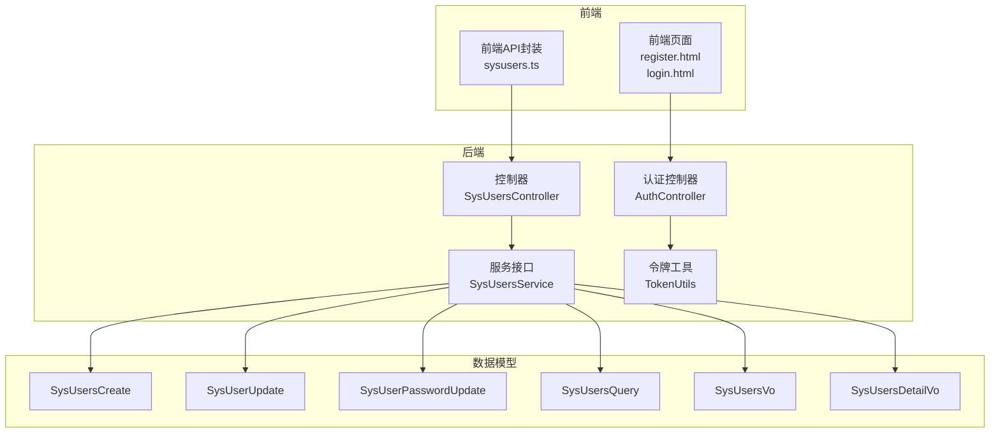
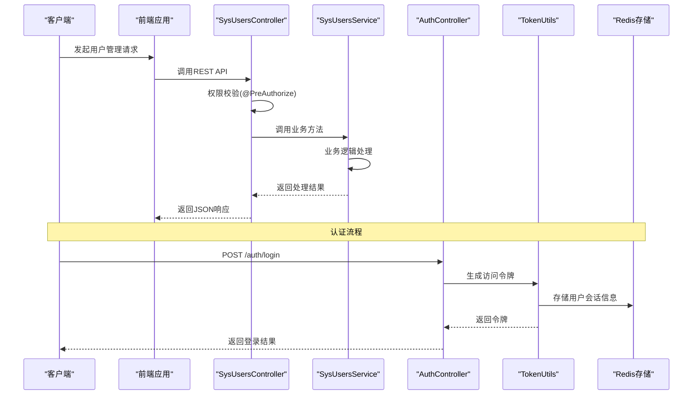
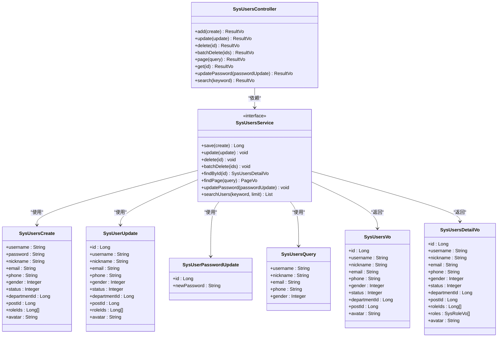

# 用户管理API

<cite>
**本文档引用的文件**
- [SysUsersController.java](file://run-admin/src/main/java/com/fastproject/module/system/controller/SysUsersController.java)
- [SysUsersService.java](file://system-module/src/main/java/com/fastproject/system/service/SysUsersService.java)
- [SysUsersCreate.java](file://system-module/src/main/java/com/fastproject/system/vo/users/SysUsersCreate.java)
- [SysUserUpdate.java](file://system-module/src/main/java/com/fastproject/system/vo/users/SysUserUpdate.java)
- [SysUserPasswordUpdate.java](file://system-module/src/main/java/com/fastproject/system/vo/users/SysUserPasswordUpdate.java)
- [SysUsersQuery.java](file://system-module/src/main/java/com/fastproject/system/vo/users/SysUsersQuery.java)
- [SysUsersVo.java](file://system-module/src/main/java/com/fastproject/system/vo/users/SysUsersVo.java)
- [SysUsersDetailVo.java](file://system-module/src/main/java/com/fastproject/system/vo/users/SysUsersDetailVo.java)
- [TokenUtils.java](file://common/src/main/java/com/fastproject/utils/TokenUtils.java)
- [sysusers.ts](file://fast-ui/apps/admin-vue/src/api/system/sysusers.ts)
- [AuthController.java](file://run-admin/src/main/java/com/fastproject/module/system/controller/AuthController.java)
- [register.html](file://websocket/src/main/resources/templates/register.html)
- [login.html](file://websocket/src/main/resources/templates/login.html)
</cite>

## 目录
1. [简介](#简介)
2. [项目结构](#项目结构)
3. [核心组件](#核心组件)
4. [架构概览](#架构概览)
5. [详细组件分析](#详细组件分析)
6. [依赖关系分析](#依赖关系分析)
7. [性能考虑](#性能考虑)
8. [故障排除指南](#故障排除指南)
9. [结论](#结论)

## 简介
本文件为Fast项目的用户管理模块提供详细的API文档。涵盖用户CRUD操作、用户注册、登录、密码修改、状态管理、用户详情查询、用户列表分页查询、用户搜索筛选等功能。同时说明权限验证机制、操作日志记录以及请求响应示例和常见问题解决方案。

## 项目结构
用户管理功能主要分布在以下模块：
- 控制器层：SysUsersController 提供RESTful接口
- 服务层：SysUsersService 定义业务接口
- VO层：SysUsersCreate、SysUserUpdate、SysUserPasswordUpdate、SysUsersQuery、SysUsersVo、SysUsersDetailVo 等数据传输对象
- 前端API封装：sysusers.ts 提供前端调用封装
- 认证与授权：TokenUtils 提供令牌管理，AuthController 提供认证接口
- 前端页面：register.html、login.html 提供用户注册和登录界面



**图表来源**
- [SysUsersController.java](file://run-admin/src/main/java/com/fastproject/module/system/controller/SysUsersController.java#L25-L112)
- [SysUsersService.java](file://system-module/src/main/java/com/fastproject/system/service/SysUsersService.java#L8-L75)
- [sysusers.ts](file://fast-ui/apps/admin-vue/src/api/system/sysusers.ts#L78-L133)

**章节来源**
- [SysUsersController.java](file://run-admin/src/main/java/com/fastproject/module/system/controller/SysUsersController.java#L1-L112)
- [SysUsersService.java](file://system-module/src/main/java/com/fastproject/system/service/SysUsersService.java#L1-L75)

## 核心组件
用户管理模块的核心组件包括：

### 控制器层
- SysUsersController：提供用户管理的RESTful接口
- AuthController：提供用户认证相关接口

### 服务层
- SysUsersService：定义用户管理的业务接口

### 数据传输对象
- SysUsersCreate：用户创建请求参数
- SysUserUpdate：用户更新请求参数
- SysUserPasswordUpdate：密码修改请求参数
- SysUsersQuery：用户查询条件
- SysUsersVo：用户列表响应数据
- SysUsersDetailVo：用户详情响应数据

**章节来源**
- [SysUsersController.java](file://run-admin/src/main/java/com/fastproject/module/system/controller/SysUsersController.java#L23-L112)
- [SysUsersService.java](file://system-module/src/main/java/com/fastproject/system/service/SysUsersService.java#L8-L75)
- [SysUsersCreate.java](file://system-module/src/main/java/com/fastproject/system/vo/users/SysUsersCreate.java#L1-L64)
- [SysUserUpdate.java](file://system-module/src/main/java/com/fastproject/system/vo/users/SysUserUpdate.java#L1-L65)
- [SysUserPasswordUpdate.java](file://system-module/src/main/java/com/fastproject/system/vo/users/SysUserPasswordUpdate.java#L1-L22)
- [SysUsersQuery.java](file://system-module/src/main/java/com/fastproject/system/vo/users/SysUsersQuery.java#L1-L38)
- [SysUsersVo.java](file://system-module/src/main/java/com/fastproject/system/vo/users/SysUsersVo.java#L1-L63)
- [SysUsersDetailVo.java](file://system-module/src/main/java/com/fastproject/system/vo/users/SysUsersDetailVo.java#L1-L71)

## 架构概览
用户管理采用经典的三层架构设计，结合Spring Security进行权限控制，使用Redis进行会话管理。



**图表来源**
- [SysUsersController.java](file://run-admin/src/main/java/com/fastproject/module/system/controller/SysUsersController.java#L32-L102)
- [AuthController.java](file://run-admin/src/main/java/com/fastproject/module/system/controller/AuthController.java)
- [TokenUtils.java](file://common/src/main/java/com/fastproject/utils/TokenUtils.java#L85-L127)

## 详细组件分析

### 用户CRUD接口

#### 用户创建
- **接口地址**：POST /sys/users
- **权限要求**：admin:system:user:add
- **请求参数**：SysUsersCreate对象
- **响应数据**：ResultVo<Object>，包含创建结果
- **幂等性**：启用幂等性保护，防止重复提交

**请求参数说明**：
- username：账号，必填
- password：密码，必填
- nickname：昵称，可选
- email：邮箱，可选
- phone：电话，可选
- gender：性别，可选(0男,1女,2未知)
- status：角色状态，可选
- departmentId：部门ID，可选
- postId：岗位ID，可选
- roleIds：角色ID列表，可选
- avatar：头像，可选

**响应数据结构**：
```json
{
  "code": 200,
  "msg": "操作成功",
  "data": {}
}
```

**章节来源**
- [SysUsersController.java](file://run-admin/src/main/java/com/fastproject/module/system/controller/SysUsersController.java#L32-L38)
- [SysUsersCreate.java](file://system-module/src/main/java/com/fastproject/system/vo/users/SysUsersCreate.java#L8-L63)

#### 用户更新
- **接口地址**：PUT /sys/users
- **权限要求**：admin:system:user:update
- **请求参数**：SysUserUpdate对象
- **响应数据**：ResultVo<Object>

**请求参数说明**：
- id：用户ID，必填
- username：账号，可选
- nickname：昵称，可选
- email：邮箱，可选
- phone：电话，可选
- gender：性别，可选
- status：角色状态，可选
- departmentId：部门ID，可选
- postId：岗位ID，可选
- roleIds：角色ID列表，可选
- avatar：头像，可选

**章节来源**
- [SysUsersController.java](file://run-admin/src/main/java/com/fastproject/module/system/controller/SysUsersController.java#L43-L49)
- [SysUserUpdate.java](file://system-module/src/main/java/com/fastproject/system/vo/users/SysUserUpdate.java#L8-L64)

#### 用户删除
- **接口地址**：DELETE /sys/users/{id}
- **权限要求**：admin:system:user:delete
- **路径参数**：id - 用户ID
- **响应数据**：ResultVo<Object>

**章节来源**
- [SysUsersController.java](file://run-admin/src/main/java/com/fastproject/module/system/controller/SysUsersController.java#L55-L61)

#### 批量删除
- **接口地址**：DELETE /sys/users/batch
- **权限要求**：admin:system:user:delete
- **请求参数**：Long[] ids
- **响应数据**：ResultVo<Object>

**章节来源**
- [SysUsersController.java](file://run-admin/src/main/java/com/fastproject/module/system/controller/SysUsersController.java#L66-L72)

### 用户查询接口

#### 用户分页查询
- **接口地址**：POST /sys/users/page
- **权限要求**：admin:system:user:page
- **请求参数**：SysUsersQuery对象
- **响应数据**：ResultVo<PageVo<List<SysUsersVo>>>

**查询条件说明**：
- username：账号，支持模糊匹配
- nickname：昵称，支持模糊匹配
- email：邮箱，支持模糊匹配
- phone：电话，支持模糊匹配
- gender：性别，精确匹配
- 当前继承自PageQuery的基础分页参数

**章节来源**
- [SysUsersController.java](file://run-admin/src/main/java/com/fastproject/module/system/controller/SysUsersController.java#L77-L81)
- [SysUsersQuery.java](file://system-module/src/main/java/com/fastproject/system/vo/users/SysUsersQuery.java#L10-L37)

#### 用户详情查询
- **接口地址**：GET /sys/users/{id}
- **权限要求**：admin:system:user:page
- **路径参数**：id - 用户ID
- **响应数据**：ResultVo<SysUsersDetailVo>

**响应数据字段**：
- id：用户ID
- username：账号
- nickname：昵称
- email：邮箱
- phone：电话
- gender：性别
- status：角色状态
- departmentId：部门ID
- postId：岗位ID
- roleIds：角色ID列表
- roles：角色列表
- avatar：头像

**章节来源**
- [SysUsersController.java](file://run-admin/src/main/java/com/fastproject/module/system/controller/SysUsersController.java#L86-L90)
- [SysUsersDetailVo.java](file://system-module/src/main/java/com/fastproject/system/vo/users/SysUsersDetailVo.java#L9-L70)

#### 用户搜索
- **接口地址**：GET /sys/users/search
- **权限要求**：无需特殊权限
- **查询参数**：keyword - 搜索关键词
- **响应数据**：ResultVo<List<SysUsersVo>>
- **限制**：最多返回20条记录

**章节来源**
- [SysUsersController.java](file://run-admin/src/main/java/com/fastproject/module/system/controller/SysUsersController.java#L107-L110)

### 密码管理接口

#### 修改密码
- **接口地址**：PUT /sys/users/password
- **权限要求**：admin:system:user:update
- **请求参数**：SysUserPasswordUpdate对象
- **响应数据**：ResultVo<Object>

**请求参数说明**：
- id：用户ID，必填
- newPassword：新密码，必填

**章节来源**
- [SysUsersController.java](file://run-admin/src/main/java/com/fastproject/module/system/controller/SysUsersController.java#L95-L102)
- [SysUserPasswordUpdate.java](file://system-module/src/main/java/com/fastproject/system/vo/users/SysUserPasswordUpdate.java#L8-L21)

### 前端API封装
前端通过sysusers.ts提供统一的API调用封装，包含以下方法：
- getUserById：获取用户详情
- createUser：创建用户
- searchUsers：搜索用户
- updateUser：更新用户
- deleteUser：删除用户
- batchDeleteUser：批量删除用户
- updateUserPassword：修改密码

**章节来源**
- [sysusers.ts](file://fast-ui/apps/admin-vue/src/api/system/sysusers.ts#L78-L133)

## 依赖关系分析

### 组件依赖图


**图表来源**
- [SysUsersController.java](file://run-admin/src/main/java/com/fastproject/module/system/controller/SysUsersController.java#L23-L112)
- [SysUsersService.java](file://system-module/src/main/java/com/fastproject/system/service/SysUsersService.java#L8-L75)
- [SysUsersCreate.java](file://system-module/src/main/java/com/fastproject/system/vo/users/SysUsersCreate.java#L8-L63)
- [SysUserUpdate.java](file://system-module/src/main/java/com/fastproject/system/vo/users/SysUserUpdate.java#L8-L64)
- [SysUserPasswordUpdate.java](file://system-module/src/main/java/com/fastproject/system/vo/users/SysUserPasswordUpdate.java#L8-L21)
- [SysUsersQuery.java](file://system-module/src/main/java/com/fastproject/system/vo/users/SysUsersQuery.java#L10-L37)
- [SysUsersVo.java](file://system-module/src/main/java/com/fastproject/system/vo/users/SysUsersVo.java#L10-L62)
- [SysUsersDetailVo.java](file://system-module/src/main/java/com/fastproject/system/vo/users/SysUsersDetailVo.java#L9-L70)

### 权限控制机制
系统采用基于注解的权限控制机制：
- @PreAuthorize：在方法级别进行权限校验
- 支持表达式语言进行复杂权限判断
- 结合Spring Security实现细粒度的访问控制

### 日志记录机制
- @Log注解：自动记录操作日志
- 支持业务类型和操作类型的分类
- 记录操作人、操作时间、操作内容等信息

### 幂等性保证
- @Idempotent注解：防止重复提交
- 基于请求ID的去重机制
- 支持配置过期时间和标题

**章节来源**
- [SysUsersController.java](file://run-admin/src/main/java/com/fastproject/module/system/controller/SysUsersController.java#L3-L19)

## 性能考虑
1. **缓存策略**：TokenUtils使用Caffeine本地缓存和Redis分布式缓存相结合的方式，提高令牌验证性能
2. **连接池优化**：合理配置数据库连接池和Redis连接池参数
3. **分页查询**：默认限制搜索结果数量，避免大数据量查询影响性能
4. **批量操作**：提供批量删除接口，减少网络往返次数

## 故障排除指南

### 常见错误码
- 401 未授权：缺少有效的认证令牌或权限不足
- 403 禁止访问：用户没有执行特定操作的权限
- 404 资源不存在：请求的用户ID不存在
- 422 参数验证失败：请求参数格式不正确或缺失
- 500 服务器内部错误：服务端处理异常

### 常见问题及解决方案

#### 认证失败
**问题描述**：用户登录后无法访问受保护的接口
**解决方案**：
1. 检查请求头中Authorization字段是否正确
2. 确认令牌未过期
3. 验证用户权限是否正确配置

#### 权限不足
**问题描述**：提示无权执行某些操作
**解决方案**：
1. 检查用户是否具有相应的权限标识
2. 确认角色配置是否正确
3. 验证@PreAuthorize注解的权限表达式

#### 数据验证错误
**问题描述**：创建或更新用户时出现参数验证错误
**解决方案**：
1. 检查必填字段是否完整
2. 验证数据类型和格式
3. 确认字段长度限制

#### 性能问题
**问题描述**：大量用户查询时响应缓慢
**解决方案**：
1. 使用分页查询替代全量查询
2. 优化搜索条件，避免全表扫描
3. 检查数据库索引配置

**章节来源**
- [TokenUtils.java](file://common/src/main/java/com/fastproject/utils/TokenUtils.java#L185-L212)

## 结论
用户管理模块提供了完整的用户生命周期管理功能，包括基础的CRUD操作、高级的查询筛选、安全的认证授权机制以及完善的日志记录。通过合理的架构设计和性能优化，能够满足大多数应用场景的需求。建议在生产环境中重点关注权限配置的准确性、数据验证的完整性以及性能监控的持续性。