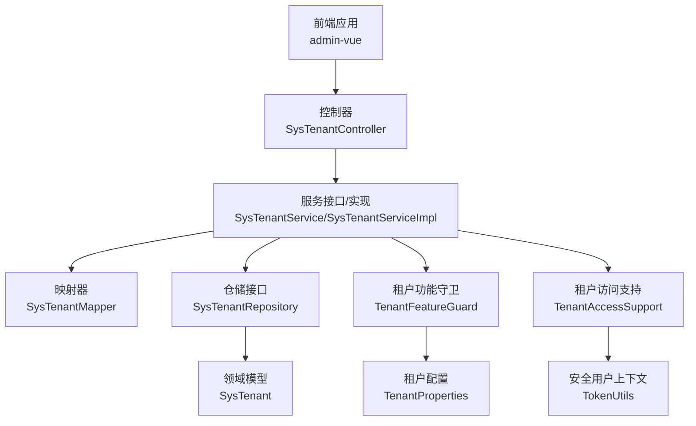
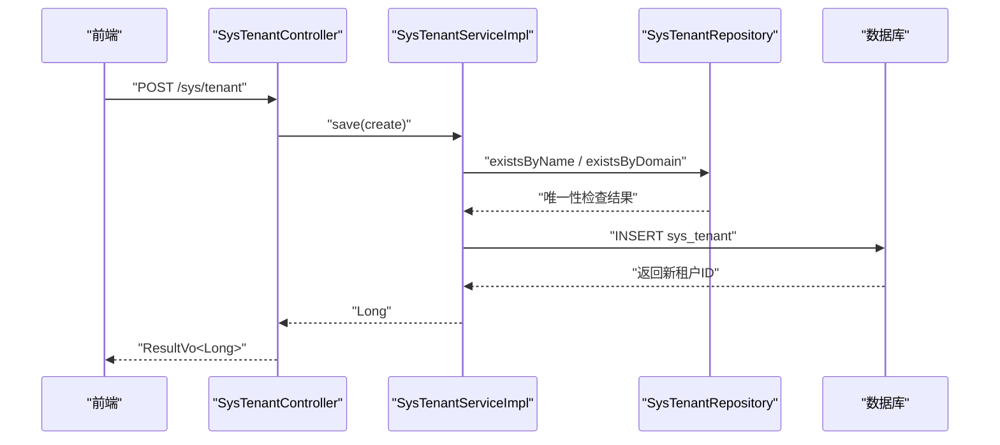
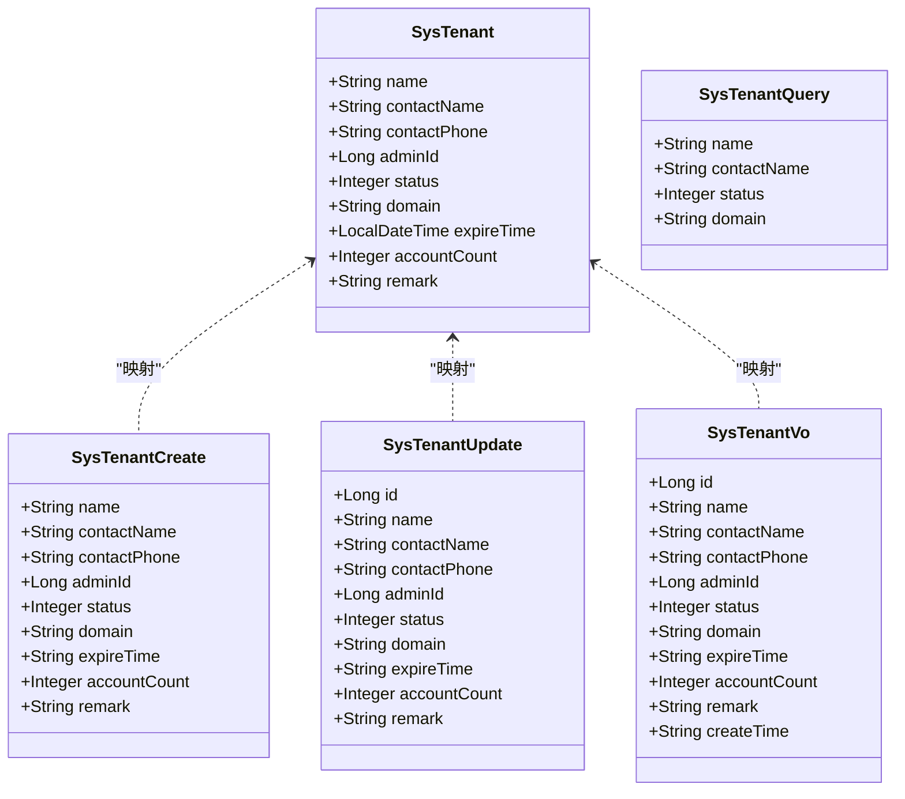
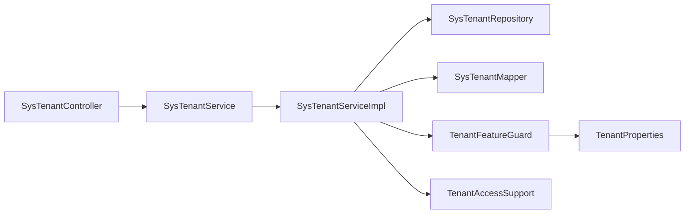

# 租户配置API

<cite>
**本文引用的文件**
- [SysTenantController.java](file://run-admin/src/main/java/com/ fastproject/module/system/controller/SysTenantController.java)
- [SysTenantService.java](file://system-module/src/main/java/com/ fastproject/system/service/SysTenantService.java)
- [SysTenantServiceImpl.java](file://system-module/src/main/java/com/ fastproject/system/service/impl/SysTenantServiceImpl.java)
- [SysTenantMapper.java](file://system-module/src/main/java/com/ fastproject/system/mapper/SysTenantMapper.java)
- [SysTenantRepository.java](file://system-module/src/main/java/com/ fastproject/system/repository/db/SysTenantRepository.java)
- [SysTenant.java](file://system-module/src/main/java/com/ fastproject/system/domain/SysTenant.java)
- [SysTenantCreate.java](file://system-module/src/main/java/com/ fastproject/system/vo/tenant/SysTenantCreate.java)
- [SysTenantUpdate.java](file://system-module/src/main/java/com/ fastproject/system/vo/tenant/SysTenantUpdate.java)
- [SysTenantQuery.java](file://system-module/src/main/java/com/ fastproject/system/vo/tenant/SysTenantQuery.java)
- [SysTenantVo.java](file://system-module/src/main/java/com/ fastproject/system/vo/tenant/SysTenantVo.java)
- [TenantAccessSupport.java](file://system-module/src/main/java/com/ fastproject/system/tenant/TenantAccessSupport.java)
- [TenantFeatureGuard.java](file://system-module/src/main/java/com/ fastproject/system/config/TenantFeatureGuard.java)
- [TenantProperties.java](file://system-module/src/main/java/com/ fastproject/system/config/TenantProperties.java)
- [TenantScopedEntity.java](file://system-module/src/main/java/com/ fastproject/system/tenant/TenantScopedEntity.java)
- [systenant.ts](file://fast-ui/apps/admin-vue/src/api/system/systenant.ts)
</cite>

## 目录
1. [简介](#简介)
2. [项目结构](#项目结构)
3. [核心组件](#核心组件)
4. [架构总览](#架构总览)
5. [详细组件分析](#详细组件分析)
6. [依赖关系分析](#依赖关系分析)
7. [性能考虑](#性能考虑)
8. [故障排查指南](#故障排查指南)
9. [结论](#结论)
10. [附录](#附录)

## 简介
本文件为多租户架构下的“租户配置管理模块”提供完整的RESTful API文档。内容覆盖租户创建、配置修改、状态管理、租户列表与详情查询、批量删除等核心能力，并深入说明租户数据隔离机制、配置同步策略、权限控制、生命周期管理、配置热更新与性能优化等最佳实践。同时提供请求/响应示例与常见问题解决方案，帮助前后端协同开发与运维保障。

## 项目结构
该模块采用典型的分层架构：前端通过HTTP调用后端控制器；控制器将请求参数封装为DTO，交由服务层处理；服务层使用仓储与映射器完成持久化与转换；底层通过JPA与数据库交互；多租户能力通过配置与访问支持进行统一管控。

图表来源
- [SysTenantController.java](file://run-admin/src/main/java/com/ fastproject/module/system/controller/SysTenantController.java#L23-L92)
- [SysTenantServiceImpl.java](file://system-module/src/main/java/com/ fastproject/system/service/impl/SysTenantServiceImpl.java#L33-L142)
- [SysTenantMapper.java](file://system-module/src/main/java/com/ fastproject/system/mapper/SysTenantMapper.java#L19-L49)
- [SysTenantRepository.java](file://system-module/src/main/java/com/ fastproject/system/repository/db/SysTenantRepository.java#L11-L32)
- [SysTenant.java](file://system-module/src/main/java/com/ fastproject/system/domain/SysTenant.java#L16-L68)
- [TenantFeatureGuard.java](file://system-module/src/main/java/com/ fastproject/system/config/TenantFeatureGuard.java#L10-L19)
- [TenantProperties.java](file://system-module/src/main/java/com/ fastproject/system/config/TenantProperties.java#L14-L21)
- [TenantAccessSupport.java](file://system-module/src/main/java/com/ fastproject/system/tenant/TenantAccessSupport.java#L19-L39)

章节来源
- [SysTenantController.java](file://run-admin/src/main/java/com/ fastproject/module/system/controller/SysTenantController.java#L23-L92)
- [SysTenantServiceImpl.java](file://system-module/src/main/java/com/ fastproject/system/service/impl/SysTenantServiceImpl.java#L33-L142)
- [SysTenantMapper.java](file://system-module/src/main/java/com/ fastproject/system/mapper/SysTenantMapper.java#L19-L49)
- [SysTenantRepository.java](file://system-module/src/main/java/com/ fastproject/system/repository/db/SysTenantRepository.java#L11-L32)
- [SysTenant.java](file://system-module/src/main/java/com/ fastproject/system/domain/SysTenant.java#L16-L68)
- [TenantFeatureGuard.java](file://system-module/src/main/java/com/ fastproject/system/config/TenantFeatureGuard.java#L10-L19)
- [TenantProperties.java](file://system-module/src/main/java/com/ fastproject/system/config/TenantProperties.java#L14-L21)
- [TenantAccessSupport.java](file://system-module/src/main/java/com/ fastproject/system/tenant/TenantAccessSupport.java#L19-L39)

## 核心组件
- 控制器层：提供REST接口，负责鉴权、幂等、日志与结果包装。
- 服务层：实现业务逻辑，包括重复性校验、事务控制、分页查询与条件过滤。
- 映射器层：负责DTO/VO与实体之间的字段映射与日期格式化。
- 仓储层：基于JPA抽象数据库访问，提供条件查询与唯一性校验。
- 领域模型：租户实体，包含基础字段与软删除限制。
- 多租户支持：通过配置开关与访问支持统一控制租户功能的启用与作用域。

章节来源
- [SysTenantController.java](file://run-admin/src/main/java/com/ fastproject/module/system/controller/SysTenantController.java#L23-L92)
- [SysTenantService.java](file://system-module/src/main/java/com/ fastproject/system/service/SysTenantService.java#L14-L45)
- [SysTenantServiceImpl.java](file://system-module/src/main/java/com/ fastproject/system/service/impl/SysTenantServiceImpl.java#L33-L142)
- [SysTenantMapper.java](file://system-module/src/main/java/com/ fastproject/system/mapper/SysTenantMapper.java#L19-L49)
- [SysTenantRepository.java](file://system-module/src/main/java/com/ fastproject/system/repository/db/SysTenantRepository.java#L11-L32)
- [SysTenant.java](file://system-module/src/main/java/com/ fastproject/system/domain/SysTenant.java#L16-L68)
- [TenantAccessSupport.java](file://system-module/src/main/java/com/ fastproject/system/tenant/TenantAccessSupport.java#L19-L39)
- [TenantFeatureGuard.java](file://system-module/src/main/java/com/ fastproject/system/config/TenantFeatureGuard.java#L10-L19)
- [TenantProperties.java](file://system-module/src/main/java/com/ fastproject/system/config/TenantProperties.java#L14-L21)

## 架构总览
下图展示从客户端到数据库的完整调用链路，以及多租户功能在各层的体现。

图表来源
- [SysTenantController.java](file://run-admin/src/main/java/com/ fastproject/module/system/controller/SysTenantController.java#L33-L39)
- [SysTenantServiceImpl.java](file://system-module/src/main/java/com/ fastproject/system/service/impl/SysTenantServiceImpl.java#L44-L62)
- [SysTenantRepository.java](file://system-module/src/main/java/com/ fastproject/system/repository/db/SysTenantRepository.java#L14-L21)

## 详细组件分析

### 控制器层：SysTenantController
- 提供REST接口，均带有权限注解与操作日志注解，确保可审计与可授权。
- 使用幂等注解防止重复提交造成副作用。
- 返回统一封装的结果对象，便于前端处理。

接口清单
- POST /sys/tenant：创建租户
- PUT /sys/tenant：更新租户
- DELETE /sys/tenant/{id}：删除租户
- DELETE /sys/tenant/batch：批量删除租户
- POST /sys/tenant/page：分页查询租户
- GET /sys/tenant/{id}：获取租户详情

章节来源
- [SysTenantController.java](file://run-admin/src/main/java/com/ fastproject/module/system/controller/SysTenantController.java#L33-L91)

### 服务层：SysTenantService 与 SysTenantServiceImpl
- 统一校验租户功能是否启用（通过租户功能守卫）。
- 保存时校验名称与域名唯一性，避免冲突。
- 更新时排除自身ID进行唯一性校验，保证修改场景正确性。
- 分页查询支持按名称、联系人、域名、状态等条件过滤。
- 所有写操作均在事务中执行，失败回滚。

章节来源
- [SysTenantService.java](file://system-module/src/main/java/com/ fastproject/system/service/SysTenantService.java#L14-L45)
- [SysTenantServiceImpl.java](file://system-module/src/main/java/com/ fastproject/system/service/impl/SysTenantServiceImpl.java#L44-L141)

### 映射器层：SysTenantMapper
- 将创建/更新DTO映射为实体，支持日期格式化。
- 支持空值属性忽略策略，避免更新时误清空字段。
- 提供实体到VO的双向映射，用于分页与详情返回。

章节来源
- [SysTenantMapper.java](file://system-module/src/main/java/com/ fastproject/system/mapper/SysTenantMapper.java#L19-L49)

### 仓储层：SysTenantRepository
- 提供JPA与Specification执行器，支持复杂条件查询。
- 提供唯一性校验方法，包括排除指定ID的场景。

章节来源
- [SysTenantRepository.java](file://system-module/src/main/java/com/ fastproject/system/repository/db/SysTenantRepository.java#L11-L32)

### 领域模型：SysTenant
- 定义租户表结构，包含名称、联系人、电话、管理员ID、状态、域名、过期时间、账号额度、备注等字段。
- 使用软删除与SQL限制，确保查询默认不包含已删除记录。

章节来源
- [SysTenant.java](file://system-module/src/main/java/com/ fastproject/system/domain/SysTenant.java#L16-L68)

### 多租户支持：TenantAccessSupport、TenantFeatureGuard、TenantProperties
- 通过配置开关控制租户功能是否启用。
- 访问支持判断当前是否应应用租户范围（非超级管理员且功能开启）。
- 功能守卫在关键写操作前进行统一校验，确保安全与一致性。

章节来源
- [TenantAccessSupport.java](file://system-module/src/main/java/com/ fastproject/system/tenant/TenantAccessSupport.java#L19-L39)
- [TenantFeatureGuard.java](file://system-module/src/main/java/com/ fastproject/system/config/TenantFeatureGuard.java#L10-L19)
- [TenantProperties.java](file://system-module/src/main/java/com/ fastproject/system/config/TenantProperties.java#L14-L21)

### 数据模型类图

图表来源
- [SysTenant.java](file://system-module/src/main/java/com/ fastproject/system/domain/SysTenant.java#L16-L68)
- [SysTenantCreate.java](file://system-module/src/main/java/com/ fastproject/system/vo/tenant/SysTenantCreate.java#L8-L55)
- [SysTenantUpdate.java](file://system-module/src/main/java/com/ fastproject/system/vo/tenant/SysTenantUpdate.java#L8-L60)
- [SysTenantQuery.java](file://system-module/src/main/java/com/ fastproject/system/vo/tenant/SysTenantQuery.java#L10-L33)
- [SysTenantVo.java](file://system-module/src/main/java/com/ fastproject/system/vo/tenant/SysTenantVo.java#L8-L64)

## 依赖关系分析
- 控制器依赖服务接口，遵循依赖倒置原则。
- 服务实现依赖仓储、映射器与租户功能守卫。
- 仓储接口继承JPA与Specification执行器，具备灵活查询能力。
- 多租户配置与访问支持贯穿服务层，形成统一的租户边界。

图表来源
- [SysTenantController.java](file://run-admin/src/main/java/com/ fastproject/module/system/controller/SysTenantController.java#L23-L92)
- [SysTenantServiceImpl.java](file://system-module/src/main/java/com/ fastproject/system/service/impl/SysTenantServiceImpl.java#L33-L142)
- [SysTenantRepository.java](file://system-module/src/main/java/com/ fastproject/system/repository/db/SysTenantRepository.java#L11-L32)
- [SysTenantMapper.java](file://system-module/src/main/java/com/ fastproject/system/mapper/SysTenantMapper.java#L19-L49)
- [TenantFeatureGuard.java](file://system-module/src/main/java/com/ fastproject/system/config/TenantFeatureGuard.java#L10-L19)
- [TenantProperties.java](file://system-module/src/main/java/com/ fastproject/system/config/TenantProperties.java#L14-L21)
- [TenantAccessSupport.java](file://system-module/src/main/java/com/ fastproject/system/tenant/TenantAccessSupport.java#L19-L39)

章节来源
- [SysTenantController.java](file://run-admin/src/main/java/com/ fastproject/module/system/controller/SysTenantController.java#L23-L92)
- [SysTenantServiceImpl.java](file://system-module/src/main/java/com/ fastproject/system/service/impl/SysTenantServiceImpl.java#L33-L142)
- [SysTenantRepository.java](file://system-module/src/main/java/com/ fastproject/system/repository/db/SysTenantRepository.java#L11-L32)
- [SysTenantMapper.java](file://system-module/src/main/java/com/ fastproject/system/mapper/SysTenantMapper.java#L19-L49)
- [TenantFeatureGuard.java](file://system-module/src/main/java/com/ fastproject/system/config/TenantFeatureGuard.java#L10-L19)
- [TenantProperties.java](file://system-module/src/main/java/com/ fastproject/system/config/TenantProperties.java#L14-L21)
- [TenantAccessSupport.java](file://system-module/src/main/java/com/ fastproject/system/tenant/TenantAccessSupport.java#L19-L39)

## 性能考虑
- 分页查询：服务层使用JPA分页与排序，建议前端传入合理页码与大小，避免超大偏移。
- 条件过滤：仓储层通过Specification组合谓词，注意索引设计以提升like查询性能。
- 幂等与重试：控制器使用幂等注解，结合请求ID头，降低重复提交带来的压力。
- 缓存策略：对于只读列表与详情，可在网关或应用层引入缓存，减少数据库压力。
- 软删除：实体使用软删除与SQL限制，避免全表扫描，但需定期清理历史数据。

## 故障排查指南
- 重复性错误
  - 现象：创建/更新时报“租户名称已存在”或“租户域名已存在”。
  - 原因：名称或域名违反唯一约束。
  - 处理：修改为唯一值后重试。
- 权限不足
  - 现象：接口返回无权限。
  - 原因：缺少对应权限标识。
  - 处理：为当前用户授予相应权限。
- 功能未启用
  - 现象：写操作被拒绝。
  - 原因：租户功能未启用。
  - 处理：在配置中开启租户功能。
- 参数异常
  - 现象：请求参数缺失或格式错误。
  - 处理：核对DTO字段与类型，确保必填项齐全。

章节来源
- [SysTenantServiceImpl.java](file://system-module/src/main/java/com/ fastproject/system/service/impl/SysTenantServiceImpl.java#L50-L57)
- [SysTenantServiceImpl.java](file://system-module/src/main/java/com/ fastproject/system/service/impl/SysTenantServiceImpl.java#L72-L81)
- [TenantFeatureGuard.java](file://system-module/src/main/java/com/ fastproject/system/config/TenantFeatureGuard.java#L16-L18)
- [TenantAccessSupport.java](file://system-module/src/main/java/com/ fastproject/system/tenant/TenantAccessSupport.java#L28-L39)

## 结论
本模块提供了完善的租户配置管理能力，涵盖创建、更新、查询、删除与批量删除等核心接口，并通过配置开关与访问支持实现统一的多租户边界控制。建议在生产环境中配合缓存、索引与监控体系，持续优化性能与稳定性。

## 附录

### API定义与示例

- 创建租户
  - 方法与路径：POST /sys/tenant
  - 请求头：Content-Type: application/json
  - 请求体（DTO字段）：名称、联系人、联系电话、管理员ID、状态、域名、过期时间、账号额度、备注
  - 成功响应：ResultVo<Long>，data为新增租户ID
  - 示例参考：[systenant.ts](file://fast-ui/apps/admin-vue/src/api/system/systenant.ts#L89-L96)

- 更新租户
  - 方法与路径：PUT /sys/tenant
  - 请求体（DTO字段）：租户ID + 可选字段（名称、联系人、联系电话、管理员ID、状态、域名、过期时间、账号额度、备注）
  - 成功响应：ResultVo<Void>
  - 示例参考：[systenant.ts](file://fast-ui/apps/admin-vue/src/api/system/systenant.ts#L101-L108)

- 删除租户
  - 方法与路径：DELETE /sys/tenant/{id}
  - 成功响应：ResultVo<Object>

- 批量删除租户
  - 方法与路径：DELETE /sys/tenant/batch
  - 请求体：数组[id,...]
  - 成功响应：ResultVo<Object>

- 分页查询租户
  - 方法与路径：POST /sys/tenant/page
  - 请求体（分页+筛选）：page、pageSize、名称、联系人、状态、域名
  - 成功响应：ResultVo<PageVo<List<SysTenantVo>>>
  - 示例参考：[systenant.ts](file://fast-ui/apps/admin-vue/src/api/system/systenant.ts#L68-L74)

- 获取租户详情
  - 方法与路径：GET /sys/tenant/{id}
  - 成功响应：ResultVo<SysTenantVo>
  - 示例参考：[systenant.ts](file://fast-ui/apps/admin-vue/src/api/system/systenant.ts#L79-L84)

章节来源
- [SysTenantController.java](file://run-admin/src/main/java/com/ fastproject/module/system/controller/SysTenantController.java#L33-L91)
- [SysTenantServiceImpl.java](file://system-module/src/main/java/com/ fastproject/system/service/impl/SysTenantServiceImpl.java#L114-L141)
- [systenant.ts](file://fast-ui/apps/admin-vue/src/api/system/systenant.ts#L68-L129)

### 数据模型与字段说明
- SysTenant（实体）
  - 字段：名称、联系人、联系电话、管理员ID、状态、域名、过期时间、账号额度、备注
  - 约束：软删除与SQL限制
- SysTenantVo（视图对象）
  - 字段：id、名称、联系人、联系电话、管理员ID、状态、域名、过期时间、账号额度、备注、创建时间
- SysTenantCreate/SysTenantUpdate（创建/更新DTO）
  - 字段：与实体一致，含必填与可选项
- SysTenantQuery（查询DTO）
  - 字段：分页参数 + 名称/联系人/状态/域名

章节来源
- [SysTenant.java](file://system-module/src/main/java/com/ fastproject/system/domain/SysTenant.java#L16-L68)
- [SysTenantVo.java](file://system-module/src/main/java/com/ fastproject/system/vo/tenant/SysTenantVo.java#L8-L64)
- [SysTenantCreate.java](file://system-module/src/main/java/com/ fastproject/system/vo/tenant/SysTenantCreate.java#L8-L55)
- [SysTenantUpdate.java](file://system-module/src/main/java/com/ fastproject/system/vo/tenant/SysTenantUpdate.java#L8-L60)
- [SysTenantQuery.java](file://system-module/src/main/java/com/ fastproject/system/vo/tenant/SysTenantQuery.java#L10-L33)

### 多租户数据隔离机制
- 配置开关：通过TenantProperties控制租户功能启用状态。
- 访问范围：TenantAccessSupport判断是否应应用租户范围（非超级管理员且功能开启）。
- 实体隔离：SysTenant使用软删除与SQL限制，避免误删与跨租户查询。
- 扩展点：TenantScopedEntity定义了租户隔离实体的约定，便于扩展其他实体的多租户支持。

章节来源
- [TenantProperties.java](file://system-module/src/main/java/com/ fastproject/system/config/TenantProperties.java#L14-L21)
- [TenantAccessSupport.java](file://system-module/src/main/java/com/ fastproject/system/tenant/TenantAccessSupport.java#L28-L39)
- [SysTenant.java](file://system-module/src/main/java/com/ fastproject/system/domain/SysTenant.java#L20-L21)
- [TenantScopedEntity.java](file://system-module/src/main/java/com/ fastproject/system/tenant/TenantScopedEntity.java#L6-L11)

### 配置同步策略与热更新
- 建议将租户功能开关纳入配置中心，支持动态刷新。
- 对于影响查询范围的配置变更，建议在网关或应用层增加缓存失效策略，确保一致性。
- 日志与审计：所有写操作均记录业务日志，便于追踪与回溯。

章节来源
- [TenantFeatureGuard.java](file://system-module/src/main/java/com/ fastproject/system/config/TenantFeatureGuard.java#L16-L18)
- [SysTenantController.java](file://run-admin/src/main/java/com/ fastproject/module/system/controller/SysTenantController.java#L35-L47)

### 生命周期管理与最佳实践
- 生命周期：创建（唯一性校验）→ 正常/停用（状态管理）→ 软删除（保留审计轨迹）
- 最佳实践：
  - 严格区分超级管理员与普通管理员的租户范围。
  - 对高频查询建立合适索引，优化like与等值查询。
  - 使用幂等与请求ID头，避免重复提交。
  - 对外暴露的接口统一鉴权与日志，便于合规审计。

章节来源
- [SysTenantServiceImpl.java](file://system-module/src/main/java/com/ fastproject/system/service/impl/SysTenantServiceImpl.java#L44-L101)
- [SysTenantController.java](file://run-admin/src/main/java/com/ fastproject/module/system/controller/SysTenantController.java#L33-L72)