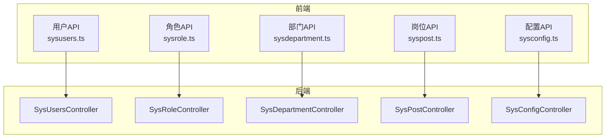
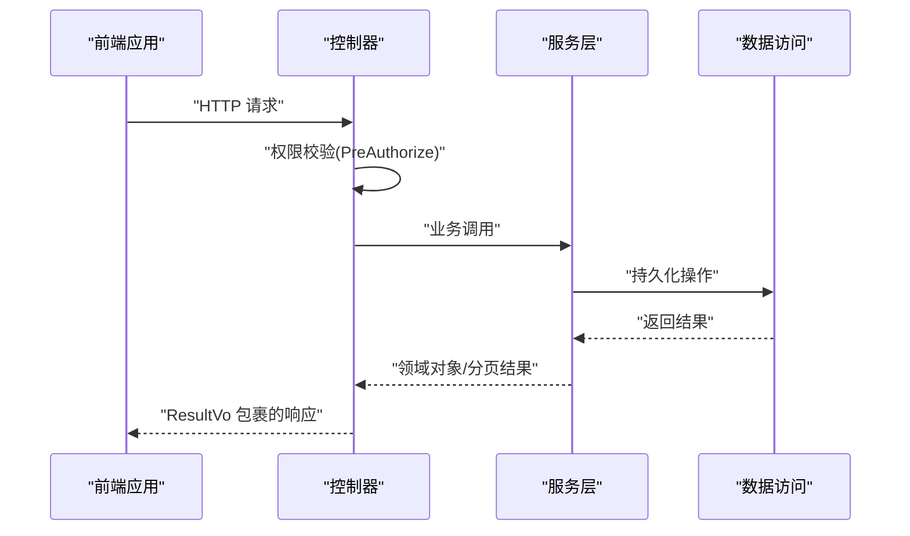
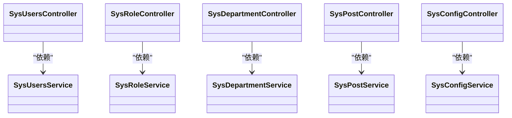

# 系统管理API

<cite>
**本文引用的文件**
- [SysUsersController.java](file://run-admin/src/main/java/com/fastproject/module/system/controller/SysUsersController.java)
- [SysRoleController.java](file://run-admin/src/main/java/com/fastproject/module/system/controller/SysRoleController.java)
- [SysDepartmentController.java](file://run-admin/src/main/java/com/fastproject/module/system/controller/SysDepartmentController.java)
- [SysConfigController.java](file://run-admin/src/main/java/com/fastproject/module/system/controller/SysConfigController.java)
- [SysPostController.java](file://run-admin/src/main/java/com/fastproject/module/system/controller/SysPostController.java)
- [sysdepartment.ts](file://fast-ui/apps/admin-vue/src/api/system/sysdepartment.ts)
- [sysconfig.ts](file://fast-ui/apps/admin-vue/src/api/system/sysconfig.ts)
- [syspost.ts](file://fast-ui/apps/admin-vue/src/api/system/syspost.ts)
</cite>

## 目录
1. [简介](#简介)
2. [项目结构](#项目结构)
3. [核心组件](#核心组件)
4. [架构总览](#架构总览)
5. [详细组件分析](#详细组件分析)
6. [依赖关系分析](#依赖关系分析)
7. [性能考虑](#性能考虑)
8. [故障排查指南](#故障排查指南)
9. [结论](#结论)
10. [附录](#附录)

## 简介
本文件为系统管理模块的完整API接口文档，覆盖用户管理、角色权限管理、部门岗位管理、配置管理等核心功能。文档基于后端控制器与前端API定义，提供每个控制器类的HTTP方法、URL路径、请求参数、响应格式、分页查询、条件筛选、排序、认证授权与权限控制策略说明，并给出典型请求/响应示例与错误处理建议。

## 项目结构
系统管理相关API由后端控制器统一暴露REST接口，前端通过Axios封装的API模块调用，形成清晰的前后端分离结构。

图表来源
- [SysUsersController.java](file://run-admin/src/main/java/com/fastproject/module/system/controller/SysUsersController.java#L23-L112)
- [SysRoleController.java](file://run-admin/src/main/java/com/fastproject/module/system/controller/SysRoleController.java#L21-L99)
- [SysDepartmentController.java](file://run-admin/src/main/java/com/fastproject/module/system/controller/SysDepartmentController.java#L20-L110)
- [SysConfigController.java](file://run-admin/src/main/java/com/fastproject/module/system/controller/SysConfigController.java#L20-L94)
- [SysPostController.java](file://run-admin/src/main/java/com/fastproject/module/system/controller/SysPostController.java#L20-L110)

章节来源
- [SysUsersController.java](file://run-admin/src/main/java/com/fastproject/module/system/controller/SysUsersController.java#L23-L112)
- [SysRoleController.java](file://run-admin/src/main/java/com/fastproject/module/system/controller/SysRoleController.java#L21-L99)
- [SysDepartmentController.java](file://run-admin/src/main/java/com/fastproject/module/system/controller/SysDepartmentController.java#L20-L110)
- [SysConfigController.java](file://run-admin/src/main/java/com/fastproject/module/system/controller/SysConfigController.java#L20-L94)
- [SysPostController.java](file://run-admin/src/main/java/com/fastproject/module/system/controller/SysPostController.java#L20-L110)

## 核心组件
- 用户管理：提供用户增删改查、分页、详情、密码修改、模糊搜索等能力。
- 角色管理：提供角色增删改查、分页、详情、下拉选择等能力。
- 部门管理：提供部门增删改查、分页、详情、树形结构查询、下拉选择等能力。
- 岗位管理：提供岗位增删改查、分页、详情、列表查询、下拉选择等能力。
- 配置管理：提供系统配置增删改查、分页、详情等能力。

章节来源
- [SysUsersController.java](file://run-admin/src/main/java/com/fastproject/module/system/controller/SysUsersController.java#L23-L112)
- [SysRoleController.java](file://run-admin/src/main/java/com/fastproject/module/system/controller/SysRoleController.java#L21-L99)
- [SysDepartmentController.java](file://run-admin/src/main/java/com/fastproject/module/system/controller/SysDepartmentController.java#L20-L110)
- [SysConfigController.java](file://run-admin/src/main/java/com/fastproject/module/system/controller/SysConfigController.java#L20-L94)
- [SysPostController.java](file://run-admin/src/main/java/com/fastproject/module/system/controller/SysPostController.java#L20-L110)

## 架构总览
系统管理API采用Spring MVC控制器层统一对外暴露REST接口，使用Spring Security进行权限校验，结合日志注解与幂等注解增强可运维性与一致性。

图表来源
- [SysUsersController.java](file://run-admin/src/main/java/com/fastproject/module/system/controller/SysUsersController.java#L32-L38)
- [SysRoleController.java](file://run-admin/src/main/java/com/fastproject/module/system/controller/SysRoleController.java#L39-L45)
- [SysDepartmentController.java](file://run-admin/src/main/java/com/fastproject/module/system/controller/SysDepartmentController.java#L33-L39)
- [SysConfigController.java](file://run-admin/src/main/java/com/fastproject/module/system/controller/SysConfigController.java#L33-L39)
- [SysPostController.java](file://run-admin/src/main/java/com/fastproject/module/system/controller/SysPostController.java#L33-L39)

## 详细组件分析

### 用户管理API
- 控制器：SysUsersController
- 基础路径：/sys/users

接口清单
- POST /sys/users
  - 权限：admin:system:user:add
  - 功能：新增用户
  - 请求体：SysUsersCreate
  - 响应：ResultVo<Object>
  - 幂等：是（前缀 add:sys:user:）

- PUT /sys/users
  - 权限：admin:system:user:update
  - 功能：更新用户
  - 请求体：SysUserUpdate
  - 响应：ResultVo<Object>

- DELETE /sys/users/{id}
  - 权限：admin:system:user:delete
  - 功能：删除用户
  - 路径参数：id(Long)
  - 响应：ResultVo<Object>

- DELETE /sys/users/batch
  - 权限：admin:system:user:delete
  - 功能：批量删除用户
  - 请求体：List<Long>
  - 响应：ResultVo<Object>

- POST /sys/users/page
  - 权限：admin:system:user:page
  - 功能：分页查询用户
  - 请求体：SysUsersQuery
  - 响应：ResultVo<PageVo<List<SysUsersVo>>>

- GET /sys/users/{id}
  - 权限：admin:system:user:page
  - 功能：获取用户详情
  - 路径参数：id(Long)
  - 响应：ResultVo<SysUsersDetailVo>

- PUT /sys/users/password
  - 权限：admin:system:user:update
  - 功能：修改用户密码
  - 请求体：SysUserPasswordUpdate
  - 响应：ResultVo<Object>
  - 幂等：是（前缀 update:sys:user:password:）

- GET /sys/users/search
  - 权限：无（匿名）
  - 功能：按关键字模糊搜索用户（限制20条）
  - 查询参数：keyword(String, 可选)
  - 响应：ResultVo<List<SysUsersVo>>

请求/响应示例（示意）
- 新增用户
  - 请求：POST /sys/users
  - 请求体字段：用户名、邮箱、手机号、所属部门、角色列表、状态等（具体以SysUsersCreate为准）
  - 成功响应：ResultVo.success(data)

- 分页查询
  - 请求：POST /sys/users/page
  - 请求体字段：page、pageSize、筛选条件（如姓名、账号、状态等）
  - 成功响应：ResultVo.success(PageVo)

- 修改密码
  - 请求：PUT /sys/users/password
  - 请求体字段：userId、旧密码、新密码
  - 成功响应：ResultVo.success()

章节来源
- [SysUsersController.java](file://run-admin/src/main/java/com/fastproject/module/system/controller/SysUsersController.java#L29-L112)
- [sysdepartment.ts](file://fast-ui/apps/admin-vue/src/api/system/sysdepartment.ts#L62-L69)

### 角色管理API
- 控制器：SysRoleController
- 基础路径：/sys/role

接口清单
- GET /sys/role/selectAll
  - 权限：admin:system:role:page
  - 功能：获取全部角色（用于选择框）
  - 响应：ResultVo<List<SelectVo>>（SelectVo为通用下拉选项模型）

- POST /sys/role
  - 权限：admin:system:role:add
  - 功能：新增角色
  - 请求体：SysRoleCreate
  - 响应：ResultVo<Object>

- PUT /sys/role
  - 权限：admin:system:role:update
  - 功能：更新角色
  - 请求体：SysRoleUpdate
  - 响应：ResultVo<Object>

- DELETE /sys/role/{id}
  - 权限：admin:system:role:delete
  - 功能：删除角色
  - 路径参数：id(Long)
  - 响应：ResultVo<Object>

- DELETE /sys/role/batch
  - 权限：admin:system:role:delete
  - 功能：批量删除角色
  - 请求体：List<Long>
  - 响应：ResultVo<Object>

- POST /sys/role/page
  - 权限：admin:system:role:page
  - 功能：分页查询角色
  - 请求体：SysRoleQuery
  - 响应：ResultVo<PageVo<List<SysRoleVo>>>

- GET /sys/role/{id}
  - 权限：admin:system:role:page
  - 功能：获取角色详情
  - 路径参数：id(Long)
  - 响应：ResultVo<SysRoleVo>

章节来源
- [SysRoleController.java](file://run-admin/src/main/java/com/fastproject/module/system/controller/SysRoleController.java#L27-L99)

### 部门管理API
- 控制器：SysDepartmentController
- 基础路径：/sys/department

接口清单
- POST /sys/department
  - 权限：admin:system:department:add
  - 功能：新增部门
  - 请求体：SysDepartmentCreate
  - 响应：ResultVo<Object>
  - 幂等：是（前缀 add:sys:department:）

- PUT /sys/department
  - 权限：admin:system:department:update
  - 功能：更新部门
  - 请求体：SysDepartmentUpdate
  - 响应：ResultVo<Object>
  - 幂等：是（前缀 update:sys:department:）

- DELETE /sys/department/{id}
  - 权限：admin:system:department:delete
  - 功能：删除部门
  - 路径参数：id(Long)
  - 响应：ResultVo<Object>

- DELETE /sys/department/batch
  - 权限：admin:system:department:delete
  - 功能：批量删除部门
  - 请求体：List<Long>
  - 响应：ResultVo<Object>

- POST /sys/department/page
  - 权限：admin:system:department:page
  - 功能：分页查询部门
  - 请求体：SysDepartmentQuery
  - 响应：ResultVo<PageVo<List<SysDepartmentVo>>>

- GET /sys/department/{id}
  - 权限：admin:system:department:page
  - 功能：获取部门详情
  - 路径参数：id(Long)
  - 响应：ResultVo<SysDepartmentVo>

- GET /sys/department/tree
  - 权限：admin:system:department:page
  - 功能：查询部门树形结构
  - 响应：ResultVo<List<SysDepartmentVo>>

- GET /sys/department/selectAll
  - 权限：无（匿名）
  - 功能：查询所有正常状态的部门（树形），用于选择框
  - 响应：ResultVo<List<SysDepartmentVo>>

章节来源
- [SysDepartmentController.java](file://run-admin/src/main/java/com/fastproject/module/system/controller/SysDepartmentController.java#L30-L110)
- [sysdepartment.ts](file://fast-ui/apps/admin-vue/src/api/system/sysdepartment.ts#L95-L107)

### 岗位管理API
- 控制器：SysPostController
- 基础路径：/sys/post

接口清单
- POST /sys/post
  - 权限：admin:system:post:add
  - 功能：新增岗位
  - 请求体：SysPostCreate
  - 响应：ResultVo<Object>
  - 幂等：是（前缀 add:sys:post:）

- PUT /sys/post
  - 权限：admin:system:post:update
  - 功能：更新岗位
  - 请求体：SysPostUpdate
  - 响应：ResultVo<Object>
  - 幂等：是（前缀 update:sys:post:）

- DELETE /sys/post/{id}
  - 权限：admin:system:post:delete
  - 功能：删除岗位
  - 路径参数：id(Long)
  - 响应：ResultVo<Object>

- DELETE /sys/post/batch
  - 权限：admin:system:post:delete
  - 功能：批量删除岗位
  - 请求体：List<Long>
  - 响应：ResultVo<Object>

- POST /sys/post/page
  - 权限：admin:system:post:page
  - 功能：分页查询岗位
  - 请求体：SysPostQuery
  - 响应：ResultVo<PageVo<List<SysPostVo>>>

- GET /sys/post/{id}
  - 权限：admin:system:post:page
  - 功能：获取岗位详情
  - 路径参数：id(Long)
  - 响应：ResultVo<SysPostVo>

- GET /sys/post/list
  - 权限：admin:system:post:page
  - 功能：获取岗位列表
  - 响应：ResultVo<List<SysPostVo>>

- GET /sys/post/selectAll
  - 权限：无（匿名）
  - 功能：查询所有正常状态的岗位（用于选择框）
  - 响应：ResultVo<List<SysPostVo>>

章节来源
- [SysPostController.java](file://run-admin/src/main/java/com/fastproject/module/system/controller/SysPostController.java#L30-L110)
- [syspost.ts](file://fast-ui/apps/admin-vue/src/api/system/syspost.ts#L43-L81)

### 配置管理API
- 控制器：SysConfigController
- 基础路径：/sys/config

接口清单
- POST /sys/config
  - 权限：admin:system:config:add
  - 功能：新增系统配置
  - 请求体：SysConfigCreate
  - 响应：ResultVo<Object>
  - 幂等：是（前缀 add:sys:config:）

- PUT /sys/config
  - 权限：admin:system:config:update
  - 功能：更新系统配置
  - 请求体：SysConfigUpdate
  - 响应：ResultVo<Object>
  - 幂等：是（前缀 update:sys:config:）

- DELETE /sys/config/{id}
  - 权限：admin:system:config:delete
  - 功能：删除系统配置
  - 路径参数：id(Long)
  - 响应：ResultVo<Object>

- DELETE /sys/config/batch
  - 权限：admin:system:config:delete
  - 功能：批量删除系统配置
  - 请求体：List<Long>
  - 响应：ResultVo<Object>

- POST /sys/config/page
  - 权限：admin:system:config:page
  - 功能：分页查询系统配置
  - 请求体：SysConfigQuery
  - 响应：ResultVo<PageVo<List<SysConfigVo>>>

- GET /sys/config/{id}
  - 权限：admin:system:config:page
  - 功能：获取系统配置详情
  - 路径参数：id(Long)
  - 响应：ResultVo<SysConfigVo>

章节来源
- [SysConfigController.java](file://run-admin/src/main/java/com/fastproject/module/system/controller/SysConfigController.java#L30-L94)
- [sysconfig.ts](file://fast-ui/apps/admin-vue/src/api/system/sysconfig.ts#L46-L77)

### 认证授权与权限控制
- 认证方式：基于Spring Security的预授权注解
- 授权策略：@PreAuthorize("@ps.hasPermission('权限标识')")，权限标识遵循 admin:system:{resource}:{action} 的命名约定
- 典型权限点：
  - 用户：admin:system:user:add/update/delete/page
  - 角色：admin:system:role:add/update/delete/page
  - 部门：admin:system:department:add/update/delete/page
  - 岗位：admin:system:post:add/update/delete/page
  - 配置：admin:system:config:add/update/delete/page

章节来源
- [SysUsersController.java](file://run-admin/src/main/java/com/fastproject/module/system/controller/SysUsersController.java#L33-L38)
- [SysRoleController.java](file://run-admin/src/main/java/com/fastproject/module/system/controller/SysRoleController.java#L40-L45)
- [SysDepartmentController.java](file://run-admin/src/main/java/com/fastproject/module/system/controller/SysDepartmentController.java#L34-L39)
- [SysConfigController.java](file://run-admin/src/main/java/com/fastproject/module/system/controller/SysConfigController.java#L34-L39)
- [SysPostController.java](file://run-admin/src/main/java/com/fastproject/module/system/controller/SysPostController.java#L34-L39)

### 分页、筛选与排序规范
- 分页查询均通过POST /{module}/page接口实现，请求体携带Sys*Query对象
- Sys*Query通常包含：
  - page：页码（从1开始）
  - pageSize：每页条数
  - 多个可选筛选字段：如名称、编码、状态、关键词等（依资源而定）
- 排序与额外过滤逻辑由服务层实现，控制器仅负责接收与封装

章节来源
- [SysUsersController.java](file://run-admin/src/main/java/com/fastproject/module/system/controller/SysUsersController.java#L77-L81)
- [SysRoleController.java](file://run-admin/src/main/java/com/fastproject/module/system/controller/SysRoleController.java#L84-L88)
- [SysDepartmentController.java](file://run-admin/src/main/java/com/fastproject/module/system/controller/SysDepartmentController.java#L78-L82)
- [SysConfigController.java](file://run-admin/src/main/java/com/fastproject/module/system/controller/SysConfigController.java#L78-L82)
- [SysPostController.java](file://run-admin/src/main/java/com/fastproject/module/system/controller/SysPostController.java#L78-L82)

### 错误处理与幂等保障
- 统一响应包装：ResultVo<T>，包含code、data、msg
- 幂等性：对新增/修改密码等关键操作使用@Idempotent注解，避免重复提交造成副作用
- 日志审计：使用@Log注解记录业务行为，便于追踪

章节来源
- [SysUsersController.java](file://run-admin/src/main/java/com/fastproject/module/system/controller/SysUsersController.java#L35-L36)
- [SysRoleController.java](file://run-admin/src/main/java/com/fastproject/module/system/controller/SysRoleController.java#L42-L43)
- [SysDepartmentController.java](file://run-admin/src/main/java/com/fastproject/module/system/controller/SysDepartmentController.java#L36-L37)
- [SysConfigController.java](file://run-admin/src/main/java/com/fastproject/module/system/controller/SysConfigController.java#L36-L37)
- [SysPostController.java](file://run-admin/src/main/java/com/fastproject/module/system/controller/SysPostController.java#L36-L37)

## 依赖关系分析
控制器之间无直接依赖，均通过各自的服务层完成业务逻辑；服务层再依赖Mapper/Repository进行数据持久化。

图表来源
- [SysUsersController.java](file://run-admin/src/main/java/com/fastproject/module/system/controller/SysUsersController.java#L27)
- [SysRoleController.java](file://run-admin/src/main/java/com/fastproject/module/system/controller/SysRoleController.java#L25)
- [SysDepartmentController.java](file://run-admin/src/main/java/com/fastproject/module/system/controller/SysDepartmentController.java#L28)
- [SysPostController.java](file://run-admin/src/main/java/com/fastproject/module/system/controller/SysPostController.java#L28)
- [SysConfigController.java](file://run-admin/src/main/java/com/fastproject/module/system/controller/SysConfigController.java#L28)

## 性能考虑
- 分页查询：合理设置pageSize，避免过大导致内存压力；必要时增加索引与复合索引优化筛选字段
- 树形查询：部门树形结构建议缓存热点数据，减少递归查询开销
- 幂等键：幂等前缀需唯一且与业务语义一致，避免冲突
- 审计日志：批量操作建议异步落库或限流，避免阻塞主流程

## 故障排查指南
- 权限不足：返回403或被拦截，检查权限标识是否正确配置
- 参数校验失败：返回参数错误，请核对请求体字段类型与必填项
- 重复提交：若出现重复记录，检查幂等前缀与过期时间配置
- 分页异常：确认page与pageSize范围，以及筛选条件合法性

## 结论
系统管理API以清晰的REST设计与严格的权限控制为核心，配合分页、筛选与树形结构查询，满足后台管理的高频场景。建议在生产环境完善缓存策略、异步日志与参数校验规则，持续提升稳定性与性能。

## 附录
- 统一响应结构
  - code：整型，业务状态码
  - data：任意对象，实际数据
  - msg：字符串，提示信息
- 幂等请求头
  - x-request-id：用于幂等去重与链路追踪