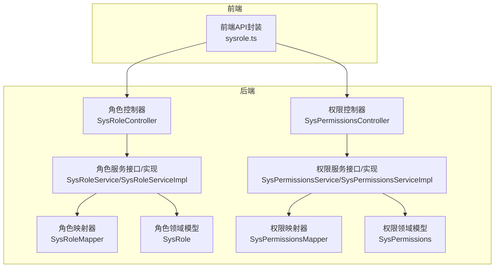
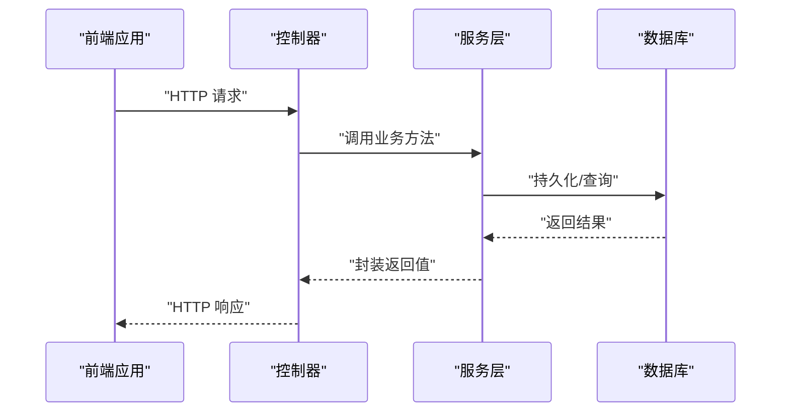
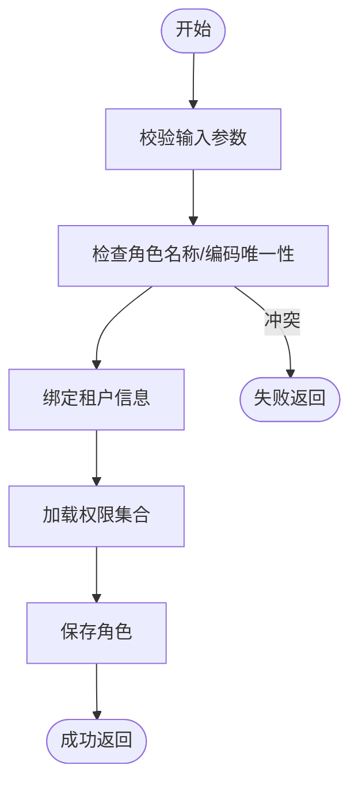
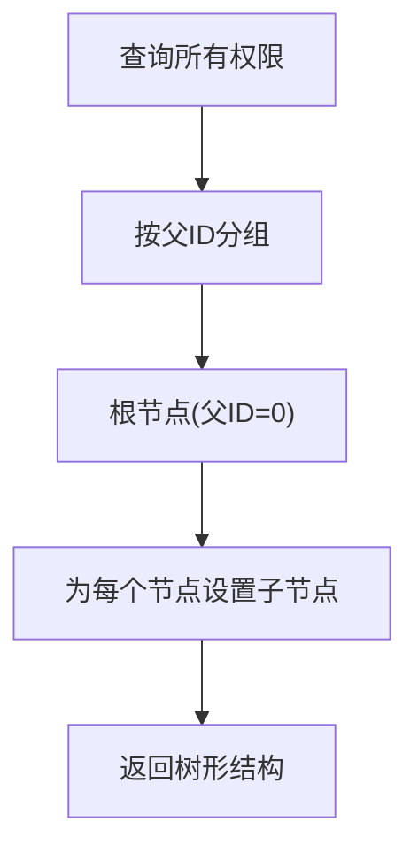
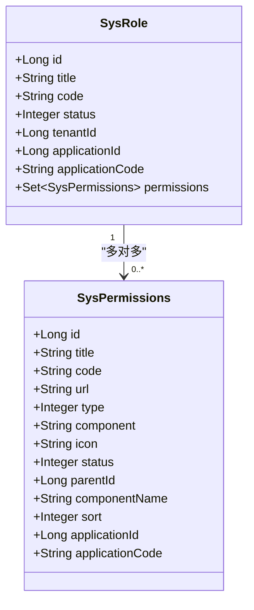
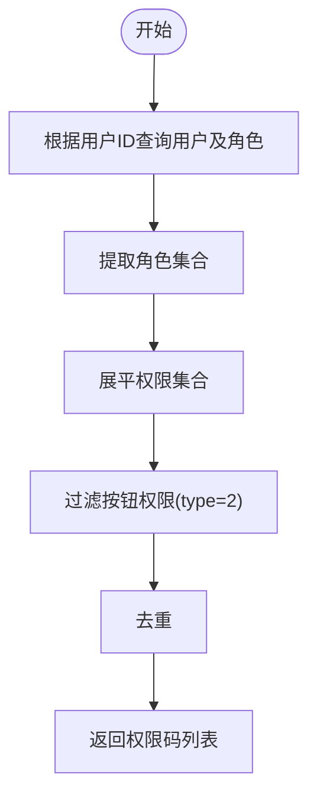
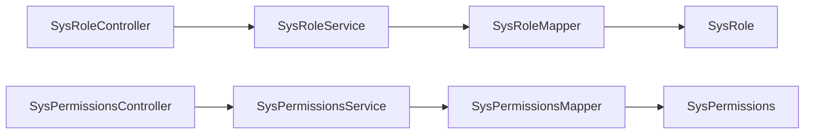

# 角色权限API

<cite>
**本文档引用的文件**
- [SysRoleController.java](file://run-admin/src/main/java/com/fastproject/module/system/controller/SysRoleController.java)
- [SysPermissionsController.java](file://run-admin/src/main/java/com/fastproject/module/system/controller/SysPermissionsController.java)
- [SysRoleService.java](file://system-module/src/main/java/com/fastproject/system/service/SysRoleService.java)
- [SysPermissionsService.java](file://system-module/src/main/java/com/fastproject/system/service/SysPermissionsService.java)
- [SysRoleServiceImpl.java](file://system-module/src/main/java/com/fastproject/system/service/impl/SysRoleServiceImpl.java)
- [SysPermissionsServiceImpl.java](file://system-module/src/main/java/com/fastproject/system/service/impl/SysPermissionsServiceImpl.java)
- [SysRole.java](file://system-module/src/main/java/com/fastproject/system/domain/SysRole.java)
- [SysPermissions.java](file://system-module/src/main/java/com/fastproject/system/domain/SysPermissions.java)
- [SysRoleMapper.java](file://system-module/src/main/java/com/fastproject/system/mapper/SysRoleMapper.java)
- [SysPermissionsMapper.java](file://system-module/src/main/java/com/fastproject/system/mapper/SysPermissionsMapper.java)
- [SysRoleVo.java](file://system-module/src/main/java/com/fastproject/system/vo/role/SysRoleVo.java)
- [SysPermissionsVo.java](file://system-module/src/main/java/com/fastproject/system/vo/permissions/SysPermissionsVo.java)
- [sysrole.ts](file://fast-ui/apps/admin-vue/src/api/system/sysrole.ts)
</cite>

## 目录
1. [简介](#简介)
2. [项目结构](#项目结构)
3. [核心组件](#核心组件)
4. [架构总览](#架构总览)
5. [详细组件分析](#详细组件分析)
6. [依赖关系分析](#依赖关系分析)
7. [性能考虑](#性能考虑)
8. [故障排查指南](#故障排查指南)
9. [结论](#结论)

## 简介
本文件为角色权限管理模块的完整API文档，覆盖角色管理、权限分配、菜单权限控制等核心功能。内容包括：
- 角色CRUD操作与分页查询
- 角色与权限的关联管理
- 权限资源管理与树形结构查询
- 菜单权限配置与动态权限控制
- 权限验证机制、租户隔离、幂等性保障
- 审计日志与错误处理规范

## 项目结构
角色权限模块由后端控制器、服务层、数据访问层与前端API封装组成，采用分层架构设计，职责清晰、耦合度低。

图表来源
- [SysRoleController.java](file://run-admin/src/main/java/com/fastproject/module/system/controller/SysRoleController.java#L21-L98)
- [SysPermissionsController.java](file://run-admin/src/main/java/com/fastproject/module/system/controller/SysPermissionsController.java#L20-L98)
- [SysRoleService.java](file://system-module/src/main/java/com/fastproject/system/service/SysRoleService.java#L12-L51)
- [SysPermissionsService.java](file://system-module/src/main/java/com/fastproject/system/service/SysPermissionsService.java#L11-L65)
- [SysRoleMapper.java](file://system-module/src/main/java/com/fastproject/system/mapper/SysRoleMapper.java#L14-L30)
- [SysPermissionsMapper.java](file://system-module/src/main/java/com/fastproject/system/mapper/SysPermissionsMapper.java#L13-L27)
- [SysRole.java](file://system-module/src/main/java/com/fastproject/system/domain/SysRole.java#L14-L58)
- [SysPermissions.java](file://system-module/src/main/java/com/fastproject/system/domain/SysPermissions.java#L11-L77)

章节来源
- [SysRoleController.java](file://run-admin/src/main/java/com/fastproject/module/system/controller/SysRoleController.java#L21-L98)
- [SysPermissionsController.java](file://run-admin/src/main/java/com/fastproject/module/system/controller/SysPermissionsController.java#L20-L98)

## 核心组件
- 角色控制器：提供角色的增删改查、分页查询、全量选择等REST接口，并集成权限校验与审计日志。
- 权限控制器：提供权限的增删改查、分页查询、树形结构查询等REST接口，并集成权限校验与审计日志。
- 角色服务：负责角色业务逻辑，包括租户隔离、唯一性校验、权限集合更新、分页查询等。
- 权限服务：负责权限业务逻辑，包括树形构建、用户权限聚合、按钮权限过滤等。
- 映射器：负责领域模型与VO之间的转换。
- 前端API封装：定义请求参数与响应类型，统一调用后端接口。

章节来源
- [SysRoleService.java](file://system-module/src/main/java/com/fastproject/system/service/SysRoleService.java#L12-L51)
- [SysPermissionsService.java](file://system-module/src/main/java/com/fastproject/system/service/SysPermissionsService.java#L11-L65)
- [SysRoleMapper.java](file://system-module/src/main/java/com/fastproject/system/mapper/SysRoleMapper.java#L14-L30)
- [SysPermissionsMapper.java](file://system-module/src/main/java/com/fastproject/system/mapper/SysPermissionsMapper.java#L13-L27)
- [sysrole.ts](file://fast-ui/apps/admin-vue/src/api/system/sysrole.ts#L1-L100)

## 架构总览
系统通过Spring MVC控制器暴露REST接口，使用Spring Security进行权限校验，结合审计注解记录操作日志，服务层执行业务逻辑并进行租户隔离与幂等性控制。

图表来源
- [SysRoleController.java](file://run-admin/src/main/java/com/fastproject/module/system/controller/SysRoleController.java#L39-L57)
- [SysPermissionsController.java](file://run-admin/src/main/java/com/fastproject/module/system/controller/SysPermissionsController.java#L29-L46)
- [SysRoleServiceImpl.java](file://system-module/src/main/java/com/fastproject/system/service/impl/SysRoleServiceImpl.java#L67-L88)
- [SysPermissionsServiceImpl.java](file://system-module/src/main/java/com/fastproject/system/service/impl/SysPermissionsServiceImpl.java#L47-L53)

## 详细组件分析

### 角色管理API
- 接口路径与方法
  - GET /sys/role/selectAll：获取角色下拉列表（用于选择框）
  - POST /sys/role：新增角色
  - PUT /sys/role：修改角色
  - DELETE /sys/role/{id}：删除角色
  - DELETE /sys/role/batch：批量删除角色
  - POST /sys/role/page：分页查询角色
  - GET /sys/role/{id}：获取角色详情

- 权限校验
  - 新增/修改/删除/分页查询均需相应权限标识，如 admin:system:role:add、admin:system:role:update、admin:system:role:delete、admin:system:role:page。

- 幂等性与审计
  - 新增与修改接口使用幂等注解，防止重复提交；所有写操作均记录业务日志。

- 请求参数与响应格式
  - 新增/修改请求体：SysRoleCreate/SysRoleUpdate
  - 分页查询请求体：SysRoleQuery
  - 响应体：ResultVo<PageVo<List<SysRoleVo>>> 或 ResultVo<SysRoleVo>

- 关键流程图（新增角色）

图表来源
- [SysRoleServiceImpl.java](file://system-module/src/main/java/com/fastproject/system/service/impl/SysRoleServiceImpl.java#L67-L88)
- [SysRoleController.java](file://run-admin/src/main/java/com/fastproject/module/system/controller/SysRoleController.java#L39-L45)

章节来源
- [SysRoleController.java](file://run-admin/src/main/java/com/fastproject/module/system/controller/SysRoleController.java#L27-L98)
- [SysRoleService.java](file://system-module/src/main/java/com/fastproject/system/service/SysRoleService.java#L12-L51)
- [SysRoleServiceImpl.java](file://system-module/src/main/java/com/fastproject/system/service/impl/SysRoleServiceImpl.java#L51-L183)
- [SysRoleVo.java](file://system-module/src/main/java/com/fastproject/system/vo/role/SysRoleVo.java#L10-L47)
- [sysrole.ts](file://fast-ui/apps/admin-vue/src/api/system/sysrole.ts#L47-L100)

### 权限管理API
- 接口路径与方法
  - POST /sys/permissions：新增权限
  - PUT /sys/permissions：修改权限
  - DELETE /sys/permissions/{id}：删除权限
  - DELETE /sys/permissions/batch：批量删除权限
  - POST /sys/permissions/page：分页查询权限
  - GET /sys/permissions/{id}：获取权限详情
  - GET /sys/permissions/tree：获取权限树形结构

- 权限校验
  - 新增/修改/删除/分页查询均需相应权限标识，如 admin:system:permissions:add、admin:system:permissions:update、admin:system:permissions:delete、admin:system:permissions:page。

- 树形结构
  - 通过findTree构建权限树，支持父子关系与排序字段。

- 关键流程图（树形构建）

图表来源
- [SysPermissionsServiceImpl.java](file://system-module/src/main/java/com/fastproject/system/service/impl/SysPermissionsServiceImpl.java#L122-L136)

章节来源
- [SysPermissionsController.java](file://run-admin/src/main/java/com/fastproject/module/system/controller/SysPermissionsController.java#L26-L97)
- [SysPermissionsService.java](file://system-module/src/main/java/com/fastproject/system/service/SysPermissionsService.java#L11-L65)
- [SysPermissionsServiceImpl.java](file://system-module/src/main/java/com/fastproject/system/service/impl/SysPermissionsServiceImpl.java#L46-L182)
- [SysPermissionsVo.java](file://system-module/src/main/java/com/fastproject/system/vo/permissions/SysPermissionsVo.java#L10-L82)

### 角色与权限关联
- 关联关系
  - 角色与权限为多对多关系，通过中间表 sys_role_permissions 维护。
  - 角色实体中包含权限集合，查询时可直接获取权限ID列表。

- 动态权限控制
  - 通过用户-角色-权限链路，计算用户的所有授权码与按钮权限，支持前端菜单与按钮级别的动态展示。

- 关联关系类图

图表来源
- [SysRole.java](file://system-module/src/main/java/com/fastproject/system/domain/SysRole.java#L51-L57)
- [SysPermissions.java](file://system-module/src/main/java/com/fastproject/system/domain/SysPermissions.java#L11-L77)

章节来源
- [SysRole.java](file://system-module/src/main/java/com/fastproject/system/domain/SysRole.java#L51-L57)
- [SysPermissionsServiceImpl.java](file://system-module/src/main/java/com/fastproject/system/service/impl/SysPermissionsServiceImpl.java#L138-L181)

### 菜单权限控制与动态权限
- 按钮权限过滤
  - 通过类型字段区分权限类型，按钮权限(type=2)用于前端按钮级权限控制。

- 用户权限聚合
  - 提供按用户聚合的全部权限码与树形权限，便于前端路由与菜单渲染。

- 流程图（用户按钮权限获取）

图表来源
- [SysPermissionsServiceImpl.java](file://system-module/src/main/java/com/fastproject/system/service/impl/SysPermissionsServiceImpl.java#L138-L150)

章节来源
- [SysPermissionsServiceImpl.java](file://system-module/src/main/java/com/fastproject/system/service/impl/SysPermissionsServiceImpl.java#L138-L181)

### 权限验证机制与租户隔离
- 权限验证
  - 控制器方法使用 @PreAuthorize 进行权限校验，基于表达式 @ps.hasPermission(...) 实现细粒度权限控制。

- 租户隔离
  - 服务层通过 TenantAccessSupport 应用租户条件，确保查询与操作仅限当前租户范围。

- 幂等性
  - 使用 @Idempotent 注解防止重复提交，提升用户体验与数据一致性。

章节来源
- [SysRoleController.java](file://run-admin/src/main/java/com/fastproject/module/system/controller/SysRoleController.java#L30-L34)
- [SysPermissionsController.java](file://run-admin/src/main/java/com/fastproject/module/system/controller/SysPermissionsController.java#L29-L33)
- [SysRoleServiceImpl.java](file://system-module/src/main/java/com/fastproject/system/service/impl/SysRoleServiceImpl.java#L52-L63)
- [SysPermissionsServiceImpl.java](file://system-module/src/main/java/com/fastproject/system/service/impl/SysPermissionsServiceImpl.java#L46-L53)

### 审计日志与错误处理
- 审计日志
  - 使用 @Log 注解记录业务操作，包含操作类型与动作，便于审计追踪。

- 错误处理
  - 服务层抛出业务异常时，统一由全局异常处理器转换为标准响应格式。

章节来源
- [SysRoleController.java](file://run-admin/src/main/java/com/fastproject/module/system/controller/SysRoleController.java#L41-L42)
- [SysPermissionsController.java](file://run-admin/src/main/java/com/fastproject/module/system/controller/SysPermissionsController.java#L32-L33)
- [SysRoleServiceImpl.java](file://system-module/src/main/java/com/fastproject/system/service/impl/SysRoleServiceImpl.java#L72-L77)
- [SysPermissionsServiceImpl.java](file://system-module/src/main/java/com/fastproject/system/service/impl/SysPermissionsServiceImpl.java#L59-L62)

## 依赖关系分析
- 控制器依赖服务接口，服务实现依赖仓库与映射器，映射器负责领域模型与VO转换。
- 角色与权限通过多对多关联，形成用户-角色-权限的权限链路。

图表来源
- [SysRoleController.java](file://run-admin/src/main/java/com/fastproject/module/system/controller/SysRoleController.java#L21-L25)
- [SysPermissionsController.java](file://run-admin/src/main/java/com/fastproject/module/system/controller/SysPermissionsController.java#L20-L24)
- [SysRoleMapper.java](file://system-module/src/main/java/com/fastproject/system/mapper/SysRoleMapper.java#L14-L30)
- [SysPermissionsMapper.java](file://system-module/src/main/java/com/fastproject/system/mapper/SysPermissionsMapper.java#L13-L27)

章节来源
- [SysRoleMapper.java](file://system-module/src/main/java/com/fastproject/system/mapper/SysRoleMapper.java#L14-L30)
- [SysPermissionsMapper.java](file://system-module/src/main/java/com/fastproject/system/mapper/SysPermissionsMapper.java#L13-L27)

## 性能考虑
- 分页查询：使用分页参数避免一次性加载大量数据，降低内存压力。
- 懒加载与EAGER：角色权限集合使用EAGER加载，减少N+1查询问题；如需优化可考虑分步加载策略。
- 树形构建：权限树在内存中构建，建议限制权限总量或增加缓存。
- 幂等性：通过请求ID去重，减少重复写入带来的数据库压力。

## 故障排查指南
- 常见错误
  - 角色名称/编码重复：服务层会抛出业务异常，需调整名称或编码。
  - 无权限访问：检查权限标识是否正确配置，确认用户具备相应权限。
  - 无租户数据：确认当前租户上下文是否正确设置。

- 排查步骤
  - 查看控制器日志与审计日志，定位具体操作。
  - 检查服务层异常堆栈，确认业务规则触发点。
  - 验证前端请求参数与响应格式，确保与接口定义一致。

章节来源
- [SysRoleServiceImpl.java](file://system-module/src/main/java/com/fastproject/system/service/impl/SysRoleServiceImpl.java#L72-L77)
- [SysPermissionsServiceImpl.java](file://system-module/src/main/java/com/fastproject/system/service/impl/SysPermissionsServiceImpl.java#L59-L62)

## 结论
本角色权限API文档提供了从接口定义到实现细节的完整说明，涵盖角色管理、权限分配、菜单权限控制、动态权限与审计追踪等关键能力。通过清晰的分层架构与完善的权限校验机制，系统能够稳定支撑多租户场景下的权限管理需求。