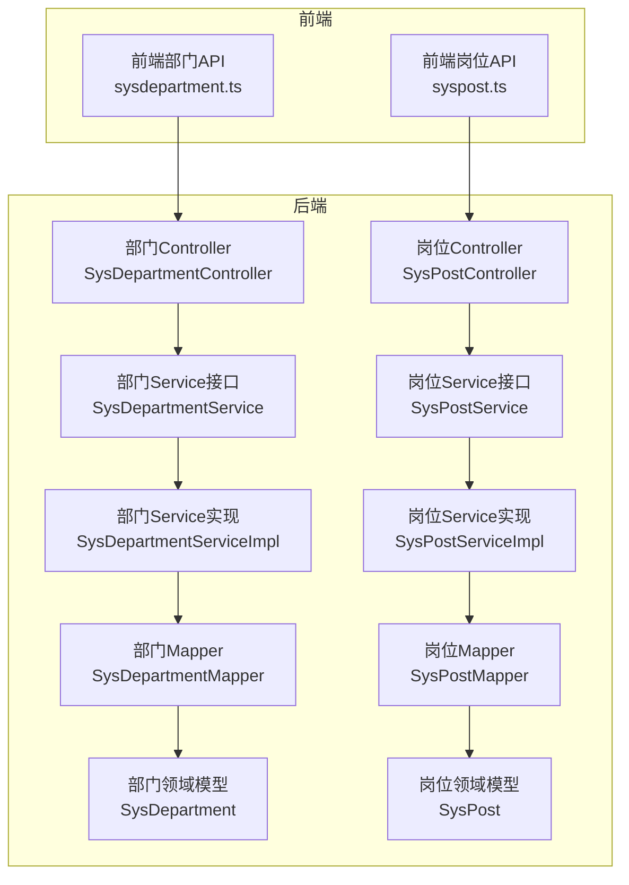
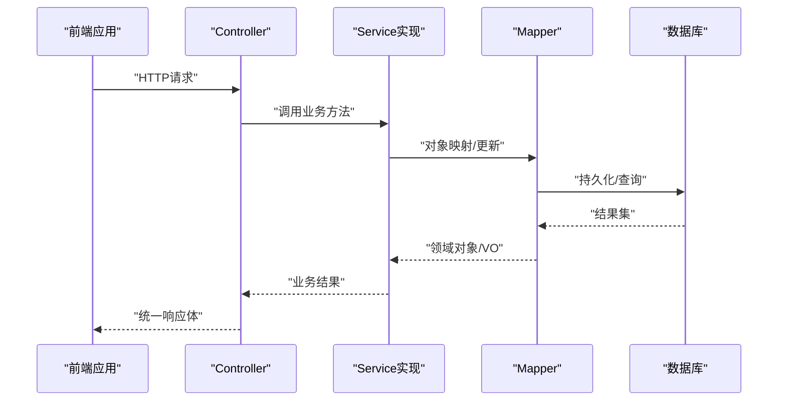
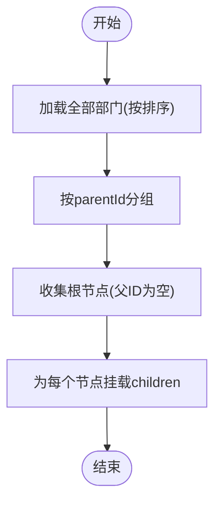

# 部门岗位API

<cite>
**本文引用的文件**
- [SysDepartmentController.java](file://run-admin/src/main/java/com//fastproject/module/system/controller/SysDepartmentController.java)
- [SysPostController.java](file://run-admin/src/main/java/com/ fastproject/module/system/controller/SysPostController.java)
- [SysDepartmentService.java](file://system-module/src/main/java/com/ fastproject/system/service/SysDepartmentService.java)
- [SysPostService.java](file://system-module/src/main/java/com/ fastproject/system/service/SysPostService.java)
- [SysDepartmentServiceImpl.java](file://system-module/src/main/java/com/ fastproject/system/service/impl/SysDepartmentServiceImpl.java)
- [SysPostServiceImpl.java](file://system-module/src/main/java/com/ fastproject/system/service/impl/SysPostServiceImpl.java)
- [SysDepartmentVo.java](file://system-module/src/main/java/com/ fastproject/system/vo/department/SysDepartmentVo.java)
- [SysPostVo.java](file://system-module/src/main/java/com/ fastproject/system/vo/post/SysPostVo.java)
- [SysDepartment.java](file://system-module/src/main/java/com/ fastproject/system/domain/SysDepartment.java)
- [SysPost.java](file://system-module/src/main/java/com/ fastproject/system/domain/SysPost.java)
- [SysDepartmentMapper.java](file://system-module/src/main/java/com/ fastproject/system/mapper/SysDepartmentMapper.java)
- [SysPostMapper.java](file://system-module/src/main/java/com/ fastproject/system/mapper/SysPostMapper.java)
- [sysdepartment.ts](file://fast-ui/apps/admin-vue/src/api/system/sysdepartment.ts)
- [syspost.ts](file://fast-ui/apps/admin-vue/src/api/system/syspost.ts)
</cite>

## 目录
1. [简介](#简介)
2. [项目结构](#项目结构)
3. [核心组件](#核心组件)
4. [架构总览](#架构总览)
5. [详细组件分析](#详细组件分析)
6. [依赖关系分析](#依赖关系分析)
7. [性能考虑](#性能考虑)
8. [故障排查指南](#故障排查指南)
9. [结论](#结论)
10. [附录](#附录)

## 简介
本文件为“部门岗位管理模块”的详细API文档，覆盖组织架构管理、部门树形结构操作、岗位配置管理等能力。内容包含部门与岗位的增删改查、分页查询、树形结构查询、全量列表查询、选择框使用接口，以及权限控制与数据一致性保障机制。同时提供接口调用示例与常见错误处理建议。

## 项目结构
后端采用Spring Boot + JPA架构，前端基于Vue 3 + TypeScript。系统模块化清晰，部门与岗位功能分别由独立的Controller、Service、Mapper与VO/Domain组成，并通过统一的结果封装返回。



图表来源
- [SysDepartmentController.java](file://run-admin/src/main/java/com/ fastproject/module/system/controller/SysDepartmentController.java#L23-L109)
- [SysPostController.java](file://run-admin/src/main/java/com/ fastproject/module/system/controller/SysPostController.java#L23-L109)
- [SysDepartmentService.java](file://system-module/src/main/java/com/ fastproject/system/service/SysDepartmentService.java#L14-L55)
- [SysPostService.java](file://system-module/src/main/java/com/ fastproject/system/service/SysPostService.java#L14-L55)
- [SysDepartmentServiceImpl.java](file://system-module/src/main/java/com/ fastproject/system/service/impl/SysDepartmentServiceImpl.java#L36-L185)
- [SysPostServiceImpl.java](file://system-module/src/main/java/com/ fastproject/system/service/impl/SysPostServiceImpl.java#L34-L157)
- [SysDepartmentMapper.java](file://system-module/src/main/java/com/ fastproject/system/mapper/SysDepartmentMapper.java#L17-L27)
- [SysPostMapper.java](file://system-module/src/main/java/com/ fastproject/system/mapper/SysPostMapper.java#L17-L27)
- [SysDepartment.java](file://system-module/src/main/java/com/ fastproject/system/domain/SysDepartment.java#L18-L59)
- [SysPost.java](file://system-module/src/main/java/com/ fastproject/system/domain/SysPost.java#L18-L49)

章节来源
- [SysDepartmentController.java](file://run-admin/src/main/java/com/ fastproject/module/system/controller/SysDepartmentController.java#L23-L109)
- [SysPostController.java](file://run-admin/src/main/java/com/ fastproject/module/system/controller/SysPostController.java#L23-L109)

## 核心组件
- 部门Controller：提供部门的新增、修改、删除、批量删除、分页、详情、树形查询、全量查询等REST接口。
- 岗位Controller：提供岗位的新增、修改、删除、批量删除、分页、详情、列表查询、全量查询等REST接口。
- Service层：负责业务逻辑、参数校验、租户隔离、树形构建、分页查询条件拼装等。
- Mapper层：负责VO与Domain之间的映射转换。
- VO/Domain：定义对外传输对象与数据库持久化对象，含字段约束与租户字段。

章节来源
- [SysDepartmentService.java](file://system-module/src/main/java/com/ fastproject/system/service/SysDepartmentService.java#L14-L55)
- [SysPostService.java](file://system-module/src/main/java/com/ fastproject/system/service/SysPostService.java#L14-L55)
- [SysDepartmentServiceImpl.java](file://system-module/src/main/java/com/ fastproject/system/service/impl/SysDepartmentServiceImpl.java#L36-L185)
- [SysPostServiceImpl.java](file://system-module/src/main/java/com/ fastproject/system/service/impl/SysPostServiceImpl.java#L34-L157)
- [SysDepartmentVo.java](file://system-module/src/main/java/com/ fastproject/system/vo/department/SysDepartmentVo.java#L11-L57)
- [SysPostVo.java](file://system-module/src/main/java/com/ fastproject/system/vo/post/SysPostVo.java#L9-L40)
- [SysDepartment.java](file://system-module/src/main/java/com/ fastproject/system/domain/SysDepartment.java#L18-L59)
- [SysPost.java](file://system-module/src/main/java/com/ fastproject/system/domain/SysPost.java#L18-L49)

## 架构总览
部门与岗位模块遵循典型的分层架构：前端通过HTTP请求调用后端Controller；Controller委托Service执行业务；Service通过Mapper完成对象映射并访问Repository进行数据持久化；系统通过注解实现幂等性、日志与权限控制。



图表来源
- [SysDepartmentController.java](file://run-admin/src/main/java/com/ fastproject/module/system/controller/SysDepartmentController.java#L33-L91)
- [SysPostController.java](file://run-admin/src/main/java/com/ fastproject/module/system/controller/SysPostController.java#L33-L91)
- [SysDepartmentServiceImpl.java](file://system-module/src/main/java/com/ fastproject/system/service/impl/SysDepartmentServiceImpl.java#L44-L74)
- [SysPostServiceImpl.java](file://system-module/src/main/java/com/ fastproject/system/service/impl/SysPostServiceImpl.java#L42-L75)
- [SysDepartmentMapper.java](file://system-module/src/main/java/com/ fastproject/system/mapper/SysDepartmentMapper.java#L19-L26)
- [SysPostMapper.java](file://system-module/src/main/java/com/ fastproject/system/mapper/SysPostMapper.java#L19-L26)

## 详细组件分析

### 部门管理API
- 基础路径：/sys/department
- 权限注解：@PreAuthorize限制具体操作权限点
- 幂等性：使用@Idempotent避免重复提交
- 日志：@Log记录业务类型与动作

接口清单
- POST /sys/department
  - 功能：新增部门
  - 权限：admin:system:department:add
  - 请求体：SysDepartmentCreate
  - 返回：ResultVo<Object>，包含新增ID
  - 幂等键前缀：add:sys:department:
  - 章节来源
    - [SysDepartmentController.java](file://run-admin/src/main/java/com/ fastproject/module/system/controller/SysDepartmentController.java#L33-L39)
    - [SysDepartmentServiceImpl.java](file://system-module/src/main/java/com/ fastproject/system/service/impl/SysDepartmentServiceImpl.java#L44-L56)

- PUT /sys/department
  - 功能：修改部门
  - 权限：admin:system:department:update
  - 请求体：SysDepartmentUpdate
  - 返回：ResultVo<Object>
  - 幂等键前缀：update:sys:department:
  - 章节来源
    - [SysDepartmentController.java](file://run-admin/src/main/java/com/ fastproject/module/system/controller/SysDepartmentController.java#L44-L51)
    - [SysDepartmentServiceImpl.java](file://system-module/src/main/java/com/ fastproject/system/service/impl/SysDepartmentServiceImpl.java#L59-L74)

- DELETE /sys/department/{id}
  - 功能：删除部门（单个）
  - 权限：admin:system:department:delete
  - 路径参数：id
  - 返回：ResultVo<Object>
  - 章节来源
    - [SysDepartmentController.java](file://run-admin/src/main/java/com/ fastproject/module/system/controller/SysDepartmentController.java#L56-L62)
    - [SysDepartmentServiceImpl.java](file://system-module/src/main/java/com/ fastproject/system/service/impl/SysDepartmentServiceImpl.java#L77-L91)

- DELETE /sys/department/batch
  - 功能：批量删除部门
  - 权限：admin:system:department:delete
  - 请求体：List<Long> ids
  - 返回：ResultVo<Object>
  - 章节来源
    - [SysDepartmentController.java](file://run-admin/src/main/java/com/ fastproject/module/system/controller/SysDepartmentController.java#L67-L73)
    - [SysDepartmentServiceImpl.java](file://system-module/src/main/java/com/ fastproject/system/service/impl/SysDepartmentServiceImpl.java#L94-L111)

- POST /sys/department/page
  - 功能：分页查询部门
  - 权限：admin:system:department:page
  - 请求体：SysDepartmentQuery
  - 返回：ResultVo<PageVo<List<SysDepartmentVo>>>
  - 章节来源
    - [SysDepartmentController.java](file://run-admin/src/main/java/com/ fastproject/module/system/controller/SysDepartmentController.java#L78-L82)
    - [SysDepartmentServiceImpl.java](file://system-module/src/main/java/com/ fastproject/system/service/impl/SysDepartmentServiceImpl.java#L125-L148)

- GET /sys/department/{id}
  - 功能：按ID查询部门详情
  - 权限：admin:system:department:page
  - 路径参数：id
  - 返回：ResultVo<SysDepartmentVo>
  - 章节来源
    - [SysDepartmentController.java](file://run-admin/src/main/java/com/ fastproject/module/system/controller/SysDepartmentController.java#L87-L91)
    - [SysDepartmentServiceImpl.java](file://system-module/src/main/java/com/ fastproject/system/service/impl/SysDepartmentServiceImpl.java#L114-L122)

- GET /sys/department/tree
  - 功能：查询部门树形结构
  - 权限：admin:system:department:page
  - 返回：ResultVo<List<SysDepartmentVo>>
  - 章节来源
    - [SysDepartmentController.java](file://run-admin/src/main/java/com/ fastproject/module/system/controller/SysDepartmentController.java#L96-L100)
    - [SysDepartmentServiceImpl.java](file://system-module/src/main/java/com/ fastproject/system/service/impl/SysDepartmentServiceImpl.java#L150-L172)

- GET /sys/department/selectAll
  - 功能：查询所有正常状态的部门（树形），用于选择框
  - 返回：ResultVo<List<SysDepartmentVo>>
  - 章节来源
    - [SysDepartmentController.java](file://run-admin/src/main/java/com/ fastproject/module/system/controller/SysDepartmentController.java#L105-L108)
    - [SysDepartmentServiceImpl.java](file://system-module/src/main/java/com/ fastproject/system/service/impl/SysDepartmentServiceImpl.java#L162-L172)

前端调用示例（参考路径）
- 新增部门：sysdepartment.ts 的 createDepartment
- 修改部门：sysdepartment.ts 的 updateDepartment
- 删除部门：sysdepartment.ts 的 deleteDepartment
- 批量删除：sysdepartment.ts 的 batchDeleteDepartment
- 分页查询：sysdepartment.ts 的 getDepartmentPage
- 树形查询：sysdepartment.ts 的 getDepartmentTree
- 全量选择：sysdepartment.ts 的 getDepartmentSelectAll
- 章节来源
  - [sysdepartment.ts](file://fast-ui/apps/admin-vue/src/api/system/sysdepartment.ts#L62-L107)

数据模型与复杂度
- 部门树形构建：基于父ID分组，时间复杂度O(n)，空间复杂度O(n)
- 分页查询：基于Specification动态拼接过滤条件，支持租户隔离
- 章节来源
  - [SysDepartmentServiceImpl.java](file://system-module/src/main/java/com/ fastproject/system/service/impl/SysDepartmentServiceImpl.java#L177-L184)
  - [SysDepartmentServiceImpl.java](file://system-module/src/main/java/com/ fastproject/system/service/impl/SysDepartmentServiceImpl.java#L125-L148)



图表来源
- [SysDepartmentServiceImpl.java](file://system-module/src/main/java/com/ fastproject/system/service/impl/SysDepartmentServiceImpl.java#L177-L184)

章节来源
- [SysDepartmentController.java](file://run-admin/src/main/java/com/ fastproject/module/system/controller/SysDepartmentController.java#L33-L108)
- [SysDepartmentServiceImpl.java](file://system-module/src/main/java/com/ fastproject/system/service/impl/SysDepartmentServiceImpl.java#L44-L185)
- [SysDepartmentVo.java](file://system-module/src/main/java/com/ fastproject/system/vo/department/SysDepartmentVo.java#L11-L57)
- [SysDepartment.java](file://system-module/src/main/java/com/ fastproject/system/domain/SysDepartment.java#L18-L59)
- [sysdepartment.ts](file://fast-ui/apps/admin-vue/src/api/system/sysdepartment.ts#L47-L107)

### 岗位管理API
- 基础路径：/sys/post
- 权限注解：@PreAuthorize限制具体操作权限点
- 幂等性：使用@Idempotent避免重复提交
- 日志：@Log记录业务类型与动作

接口清单
- POST /sys/post
  - 功能：新增岗位
  - 权限：admin:system:post:add
  - 请求体：SysPostCreate
  - 返回：ResultVo<Object>，包含新增ID
  - 幂等键前缀：add:sys:post:
  - 章节来源
    - [SysPostController.java](file://run-admin/src/main/java/com/ fastproject/module/system/controller/SysPostController.java#L33-L39)
    - [SysPostServiceImpl.java](file://system-module/src/main/java/com/ fastproject/system/service/impl/SysPostServiceImpl.java#L42-L56)

- PUT /sys/post
  - 功能：修改岗位
  - 权限：admin:system:post:update
  - 请求体：SysPostUpdate
  - 返回：ResultVo<Object>
  - 幂等键前缀：update:sys:post:
  - 章节来源
    - [SysPostController.java](file://run-admin/src/main/java/com/ fastproject/module/system/controller/SysPostController.java#L44-L51)
    - [SysPostServiceImpl.java](file://system-module/src/main/java/com/ fastproject/system/service/impl/SysPostServiceImpl.java#L59-L75)

- DELETE /sys/post/{id}
  - 功能：删除岗位（单个）
  - 权限：admin:system:post:delete
  - 路径参数：id
  - 返回：ResultVo<Object>
  - 章节来源
    - [SysPostController.java](file://run-admin/src/main/java/com/ fastproject/module/system/controller/SysPostController.java#L56-L62)
    - [SysPostServiceImpl.java](file://system-module/src/main/java/com/ fastproject/system/service/impl/SysPostServiceImpl.java#L78-L84)

- DELETE /sys/post/batch
  - 功能：批量删除岗位
  - 权限：admin:system:post:delete
  - 请求体：List<Long> ids
  - 返回：ResultVo<Object>
  - 章节来源
    - [SysPostController.java](file://run-admin/src/main/java/com/ fastproject/module/system/controller/SysPostController.java#L67-L73)
    - [SysPostServiceImpl.java](file://system-module/src/main/java/com/ fastproject/system/service/impl/SysPostServiceImpl.java#L87-L95)

- POST /sys/post/page
  - 功能：分页查询岗位
  - 权限：admin:system:post:page
  - 请求体：SysPostQuery
  - 返回：ResultVo<PageVo<List<SysPostVo>>>
  - 章节来源
    - [SysPostController.java](file://run-admin/src/main/java/com/ fastproject/module/system/controller/SysPostController.java#L78-L82)
    - [SysPostServiceImpl.java](file://system-module/src/main/java/com/ fastproject/system/service/impl/SysPostServiceImpl.java#L109-L132)

- GET /sys/post/{id}
  - 功能：按ID查询岗位详情
  - 权限：admin:system:post:page
  - 路径参数：id
  - 返回：ResultVo<SysPostVo>
  - 章节来源
    - [SysPostController.java](file://run-admin/src/main/java/com/ fastproject/module/system/controller/SysPostController.java#L87-L91)
    - [SysPostServiceImpl.java](file://system-module/src/main/java/com/ fastproject/system/service/impl/SysPostServiceImpl.java#L98-L106)

- GET /sys/post/list
  - 功能：查询所有岗位（列表）
  - 权限：admin:system:post:page
  - 返回：ResultVo<List<SysPostVo>>
  - 章节来源
    - [SysPostController.java](file://run-admin/src/main/java/com/ fastproject/module/system/controller/SysPostController.java#L96-L100)
    - [SysPostServiceImpl.java](file://system-module/src/main/java/com/ fastproject/system/service/impl/SysPostServiceImpl.java#L135-L143)

- GET /sys/post/selectAll
  - 功能：查询所有正常状态的岗位，用于选择框
  - 返回：ResultVo<List<SysPostVo>>
  - 章节来源
    - [SysPostController.java](file://run-admin/src/main/java/com/ fastproject/module/system/controller/SysPostController.java#L105-L108)
    - [SysPostServiceImpl.java](file://system-module/src/main/java/com/ fastproject/system/service/impl/SysPostServiceImpl.java#L146-L156)

前端调用示例（参考路径）
- 新增岗位：syspost.ts 的 createPost
- 修改岗位：syspost.ts 的 updatePost
- 删除岗位：syspost.ts 的 deletePost
- 批量删除：syspost.ts 的 batchDelete
- 分页查询：syspost.ts 的 getPostPage
- 列表查询：syspost.ts 的 getPostList
- 全量选择：syspost.ts 的 getPostSelectAll
- 章节来源
  - [syspost.ts](file://fast-ui/apps/admin-vue/src/api/system/syspost.ts#L58-L81)

数据模型与复杂度
- 岗位列表查询：基于Specification动态拼接过滤条件，支持租户隔离
- 章节来源
  - [SysPostServiceImpl.java](file://system-module/src/main/java/com/ fastproject/system/service/impl/SysPostServiceImpl.java#L109-L156)
  - [SysPostVo.java](file://system-module/src/main/java/com/ fastproject/system/vo/post/SysPostVo.java#L9-L40)
  - [SysPost.java](file://system-module/src/main/java/com/ fastproject/system/domain/SysPost.java#L18-L49)

章节来源
- [SysPostController.java](file://run-admin/src/main/java/com/ fastproject/module/system/controller/SysPostController.java#L33-L109)
- [SysPostServiceImpl.java](file://system-module/src/main/java/com/ fastproject/system/service/impl/SysPostServiceImpl.java#L42-L157)
- [SysPostVo.java](file://system-module/src/main/java/com/ fastproject/system/vo/post/SysPostVo.java#L9-L40)
- [SysPost.java](file://system-module/src/main/java/com/ fastproject/system/domain/SysPost.java#L18-L49)
- [syspost.ts](file://fast-ui/apps/admin-vue/src/api/system/syspost.ts#L43-L81)

### 组织架构变更的权限控制与数据一致性
- 权限控制
  - 使用Spring Security的@PreAuthorize结合自定义权限表达式，确保只有具备相应权限的用户才能执行新增、修改、删除、分页等操作。
  - 章节来源
    - [SysDepartmentController.java](file://run-admin/src/main/java/com/ fastproject/module/system/controller/SysDepartmentController.java#L34-L69)
    - [SysPostController.java](file://run-admin/src/main/java/com/ fastproject/module/system/controller/SysPostController.java#L34-L69)

- 数据一致性与租户隔离
  - 通过TenantAccessSupport在保存、更新、删除、查询时绑定或检查租户上下文，确保数据仅对当前租户可见与可操作。
  - 使用@SQLDelete与@SQLRestriction实现软删除与默认过滤，避免物理删除造成的数据丢失与关联破坏。
  - 章节来源
    - [SysDepartmentServiceImpl.java](file://system-module/src/main/java/com/ fastproject/system/service/impl/SysDepartmentServiceImpl.java#L46-L54)
    - [SysPostServiceImpl.java](file://system-module/src/main/java/com/ fastproject/system/service/impl/SysPostServiceImpl.java#L44-L54)
    - [SysDepartment.java](file://system-module/src/main/java/com/ fastproject/system/domain/SysDepartment.java#L16-L17)
    - [SysPost.java](file://system-module/src/main/java/com/ fastproject/system/domain/SysPost.java#L16-L17)

- 幂等性
  - 使用@Idempotent注解在新增与修改接口上，防止重复提交导致的重复数据或状态异常。
  - 章节来源
    - [SysDepartmentController.java](file://run-admin/src/main/java/com/ fastproject/module/system/controller/SysDepartmentController.java#L36-L48)
    - [SysPostController.java](file://run-admin/src/main/java/com/ fastproject/module/system/controller/SysPostController.java#L36-L48)

- 日志审计
  - 使用@Log注解记录业务操作类型与动作，便于审计与问题追踪。
  - 章节来源
    - [SysDepartmentController.java](file://run-admin/src/main/java/com/ fastproject/module/system/controller/SysDepartmentController.java#L35-L47)
    - [SysPostController.java](file://run-admin/src/main/java/com/ fastproject/module/system/controller/SysPostController.java#L35-L47)

## 依赖关系分析
- 控制器依赖Service接口，Service实现依赖Mapper与Repository，Mapper负责VO与Domain映射。
- VO与Domain均包含租户字段，确保多租户隔离。
- 前端API文件定义了请求路径、方法与参数类型，与后端Controller保持一致。

```mermaid
classDiagram
class SysDepartmentController {
+POST "/sys/department"
+PUT "/sys/department"
+DELETE "/sys/department/{id}"
+DELETE "/sys/department/batch"
+POST "/sys/department/page"
+GET "/sys/department/{id}"
+GET "/sys/department/tree"
+GET "/sys/department/selectAll"
}
class SysPostController {
+POST "/sys/post"
+PUT "/sys/post"
+DELETE "/sys/post/{id}"
+DELETE "/sys/post/batch"
+POST "/sys/post/page"
+GET "/sys/post/{id}"
+GET "/sys/post/list"
+GET "/sys/post/selectAll"
}
class SysDepartmentService {
<<interface>>
}
class SysPostService {
<<interface>>
}
class SysDepartmentServiceImpl
class SysPostServiceImpl
class SysDepartmentMapper
class SysPostMapper
class SysDepartmentVo
class SysPostVo
class SysDepartment
class SysPost
SysDepartmentController --> SysDepartmentService
SysPostController --> SysPostService
SysDepartmentService <|.. SysDepartmentServiceImpl
SysPostService <|.. SysPostServiceImpl
SysDepartmentServiceImpl --> SysDepartmentMapper
SysPostServiceImpl --> SysPostMapper
SysDepartmentMapper --> SysDepartmentVo
SysPostMapper --> SysPostVo
SysDepartmentVo --> SysDepartment
SysPostVo --> SysPost
```

图表来源
- [SysDepartmentController.java](file://run-admin/src/main/java/com/ fastproject/module/system/controller/SysDepartmentController.java#L23-L109)
- [SysPostController.java](file://run-admin/src/main/java/com/ fastproject/module/system/controller/SysPostController.java#L23-L109)
- [SysDepartmentService.java](file://system-module/src/main/java/com/ fastproject/system/service/SysDepartmentService.java#L14-L55)
- [SysPostService.java](file://system-module/src/main/java/com/ fastproject/system/service/SysPostService.java#L14-L55)
- [SysDepartmentServiceImpl.java](file://system-module/src/main/java/com/ fastproject/system/service/impl/SysDepartmentServiceImpl.java#L36-L185)
- [SysPostServiceImpl.java](file://system-module/src/main/java/com/ fastproject/system/service/impl/SysPostServiceImpl.java#L34-L157)
- [SysDepartmentMapper.java](file://system-module/src/main/java/com/ fastproject/system/mapper/SysDepartmentMapper.java#L17-L27)
- [SysPostMapper.java](file://system-module/src/main/java/com/ fastproject/system/mapper/SysPostMapper.java#L17-L27)
- [SysDepartmentVo.java](file://system-module/src/main/java/com/ fastproject/system/vo/department/SysDepartmentVo.java#L11-L57)
- [SysPostVo.java](file://system-module/src/main/java/com/ fastproject/system/vo/post/SysPostVo.java#L9-L40)
- [SysDepartment.java](file://system-module/src/main/java/com/ fastproject/system/domain/SysDepartment.java#L18-L59)
- [SysPost.java](file://system-module/src/main/java/com/ fastproject/system/domain/SysPost.java#L18-L49)

章节来源
- [SysDepartmentController.java](file://run-admin/src/main/java/com/ fastproject/module/system/controller/SysDepartmentController.java#L23-L109)
- [SysPostController.java](file://run-admin/src/main/java/com/ fastproject/module/system/controller/SysPostController.java#L23-L109)
- [SysDepartmentServiceImpl.java](file://system-module/src/main/java/com/ fastproject/system/service/impl/SysDepartmentServiceImpl.java#L36-L185)
- [SysPostServiceImpl.java](file://system-module/src/main/java/com/ fastproject/system/service/impl/SysPostServiceImpl.java#L34-L157)

## 性能考虑
- 树形构建：部门树形查询采用一次全量加载+内存分组的方式，时间复杂度O(n)，适合中等规模组织架构。
- 分页查询：使用Specification动态拼装过滤条件，避免N+1查询；建议在高频查询场景下为常用过滤字段建立索引。
- 幂等键：幂等前缀区分不同操作，避免重复提交带来的额外压力。
- 建议
  - 对parentId、name、status、租户字段建立合适索引以提升查询性能。
  - 对超大规模组织架构，可考虑缓存热点树形结构或分页深度优化。
  - 对批量删除等高风险操作，建议增加异步处理与进度反馈。

## 故障排查指南
- 常见错误与定位
  - 无权限：检查@PreAuthorize配置的权限点是否正确授予。
  - 重复名称/编码：保存或更新时若触发唯一性校验失败，需调整名称或编码。
  - 删除失败（存在子部门）：删除前需先清理子部门或转移组织关系。
  - 租户隔离异常：确认TenantAccessSupport上下文是否正确设置。
- 建议排查步骤
  - 查看后端日志与审计日志，确认操作类型与动作。
  - 核对请求参数与VO定义，确保必填字段与格式正确。
  - 在数据库层面验证软删除标记与租户字段值。
- 章节来源
  - [SysDepartmentServiceImpl.java](file://system-module/src/main/java/com/ fastproject/system/service/impl/SysDepartmentServiceImpl.java#L47-L50)
  - [SysPostServiceImpl.java](file://system-module/src/main/java/com/ fastproject/system/service/impl/SysPostServiceImpl.java#L47-L50)
  - [SysDepartmentServiceImpl.java](file://system-module/src/main/java/com/ fastproject/system/service/impl/SysDepartmentServiceImpl.java#L82-L89)
  - [SysPostServiceImpl.java](file://system-module/src/main/java/com/ fastproject/system/service/impl/SysPostServiceImpl.java#L78-L84)

## 结论
部门与岗位管理模块提供了完善的REST API体系，覆盖组织架构的全生命周期管理。通过权限控制、租户隔离、幂等性与日志审计等机制，确保系统的安全性与一致性。建议在生产环境中配合索引优化与缓存策略，进一步提升性能与用户体验。

## 附录
- 统一响应体约定
  - 字段：code、data、msg
  - 成功：code通常为成功标识，data承载业务数据
  - 失败：code为错误码，msg描述错误信息
- 前端调用参考
  - 部门：sysdepartment.ts
  - 岗位：syspost.ts
- 章节来源
  - [sysdepartment.ts](file://fast-ui/apps/admin-vue/src/api/system/sysdepartment.ts#L41-L81)
  - [syspost.ts](file://fast-ui/apps/admin-vue/src/api/system/syspost.ts#L37-L81)