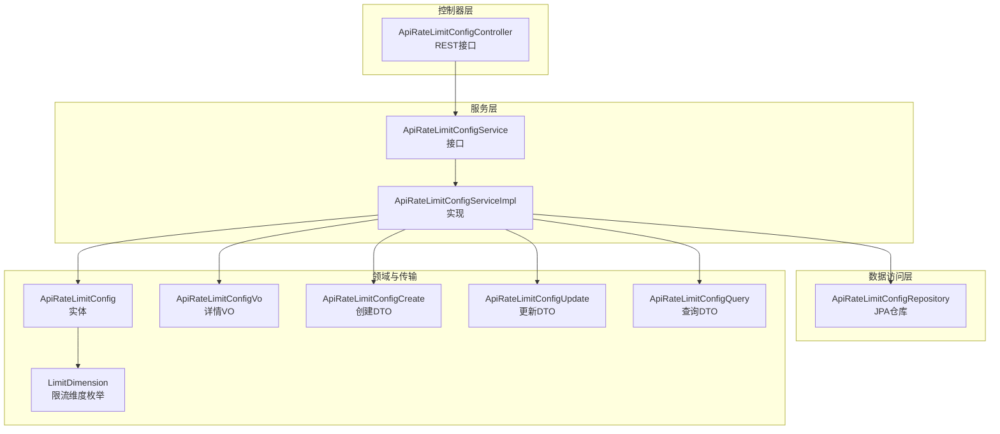
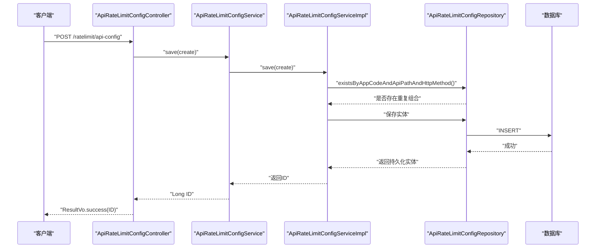
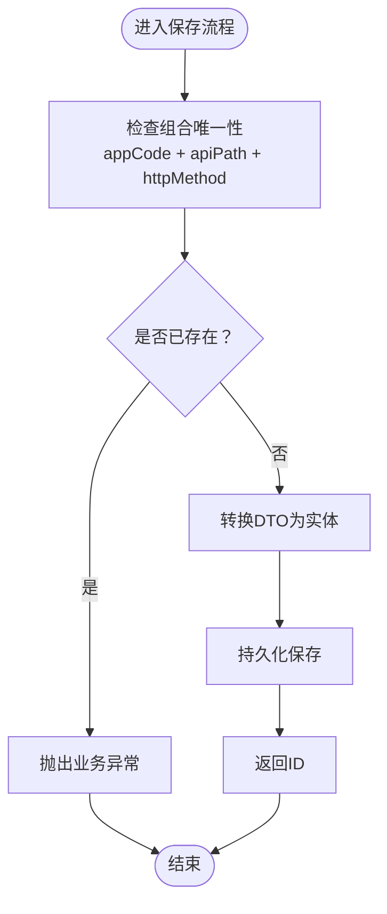
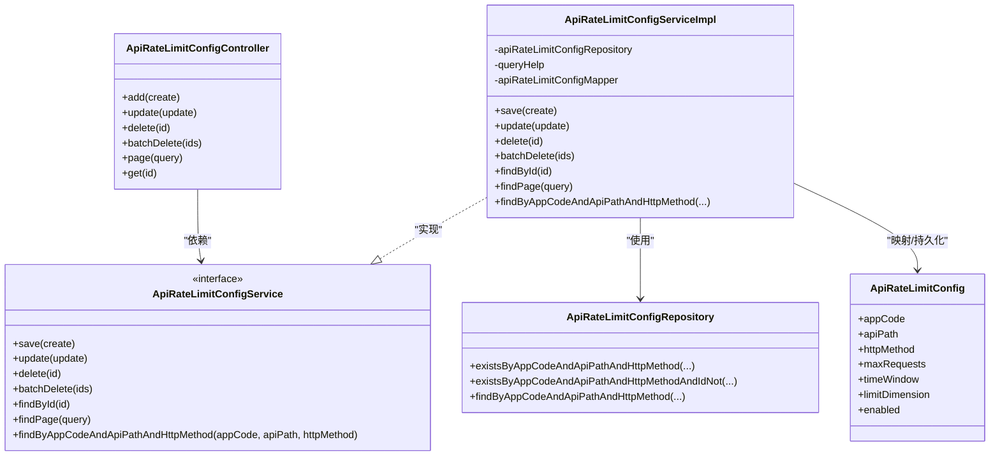

# API限流配置API

<cite>
**本文档引用的文件**
- [ApiRateLimitConfigController.java](file://run-admin/src/main/java/com//fastproject/module/ratelimit/controller/ApiRateLimitConfigController.java)
- [ApiRateLimitConfigService.java](file://ratelimit-module/src/main/java/com/fastproject/ratelimit/service/ApiRateLimitConfigService.java)
- [ApiRateLimitConfigServiceImpl.java](file://ratelimit-module/src/main/java/com/fastproject/ratelimit/service/impl/ApiRateLimitConfigServiceImpl.java)
- [ApiRateLimitConfigRepository.java](file://ratelimit-module/src/main/java/com/fastproject/ratelimit/repository/db/ApiRateLimitConfigRepository.java)
- [ApiRateLimitConfig.java](file://ratelimit-module/src/main/java/com/fastproject/ratelimit/domain/ApiRateLimitConfig.java)
- [ApiRateLimitConfigCreate.java](file://ratelimit-module/src/main/java/com/fastproject/ratelimit/vo/api/ApiRateLimitConfigCreate.java)
- [ApiRateLimitConfigUpdate.java](file://ratelimit-module/src/main/java/com/fastproject/ratelimit/vo/api/ApiRateLimitConfigUpdate.java)
- [ApiRateLimitConfigQuery.java](file://ratelimit-module/src/main/java/com/fastproject/ratelimit/vo/api/ApiRateLimitConfigQuery.java)
- [ApiRateLimitConfigVo.java](file://ratelimit-module/src/main/java/com/fastproject/ratelimit/vo/api/ApiRateLimitConfigVo.java)
- [LimitDimension.java](file://ratelimit-api/src/main/java/com/fastproject/ratelimit/enums/LimitDimension.java)
- [BusinessException.java](file://common/src/main/java/com/fastproject/exception/BusinessException.java)
</cite>

## 目录
1. [简介](#简介)
2. [项目结构](#项目结构)
3. [核心组件](#核心组件)
4. [架构总览](#架构总览)
5. [详细组件分析](#详细组件分析)
6. [依赖关系分析](#依赖关系分析)
7. [性能考虑](#性能考虑)
8. [故障排查指南](#故障排查指南)
9. [结论](#结论)

## 简介
本文件为“API限流配置”模块的RESTful接口文档，覆盖新增、修改、删除、批量删除、分页查询与详情查询等完整能力。文档详细说明了API限流配置的数据模型、请求参数格式、响应数据结构，并给出每个接口的API路径、HTTP方法、请求头、请求体、响应状态码及典型调用示例。同时解释各配置项的含义与使用场景，帮助开发者正确配置与集成。

## 项目结构
该模块采用分层架构，主要由以下层次组成：
- 控制器层：对外暴露RESTful接口
- 服务层：业务逻辑编排与校验
- 数据访问层：基于Spring Data JPA的Repository
- 领域模型与VO：实体与传输对象
- 枚举：限流维度定义

图表来源
- [ApiRateLimitConfigController.java](file://run-admin/src/main/java/com//fastproject/module/ratelimit/controller/ApiRateLimitConfigController.java#L23-L92)
- [ApiRateLimitConfigService.java](file://ratelimit-module/src/main/java/com/fastproject/ratelimit/service/ApiRateLimitConfigService.java#L14-L50)
- [ApiRateLimitConfigServiceImpl.java](file://ratelimit-module/src/main/java/com/fastproject/ratelimit/service/impl/ApiRateLimitConfigServiceImpl.java#L32-L130)
- [ApiRateLimitConfigRepository.java](file://ratelimit-module/src/main/java/com/fastproject/ratelimit/repository/db/ApiRateLimitConfigRepository.java#L12-L28)
- [ApiRateLimitConfig.java](file://ratelimit-module/src/main/java/com/fastproject/ratelimit/domain/ApiRateLimitConfig.java#L20-L64)
- [ApiRateLimitConfigVo.java](file://ratelimit-module/src/main/java/com/fastproject/ratelimit/vo/api/ApiRateLimitConfigVo.java#L10-L51)
- [ApiRateLimitConfigCreate.java](file://ratelimit-module/src/main/java/com/fastproject/ratelimit/vo/api/ApiRateLimitConfigCreate.java#L10-L46)
- [ApiRateLimitConfigUpdate.java](file://ratelimit-module/src/main/java/com/fastproject/ratelimit/vo/api/ApiRateLimitConfigUpdate.java#L10-L51)
- [ApiRateLimitConfigQuery.java](file://ratelimit-module/src/main/java/com/fastproject/ratelimit/vo/api/ApiRateLimitConfigQuery.java#L13-L39)
- [LimitDimension.java](file://ratelimit-api/src/main/java/com/fastproject/ratelimit/enums/LimitDimension.java#L6-L19)

章节来源
- [ApiRateLimitConfigController.java](file://run-admin/src/main/java/com//fastproject/module/ratelimit/controller/ApiRateLimitConfigController.java#L23-L92)
- [ApiRateLimitConfigService.java](file://ratelimit-module/src/main/java/com/fastproject/ratelimit/service/ApiRateLimitConfigService.java#L14-L50)
- [ApiRateLimitConfigServiceImpl.java](file://ratelimit-module/src/main/java/com/fastproject/ratelimit/service/impl/ApiRateLimitConfigServiceImpl.java#L32-L130)
- [ApiRateLimitConfigRepository.java](file://ratelimit-module/src/main/java/com/fastproject/ratelimit/repository/db/ApiRateLimitConfigRepository.java#L12-L28)
- [ApiRateLimitConfig.java](file://ratelimit-module/src/main/java/com/fastproject/ratelimit/domain/ApiRateLimitConfig.java#L20-L64)
- [ApiRateLimitConfigVo.java](file://ratelimit-module/src/main/java/com/fastproject/ratelimit/vo/api/ApiRateLimitConfigVo.java#L10-L51)
- [ApiRateLimitConfigCreate.java](file://ratelimit-module/src/main/java/com/fastproject/ratelimit/vo/api/ApiRateLimitConfigCreate.java#L10-L46)
- [ApiRateLimitConfigUpdate.java](file://ratelimit-module/src/main/java/com/fastproject/ratelimit/vo/api/ApiRateLimitConfigUpdate.java#L10-L51)
- [ApiRateLimitConfigQuery.java](file://ratelimit-module/src/main/java/com/fastproject/ratelimit/vo/api/ApiRateLimitConfigQuery.java#L13-L39)
- [LimitDimension.java](file://ratelimit-api/src/main/java/com/fastproject/ratelimit/enums/LimitDimension.java#L6-L19)

## 核心组件
- 控制器：提供REST接口，负责鉴权、幂等性与日志
- 服务接口与实现：封装业务规则、参数校验与分页查询
- 仓储：基于JPA的CRUD与条件查询
- 实体与VO：描述API限流配置的字段与返回结构
- 枚举：限流维度（全局/IP/用户）

章节来源
- [ApiRateLimitConfigController.java](file://run-admin/src/main/java/com//fastproject/module/ratelimit/controller/ApiRateLimitConfigController.java#L23-L92)
- [ApiRateLimitConfigService.java](file://ratelimit-module/src/main/java/com/fastproject/ratelimit/service/ApiRateLimitConfigService.java#L14-L50)
- [ApiRateLimitConfigServiceImpl.java](file://ratelimit-module/src/main/java/com/fastproject/ratelimit/service/impl/ApiRateLimitConfigServiceImpl.java#L32-L130)
- [ApiRateLimitConfigRepository.java](file://ratelimit-module/src/main/java/com/fastproject/ratelimit/repository/db/ApiRateLimitConfigRepository.java#L12-L28)
- [ApiRateLimitConfig.java](file://ratelimit-module/src/main/java/com/fastproject/ratelimit/domain/ApiRateLimitConfig.java#L20-L64)
- [ApiRateLimitConfigVo.java](file://ratelimit-module/src/main/java/com/fastproject/ratelimit/vo/api/ApiRateLimitConfigVo.java#L10-L51)
- [ApiRateLimitConfigCreate.java](file://ratelimit-module/src/main/java/com/fastproject/ratelimit/vo/api/ApiRateLimitConfigCreate.java#L10-L46)
- [ApiRateLimitConfigUpdate.java](file://ratelimit-module/src/main/java/com/fastproject/ratelimit/vo/api/ApiRateLimitConfigUpdate.java#L10-L51)
- [ApiRateLimitConfigQuery.java](file://ratelimit-module/src/main/java/com/fastproject/ratelimit/vo/api/ApiRateLimitConfigQuery.java#L13-L39)
- [LimitDimension.java](file://ratelimit-api/src/main/java/com/fastproject/ratelimit/enums/LimitDimension.java#L6-L19)

## 架构总览
下图展示了从客户端到数据库的调用链路与关键组件交互：

图表来源
- [ApiRateLimitConfigController.java](file://run-admin/src/main/java/com//fastproject/module/ratelimit/controller/ApiRateLimitConfigController.java#L33-L39)
- [ApiRateLimitConfigServiceImpl.java](file://ratelimit-module/src/main/java/com/fastproject/ratelimit/service/impl/ApiRateLimitConfigServiceImpl.java#L38-L50)
- [ApiRateLimitConfigRepository.java](file://ratelimit-module/src/main/java/com/fastproject/ratelimit/repository/db/ApiRateLimitConfigRepository.java#L17-L17)

## 详细组件分析

### 接口清单与规范

- 基础路径
  - 前缀：/ratelimit/api-config

- 新增配置
  - 方法：POST
  - 路径：/ratelimit/api-config
  - 权限：admin:ratelimit:api-config:add
  - 幂等：是（前缀 add:ratelimit:api-config:，过期时间120秒）
  - 请求头：Content-Type: application/json
  - 请求体：ApiRateLimitConfigCreate
  - 成功响应：ResultVo<Long>
  - 失败响应：ResultVo.error 或 BusinessException

- 修改配置
  - 方法：PUT
  - 路径：/ratelimit/api-config
  - 权限：admin:ratelimit:api-config:update
  - 幂等：是（前缀 update:ratelimit:api-config:，过期时间120秒）
  - 请求头：Content-Type: application/json
  - 请求体：ApiRateLimitConfigUpdate
  - 成功响应：ResultVo<Void>
  - 失败响应：ResultVo.error 或 BusinessException

- 删除配置
  - 方法：DELETE
  - 路径：/ratelimit/api-config/{id}
  - 权限：admin:ratelimit:api-config:delete
  - 请求体：无
  - 成功响应：ResultVo<Void>
  - 失败响应：ResultVo.error

- 批量删除
  - 方法：DELETE
  - 路径：/ratelimit/api-config/batch
  - 权限：admin:ratelimit:api-config:delete
  - 请求头：Content-Type: application/json
  - 请求体：List<Long>
  - 成功响应：ResultVo<Void>
  - 失败响应：ResultVo.error

- 分页查询
  - 方法：POST
  - 路径：/ratelimit/api-config/page
  - 权限：admin:ratelimit:api-config:page
  - 请求头：Content-Type: application/json
  - 请求体：ApiRateLimitConfigQuery
  - 成功响应：ResultVo<PageVo<List<ApiRateLimitConfigVo>>>
  - 失败响应：ResultVo.error

- 详情查询
  - 方法：GET
  - 路径：/ratelimit/api-config/{id}
  - 权限：admin:ratelimit:api-config:page
  - 请求体：无
  - 成功响应：ResultVo<ApiRateLimitConfigVo>
  - 失败响应：ResultVo.error

章节来源
- [ApiRateLimitConfigController.java](file://run-admin/src/main/java/com//fastproject/module/ratelimit/controller/ApiRateLimitConfigController.java#L33-L91)

### 数据模型与字段说明

- 实体：ApiRateLimitConfig
  - 字段
    - id：主键
    - appCode：应用代码（字符串，必填）
    - apiPath：API路径（字符串，必填）
    - httpMethod：HTTP方法（字符串，如GET/POST等）
    - maxRequests：最大请求次数（数值，必填）
    - timeWindow：时间窗口（秒，数值，必填）
    - limitDimension：限流维度（枚举，必填）
    - enabled：是否启用（布尔，必填）
  - 约束
    - 组合唯一：appCode + apiPath + httpMethod
    - 删除软删除：通过SQL删除标记与限制

- 传输对象
  - ApiRateLimitConfigVo：用于返回详情
  - ApiRateLimitConfigCreate：用于新增
  - ApiRateLimitConfigUpdate：用于修改
  - ApiRateLimitConfigQuery：用于分页查询（继承分页基类）

- 枚举：LimitDimension
  - 取值：GLOBAL（全局）、IP（按IP）、USER（按用户）

章节来源
- [ApiRateLimitConfig.java](file://ratelimit-module/src/main/java/com/fastproject/ratelimit/domain/ApiRateLimitConfig.java#L20-L64)
- [ApiRateLimitConfigVo.java](file://ratelimit-module/src/main/java/com/fastproject/ratelimit/vo/api/ApiRateLimitConfigVo.java#L10-L51)
- [ApiRateLimitConfigCreate.java](file://ratelimit-module/src/main/java/com/fastproject/ratelimit/vo/api/ApiRateLimitConfigCreate.java#L10-L46)
- [ApiRateLimitConfigUpdate.java](file://ratelimit-module/src/main/java/com/fastproject/ratelimit/vo/api/ApiRateLimitConfigUpdate.java#L10-L51)
- [ApiRateLimitConfigQuery.java](file://ratelimit-module/src/main/java/com/fastproject/ratelimit/vo/api/ApiRateLimitConfigQuery.java#L13-L39)
- [LimitDimension.java](file://ratelimit-api/src/main/java/com/fastproject/ratelimit/enums/LimitDimension.java#L6-L19)

### 关键流程与算法

- 新增流程
  - 校验 appCode + apiPath + httpMethod 组合唯一性
  - 转换DTO为实体并保存
  - 返回新生成的ID

- 修改流程
  - 校验目标配置存在
  - 校验组合唯一性（排除当前ID）
  - 更新实体并保存

- 查询与分页
  - 支持按 appCode、apiPath（模糊）、httpMethod、limitDimension、enabled 过滤
  - 默认按ID倒序分页

图表来源
- [ApiRateLimitConfigServiceImpl.java](file://ratelimit-module/src/main/java/com/fastproject/ratelimit/service/impl/ApiRateLimitConfigServiceImpl.java#L38-L50)
- [ApiRateLimitConfigRepository.java](file://ratelimit-module/src/main/java/com/fastproject/ratelimit/repository/db/ApiRateLimitConfigRepository.java#L17-L17)

章节来源
- [ApiRateLimitConfigServiceImpl.java](file://ratelimit-module/src/main/java/com/fastproject/ratelimit/service/impl/ApiRateLimitConfigServiceImpl.java#L38-L66)
- [ApiRateLimitConfigRepository.java](file://ratelimit-module/src/main/java/com/fastproject/ratelimit/repository/db/ApiRateLimitConfigRepository.java#L17-L27)

### 错误处理与状态码
- 通用约定
  - 成功：ResultVo.success(...)，HTTP 200
  - 失败：ResultVo.error(...)，HTTP 200（业务异常仍返回200，内部携带错误码与消息）
- 已知业务异常
  - 新增时组合重复：提示“该应用已配置该API路径和HTTP方法组合”
  - 修改时目标不存在：抛出业务异常
- 安全与权限
  - 使用注解鉴权：admin:ratelimit:api-config:* 系列权限

章节来源
- [ApiRateLimitConfigServiceImpl.java](file://ratelimit-module/src/main/java/com/fastproject/ratelimit/service/impl/ApiRateLimitConfigServiceImpl.java#L43-L45)
- [ApiRateLimitConfigServiceImpl.java](file://ratelimit-module/src/main/java/com/fastproject/ratelimit/service/impl/ApiRateLimitConfigServiceImpl.java#L56-L57)
- [BusinessException.java](file://common/src/main/java/com/fastproject/exception/BusinessException.java#L3-L12)

### API调用示例

- 新增配置
  - 请求
    - 方法：POST
    - 路径：/ratelimit/api-config
    - 请求头：Content-Type: application/json
    - 请求体字段：appCode, apiPath, httpMethod, maxRequests, timeWindow, limitDimension, enabled
  - 响应
    - 结果：ResultVo.success(新建ID)

- 修改配置
  - 请求
    - 方法：PUT
    - 路径：/ratelimit/api-config
    - 请求头：Content-Type: application/json
    - 请求体字段：id, appCode, apiPath, httpMethod, maxRequests, timeWindow, limitDimension, enabled
  - 响应
    - 结果：ResultVo.success()

- 删除配置
  - 请求
    - 方法：DELETE
    - 路径：/ratelimit/api-config/{id}
  - 响应
    - 结果：ResultVo.success()

- 批量删除
  - 请求
    - 方法：DELETE
    - 路径：/ratelimit/api-config/batch
    - 请求头：Content-Type: application/json
    - 请求体：[1, 2, 3]
  - 响应
    - 结果：ResultVo.success()

- 分页查询
  - 请求
    - 方法：POST
    - 路径：/ratelimit/api-config/page
    - 请求头：Content-Type: application/json
    - 请求体字段：appCode, apiPath, httpMethod, limitDimension, enabled, page, pageSize
  - 响应
    - 结果：ResultVo.success(PageVo)

- 详情查询
  - 请求
    - 方法：GET
    - 路径：/ratelimit/api-config/{id}
  - 响应
    - 结果：ResultVo.success(ApiRateLimitConfigVo)

章节来源
- [ApiRateLimitConfigController.java](file://run-admin/src/main/java/com//fastproject/module/ratelimit/controller/ApiRateLimitConfigController.java#L33-L91)
- [ApiRateLimitConfigQuery.java](file://ratelimit-module/src/main/java/com/fastproject/ratelimit/vo/api/ApiRateLimitConfigQuery.java#L13-L39)
- [ApiRateLimitConfigVo.java](file://ratelimit-module/src/main/java/com/fastproject/ratelimit/vo/api/ApiRateLimitConfigVo.java#L10-L51)

### 配置项含义与使用场景

- appCode（应用代码）
  - 含义：标识所属应用
  - 场景：多应用隔离限流

- apiPath（API路径）
  - 含义：被限流的接口路径
  - 场景：对特定接口进行限流

- httpMethod（HTTP方法）
  - 含义：针对特定HTTP方法的限流
  - 场景：区分GET/POST等不同方法

- maxRequests（最大请求次数）
  - 含义：在时间窗口内的允许请求数
  - 场景：控制QPS或单位时间流量

- timeWindow（时间窗口，秒）
  - 含义：计数周期长度
  - 场景：配合maxRequests形成滑动/固定窗口

- limitDimension（限流维度）
  - 取值：GLOBAL/IP/USER
  - 含义：限流作用范围
  - 场景：
    - GLOBAL：全局统一阈值
    - IP：按客户端IP限流
    - USER：按登录用户限流

- enabled（是否启用）
  - 含义：开关控制
  - 场景：临时禁用某条规则而不删除

章节来源
- [ApiRateLimitConfig.java](file://ratelimit-module/src/main/java/com/fastproject/ratelimit/domain/ApiRateLimitConfig.java#L22-L63)
- [LimitDimension.java](file://ratelimit-api/src/main/java/com/fastproject/ratelimit/enums/LimitDimension.java#L6-L19)

## 依赖关系分析

图表来源
- [ApiRateLimitConfigController.java](file://run-admin/src/main/java/com//fastproject/module/ratelimit/controller/ApiRateLimitConfigController.java#L26-L28)
- [ApiRateLimitConfigService.java](file://ratelimit-module/src/main/java/com/fastproject/ratelimit/service/ApiRateLimitConfigService.java#L14-L50)
- [ApiRateLimitConfigServiceImpl.java](file://ratelimit-module/src/main/java/com/fastproject/ratelimit/service/impl/ApiRateLimitConfigServiceImpl.java#L32-L36)
- [ApiRateLimitConfigRepository.java](file://ratelimit-module/src/main/java/com/fastproject/ratelimit/repository/db/ApiRateLimitConfigRepository.java#L12-L28)
- [ApiRateLimitConfig.java](file://ratelimit-module/src/main/java/com/fastproject/ratelimit/domain/ApiRateLimitConfig.java#L20-L64)

章节来源
- [ApiRateLimitConfigController.java](file://run-admin/src/main/java/com//fastproject/module/ratelimit/controller/ApiRateLimitConfigController.java#L23-L92)
- [ApiRateLimitConfigService.java](file://ratelimit-module/src/main/java/com/fastproject/ratelimit/service/ApiRateLimitConfigService.java#L14-L50)
- [ApiRateLimitConfigServiceImpl.java](file://ratelimit-module/src/main/java/com/fastproject/ratelimit/service/impl/ApiRateLimitConfigServiceImpl.java#L32-L130)
- [ApiRateLimitConfigRepository.java](file://ratelimit-module/src/main/java/com/fastproject/ratelimit/repository/db/ApiRateLimitConfigRepository.java#L12-L28)
- [ApiRateLimitConfig.java](file://ratelimit-module/src/main/java/com/fastproject/ratelimit/domain/ApiRateLimitConfig.java#L20-L64)

## 性能考虑
- 查询优化
  - 分页默认按ID倒序，避免全表扫描
  - 支持多条件过滤，建议结合索引策略
- 写入优化
  - 新增/修改前进行组合唯一性检查，减少无效写入
  - 批量删除走JPA批量删除，降低事务开销
- 缓存与降级
  - 可在网关层缓存热点配置，降低数据库压力
  - 限流规则变更建议采用灰度发布与快速回滚机制

## 故障排查指南
- 新增失败：提示“该应用已配置该API路径和HTTP方法组合”
  - 排查：确认 appCode + apiPath + httpMethod 组合是否重复
- 修改失败：提示“配置不存在”
  - 排查：确认传入的id是否存在
- 权限不足
  - 排查：确认当前用户是否具备 admin:ratelimit:api-config:* 权限
- 参数缺失或类型不匹配
  - 排查：确认请求体字段与DTO一致，特别是枚举值与布尔值

章节来源
- [ApiRateLimitConfigServiceImpl.java](file://ratelimit-module/src/main/java/com/fastproject/ratelimit/service/impl/ApiRateLimitConfigServiceImpl.java#L43-L45)
- [ApiRateLimitConfigServiceImpl.java](file://ratelimit-module/src/main/java/com/fastproject/ratelimit/service/impl/ApiRateLimitConfigServiceImpl.java#L56-L57)
- [BusinessException.java](file://common/src/main/java/com/fastproject/exception/BusinessException.java#L3-L12)

## 结论
本接口文档系统性地梳理了API限流配置的REST能力与数据模型，明确了各接口的调用方式、参数与返回结构，并提供了常见问题的排查思路。建议在生产环境中结合权限体系、幂等性设计与缓存策略，确保限流配置的高可用与可运维性。