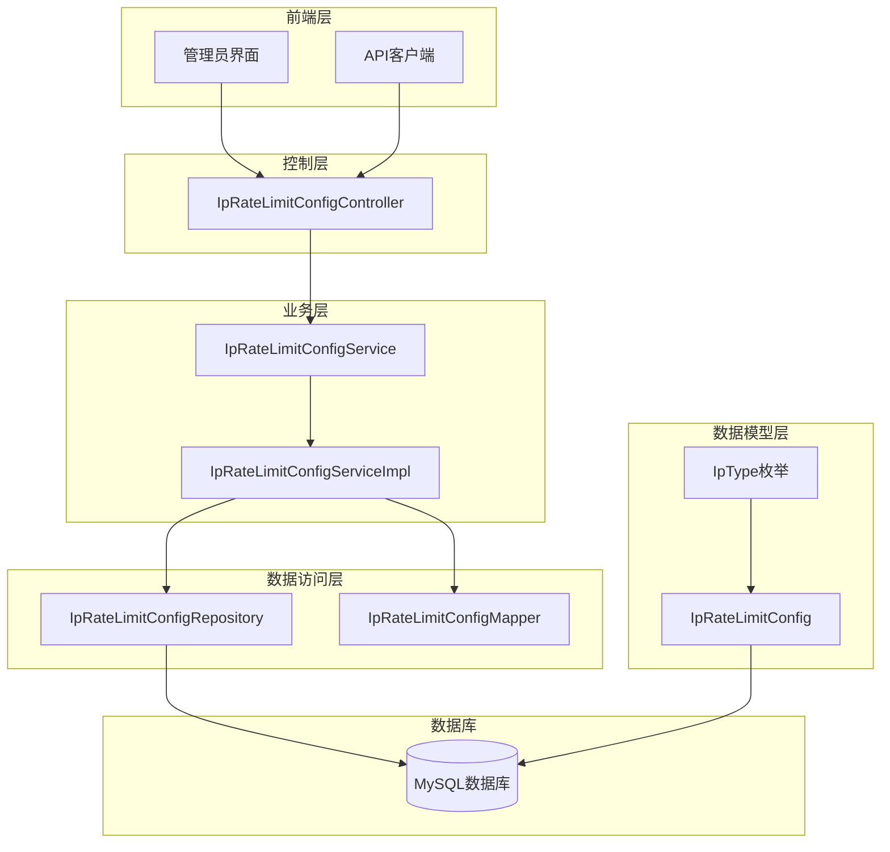
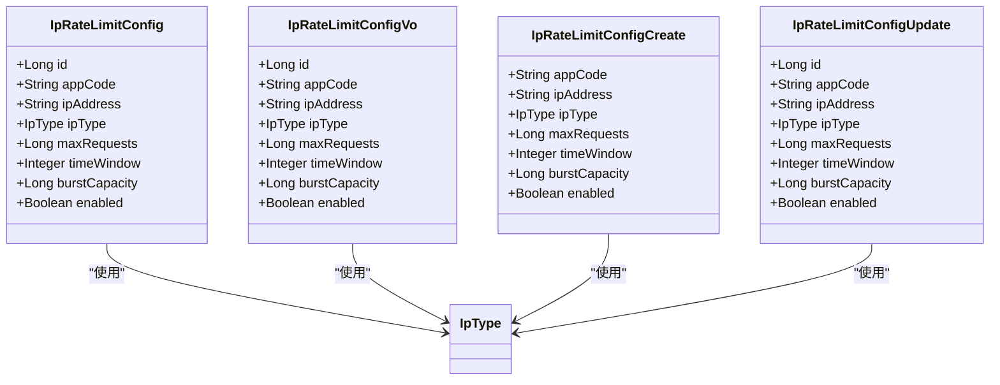
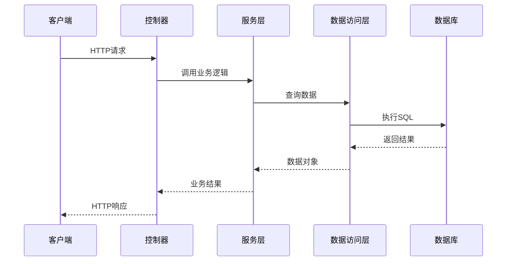
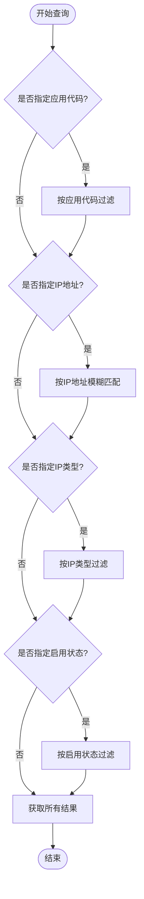
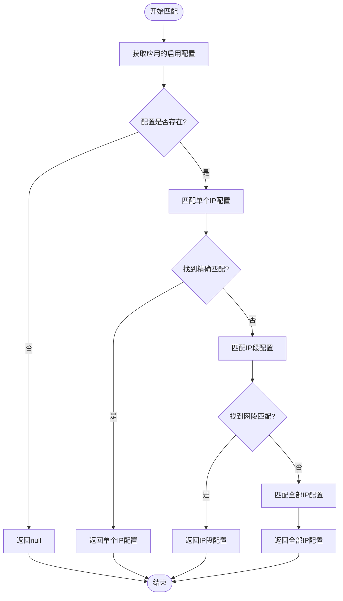
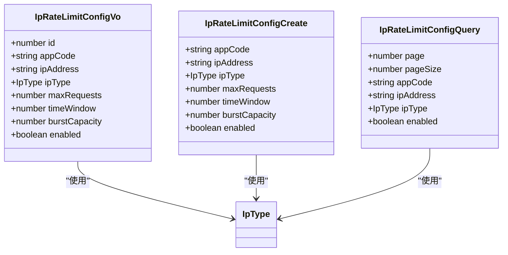
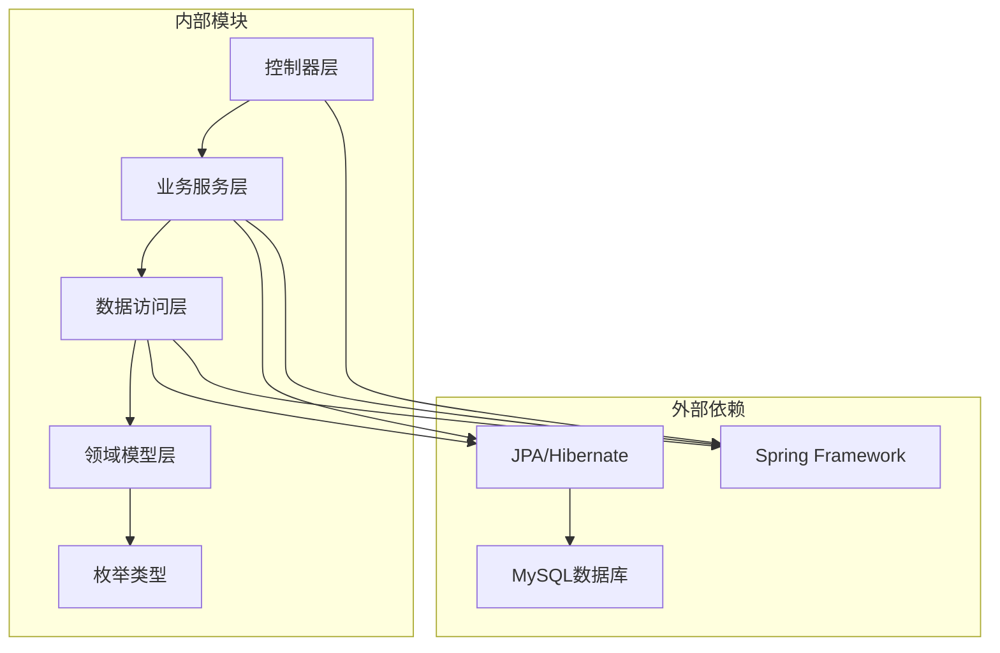

# IP限流配置API

<cite>
**本文档引用的文件**
- [IpRateLimitConfigController.java](file://run-admin/src/main/java/com/fastproject/module/ratelimit/controller/IpRateLimitConfigController.java)
- [IpRateLimitConfigService.java](file://ratelimit-module/src/main/java/com/fastproject/ratelimit/service/IpRateLimitConfigService.java)
- [IpRateLimitConfigServiceImpl.java](file://ratelimit-module/src/main/java/com/fastproject/ratelimit/service/impl/IpRateLimitConfigServiceImpl.java)
- [IpRateLimitConfigRepository.java](file://ratelimit-module/src/main/java/com/fastproject/ratelimit/repository/db/IpRateLimitConfigRepository.java)
- [IpRateLimitConfigMapper.java](file://ratelimit-module/src/main/java/com/fastproject/ratelimit/mapper/IpRateLimitConfigMapper.java)
- [IpRateLimitConfig.java](file://ratelimit-module/src/main/java/com/fastproject/ratelimit/domain/IpRateLimitConfig.java)
- [IpRateLimitConfigVo.java](file://ratelimit-module/src/main/java/com/fastproject/ratelimit/vo/ip/IpRateLimitConfigVo.java)
- [IpRateLimitConfigCreate.java](file://ratelimit-module/src/main/java/com/fastproject/ratelimit/vo/ip/IpRateLimitConfigCreate.java)
- [IpRateLimitConfigUpdate.java](file://ratelimit-module/src/main/java/com/fastproject/ratelimit/vo/ip/IpRateLimitConfigUpdate.java)
- [IpRateLimitConfigQuery.java](file://ratelimit-module/src/main/java/com/fastproject/ratelimit/vo/ip/IpRateLimitConfigQuery.java)
- [IpType.java](file://ratelimit-api/src/main/java/com/fastproject/ratelimit/enums/IpType.java)
- [IpBlackWhiteList.java](file://ratelimit-module/src/main/java/com/fastproject/ratelimit/domain/IpBlackWhiteList.java)
- [BlackWhiteListType.java](file://ratelimit-api/src/main/java/com/fastproject/ratelimit/enums/BlackWhiteListType.java)
- [ipConfig.ts](file://fast-ui/apps/admin-vue/src/api/ratelimit/ipConfig.ts)
- [ipBwConfig.ts](file://fast-ui/apps/admin-vue/src/api/ratelimit/ipBwConfig.ts)
</cite>

## 目录
1. [简介](#简介)
2. [项目结构](#项目结构)
3. [核心组件](#核心组件)
4. [架构概览](#架构概览)
5. [详细组件分析](#详细组件分析)
6. [依赖关系分析](#依赖关系分析)
7. [性能考虑](#性能考虑)
8. [故障排除指南](#故障排除指南)
9. [结论](#结论)

## 简介

本文件详细描述了Fast项目中基于IP地址的限流配置API系统。该系统提供了完整的IP限流配置管理功能，包括单个IP、IP段和全量IP的限流策略配置，支持IPv4/IPv6地址处理、CIDR网段配置、以及IP白名单/黑名单管理。

系统采用分层架构设计，通过RESTful API提供统一的配置管理接口，支持动态更新和实时生效。所有配置变更都经过严格的验证和权限控制，确保系统的安全性和稳定性。

## 项目结构

IP限流配置API系统主要由以下模块组成：

**图表来源**
- [IpRateLimitConfigController.java](file://run-admin/src/main/java/com/fastproject/module/ratelimit/controller/IpRateLimitConfigController.java#L23-L26)
- [IpRateLimitConfigService.java](file://ratelimit-module/src/main/java/com/fastproject/ratelimit/service/IpRateLimitConfigService.java#L14-L55)
- [IpRateLimitConfigServiceImpl.java](file://ratelimit-module/src/main/java/com/fastproject/ratelimit/service/impl/IpRateLimitConfigServiceImpl.java#L34-L34)

**章节来源**
- [IpRateLimitConfigController.java](file://run-admin/src/main/java/com/fastproject/module/ratelimit/controller/IpRateLimitConfigController.java#L1-L101)
- [IpRateLimitConfigService.java](file://ratelimit-module/src/main/java/com/fastproject/ratelimit/service/IpRateLimitConfigService.java#L1-L55)

## 核心组件

### 数据模型

IP限流配置的核心数据模型定义如下：

**图表来源**
- [IpRateLimitConfig.java](file://ratelimit-module/src/main/java/com/fastproject/ratelimit/domain/IpRateLimitConfig.java#L20-L65)
- [IpRateLimitConfigVo.java](file://ratelimit-module/src/main/java/com/fastproject/ratelimit/vo/ip/IpRateLimitConfigVo.java#L10-L51)
- [IpRateLimitConfigCreate.java](file://ratelimit-module/src/main/java/com/fastproject/ratelimit/vo/ip/IpRateLimitConfigCreate.java#L10-L46)
- [IpRateLimitConfigUpdate.java](file://ratelimit-module/src/main/java/com/fastproject/ratelimit/vo/ip/IpRateLimitConfigUpdate.java#L10-L51)

### IP类型枚举

系统支持三种IP类型配置：

| 枚举值 | 描述 | 用途 |
|--------|------|------|
| ALL | 全部IP | 对应用的所有IP地址生效，每个应用只能配置一个 |
| SINGLE | 单个IP | 对指定的单个IP地址生效 |
| SEGMENT | IP段 | 对指定的IP网段生效，支持CIDR表示法 |

**章节来源**
- [IpType.java](file://ratelimit-api/src/main/java/com/fastproject/ratelimit/enums/IpType.java#L11-L27)
- [IpRateLimitConfig.java](file://ratelimit-module/src/main/java/com/fastproject/ratelimit/domain/IpRateLimitConfig.java#L34-L39)

## 架构概览

IP限流配置API采用经典的MVC架构模式，通过RESTful接口提供服务：

**图表来源**
- [IpRateLimitConfigController.java](file://run-admin/src/main/java/com/fastproject/module/ratelimit/controller/IpRateLimitConfigController.java#L33-L39)
- [IpRateLimitConfigServiceImpl.java](file://ratelimit-module/src/main/java/com/fastproject/ratelimit/service/impl/IpRateLimitConfigServiceImpl.java#L40-L64)

## 详细组件分析

### 控制器层

IpRateLimitConfigController提供了完整的RESTful API接口：

#### 基础CRUD操作

| 方法 | URL | 权限 | 功能描述 |
|------|-----|------|----------|
| POST | /ratelimit/ip-config | admin:ratelimit:ip-config:add | 创建新的IP限流配置 |
| PUT | /ratelimit/ip-config | admin:ratelimit:ip-config:update | 更新现有IP限流配置 |
| DELETE | /ratelimit/ip-config/{id} | admin:ratelimit:ip-config:delete | 删除指定ID的配置 |
| DELETE | /ratelimit/ip-config/batch | admin:ratelimit:ip-config:delete | 批量删除配置 |
| POST | /ratelimit/ip-config/page | admin:ratelimit:ip-config:page | 分页查询配置列表 |
| GET | /ratelimit/ip-config/{id} | admin:ratelimit:ip-config:page | 根据ID获取配置详情 |
| GET | /ratelimit/ip-config/ip/{ipAddress} | admin:ratelimit:ip-config:page | 根据IP地址查询配置 |

#### 高级查询功能

系统支持多维度的配置查询：

**图表来源**
- [IpRateLimitConfigServiceImpl.java](file://ratelimit-module/src/main/java/com/fastproject/ratelimit/service/impl/IpRateLimitConfigServiceImpl.java#L118-L144)

**章节来源**
- [IpRateLimitConfigController.java](file://run-admin/src/main/java/com/fastproject/module/ratelimit/controller/IpRateLimitConfigController.java#L33-L101)

### 业务逻辑层

#### 配置匹配算法

系统实现了智能的配置匹配机制，支持优先级排序：

**图表来源**
- [IpRateLimitConfigServiceImpl.java](file://ratelimit-module/src/main/java/com/fastproject/ratelimit/service/impl/IpRateLimitConfigServiceImpl.java#L155-L184)

#### 数据验证规则

系统在保存和更新配置时执行严格的数据验证：

| 验证规则 | 规则描述 | 错误信息 |
|----------|----------|----------|
| ALL类型限制 | 每个应用只能有一个ALL类型的配置 | "该应用已配置全部IP限流" |
| IP地址必填 | 指定IP类型时IP地址不能为空 | "指定IP类型时IP地址不能为空" |
| IP地址唯一性 | 同一IP地址不能重复配置 | "IP地址已存在" |
| 应用代码必填 | 应用代码不能为空 | "应用代码不能为空" |

**章节来源**
- [IpRateLimitConfigServiceImpl.java](file://ratelimit-module/src/main/java/com/fastproject/ratelimit/service/impl/IpRateLimitConfigServiceImpl.java#L40-L93)

### 数据访问层

#### 查询方法

Repository层提供了丰富的查询方法：

| 方法名 | 参数 | 功能描述 |
|--------|------|----------|
| findByAppCode | String appCode | 根据应用代码查询配置 |
| findByAppCodeAndIpType | String appCode, IpType ipType | 根据应用代码和IP类型查询 |
| existsByIpAddress | String ipAddress | 检查IP地址是否存在 |
| existsByIpAddressAndIdNot | String ipAddress, Long id | 检查IP地址是否存在（排除指定ID） |
| findByIpAddress | String ipAddress | 根据IP地址查询配置 |
| findByEnabled | Boolean enabled | 根据启用状态查询配置列表 |
| findByAppCodeAndEnabledTrue | String appCode | 获取应用的所有启用配置 |

**章节来源**
- [IpRateLimitConfigRepository.java](file://ratelimit-module/src/main/java/com/fastproject/ratelimit/repository/db/IpRateLimitConfigRepository.java#L15-L51)

### 前端集成

#### TypeScript接口定义

前端提供了完整的TypeScript类型定义：

**图表来源**
- [ipConfig.ts](file://fast-ui/apps/admin-vue/src/api/ratelimit/ipConfig.ts#L6-L38)

**章节来源**
- [ipConfig.ts](file://fast-ui/apps/admin-vue/src/api/ratelimit/ipConfig.ts#L1-L106)

## 依赖关系分析

**图表来源**
- [IpRateLimitConfigController.java](file://run-admin/src/main/java/com/fastproject/module/ratelimit/controller/IpRateLimitConfigController.java#L1-L18)
- [IpRateLimitConfigServiceImpl.java](file://ratelimit-module/src/main/java/com/fastproject/ratelimit/service/impl/IpRateLimitConfigServiceImpl.java#L1-L27)

### 权限控制

系统集成了基于角色的权限控制机制：

| 权限标识 | 功能范围 | 描述 |
|----------|----------|------|
| admin:ratelimit:ip-config:add | 创建权限 | 允许创建新的IP限流配置 |
| admin:ratelimit:ip-config:update | 更新权限 | 允许修改现有的IP限流配置 |
| admin:ratelimit:ip-config:delete | 删除权限 | 允许删除IP限流配置 |
| admin:ratelimit:ip-config:page | 查询权限 | 允许查询和浏览配置列表 |

**章节来源**
- [IpRateLimitConfigController.java](file://run-admin/src/main/java/com/fastproject/module/ratelimit/controller/IpRateLimitConfigController.java#L34-L100)

## 性能考虑

### 查询优化

1. **索引策略**
   - 在`app_code`字段上建立索引以加速应用级别的查询
   - 在`ip_address`字段上建立索引以加速IP地址查询
   - 在`enabled`字段上建立索引以加速状态过滤

2. **缓存策略**
   - 配置匹配结果可以进行短期缓存
   - 热点应用的配置可以进行缓存预热

3. **分页查询**
   - 默认每页10条记录，支持自定义页面大小
   - 使用降序排列按ID排序，保证查询稳定性

### 并发控制

系统通过以下机制保证并发安全性：

1. **幂等性控制**
   - 使用`@Idempotent`注解防止重复提交
   - 支持请求去重和状态恢复

2. **事务管理**
   - 所有写操作都在事务中执行
   - 自动回滚异常情况下的操作

## 故障排除指南

### 常见错误及解决方案

| 错误类型 | 错误码 | 描述 | 解决方案 |
|----------|--------|------|----------|
| 业务异常 | 400 | 应用已配置全部IP限流 | 删除现有ALL配置或修改为SINGLE/SEGMENT |
| 业务异常 | 400 | IP地址已存在 | 修改为唯一的IP地址或删除重复配置 |
| 业务异常 | 400 | 指定IP类型时IP地址不能为空 | 提供有效的IP地址或改为ALL类型 |
| 业务异常 | 404 | 配置不存在 | 检查配置ID是否正确或重新创建配置 |
| 权限异常 | 403 | 权限不足 | 联系管理员分配相应权限 |

### 调试建议

1. **日志分析**
   - 查看服务启动日志确认API正常运行
   - 检查业务日志了解具体错误原因
   - 关注配置变更的日志记录

2. **数据库检查**
   - 验证配置表结构和数据完整性
   - 检查索引是否正常工作
   - 确认数据类型和约束条件

**章节来源**
- [IpRateLimitConfigServiceImpl.java](file://ratelimit-module/src/main/java/com/fastproject/ratelimit/service/impl/IpRateLimitConfigServiceImpl.java#L44-L58)

## 结论

Fast项目的IP限流配置API系统提供了完整而灵活的IP地址限流管理能力。系统具有以下特点：

1. **完整的功能覆盖**：支持单个IP、IP段和全量IP三种配置类型
2. **智能的匹配机制**：通过优先级算法自动选择最合适的配置
3. **严格的验证控制**：多重验证确保数据的准确性和一致性
4. **完善的权限管理**：基于角色的细粒度权限控制
5. **良好的扩展性**：清晰的架构设计便于功能扩展和维护

该系统能够有效应对各种网络攻击和滥用场景，为系统的稳定运行提供重要保障。通过合理的配置和监控，可以实现对不同应用场景的精细化流量控制。