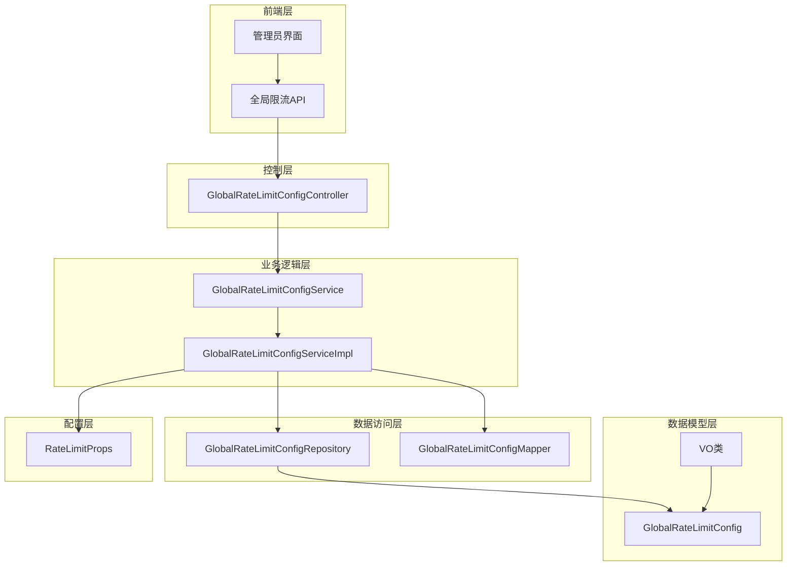
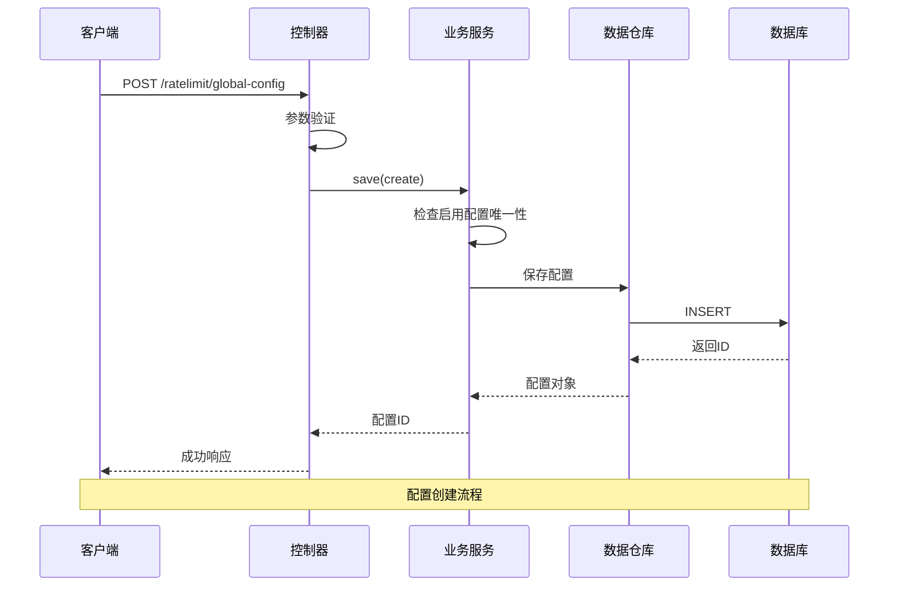
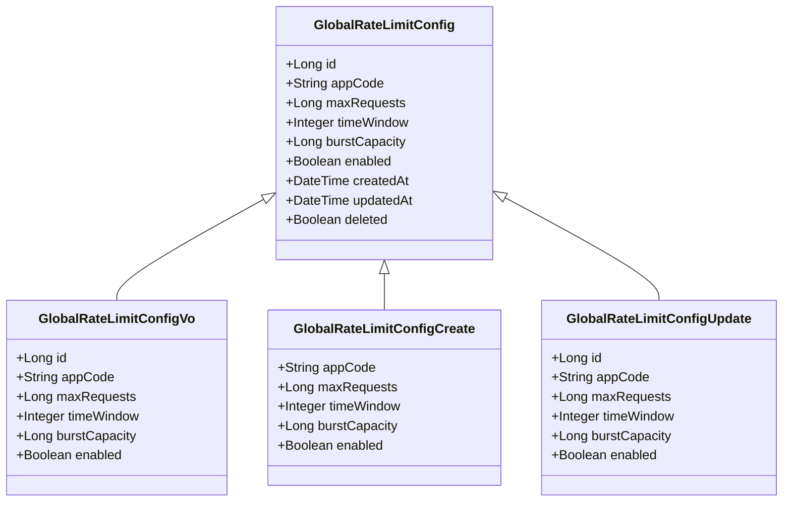
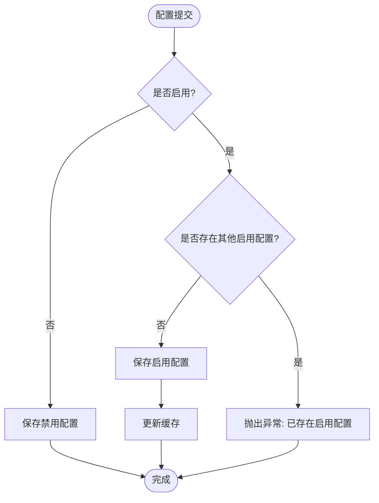
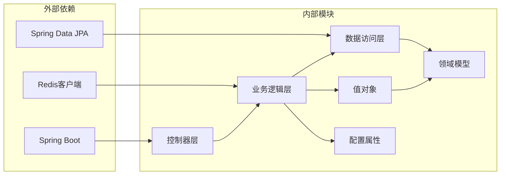

# 全局限流配置API

<cite>
**本文档引用的文件**
- [GlobalRateLimitConfigController.java](file://run-admin/src/main/java/com/astproject/module/ratelimit/controller/GlobalRateLimitConfigController.java)
- [GlobalRateLimitConfigService.java](file://ratelimit-module/src/main/java/com/astproject/ratelimit/service/GlobalRateLimitConfigService.java)
- [GlobalRateLimitConfigServiceImpl.java](file://ratelimit-module/src/main/java/com/astproject/ratelimit/service/impl/GlobalRateLimitConfigServiceImpl.java)
- [GlobalRateLimitConfigRepository.java](file://ratelimit-module/src/main/java/com/astproject/ratelimit/repository/db/GlobalRateLimitConfigRepository.java)
- [GlobalRateLimitConfig.java](file://ratelimit-module/src/main/java/com/astproject/ratelimit/domain/GlobalRateLimitConfig.java)
- [GlobalRateLimitConfigVo.java](file://ratelimit-module/src/main/java/com/astproject/ratelimit/vo/global/GlobalRateLimitConfigVo.java)
- [GlobalRateLimitConfigCreate.java](file://ratelimit-module/src/main/java/com/astproject/ratelimit/vo/global/GlobalRateLimitConfigCreate.java)
- [GlobalRateLimitConfigUpdate.java](file://ratelimit-module/src/main/java/com/astproject/ratelimit/vo/global/GlobalRateLimitConfigUpdate.java)
- [GlobalRateLimitConfigQuery.java](file://ratelimit-module/src/main/java/com/astproject/ratelimit/vo/global/GlobalRateLimitConfigQuery.java)
- [RateLimitProps.java](file://ratelimit-module/src/main/java/com/astproject/ratelimit/config/RateLimitProps.java)
- [globalConfig.ts](file://fast-ui/apps/admin-vue/src/api/ratelimit/globalConfig.ts)
</cite>

## 目录
1. [简介](#简介)
2. [项目结构](#项目结构)
3. [核心组件](#核心组件)
4. [架构概览](#架构概览)
5. [详细组件分析](#详细组件分析)
6. [依赖关系分析](#依赖关系分析)
7. [性能考虑](#性能考虑)
8. [故障排除指南](#故障排除指南)
9. [结论](#结论)

## 简介

全局限流配置API提供了对系统级流量控制策略的统一管理能力。该模块实现了基于令牌桶算法的全局限流机制，支持按应用维度进行流量控制，确保系统在高并发场景下的稳定性和可靠性。

全局限流配置在整个系统中扮演着关键角色，它通过统一的限流策略来保护后端服务免受突发流量冲击，同时为不同应用提供灵活的流量控制选项。该实现采用了分布式架构设计，结合Redis进行令牌桶状态管理，确保在多实例部署环境下的限流一致性。

## 项目结构

全局限流配置功能采用典型的三层架构模式，包含控制层、业务逻辑层和数据访问层：



**图表来源**
- [GlobalRateLimitConfigController.java](file://run-admin/src/main/java/com/astproject/module/ratelimit/controller/GlobalRateLimitConfigController.java#L25-L26)
- [GlobalRateLimitConfigServiceImpl.java](file://ratelimit-module/src/main/java/com/astproject/ratelimit/service/impl/GlobalRateLimitConfigServiceImpl.java#L33-L38)

**章节来源**
- [GlobalRateLimitConfigController.java](file://run-admin/src/main/java/com/astproject/module/ratelimit/controller/GlobalRateLimitConfigController.java#L1-L101)
- [GlobalRateLimitConfigService.java](file://ratelimit-module/src/main/java/com/astproject/ratelimit/service/GlobalRateLimitConfigService.java#L1-L50)

## 核心组件

### 控制器层

GlobalRateLimitConfigController是全局限流配置的RESTful API入口点，提供了完整的CRUD操作和查询功能。

**主要功能特性：**
- 支持全局限流配置的增删改查操作
- 提供分页查询和条件过滤功能
- 支持获取当前启用的配置
- 集成幂等性控制和操作日志记录
- 基于权限注解的安全控制

### 业务逻辑层

GlobalRateLimitConfigServiceImpl实现了完整的业务逻辑处理，包括数据验证、状态管理和事务控制。

**核心业务流程：**
- 配置唯一性检查（同一应用只能有一个启用的配置）
- 数据转换和映射
- 分页查询和条件过滤
- 启用配置的智能选择逻辑

### 数据访问层

GlobalRateLimitConfigRepository提供了数据持久化能力，基于Spring Data JPA简化了数据库操作。

**数据访问特性：**
- 自动实现CRUD操作
- 支持复杂查询条件
- 内置软删除支持
- 性能优化的查询方法

**章节来源**
- [GlobalRateLimitConfigController.java](file://run-admin/src/main/java/com/astproject/module/ratelimit/controller/GlobalRateLimitConfigController.java#L20-L101)
- [GlobalRateLimitConfigServiceImpl.java](file://ratelimit-module/src/main/java/com/astproject/ratelimit/service/impl/GlobalRateLimitConfigServiceImpl.java#L27-L145)

## 架构概览

全局限流配置系统采用分层架构设计，确保了良好的可维护性和扩展性：



**图表来源**
- [GlobalRateLimitConfigController.java](file://run-admin/src/main/java/com/astproject/module/ratelimit/controller/GlobalRateLimitConfigController.java#L33-L39)
- [GlobalRateLimitConfigServiceImpl.java](file://ratelimit-module/src/main/java/com/astproject/ratelimit/service/impl/GlobalRateLimitConfigServiceImpl.java#L41-L60)

## 详细组件分析

### 数据模型设计

全局限流配置的核心数据模型采用简洁而高效的设计：



**图表来源**
- [GlobalRateLimitConfig.java](file://ratelimit-module/src/main/java/com/astproject/ratelimit/domain/GlobalRateLimitConfig.java#L19-L50)
- [GlobalRateLimitConfigVo.java](file://ratelimit-module/src/main/java/com/astproject/ratelimit/vo/global/GlobalRateLimitConfigVo.java#L8-L40)
- [GlobalRateLimitConfigCreate.java](file://ratelimit-module/src/main/java/com/astproject/ratelimit/vo/global/GlobalRateLimitConfigCreate.java#L8-L35)
- [GlobalRateLimitConfigUpdate.java](file://ratelimit-module/src/main/java/com/astproject/ratelimit/vo/global/GlobalRateLimitConfigUpdate.java#L8-L40)

### API接口规范

#### 基础URL
```
/ratelimit/global-config
```

#### 接口列表

**1. 创建全局限流配置**
- 方法: POST
- 路径: `/ratelimit/global-config`
- 权限: `admin:ratelimit:global-config:add`
- 幂等性: 支持（前缀: `add:ratelimit:global-config:`）

**2. 更新全局限流配置**
- 方法: PUT
- 路径: `/ratelimit/global-config`
- 权限: `admin:ratelimit:global-config:update`
- 幂等性: 支持（前缀: `update:ratelimit:global-config:`）

**3. 删除全局限流配置**
- 方法: DELETE
- 路径: `/ratelimit/global-config/{id}`
- 权限: `admin:ratelimit:global-config:delete`

**4. 批量删除全局限流配置**
- 方法: DELETE
- 路径: `/ratelimit/global-config/batch`
- 权限: `admin:ratelimit:global-config:delete`

**5. 分页查询全局限流配置**
- 方法: POST
- 路径: `/ratelimit/global-config/page`
- 权限: `admin:ratelimit:global-config:page`

**6. 获取指定ID的全局限流配置**
- 方法: GET
- 路径: `/ratelimit/global-config/{id}`
- 权限: `admin:ratelimit:global-config:page`

**7. 获取当前启用的全局限流配置**
- 方法: GET
- 路径: `/ratelimit/global-config/enabled`
- 权限: `admin:ratelimit:global-config:page`

### 请求参数说明

#### 创建/更新请求参数

| 参数名 | 类型 | 必填 | 描述 | 默认值 |
|--------|------|------|------|--------|
| appCode | String | 是 | 应用标识符 | - |
| maxRequests | Long | 是 | 全局最大请求数 | - |
| timeWindow | Integer | 是 | 时间窗口（秒） | - |
| burstCapacity | Long | 否 | 突发容量（令牌桶） | 0 |
| enabled | Boolean | 否 | 是否启用 | false |

#### 查询请求参数

| 参数名 | 类型 | 必填 | 描述 |
|--------|------|------|------|
| page | Integer | 否 | 页码（从0开始） |
| pageSize | Integer | 否 | 每页大小 |
| appCode | String | 否 | 应用标识符（模糊匹配） |
| enabled | Boolean | 否 | 是否启用 |

### 响应数据结构

#### 成功响应格式
```json
{
  "code": 200,
  "data": {},
  "msg": "成功"
}
```

#### 错误响应格式
```json
{
  "code": 500,
  "data": null,
  "msg": "错误信息"
}
```

### 限流算法参数详解

#### 令牌桶算法配置

| 参数 | 类型 | 描述 | 计算公式 |
|------|------|------|----------|
| maxRequests | Long | 每个时间窗口允许的最大请求数 | QPS = maxRequests / timeWindow |
| timeWindow | Integer | 时间窗口大小（秒） | 窗口长度 |
| burstCapacity | Long | 突发容量（令牌桶） | 瞬时最大并发数 |

#### 配置生效机制



**图表来源**
- [GlobalRateLimitConfigServiceImpl.java](file://ratelimit-module/src/main/java/com/astproject/ratelimit/service/impl/GlobalRateLimitConfigServiceImpl.java#L44-L55)

### 使用示例

#### 创建全局限流配置
```javascript
// 前端调用示例
const config = {
  appCode: "my-app",
  maxRequests: 1000,
  timeWindow: 60,
  burstCapacity: 100,
  enabled: true
};

await createGlobalRateLimitConfig(config);
```

#### 更新全局限流配置
```javascript
// 前端调用示例
const updatedConfig = {
  id: 1,
  appCode: "my-app",
  maxRequests: 1500,
  timeWindow: 60,
  burstCapacity: 150,
  enabled: true
};

await updateGlobalRateLimitConfig(updatedConfig);
```

#### 获取启用的配置
```javascript
// 前端调用示例
const enabledConfig = await getGlobalRateLimitConfigEnabled();
console.log(enabledConfig);
```

**章节来源**
- [globalConfig.ts](file://fast-ui/apps/admin-vue/src/api/ratelimit/globalConfig.ts#L36-L96)
- [GlobalRateLimitConfigController.java](file://run-admin/src/main/java/com/astproject/module/ratelimit/controller/GlobalRateLimitConfigController.java#L33-L100)

## 依赖关系分析

全局限流配置模块的依赖关系体现了清晰的分层架构：



**图表来源**
- [GlobalRateLimitConfigServiceImpl.java](file://ratelimit-module/src/main/java/com/astproject/ratelimit/service/impl/GlobalRateLimitConfigServiceImpl.java#L35-L38)
- [RateLimitProps.java](file://ratelimit-module/src/main/java/com/astproject/ratelimit/config/RateLimitProps.java#L12-L19)

### 关键依赖说明

**Spring Data JPA**: 提供了强大的ORM功能，简化了数据库操作，支持复杂查询和分页功能。

**Redis**: 用于存储限流状态和令牌桶信息，确保在分布式环境下的状态一致性。

**MapStruct**: 自动生成实体与VO之间的映射代码，提高开发效率和代码质量。

**章节来源**
- [GlobalRateLimitConfigRepository.java](file://ratelimit-module/src/main/java/com/astproject/ratelimit/repository/db/GlobalRateLimitConfigRepository.java#L11-L20)
- [GlobalRateLimitConfigMapper.java](file://ratelimit-module/src/main/java/com/astproject/ratelimit/mapper/GlobalRateLimitConfigMapper.java#L13-L27)

## 性能考虑

### 缓存策略

全局限流配置采用了多层次的缓存策略来提升性能：

1. **数据库层面**: 使用JPA的二级缓存机制
2. **应用层面**: 在内存中缓存当前启用的配置
3. **Redis层面**: 存储令牌桶状态和计数器

### 查询优化

- 使用`@SQLRestriction`实现软删除，避免全表扫描
- 通过`JpaSpecificationExecutor`实现动态查询条件
- 分页查询默认按ID降序排列，提高查询性能

### 并发控制

- 使用`@Transactional`注解确保数据一致性
- 通过Redis原子操作保证令牌桶算法的正确性
- 幂等性控制防止重复提交造成的数据不一致

## 故障排除指南

### 常见问题及解决方案

**问题1: 已存在启用的全局限流配置**
- 现象: 创建或更新配置时报错
- 原因: 同一应用下只能存在一个启用的配置
- 解决方案: 先禁用现有配置，再创建新配置

**问题2: 配置更新失败**
- 现象: 更新配置时返回错误
- 原因: 验证规则检查失败
- 解决方案: 检查输入参数的有效性

**问题3: 查询结果为空**
- 现象: 分页查询返回空数据
- 原因: 查询条件过于严格或数据不存在
- 解决方案: 调整查询条件或检查数据状态

### 日志监控

系统提供了完善的日志记录机制：

- **操作日志**: 记录所有配置变更操作
- **业务日志**: 记录关键业务流程
- **错误日志**: 记录异常情况和错误信息

**章节来源**
- [GlobalRateLimitConfigServiceImpl.java](file://ratelimit-module/src/main/java/com/astproject/ratelimit/service/impl/GlobalRateLimitConfigServiceImpl.java#L44-L55)
- [GlobalRateLimitConfigController.java](file://run-admin/src/main/java/com/astproject/module/ratelimit/controller/GlobalRateLimitConfigController.java#L34-L36)

## 结论

全局限流配置API提供了一个完整、高效的系统级流量控制解决方案。通过合理的架构设计和严格的业务逻辑控制，该模块能够有效保护系统免受流量冲击，同时为管理员提供了直观易用的管理界面。

**核心优势：**
- **统一管理**: 集中管理所有应用的限流策略
- **灵活配置**: 支持多种限流算法和参数组合
- **安全可靠**: 完善的权限控制和数据验证
- **高性能**: 多层次缓存和优化的查询机制
- **易于扩展**: 清晰的架构设计便于功能扩展

该模块在整个系统中发挥着重要的保护作用，建议在生产环境中合理配置限流参数，并建立完善的监控和告警机制，确保系统的稳定运行。