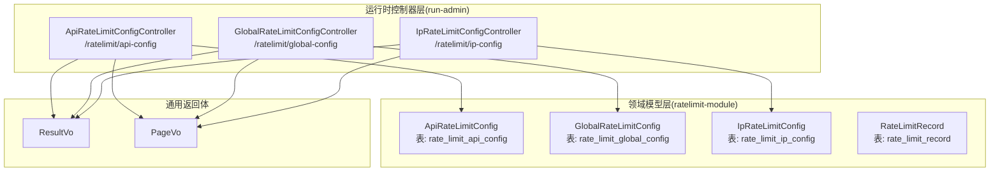
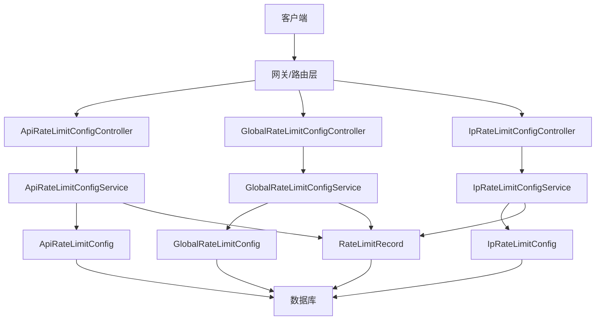

# 限流控制API

<cite>
**本文引用的文件**
- [ApiRateLimitConfigController.java](file://run-admin/src/main/java/com/ fastproject/module/ratelimit/controller/ApiRateLimitConfigController.java)
- [GlobalRateLimitConfigController.java](file://run-admin/src/main/java/com/ fastproject/module/ratelimit/controller/GlobalRateLimitConfigController.java)
- [IpRateLimitConfigController.java](file://run-admin/src/main/java/com/ fastproject/module/ratelimit/controller/IpRateLimitConfigController.java)
- [ApiRateLimitConfig.java](file://ratelimit-module/src/main/java/com/ fastproject/ratelimit/domain/ApiRateLimitConfig.java)
- [GlobalRateLimitConfig.java](file://ratelimit-module/src/main/java/com/ fastproject/ratelimit/domain/GlobalRateLimitConfig.java)
- [IpRateLimitConfig.java](file://ratelimit-module/src/main/java/com/ fastproject/ratelimit/domain/IpRateLimitConfig.java)
- [RateLimitRecord.java](file://ratelimit-module/src/main/java/com/ fastproject/ratelimit/domain/RateLimitRecord.java)
- [RateLimitType.java](file://ratelimit-api/src/main/java/com/ fastproject/ratelimit/enums/RateLimitType.java)
</cite>

## 目录
1. [简介](#简介)
2. [项目结构](#项目结构)
3. [核心组件](#核心组件)
4. [架构总览](#架构总览)
5. [详细组件分析](#详细组件分析)
6. [依赖关系分析](#依赖关系分析)
7. [性能考虑](#性能考虑)
8. [故障排查指南](#故障排查指南)
9. [结论](#结论)
10. [附录](#附录)

## 简介
本文件为限流控制模块的完整API接口文档，覆盖全局限流配置、IP限流配置、API限流配置以及限流记录查询等核心能力。文档面向后端开发者与运维人员，提供RESTful接口定义、请求参数说明、响应格式约定，并结合系统架构图与流程图解释限流策略的配置与执行机制。

## 项目结构
限流控制模块由运行时控制器层（run-admin）与领域模型层（ratelimit-module）组成，配合通用返回体与分页封装，形成清晰的分层架构。



图表来源
- [ApiRateLimitConfigController.java](file://run-admin/src/main/java/com/ fastproject/module/ratelimit/controller/ApiRateLimitConfigController.java#L25)
- [GlobalRateLimitConfigController.java](file://run-admin/src/main/java/com/ fastproject/module/ratelimit/controller/GlobalRateLimitConfigController.java#L25)
- [IpRateLimitConfigController.java](file://run-admin/src/main/java/com/ fastproject/module/ratelimit/controller/IpRateLimitConfigController.java#L25)
- [ApiRateLimitConfig.java](file://ratelimit-module/src/main/java/com/ fastproject/ratelimit/domain/ApiRateLimitConfig.java#L14)
- [GlobalRateLimitConfig.java](file://ratelimit-module/src/main/java/com/ fastproject/ratelimit/domain/GlobalRateLimitConfig.java#L13)
- [IpRateLimitConfig.java](file://ratelimit-module/src/main/java/com/ fastproject/ratelimit/domain/IpRateLimitConfig.java#L14)
- [RateLimitRecord.java](file://ratelimit-module/src/main/java/com/ fastproject/ratelimit/domain/RateLimitRecord.java#L16)

章节来源
- [ApiRateLimitConfigController.java](file://run-admin/src/main/java/com/ fastproject/module/ratelimit/controller/ApiRateLimitConfigController.java#L1-L92)
- [GlobalRateLimitConfigController.java](file://run-admin/src/main/java/com/ fastproject/module/ratelimit/controller/GlobalRateLimitConfigController.java#L1-L101)
- [IpRateLimitConfigController.java](file://run-admin/src/main/java/com/ fastproject/module/ratelimit/controller/IpRateLimitConfigController.java#L1-L101)

## 核心组件
- 控制器层：提供RESTful接口，负责权限校验、幂等性、日志埋点与结果封装。
- 领域模型层：定义限流配置与记录的数据结构，映射数据库表。
- 枚举层：定义限流类型（全局、IP、用户、API），用于统一标识与策略选择。

章节来源
- [ApiRateLimitConfigController.java](file://run-admin/src/main/java/com/ fastproject/module/ratelimit/controller/ApiRateLimitConfigController.java#L20-L92)
- [GlobalRateLimitConfigController.java](file://run-admin/src/main/java/com/ fastproject/module/ratelimit/controller/GlobalRateLimitConfigController.java#L20-L101)
- [IpRateLimitConfigController.java](file://run-admin/src/main/java/com/ fastproject/module/ratelimit/controller/IpRateLimitConfigController.java#L20-L101)
- [ApiRateLimitConfig.java](file://ratelimit-module/src/main/java/com/ fastproject/ratelimit/domain/ApiRateLimitConfig.java#L11-L64)
- [GlobalRateLimitConfig.java](file://ratelimit-module/src/main/java/com/ fastproject/ratelimit/domain/GlobalRateLimitConfig.java#L10-L50)
- [IpRateLimitConfig.java](file://ratelimit-module/src/main/java/com/ fastproject/ratelimit/domain/IpRateLimitConfig.java#L11-L65)
- [RateLimitRecord.java](file://ratelimit-module/src/main/java/com/ fastproject/ratelimit/domain/RateLimitRecord.java#L13-L84)
- [RateLimitType.java](file://ratelimit-api/src/main/java/com/ fastproject/ratelimit/enums/RateLimitType.java#L1-L24)

## 架构总览
下图展示限流配置与记录的总体交互关系，包括控制器、服务层（未在本文展开）、持久化存储与通用返回体。



图表来源
- [ApiRateLimitConfigController.java](file://run-admin/src/main/java/com/ fastproject/module/ratelimit/controller/ApiRateLimitConfigController.java#L25)
- [GlobalRateLimitConfigController.java](file://run-admin/src/main/java/com/ fastproject/module/ratelimit/controller/GlobalRateLimitConfigController.java#L25)
- [IpRateLimitConfigController.java](file://run-admin/src/main/java/com/ fastproject/module/ratelimit/controller/IpRateLimitConfigController.java#L25)
- [ApiRateLimitConfig.java](file://ratelimit-module/src/main/java/com/ fastproject/ratelimit/domain/ApiRateLimitConfig.java#L14)
- [GlobalRateLimitConfig.java](file://ratelimit-module/src/main/java/com/ fastproject/ratelimit/domain/GlobalRateLimitConfig.java#L13)
- [IpRateLimitConfig.java](file://ratelimit-module/src/main/java/com/ fastproject/ratelimit/domain/IpRateLimitConfig.java#L14)
- [RateLimitRecord.java](file://ratelimit-module/src/main/java/com/ fastproject/ratelimit/domain/RateLimitRecord.java#L16)

## 详细组件分析

### API限流配置接口(ApiRateLimitConfigController)
- 基础路径：/ratelimit/api-config
- 权限注解：使用@PreAuthorize进行权限校验；新增与更新使用@Idempotent保证幂等性；操作记录通过@Log埋点。

接口定义
- 新增配置
  - 方法：POST
  - 路径：/ratelimit/api-config
  - 权限：admin:ratelimit:api-config:add
  - 幂等：是（前缀 add:ratelimit:api-config:）
  - 请求体：ApiRateLimitConfigCreate
  - 返回：ResultVo<Object>
- 修改配置
  - 方法：PUT
  - 路径：/ratelimit/api-config
  - 权限：admin:ratelimit:api-config:update
  - 幂等：是（前缀 update:ratelimit:api-config:）
  - 请求体：ApiRateLimitConfigUpdate
  - 返回：ResultVo<Object>
- 删除配置
  - 方法：DELETE
  - 路径：/ratelimit/api-config/{id}
  - 权限：admin:ratelimit:api-config:delete
  - 返回：ResultVo<Object>
- 批量删除
  - 方法：DELETE
  - 路径：/ratelimit/api-config/batch
  - 权限：admin:ratelimit:api-config:delete
  - 请求体：List<Long> ids
  - 返回：ResultVo<Object>
- 分页查询
  - 方法：POST
  - 路径：/ratelimit/api-config/page
  - 权限：admin:ratelimit:api-config:page
  - 请求体：ApiRateLimitConfigQuery
  - 返回：ResultVo<PageVo<List<ApiRateLimitConfigVo>>>
- 详情查询
  - 方法：GET
  - 路径：/ratelimit/api-config/{id}
  - 权限：admin:ratelimit:api-config:page
  - 返回：ResultVo<ApiRateLimitConfigVo>

数据模型字段（ApiRateLimitConfig）
- 应用代码：app_code
- API路径：api_path
- HTTP方法：http_method
- 最大请求次数：max_requests
- 时间窗口(秒)：time_window
- 限流维度：limit_dimension
- 是否启用：enabled

章节来源
- [ApiRateLimitConfigController.java](file://run-admin/src/main/java/com/ fastproject/module/ratelimit/controller/ApiRateLimitConfigController.java#L30-L91)
- [ApiRateLimitConfig.java](file://ratelimit-module/src/main/java/com/ fastproject/ratelimit/domain/ApiRateLimitConfig.java#L22-L63)

### 全局限流配置接口(GlobalRateLimitConfigController)
- 基础路径：/ratelimit/global-config
- 权限注解：@PreAuthorize；新增与更新使用@Idempotent；@Log埋点。

接口定义
- 新增配置
  - 方法：POST
  - 路径：/ratelimit/global-config
  - 权限：admin:ratelimit:global-config:add
  - 幂等：是（前缀 add:ratelimit:global-config:）
  - 请求体：GlobalRateLimitConfigCreate
  - 返回：ResultVo<Object>
- 修改配置
  - 方法：PUT
  - 路径：/ratelimit/global-config
  - 权限：admin:ratelimit:global-config:update
  - 幂等：是（前缀 update:ratelimit:global-config:）
  - 请求体：GlobalRateLimitConfigUpdate
  - 返回：ResultVo<Object>
- 删除配置
  - 方法：DELETE
  - 路径：/ratelimit/global-config/{id}
  - 权限：admin:ratelimit:global-config:delete
  - 返回：ResultVo<Object>
- 批量删除
  - 方法：DELETE
  - 路径：/ratelimit/global-config/batch
  - 权限：admin:ratelimit:global-config:delete
  - 请求体：List<Long> ids
  - 返回：ResultVo<Object>
- 分页查询
  - 方法：POST
  - 路径：/ratelimit/global-config/page
  - 权限：admin:ratelimit:global-config:page
  - 请求体：GlobalRateLimitConfigQuery
  - 返回：ResultVo<PageVo<List<GlobalRateLimitConfigVo>>>
- 详情查询
  - 方法：GET
  - 路径：/ratelimit/global-config/{id}
  - 权限：admin:ratelimit:global-config:page
  - 返回：ResultVo<GlobalRateLimitConfigVo>
- 获取启用的配置
  - 方法：GET
  - 路径：/ratelimit/global-config/enabled
  - 权限：admin:ratelimit:global-config:page
  - 返回：ResultVo<GlobalRateLimitConfigVo>

数据模型字段（GlobalRateLimitConfig）
- 应用代码：app_code
- 全局最大QPS：max_requests
- 时间窗口(秒)：time_window
- 突发容量(令牌桶)：burst_capacity
- 是否启用：enabled

章节来源
- [GlobalRateLimitConfigController.java](file://run-admin/src/main/java/com/ fastproject/module/ratelimit/controller/GlobalRateLimitConfigController.java#L30-L100)
- [GlobalRateLimitConfig.java](file://ratelimit-module/src/main/java/com/ fastproject/ratelimit/domain/GlobalRateLimitConfig.java#L21-L49)

### IP限流配置接口(IpRateLimitConfigController)
- 基础路径：/ratelimit/ip-config
- 权限注解：@PreAuthorize；新增与更新使用@Idempotent；@Log埋点。

接口定义
- 新增配置
  - 方法：POST
  - 路径：/ratelimit/ip-config
  - 权限：admin:ratelimit:ip-config:add
  - 幂等：是（前缀 add:ratelimit:ip-config:）
  - 请求体：IpRateLimitConfigCreate
  - 返回：ResultVo<Object>
- 修改配置
  - 方法：PUT
  - 路径：/ratelimit/ip-config
  - 权限：admin:ratelimit:ip-config:update
  - 幂等：是（前缀 update:ratelimit:ip-config:）
  - 请求体：IpRateLimitConfigUpdate
  - 返回：ResultVo<Object>
- 删除配置
  - 方法：DELETE
  - 路径：/ratelimit/ip-config/{id}
  - 权限：admin:ratelimit:ip-config:delete
  - 返回：ResultVo<Object>
- 批量删除
  - 方法：DELETE
  - 路径：/ratelimit/ip-config/batch
  - 权限：admin:ratelimit:ip-config:delete
  - 请求体：List<Long> ids
  - 返回：ResultVo<Object>
- 分页查询
  - 方法：POST
  - 路径：/ratelimit/ip-config/page
  - 权限：admin:ratelimit:ip-config:page
  - 请求体：IpRateLimitConfigQuery
  - 返回：ResultVo<PageVo<List<IpRateLimitConfigVo>>>
- 详情查询
  - 方法：GET
  - 路径：/ratelimit/ip-config/{id}
  - 权限：admin:ratelimit:ip-config:page
  - 返回：ResultVo<IpRateLimitConfigVo>
- 根据IP地址查询
  - 方法：GET
  - 路径：/ratelimit/ip-config/ip/{ipAddress}
  - 权限：admin:ratelimit:ip-config:page
  - 返回：ResultVo<IpRateLimitConfigVo>

数据模型字段（IpRateLimitConfig）
- 应用代码：app_code
- IP地址或IP段：ip_address
- IP类型：ip_type（ALL/SINGLE/SEGMENT）
- 每秒最大请求次数(QPS)：max_requests
- 时间窗口(秒)：time_window
- 突发容量：burst_capacity
- 是否启用：enabled

章节来源
- [IpRateLimitConfigController.java](file://run-admin/src/main/java/com/ fastproject/module/ratelimit/controller/IpRateLimitConfigController.java#L30-L100)
- [IpRateLimitConfig.java](file://ratelimit-module/src/main/java/com/ fastproject/ratelimit/domain/IpRateLimitConfig.java#L21-L63)

### 限流记录查询接口（概念说明）
- 用途：查询限流触发记录，便于审计与问题定位。
- 建议路径：/ratelimit/record/page
- 请求体：RateLimitRecordQuery（建议）
- 返回：ResultVo<PageVo<List<RateLimitRecordVo>>>
- 数据模型字段（RateLimitRecord）
  - 应用编码：appCode
  - 限流标识Key：limitKey
  - 限流类型：limitType（GLOBAL/IP/USER/API）
  - 目标值：targetValue
  - 请求方法：method
  - 请求地址：url
  - 请求IP：ip
  - 用户ID：userId
  - 请求头：headers
  - 查询参数：queryParams
  - 触发原因：limitReason

章节来源
- [RateLimitRecord.java](file://ratelimit-module/src/main/java/com/ fastproject/ratelimit/domain/RateLimitRecord.java#L22-L83)
- [RateLimitType.java](file://ratelimit-api/src/main/java/com/ fastproject/ratelimit/enums/RateLimitType.java#L6-L23)

## 依赖关系分析
- 控制器依赖服务层（未在本文展开），服务层依赖仓库与领域模型。
- 领域模型映射到数据库表，支持软删除与启用状态过滤。
- 通用返回体ResultVo与分页封装PageVo贯穿所有接口。

```mermaid
classDiagram
class ApiRateLimitConfigController {
+POST "/ratelimit/api-config"
+PUT "/ratelimit/api-config"
+DELETE "/ratelimit/api-config/{id}"
+DELETE "/ratelimit/api-config/batch"
+POST "/ratelimit/api-config/page"
+GET "/ratelimit/api-config/{id}"
}
class GlobalRateLimitConfigController {
+POST "/ratelimit/global-config"
+PUT "/ratelimit/global-config"
+DELETE "/ratelimit/global-config/{id}"
+DELETE "/ratelimit/global-config/batch"
+POST "/ratelimit/global-config/page"
+GET "/ratelimit/global-config/{id}"
+GET "/ratelimit/global-config/enabled"
}
class IpRateLimitConfigController {
+POST "/ratelimit/ip-config"
+PUT "/ratelimit/ip-config"
+DELETE "/ratelimit/ip-config/{id}"
+DELETE "/ratelimit/ip-config/batch"
+POST "/ratelimit/ip-config/page"
+GET "/ratelimit/ip-config/{id}"
+GET "/ratelimit/ip-config/ip/{ipAddress}"
}
class ApiRateLimitConfig
class GlobalRateLimitConfig
class IpRateLimitConfig
class RateLimitRecord
ApiRateLimitConfigController --> ApiRateLimitConfig : "读写"
GlobalRateLimitConfigController --> GlobalRateLimitConfig : "读写"
IpRateLimitConfigController --> IpRateLimitConfig : "读写"
ApiRateLimitConfigController --> RateLimitRecord : "记录"
GlobalRateLimitConfigController --> RateLimitRecord : "记录"
IpRateLimitConfigController --> RateLimitRecord : "记录"
```

图表来源
- [ApiRateLimitConfigController.java](file://run-admin/src/main/java/com/ fastproject/module/ratelimit/controller/ApiRateLimitConfigController.java#L25-L91)
- [GlobalRateLimitConfigController.java](file://run-admin/src/main/java/com/ fastproject/module/ratelimit/controller/GlobalRateLimitConfigController.java#L25-L100)
- [IpRateLimitConfigController.java](file://run-admin/src/main/java/com/ fastproject/module/ratelimit/controller/IpRateLimitConfigController.java#L25-L100)
- [ApiRateLimitConfig.java](file://ratelimit-module/src/main/java/com/ fastproject/ratelimit/domain/ApiRateLimitConfig.java#L14)
- [GlobalRateLimitConfig.java](file://ratelimit-module/src/main/java/com/ fastproject/ratelimit/domain/GlobalRateLimitConfig.java#L13)
- [IpRateLimitConfig.java](file://ratelimit-module/src/main/java/com/ fastproject/ratelimit/domain/IpRateLimitConfig.java#L14)
- [RateLimitRecord.java](file://ratelimit-module/src/main/java/com/ fastproject/ratelimit/domain/RateLimitRecord.java#L16)

## 性能考虑
- 幂等性：新增与更新接口均采用@Idempotent，避免重复提交导致的配置抖动与额外开销。
- 缓存策略：建议对“启用的全局配置”与常用IP/API配置进行缓存，降低数据库压力。
- 分页查询：列表与分页接口返回PageVo，建议设置合理分页大小与排序字段，避免超大数据集扫描。
- 数据库索引：针对高频查询字段（如app_code、api_path、http_method、ip_address）建立复合索引。
- 异步落库：限流记录可异步入库或批量入库，减少主链路阻塞。
- 网关前置：在网关层进行快速匹配与计数，降低下游服务压力。

## 故障排查指南
- 权限不足：若返回无权限，请确认当前用户是否具备对应权限标识。
- 幂等冲突：重复提交相同请求可能被幂等拦截，检查请求唯一键与过期时间。
- 参数校验失败：请求体字段缺失或类型不匹配会导致校验异常，核对各接口请求体定义。
- 记录缺失：若限流记录为空，确认是否已开启记录开关、是否命中限流策略、是否存在异步延迟。
- 配置未生效：检查配置是否启用、是否正确匹配到目标维度（全局/IP/用户/API）。

## 结论
本API文档系统性地梳理了限流控制模块的配置与记录能力，明确了各控制器的REST接口、请求参数与响应格式，并给出了性能优化与故障排查建议。建议在生产环境中结合缓存、索引与异步处理进一步提升吞吐与稳定性。

## 附录

### 通用返回体与分页封装
- ResultVo<T>：统一响应包装，包含状态码、消息与业务数据。
- PageVo<T>：分页结果封装，包含数据列表、总数与分页信息。

### 限流类型枚举
- GLOBAL：全局限流
- IP：IP限流
- USER：用户限流
- API：API限流

章节来源
- [RateLimitType.java](file://ratelimit-api/src/main/java/com/ fastproject/ratelimit/enums/RateLimitType.java#L6-L23)