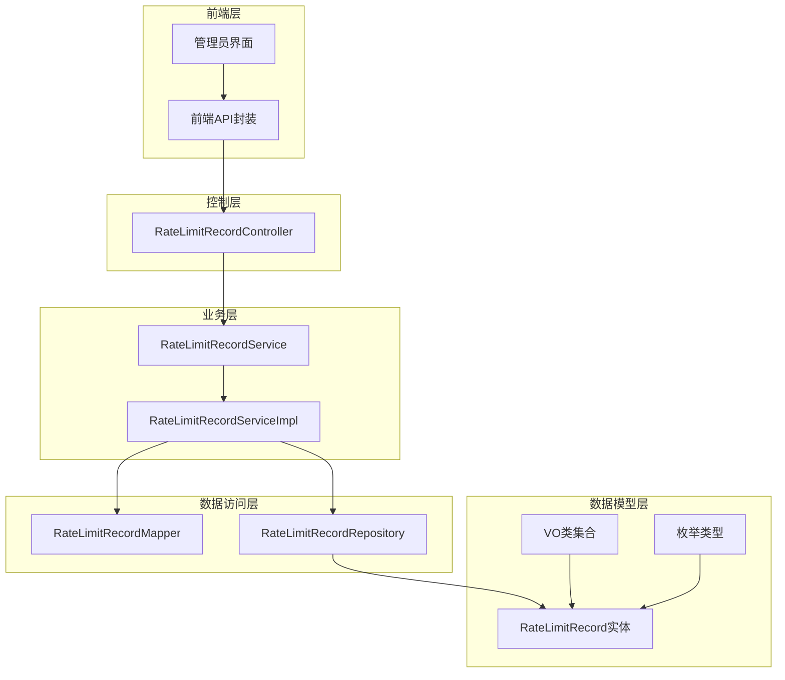
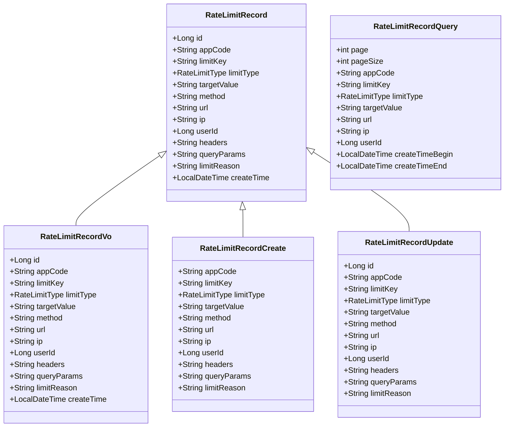
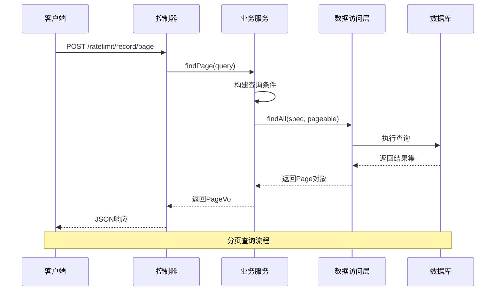
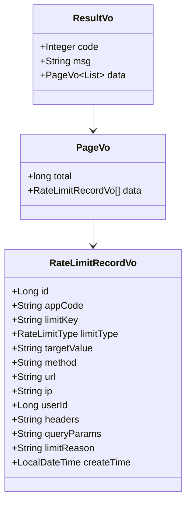
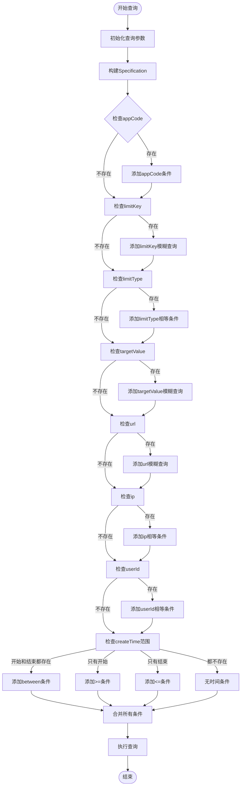
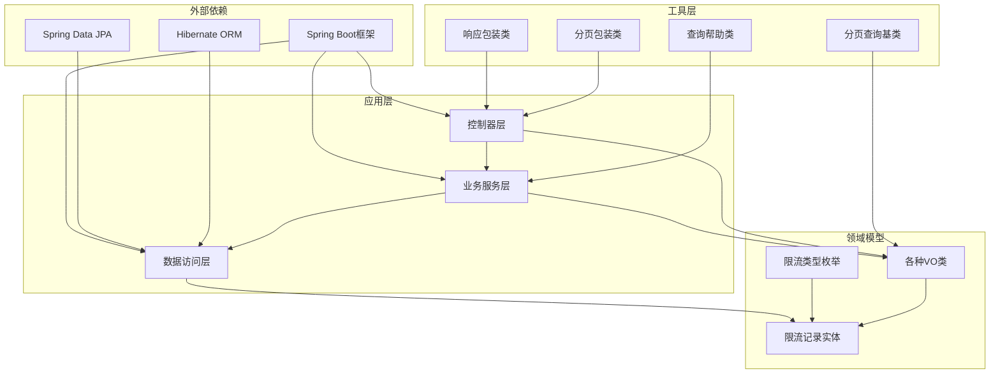

# 限流记录查询API

<cite>
**本文档引用的文件**
- [RateLimitRecordController.java](file://run-admin/src/main/java/com/fastproject/module/ratelimit/controller/RateLimitRecordController.java)
- [RateLimitRecordServiceImpl.java](file://ratelimit-module/src/main/java/com/fastproject/ratelimit/service/impl/RateLimitRecordServiceImpl.java)
- [RateLimitRecordVo.java](file://ratelimit-module/src/main/java/com/fastproject/ratelimit/vo/record/RateLimitRecordVo.java)
- [RateLimitRecordQuery.java](file://ratelimit-module/src/main/java/com/fastproject/ratelimit/vo/record/RateLimitRecordQuery.java)
- [RateLimitRecordCreate.java](file://ratelimit-module/src/main/java/com/fastproject/ratelimit/vo/record/RateLimitRecordCreate.java)
- [RateLimitRecordUpdate.java](file://ratelimit-module/src/main/java/com/fastproject/ratelimit/vo/record/RateLimitRecordUpdate.java)
- [RateLimitRecordMapper.java](file://ratelimit-module/src/main/java/com/fastproject/ratelimit/mapper/RateLimitRecordMapper.java)
- [RateLimitRecordRepository.java](file://ratelimit-module/src/main/java/com/fastproject/ratelimit/repository/db/RateLimitRecordRepository.java)
- [RateLimitType.java](file://ratelimit-api/src/main/java/com/fastproject/ratelimit/enums/RateLimitType.java)
- [PageQuery.java](file://common/src/main/java/com/fastproject/db/PageQuery.java)
- [QueryHelp.java](file://common/src/main/java/com/fastproject/db/QueryHelp.java)
- [PageVo.java](file://utils/src/main/java/com/fastproject/utils/vo/PageVo.java)
- [ResultVo.java](file://utils/src/main/java/com/fastproject/utils/vo/ResultVo.java)
- [record.ts](file://fast-ui/apps/admin-vue/src/api/ratelimit/record.ts)
</cite>

## 目录
1. [简介](#简介)
2. [项目结构](#项目结构)
3. [核心组件](#核心组件)
4. [架构概览](#架构概览)
5. [详细组件分析](#详细组件分析)
6. [依赖关系分析](#依赖关系分析)
7. [性能考虑](#性能考虑)
8. [故障排除指南](#故障排除指南)
9. [结论](#结论)

## 简介

本文件详细描述了限流记录查询系统的RESTful API接口规范。该系统提供了完整的限流记录管理功能，包括查询、统计和分析能力。系统支持多种限流类型（全局、IP、用户、API），并提供灵活的时间段筛选和条件过滤功能。

## 项目结构

限流记录查询系统采用典型的三层架构设计，主要包含以下模块：



**图表来源**
- [RateLimitRecordController.java](file://run-admin/src/main/java/com/fastproject/module/ratelimit/controller/RateLimitRecordController.java#L1-L92)
- [RateLimitRecordServiceImpl.java](file://ratelimit-module/src/main/java/com/fastproject/ratelimit/service/impl/RateLimitRecordServiceImpl.java#L1-L124)

**章节来源**
- [RateLimitRecordController.java](file://run-admin/src/main/java/com/fastproject/module/ratelimit/controller/RateLimitRecordController.java#L1-L92)
- [RateLimitRecordServiceImpl.java](file://ratelimit-module/src/main/java/com/fastproject/ratelimit/service/impl/RateLimitRecordServiceImpl.java#L1-L124)

## 核心组件

### 数据模型

系统的核心数据模型围绕限流记录展开，包含以下关键实体：



**图表来源**
- [RateLimitRecordVo.java](file://ratelimit-module/src/main/java/com/fastproject/ratelimit/vo/record/RateLimitRecordVo.java#L1-L78)
- [RateLimitRecordQuery.java](file://ratelimit-module/src/main/java/com/fastproject/ratelimit/vo/record/RateLimitRecordQuery.java#L1-L62)
- [RateLimitRecordCreate.java](file://ratelimit-module/src/main/java/com/fastproject/ratelimit/vo/record/RateLimitRecordCreate.java#L1-L68)
- [RateLimitRecordUpdate.java](file://ratelimit-module/src/main/java/com/fastproject/ratelimit/vo/record/RateLimitRecordUpdate.java#L1-L73)

### 限流类型枚举

系统支持四种限流类型，每种类型都有特定的应用场景：

| 限流类型 | 描述 | 使用场景 |
|---------|------|----------|
| GLOBAL | 全局限流 | 整个系统的流量控制 |
| IP | IP限流 | 基于客户端IP地址的流量控制 |
| USER | 用户限流 | 基于用户身份的流量控制 |
| API | API限流 | 针对特定API接口的流量控制 |

**章节来源**
- [RateLimitType.java](file://ratelimit-api/src/main/java/com/fastproject/ratelimit/enums/RateLimitType.java#L1-L24)
- [RateLimitRecordVo.java](file://ratelimit-module/src/main/java/com/fastproject/ratelimit/vo/record/RateLimitRecordVo.java#L1-L78)

## 架构概览

系统采用标准的MVC架构模式，结合Spring Boot框架的自动配置特性：



**图表来源**
- [RateLimitRecordController.java](file://run-admin/src/main/java/com/fastproject/module/ratelimit/controller/RateLimitRecordController.java#L78-L82)
- [RateLimitRecordServiceImpl.java](file://ratelimit-module/src/main/java/com/fastproject/ratelimit/service/impl/RateLimitRecordServiceImpl.java#L82-L123)

## 详细组件分析

### RESTful API接口规范

#### 分页查询接口

**请求URL**: `POST /ratelimit/record/page`

**请求头**:
- Content-Type: application/json
- Authorization: Bearer {token}

**请求体参数**:

| 参数名 | 类型 | 必填 | 描述 | 示例 |
|--------|------|------|------|------|
| page | number | 是 | 当前页码 | 1 |
| pageSize | number | 是 | 每页记录数 | 10 |
| appCode | string | 否 | 应用编码 | "APP001" |
| limitKey | string | 否 | 限流标识Key | "user_login" |
| limitType | string | 否 | 限流类型 | "USER" |
| targetValue | string | 否 | 目标值 | "192.168.1.100" |
| url | string | 否 | 请求地址 | "/api/user/login" |
| ip | string | 否 | 请求IP | "192.168.1.100" |
| userId | number | 否 | 用户ID | 12345 |
| createTimeBegin | string | 否 | 创建时间开始 | "2024-01-01 00:00:00" |
| createTimeEnd | string | 否 | 创建时间结束 | "2024-01-01 23:59:59" |

**响应体结构**:



**图表来源**
- [ResultVo.java](file://utils/src/main/java/com/fastproject/utils/vo/ResultVo.java#L1-L46)
- [PageVo.java](file://utils/src/main/java/com/fastproject/utils/vo/PageVo.java#L1-L23)
- [RateLimitRecordVo.java](file://ratelimit-module/src/main/java/com/fastproject/ratelimit/vo/record/RateLimitRecordVo.java#L1-L78)

**响应示例**:
```json
{
  "code": 200,
  "msg": "success",
  "data": {
    "total": 150,
    "data": [
      {
        "id": 1,
        "appCode": "APP001",
        "limitKey": "user_login",
        "limitType": "USER",
        "targetValue": "12345",
        "method": "POST",
        "url": "/api/user/login",
        "ip": "192.168.1.100",
        "userId": 12345,
        "headers": "{}",
        "queryParams": "{}",
        "limitReason": "用户登录频率超限",
        "createTime": "2024-01-01T10:30:00"
      }
    ]
  }
}
```

#### 详情查询接口

**请求URL**: `GET /ratelimit/record/{id}`

**路径参数**:
- id: 记录ID (number, 必填)

**响应示例**:
```json
{
  "code": 200,
  "msg": "success",
  "data": {
    "id": 1,
    "appCode": "APP001",
    "limitKey": "user_login",
    "limitType": "USER",
    "targetValue": "12345",
    "method": "POST",
    "url": "/api/user/login",
    "ip": "192.168.1.100",
    "userId": 12345,
    "headers": "{}",
    "queryParams": "{}",
    "limitReason": "用户登录频率超限",
    "createTime": "2024-01-01T10:30:00"
  }
}
```

#### 创建接口

**请求URL**: `POST /ratelimit/record`

**请求体参数**:
与创建VO相同，但不包含ID字段

#### 更新接口

**请求URL**: `PUT /ratelimit/record`

**请求体参数**:
包含完整的更新信息，必须包含ID字段

#### 删除接口

**请求URL**: `DELETE /ratelimit/record/{id}`

**路径参数**:
- id: 记录ID (number, 必填)

#### 批量删除接口

**请求URL**: `DELETE /ratelimit/record/batch`

**请求体参数**:
- ids: ID数组 (number[], 必填)

**章节来源**
- [RateLimitRecordController.java](file://run-admin/src/main/java/com/fastproject/module/ratelimit/controller/RateLimitRecordController.java#L33-L91)
- [record.ts](file://fast-ui/apps/admin-vue/src/api/ratelimit/record.ts#L57-L106)

### 查询条件处理机制

系统使用JPA Specification进行动态查询构建，支持多种查询条件组合：



**图表来源**
- [RateLimitRecordServiceImpl.java](file://ratelimit-module/src/main/java/com/fastproject/ratelimit/service/impl/RateLimitRecordServiceImpl.java#L86-L117)

**章节来源**
- [RateLimitRecordServiceImpl.java](file://ratelimit-module/src/main/java/com/fastproject/ratelimit/service/impl/RateLimitRecordServiceImpl.java#L82-L123)

### 权限控制机制

系统采用基于角色的权限控制（RBAC）：

| 接口 | 权限标识 | 描述 |
|------|----------|------|
| POST /ratelimit/record | admin:ratelimit:record:add | 添加限流记录 |
| PUT /ratelimit/record | admin:ratelimit:record:update | 修改限流记录 |
| DELETE /ratelimit/record/{id} | admin:ratelimit:record:delete | 删除限流记录 |
| DELETE /ratelimit/record/batch | admin:ratelimit:record:delete | 批量删除限流记录 |
| POST /ratelimit/record/page | admin:ratelimit:record:page | 分页查询限流记录 |
| GET /ratelimit/record/{id} | admin:ratelimit:record:page | 获取限流记录详情 |

**章节来源**
- [RateLimitRecordController.java](file://run-admin/src/main/java/com/fastproject/module/ratelimit/controller/RateLimitRecordController.java#L33-L91)

## 依赖关系分析

系统各层之间的依赖关系清晰明确：



**图表来源**
- [RateLimitRecordController.java](file://run-admin/src/main/java/com/fastproject/module/ratelimit/controller/RateLimitRecordController.java#L1-L92)
- [RateLimitRecordServiceImpl.java](file://ratelimit-module/src/main/java/com/fastproject/ratelimit/service/impl/RateLimitRecordServiceImpl.java#L1-L124)

**章节来源**
- [QueryHelp.java](file://common/src/main/java/com/fastproject/db/QueryHelp.java#L1-L44)
- [PageQuery.java](file://common/src/main/java/com/fastproject/db/PageQuery.java#L1-L15)

## 性能考虑

### 查询优化策略

1. **索引优化**: 建议在常用查询字段上建立数据库索引
   - `appCode`: 应用编码查询
   - `limitKey`: 限流标识Key查询  
   - `limitType`: 限流类型查询
   - `targetValue`: 目标值查询
   - `userId`: 用户ID查询
   - `ip`: IP地址查询
   - `createTime`: 时间范围查询

2. **分页优化**: 默认按ID降序排列，确保分页查询的稳定性

3. **条件过滤**: 使用Specification动态构建查询条件，避免不必要的全表扫描

### 缓存策略

建议实现多级缓存：
- Redis缓存热点查询结果
- 本地缓存最近访问的记录
- 数据库连接池优化

## 故障排除指南

### 常见问题及解决方案

**问题1**: 查询结果为空
- 检查查询条件是否过于严格
- 验证时间范围是否正确
- 确认权限是否足够

**问题2**: 性能问题
- 优化查询条件组合
- 考虑添加适当的数据库索引
- 调整分页大小

**问题3**: 权限错误
- 确认用户具有相应的操作权限
- 检查权限配置是否正确

**章节来源**
- [RateLimitRecordServiceImpl.java](file://ratelimit-module/src/main/java/com/fastproject/ratelimit/service/impl/RateLimitRecordServiceImpl.java#L82-L123)

## 结论

限流记录查询系统提供了完整、灵活的限流数据分析和管理功能。通过RESTful API接口，用户可以轻松地查询、统计和分析系统的限流情况。系统采用现代化的技术栈和架构设计，具备良好的扩展性和维护性。

主要特点包括：
- 完整的CRUD操作支持
- 灵活的查询条件组合
- 基于角色的权限控制
- 标准化的响应格式
- 清晰的分层架构设计

该系统为运维管理和数据分析提供了强有力的技术支撑，能够有效帮助管理员监控和分析系统的限流状态。