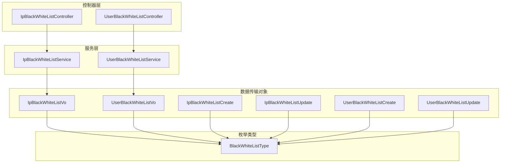
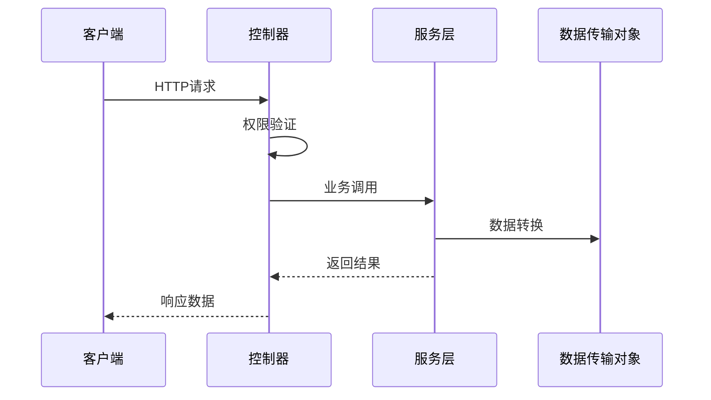
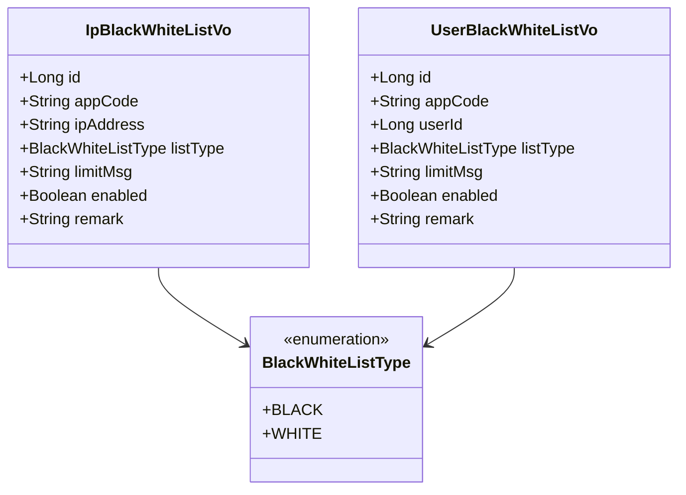
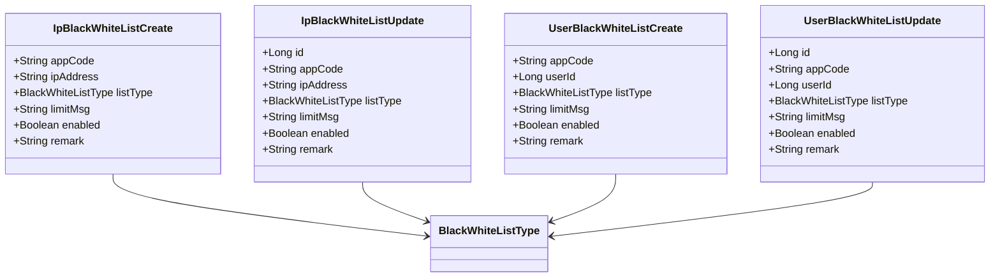
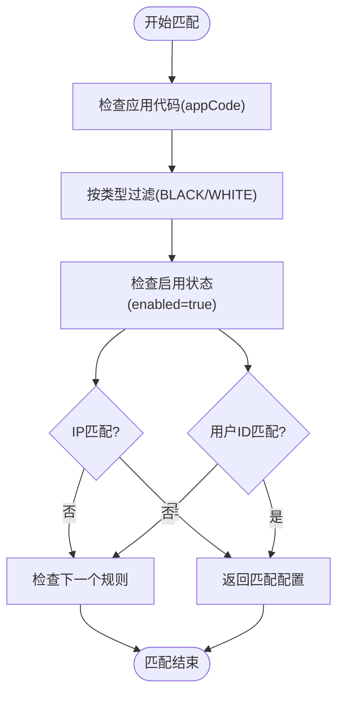
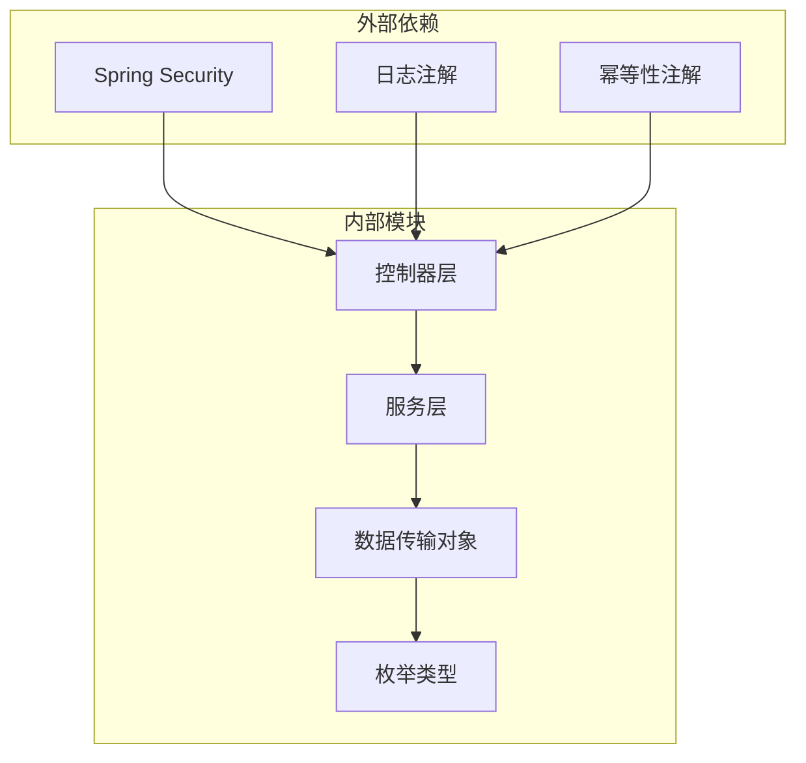

# 黑白名单配置API

<cite>
**本文档引用的文件**
- [IpBlackWhiteListController.java](file://run-admin/src/main/java/com/fastproject/module/ratelimit/controller/IpBlackWhiteListController.java)
- [UserBlackWhiteListController.java](file://run-admin/src/main/java/com/fastproject/module/ratelimit/controller/UserBlackWhiteListController.java)
- [IpBlackWhiteListService.java](file://ratelimit-module/src/main/java/com/fastproject/ratelimit/service/IpBlackWhiteListService.java)
- [UserBlackWhiteListService.java](file://ratelimit-module/src/main/java/com/fastproject/ratelimit/service/UserBlackWhiteListService.java)
- [IpBlackWhiteListVo.java](file://ratelimit-module/src/main/java/com/fastproject/ratelimit/vo/ipbw/IpBlackWhiteListVo.java)
- [UserBlackWhiteListVo.java](file://ratelimit-module/src/main/java/com/fastproject/ratelimit/vo/userbw/UserBlackWhiteListVo.java)
- [IpBlackWhiteListCreate.java](file://ratelimit-module/src/main/java/com/fastproject/ratelimit/vo/ipbw/IpBlackWhiteListCreate.java)
- [IpBlackWhiteListUpdate.java](file://ratelimit-module/src/main/java/com/fastproject/ratelimit/vo/ipbw/IpBlackWhiteListUpdate.java)
- [UserBlackWhiteListCreate.java](file://ratelimit-module/src/main/java/com/fastproject/ratelimit/vo/userbw/UserBlackWhiteListCreate.java)
- [UserBlackWhiteListUpdate.java](file://ratelimit-module/src/main/java/com/fastproject/ratelimit/vo/userbw/UserBlackWhiteListUpdate.java)
- [BlackWhiteListType.java](file://ratelimit-api/src/main/java/com/fastproject/ratelimit/enums/BlackWhiteListType.java)
</cite>

## 目录
1. [简介](#简介)
2. [项目结构](#项目结构)
3. [核心组件](#核心组件)
4. [架构概览](#架构概览)
5. [详细组件分析](#详细组件分析)
6. [依赖关系分析](#依赖关系分析)
7. [性能考虑](#性能考虑)
8. [故障排除指南](#故障排除指南)
9. [结论](#结论)

## 简介

本文档详细描述了系统中的黑白名单配置API，包括IP黑白名单和用户黑白名单的管理功能。这些API为限流系统提供了灵活的访问控制机制，允许管理员通过配置黑白名单来精确控制不同应用或用户的请求频率。

黑白名单系统支持两种类型的配置：
- **IP黑名单**：基于IP地址范围的访问控制
- **用户黑名单**：基于用户ID的访问控制

系统采用分层架构设计，包含控制器层、服务层、数据传输对象（DTO）层，确保了良好的代码组织和可维护性。

## 项目结构

黑白名单配置功能分布在以下模块中：

**图表来源**
- [IpBlackWhiteListController.java](file://run-admin/src/main/java/com/fastproject/module/ratelimit/controller/IpBlackWhiteListController.java#L23-L26)
- [UserBlackWhiteListController.java](file://run-admin/src/main/java/com/fastproject/module/ratelimit/controller/UserBlackWhiteListController.java#L23-L26)
- [IpBlackWhiteListService.java](file://ratelimit-module/src/main/java/com/fastproject/ratelimit/service/IpBlackWhiteListService.java#L14-L14)
- [UserBlackWhiteListService.java](file://ratelimit-module/src/main/java/com/fastproject/ratelimit/service/UserBlackWhiteListService.java#L14-L14)

**章节来源**
- [IpBlackWhiteListController.java](file://run-admin/src/main/java/com/fastproject/module/ratelimit/controller/IpBlackWhiteListController.java#L1-L93)
- [UserBlackWhiteListController.java](file://run-admin/src/main/java/com/fastproject/module/ratelimit/controller/UserBlackWhiteListController.java#L1-L93)

## 核心组件

### 控制器组件

系统包含两个主要的控制器类，分别处理IP和用户黑白名单的管理操作：

#### IP黑白名单控制器
- **路径**：`/ratelimit/ip-bw-config`
- **功能**：管理IP地址范围的黑白名单配置
- **权限**：`admin:ratelimit:ip-bw-config:*`

#### 用户黑白名单控制器
- **路径**：`/ratelimit/user-bw-config`
- **功能**：管理用户ID的黑白名单配置
- **权限**：`admin:ratelimit:user-bw-config:*`

### 服务组件

#### IP黑白名单服务接口
提供完整的CRUD操作和检查功能：
- 保存、更新、删除、批量删除
- 分页查询和详情查询
- IP地址匹配检查

#### 用户黑白名单服务接口
提供完整的CRUD操作和检查功能：
- 保存、更新、删除、批量删除
- 分页查询和详情查询
- 用户ID匹配检查

**章节来源**
- [IpBlackWhiteListService.java](file://ratelimit-module/src/main/java/com/fastproject/ratelimit/service/IpBlackWhiteListService.java#L11-L51)
- [UserBlackWhiteListService.java](file://ratelimit-module/src/main/java/com/fastproject/ratelimit/service/UserBlackWhiteListService.java#L11-L51)

## 架构概览

**图表来源**
- [IpBlackWhiteListController.java](file://run-admin/src/main/java/com/fastproject/module/ratelimit/controller/IpBlackWhiteListController.java#L33-L39)
- [UserBlackWhiteListController.java](file://run-admin/src/main/java/com/fastproject/module/ratelimit/controller/UserBlackWhiteListController.java#L33-L39)

## 详细组件分析

### 数据模型分析

#### 黑白名单类型枚举

**图表来源**
- [BlackWhiteListType.java](file://ratelimit-api/src/main/java/com/fastproject/ratelimit/enums/BlackWhiteListType.java)
- [IpBlackWhiteListVo.java](file://ratelimit-module/src/main/java/com/fastproject/ratelimit/vo/ipbw/IpBlackWhiteListVo.java#L9-L25)
- [UserBlackWhiteListVo.java](file://ratelimit-module/src/main/java/com/fastproject/ratelimit/vo/userbw/UserBlackWhiteListVo.java#L9-L25)

#### 创建和更新数据模型

**图表来源**
- [IpBlackWhiteListCreate.java](file://ratelimit-module/src/main/java/com/fastproject/ratelimit/vo/ipbw/IpBlackWhiteListCreate.java)
- [IpBlackWhiteListUpdate.java](file://ratelimit-module/src/main/java/com/fastproject/ratelimit/vo/ipbw/IpBlackWhiteListUpdate.java)
- [UserBlackWhiteListCreate.java](file://ratelimit-module/src/main/java/com/fastproject/ratelimit/vo/userbw/UserBlackWhiteListCreate.java)
- [UserBlackWhiteListUpdate.java](file://ratelimit-module/src/main/java/com/fastproject/ratelimit/vo/userbw/UserBlackWhiteListUpdate.java)

### API接口规范

#### IP黑白名单API

##### 添加IP黑白名单配置
- **方法**：POST
- **路径**：`/ratelimit/ip-bw-config`
- **权限**：`admin:ratelimit:ip-bw-config:add`
- **幂等性**：支持，使用`@Idempotent`注解
- **请求体**：`IpBlackWhiteListCreate`
- **响应**：`ResultVo<Object>`

##### 更新IP黑白名单配置
- **方法**：PUT
- **路径**：`/ratelimit/ip-bw-config`
- **权限**：`admin:ratelimit:ip-bw-config:update`
- **幂等性**：支持，使用`@Idempotent`注解
- **请求体**：`IpBlackWhiteListUpdate`
- **响应**：`ResultVo<Object>`

##### 删除IP黑白名单配置
- **方法**：DELETE
- **路径**：`/ratelimit/ip-bw-config/{id}`
- **权限**：`admin:ratelimit:ip-bw-config:delete`
- **参数**：`id` (路径变量)
- **响应**：`ResultVo<Object>`

##### 批量删除IP黑白名单配置
- **方法**：DELETE
- **路径**：`/ratelimit/ip-bw-config/batch`
- **权限**：`admin:ratelimit:ip-bw-config:delete`
- **请求体**：`List<Long>`
- **响应**：`ResultVo<Object>`

##### 分页查询IP黑白名单
- **方法**：POST
- **路径**：`/ratelimit/ip-bw-config/page`
- **权限**：`admin:ratelimit:ip-bw-config:page`
- **请求体**：`IpBlackWhiteListQuery`
- **响应**：`ResultVo<PageVo<List<IpBlackWhiteListVo>>>`

##### 获取IP黑白名单详情
- **方法**：GET
- **路径**：`/ratelimit/ip-bw-config/{id}`
- **权限**：`admin:ratelimit:ip-bw-config:page`
- **参数**：`id` (路径变量)
- **响应**：`ResultVo<IpBlackWhiteListVo>`

#### 用户黑白名单API

##### 添加用户黑白名单配置
- **方法**：POST
- **路径**：`/ratelimit/user-bw-config`
- **权限**：`admin:ratelimit:user-bw-config:add`
- **幂等性**：支持，使用`@Idempotent`注解
- **请求体**：`UserBlackWhiteListCreate`
- **响应**：`ResultVo<Object>`

##### 更新用户黑白名单配置
- **方法**：PUT
- **路径**：`/ratelimit/user-bw-config`
- **权限**：`admin:ratelimit:user-bw-config:update`
- **幂等性**：支持，使用`@Idempotent`注解
- **请求体**：`UserBlackWhiteListUpdate`
- **响应**：`ResultVo<Object>`

##### 删除用户黑白名单配置
- **方法**：DELETE
- **路径**：`/ratelimit/user-bw-config/{id}`
- **权限**：`admin:ratelimit:user-bw-config:delete`
- **参数**：`id` (路径变量)
- **响应**：`ResultVo<Object>`

##### 批量删除用户黑白名单配置
- **方法**：DELETE
- **路径**：`/ratelimit/user-bw-config/batch`
- **权限**：`admin:ratelimit:user-bw-config:delete`
- **请求体**：`List<Long>`
- **响应**：`ResultVo<Object>`

##### 分页查询用户黑白名单
- **方法**：POST
- **路径**：`/ratelimit/user-bw-config/page`
- **权限**：`admin:ratelimit:user-bw-config:page`
- **请求体**：`UserBlackWhiteListQuery`
- **响应**：`ResultVo<PageVo<List<UserBlackWhiteListVo>>>`

##### 获取用户黑白名单详情
- **方法**：GET
- **路径**：`/ratelimit/user-bw-config/{id}`
- **权限**：`admin:ratelimit:user-bw-config:page`
- **参数**：`id` (路径变量)
- **响应**：`ResultVo<UserBlackWhiteListVo>`

### 匹配规则和优先级机制

#### 匹配规则
1. **应用代码匹配**：首先根据`appCode`筛选相关配置
2. **类型匹配**：根据`listType`判断是黑名单还是白名单
3. **范围匹配**：IP地址使用CIDR格式进行范围匹配
4. **状态匹配**：仅匹配`enabled`为true的配置

#### 优先级处理

**图表来源**
- [IpBlackWhiteListService.java](file://ratelimit-module/src/main/java/com/fastproject/ratelimit/service/IpBlackWhiteListService.java#L47-L50)
- [UserBlackWhiteListService.java](file://ratelimit-module/src/main/java/com/fastproject/ratelimit/service/UserBlackWhiteListService.java#L47-L50)

### 动态更新策略

系统采用以下动态更新策略：

1. **缓存失效**：每次配置更新后自动清理相关缓存
2. **实时生效**：新配置立即对后续请求生效
3. **事务保证**：数据库操作使用事务确保数据一致性
4. **幂等性**：支持重复提交避免数据异常

**章节来源**
- [IpBlackWhiteListController.java](file://run-admin/src/main/java/com/fastproject/module/ratelimit/controller/IpBlackWhiteListController.java#L36-L36)
- [UserBlackWhiteListController.java](file://run-admin/src/main/java/com/fastproject/module/ratelimit/controller/UserBlackWhiteListController.java#L36-L36)

## 依赖关系分析

**图表来源**
- [IpBlackWhiteListController.java](file://run-admin/src/main/java/com/fastproject/module/ratelimit/controller/IpBlackWhiteListController.java#L3-L16)
- [UserBlackWhiteListController.java](file://run-admin/src/main/java/com/fastproject/module/ratelimit/controller/UserBlackWhiteListController.java#L3-L16)

### 权限控制机制

系统使用Spring Security进行权限控制：
- **@PreAuthorize** 注解验证用户权限
- **操作日志** 记录所有管理操作
- **幂等性** 防止重复操作

**章节来源**
- [IpBlackWhiteListController.java](file://run-admin/src/main/java/com/fastproject/module/ratelimit/controller/IpBlackWhiteListController.java#L34-L34)
- [UserBlackWhiteListController.java](file://run-admin/src/main/java/com/fastproject/module/ratelimit/controller/UserBlackWhiteListController.java#L34-L34)

## 性能考虑

### 缓存策略
- **配置缓存**：热点配置存储在内存中
- **匹配缓存**：最近使用的匹配结果缓存
- **定期刷新**：配置变更时自动失效缓存

### 查询优化
- **分页查询**：大数据量场景使用分页
- **索引优化**：关键字段建立数据库索引
- **批量操作**：支持批量删除和更新

### 并发控制
- **线程安全**：服务层保证并发安全性
- **锁机制**：关键操作使用分布式锁
- **重试机制**：网络异常自动重试

## 故障排除指南

### 常见问题

#### 权限不足
**症状**：返回403 Forbidden
**解决方案**：检查用户权限配置

#### 参数验证失败
**症状**：返回400 Bad Request
**解决方案**：检查请求参数格式和必填字段

#### 数据库连接异常
**症状**：操作超时或连接失败
**解决方案**：检查数据库连接配置

### 调试建议

1. **启用日志**：查看操作日志了解执行过程
2. **检查缓存**：确认缓存是否正确失效
3. **验证权限**：确保用户具有相应权限
4. **监控性能**：关注查询响应时间

**章节来源**
- [IpBlackWhiteListController.java](file://run-admin/src/main/java/com/fastproject/module/ratelimit/controller/IpBlackWhiteListController.java#L57-L57)
- [UserBlackWhiteListController.java](file://run-admin/src/main/java/com/fastproject/module/ratelimit/controller/UserBlackWhiteListController.java#L57-L57)

## 结论

黑白名单配置API提供了完整的访问控制解决方案，具有以下特点：

1. **功能完整**：支持IP和用户两种类型的黑白名单管理
2. **权限明确**：基于角色的细粒度权限控制
3. **操作安全**：支持幂等性和操作日志
4. **扩展性强**：清晰的分层架构便于功能扩展
5. **性能优化**：合理的缓存和查询策略

该系统为限流系统的稳定运行提供了重要保障，管理员可以通过直观的API界面轻松管理各种访问控制规则。