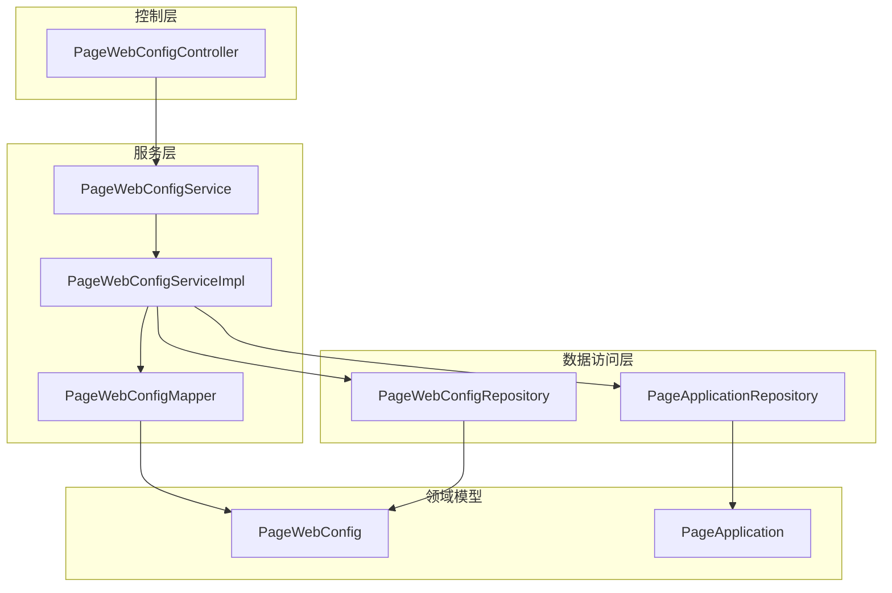
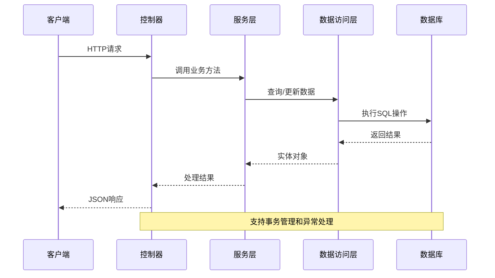
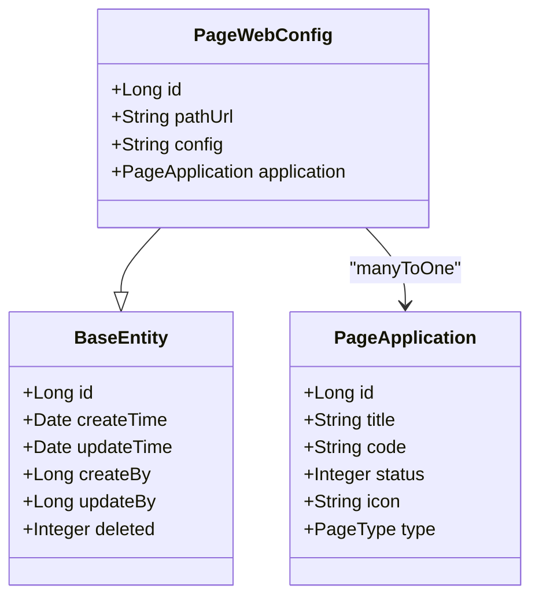
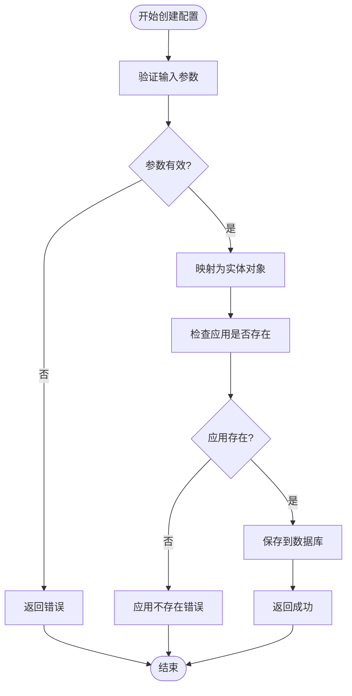
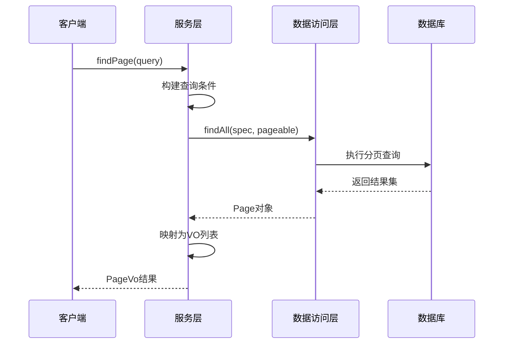
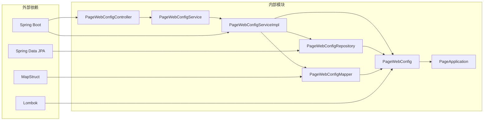

# 页面Web配置API

<cite>
**本文档引用的文件**
- [PageWebConfigController.java](file://run-admin/src/main/java/com/astproject/module/page/controller/PageWebConfigController.java)
- [PageWebConfigService.java](file://page-module/src/main/java/com/astproject/page/service/PageWebConfigService.java)
- [PageWebConfigServiceImpl.java](file://page-module/src/main/java/com/astproject/page/service/impl/PageWebConfigServiceImpl.java)
- [PageWebConfigMapper.java](file://page-module/src/main/java/com/astproject/page/mapper/PageWebConfigMapper.java)
- [PageWebConfigRepository.java](file://page-module/src/main/java/com/astproject/page/repository/db/PageWebConfigRepository.java)
- [PageWebConfig.java](file://page-module/src/main/java/com/astproject/page/domain/PageWebConfig.java)
- [PageWebConfigCreate.java](file://page-module/src/main/java/com/astproject/page/vo/pagewebconfig/PageWebConfigCreate.java)
- [PageWebConfigUpdate.java](file://page-module/src/main/java/com/astproject/page/vo/pagewebconfig/PageWebConfigUpdate.java)
- [PageWebConfigVo.java](file://page-module/src/main/java/com/astproject/page/vo/pagewebconfig/PageWebConfigVo.java)
- [PageWebConfigQuery.java](file://page-module/src/main/java/com/astproject/page/vo/pagewebconfig/PageWebConfigQuery.java)
- [PageApplication.java](file://page-module/src/main/java/com/astproject/page/domain/PageApplication.java)
</cite>

## 目录
1. [简介](#简介)
2. [项目结构](#项目结构)
3. [核心组件](#核心组件)
4. [架构概览](#架构概览)
5. [详细组件分析](#详细组件分析)
6. [依赖关系分析](#依赖关系分析)
7. [性能考虑](#性能考虑)
8. [故障排除指南](#故障排除指南)
9. [最佳实践](#最佳实践)
10. [结论](#结论)

## 简介

页面Web配置API是FastProject项目中用于管理系统Web页面配置的核心模块。该API提供了完整的CRUD操作，支持按应用和路径URL进行分页查询，专门用于管理Web端页面的配置信息。

本API主要服务于以下场景：
- 管理不同Web应用的页面配置
- 配置浏览器兼容性设置
- 优化页面性能参数
- 管理缓存策略
- 配置CDN相关信息
- 支持PWA（渐进式Web应用）设置
- SEO优化配置
- 加载性能优化

## 项目结构

页面Web配置API采用标准的三层架构设计，包含控制层、服务层和数据访问层：



**图表来源**
- [PageWebConfigController.java](file://run-admin/src/main/java/com/astproject/module/page/controller/PageWebConfigController.java#L20-L93)
- [PageWebConfigServiceImpl.java](file://page-module/src/main/java/com/astproject/page/service/impl/PageWebConfigServiceImpl.java#L28-L157)

**章节来源**
- [PageWebConfigController.java](file://run-admin/src/main/java/com/astproject/module/page/controller/PageWebConfigController.java#L1-L94)
- [PageWebConfigService.java](file://page-module/src/main/java/com/astproject/page/service/PageWebConfigService.java#L1-L28)

## 核心组件

### 控制器层

PageWebConfigController是API的入口点，提供RESTful接口：

- **POST /page/web/config** - 创建新的页面Web配置
- **PUT /page/web/config** - 更新现有配置
- **DELETE /page/web/config/{id}** - 删除指定配置
- **DELETE /page/web/config/batch** - 批量删除配置
- **POST /page/web/config/page** - 分页查询配置
- **GET /page/web/config/{id}** - 获取单个配置详情

### 服务层

PageWebConfigService定义了业务逻辑接口，包含：
- 配置的增删改查操作
- 分页查询功能
- 批量操作支持
- 数据验证和业务规则处理

### 数据模型

PageWebConfig实体类定义了配置的核心字段：
- `pathUrl`: 请求地址或页面路径
- `config`: JSON格式的配置字符串
- `application`: 关联的应用信息

**章节来源**
- [PageWebConfigController.java](file://run-admin/src/main/java/com/astproject/module/page/controller/PageWebConfigController.java#L20-L93)
- [PageWebConfigService.java](file://page-module/src/main/java/com/astproject/page/service/PageWebConfigService.java#L11-L28)

## 架构概览

页面Web配置API采用经典的MVC架构模式，结合Spring Boot的企业级特性：



**图表来源**
- [PageWebConfigController.java](file://run-admin/src/main/java/com/astproject/module/page/controller/PageWebConfigController.java#L33-L91)
- [PageWebConfigServiceImpl.java](file://page-module/src/main/java/com/astproject/page/service/impl/PageWebConfigServiceImpl.java#L38-L81)

## 详细组件分析

### 数据模型分析

#### PageWebConfig实体类

PageWebConfig是核心数据模型，继承自BaseEntity并包含以下关键属性：



**图表来源**
- [PageWebConfig.java](file://page-module/src/main/java/com/astproject/page/domain/PageWebConfig.java#L16-L34)
- [PageApplication.java](file://page-module/src/main/java/com/astproject/page/domain/PageApplication.java#L16-L45)

#### 配置对象结构

##### PageWebConfigCreate - 创建对象
| 字段名 | 类型 | 必填 | 描述 |
|--------|------|------|------|
| pathUrl | String | 是 | 页面路径或请求地址 |
| config | String | 是 | JSON格式的配置字符串 |
| applicationId | Long | 否 | 关联的应用ID |

##### PageWebConfigUpdate - 更新对象
| 字段名 | 类型 | 必填 | 描述 |
|--------|------|------|------|
| id | Long | 是 | 配置ID |
| pathUrl | String | 否 | 页面路径或请求地址 |
| config | String | 否 | JSON格式的配置字符串 |
| applicationId | Long | 否 | 关联的应用ID |

##### PageWebConfigVo - 响应对象
| 字段名 | 类型 | 必填 | 描述 |
|--------|------|------|------|
| id | Long | 是 | 配置ID |
| pathUrl | String | 是 | 页面路径或请求地址 |
| config | String | 是 | JSON格式的配置字符串 |
| applicationId | Long | 否 | 关联的应用ID |
| applicationName | String | 否 | 应用名称 |

##### PageWebConfigQuery - 查询对象
| 字段名 | 类型 | 必填 | 描述 |
|--------|------|------|------|
| pathUrl | String | 否 | 页面路径或请求地址（支持模糊查询） |
| applicationId | Long | 否 | 应用ID（精确匹配） |
| page | Integer | 否 | 页码，默认0 |
| pageSize | Integer | 否 | 每页大小，默认10 |

**章节来源**
- [PageWebConfigCreate.java](file://page-module/src/main/java/com/astproject/page/vo/pagewebconfig/PageWebConfigCreate.java#L6-L22)
- [PageWebConfigUpdate.java](file://page-module/src/main/java/com/astproject/page/vo/pagewebconfig/PageWebConfigUpdate.java#L6-L27)
- [PageWebConfigVo.java](file://page-module/src/main/java/com/astproject/page/vo/pagewebconfig/PageWebConfigVo.java#L6-L32)
- [PageWebConfigQuery.java](file://page-module/src/main/java/com/astproject/page/vo/pagewebconfig/PageWebConfigQuery.java#L9-L20)

### API接口规范

#### 创建配置
**请求方法**: POST  
**请求路径**: `/page/web/config`  
**权限要求**: `admin:page:web:config:add`  
**幂等性**: 支持，使用Redis去重

**请求示例**:
```json
{
  "pathUrl": "/admin/dashboard",
  "config": "{...}",
  "applicationId": 1
}
```

**响应示例**:
```json
{
  "code": 200,
  "msg": "操作成功",
  "data": 1
}
```

#### 更新配置
**请求方法**: PUT  
**请求路径**: `/page/web/config`  
**权限要求**: `admin:page:web:config:update`  
**幂等性**: 支持，使用Redis去重

**请求示例**:
```json
{
  "id": 1,
  "pathUrl": "/admin/dashboard",
  "config": "{...}",
  "applicationId": 1
}
```

**响应示例**:
```json
{
  "code": 200,
  "msg": "操作成功",
  "data": null
}
```

#### 删除配置
**请求方法**: DELETE  
**请求路径**: `/page/web/config/{id}`  
**权限要求**: `admin:page:web:config:delete`

**响应示例**:
```json
{
  "code": 200,
  "msg": "操作成功",
  "data": null
}
```

#### 批量删除
**请求方法**: DELETE  
**请求路径**: `/page/web/config/batch`  
**权限要求**: `admin:page:web:config:delete`

**请求示例**:
```json
[1, 2, 3, 4, 5]
```

**响应示例**:
```json
{
  "code": 200,
  "msg": "操作成功",
  "data": null
}
```

#### 分页查询
**请求方法**: POST  
**请求路径**: `/page/web/config/page`  
**权限要求**: `admin:page:web:config:page`

**请求示例**:
```json
{
  "pathUrl": "admin",
  "applicationId": 1,
  "page": 0,
  "pageSize": 10
}
```

**响应示例**:
```json
{
  "code": 200,
  "msg": "操作成功",
  "data": {
    "total": 100,
    "records": [
      {
        "id": 1,
        "pathUrl": "/admin/dashboard",
        "config": "{...}",
        "applicationId": 1,
        "applicationName": "管理后台"
      }
    ]
  }
}
```

#### 获取详情
**请求方法**: GET  
**请求路径**: `/page/web/config/{id}`  
**权限要求**: `admin:page:web:config:page`

**响应示例**:
```json
{
  "code": 200,
  "msg": "操作成功",
  "data": {
    "id": 1,
    "pathUrl": "/admin/dashboard",
    "config": "{...}",
    "applicationId": 1,
    "applicationName": "管理后台"
  }
}
```

**章节来源**
- [PageWebConfigController.java](file://run-admin/src/main/java/com/astproject/module/page/controller/PageWebConfigController.java#L33-L91)

### 业务流程分析

#### 配置创建流程



**图表来源**
- [PageWebConfigServiceImpl.java](file://page-module/src/main/java/com/astproject/page/service/impl/PageWebConfigServiceImpl.java#L38-L50)

#### 分页查询流程



**图表来源**
- [PageWebConfigServiceImpl.java](file://page-module/src/main/java/com/astproject/page/service/impl/PageWebConfigServiceImpl.java#L98-L126)

**章节来源**
- [PageWebConfigServiceImpl.java](file://page-module/src/main/java/com/astproject/page/service/impl/PageWebConfigServiceImpl.java#L38-L157)

## 依赖关系分析

页面Web配置API的依赖关系清晰明确，遵循单一职责原则：



**图表来源**
- [PageWebConfigController.java](file://run-admin/src/main/java/com/astproject/module/page/controller/PageWebConfigController.java#L1-L18)
- [PageWebConfigServiceImpl.java](file://page-module/src/main/java/com/astproject/page/service/impl/PageWebConfigServiceImpl.java#L1-L36)

**章节来源**
- [PageWebConfigMapper.java](file://page-module/src/main/java/com/astproject/page/mapper/PageWebConfigMapper.java#L13-L27)
- [PageWebConfigRepository.java](file://page-module/src/main/java/com/astproject/page/repository/db/PageWebConfigRepository.java#L8-L11)

## 性能考虑

### 数据库性能优化

1. **索引策略**
   - 在`pathUrl`字段上建立索引以支持快速查询
   - 在`application_id`字段上建立外键索引
   - 考虑在`deleted`字段上建立索引以支持软删除查询

2. **查询优化**
   - 使用`FetchType.LAZY`避免不必要的关联查询
   - 实现分页查询避免大量数据传输
   - 使用`Specification`动态构建查询条件

3. **缓存策略**
   - 对于频繁访问的配置可以考虑Redis缓存
   - 实现配置变更时的缓存失效机制

### API性能优化

1. **批量操作**
   - 提供批量删除接口减少网络往返
   - 支持批量查询优化数据传输

2. **响应优化**
   - 使用分页避免一次性返回大量数据
   - 实现条件查询支持精确的数据筛选

3. **并发控制**
   - 使用Redis实现幂等性控制
   - 防止重复提交造成的数据不一致

## 故障排除指南

### 常见问题及解决方案

#### 1. 应用不存在错误
**错误信息**: "应用不存在"
**原因**: 提供的`applicationId`无效
**解决方案**: 
- 验证应用ID的有效性
- 确保应用状态正常
- 检查应用是否被软删除

#### 2. 配置不存在错误
**错误信息**: "配置不存在"
**原因**: 尝试更新或删除不存在的配置
**解决方案**:
- 在操作前先查询配置是否存在
- 使用事务确保数据一致性

#### 3. 权限不足
**错误信息**: 403 Forbidden
**原因**: 用户权限不足
**解决方案**:
- 检查用户角色和权限配置
- 确认具有相应的操作权限

#### 4. 参数验证失败
**错误信息**: 参数校验失败
**原因**: 请求参数不符合要求
**解决方案**:
- 检查必填字段是否完整
- 验证数据类型和格式
- 确认参数范围合理

**章节来源**
- [PageWebConfigServiceImpl.java](file://page-module/src/main/java/com/astproject/page/service/impl/PageWebConfigServiceImpl.java#L44-L46)
- [PageWebConfigServiceImpl.java](file://page-module/src/main/java/com/astproject/page/service/impl/PageWebConfigServiceImpl.java#L56-L57)

## 最佳实践

### 配置管理最佳实践

1. **配置结构设计**
   - 使用JSON格式存储复杂配置
   - 定义清晰的配置层次结构
   - 提供配置版本管理

2. **性能优化建议**
   - 合理设置分页大小，避免过大或过小
   - 使用条件查询减少数据传输
   - 实现缓存机制提升查询性能

3. **安全考虑**
   - 实施严格的权限控制
   - 使用HTTPS传输敏感配置
   - 定期审计配置变更日志

4. **监控和日志**
   - 记录所有配置变更操作
   - 监控API调用频率和成功率
   - 设置异常告警机制

### Web配置特定建议

1. **浏览器兼容性**
   - 配置适当的浏览器支持范围
   - 设置渐进增强策略
   - 考虑降级方案

2. **PWA配置**
   - 配置Service Worker
   - 设置离线缓存策略
   - 配置应用清单文件

3. **SEO优化**
   - 配置页面元数据
   - 设置搜索引擎友好参数
   - 配置结构化数据

4. **性能优化**
   - 配置资源压缩和合并
   - 设置CDN加速参数
   - 配置缓存头信息

## 结论

页面Web配置API提供了完整的企业级Web配置管理能力，具有以下特点：

1. **完整的CRUD功能** - 支持所有基本的配置管理操作
2. **灵活的查询能力** - 支持多条件组合查询和分页
3. **企业级特性** - 包含权限控制、日志记录、幂等性等
4. **良好的扩展性** - 清晰的架构设计便于功能扩展
5. **性能优化** - 考虑了数据库查询和API调用的性能

该API为FastProject项目提供了强大的Web配置管理基础，能够满足各种复杂的Web应用配置需求。通过合理的配置管理和最佳实践，可以显著提升Web应用的性能和用户体验。