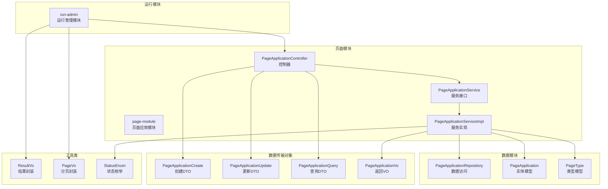
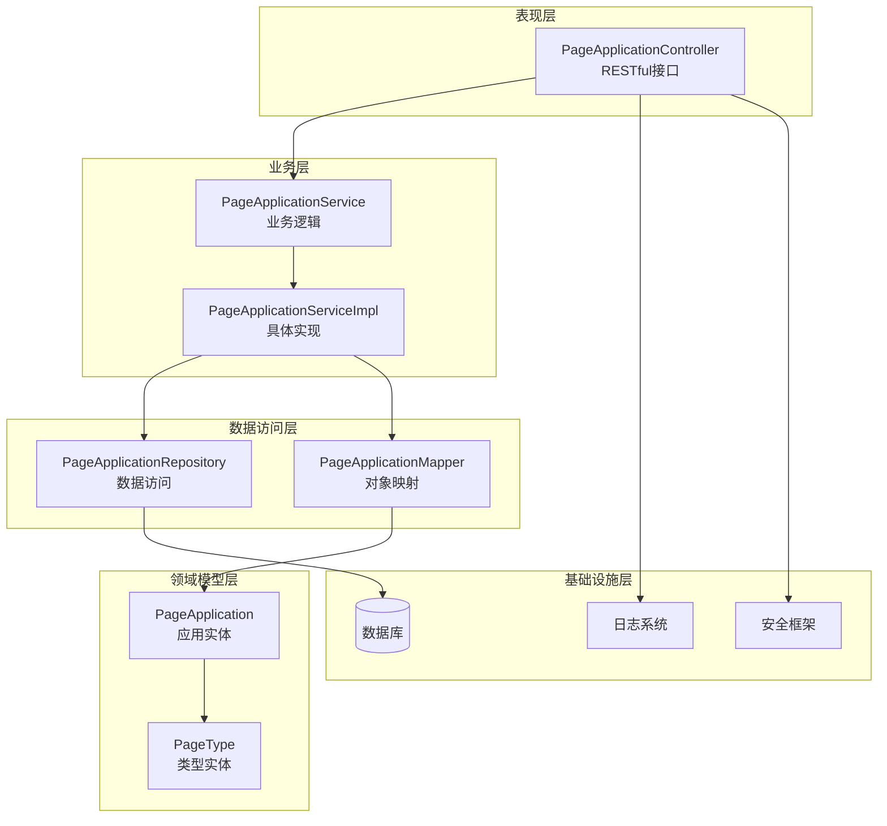
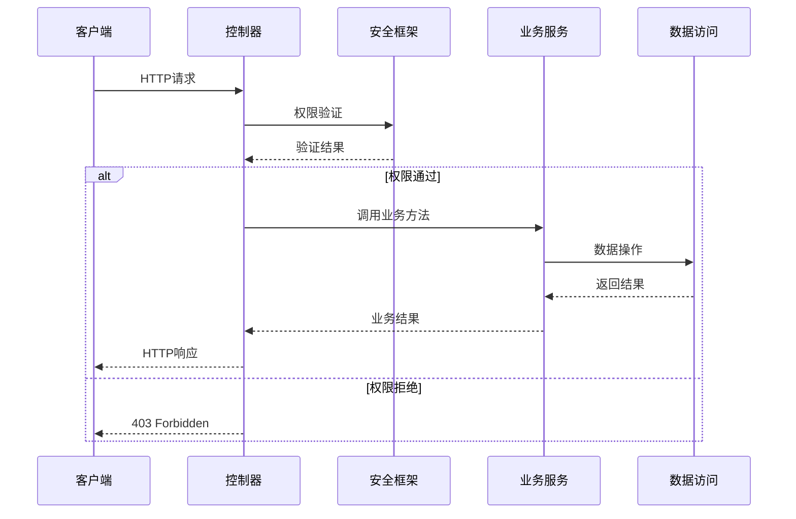
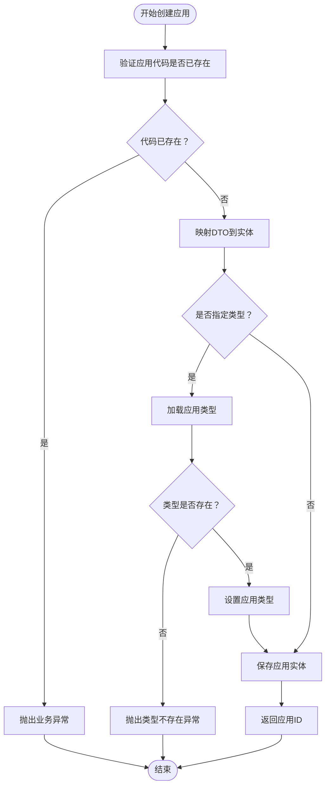
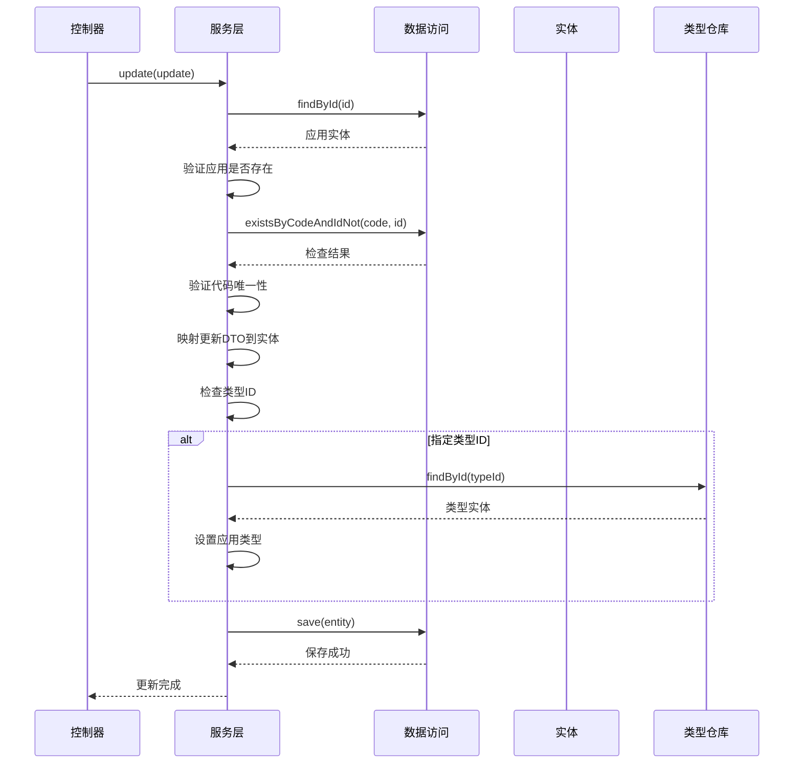
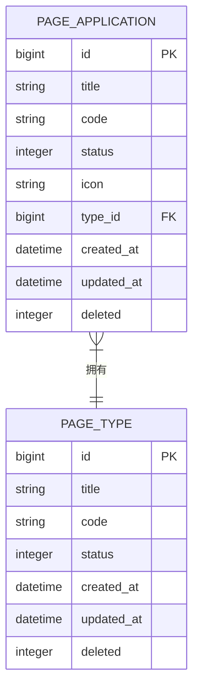
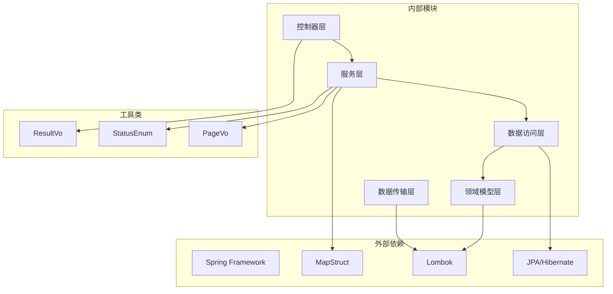
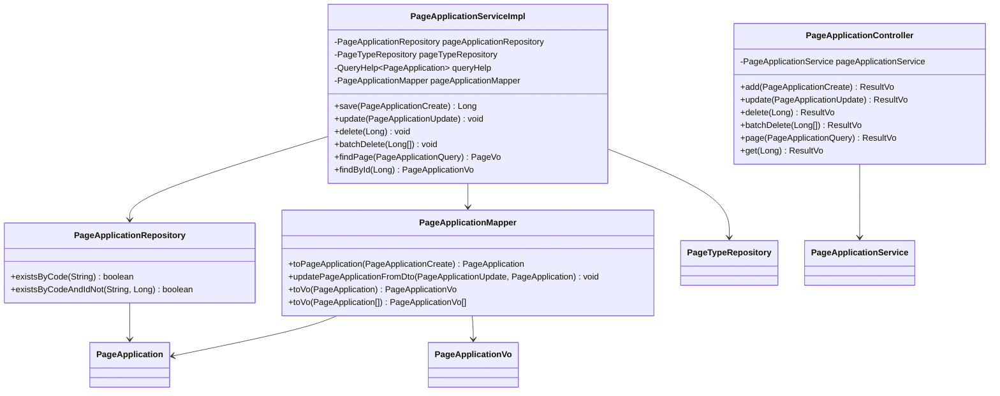
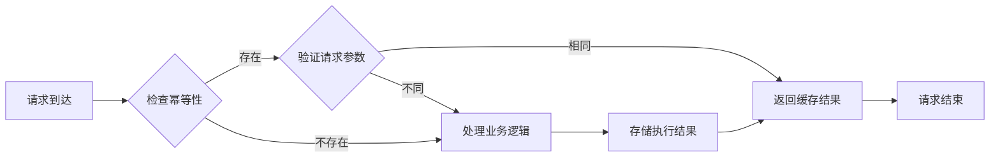
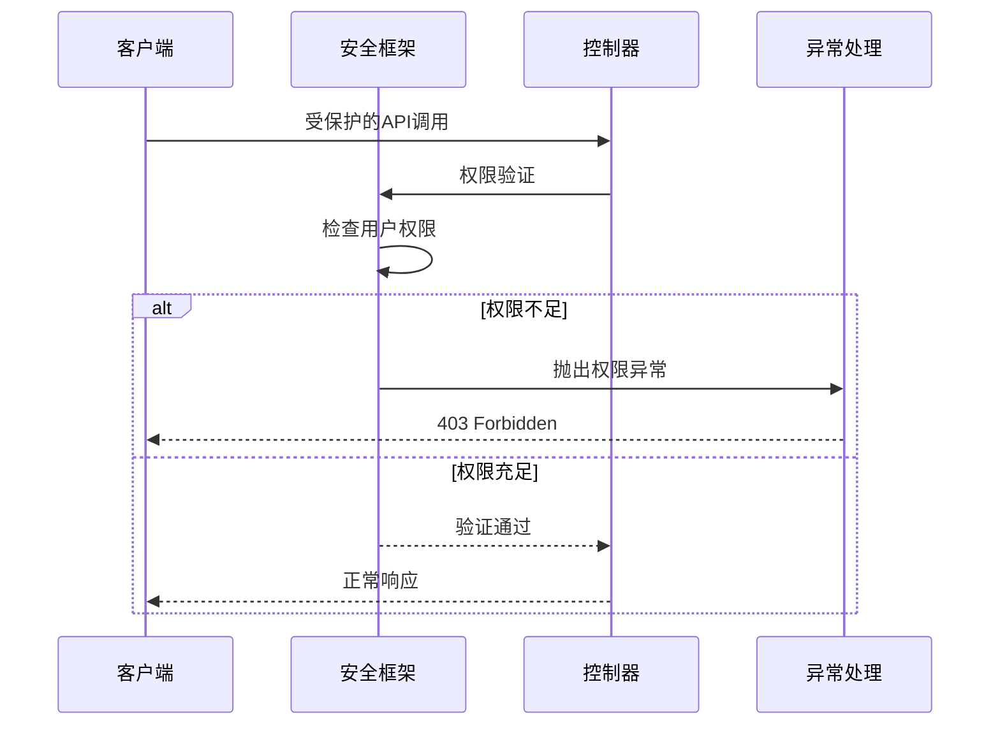

# 页面应用API

<cite>
**本文档引用的文件**
- [PageApplicationController.java](file://run-admin/src/main/java/com/astproject/module/page/controller/PageApplicationController.java)
- [PageApplicationService.java](file://page-module/src/main/java/com/astproject/page/service/PageApplicationService.java)
- [PageApplicationServiceImpl.java](file://page-module/src/main/java/com/astproject/page/service/impl/PageApplicationServiceImpl.java)
- [PageApplicationCreate.java](file://page-module/src/main/java/com/astproject/page/vo/pageapplication/PageApplicationCreate.java)
- [PageApplicationUpdate.java](file://page-module/src/main/java/com/astproject/page/vo/pageapplication/PageApplicationUpdate.java)
- [PageApplicationQuery.java](file://page-module/src/main/java/com/astproject/page/vo/pageapplication/PageApplicationQuery.java)
- [PageApplicationVo.java](file://page-module/src/main/java/com/astproject/page/vo/pageapplication/PageApplicationVo.java)
- [PageApplicationMapper.java](file://page-module/src/main/java/com/astproject/page/mapper/PageApplicationMapper.java)
- [PageApplicationRepository.java](file://page-module/src/main/java/com/astproject/page/repository/db/PageApplicationRepository.java)
- [PageApplication.java](file://page-module/src/main/java/com/astproject/page/domain/PageApplication.java)
- [PageType.java](file://page-module/src/main/java/com/astproject/page/domain/PageType.java)
- [ResultVo.java](file://utils/src/main/java/com/astproject/utils/vo/ResultVo.java)
- [PageVo.java](file://utils/src/main/java/com/astproject/utils/vo/PageVo.java)
- [StatusEnum.java](file://utils/src/main/java/com/astproject/utils/StatusEnum.java)
</cite>

## 目录
1. [简介](#简介)
2. [项目结构](#项目结构)
3. [核心组件](#核心组件)
4. [架构概览](#架构概览)
5. [详细组件分析](#详细组件分析)
6. [依赖关系分析](#依赖关系分析)
7. [性能考虑](#性能考虑)
8. [故障排除指南](#故障排除指南)
9. [结论](#结论)

## 简介

页面应用API是FastProject系统中的核心功能模块，负责管理页面应用的全生命周期。该API提供了完整的RESTful接口，支持页面应用的增删改查操作、状态管理、配置功能以及权限控制。

本API基于Spring Boot构建，采用分层架构设计，包括控制器层、服务层、数据访问层和领域模型层。系统集成了幂等性控制、日志记录、权限验证等企业级特性。

## 项目结构

页面应用API的项目结构遵循标准的Maven多模块架构：



**图表来源**
- [PageApplicationController.java](file://run-admin/src/main/java/com/astproject/module/page/controller/PageApplicationController.java#L1-L94)
- [PageApplicationServiceImpl.java](file://page-module/src/main/java/com/astproject/page/service/impl/PageApplicationServiceImpl.java#L1-L178)

**章节来源**
- [PageApplicationController.java](file://run-admin/src/main/java/com/astproject/module/page/controller/PageApplicationController.java#L1-L94)
- [PageApplicationService.java](file://page-module/src/main/java/com/astproject/page/service/PageApplicationService.java#L1-L28)

## 核心组件

页面应用API的核心组件包括：

### 控制器层
- **PageApplicationController**: 主要的RESTful控制器，提供HTTP接口
- 基于注解驱动的路由映射
- 集成权限验证和日志记录

### 服务层
- **PageApplicationService**: 业务服务接口
- **PageApplicationServiceImpl**: 业务逻辑实现
- 支持事务管理和异常处理

### 数据访问层
- **PageApplicationRepository**: JPA数据访问接口
- 支持复杂查询和分页操作
- 集成Specification模式

### 数据传输对象
- **PageApplicationCreate**: 应用创建数据传输对象
- **PageApplicationUpdate**: 应用更新数据传输对象
- **PageApplicationQuery**: 应用查询数据传输对象
- **PageApplicationVo**: 应用返回值对象

**章节来源**
- [PageApplicationService.java](file://page-module/src/main/java/com/astproject/page/service/PageApplicationService.java#L1-L28)
- [PageApplicationServiceImpl.java](file://page-module/src/main/java/com/astproject/page/service/impl/PageApplicationServiceImpl.java#L1-L178)

## 架构概览

页面应用API采用经典的三层架构模式，结合了领域驱动设计和企业级应用最佳实践：



**图表来源**
- [PageApplicationController.java](file://run-admin/src/main/java/com/astproject/module/page/controller/PageApplicationController.java#L23-L28)
- [PageApplicationServiceImpl.java](file://page-module/src/main/java/com/astproject/page/service/impl/PageApplicationServiceImpl.java#L34-L37)

### 权限控制架构

系统实现了细粒度的权限控制机制：



**图表来源**
- [PageApplicationController.java](file://run-admin/src/main/java/com/astproject/module/page/controller/PageApplicationController.java#L34-L35)
- [PageApplicationController.java](file://run-admin/src/main/java/com/astproject/module/page/controller/PageApplicationController.java#L44-L46)

## 详细组件分析

### RESTful API接口规范

#### 添加页面应用
- **URL**: `/page/application`
- **方法**: `POST`
- **权限**: `admin:page:application:add`
- **幂等性**: 启用（前缀: `add:page:application:`）
- **描述**: 创建新的页面应用

**请求示例**:
```json
{
  "title": "用户管理系统",
  "code": "user_mgmt",
  "status": 1,
  "icon": "user-icon.png",
  "typeId": 1
}
```

**响应示例**:
```json
{
  "code": 200,
  "msg": "success",
  "data": 1
}
```

#### 修改页面应用
- **URL**: `/page/application`
- **方法**: `PUT`
- **权限**: `admin:page:application:update`
- **幂等性**: 启用（前缀: `update:page:application:`）
- **描述**: 更新现有页面应用信息

**请求示例**:
```json
{
  "id": 1,
  "title": "用户管理系统V2",
  "code": "user_mgmt_v2",
  "status": 1,
  "icon": "user-icon-v2.png",
  "typeId": 1
}
```

**响应示例**:
```json
{
  "code": 200,
  "msg": "success",
  "data": null
}
```

#### 删除页面应用
- **URL**: `/page/application/{id}`
- **方法**: `DELETE`
- **权限**: `admin:page:application:delete`
- **描述**: 删除指定ID的页面应用

**响应示例**:
```json
{
  "code": 200,
  "msg": "success",
  "data": null
}
```

#### 批量删除页面应用
- **URL**: `/page/application/batch`
- **方法**: `DELETE`
- **权限**: `admin:page:application:delete`
- **描述**: 批量删除页面应用

**请求示例**:
```json
[1, 2, 3, 4, 5]
```

**响应示例**:
```json
{
  "code": 200,
  "msg": "success",
  "data": null
}
```

#### 分页查询页面应用
- **URL**: `/page/application/page`
- **方法**: `POST`
- **权限**: `admin:page:application:page`
- **描述**: 分页查询页面应用列表

**请求示例**:
```json
{
  "page": 0,
  "pageSize": 10,
  "title": "用户",
  "code": "user",
  "status": 1,
  "typeId": 1
}
```

**响应示例**:
```json
{
  "code": 200,
  "msg": "success",
  "data": {
    "total": 50,
    "data": [
      {
        "id": 1,
        "title": "用户管理系统",
        "code": "user_mgmt",
        "status": 1,
        "icon": "user-icon.png",
        "typeId": 1,
        "typeName": "管理系统"
      }
    ]
  }
}
```

#### 获取页面应用详情
- **URL**: `/page/application/{id}`
- **方法**: `GET`
- **权限**: `admin:page:application:page`
- **描述**: 获取指定ID的页面应用详情

**响应示例**:
```json
{
  "code": 200,
  "msg": "success",
  "data": {
    "id": 1,
    "title": "用户管理系统",
    "code": "user_mgmt",
    "status": 1,
    "icon": "user-icon.png",
    "typeId": 1,
    "typeName": "管理系统"
  }
}
```

**章节来源**
- [PageApplicationController.java](file://run-admin/src/main/java/com/astproject/module/page/controller/PageApplicationController.java#L33-L91)

### 数据传输对象详细说明

#### PageApplicationCreate - 创建数据传输对象

| 字段名 | 类型 | 必填 | 描述 | 示例 |
|--------|------|------|------|------|
| title | String | 是 | 应用标题 | "用户管理系统" |
| code | String | 是 | 应用代码 | "user_mgmt" |
| status | Integer | 否 | 应用状态 | 1 (正常) |
| icon | String | 否 | 应用图标 | "user-icon.png" |
| typeId | Long | 否 | 类型ID | 1 |

#### PageApplicationUpdate - 更新数据传输对象

| 字段名 | 类型 | 必填 | 描述 | 示例 |
|--------|------|------|------|------|
| id | Long | 是 | 应用ID | 1 |
| title | String | 否 | 应用标题 | "用户管理系统V2" |
| code | String | 否 | 应用代码 | "user_mgmt_v2" |
| status | Integer | 否 | 应用状态 | 1 |
| icon | String | 否 | 应用图标 | "user-icon-v2.png" |
| typeId | Long | 否 | 类型ID | 1 |

#### PageApplicationQuery - 查询数据传输对象

| 字段名 | 类型 | 必填 | 描述 | 示例 |
|--------|------|------|------|------|
| page | Integer | 否 | 页码 | 0 |
| pageSize | Integer | 否 | 每页大小 | 10 |
| title | String | 否 | 应用标题 | "用户" |
| code | String | 否 | 应用代码 | "user" |
| status | Integer | 否 | 应用状态 | 1 |
| typeId | Long | 否 | 类型ID | 1 |

#### PageApplicationVo - 返回值对象

| 字段名 | 类型 | 描述 | 示例 |
|--------|------|------|------|
| id | Long | 应用ID | 1 |
| title | String | 应用标题 | "用户管理系统" |
| code | String | 应用代码 | "user_mgmt" |
| status | Integer | 应用状态 | 1 |
| icon | String | 应用图标 | "user-icon.png" |
| typeId | Long | 类型ID | 1 |
| typeName | String | 类型名称 | "管理系统" |

**章节来源**
- [PageApplicationCreate.java](file://page-module/src/main/java/com/astproject/page/vo/pageapplication/PageApplicationCreate.java#L1-L33)
- [PageApplicationUpdate.java](file://page-module/src/main/java/com/astproject/page/vo/pageapplication/PageApplicationUpdate.java#L1-L38)
- [PageApplicationQuery.java](file://page-module/src/main/java/com/astproject/page/vo/pageapplication/PageApplicationQuery.java#L1-L31)
- [PageApplicationVo.java](file://page-module/src/main/java/com/astproject/page/vo/pageapplication/PageApplicationVo.java#L1-L43)

### 业务流程分析

#### 应用创建流程



**图表来源**
- [PageApplicationServiceImpl.java](file://page-module/src/main/java/com/astproject/page/service/impl/PageApplicationServiceImpl.java#L40-L55)

#### 应用更新流程



**图表来源**
- [PageApplicationServiceImpl.java](file://page-module/src/main/java/com/astproject/page/service/impl/PageApplicationServiceImpl.java#L58-L75)

**章节来源**
- [PageApplicationServiceImpl.java](file://page-module/src/main/java/com/astproject/page/service/impl/PageApplicationServiceImpl.java#L39-L90)

### 关联关系处理

页面应用与页面类型之间存在多对一的关联关系：



**图表来源**
- [PageApplication.java](file://page-module/src/main/java/com/astproject/page/domain/PageApplication.java#L10-L43)
- [PageType.java](file://page-module/src/main/java/com/astproject/page/domain/PageType.java#L12-L34)

## 依赖关系分析

页面应用API的依赖关系体现了清晰的分层架构：



**图表来源**
- [PageApplicationController.java](file://run-admin/src/main/java/com/astproject/module/page/controller/PageApplicationController.java#L1-L18)
- [PageApplicationServiceImpl.java](file://page-module/src/main/java/com/astproject/page/service/impl/PageApplicationServiceImpl.java#L1-L37)

### 核心依赖注入关系



**图表来源**
- [PageApplicationController.java](file://run-admin/src/main/java/com/astproject/module/page/controller/PageApplicationController.java#L23-L28)
- [PageApplicationServiceImpl.java](file://page-module/src/main/java/com/astproject/page/service/impl/PageApplicationServiceImpl.java#L34-L37)
- [PageApplicationMapper.java](file://page-module/src/main/java/com/astproject/page/mapper/PageApplicationMapper.java#L13-L26)

**章节来源**
- [PageApplicationController.java](file://run-admin/src/main/java/com/astproject/module/page/controller/PageApplicationController.java#L1-L94)
- [PageApplicationServiceImpl.java](file://page-module/src/main/java/com/astproject/page/service/impl/PageApplicationServiceImpl.java#L1-L178)

## 性能考虑

### 查询优化策略

1. **分页查询优化**
   - 使用JPA分页接口避免全表扫描
   - 默认按ID降序排列提高查询效率
   - 支持条件过滤减少数据传输

2. **关联查询优化**
   - 使用懒加载机制避免N+1查询问题
   - 类型信息在需要时才加载
   - 提供专门的查询方法优化常用场景

3. **缓存策略**
   - 对频繁访问的配置信息进行缓存
   - 利用数据库连接池提高并发性能
   - 合理设置事务隔离级别

### 幂等性设计

系统实现了完整的幂等性控制机制：



**图表来源**
- [PageApplicationController.java](file://run-admin/src/main/java/com/astproject/module/page/controller/PageApplicationController.java#L36-L38)

## 故障排除指南

### 常见错误及解决方案

#### 业务异常处理

| 异常类型 | 触发条件 | 错误码 | 解决方案 |
|----------|----------|--------|----------|
| 应用代码已存在 | 创建/更新时代码重复 | 500 | 修改应用代码为唯一值 |
| 应用不存在 | 更新/删除指定ID不存在 | 500 | 确认应用ID正确性 |
| 类型不存在 | 指定类型ID不存在 | 500 | 检查类型配置或删除类型ID |

#### 权限异常处理



**图表来源**
- [PageApplicationController.java](file://run-admin/src/main/java/com/astproject/module/page/controller/PageApplicationController.java#L44-L46)

#### 日志监控

系统集成了完整的日志记录机制：

- **操作日志**: 记录所有业务操作的详细信息
- **异常日志**: 记录系统异常和错误信息
- **性能日志**: 记录关键操作的执行时间和资源消耗

**章节来源**
- [PageApplicationServiceImpl.java](file://page-module/src/main/java/com/astproject/page/service/impl/PageApplicationServiceImpl.java#L40-L55)
- [PageApplicationController.java](file://run-admin/src/main/java/com/astproject/module/page/controller/PageApplicationController.java#L45-L47)

## 结论

页面应用API是一个设计完善的RESTful服务，具有以下特点：

### 技术优势
- **清晰的分层架构**: 遵循DDD原则，职责分离明确
- **完善的权限控制**: 基于角色的细粒度权限管理
- **企业级特性**: 集成幂等性、日志、事务等特性
- **良好的扩展性**: 模块化设计便于功能扩展

### 业务价值
- **完整的生命周期管理**: 支持应用的全生命周期操作
- **灵活的查询能力**: 支持多条件组合查询和分页
- **强类型约束**: DTO和VO确保数据传输的准确性
- **完善的错误处理**: 提供详细的错误信息和处理建议

### 最佳实践建议
1. 在生产环境中启用HTTPS和输入验证
2. 定期清理无用的应用配置和日志
3. 监控API的性能指标和错误率
4. 建立完善的备份和恢复机制

该API为FastProject系统的页面应用管理提供了坚实的技术基础，能够满足企业级应用的需求。