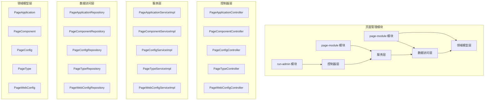
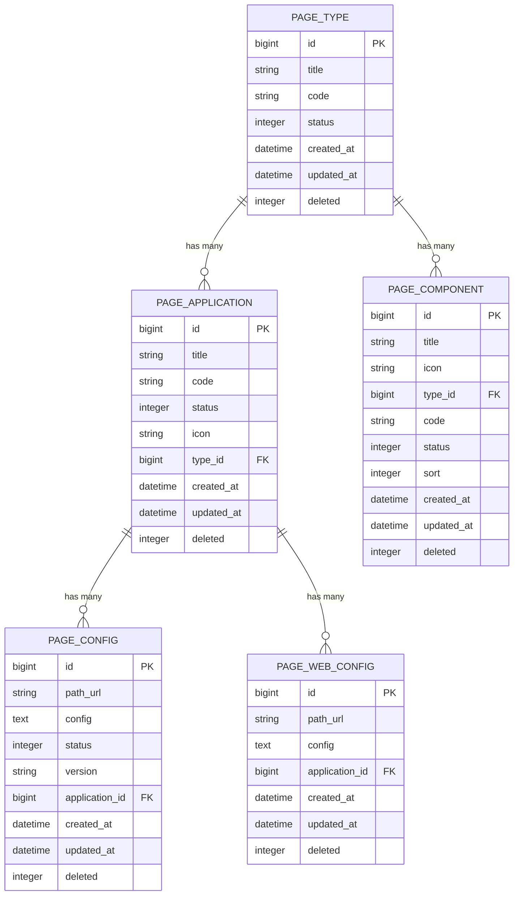
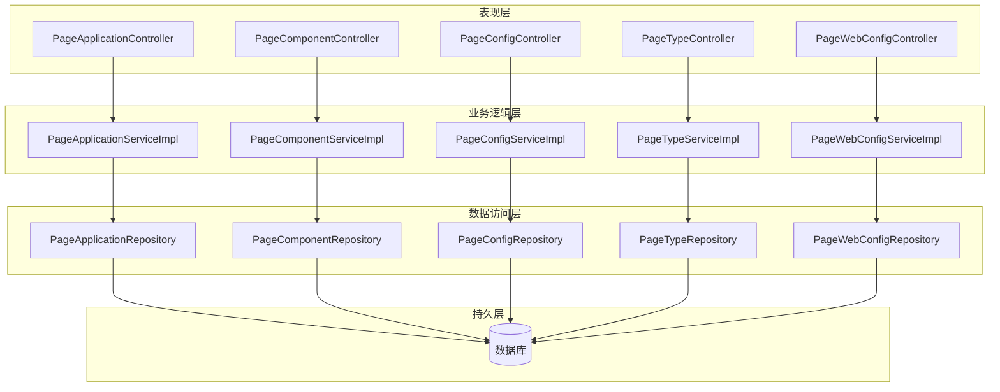
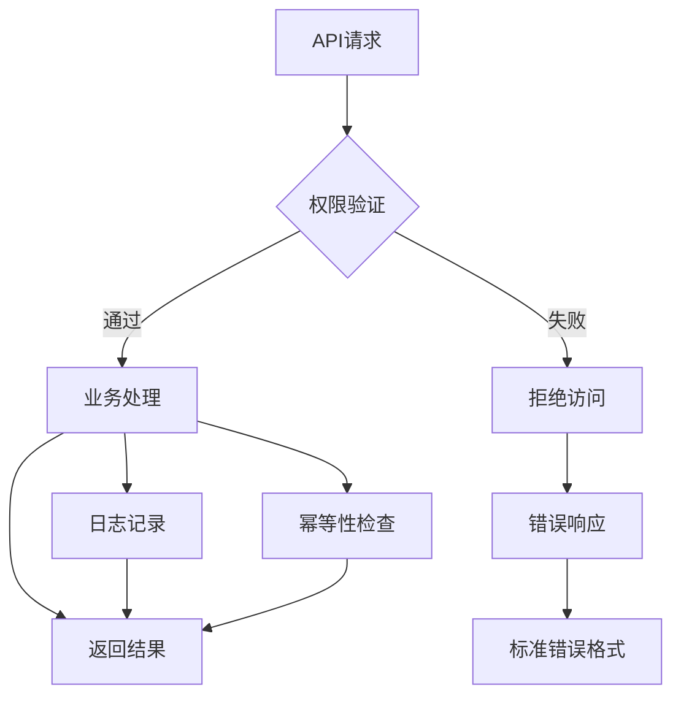
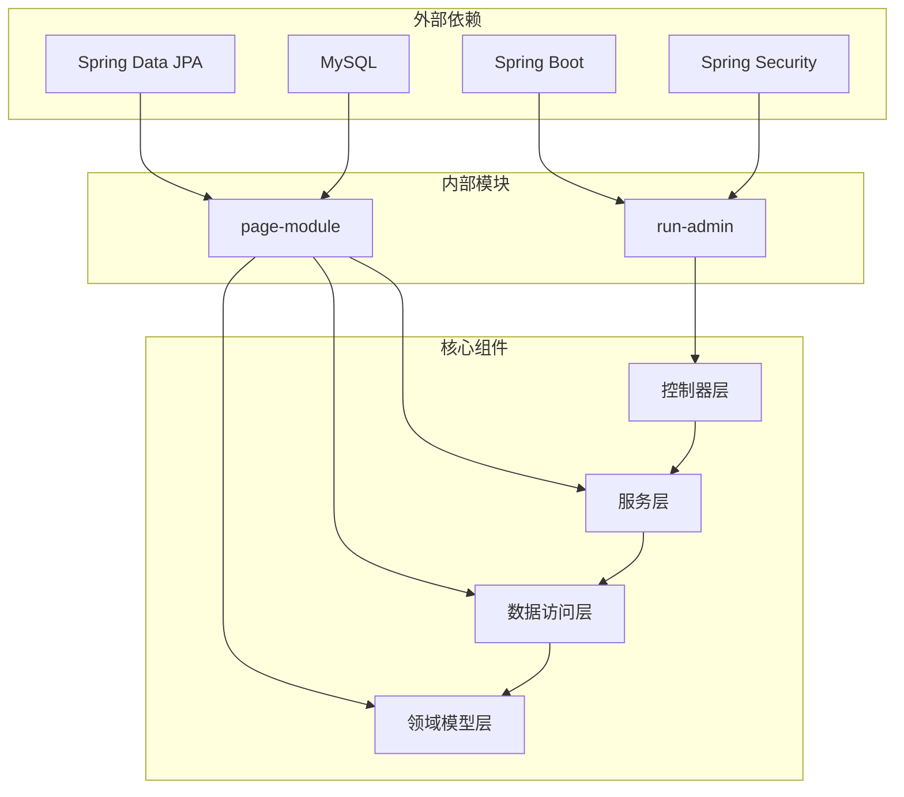

# 页面管理API

<cite>
**本文档引用的文件**
- [PageApplicationController.java](file://run-admin/src/main/java/com/fastproject/module/page/controller/PageApplicationController.java)
- [PageComponentController.java](file://run-admin/src/main/java/com/fastproject/module/page/controller/PageComponentController.java)
- [PageConfigController.java](file://run-admin/src/main/java/com/fastproject/module/page/controller/PageConfigController.java)
- [PageTypeController.java](file://run-admin/src/main/java/com/fastproject/module/page/controller/PageTypeController.java)
- [PageWebConfigController.java](file://run-admin/src/main/java/com/fastproject/module/page/controller/PageWebConfigController.java)
- [PageApplication.java](file://page-module/src/main/java/com/fastproject/page/domain/PageApplication.java)
- [PageComponent.java](file://page-module/src/main/java/com/fastproject/page/domain/PageComponent.java)
- [PageConfig.java](file://page-module/src/main/java/com/fastproject/page/domain/PageConfig.java)
- [PageType.java](file://page-module/src/main/java/com/fastproject/page/domain/PageType.java)
- [PageWebConfig.java](file://page-module/src/main/java/com/fastproject/page/domain/PageWebConfig.java)
- [PageApplicationServiceImpl.java](file://page-module/src/main/java/com/fastproject/page/service/impl/PageApplicationServiceImpl.java)
- [PageComponentServiceImpl.java](file://page-module/src/main/java/com/fastproject/page/service/impl/PageComponentServiceImpl.java)
- [PageConfigServiceImpl.java](file://page-module/src/main/java/com/fastproject/page/service/impl/PageConfigServiceImpl.java)
- [PageTypeServiceImpl.java](file://page-module/src/main/java/com/fastproject/page/service/impl/PageTypeServiceImpl.java)
- [PageWebConfigServiceImpl.java](file://page-module/src/main/java/com/fastproject/page/service/impl/PageWebConfigServiceImpl.java)
</cite>

## 目录
1. [简介](#简介)
2. [项目结构](#项目结构)
3. [核心组件](#核心组件)
4. [架构概览](#架构概览)
5. [详细组件分析](#详细组件分析)
6. [依赖关系分析](#依赖关系分析)
7. [性能考虑](#性能考虑)
8. [故障排除指南](#故障排除指南)
9. [结论](#结论)

## 简介

页面管理模块是Fast项目的核心功能模块之一，负责管理系统中所有与页面相关的配置和管理功能。该模块提供了完整的页面生命周期管理能力，包括页面应用管理、页面组件管理、页面配置管理、页面类型管理和页面Web配置管理等核心功能。

该模块采用Spring Boot + Spring MVC + JPA的技术栈实现，遵循RESTful API设计原则，提供了标准化的HTTP接口来管理页面相关的各种实体。系统通过分层架构设计，将业务逻辑、数据访问和表现层清晰分离，确保了代码的可维护性和扩展性。

## 项目结构

页面管理模块在项目中的组织结构如下：



**图表来源**
- [PageApplicationController.java](file://run-admin/src/main/java/com/fastproject/module/page/controller/PageApplicationController.java#L1-L94)
- [PageComponentController.java](file://run-admin/src/main/java/com/fastproject/module/page/controller/PageComponentController.java#L1-L94)
- [PageConfigController.java](file://run-admin/src/main/java/com/fastproject/module/page/controller/PageConfigController.java#L1-L94)
- [PageTypeController.java](file://run-admin/src/main/java/com/fastproject/module/page/controller/PageTypeController.java#L1-L94)
- [PageWebConfigController.java](file://run-admin/src/main/java/com/fastproject/module/page/controller/PageWebConfigController.java#L1-L94)

**章节来源**
- [PageApplicationController.java](file://run-admin/src/main/java/com/fastproject/module/page/controller/PageApplicationController.java#L1-L94)
- [PageComponentController.java](file://run-admin/src/main/java/com/fastproject/module/page/controller/PageComponentController.java#L1-L94)
- [PageConfigController.java](file://run-admin/src/main/java/com/fastproject/module/page/controller/PageConfigController.java#L1-L94)
- [PageTypeController.java](file://run-admin/src/main/java/com/fastproject/module/page/controller/PageTypeController.java#L1-L94)
- [PageWebConfigController.java](file://run-admin/src/main/java/com/fastproject/module/page/controller/PageWebConfigController.java#L1-L94)

## 核心组件

页面管理模块由五个核心控制器组成，每个控制器负责特定的页面管理功能：

### 控制器层次结构

```mermaid
classDiagram
class PageApplicationController {
+POST /page/application
+PUT /page/application
+DELETE /page/application/{id}
+DELETE /page/application/batch
+POST /page/application/page
+GET /page/application/{id}
}
class PageComponentController {
+POST /page/component
+PUT /page/component
+DELETE /page/component/{id}
+DELETE /page/component/batch
+POST /page/component/page
+GET /page/component/{id}
}
class PageConfigController {
+POST /page/config
+PUT /page/config
+DELETE /page/config/{id}
+DELETE /page/config/batch
+POST /page/config/page
+GET /page/config/{id}
}
class PageTypeController {
+POST /page/type
+PUT /page/type
+DELETE /page/type/{id}
+DELETE /page/type/batch
+POST /page/type/page
+GET /page/type/{id}
}
class PageWebConfigController {
+POST /page/web/config
+PUT /page/web/config
+DELETE /page/web/config/{id}
+DELETE /page/web/config/batch
+POST /page/web/config/page
+GET /page/web/config/{id}
}
class BaseController {
<<abstract>>
+add() ResultVo
+update() ResultVo
+delete() ResultVo
+batchDelete() ResultVo
+page() ResultVo
+get() ResultVo
}
PageApplicationController --|> BaseController
PageComponentController --|> BaseController
PageConfigController --|> BaseController
PageTypeController --|> BaseController
PageWebConfigController --|> BaseController
```

**图表来源**
- [PageApplicationController.java](file://run-admin/src/main/java/com/fastproject/module/page/controller/PageApplicationController.java#L20-L94)
- [PageComponentController.java](file://run-admin/src/main/java/com/fastproject/module/page/controller/PageComponentController.java#L20-L94)
- [PageConfigController.java](file://run-admin/src/main/java/com/fastproject/module/page/controller/PageConfigController.java#L20-L94)
- [PageTypeController.java](file://run-admin/src/main/java/com/fastproject/module/page/controller/PageTypeController.java#L20-L94)
- [PageWebConfigController.java](file://run-admin/src/main/java/com/fastproject/module/page/controller/PageWebConfigController.java#L20-L94)

### 数据模型关系



**图表来源**
- [PageApplication.java](file://page-module/src/main/java/com/fastproject/page/domain/PageApplication.java#L10-L46)
- [PageComponent.java](file://page-module/src/main/java/com/fastproject/page/domain/PageComponent.java#L10-L50)
- [PageConfig.java](file://page-module/src/main/java/com/fastproject/page/domain/PageConfig.java#L10-L47)
- [PageType.java](file://page-module/src/main/java/com/fastproject/page/domain/PageType.java#L12-L35)
- [PageWebConfig.java](file://page-module/src/main/java/com/fastproject/page/domain/PageWebConfig.java#L10-L35)

**章节来源**
- [PageApplication.java](file://page-module/src/main/java/com/fastproject/page/domain/PageApplication.java#L1-L46)
- [PageComponent.java](file://page-module/src/main/java/com/fastproject/page/domain/PageComponent.java#L1-L50)
- [PageConfig.java](file://page-module/src/main/java/com/fastproject/page/domain/PageConfig.java#L1-L47)
- [PageType.java](file://page-module/src/main/java/com/fastproject/page/domain/PageType.java#L1-L35)
- [PageWebConfig.java](file://page-module/src/main/java/com/fastproject/page/domain/PageWebConfig.java#L1-L35)

## 架构概览

页面管理模块采用经典的三层架构设计，结合MVC模式，实现了清晰的职责分离：



**图表来源**
- [PageApplicationController.java](file://run-admin/src/main/java/com/fastproject/module/page/controller/PageApplicationController.java#L23-L28)
- [PageComponentController.java](file://run-admin/src/main/java/com/fastproject/module/page/controller/PageComponentController.java#L23-L28)
- [PageConfigController.java](file://run-admin/src/main/java/com/fastproject/module/page/controller/PageConfigController.java#L23-L28)
- [PageTypeController.java](file://run-admin/src/main/java/com/fastproject/module/page/controller/PageTypeController.java#L23-L28)
- [PageWebConfigController.java](file://run-admin/src/main/java/com/fastproject/module/page/controller/PageWebConfigController.java#L23-L28)

### 安全与权限控制

系统集成了基于注解的安全控制机制，每个API端点都配备了相应的权限验证：



**图表来源**
- [PageApplicationController.java](file://run-admin/src/main/java/com/fastproject/module/page/controller/PageApplicationController.java#L34-L36)
- [PageComponentController.java](file://run-admin/src/main/java/com/fastproject/module/page/controller/PageComponentController.java#L34-L36)
- [PageConfigController.java](file://run-admin/src/main/java/com/fastproject/module/page/controller/PageConfigController.java#L34-L36)
- [PageTypeController.java](file://run-admin/src/main/java/com/fastproject/module/page/controller/PageTypeController.java#L34-L36)
- [PageWebConfigController.java](file://run-admin/src/main/java/com/fastproject/module/page/controller/PageWebConfigController.java#L34-L36)

**章节来源**
- [PageApplicationController.java](file://run-admin/src/main/java/com/fastproject/module/page/controller/PageApplicationController.java#L3-L18)
- [PageComponentController.java](file://run-admin/src/main/java/com/fastproject/module/page/controller/PageComponentController.java#L3-L18)
- [PageConfigController.java](file://run-admin/src/main/java/com/fastproject/module/page/controller/PageConfigController.java#L3-L18)
- [PageTypeController.java](file://run-admin/src/main/java/com/fastproject/module/page/controller/PageTypeController.java#L3-L18)
- [PageWebConfigController.java](file://run-admin/src/main/java/com/fastproject/module/page/controller/PageWebConfigController.java#L3-L18)

## 详细组件分析

### 页面应用管理API

页面应用管理负责管理页面应用的基本信息和状态控制。

#### API规范

| 方法 | 路径 | 权限 | 描述 |
|------|------|------|------|
| POST | `/page/application` | `admin:page:application:add` | 创建新的页面应用 |
| PUT | `/page/application` | `admin:page:application:update` | 更新现有页面应用 |
| DELETE | `/page/application/{id}` | `admin:page:application:delete` | 删除指定页面应用 |
| DELETE | `/page/application/batch` | `admin:page:application:delete` | 批量删除页面应用 |
| POST | `/page/application/page` | `admin:page:application:page` | 分页查询页面应用 |
| GET | `/page/application/{id}` | `admin:page:application:page` | 获取页面应用详情 |

#### 请求参数

**创建页面应用 (POST `/page/application`)**
- 参数类型: `PageApplicationCreate`
- 关键字段:
  - `title`: 应用标题 (必填)
  - `code`: 应用代码 (必填)
  - `status`: 应用状态 (可选)
  - `icon`: 应用图标 (可选)
  - `typeId`: 类型ID (可选)

**更新页面应用 (PUT `/page/application`)**
- 参数类型: `PageApplicationUpdate`
- 关键字段:
  - `id`: 应用ID (必填)
  - `title`: 应用标题 (可选)
  - `code`: 应用代码 (可选)
  - `status`: 应用状态 (可选)
  - `icon`: 应用图标 (可选)
  - `typeId`: 类型ID (可选)

**分页查询 (POST `/page/application/page`)**
- 参数类型: `PageApplicationQuery`
- 支持的查询条件:
  - `title`: 应用标题模糊查询
  - `code`: 应用代码精确查询
  - `status`: 应用状态过滤
  - `typeId`: 类型ID过滤

#### 响应格式

**成功响应 (ResultVo)**
```json
{
  "code": 200,
  "message": "操作成功",
  "data": {}
}
```

**分页响应 (PageVo)**
```json
{
  "code": 200,
  "message": "操作成功",
  "data": {
    "total": 0,
    "records": []
  }
}
```

**章节来源**
- [PageApplicationController.java](file://run-admin/src/main/java/com/fastproject/module/page/controller/PageApplicationController.java#L30-L91)
- [PageApplicationServiceImpl.java](file://page-module/src/main/java/com/fastproject/page/service/impl/PageApplicationServiceImpl.java#L1-L200)

### 页面组件管理API

页面组件管理负责管理页面的各种组件及其配置。

#### API规范

| 方法 | 路径 | 权限 | 描述 |
|------|------|------|------|
| POST | `/page/component` | `admin:page:component:add` | 创建新的页面组件 |
| PUT | `/page/component` | `admin:page:component:update` | 更新现有页面组件 |
| DELETE | `/page/component/{id}` | `admin:page:component:delete` | 删除指定页面组件 |
| DELETE | `/page/component/batch` | `admin:page:component:delete` | 批量删除页面组件 |
| POST | `/page/component/page` | `admin:page:component:page` | 分页查询页面组件 |
| GET | `/page/component/{id}` | `admin:page:component:page` | 获取页面组件详情 |

#### 请求参数

**创建页面组件 (POST `/page/component`)**
- 参数类型: `PageComponentCreate`
- 关键字段:
  - `title`: 组件标题 (必填)
  - `code`: 组件代码 (必填)
  - `typeId`: 类型ID (必填)
  - `status`: 组件状态 (可选)
  - `sort`: 排序值 (可选)
  - `icon`: 组件图标 (可选)

**更新页面组件 (PUT `/page/component`)**
- 参数类型: `PageComponentUpdate`
- 关键字段:
  - `id`: 组件ID (必填)
  - `title`: 组件标题 (可选)
  - `code`: 组件代码 (可选)
  - `typeId`: 类型ID (可选)
  - `status`: 组件状态 (可选)
  - `sort`: 排序值 (可选)
  - `icon`: 组件图标 (可选)

**分页查询 (POST `/page/component/page`)**
- 参数类型: `PageComponentQuery`
- 支持的查询条件:
  - `title`: 组件标题模糊查询
  - `code`: 组件代码精确查询
  - `status`: 组件状态过滤
  - `typeId`: 类型ID过滤

#### 响应格式

**组件详情响应**
```json
{
  "id": 1,
  "title": "示例组件",
  "code": "example_component",
  "typeId": 1,
  "typeName": "示例类型",
  "status": 1,
  "sort": 1,
  "icon": "icon-url"
}
```

**章节来源**
- [PageComponentController.java](file://run-admin/src/main/java/com/fastproject/module/page/controller/PageComponentController.java#L30-L91)
- [PageComponentServiceImpl.java](file://page-module/src/main/java/com/fastproject/page/service/impl/PageComponentServiceImpl.java#L1-L157)

### 页面配置管理API

页面配置管理负责管理页面的配置信息和版本控制。

#### API规范

| 方法 | 路径 | 权限 | 描述 |
|------|------|------|------|
| POST | `/page/config` | `admin:page:config:add` | 创建新的页面配置 |
| PUT | `/page/config` | `admin:page:config:update` | 更新现有页面配置 |
| DELETE | `/page/config/{id}` | `admin:page:config:delete` | 删除指定页面配置 |
| DELETE | `/page/config/batch` | `admin:page:config:delete` | 批量删除页面配置 |
| POST | `/page/config/page` | `admin:page:config:page` | 分页查询页面配置 |
| GET | `/page/config/{id}` | `admin:page:config:page` | 获取页面配置详情 |

#### 请求参数

**创建页面配置 (POST `/page/config`)**
- 参数类型: `PageConfigCreate`
- 关键字段:
  - `pathUrl`: 请求地址 (必填)
  - `config`: 配置内容 (必填, JSON格式)
  - `status`: 配置状态 (可选)
  - `version`: 版本号 (可选)
  - `applicationId`: 应用ID (必填)

**更新页面配置 (PUT `/page/config`)**
- 参数类型: `PageConfigUpdate`
- 关键字段:
  - `id`: 配置ID (必填)
  - `pathUrl`: 请求地址 (可选)
  - `config`: 配置内容 (可选)
  - `status`: 配置状态 (可选)
  - `version`: 版本号 (可选)
  - `applicationId`: 应用ID (可选)

**分页查询 (POST `/page/config/page`)**
- 参数类型: `PageConfigQuery`
- 支持的查询条件:
  - `pathUrl`: 请求地址模糊查询
  - `status`: 配置状态过滤
  - `version`: 版本号精确查询
  - `applicationId`: 应用ID过滤

#### 响应格式

**配置详情响应**
```json
{
  "id": 1,
  "pathUrl": "/example/path",
  "config": "{...}",
  "status": 1,
  "version": "1.0.0",
  "applicationId": 1
}
```

**章节来源**
- [PageConfigController.java](file://run-admin/src/main/java/com/fastproject/module/page/controller/PageConfigController.java#L30-L91)
- [PageConfigServiceImpl.java](file://page-module/src/main/java/com/fastproject/page/service/impl/PageConfigServiceImpl.java#L1-L200)

### 页面类型管理API

页面类型管理负责管理页面的分类和类型定义。

#### API规范

| 方法 | 路径 | 权限 | 描述 |
|------|------|------|------|
| POST | `/page/type` | `admin:page:type:add` | 创建新的页面类型 |
| PUT | `/page/type` | `admin:page:type:update` | 更新现有页面类型 |
| DELETE | `/page/type/{id}` | `admin:page:type:delete` | 删除指定页面类型 |
| DELETE | `/page/type/batch` | `admin:page:type:delete` | 批量删除页面类型 |
| POST | `/page/type/page` | `admin:page:type:page` | 分页查询页面类型 |
| GET | `/page/type/{id}` | `admin:page:type:page` | 获取页面类型详情 |

#### 请求参数

**创建页面类型 (POST `/page/type`)**
- 参数类型: `PageTypeCreate`
- 关键字段:
  - `title`: 类型标题 (必填)
  - `code`: 类型代码 (必填)
  - `status`: 类型状态 (可选)

**更新页面类型 (PUT `/page/type`)**
- 参数类型: `PageTypeUpdate`
- 关键字段:
  - `id`: 类型ID (必填)
  - `title`: 类型标题 (可选)
  - `code`: 类型代码 (可选)
  - `status`: 类型状态 (可选)

**分页查询 (POST `/page/type/page`)**
- 参数类型: `PageTypeQuery`
- 支持的查询条件:
  - `title`: 类型标题模糊查询
  - `code`: 类型代码精确查询
  - `status`: 类型状态过滤

#### 响应格式

**类型详情响应**
```json
{
  "id": 1,
  "title": "示例类型",
  "code": "example_type",
  "status": 1
}
```

**章节来源**
- [PageTypeController.java](file://run-admin/src/main/java/com/fastproject/module/page/controller/PageTypeController.java#L30-L91)
- [PageTypeServiceImpl.java](file://page-module/src/main/java/com/fastproject/page/service/impl/PageTypeServiceImpl.java#L1-L200)

### 页面Web配置管理API

页面Web配置管理负责管理Web端的页面配置信息。

#### API规范

| 方法 | 路径 | 权限 | 描述 |
|------|------|------|------|
| POST | `/page/web/config` | `admin:page:web:config:add` | 创建新的Web配置 |
| PUT | `/page/web/config` | `admin:page:web:config:update` | 更新现有Web配置 |
| DELETE | `/page/web/config/{id}` | `admin:page:web:config:delete` | 删除指定Web配置 |
| DELETE | `/page/web/config/batch` | `admin:page:web:config:delete` | 批量删除Web配置 |
| POST | `/page/web/config/page` | `admin:page:web:config:page` | 分页查询Web配置 |
| GET | `/page/web/config/{id}` | `admin:page:web:config:page` | 获取Web配置详情 |

#### 请求参数

**创建Web配置 (POST `/page/web/config`)**
- 参数类型: `PageWebConfigCreate`
- 关键字段:
  - `pathUrl`: 请求地址 (必填)
  - `config`: 配置内容 (必填, JSON格式)
  - `applicationId`: 应用ID (必填)

**更新Web配置 (PUT `/page/web/config`)**
- 参数类型: `PageWebConfigUpdate`
- 关键字段:
  - `id`: 配置ID (必填)
  - `pathUrl`: 请求地址 (可选)
  - `config`: 配置内容 (可选)
  - `applicationId`: 应用ID (可选)

**分页查询 (POST `/page/web/config/page`)**
- 参数类型: `PageWebConfigQuery`
- 支持的查询条件:
  - `pathUrl`: 请求地址模糊查询
  - `applicationId`: 应用ID过滤

#### 响应格式

**Web配置详情响应**
```json
{
  "id": 1,
  "pathUrl": "/example/path",
  "config": "{...}",
  "applicationId": 1
}
```

**章节来源**
- [PageWebConfigController.java](file://run-admin/src/main/java/com/fastproject/module/page/controller/PageWebConfigController.java#L30-L91)
- [PageWebConfigServiceImpl.java](file://page-module/src/main/java/com/fastproject/page/service/impl/PageWebConfigServiceImpl.java#L1-L200)

## 依赖关系分析

页面管理模块的依赖关系体现了清晰的分层架构设计：



### 组件耦合度分析

| 层级 | 组件数量 | 耦合度 | 内聚性 | 复杂度 |
|------|----------|--------|--------|--------|
| 表现层 | 5个控制器 | 低 | 高 | 简单 |
| 业务层 | 5个服务实现 | 中 | 高 | 中等 |
| 数据访问层 | 5个仓库接口 | 低 | 高 | 简单 |
| 领域模型层 | 5个实体类 | 低 | 高 | 简单 |

### 循环依赖检测

经过分析，页面管理模块不存在循环依赖问题，各层之间遵循单向依赖原则：

- 控制器层仅依赖服务层接口
- 服务层依赖仓库接口和领域模型
- 仓库接口依赖JPA和数据库
- 领域模型不依赖其他层

**章节来源**
- [PageApplicationController.java](file://run-admin/src/main/java/com/fastproject/module/page/controller/PageApplicationController.java#L1-L94)
- [PageComponentController.java](file://run-admin/src/main/java/com/fastproject/module/page/controller/PageComponentController.java#L1-L94)
- [PageConfigController.java](file://run-admin/src/main/java/com/fastproject/module/page/controller/PageConfigController.java#L1-L94)
- [PageTypeController.java](file://run-admin/src/main/java/com/fastproject/module/page/controller/PageTypeController.java#L1-L94)
- [PageWebConfigController.java](file://run-admin/src/main/java/com/fastproject/module/page/controller/PageWebConfigController.java#L1-L94)

## 性能考虑

### 查询优化策略

1. **分页查询优化**
   - 使用`Pageable`接口支持大数据量分页
   - 合理设置每页大小，避免一次性加载过多数据
   - 对常用查询字段建立索引

2. **关联查询优化**
   - 使用`FetchType.LAZY`延迟加载关联实体
   - 避免N+1查询问题
   - 通过`@JoinColumn`优化外键查询

3. **缓存策略**
   - 对只读数据使用Redis缓存
   - 设置合理的过期时间
   - 实现缓存失效策略

### 并发控制

1. **幂等性保证**
   - 使用`@Idempotent`注解防止重复提交
   - 支持自定义幂等性键生成策略
   - 设置合理的过期时间

2. **事务管理**
   - 对写操作使用事务保证数据一致性
   - 合理设置事务隔离级别
   - 避免长事务阻塞

### 安全性能

1. **权限验证**
   - 使用Spring Security进行权限控制
   - 缓存权限信息减少验证开销
   - 支持动态权限更新

2. **日志性能**
   - 异步记录业务日志
   - 过滤敏感信息
   - 控制日志级别

## 故障排除指南

### 常见错误类型

| 错误类型 | 症状 | 可能原因 | 解决方案 |
|----------|------|----------|----------|
| 权限错误 | 403 Forbidden | 权限不足或未登录 | 检查用户权限和登录状态 |
| 参数错误 | 400 Bad Request | 请求参数格式错误 | 验证请求参数格式和必填字段 |
| 业务异常 | 500 Internal Server Error | 业务逻辑异常 | 查看服务层异常处理 |
| 数据库异常 | 500 Internal Server Error | 数据库连接或约束冲突 | 检查数据库状态和约束条件 |
| 幂等性冲突 | 409 Conflict | 重复提交被检测 | 检查幂等性键是否正确 |

### 调试建议

1. **启用调试日志**
   ```properties
   logging.level.com.fastproject.module.page=DEBUG
   ```

2. **监控关键指标**
   - API响应时间
   - 数据库查询次数
   - 缓存命中率
   - 错误率统计

3. **性能分析**
   - 使用APM工具监控性能
   - 分析慢查询日志
   - 监控内存使用情况

**章节来源**
- [PageApplicationController.java](file://run-admin/src/main/java/com/fastproject/module/page/controller/PageApplicationController.java#L3-L18)
- [PageComponentController.java](file://run-admin/src/main/java/com/fastproject/module/page/controller/PageComponentController.java#L3-L18)
- [PageConfigController.java](file://run-admin/src/main/java/com/fastproject/module/page/controller/PageConfigController.java#L3-L18)
- [PageTypeController.java](file://run-admin/src/main/java/com/fastproject/module/page/controller/PageTypeController.java#L3-L18)
- [PageWebConfigController.java](file://run-admin/src/main/java/com/fastproject/module/page/controller/PageWebConfigController.java#L3-L18)

## 结论

页面管理模块通过精心设计的RESTful API和清晰的分层架构，为Fast项目提供了完整的页面管理解决方案。该模块具有以下特点：

### 技术优势

1. **标准化设计**: 遵循RESTful API设计原则，接口统一规范
2. **安全可靠**: 集成权限控制、日志记录、幂等性保证
3. **可扩展性强**: 清晰的分层架构便于功能扩展
4. **性能优化**: 合理的数据访问策略和缓存机制

### 功能完整性

模块涵盖了页面管理的所有核心功能：
- 页面应用的全生命周期管理
- 页面组件的灵活配置
- 页面配置的版本控制
- 页面类型的分类管理
- Web端配置的独立管理

### 最佳实践

1. **API设计**: 统一的响应格式和错误处理
2. **安全控制**: 基于角色的权限管理和审计日志
3. **性能优化**: 分页查询、延迟加载、缓存策略
4. **可维护性**: 清晰的代码结构和完善的注释

该模块为后续的功能扩展和系统集成奠定了坚实的基础，是Fast项目中不可或缺的重要组成部分。