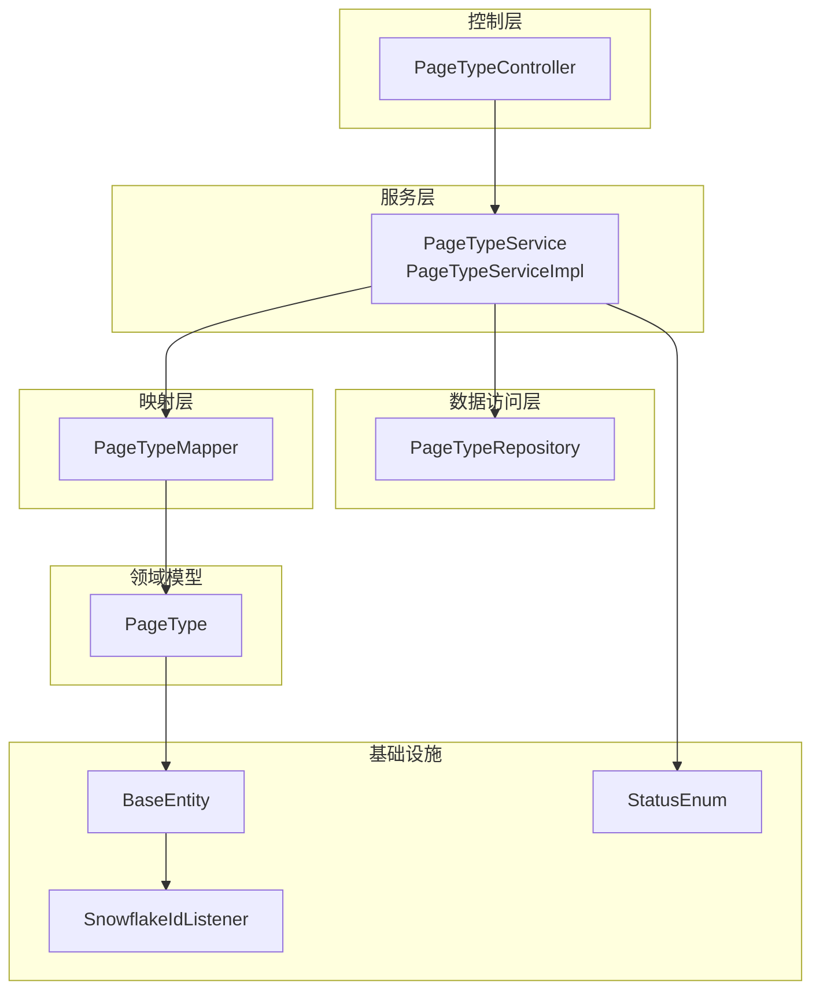
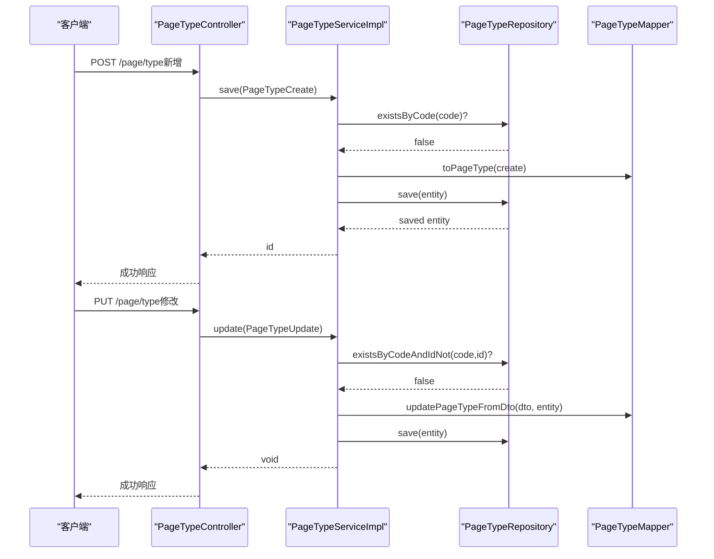
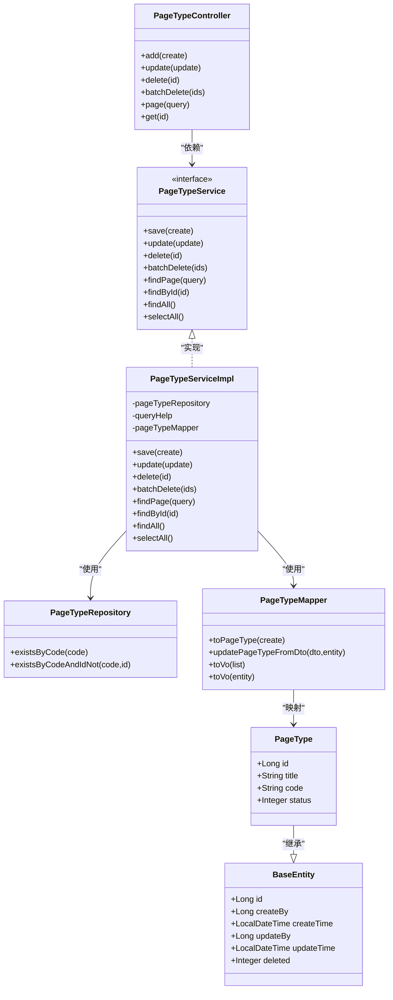

# 页面类型API

<cite>
**本文档引用的文件**
- [PageTypeController.java](file://run-admin/src/main/java/com/fastproject/module/page/controller/PageTypeController.java)
- [PageTypeService.java](file://page-module/src/main/java/com/fastproject/page/service/PageTypeService.java)
- [PageTypeServiceImpl.java](file://page-module/src/main/java/com/fastproject/page/service/impl/PageTypeServiceImpl.java)
- [PageTypeRepository.java](file://page-module/src/main/java/com/fastproject/page/repository/db/PageTypeRepository.java)
- [PageTypeMapper.java](file://page-module/src/main/java/com/fastproject/page/mapper/PageTypeMapper.java)
- [PageTypeCreate.java](file://page-module/src/main/java/com/fastproject/page/vo/pagetype/PageTypeCreate.java)
- [PageTypeUpdate.java](file://page-module/src/main/java/com/fastproject/page/vo/pagetype/PageTypeUpdate.java)
- [PageTypeQuery.java](file://page-module/src/main/java/com/fastproject/page/vo/pagetype/PageTypeQuery.java)
- [PageTypeVo.java](file://page-module/src/main/java/com/fastproject/page/vo/pagetype/PageTypeVo.java)
- [PageType.java](file://page-module/src/main/java/com/fastproject/page/domain/PageType.java)
- [BaseEntity.java](file://common/src/main/java/com/fastproject/db/BaseEntity.java)
- [SnowflakeIdListener.java](file://common/src/main/java/com/fastproject/db/SnowflakeIdListener.java)
- [StatusEnum.java](file://utils/src/main/java/com/fastproject/utils/StatusEnum.java)
</cite>

## 目录
1. [简介](#简介)
2. [项目结构](#项目结构)
3. [核心组件](#核心组件)
4. [架构总览](#架构总览)
5. [详细组件分析](#详细组件分析)
6. [依赖关系分析](#依赖关系分析)
7. [性能考虑](#性能考虑)
8. [故障排除指南](#故障排除指南)
9. [结论](#结论)
10. [附录](#附录)

## 简介
本文件系统性地记录了页面类型管理API的设计与实现，涵盖页面类型的定义、创建、分类、属性管理、查询分页以及与页面组件的关联关系。文档重点说明PageTypeController对外暴露的REST接口，以及PageTypeCreate、PageTypeUpdate、PageTypeQuery、PageTypeVo等类型管理对象的字段与用途；同时阐述页面类型的分类体系、继承关系、属性约束、模板匹配规则等核心概念的API规范，并给出设计原则、使用场景与扩展机制。

## 项目结构
页面类型模块采用经典的分层架构：
- 控制器层：PageTypeController 提供HTTP接口
- 服务层：PageTypeService 定义业务契约，PageTypeServiceImpl 实现具体逻辑
- 数据访问层：PageTypeRepository 继承JPA与Specification能力
- 映射层：PageTypeMapper 使用MapStruct进行DTO与实体转换
- 领域模型：PageType 实体承载页面类型数据
- 基础设施：BaseEntity + SnowflakeIdListener 提供统一主键、审计字段与软删除策略
- 枚举：StatusEnum 定义状态常量

图表来源
- [PageTypeController.java](file://run-admin/src/main/java/com/fastproject/module/page/controller/PageTypeController.java#L23-L93)
- [PageTypeService.java](file://page-module/src/main/java/com/fastproject/page/service/PageTypeService.java#L11-L28)
- [PageTypeServiceImpl.java](file://page-module/src/main/java/com/fastproject/page/service/impl/PageTypeServiceImpl.java#L30-L130)
- [PageTypeRepository.java](file://page-module/src/main/java/com/fastproject/page/repository/db/PageTypeRepository.java#L8-L14)
- [PageTypeMapper.java](file://page-module/src/main/java/com/fastproject/page/mapper/PageTypeMapper.java#L13-L27)
- [PageType.java](file://page-module/src/main/java/com/fastproject/page/domain/PageType.java#L12-L34)
- [BaseEntity.java](file://common/src/main/java/com/fastproject/db/BaseEntity.java#L11-L47)
- [SnowflakeIdListener.java](file://common/src/main/java/com/fastproject/db/SnowflakeIdListener.java#L12-L49)
- [StatusEnum.java](file://utils/src/main/java/com/fastproject/utils/StatusEnum.java#L3-L22)

章节来源
- [PageTypeController.java](file://run-admin/src/main/java/com/fastproject/module/page/controller/PageTypeController.java#L23-L93)
- [PageTypeService.java](file://page-module/src/main/java/com/fastproject/page/service/PageTypeService.java#L11-L28)
- [PageTypeServiceImpl.java](file://page-module/src/main/java/com/fastproject/page/service/impl/PageTypeServiceImpl.java#L30-L130)
- [PageTypeRepository.java](file://page-module/src/main/java/com/fastproject/page/repository/db/PageTypeRepository.java#L8-L14)
- [PageTypeMapper.java](file://page-module/src/main/java/com/fastproject/page/mapper/PageTypeMapper.java#L13-L27)
- [PageType.java](file://page-module/src/main/java/com/fastproject/page/domain/PageType.java#L12-L34)
- [BaseEntity.java](file://common/src/main/java/com/fastproject/db/BaseEntity.java#L11-L47)
- [SnowflakeIdListener.java](file://common/src/main/java/com/fastproject/db/SnowflakeIdListener.java#L12-L49)
- [StatusEnum.java](file://utils/src/main/java/com/fastproject/utils/StatusEnum.java#L3-L22)

## 核心组件
- 控制器：PageTypeController 提供增删改查、分页、详情等REST接口，集成权限校验、幂等性与操作日志注解。
- 服务：PageTypeService 定义保存、更新、删除、批量删除、分页查询、详情查询等方法；PageTypeServiceImpl 实现业务逻辑并进行参数校验与异常处理。
- 数据访问：PageTypeRepository 提供基于代码唯一性的存在性检查与JPA+Specification查询能力。
- 映射：PageTypeMapper 负责DTO与实体之间的转换，支持空值属性跳过映射。
- 领域模型：PageType 实体包含标题、代码、状态等字段，并通过软删除注解实现逻辑删除。
- 基础设施：BaseEntity 提供统一主键、审计字段与deleted字段；SnowflakeIdListener 在持久化前后自动填充ID、时间与用户信息；StatusEnum 提供NORMAL/DISABLED状态常量。

章节来源
- [PageTypeController.java](file://run-admin/src/main/java/com/fastproject/module/page/controller/PageTypeController.java#L23-L93)
- [PageTypeService.java](file://page-module/src/main/java/com/fastproject/page/service/PageTypeService.java#L11-L28)
- [PageTypeServiceImpl.java](file://page-module/src/main/java/com/fastproject/page/service/impl/PageTypeServiceImpl.java#L30-L130)
- [PageTypeRepository.java](file://page-module/src/main/java/com/fastproject/page/repository/db/PageTypeRepository.java#L8-L14)
- [PageTypeMapper.java](file://page-module/src/main/java/com/fastproject/page/mapper/PageTypeMapper.java#L13-L27)
- [PageType.java](file://page-module/src/main/java/com/fastproject/page/domain/PageType.java#L12-L34)
- [BaseEntity.java](file://common/src/main/java/com/fastproject/db/BaseEntity.java#L11-L47)
- [SnowflakeIdListener.java](file://common/src/main/java/com/fastproject/db/SnowflakeIdListener.java#L12-L49)
- [StatusEnum.java](file://utils/src/main/java/com/fastproject/utils/StatusEnum.java#L3-L22)

## 架构总览
页面类型API遵循“控制器-服务-仓储-映射-实体”的分层架构，结合软删除、审计字段与状态枚举，形成可维护、可扩展的类型管理能力。

图表来源
- [PageTypeController.java](file://run-admin/src/main/java/com/fastproject/module/page/controller/PageTypeController.java#L33-L51)
- [PageTypeServiceImpl.java](file://page-module/src/main/java/com/fastproject/page/service/impl/PageTypeServiceImpl.java#L37-L62)
- [PageTypeRepository.java](file://page-module/src/main/java/com/fastproject/page/repository/db/PageTypeRepository.java#L11-L13)
- [PageTypeMapper.java](file://page-module/src/main/java/com/fastproject/page/mapper/PageTypeMapper.java#L19-L22)

## 详细组件分析

### 控制器：PageTypeController
- 路径前缀：/page/type
- 权限注解：@PreAuthorize 对应权限点，确保操作安全
- 幂等性：@Idempotent 防止重复提交
- 日志：@Log 记录业务日志
- 接口列表：
  - POST /page/type：新增页面类型
  - PUT /page/type：修改页面类型
  - DELETE /page/type/{id}：删除单个页面类型
  - DELETE /page/type/batch：批量删除
  - POST /page/type/page：分页查询
  - GET /page/type/{id}：详情查询

章节来源
- [PageTypeController.java](file://run-admin/src/main/java/com/fastproject/module/page/controller/PageTypeController.java#L23-L93)

### 服务层：PageTypeService 与 PageTypeServiceImpl
- 保存：校验代码唯一性后转换并持久化
- 更新：校验代码唯一性（排除自身ID）后按需更新
- 删除：单个与批量删除
- 查询：分页查询支持标题/代码/状态过滤；详情查询；全量查询；仅查询启用状态的下拉选择数据
- 异常：类型不存在、代码已存在等业务异常抛出

章节来源
- [PageTypeService.java](file://page-module/src/main/java/com/fastproject/page/service/PageTypeService.java#L11-L28)
- [PageTypeServiceImpl.java](file://page-module/src/main/java/com/fastproject/page/service/impl/PageTypeServiceImpl.java#L36-L130)

### 数据访问层：PageTypeRepository
- existsByCode：新增时校验代码唯一
- existsByCodeAndIdNot：更新时校验代码唯一（排除当前ID）

章节来源
- [PageTypeRepository.java](file://page-module/src/main/java/com/fastproject/page/repository/db/PageTypeRepository.java#L11-L13)

### 映射层：PageTypeMapper
- updatePageTypeFromDto：按DTO更新实体，空值属性不覆盖
- toPageType：DTO转实体
- toVo：实体转VO集合与单个

章节来源
- [PageTypeMapper.java](file://page-module/src/main/java/com/fastproject/page/mapper/PageTypeMapper.java#L13-L27)

### 领域模型：PageType
- 表名：page_type
- 字段：标题、代码、状态
- 软删除：@SQLDelete/@SQLRestriction 实现逻辑删除
- 继承：继承BaseEntity，具备统一审计字段与ID生成

章节来源
- [PageType.java](file://page-module/src/main/java/com/fastproject/page/domain/PageType.java#L12-L34)
- [BaseEntity.java](file://common/src/main/java/com/fastproject/db/BaseEntity.java#L11-L47)
- [SnowflakeIdListener.java](file://common/src/main/java/com/fastproject/db/SnowflakeIdListener.java#L12-L49)

### VO与DTO：PageTypeCreate/Update/Query/Vo
- PageTypeCreate：用于新增，包含标题、代码、状态
- PageTypeUpdate：用于修改，包含ID、标题、代码、状态
- PageTypeQuery：用于分页查询，继承分页查询基类，支持标题、代码、状态过滤
- PageTypeVo：用于返回，包含ID、标题、代码、状态

章节来源
- [PageTypeCreate.java](file://page-module/src/main/java/com/fastproject/page/vo/pagetype/PageTypeCreate.java#L6-L22)
- [PageTypeUpdate.java](file://page-module/src/main/java/com/fastproject/page/vo/pagetype/PageTypeUpdate.java#L6-L27)
- [PageTypeQuery.java](file://page-module/src/main/java/com/fastproject/page/vo/pagetype/PageTypeQuery.java#L9-L25)
- [PageTypeVo.java](file://page-module/src/main/java/com/fastproject/page/vo/pagetype/PageTypeVo.java#L6-L27)

### 页面类型与页面组件的关系
- 页面组件PageComponent通过type_id关联到页面类型PageType
- 页面组件查询支持按typeId过滤，体现页面类型对组件的分类作用
- 页面组件VO中包含typeId与typeName，便于前端展示与选择

章节来源
- [PageComponent.java](file://page-module/src/main/java/com/fastproject/page/domain/PageComponent.java#L30-L33)
- [PageComponentServiceImpl.java](file://page-module/src/main/java/com/fastproject/page/service/impl/PageComponentServiceImpl.java#L123-L136)

### API规范与字段说明

- 新增接口：POST /page/type
  - 请求体：PageTypeCreate
  - 返回：新增成功后的ID
  - 权限：admin:page:type:add
  - 幂等：开启，防止重复提交

- 修改接口：PUT /page/type
  - 请求体：PageTypeUpdate
  - 返回：无
  - 权限：admin:page:type:update
  - 幂等：开启，防止重复提交

- 删除接口：DELETE /page/type/{id}
  - 路径参数：id
  - 返回：无
  - 权限：admin:page:type:delete

- 批量删除：DELETE /page/type/batch
  - 请求体：id数组
  - 返回：无
  - 权限：admin:page:type:delete

- 分页查询：POST /page/type/page
  - 请求体：PageTypeQuery
  - 返回：PageVo<List<PageTypeVo>>
  - 支持过滤：标题（模糊）、代码（精确）、状态（精确）

- 详情查询：GET /page/type/{id}
  - 路径参数：id
  - 返回：PageTypeVo

章节来源
- [PageTypeController.java](file://run-admin/src/main/java/com/fastproject/module/page/controller/PageTypeController.java#L33-L91)
- [PageTypeServiceImpl.java](file://page-module/src/main/java/com/fastproject/page/service/impl/PageTypeServiceImpl.java#L89-L112)

### 设计原则与使用场景
- 设计原则
  - 单一职责：控制器负责接口与权限，服务负责业务规则，仓储负责数据存取
  - 开闭原则：通过枚举与配置扩展状态与行为
  - 可测试性：接口清晰，依赖注入便于单元测试
  - 幂等性：关键写操作使用幂等注解，保障重试安全
  - 软删除：避免物理删除带来的数据不可恢复风险

- 使用场景
  - 后台管理系统中对页面类型进行分类与管理
  - 为页面组件提供类型维度的筛选与绑定
  - 与页面配置、应用等模块协作，实现页面模板与组件的匹配

- 扩展机制
  - 新增状态：在StatusEnum中扩展，影响下拉选择与过滤
  - 新增字段：在PageType实体与相关VO/DTO中扩展，映射层同步更新
  - 新增过滤条件：在PageTypeQuery与ServiceImpl的Specification中扩展

章节来源
- [StatusEnum.java](file://utils/src/main/java/com/fastproject/utils/StatusEnum.java#L3-L22)
- [PageTypeServiceImpl.java](file://page-module/src/main/java/com/fastproject/page/service/impl/PageTypeServiceImpl.java#L94-L106)

### 模板匹配规则与分类体系
- 分类体系
  - 页面类型作为页面组件的分类维度，组件通过type_id关联到类型
  - 支持按类型ID过滤组件，实现模板与组件的匹配

- 属性约束
  - 代码唯一：新增与更新均校验代码唯一性
  - 状态约束：通过StatusEnum控制启用/禁用状态
  - 软删除：逻辑删除，不影响历史数据与关联完整性

- 模板匹配
  - 页面组件与页面类型建立一对多关系，组件可按类型进行筛选与匹配
  - 查询接口支持按typeId过滤，便于前端模板选择与渲染

章节来源
- [PageTypeRepository.java](file://page-module/src/main/java/com/fastproject/page/repository/db/PageTypeRepository.java#L11-L13)
- [PageComponentServiceImpl.java](file://page-module/src/main/java/com/fastproject/page/service/impl/PageComponentServiceImpl.java#L123-L125)

## 依赖关系分析

图表来源
- [PageTypeController.java](file://run-admin/src/main/java/com/fastproject/module/page/controller/PageTypeController.java#L23-L93)
- [PageTypeService.java](file://page-module/src/main/java/com/fastproject/page/service/PageTypeService.java#L11-L28)
- [PageTypeServiceImpl.java](file://page-module/src/main/java/com/fastproject/page/service/impl/PageTypeServiceImpl.java#L30-L130)
- [PageTypeRepository.java](file://page-module/src/main/java/com/fastproject/page/repository/db/PageTypeRepository.java#L8-L14)
- [PageTypeMapper.java](file://page-module/src/main/java/com/fastproject/page/mapper/PageTypeMapper.java#L13-L27)
- [PageType.java](file://page-module/src/main/java/com/fastproject/page/domain/PageType.java#L12-L34)
- [BaseEntity.java](file://common/src/main/java/com/fastproject/db/BaseEntity.java#L11-L47)

## 性能考虑
- 分页查询：使用Specification动态拼接过滤条件，避免全表扫描；建议在常用过滤字段上建立索引（如code、status）
- 幂等性：对写操作启用幂等注解，减少重复请求带来的数据库压力
- 映射优化：MapStruct按需映射，避免不必要的字段拷贝
- 软删除：逻辑删除降低删除成本，但需定期清理或归档历史数据

## 故障排除指南
- 类型不存在：当查询或删除不存在的ID时抛出业务异常
- 类型代码已存在：新增或更新时若代码冲突抛出业务异常
- 权限不足：未满足@PreAuthorize权限点时返回鉴权错误
- 参数校验：建议在控制器层增加JSR-303参数校验，提升健壮性

章节来源
- [PageTypeServiceImpl.java](file://page-module/src/main/java/com/fastproject/page/service/impl/PageTypeServiceImpl.java#L40-L42)
- [PageTypeServiceImpl.java](file://page-module/src/main/java/com/fastproject/page/service/impl/PageTypeServiceImpl.java#L56-L58)
- [PageTypeController.java](file://run-admin/src/main/java/com/fastproject/module/page/controller/PageTypeController.java#L34-L38)
- [PageTypeController.java](file://run-admin/src/main/java/com/fastproject/module/page/controller/PageTypeController.java#L45-L50)

## 结论
页面类型API以清晰的分层架构与完善的业务规则实现了页面类型的创建、修改、删除、查询与分页功能，并通过软删除与状态枚举保障数据一致性与可维护性。配合页面组件的类型关联，形成了可扩展的页面分类与模板匹配体系。建议在生产环境中完善参数校验、索引优化与监控告警，持续演进以满足复杂业务需求。

## 附录

### API定义总览
- 新增：POST /page/type
  - 权限：admin:page:type:add
  - 幂等：是
  - 请求体：PageTypeCreate
  - 返回：新增ID

- 修改：PUT /page/type
  - 权限：admin:page:type:update
  - 幂等：是
  - 请求体：PageTypeUpdate
  - 返回：无

- 删除：DELETE /page/type/{id}
  - 权限：admin:page:type:delete
  - 请求体：无
  - 返回：无

- 批量删除：DELETE /page/type/batch
  - 权限：admin:page:type:delete
  - 请求体：id数组
  - 返回：无

- 分页查询：POST /page/type/page
  - 权限：admin:page:type:page
  - 请求体：PageTypeQuery
  - 返回：PageVo<List<PageTypeVo>>

- 详情查询：GET /page/type/{id}
  - 权限：admin:page:type:page
  - 返回：PageTypeVo

章节来源
- [PageTypeController.java](file://run-admin/src/main/java/com/fastproject/module/page/controller/PageTypeController.java#L33-L91)