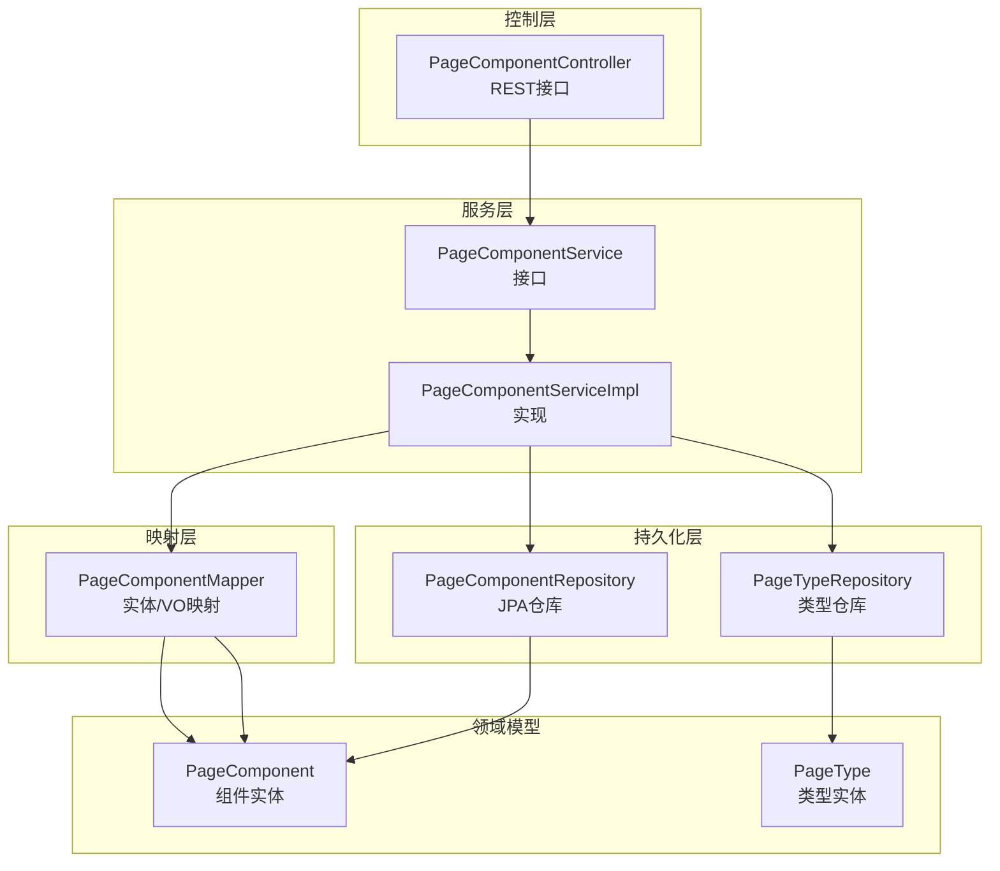
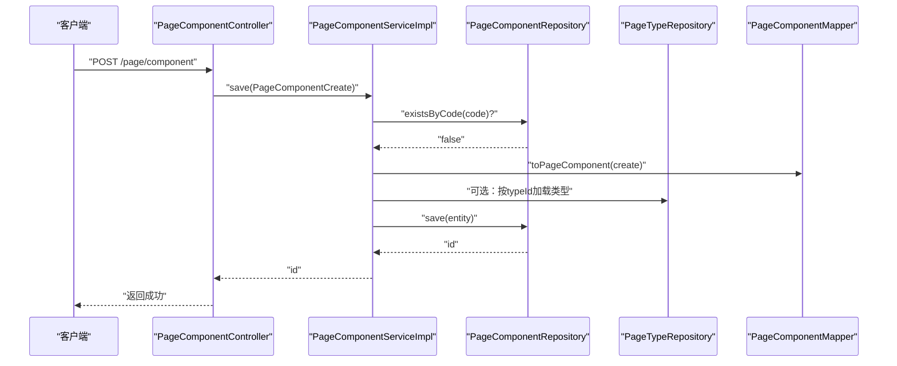
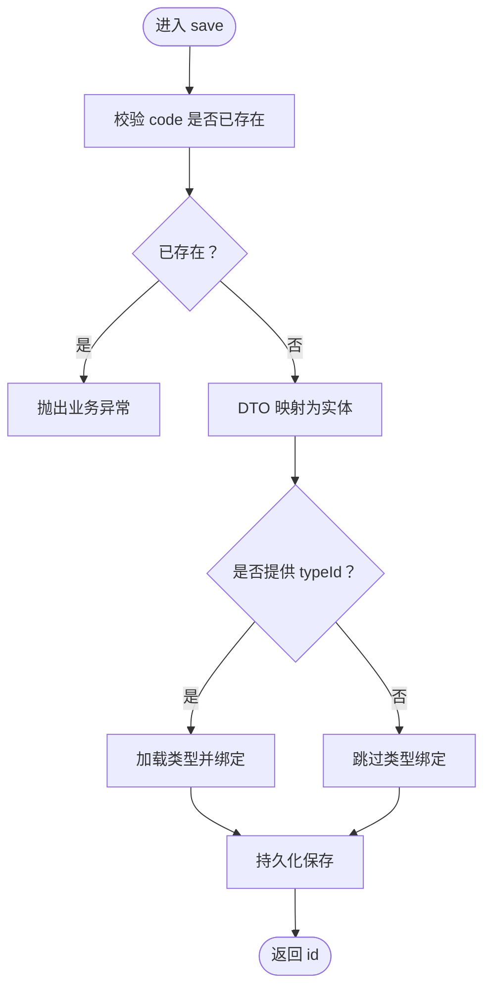
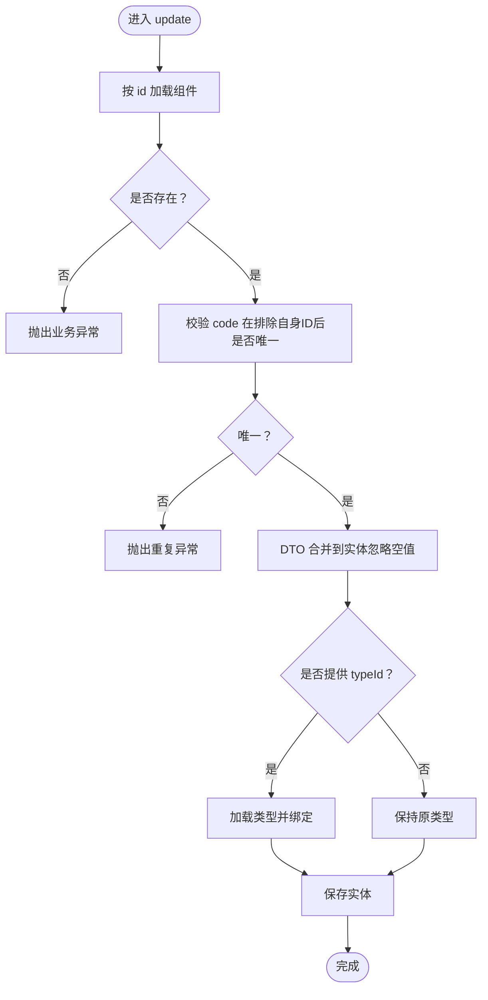
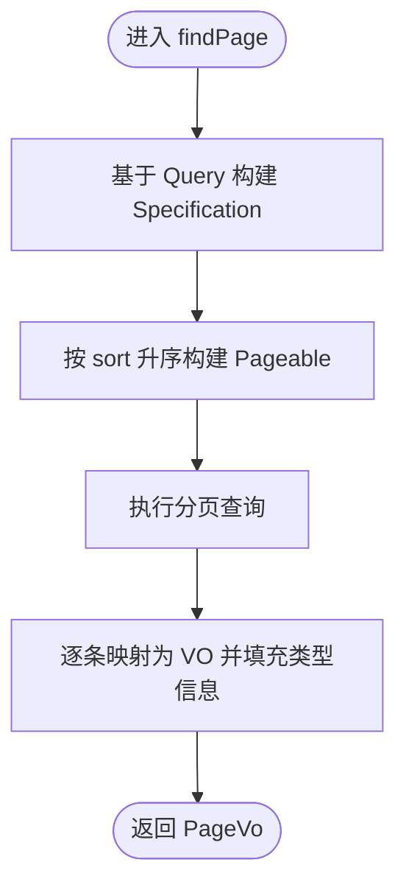
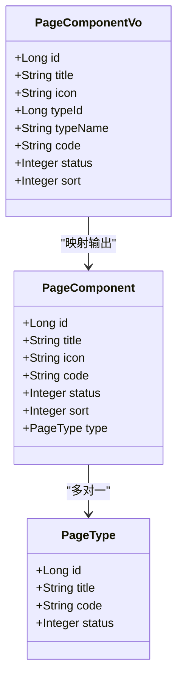
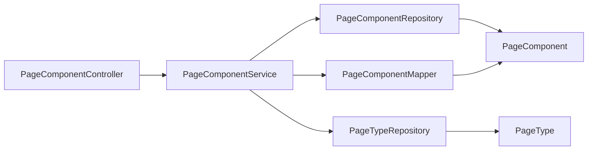

# 页面组件API

<cite>
**本文引用的文件**
- [PageComponentController.java](file://run-admin/src/main/java/com/fastproject/module/page/controller/PageComponentController.java)
- [PageComponentService.java](file://page-module/src/main/java/com/fastproject/page/service/PageComponentService.java)
- [PageComponentServiceImpl.java](file://page-module/src/main/java/com/fastproject/page/service/impl/PageComponentServiceImpl.java)
- [PageComponentRepository.java](file://page-module/src/main/java/com/fastproject/page/repository/db/PageComponentRepository.java)
- [PageComponentMapper.java](file://page-module/src/main/java/com/fastproject/page/mapper/PageComponentMapper.java)
- [PageComponentCreate.java](file://page-module/src/main/java/com/fastproject/page/vo/pagecomponent/PageComponentCreate.java)
- [PageComponentUpdate.java](file://page-module/src/main/java/com/fastproject/page/vo/pagecomponent/PageComponentUpdate.java)
- [PageComponentQuery.java](file://page-module/src/main/java/com/fastproject/page/vo/pagecomponent/PageComponentQuery.java)
- [PageComponentVo.java](file://page-module/src/main/java/com/fastproject/page/vo/pagecomponent/PageComponentVo.java)
- [PageComponent.java](file://page-module/src/main/java/com/fastproject/page/domain/PageComponent.java)
- [PageType.java](file://page-module/src/main/java/com/fastproject/page/domain/PageType.java)
</cite>

## 目录
1. [简介](#简介)
2. [项目结构](#项目结构)
3. [核心组件](#核心组件)
4. [架构总览](#架构总览)
5. [详细组件分析](#详细组件分析)
6. [依赖关系分析](#依赖关系分析)
7. [性能考量](#性能考量)
8. [故障排查指南](#故障排查指南)
9. [结论](#结论)
10. [附录](#附录)

## 简介
本文件系统性梳理“页面组件管理API”的设计与实现，覆盖控制器暴露的组件增删改查与分页能力，以及与之配套的领域模型、数据传输对象（DTO/VO）、服务层逻辑与持久化层约束。重点说明以下内容：
- 控制器接口清单与调用流程
- 数据结构 PageComponentCreate、PageComponentUpdate、PageComponentQuery、PageComponentVo 的字段语义与使用场景
- 组件的属性配置、状态与排序策略
- 类型关联与依赖关系
- 开发规范、配置示例与最佳实践

## 项目结构
页面组件模块采用经典的分层架构：
- 控制层：对外暴露REST接口，负责鉴权、幂等与日志
- 服务层：业务编排与校验，封装事务与查询条件
- 持久化层：JPA仓库与类型关联
- 映射层：MapStruct在实体与VO之间转换
- 领域模型：PageComponent与PageType

图表来源
- [PageComponentController.java](file://run-admin/src/main/java/com/fastproject/module/page/controller/PageComponentController.java#L25-L93)
- [PageComponentService.java](file://page-module/src/main/java/com/fastproject/page/service/PageComponentService.java#L11-L28)
- [PageComponentServiceImpl.java](file://page-module/src/main/java/com/fastproject/page/service/impl/PageComponentServiceImpl.java#L32-L178)
- [PageComponentRepository.java](file://page-module/src/main/java/com/fastproject/page/repository/db/PageComponentRepository.java#L8-L14)
- [PageComponentMapper.java](file://page-module/src/main/java/com/fastproject/page/mapper/PageComponentMapper.java#L13-L27)
- [PageComponent.java](file://page-module/src/main/java/com/fastproject/page/domain/PageComponent.java#L16-L49)
- [PageType.java](file://page-module/src/main/java/com/fastproject/page/domain/PageType.java#L18-L34)

章节来源
- [PageComponentController.java](file://run-admin/src/main/java/com/fastproject/module/page/controller/PageComponentController.java#L25-L93)
- [PageComponentService.java](file://page-module/src/main/java/com/fastproject/page/service/PageComponentService.java#L11-L28)
- [PageComponentServiceImpl.java](file://page-module/src/main/java/com/fastproject/page/service/impl/PageComponentServiceImpl.java#L32-L178)
- [PageComponentRepository.java](file://page-module/src/main/java/com/fastproject/page/repository/db/PageComponentRepository.java#L8-L14)
- [PageComponentMapper.java](file://page-module/src/main/java/com/fastproject/page/mapper/PageComponentMapper.java#L13-L27)
- [PageComponent.java](file://page-module/src/main/java/com/fastproject/page/domain/PageComponent.java#L16-L49)
- [PageType.java](file://page-module/src/main/java/com/fastproject/page/domain/PageType.java#L18-L34)

## 核心组件
- 控制器：提供组件的新增、修改、删除、批量删除、分页查询与详情查询接口
- 服务层：实现业务规则（如唯一性校验、类型存在性校验、分页与排序）
- 仓库层：提供JPA查询与条件构造
- 映射层：将DTO/VO与实体进行安全映射
- 领域模型：PageComponent与PageType，支持软删除与状态枚举

章节来源
- [PageComponentController.java](file://run-admin/src/main/java/com/fastproject/module/page/controller/PageComponentController.java#L30-L91)
- [PageComponentService.java](file://page-module/src/main/java/com/fastproject/page/service/PageComponentService.java#L11-L28)
- [PageComponentServiceImpl.java](file://page-module/src/main/java/com/fastproject/page/service/impl/PageComponentServiceImpl.java#L39-L178)
- [PageComponentRepository.java](file://page-module/src/main/java/com/fastproject/page/repository/db/PageComponentRepository.java#L8-L14)
- [PageComponentMapper.java](file://page-module/src/main/java/com/fastproject/page/mapper/PageComponentMapper.java#L13-L27)
- [PageComponent.java](file://page-module/src/main/java/com/fastproject/page/domain/PageComponent.java#L16-L49)
- [PageType.java](file://page-module/src/main/java/com/fastproject/page/domain/PageType.java#L18-L34)

## 架构总览
下图展示从客户端到数据库的完整调用链路与职责边界。

图表来源
- [PageComponentController.java](file://run-admin/src/main/java/com/fastproject/module/page/controller/PageComponentController.java#L33-L39)
- [PageComponentServiceImpl.java](file://page-module/src/main/java/com/fastproject/page/service/impl/PageComponentServiceImpl.java#L40-L55)
- [PageComponentRepository.java](file://page-module/src/main/java/com/fastproject/page/repository/db/PageComponentRepository.java#L11-L13)
- [PageComponentMapper.java](file://page-module/src/main/java/com/fastproject/page/mapper/PageComponentMapper.java#L22-L22)

## 详细组件分析

### 控制器接口与权限
- 新增组件：POST /page/component（需要权限：admin:page:component:add）
- 修改组件：PUT /page/component（需要权限：admin:page:component:update）
- 删除组件：DELETE /page/component/{id}（需要权限：admin:page:component:delete）
- 批量删除：DELETE /page/component/batch（需要权限：admin:page:component:delete）
- 分页查询：POST /page/component/page（需要权限：admin:page:component:page）
- 详情查询：GET /page/component/{id}（需要权限：admin:page:component:page）

章节来源
- [PageComponentController.java](file://run-admin/src/main/java/com/fastproject/module/page/controller/PageComponentController.java#L33-L91)

### 数据结构与字段说明

#### PageComponentCreate（创建入参）
- 字段
  - title：标题
  - icon：图标
  - typeId：类型ID
  - code：组件代码（全局唯一）
  - status：状态
  - sort：排序值
- 使用场景
  - 创建新组件时提交的基础信息
  - 服务层会校验code唯一性并可选绑定类型

章节来源
- [PageComponentCreate.java](file://page-module/src/main/java/com/fastproject/page/vo/pagecomponent/PageComponentCreate.java#L6-L37)

#### PageComponentUpdate（更新入参）
- 字段
  - id：组件ID（必填）
  - title/icon/typeId/code/status/sort：同创建结构
- 使用场景
  - 更新现有组件信息；服务层会校验code在排除自身ID后的唯一性

章节来源
- [PageComponentUpdate.java](file://page-module/src/main/java/com/fastproject/page/vo/pagecomponent/PageComponentUpdate.java#L6-L42)

#### PageComponentQuery（分页查询条件）
- 字段
  - 继承分页参数（页码、每页大小）
  - title：标题模糊匹配
  - code：精确匹配
  - status：状态过滤
  - typeId：类型ID过滤
- 使用场景
  - 后台列表筛选与分页展示

章节来源
- [PageComponentQuery.java](file://page-module/src/main/java/com/fastproject/page/vo/pagecomponent/PageComponentQuery.java#L9-L30)

#### PageComponentVo（响应VO）
- 字段
  - id/title/icon/typeId/typeName/code/status/sort：组件基本信息
- 使用场景
  - 列表、详情、下拉选择等前端展示

章节来源
- [PageComponentVo.java](file://page-module/src/main/java/com/fastproject/page/vo/pagecomponent/PageComponentVo.java#L6-L47)

### 服务层处理流程

#### 新增组件流程

图表来源
- [PageComponentServiceImpl.java](file://page-module/src/main/java/com/fastproject/page/service/impl/PageComponentServiceImpl.java#L40-L55)
- [PageComponentRepository.java](file://page-module/src/main/java/com/fastproject/page/repository/db/PageComponentRepository.java#L11-L11)
- [PageComponentMapper.java](file://page-module/src/main/java/com/fastproject/page/mapper/PageComponentMapper.java#L22-L22)

#### 更新组件流程

图表来源
- [PageComponentServiceImpl.java](file://page-module/src/main/java/com/fastproject/page/service/impl/PageComponentServiceImpl.java#L58-L75)
- [PageComponentRepository.java](file://page-module/src/main/java/com/fastproject/page/repository/db/PageComponentRepository.java#L12-L13)
- [PageComponentMapper.java](file://page-module/src/main/java/com/fastproject/page/mapper/PageComponentMapper.java#L19-L20)

#### 分页查询流程

图表来源
- [PageComponentServiceImpl.java](file://page-module/src/main/java/com/fastproject/page/service/impl/PageComponentServiceImpl.java#L107-L141)
- [PageComponentMapper.java](file://page-module/src/main/java/com/fastproject/page/mapper/PageComponentMapper.java#L24-L26)

### 领域模型与依赖关系
- PageComponent 实体
  - 关联 PageType（多对一）
  - 支持软删除与状态字段
- PageType 实体
  - 标题、代码、状态
- 依赖关系
  - PageComponentServiceImpl 在新增/更新时可选加载 PageType 并绑定
  - VO 层额外携带 typeId 与 typeName，便于前端展示

图表来源
- [PageComponent.java](file://page-module/src/main/java/com/fastproject/page/domain/PageComponent.java#L16-L49)
- [PageType.java](file://page-module/src/main/java/com/fastproject/page/domain/PageType.java#L18-L34)
- [PageComponentVo.java](file://page-module/src/main/java/com/fastproject/page/vo/pagecomponent/PageComponentVo.java#L6-L47)

章节来源
- [PageComponent.java](file://page-module/src/main/java/com/fastproject/page/domain/PageComponent.java#L16-L49)
- [PageType.java](file://page-module/src/main/java/com/fastproject/page/domain/PageType.java#L18-L34)
- [PageComponentVo.java](file://page-module/src/main/java/com/fastproject/page/vo/pagecomponent/PageComponentVo.java#L6-L47)

### API 规范与调用示例

- 新增组件
  - 方法与路径：POST /page/component
  - 权限：admin:page:component:add
  - 请求体：PageComponentCreate
  - 响应：ResultVo<Object>（返回新增ID）

- 修改组件
  - 方法与路径：PUT /page/component
  - 权限：admin:page:component:update
  - 请求体：PageComponentUpdate
  - 响应：ResultVo<Object>（成功）

- 删除组件
  - 方法与路径：DELETE /page/component/{id}
  - 权限：admin:page:component:delete
  - 响应：ResultVo<Object>（成功）

- 批量删除
  - 方法与路径：DELETE /page/component/batch
  - 权限：admin:page:component:delete
  - 请求体：List<Long>
  - 响应：ResultVo<Object>（成功）

- 分页查询
  - 方法与路径：POST /page/component/page
  - 权限：admin:page:component:page
  - 请求体：PageComponentQuery
  - 响应：ResultVo<PageVo<List<PageComponentVo>>>

- 详情查询
  - 方法与路径：GET /page/component/{id}
  - 权限：admin:page:component:page
  - 响应：ResultVo<PageComponentVo>

章节来源
- [PageComponentController.java](file://run-admin/src/main/java/com/fastproject/module/page/controller/PageComponentController.java#L33-L91)
- [PageComponentService.java](file://page-module/src/main/java/com/fastproject/page/service/PageComponentService.java#L13-L27)

## 依赖关系分析
- 控制器依赖服务接口，通过注解实现幂等与审计
- 服务层依赖仓库与映射器，组合类型仓库以解析类型信息
- 仓库层基于JPA与Specification实现动态查询
- 映射层使用MapStruct进行DTO/VO与实体的双向转换，忽略空值以避免误清空

图表来源
- [PageComponentController.java](file://run-admin/src/main/java/com/fastproject/module/page/controller/PageComponentController.java#L28-L28)
- [PageComponentService.java](file://page-module/src/main/java/com/fastproject/page/service/PageComponentService.java#L3-L7)
- [PageComponentServiceImpl.java](file://page-module/src/main/java/com/fastproject/page/service/impl/PageComponentServiceImpl.java#L34-L37)
- [PageComponentRepository.java](file://page-module/src/main/java/com/fastproject/page/repository/db/PageComponentRepository.java#L8-L14)
- [PageComponentMapper.java](file://page-module/src/main/java/com/fastproject/page/mapper/PageComponentMapper.java#L13-L27)
- [PageComponent.java](file://page-module/src/main/java/com/fastproject/page/domain/PageComponent.java#L16-L49)
- [PageType.java](file://page-module/src/main/java/com/fastproject/page/domain/PageType.java#L18-L34)

章节来源
- [PageComponentController.java](file://run-admin/src/main/java/com/fastproject/module/page/controller/PageComponentController.java#L28-L28)
- [PageComponentService.java](file://page-module/src/main/java/com/fastproject/page/service/PageComponentService.java#L3-L7)
- [PageComponentServiceImpl.java](file://page-module/src/main/java/com/fastproject/page/service/impl/PageComponentServiceImpl.java#L34-L37)
- [PageComponentRepository.java](file://page-module/src/main/java/com/fastproject/page/repository/db/PageComponentRepository.java#L8-L14)
- [PageComponentMapper.java](file://page-module/src/main/java/com/fastproject/page/mapper/PageComponentMapper.java#L13-L27)
- [PageComponent.java](file://page-module/src/main/java/com/fastproject/page/domain/PageComponent.java#L16-L49)
- [PageType.java](file://page-module/src/main/java/com/fastproject/page/domain/PageType.java#L18-L34)

## 性能考量
- 分页排序：默认按 sort 升序，建议在数据库为 sort 字段建立索引以提升排序与分页性能
- 动态查询：Specification 条件拼接避免 N+1 查询，但需注意组合条件的索引策略
- 幂等与日志：幂等键前缀区分不同操作，避免重复提交带来的数据库压力
- 映射策略：MapStruct 忽略空值合并，减少不必要的字段更新

## 故障排查指南
- 组件代码重复
  - 现象：新增或更新时报“组件代码已存在”
  - 原因：code 全局唯一约束被违反
  - 处理：更换唯一标识或确认是否为更新操作（更新时排除自身ID）
- 类型不存在
  - 现象：更新时提示“类型不存在”
  - 原因：typeId 指向的类型未找到
  - 处理：确认类型ID正确或先创建类型
- 组件不存在
  - 现象：更新或删除时报“组件不存在”
  - 原因：ID错误或已被软删除
  - 处理：核对ID或检查软删除状态

章节来源
- [PageComponentServiceImpl.java](file://page-module/src/main/java/com/fastproject/page/service/impl/PageComponentServiceImpl.java#L43-L45)
- [PageComponentServiceImpl.java](file://page-module/src/main/java/com/fastproject/page/service/impl/PageComponentServiceImpl.java#L61-L62)
- [PageComponentServiceImpl.java](file://page-module/src/main/java/com/fastproject/page/service/impl/PageComponentServiceImpl.java#L79-L82)

## 结论
页面组件管理API以清晰的分层设计实现了组件的全生命周期管理，结合MapStruct映射、JPA动态查询与软删除策略，满足后台管理对组件分类、排序与状态控制的需求。通过统一的DTO/VO与严格的唯一性与存在性校验，保证了数据一致性与可维护性。

## 附录

### 字段语义速查
- title：组件标题，用于展示与检索
- icon：组件图标，用于可视化标识
- code：组件代码，全局唯一，作为外部引用与识别标识
- status：组件状态（如启用/停用），配合查询过滤
- sort：排序值，决定组件在列表中的顺序
- typeId/typeName：类型ID与名称，用于归类与筛选

章节来源
- [PageComponentCreate.java](file://page-module/src/main/java/com/fastproject/page/vo/pagecomponent/PageComponentCreate.java#L6-L37)
- [PageComponentUpdate.java](file://page-module/src/main/java/com/fastproject/page/vo/pagecomponent/PageComponentUpdate.java#L6-L42)
- [PageComponentVo.java](file://page-module/src/main/java/com/fastproject/page/vo/pagecomponent/PageComponentVo.java#L6-L47)
- [PageComponentQuery.java](file://page-module/src/main/java/com/fastproject/page/vo/pagecomponent/PageComponentQuery.java#L9-L30)