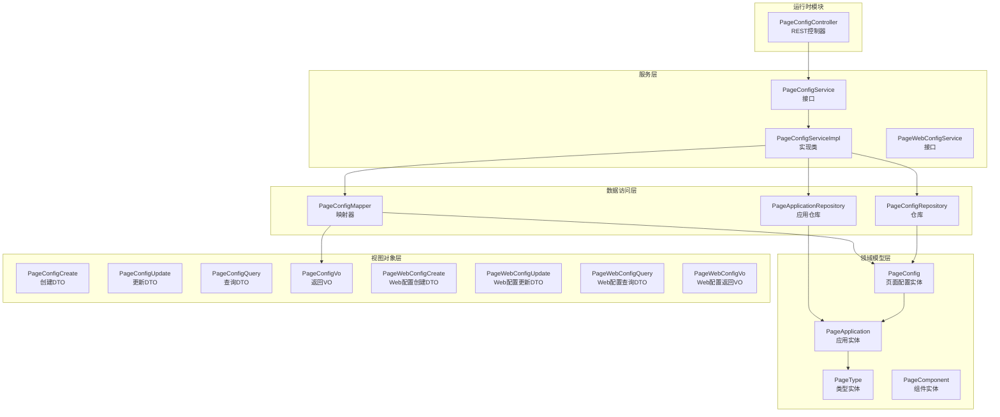
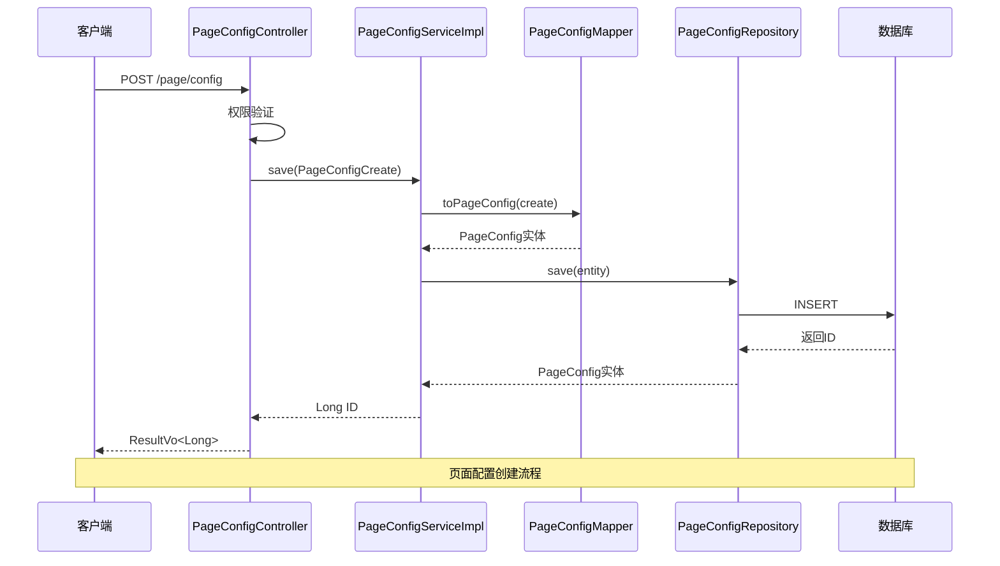
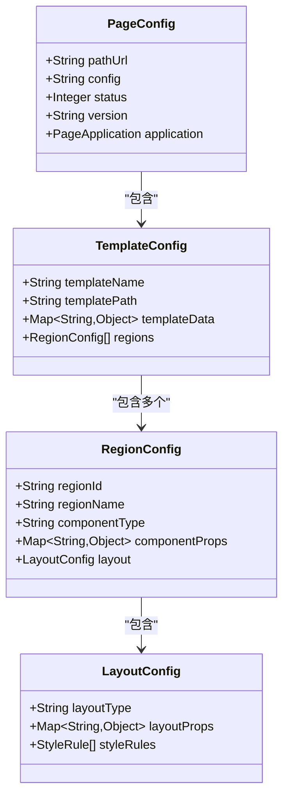
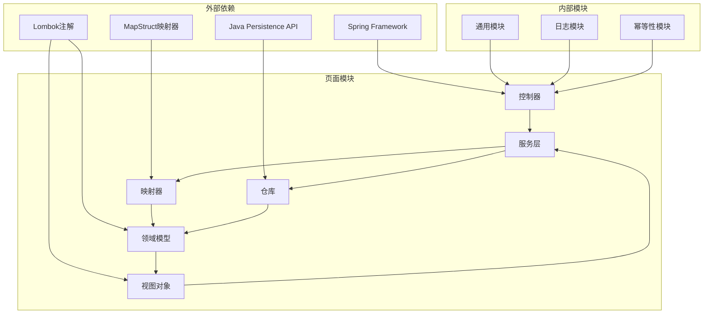
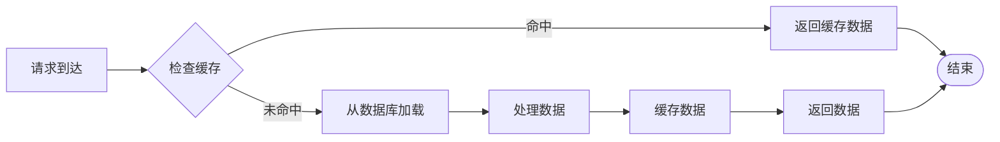
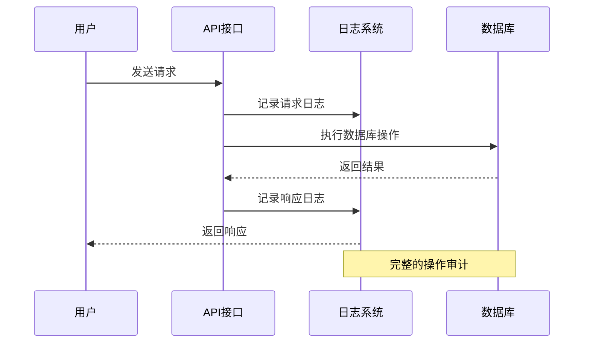

# 页面配置API

<cite>
**本文档引用的文件**
- [PageConfigController.java](file://run-admin/src/main/java/com/fastproject/module/page/controller/PageConfigController.java)
- [PageConfigService.java](file://page-module/src/main/java/com/fastproject/page/service/PageConfigService.java)
- [PageConfigServiceImpl.java](file://page-module/src/main/java/com/fastproject/page/service/impl/PageConfigServiceImpl.java)
- [PageConfigMapper.java](file://page-module/src/main/java/com/fastproject/page/mapper/PageConfigMapper.java)
- [PageConfigCreate.java](file://page-module/src/main/java/com/fastproject/page/vo/pageconfig/PageConfigCreate.java)
- [PageConfigUpdate.java](file://page-module/src/main/java/com/fastproject/page/vo/pageconfig/PageConfigUpdate.java)
- [PageConfigQuery.java](file://page-module/src/main/java/com/fastproject/page/vo/pageconfig/PageConfigQuery.java)
- [PageConfigVo.java](file://page-module/src/main/java/com/fastproject/page/vo/pageconfig/PageConfigVo.java)
- [PageConfig.java](file://page-module/src/main/java/com/fastproject/page/domain/PageConfig.java)
- [PageApplication.java](file://page-module/src/main/java/com/fastproject/page/domain/PageApplication.java)
- [PageWebConfigService.java](file://page-module/src/main/java/com/fastproject/page/service/PageWebConfigService.java)
- [PageWebConfigCreate.java](file://page-module/src/main/java/com/fastproject/page/vo/pagewebconfig/PageWebConfigCreate.java)
- [PageWebConfigUpdate.java](file://page-module/src/main/java/com/fastproject/page/vo/pagewebconfig/PageWebConfigUpdate.java)
- [PageWebConfigQuery.java](file://page-module/src/main/java/com/fastproject/page/vo/pagewebconfig/PageWebConfigQuery.java)
- [PageWebConfigVo.java](file://page-module/src/main/java/com/fastproject/page/vo/pagewebconfig/PageWebConfigVo.java)
- [PageWebConfig.java](file://page-module/src/main/java/com/fastproject/page/domain/PageWebConfig.java)
- [PageType.java](file://page-module/src/main/java/com/fastproject/page/domain/PageType.java)
- [PageComponent.java](file://page-module/src/main/java/com/fastproject/page/domain/PageComponent.java)
</cite>

## 目录
1. [简介](#简介)
2. [项目结构](#项目结构)
3. [核心组件](#核心组件)
4. [架构概览](#架构概览)
5. [详细组件分析](#详细组件分析)
6. [依赖关系分析](#依赖关系分析)
7. [性能考虑](#性能考虑)
8. [故障排除指南](#故障排除指南)
9. [结论](#结论)

## 简介

页面配置管理API是Fast项目中的核心功能模块，负责管理系统中所有页面的配置信息。该模块提供了完整的页面配置生命周期管理，包括页面布局配置、主题设置、响应式配置、SEO配置等功能。通过统一的API接口，用户可以对页面进行创建、更新、查询、删除等操作。

该系统采用分层架构设计，包含控制器层、服务层、数据访问层和领域模型层，确保了代码的可维护性和扩展性。同时，系统支持多应用页面配置管理，每个页面配置都与特定的应用程序关联。

## 项目结构

页面配置管理模块在项目中的组织结构如下：

**图表来源**
- [PageConfigController.java](file://run-admin/src/main/java/com/fastproject/module/page/controller/PageConfigController.java#L23-L94)
- [PageConfigService.java](file://page-module/src/main/java/com/fastproject/page/service/PageConfigService.java#L11-L28)
- [PageConfigServiceImpl.java](file://page-module/src/main/java/com/fastproject/page/service/impl/PageConfigServiceImpl.java#L32-L91)

**章节来源**
- [PageConfigController.java](file://run-admin/src/main/java/com/fastproject/module/page/controller/PageConfigController.java#L1-L94)
- [PageConfigService.java](file://page-module/src/main/java/com/fastproject/page/service/PageConfigService.java#L1-L28)

## 核心组件

页面配置管理API的核心组件包括以下主要部分：

### 控制器层
- **PageConfigController**: 提供RESTful API接口，处理页面配置的增删改查请求
- 支持权限控制和操作日志记录
- 实现幂等性控制，防止重复提交

### 服务层
- **PageConfigService**: 定义页面配置管理的业务接口
- **PageConfigServiceImpl**: 实现具体的业务逻辑，包括数据验证、业务规则处理
- **PageWebConfigService**: 管理Web页面配置的服务接口

### 数据访问层
- **PageConfigMapper**: 使用MapStruct进行对象映射转换
- **PageConfigRepository**: 数据持久化访问接口
- **PageApplicationRepository**: 应用配置数据访问接口

### 领域模型层
- **PageConfig**: 页面配置实体，包含页面路径、配置内容、状态等属性
- **PageApplication**: 应用实体，管理页面所属的应用程序
- **PageWebConfig**: Web页面配置实体
- **PageType**: 页面类型实体
- **PageComponent**: 页面组件实体

**章节来源**
- [PageConfigController.java](file://run-admin/src/main/java/com/fastproject/module/page/controller/PageConfigController.java#L20-L94)
- [PageConfigService.java](file://page-module/src/main/java/com/fastproject/page/service/PageConfigService.java#L1-L28)
- [PageConfigServiceImpl.java](file://page-module/src/main/java/com/fastproject/page/service/impl/PageConfigServiceImpl.java#L32-L91)

## 架构概览

页面配置管理API采用经典的三层架构模式，实现了清晰的职责分离：

**图表来源**
- [PageConfigController.java](file://run-admin/src/main/java/com/fastproject/module/page/controller/PageConfigController.java#L33-L39)
- [PageConfigServiceImpl.java](file://page-module/src/main/java/com/fastproject/page/service/impl/PageConfigServiceImpl.java#L40-L51)
- [PageConfigMapper.java](file://page-module/src/main/java/com/fastproject/page/mapper/PageConfigMapper.java#L22-L22)

系统架构特点：
- **分层清晰**: 控制器层、服务层、数据访问层职责明确
- **接口隔离**: 每一层都有明确的接口定义
- **依赖注入**: 使用Spring框架的依赖注入机制
- **事务管理**: 关键操作使用事务保证数据一致性
- **安全控制**: 基于注解的权限控制和操作日志

**章节来源**
- [PageConfigServiceImpl.java](file://page-module/src/main/java/com/fastproject/page/service/impl/PageConfigServiceImpl.java#L32-L91)
- [PageConfigMapper.java](file://page-module/src/main/java/com/fastproject/page/mapper/PageConfigMapper.java#L13-L27)

## 详细组件分析

### PageConfigController - REST控制器

PageConfigController是页面配置管理API的入口点，提供了完整的CRUD操作接口：

#### 主要接口

| 方法 | HTTP方法 | 路径 | 权限 | 功能描述 |
|------|----------|------|------|----------|
| 添加页面配置 | POST | /page/config | admin:page:config:add | 创建新的页面配置 |
| 更新页面配置 | PUT | /page/config | admin:page:config:update | 更新现有页面配置 |
| 删除页面配置 | DELETE | /page/config/{id} | admin:page:config:delete | 删除指定页面配置 |
| 批量删除 | DELETE | /page/config/batch | admin:page:config:delete | 批量删除页面配置 |
| 分页查询 | POST | /page/config/page | admin:page:config:page | 分页获取页面配置列表 |
| 获取详情 | GET | /page/config/{id} | admin:page:config:page | 获取指定页面配置详情 |

#### 权限控制机制

系统使用基于表达式的权限控制（@PreAuthorize），每个接口都有相应的权限标识：
- `admin:page:config:add`: 添加权限
- `admin:page:config:update`: 更新权限  
- `admin:page:config:delete`: 删除权限
- `admin:page:config:page`: 查询权限

#### 幂等性控制

所有写操作都集成了幂等性控制，防止重复提交：
- 使用Redis进行去重
- 设置过期时间（默认120秒）
- 基于前缀的键空间管理

**章节来源**
- [PageConfigController.java](file://run-admin/src/main/java/com/fastproject/module/page/controller/PageConfigController.java#L20-L94)

### PageConfigService - 业务服务接口

PageConfigService定义了页面配置管理的核心业务方法：

#### 核心方法

| 方法签名 | 参数 | 返回值 | 描述 |
|----------|------|--------|------|
| save | PageConfigCreate | Long | 保存新的页面配置 |
| update | PageConfigUpdate | void | 更新现有页面配置 |
| delete | Long | void | 删除指定ID的页面配置 |
| batchDelete | List<Long> | void | 批量删除页面配置 |
| findById | Long | PageConfigVo | 根据ID查找页面配置 |
| findPage | PageConfigQuery | PageVo<List<PageConfigVo>> | 分页查询页面配置 |
| findAll | - | List<PageConfigVo> | 获取所有页面配置 |
| selectAll | - | List<PageConfigVo> | 选择所有页面配置 |

#### 业务规则

服务层实现了以下业务规则：
- 应用存在性验证
- 配置数据完整性检查
- 状态管理
- 版本控制

**章节来源**
- [PageConfigService.java](file://page-module/src/main/java/com/fastproject/page/service/PageConfigService.java#L11-L28)

### PageConfigServiceImpl - 业务实现

PageConfigServiceImpl是业务逻辑的具体实现：

#### 关键实现特性

1. **数据验证**: 在保存和更新操作前进行数据验证
2. **应用关联**: 自动关联应用程序实体
3. **异常处理**: 统一的业务异常处理机制
4. **日志记录**: 完整的操作日志记录
5. **事务管理**: 关键操作使用事务保证数据一致性

#### 处理流程

```mermaid
flowchart TD
Start([开始]) --> Validate["验证输入参数"]
Validate --> Valid{"参数有效?"}
Valid --> |否| ThrowError["抛出业务异常"]
Valid --> |是| FindApp["查找应用程序"]
FindApp --> AppExists{"应用程序存在?"}
AppExists --> |否| AppError["抛出应用不存在异常"]
AppExists --> |是| MapToEntity["映射到实体"]
MapToEntity --> Save["保存到数据库"]
Save --> ReturnId["返回ID"]
ThrowError --> End([结束])
AppError --> End
ReturnId --> End
```

**图表来源**
- [PageConfigServiceImpl.java](file://page-module/src/main/java/com/fastproject/page/service/impl/PageConfigServiceImpl.java#L40-L51)

**章节来源**
- [PageConfigServiceImpl.java](file://page-module/src/main/java/com/fastproject/page/service/impl/PageConfigServiceImpl.java#L32-L91)

### 配置对象详解

#### PageConfigCreate - 创建配置对象

PageConfigCreate用于创建新的页面配置，包含以下字段：

| 字段名 | 类型 | 必填 | 描述 | 默认值 |
|--------|------|------|------|--------|
| pathUrl | String | 是 | 页面请求路径URL | - |
| config | String | 是 | 页面配置JSON字符串 | - |
| status | Integer | 否 | 状态（0禁用，1启用） | 1 |
| version | String | 否 | 配置版本号 | 当前时间戳 |
| applicationId | Long | 否 | 所属应用ID | null |

**验证规则**:
- pathUrl必须唯一且格式正确
- config必须为有效的JSON字符串
- status必须为0或1
- applicationId必须对应存在的应用

#### PageConfigUpdate - 更新配置对象

PageConfigUpdate用于更新现有页面配置：

| 字段名 | 类型 | 必填 | 描述 | 默认值 |
|--------|------|------|------|--------|
| id | Long | 是 | 配置ID | - |
| pathUrl | String | 否 | 页面请求路径URL | 保持不变 |
| config | String | 否 | 页面配置JSON字符串 | 保持不变 |
| status | Integer | 否 | 状态（0禁用，1启用） | 保持不变 |
| version | String | 否 | 配置版本号 | 自动生成 |
| applicationId | Long | 否 | 所属应用ID | 保持不变 |

**更新策略**:
- 支持部分字段更新
- 未提供的字段保持原值
- 版本号自动递增

#### PageConfigQuery - 查询配置对象

PageConfigQuery用于分页查询页面配置：

| 字段名 | 类型 | 必填 | 描述 | 默认值 |
|--------|------|------|------|--------|
| pathUrl | String | 否 | 页面路径过滤条件 | null |
| status | Integer | 否 | 状态过滤条件 | null |
| version | String | 否 | 版本号过滤条件 | null |
| applicationId | Long | 否 | 应用ID过滤条件 | null |
| page | Integer | 否 | 页码 | 1 |
| size | Integer | 否 | 每页大小 | 10 |

#### PageConfigVo - 返回配置对象

PageConfigVo是API响应的数据传输对象：

| 字段名 | 类型 | 描述 |
|--------|------|------|
| id | Long | 配置ID |
| pathUrl | String | 页面请求路径URL |
| config | String | 页面配置JSON字符串 |
| status | Integer | 状态（0禁用，1启用） |
| version | String | 配置版本号 |
| applicationId | Long | 应用程序ID |
| applicationName | String | 应用程序名称 |

**继承机制**:
- PageConfigVo继承自PageConfig实体
- 自动包含应用程序关联信息
- 支持级联查询

**章节来源**
- [PageConfigCreate.java](file://page-module/src/main/java/com/fastproject/page/vo/pageconfig/PageConfigCreate.java#L6-L32)
- [PageConfigUpdate.java](file://page-module/src/main/java/com/fastproject/page/vo/pageconfig/PageConfigUpdate.java#L6-L37)
- [PageConfigQuery.java](file://page-module/src/main/java/com/fastproject/page/vo/pageconfig/PageConfigQuery.java#L9-L30)
- [PageConfigVo.java](file://page-module/src/main/java/com/fastproject/page/vo/pageconfig/PageConfigVo.java#L6-L43)

### 高级功能API规范

#### 页面模板配置

系统支持页面模板配置管理，通过config字段存储模板相关信息：

**图表来源**
- [PageConfig.java](file://page-module/src/main/java/com/fastproject/page/domain/PageConfig.java#L16-L46)
- [PageConfigVo.java](file://page-module/src/main/java/com/fastproject/page/vo/pageconfig/PageConfigVo.java#L6-L43)

#### 区块配置

区块配置允许用户定义页面的不同区域和组件：

| 区域类型 | 描述 | 典型组件 |
|----------|------|----------|
| header | 页面头部区域 | Logo、导航菜单、搜索框 |
| sidebar | 侧边栏区域 | 菜单列表、用户信息 |
| main | 主要内容区域 | 页面主体内容 |
| footer | 页面底部区域 | 版权信息、链接 |

#### 样式配置

样式配置支持主题切换和响应式设计：

| 样式属性 | 类型 | 描述 |
|----------|------|------|
| theme | String | 主题名称（light/dark） |
| colors | Map<String,String> | 颜色配置 |
| typography | Map<String,Object> | 字体配置 |
| spacing | Map<String,Integer> | 间距配置 |
| breakpoints | Map<String,Integer> | 响应式断点 |

#### 交互配置

交互配置管理页面的各种交互行为：

| 交互类型 | 配置项 | 描述 |
|----------|--------|------|
| 导航交互 | menuBehavior | 菜单展开/收起行为 |
| 表单交互 | formValidation | 表单验证规则 |
| 加载交互 | loadingAnimation | 加载动画配置 |
| 错误处理 | errorHandling | 错误处理策略 |

**章节来源**
- [PageConfig.java](file://page-module/src/main/java/com/fastproject/page/domain/PageConfig.java#L16-L46)
- [PageConfigVo.java](file://page-module/src/main/java/com/fastproject/page/vo/pageconfig/PageConfigVo.java#L6-L43)

## 依赖关系分析

页面配置管理模块的依赖关系如下：

**图表来源**
- [PageConfigController.java](file://run-admin/src/main/java/com/fastproject/module/page/controller/PageConfigController.java#L1-L18)
- [PageConfigServiceImpl.java](file://page-module/src/main/java/com/fastproject/page/service/impl/PageConfigServiceImpl.java#L1-L27)

### 核心依赖

| 依赖名称 | 版本 | 用途 | 重要性 |
|----------|------|------|--------|
| Spring Boot | 最新稳定版 | 依赖注入、事务管理 | 核心 |
| Spring Data JPA | 最新稳定版 | 数据持久化 | 核心 |
| MapStruct | 最新稳定版 | 对象映射 | 重要 |
| Lombok | 最新稳定版 | 代码简化 | 重要 |
| Hibernate | 最新稳定版 | ORM框架 | 核心 |
| H2/MySQL | 数据库 | 数据存储 | 核心 |

**章节来源**
- [PageConfigServiceImpl.java](file://page-module/src/main/java/com/fastproject/page/service/impl/PageConfigServiceImpl.java#L1-L27)

## 性能考虑

### 数据库优化

1. **索引策略**:
   - pathUrl字段建立唯一索引
   - application_id字段建立普通索引
   - status字段建立索引用于快速筛选

2. **查询优化**:
   - 使用分页查询避免大量数据加载
   - 实现延迟加载减少关联查询
   - 缓存常用配置数据

3. **连接池配置**:
   - 合理设置最大连接数
   - 配置连接超时时间
   - 启用连接池监控

### 缓存策略

### 异步处理

对于耗时操作，建议使用异步处理：
- 大批量配置导入
- 配置文件生成
- 数据同步任务

## 故障排除指南

### 常见问题及解决方案

#### 1. 应用不存在异常
**现象**: 更新页面配置时报错"应用不存在"
**原因**: applicationId指向的應用不存在
**解决**: 确保applicationId对应的有效应用ID

#### 2. 配置格式错误
**现象**: 保存配置时报JSON格式错误
**原因**: config字段不是有效的JSON格式
**解决**: 使用JSON验证工具检查配置格式

#### 3. 路径冲突
**现象**: 保存页面配置时报路径已存在
**原因**: pathUrl重复
**解决**: 修改为唯一的页面路径

#### 4. 权限不足
**现象**: API调用返回403 Forbidden
**原因**: 缺少相应权限
**解决**: 为用户分配admin:page:config:*权限

### 日志分析

系统提供了完整的操作日志记录，便于问题排查：

**图表来源**
- [PageConfigController.java](file://run-admin/src/main/java/com/fastproject/module/page/controller/PageConfigController.java#L35-L35)

**章节来源**
- [PageConfigServiceImpl.java](file://page-module/src/main/java/com/fastproject/page/service/impl/PageConfigServiceImpl.java#L40-L82)

## 结论

页面配置管理API是一个功能完整、架构清晰的系统模块。它提供了丰富的页面配置管理能力，包括：

1. **完整的CRUD操作**: 支持页面配置的全生命周期管理
2. **灵活的查询机制**: 支持多种过滤条件和分页查询
3. **强大的扩展性**: 支持页面模板、区块、样式、交互等高级配置
4. **完善的权限控制**: 基于角色的细粒度权限管理
5. **高可用性设计**: 幂等性控制、事务管理和错误处理

该模块的设计充分体现了现代企业级应用的最佳实践，为后续的功能扩展和维护奠定了良好的基础。通过合理的分层架构和清晰的接口定义，系统既保证了功能的完整性，又确保了代码的可维护性。