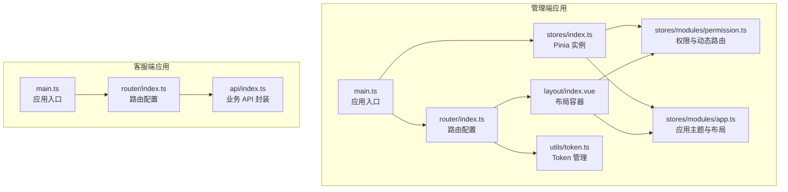
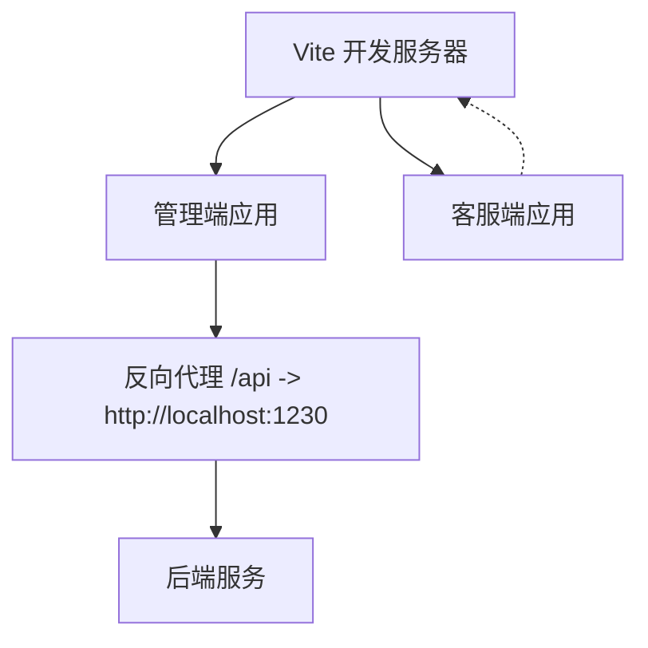
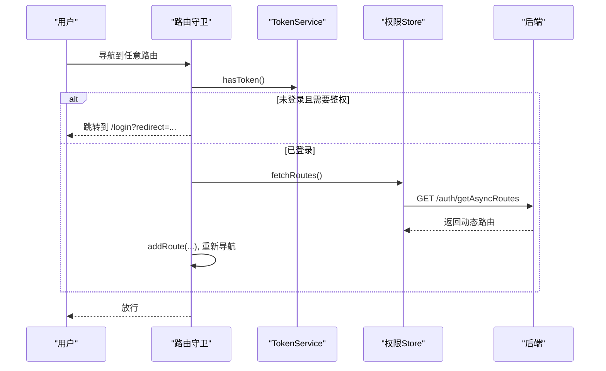
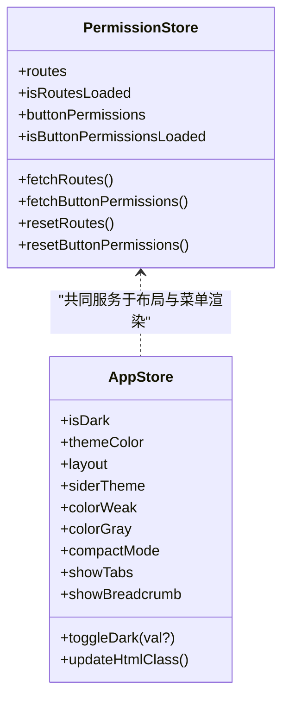
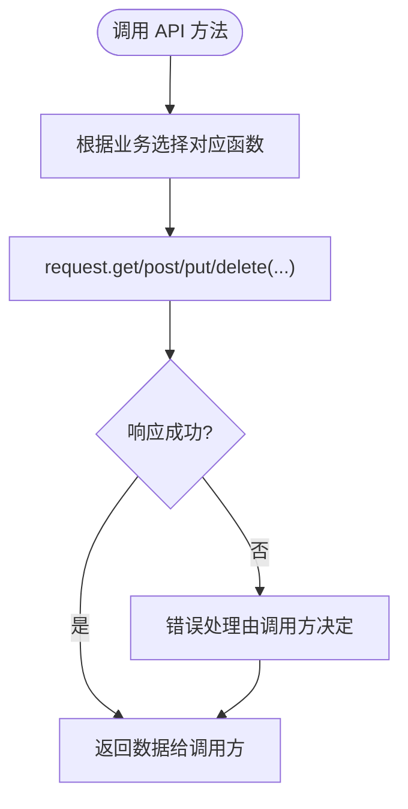
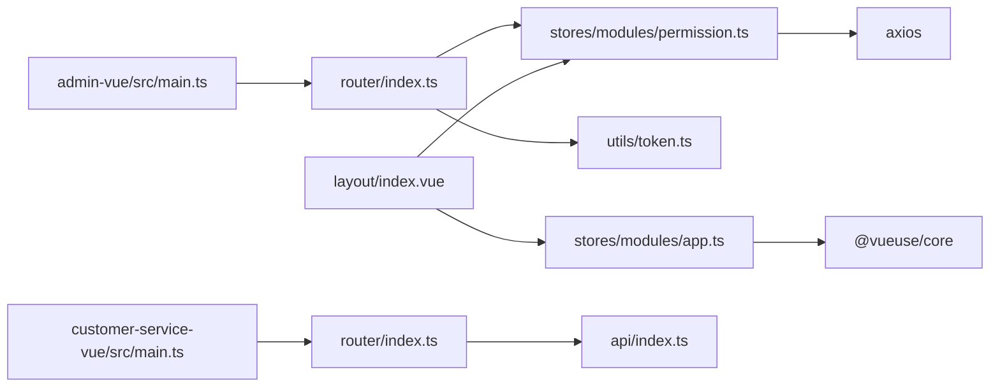

# 前端应用

<cite>
**本文引用的文件**
- [admin-vue/package.json](file://fast-ui/apps/admin-vue/package.json)
- [customer-service-vue/package.json](file://fast-ui/apps/customer-service-vue/package.json)
- [admin-vue/vite.config.ts](file://fast-ui/apps/admin-vue/vite.config.ts)
- [customer-service-vue/vite.config.ts](file://fast-ui/apps/customer-service-vue/vite.config.ts)
- [admin-vue/src/main.ts](file://fast-ui/apps/admin-vue/src/main.ts)
- [customer-service-vue/src/main.ts](file://fast-ui/apps/customer-service-vue/src/main.ts)
- [admin-vue/src/router/index.ts](file://fast-ui/apps/admin-vue/src/router/index.ts)
- [customer-service-vue/src/router/index.ts](file://fast-ui/apps/customer-service-vue/src/router/index.ts)
- [admin-vue/src/stores/index.ts](file://fast-ui/apps/admin-vue/src/stores/index.ts)
- [admin-vue/src/stores/modules/permission.ts](file://fast-ui/apps/admin-vue/src/stores/modules/permission.ts)
- [admin-vue/src/stores/modules/app.ts](file://fast-ui/apps/admin-vue/src/stores/modules/app.ts)
- [admin-vue/src/utils/token.ts](file://fast-ui/apps/admin-vue/src/utils/token.ts)
- [admin-vue/src/layout/index.vue](file://fast-ui/apps/admin-vue/src/layout/index.vue)
- [admin-vue/src/App.vue](file://fast-ui/apps/admin-vue/src/App.vue)
- [customer-service-vue/src/api/index.ts](file://fast-ui/apps/customer-service-vue/src/api/index.ts)
- [customer-service-vue/src/App.vue](file://fast-ui/apps/customer-service-vue/src/App.vue)
</cite>

## 目录
1. [简介](#简介)
2. [项目结构](#项目结构)
3. [核心组件](#核心组件)
4. [架构总览](#架构总览)
5. [详细组件分析](#详细组件分析)
6. [依赖关系分析](#依赖关系分析)
7. [性能考量](#性能考量)
8. [故障排查指南](#故障排查指南)
9. [结论](#结论)
10. [附录](#附录)

## 简介
本文件面向前端开发者，系统性梳理 Fast 项目的前端应用，重点覆盖管理端 Vue 应用与客服端 Vue 应用的架构设计、组件模式、路由与状态管理策略，并解释前后端分离的实现与 API 集成方式。文档同时给出组件库使用、UI 设计规范与响应式布局实现建议，以及开发最佳实践与性能优化技巧。

## 项目结构
- 采用多包工作区组织，管理端与客服端分别独立构建与运行，共享通用工具与配置。
- 管理端应用基于 Vue 3 + TypeScript + Vite + Pinia + Vue Router + Ant Design Vue。
- 客服端应用基于 Vue 3 + TypeScript + Vite + Pinia + Vue Router + Ant Design Vue，聚焦聊天与客服场景。
- 两套应用均通过 Vite 进行本地开发、代理后端服务与产物打包。

图表来源
- [admin-vue/src/main.ts](file://fast-ui/apps/admin-vue/src/main.ts#L1-L16)
- [admin-vue/src/router/index.ts](file://fast-ui/apps/admin-vue/src/router/index.ts#L1-L171)
- [admin-vue/src/stores/index.ts](file://fast-ui/apps/admin-vue/src/stores/index.ts#L1-L6)
- [admin-vue/src/stores/modules/permission.ts](file://fast-ui/apps/admin-vue/src/stores/modules/permission.ts#L1-L88)
- [admin-vue/src/stores/modules/app.ts](file://fast-ui/apps/admin-vue/src/stores/modules/app.ts#L1-L93)
- [admin-vue/src/layout/index.vue](file://fast-ui/apps/admin-vue/src/layout/index.vue#L1-L492)
- [admin-vue/src/utils/token.ts](file://fast-ui/apps/admin-vue/src/utils/token.ts#L1-L43)
- [customer-service-vue/src/main.ts](file://fast-ui/apps/customer-service-vue/src/main.ts#L1-L20)
- [customer-service-vue/src/router/index.ts](file://fast-ui/apps/customer-service-vue/src/router/index.ts#L1-L43)
- [customer-service-vue/src/api/index.ts](file://fast-ui/apps/customer-service-vue/src/api/index.ts#L1-L66)

章节来源
- [admin-vue/package.json](file://fast-ui/apps/admin-vue/package.json#L1-L50)
- [customer-service-vue/package.json](file://fast-ui/apps/customer-service-vue/package.json#L1-L29)
- [admin-vue/vite.config.ts](file://fast-ui/apps/admin-vue/vite.config.ts#L1-L56)
- [customer-service-vue/vite.config.ts](file://fast-ui/apps/customer-service-vue/vite.config.ts#L1-L37)

## 核心组件
- 应用入口与插件注册
  - 管理端：创建应用实例，挂载 Pinia、Router、Ant Design Vue；等待路由就绪后再挂载。
  - 客服端：创建应用实例，注册 Pinia、Router、Ant Design Vue，并全局注册图标组件。
- 路由系统
  - 管理端：静态路由 + 动态路由（后端下发），路由守卫负责鉴权、动态注入与页面标题设置。
  - 客服端：静态路由，包含首页、聊天、管理与 404。
- 状态管理
  - 管理端：Pinia Store 提供权限与按钮级权限、应用主题与布局、字典等能力。
  - 客服端：通过 API 模块封装业务接口。
- 布局与主题
  - 管理端：支持暗色、紧凑、色弱、灰色模式，支持多种布局与侧边栏风格，动态注入 CSS 变量。
- 组件库与工具
  - 管理端：Ant Design Vue、@ant-design/icons-vue、dayjs、axios、pinia、vue-router、@vueuse/core 等。
  - 客服端：Ant Design Vue、axios、pinia、vue-router、dayjs 等。

章节来源
- [admin-vue/src/main.ts](file://fast-ui/apps/admin-vue/src/main.ts#L1-L16)
- [customer-service-vue/src/main.ts](file://fast-ui/apps/customer-service-vue/src/main.ts#L1-L20)
- [admin-vue/src/router/index.ts](file://fast-ui/apps/admin-vue/src/router/index.ts#L1-L171)
- [customer-service-vue/src/router/index.ts](file://fast-ui/apps/customer-service-vue/src/router/index.ts#L1-L43)
- [admin-vue/src/stores/modules/permission.ts](file://fast-ui/apps/admin-vue/src/stores/modules/permission.ts#L1-L88)
- [admin-vue/src/stores/modules/app.ts](file://fast-ui/apps/admin-vue/src/stores/modules/app.ts#L1-L93)
- [customer-service-vue/src/api/index.ts](file://fast-ui/apps/customer-service-vue/src/api/index.ts#L1-L66)

## 架构总览
管理端与客服端分别独立运行，通过 Vite 开发服务器与反向代理对接后端服务。管理端采用“静态路由 + 动态路由”的混合模式，结合权限与按钮级权限，实现细粒度的页面与操作控制；客服端聚焦聊天与客服功能，路由与 API 相对简单。

图表来源
- [admin-vue/vite.config.ts](file://fast-ui/apps/admin-vue/vite.config.ts#L13-L19)
- [admin-vue/src/router/index.ts](file://fast-ui/apps/admin-vue/src/router/index.ts#L107-L159)

章节来源
- [admin-vue/vite.config.ts](file://fast-ui/apps/admin-vue/vite.config.ts#L1-L56)
- [customer-service-vue/vite.config.ts](file://fast-ui/apps/customer-service-vue/vite.config.ts#L1-L37)

## 详细组件分析

### 管理端应用

#### 应用入口与插件注册
- 创建应用实例，按顺序注册 Pinia、Router、Ant Design Vue。
- 等待路由就绪后再挂载，避免首屏闪烁或路由未初始化问题。

章节来源
- [admin-vue/src/main.ts](file://fast-ui/apps/admin-vue/src/main.ts#L1-L16)

#### 路由与权限
- 静态路由：登录、首页、个人中心、404。
- 动态路由：后端返回，经格式化后注入到路由表；路由守卫在首次访问时拉取动态路由并重新导航。
- 鉴权：通过 TokenService 检查登录状态；未登录访问受保护路由将跳转登录页。
- 页面标题：afterEach 钩子根据 meta.title 设置 document.title。

图表来源
- [admin-vue/src/router/index.ts](file://fast-ui/apps/admin-vue/src/router/index.ts#L107-L159)
- [admin-vue/src/stores/modules/permission.ts](file://fast-ui/apps/admin-vue/src/stores/modules/permission.ts#L29-L43)
- [admin-vue/src/utils/token.ts](file://fast-ui/apps/admin-vue/src/utils/token.ts#L29-L31)

章节来源
- [admin-vue/src/router/index.ts](file://fast-ui/apps/admin-vue/src/router/index.ts#L1-L171)
- [admin-vue/src/stores/modules/permission.ts](file://fast-ui/apps/admin-vue/src/stores/modules/permission.ts#L1-L88)
- [admin-vue/src/utils/token.ts](file://fast-ui/apps/admin-vue/src/utils/token.ts#L1-L43)

#### 状态管理（Pinia）
- 权限 Store：维护动态路由、按钮级权限，提供拉取与重置能力。
- 应用 Store：持久化主题、布局、侧边栏风格、可访问性模式与标签页/面包屑开关；动态更新 HTML 类与 CSS 变量。

图表来源
- [admin-vue/src/stores/modules/permission.ts](file://fast-ui/apps/admin-vue/src/stores/modules/permission.ts#L22-L87)
- [admin-vue/src/stores/modules/app.ts](file://fast-ui/apps/admin-vue/src/stores/modules/app.ts#L5-L92)

章节来源
- [admin-vue/src/stores/modules/permission.ts](file://fast-ui/apps/admin-vue/src/stores/modules/permission.ts#L1-L88)
- [admin-vue/src/stores/modules/app.ts](file://fast-ui/apps/admin-vue/src/stores/modules/app.ts#L1-L93)

#### 布局与主题
- 支持垂直、水平、分栏三种布局；侧边栏支持亮/暗两种风格。
- 主题：暗色、紧凑、色弱、灰色模式；动态注入 CSS 变量，支持实时切换。
- 响应式：移动端抽屉式侧边栏；窗口尺寸变化时自动切换折叠状态。

章节来源
- [admin-vue/src/layout/index.vue](file://fast-ui/apps/admin-vue/src/layout/index.vue#L1-L492)
- [admin-vue/src/App.vue](file://fast-ui/apps/admin-vue/src/App.vue#L1-L41)
- [admin-vue/src/stores/modules/app.ts](file://fast-ui/apps/admin-vue/src/stores/modules/app.ts#L29-L77)

#### 组件库与工具
- 组件库：Ant Design Vue + @ant-design/icons-vue。
- 工具：dayjs、axios、pinia、vue-router、@vueuse/core。
- 编译与类型：TypeScript、vue-tsc、@vitejs/plugin-vue。

章节来源
- [admin-vue/package.json](file://fast-ui/apps/admin-vue/package.json#L11-L40)

### 客服端应用

#### 应用入口与插件注册
- 注册 Pinia、Router、Ant Design Vue，并全局注册图标组件，便于模板中直接使用。

章节来源
- [customer-service-vue/src/main.ts](file://fast-ui/apps/customer-service-vue/src/main.ts#L1-L20)

#### 路由与页面
- 静态路由：首页、聊天、管理、404。
- 页面标题：beforeEach 根据 meta.title 设置 document.title。

章节来源
- [customer-service-vue/src/router/index.ts](file://fast-ui/apps/customer-service-vue/src/router/index.ts#L1-L43)

#### API 封装
- 聊天初始化、用户与配置的增删改查、WebSocket 域名与令牌获取等接口统一导出，便于视图层调用。

图表来源
- [customer-service-vue/src/api/index.ts](file://fast-ui/apps/customer-service-vue/src/api/index.ts#L1-L66)

章节来源
- [customer-service-vue/src/api/index.ts](file://fast-ui/apps/customer-service-vue/src/api/index.ts#L1-L66)

#### 组件库与工具
- 组件库：Ant Design Vue。
- 工具：axios、pinia、vue-router、dayjs。
- 编译与类型：TypeScript、vue-tsc、@vitejs/plugin-vue。

章节来源
- [customer-service-vue/package.json](file://fast-ui/apps/customer-service-vue/package.json#L11-L19)

## 依赖关系分析
- 管理端依赖
  - 路由与权限：router 依赖 permission store；permission store 依赖 axios 与 token。
  - 布局与主题：layout 依赖 app store 与 permission store；app store 依赖 @vueuse/core。
  - 插件：main.ts 依次注册 pinia、router、antd。
- 客服端依赖
  - 路由与 API：router 依赖 api；api 依赖 request（未在本文展开）。

图表来源
- [admin-vue/src/main.ts](file://fast-ui/apps/admin-vue/src/main.ts#L1-L16)
- [admin-vue/src/router/index.ts](file://fast-ui/apps/admin-vue/src/router/index.ts#L1-L171)
- [admin-vue/src/stores/modules/permission.ts](file://fast-ui/apps/admin-vue/src/stores/modules/permission.ts#L1-L88)
- [admin-vue/src/stores/modules/app.ts](file://fast-ui/apps/admin-vue/src/stores/modules/app.ts#L1-L93)
- [admin-vue/src/utils/token.ts](file://fast-ui/apps/admin-vue/src/utils/token.ts#L1-L43)
- [admin-vue/src/layout/index.vue](file://fast-ui/apps/admin-vue/src/layout/index.vue#L1-L492)
- [customer-service-vue/src/main.ts](file://fast-ui/apps/customer-service-vue/src/main.ts#L1-L20)
- [customer-service-vue/src/router/index.ts](file://fast-ui/apps/customer-service-vue/src/router/index.ts#L1-L43)
- [customer-service-vue/src/api/index.ts](file://fast-ui/apps/customer-service-vue/src/api/index.ts#L1-L66)

章节来源
- [admin-vue/src/main.ts](file://fast-ui/apps/admin-vue/src/main.ts#L1-L16)
- [customer-service-vue/src/main.ts](file://fast-ui/apps/customer-service-vue/src/main.ts#L1-L20)

## 性能考量
- 代码分割与资源命名
  - 管理端：自定义 Rollup 输出规则，区分 JS/CSS/静态资源命名，提升缓存命中率。
  - 客服端：自定义输出规则，图片与 CSS 分类存放，减少主包体积。
- 第三方库拆分
  - 管理端：手动拆分 vue 与 pinia 为独立 chunk，降低热更新影响面。
- 构建产物优化
  - 合理的 chunk 与文件命名策略有助于 CDN 缓存与懒加载。
- 建议
  - 对大组件进行异步加载；对图标与富文本编辑器等按需引入；合理使用 keep-alive 缓存页面。
  - 在生产环境开启压缩与 Tree Shaking；对 axios 请求进行超时与重试策略配置。

章节来源
- [admin-vue/vite.config.ts](file://fast-ui/apps/admin-vue/vite.config.ts#L26-L54)
- [customer-service-vue/vite.config.ts](file://fast-ui/apps/customer-service-vue/vite.config.ts#L17-L35)

## 故障排查指南
- 登录态异常
  - 检查 Token 是否存在于 localStorage；确认 TokenService 的 set/remove/clear 行为。
  - 若路由守卫拦截导致无法进入受保护页面，确认 hasToken 返回值与登录流程。
- 动态路由未生效
  - 确认 permission store 的 fetchRoutes 是否成功返回；formatAsyncRoutes 是否能匹配到对应视图组件。
  - 检查路由守卫中的 addRoute 与重新导航逻辑。
- 页面标题未更新
  - 确认路由 meta.title 是否设置；afterEach 钩子是否执行。
- 图标不显示
  - 客服端需在入口全局注册图标组件；确认图标名称与 @ant-design/icons-vue 的键一致。
- 开发代理失败
  - 确认 vite 代理配置指向正确的后端地址；网络连通性与 CORS 设置。

章节来源
- [admin-vue/src/utils/token.ts](file://fast-ui/apps/admin-vue/src/utils/token.ts#L1-L43)
- [admin-vue/src/router/index.ts](file://fast-ui/apps/admin-vue/src/router/index.ts#L107-L159)
- [admin-vue/src/stores/modules/permission.ts](file://fast-ui/apps/admin-vue/src/stores/modules/permission.ts#L29-L43)
- [customer-service-vue/src/main.ts](file://fast-ui/apps/customer-service-vue/src/main.ts#L15-L17)

## 结论
本项目前端采用模块化与多包工作区组织，管理端与客服端各司其职：前者强调权限与主题体系、动态路由与复杂布局，后者聚焦聊天与客服场景的简洁路由与 API 封装。通过 Vite、Pinia、Vue Router 与 Ant Design Vue 的组合，实现了良好的开发体验与可维护性。建议在后续迭代中持续完善权限与 API 的边界划分、增强错误处理与监控埋点，并进一步优化首屏与交互性能。

## 附录
- 开发命令
  - 管理端：dev/build/preview
  - 客服端：dev/build/preview
- 环境变量
  - 管理端：VITE_APP_TITLE、VITE_APP_LOGO 等用于页面标题与 Logo 配置。
- 代理配置
  - 管理端：/api 代理至 http://localhost:1230，便于联调后端接口。

章节来源
- [admin-vue/package.json](file://fast-ui/apps/admin-vue/package.json#L6-L10)
- [customer-service-vue/package.json](file://fast-ui/apps/customer-service-vue/package.json#L6-L10)
- [admin-vue/src/App.vue](file://fast-ui/apps/admin-vue/src/App.vue#L91-L92)
- [admin-vue/vite.config.ts](file://fast-ui/apps/admin-vue/vite.config.ts#L13-L19)