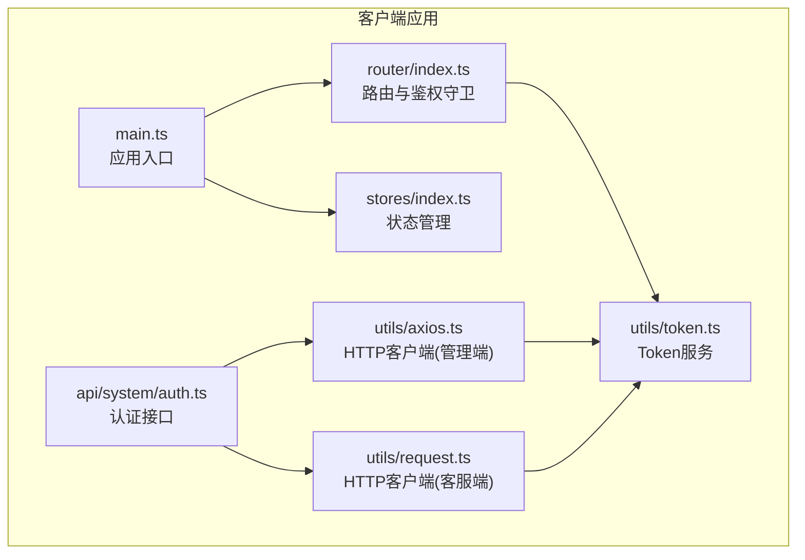
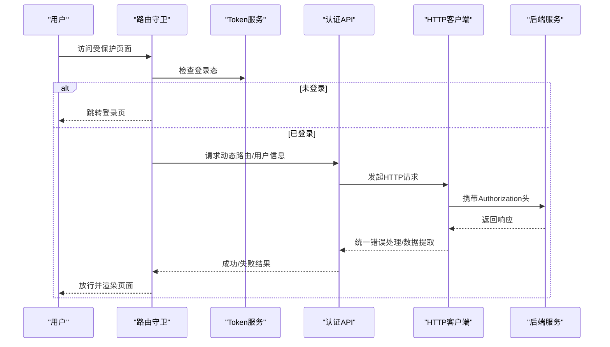
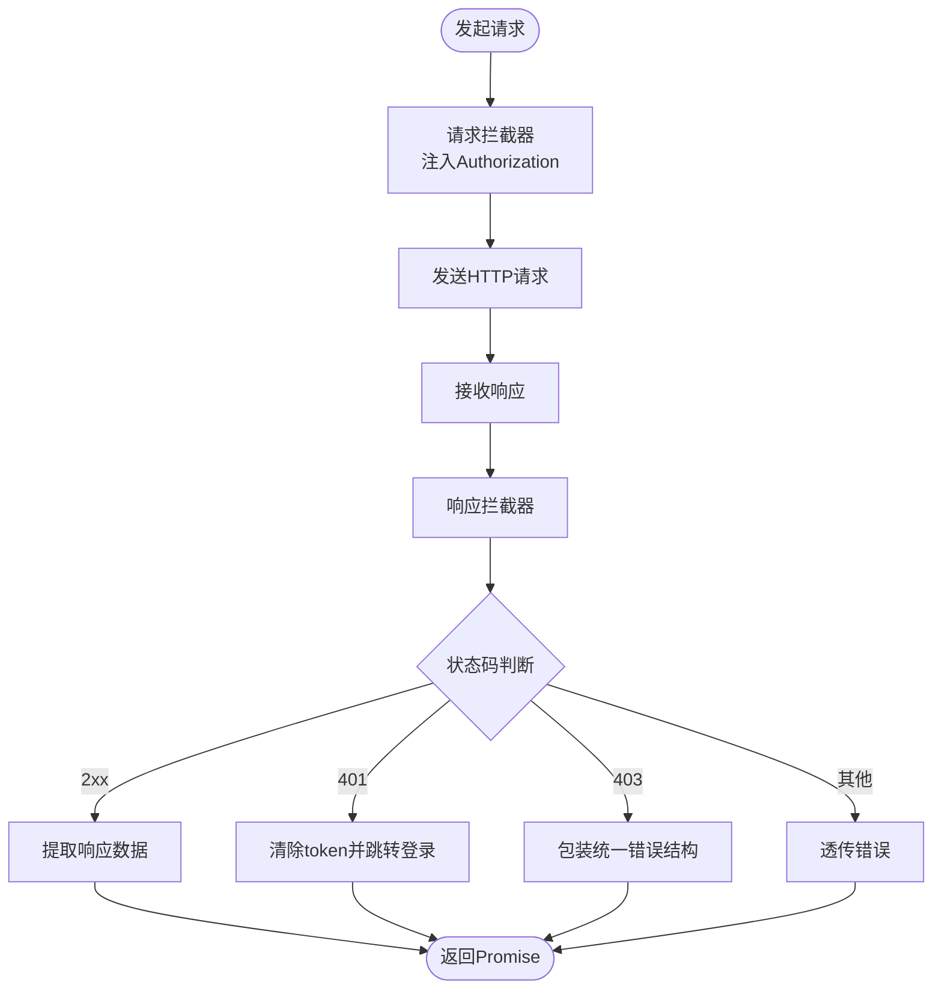
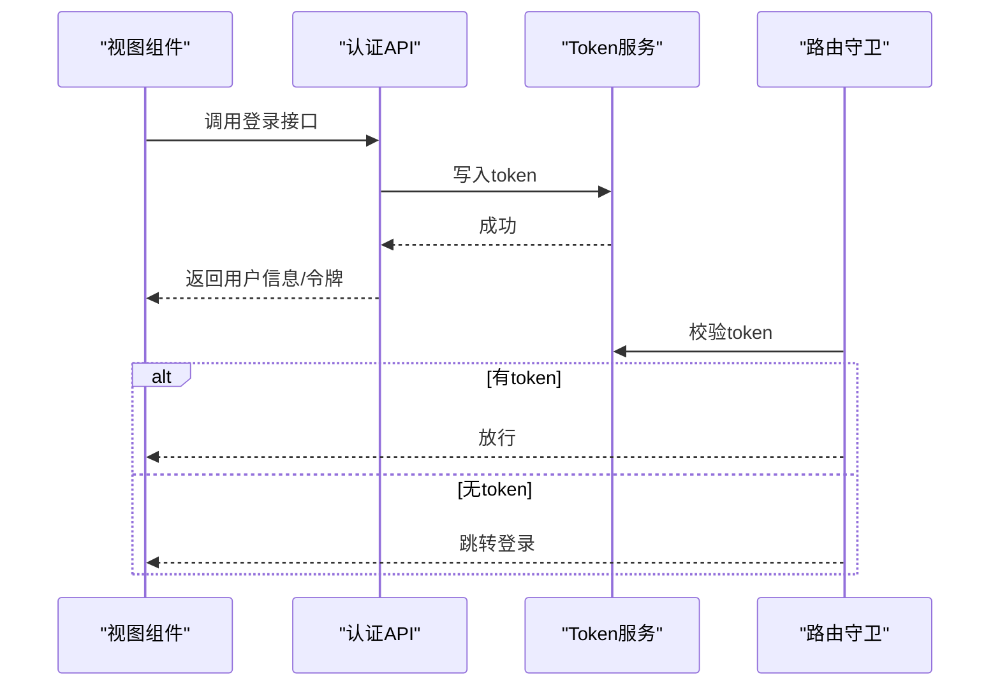
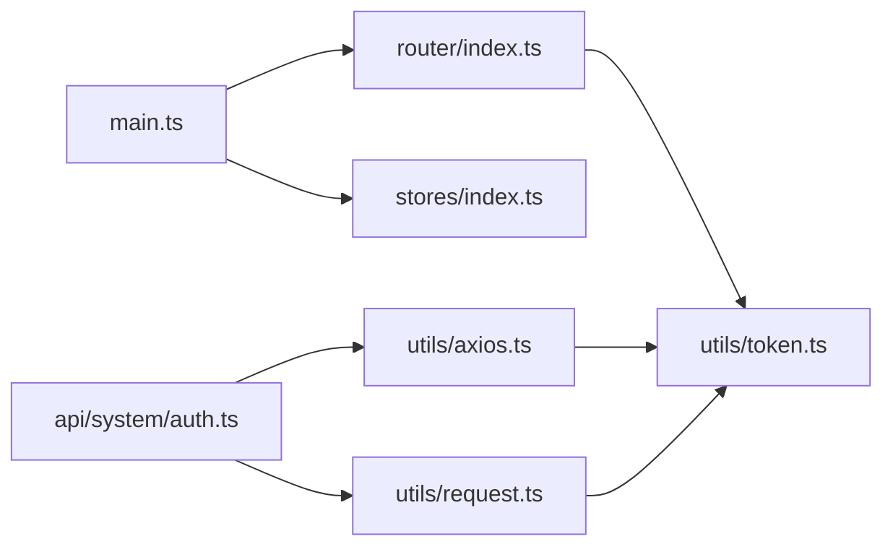

# API接口集成

<cite>
**本文引用的文件**
- [request.ts](file://fast-ui/apps/customer-service-vue/src/utils/request.ts)
- [axios.ts](file://fast-ui/apps/admin-vue/src/utils/axios.ts)
- [token.ts](file://fast-ui/apps/admin-vue/src/utils/token.ts)
- [auth.ts](file://fast-ui/apps/admin-vue/src/api/system/auth.ts)
- [index.ts](file://fast-ui/apps/admin-vue/src/router/index.ts)
- [.env.development](file://fast-ui/apps/admin-vue/.env.development)
- [main.ts](file://fast-ui/apps/admin-vue/src/main.ts)
- [index.ts](file://fast-ui/apps/admin-vue/src/stores/index.ts)
</cite>

## 目录
1. [简介](#简介)
2. [项目结构](#项目结构)
3. [核心组件](#核心组件)
4. [架构总览](#架构总览)
5. [详细组件分析](#详细组件分析)
6. [依赖关系分析](#依赖关系分析)
7. [性能考量](#性能考量)
8. [故障排查指南](#故障排查指南)
9. [结论](#结论)
10. [附录](#附录)

## 简介
本文件面向Vue客户端的API接口集成，系统性梳理HTTP客户端配置策略、请求与响应拦截器、统一错误处理与重试机制、认证token管理与自动刷新、并发控制与请求去重、缓存策略、API版本管理、接口文档与Mock支持、接口调试与网络监控、性能分析方法，并提供完整的集成指南与扩展开发建议。

## 项目结构
- 客户端采用Vite+Vue3+TypeScript技术栈，Axios作为HTTP客户端。
- API封装位于各业务模块的api目录，HTTP客户端位于utils目录，路由与状态管理分别在router与stores中。
- 开发环境通过Vite的.env配置API基础地址等参数。

**图表来源**
- [main.ts](file://fast-ui/apps/admin-vue/src/main.ts#L1-L16)
- [index.ts](file://fast-ui/apps/admin-vue/src/router/index.ts#L1-L171)
- [index.ts](file://fast-ui/apps/admin-vue/src/stores/index.ts#L1-L6)
- [axios.ts](file://fast-ui/apps/admin-vue/src/utils/axios.ts#L1-L60)
- [request.ts](file://fast-ui/apps/customer-service-vue/src/utils/request.ts#L1-L61)
- [token.ts](file://fast-ui/apps/admin-vue/src/utils/token.ts#L1-L43)
- [auth.ts](file://fast-ui/apps/admin-vue/src/api/system/auth.ts#L1-L64)

**章节来源**
- [main.ts](file://fast-ui/apps/admin-vue/src/main.ts#L1-L16)
- [index.ts](file://fast-ui/apps/admin-vue/src/router/index.ts#L1-L171)
- [index.ts](file://fast-ui/apps/admin-vue/src/stores/index.ts#L1-L6)

## 核心组件
- HTTP客户端
  - 管理端：基于Axios封装，启用大整数JSON解析、全局请求头注入、统一响应数据提取与错误处理。
  - 客服端：基于Axios封装，启用长整型保护的JSON解析、全局请求头注入、401自动登出。
- 认证与路由
  - TokenService提供本地存储的token增删查与登出跳转。
  - 路由守卫结合TokenService进行登录态校验与动态路由注入。
- API接口
  - 认证模块示例：登录、登出、获取验证码、获取用户信息等。

**章节来源**
- [axios.ts](file://fast-ui/apps/admin-vue/src/utils/axios.ts#L1-L60)
- [request.ts](file://fast-ui/apps/customer-service-vue/src/utils/request.ts#L1-L61)
- [token.ts](file://fast-ui/apps/admin-vue/src/utils/token.ts#L1-L43)
- [auth.ts](file://fast-ui/apps/admin-vue/src/api/system/auth.ts#L1-L64)
- [index.ts](file://fast-ui/apps/admin-vue/src/router/index.ts#L107-L159)

## 架构总览
客户端整体以“路由守卫 + Token服务 + HTTP客户端 + API模块”的方式组织，形成清晰的职责边界与可扩展点。

**图表来源**
- [index.ts](file://fast-ui/apps/admin-vue/src/router/index.ts#L107-L159)
- [token.ts](file://fast-ui/apps/admin-vue/src/utils/token.ts#L1-L43)
- [auth.ts](file://fast-ui/apps/admin-vue/src/api/system/auth.ts#L1-L64)
- [axios.ts](file://fast-ui/apps/admin-vue/src/utils/axios.ts#L1-L60)

## 详细组件分析

### HTTP客户端配置与拦截器
- 基础配置
  - 基础URL来自环境变量，超时时间统一设置。
  - 响应解析策略：管理端使用大整数安全解析；客服端对长整型进行字符串包裹后再解析，避免精度丢失。
- 请求拦截器
  - 自动从Token服务或localStorage读取token并注入Authorization头。
- 响应拦截器
  - 管理端：统一提取response.data，401清理token并跳转登录，403返回统一错误结构。
  - 客服端：401清理token并跳转登录，其他错误透传。

**图表来源**
- [axios.ts](file://fast-ui/apps/admin-vue/src/utils/axios.ts#L25-L54)
- [request.ts](file://fast-ui/apps/customer-service-vue/src/utils/request.ts#L35-L55)

**章节来源**
- [axios.ts](file://fast-ui/apps/admin-vue/src/utils/axios.ts#L8-L57)
- [request.ts](file://fast-ui/apps/customer-service-vue/src/utils/request.ts#L27-L58)

### 认证与Token管理
- Token存储与读取
  - 使用localStorage保存token键值，提供set/get/remove/has/clearAndRedirect等操作。
- 登录流程
  - 调用认证API提交用户名、密码、验证码等，成功后写入token。
- 路由守卫联动
  - 在导航前检查登录态，未登录则跳转登录页；已登录则允许访问受保护路由。

**图表来源**
- [auth.ts](file://fast-ui/apps/admin-vue/src/api/system/auth.ts#L29-L63)
- [token.ts](file://fast-ui/apps/admin-vue/src/utils/token.ts#L1-L43)
- [index.ts](file://fast-ui/apps/admin-vue/src/router/index.ts#L107-L159)

**章节来源**
- [token.ts](file://fast-ui/apps/admin-vue/src/utils/token.ts#L1-L43)
- [auth.ts](file://fast-ui/apps/admin-vue/src/api/system/auth.ts#L1-L64)
- [index.ts](file://fast-ui/apps/admin-vue/src/router/index.ts#L107-L159)

### API接口统一管理与错误处理
- 统一管理
  - 按业务域划分API模块，如system、message、ratelimit等，便于维护与扩展。
- 错误处理
  - 401：统一清空token并跳转登录。
  - 403：返回统一错误结构，前端可直接消费。
  - 其他错误：透传至调用方，由上层逻辑决定处理策略。
- 重试机制
  - 当前实现未内置自动重试，可在业务层按需引入指数退避重试策略或基于业务场景的条件重试。

**章节来源**
- [axios.ts](file://fast-ui/apps/admin-vue/src/utils/axios.ts#L36-L54)
- [request.ts](file://fast-ui/apps/customer-service-vue/src/utils/request.ts#L46-L55)

### 并发控制、请求去重与缓存策略
- 并发控制
  - 可通过在调用层引入队列或信号量限制同时请求数量，避免过度并发导致的资源争用。
- 请求去重
  - 基于请求URL与参数生成唯一key，利用Map缓存正在执行的请求，重复请求直接复用结果。
- 缓存策略
  - 对只读列表/字典类接口可采用内存缓存，结合TTL或手动失效策略。
  - 对写操作保持不缓存，确保数据一致性。

[本节为通用实践建议，不直接分析具体文件，故无章节来源]

### API版本管理、接口文档与Mock支持
- 版本管理
  - 建议在baseURL中加入版本前缀（如/v1），或通过自定义Header传递版本号，便于灰度与平滑升级。
- 接口文档
  - 建议配合Swagger或OpenAPI导出接口契约，前端按契约生成类型与调用封装。
- Mock支持
  - 开发阶段可使用Vite的proxy或独立mock服务，前端切换环境变量即可无缝切换。

[本节为通用实践建议，不直接分析具体文件，故无章节来源]

### 接口调试工具、网络监控与性能分析
- 调试工具
  - 浏览器Network面板观察请求头、响应体与耗时；结合Vuex/Pinia Devtools观察状态变化。
- 网络监控
  - 在拦截器中埋点统计请求耗时、成功率、错误类型，上报至监控平台。
- 性能分析
  - 关注首屏路由懒加载、组件异步加载、图片与静态资源优化，结合Vite构建产物分析。

[本节为通用实践建议，不直接分析具体文件，故无章节来源]

## 依赖关系分析
- 应用入口依赖路由与状态管理；路由守卫依赖Token服务；认证API依赖HTTP客户端；HTTP客户端依赖Token服务与路由。
- 组件耦合度低，职责清晰，便于扩展与测试。

**图表来源**
- [main.ts](file://fast-ui/apps/admin-vue/src/main.ts#L1-L16)
- [index.ts](file://fast-ui/apps/admin-vue/src/router/index.ts#L1-L171)
- [index.ts](file://fast-ui/apps/admin-vue/src/stores/index.ts#L1-L6)
- [token.ts](file://fast-ui/apps/admin-vue/src/utils/token.ts#L1-L43)
- [auth.ts](file://fast-ui/apps/admin-vue/src/api/system/auth.ts#L1-L64)
- [axios.ts](file://fast-ui/apps/admin-vue/src/utils/axios.ts#L1-L60)
- [request.ts](file://fast-ui/apps/customer-service-vue/src/utils/request.ts#L1-L61)

**章节来源**
- [main.ts](file://fast-ui/apps/admin-vue/src/main.ts#L1-L16)
- [index.ts](file://fast-ui/apps/admin-vue/src/router/index.ts#L1-L171)
- [index.ts](file://fast-ui/apps/admin-vue/src/stores/index.ts#L1-L6)
- [token.ts](file://fast-ui/apps/admin-vue/src/utils/token.ts#L1-L43)
- [auth.ts](file://fast-ui/apps/admin-vue/src/api/system/auth.ts#L1-L64)
- [axios.ts](file://fast-ui/apps/admin-vue/src/utils/axios.ts#L1-L60)
- [request.ts](file://fast-ui/apps/customer-service-vue/src/utils/request.ts#L1-L61)

## 性能考量
- 请求超时与重试
  - 合理设置timeout；对弱网环境引入重试与退避策略，避免频繁失败。
- 响应解析
  - 管理端使用大整数安全解析，客服端对长整型做字符串包裹再解析，避免精度问题。
- 资源优化
  - 图片与静态资源命名含哈希，构建时分包与懒加载，减少首屏体积。

[本节为通用实践建议，不直接分析具体文件，故无章节来源]

## 故障排查指南
- 401未登录
  - 检查Token服务是否正确写入/移除token；确认拦截器是否注入Authorization头；核对后端签发与刷新策略。
- 403无权限
  - 检查后端权限配置与角色映射；前端统一错误提示与日志上报。
- 跨域与基础URL
  - 核对开发环境.env中的VITE_API_BASE_URL；确认CORS配置与代理规则。
- 路由跳转异常
  - 检查路由守卫逻辑与动态路由注入时机；确认Token状态与redirect参数传递。

**章节来源**
- [axios.ts](file://fast-ui/apps/admin-vue/src/utils/axios.ts#L38-L53)
- [request.ts](file://fast-ui/apps/customer-service-vue/src/utils/request.ts#L48-L54)
- [.env.development](file://fast-ui/apps/admin-vue/.env.development#L1-L9)
- [index.ts](file://fast-ui/apps/admin-vue/src/router/index.ts#L107-L159)

## 结论
本项目在Vue客户端侧提供了清晰的HTTP客户端封装、完善的认证与路由守卫、统一的错误处理与响应解析策略。建议后续补充自动重试、请求去重与缓存、版本化API管理、接口文档与Mock支持、网络监控与性能分析能力，以进一步提升稳定性与可维护性。

## 附录
- 环境变量
  - VITE_API_BASE_URL：后端服务基础URL。
  - VITE_DEFAULT_USERNAME/VITE_DEFAULT_PASSWORD：默认登录凭据（开发环境）。
  - VITE_APP_TITLE：应用标题。

**章节来源**
- [.env.development](file://fast-ui/apps/admin-vue/.env.development#L1-L9)