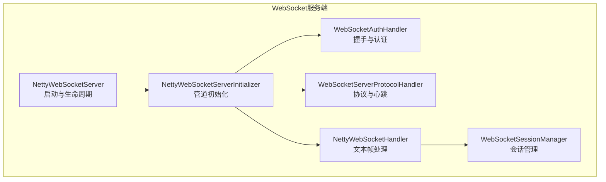
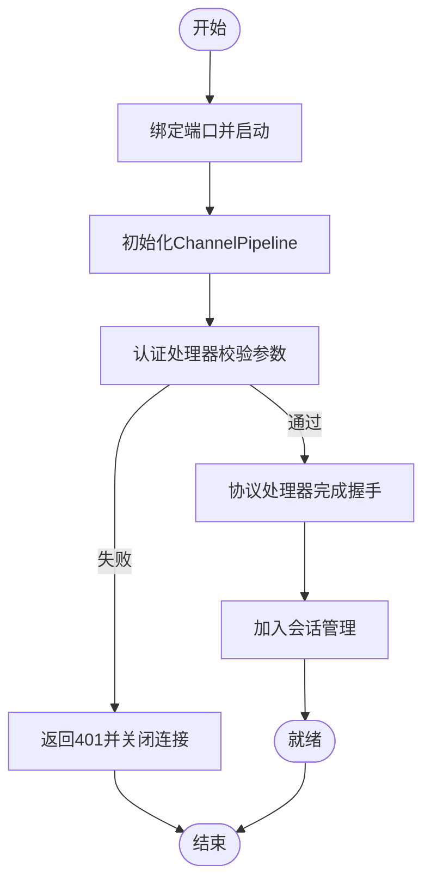
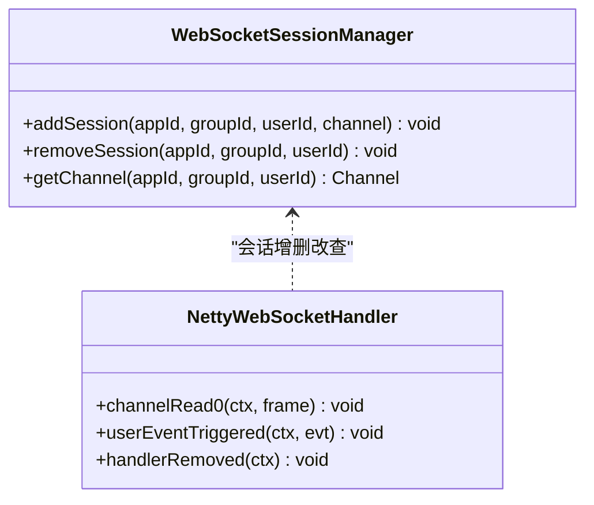
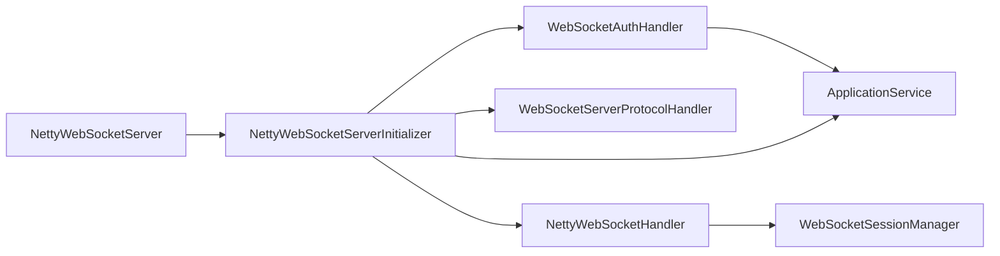

# WebSocket通信

<cite>
**本文引用的文件**
- [websocket/src/main/java/com/fastproject/netty/NettyWebSocketServer.java](file://websocket/src/main/java/com/fastproject/netty/NettyWebSocketServer.java)
- [websocket/src/main/java/com/fastproject/netty/NettyWebSocketServerInitializer.java](file://websocket/src/main/java/com/fastproject/netty/NettyWebSocketServerInitializer.java)
- [websocket/src/main/java/com/fastproject/netty/NettyWebSocketHandler.java](file://websocket/src/main/java/com/fastproject/netty/NettyWebSocketHandler.java)
- [websocket/src/main/java/com/fastproject/netty/WebSocketSessionManager.java](file://websocket/src/main/java/com/fastproject/netty/WebSocketSessionManager.java)
- [websocket/src/main/java/com/fastproject/netty/WebSocketAuthHandler.java](file://websocket/src/main/java/com/fastproject/netty/WebSocketAuthHandler.java)
- [websocket/src/main/resources/application.yml](file://websocket/src/main/resources/application.yml)
</cite>

## 目录
1. [简介](#简介)
2. [项目结构](#项目结构)
3. [核心组件](#核心组件)
4. [架构总览](#架构总览)
5. [详细组件分析](#详细组件分析)
6. [依赖关系分析](#依赖关系分析)
7. [性能考虑](#性能考虑)
8. [故障排除指南](#故障排除指南)
9. [结论](#结论)
10. [附录](#附录)

## 简介
本文件面向使用 Vue 客户端与后端 WebSocket 服务进行实时通信的开发者，系统性梳理了基于 Netty 的 WebSocket 服务端实现，覆盖连接建立流程、握手与认证、消息编解码、会话管理、异常与断线处理等主题。同时给出客户端集成建议与性能优化要点，帮助快速落地稳定可靠的实时通信能力。

## 项目结构
后端 WebSocket 服务位于 websocket 模块，采用 Netty 实现，核心文件包括服务启动、管道初始化、认证、业务处理与会话管理等。



图表来源
- [websocket/src/main/java/com/fastproject/netty/NettyWebSocketServer.java](file://websocket/src/main/java/com/fastproject/netty/NettyWebSocketServer.java#L24-L101)
- [websocket/src/main/java/com/fastproject/netty/NettyWebSocketServerInitializer.java](file://websocket/src/main/java/com/fastproject/netty/NettyWebSocketServerInitializer.java#L19-L53)
- [websocket/src/main/java/com/fastproject/netty/WebSocketAuthHandler.java](file://websocket/src/main/java/com/fastproject/netty/WebSocketAuthHandler.java#L20-L95)
- [websocket/src/main/java/com/fastproject/netty/NettyWebSocketHandler.java](file://websocket/src/main/java/com/fastproject/netty/NettyWebSocketHandler.java#L13-L81)
- [websocket/src/main/java/com/fastproject/netty/WebSocketSessionManager.java](file://websocket/src/main/java/com/fastproject/netty/WebSocketSessionManager.java#L13-L62)

章节来源
- [websocket/src/main/java/com/fastproject/netty/NettyWebSocketServer.java](file://websocket/src/main/java/com/fastproject/netty/NettyWebSocketServer.java#L24-L101)
- [websocket/src/main/java/com/fastproject/netty/NettyWebSocketServerInitializer.java](file://websocket/src/main/java/com/fastproject/netty/NettyWebSocketServerInitializer.java#L19-L53)
- [websocket/src/main/resources/application.yml](file://websocket/src/main/resources/application.yml#L1-L28)

## 核心组件
- NettyWebSocketServer：负责服务启动与优雅关闭，使用独立线程避免阻塞主容器线程。
- NettyWebSocketServerInitializer：构建 ChannelPipeline，按序添加 HTTP 编解码、聚合、认证、协议升级与业务处理器。
- WebSocketAuthHandler：解析握手参数（appId、token、userId、groupId），调用应用服务进行鉴权回调，并将认证信息写入 Channel 属性。
- WebSocketServerProtocolHandler：完成 WebSocket 握手、心跳 Ping/Pong、控制帧处理。
- NettyWebSocketHandler：处理文本帧消息、握手完成事件与连接移除事件，维护会话。
- WebSocketSessionManager：基于并发 Map 的会话存储，按 appId:groupId:userId 唯一标识用户会话。

章节来源
- [websocket/src/main/java/com/fastproject/netty/NettyWebSocketServer.java](file://websocket/src/main/java/com/fastproject/netty/NettyWebSocketServer.java#L24-L101)
- [websocket/src/main/java/com/fastproject/netty/NettyWebSocketServerInitializer.java](file://websocket/src/main/java/com/fastproject/netty/NettyWebSocketServerInitializer.java#L19-L53)
- [websocket/src/main/java/com/fastproject/netty/WebSocketAuthHandler.java](file://websocket/src/main/java/com/fastproject/netty/WebSocketAuthHandler.java#L20-L104)
- [websocket/src/main/java/com/fastproject/netty/NettyWebSocketHandler.java](file://websocket/src/main/java/com/fastproject/netty/NettyWebSocketHandler.java#L13-L81)
- [websocket/src/main/java/com/fastproject/netty/WebSocketSessionManager.java](file://websocket/src/main/java/com/fastproject/netty/WebSocketSessionManager.java#L13-L62)

## 架构总览
WebSocket 服务端整体工作流如下：

```mermaid
sequenceDiagram
participant C as "客户端"
participant S as "NettyWebSocketServer"
participant P as "Pipeline"
participant A as "WebSocketAuthHandler"
participant R as "WebSocketServerProtocolHandler"
participant H as "NettyWebSocketHandler"
participant M as "WebSocketSessionManager"
C->>S : "TCP连接建立"
S->>P : "initChannel()"
P->>A : "HTTP请求进入"
A->>A : "解析参数与鉴权回调"
A-->>R : "通过鉴权后放行"
R-->>C : "完成WebSocket握手"
H->>M : "握手完成后加入会话"
C->>H : "发送文本消息"
H-->>C : "回显/业务响应"
C--/C : "断开连接"
H->>M : "handlerRemoved时移除会话"
```

图表来源
- [websocket/src/main/java/com/fastproject/netty/NettyWebSocketServer.java](file://websocket/src/main/java/com/fastproject/netty/NettyWebSocketServer.java#L54-L84)
- [websocket/src/main/java/com/fastproject/netty/NettyWebSocketServerInitializer.java](file://websocket/src/main/java/com/fastproject/netty/NettyWebSocketServerInitializer.java#L29-L53)
- [websocket/src/main/java/com/fastproject/netty/WebSocketAuthHandler.java](file://websocket/src/main/java/com/fastproject/netty/WebSocketAuthHandler.java#L31-L95)
- [websocket/src/main/java/com/fastproject/netty/NettyWebSocketHandler.java](file://websocket/src/main/java/com/fastproject/netty/NettyWebSocketHandler.java#L37-L67)
- [websocket/src/main/java/com/fastproject/netty/WebSocketSessionManager.java](file://websocket/src/main/java/com/fastproject/netty/WebSocketSessionManager.java#L30-L50)

## 详细组件分析

### 连接建立与握手流程
- 服务端通过 ServerBootstrap 在独立线程启动，绑定端口并阻塞等待关闭。
- 初始化器按顺序添加编解码器与处理器，确保 HTTP 握手后再升级为 WebSocket。
- 认证处理器在 HTTP 阶段完成鉴权，通过后放行至协议处理器完成升级。
- 握手完成后触发 userEventTriggered，将 Channel 写入会话管理器。



图表来源
- [websocket/src/main/java/com/fastproject/netty/NettyWebSocketServer.java](file://websocket/src/main/java/com/fastproject/netty/NettyWebSocketServer.java#L54-L84)
- [websocket/src/main/java/com/fastproject/netty/NettyWebSocketServerInitializer.java](file://websocket/src/main/java/com/fastproject/netty/NettyWebSocketServerInitializer.java#L29-L53)
- [websocket/src/main/java/com/fastproject/netty/WebSocketAuthHandler.java](file://websocket/src/main/java/com/fastproject/netty/WebSocketAuthHandler.java#L31-L95)
- [websocket/src/main/java/com/fastproject/netty/NettyWebSocketHandler.java](file://websocket/src/main/java/com/fastproject/netty/NettyWebSocketHandler.java#L37-L51)

章节来源
- [websocket/src/main/java/com/fastproject/netty/NettyWebSocketServer.java](file://websocket/src/main/java/com/fastproject/netty/NettyWebSocketServer.java#L54-L84)
- [websocket/src/main/java/com/fastproject/netty/NettyWebSocketServerInitializer.java](file://websocket/src/main/java/com/fastproject/netty/NettyWebSocketServerInitializer.java#L29-L53)
- [websocket/src/main/java/com/fastproject/netty/WebSocketAuthHandler.java](file://websocket/src/main/java/com/fastproject/netty/WebSocketAuthHandler.java#L31-L95)
- [websocket/src/main/java/com/fastproject/netty/NettyWebSocketHandler.java](file://websocket/src/main/java/com/fastproject/netty/NettyWebSocketHandler.java#L37-L51)

### 心跳检测机制
- 使用 WebSocketServerProtocolHandler 自动处理 Ping/Pong 控制帧，维持连接活性。
- 应用层无需额外心跳逻辑即可保持长连接稳定。

章节来源
- [websocket/src/main/java/com/fastproject/netty/NettyWebSocketServerInitializer.java](file://websocket/src/main/java/com/fastproject/netty/NettyWebSocketServerInitializer.java#L46-L49)

### 断线重连策略
- 客户端应实现指数退避与最大重试次数的重连策略。
- 服务端异常捕获会主动关闭异常通道，handlerRemoved 触发会自动清理会话，避免僵尸连接。

章节来源
- [websocket/src/main/java/com/fastproject/netty/NettyWebSocketHandler.java](file://websocket/src/main/java/com/fastproject/netty/NettyWebSocketHandler.java#L74-L80)

### 消息格式设计与编解码
- 传输层：使用 TextWebSocketFrame 进行文本消息传输。
- 应用层：建议统一消息格式（如 JSON），包含消息类型、数据体、时间戳、签名等字段，便于客户端解析与服务端路由。
- 编解码：在 Netty 侧可扩展自定义编码器/解码器，或在业务处理器中进行字符串解析与对象转换。

章节来源
- [websocket/src/main/java/com/fastproject/netty/NettyWebSocketHandler.java](file://websocket/src/main/java/com/fastproject/netty/NettyWebSocketHandler.java#L21-L31)

### 实时消息推送与会话管理
- 会话键：appId:groupId:userId，确保唯一性与可定位性。
- 上线：握手完成后将 Channel 写入会话表。
- 下线：连接移除时从会话表移除。
- 推送：根据目标键查找 Channel 并发送消息。



图表来源
- [websocket/src/main/java/com/fastproject/netty/WebSocketSessionManager.java](file://websocket/src/main/java/com/fastproject/netty/WebSocketSessionManager.java#L13-L62)
- [websocket/src/main/java/com/fastproject/netty/NettyWebSocketHandler.java](file://websocket/src/main/java/com/fastproject/netty/NettyWebSocketHandler.java#L13-L81)

章节来源
- [websocket/src/main/java/com/fastproject/netty/WebSocketSessionManager.java](file://websocket/src/main/java/com/fastproject/netty/WebSocketSessionManager.java#L13-L62)
- [websocket/src/main/java/com/fastproject/netty/NettyWebSocketHandler.java](file://websocket/src/main/java/com/fastproject/netty/NettyWebSocketHandler.java#L37-L67)

### 连接状态管理与异常处理
- 状态事件：握手完成、连接移除、异常捕获。
- 异常处理：exceptionCaught 中记录错误并关闭通道，确保资源回收与会话清理。

章节来源
- [websocket/src/main/java/com/fastproject/netty/NettyWebSocketHandler.java](file://websocket/src/main/java/com/fastproject/netty/NettyWebSocketHandler.java#L37-L80)

### 安全认证与权限验证
- 握手参数：appId、token、userId、groupId。
- 认证流程：解析参数后调用应用服务进行鉴权回调，通过后放行握手。
- 权限维度：groupId 可用于房间/群组级权限控制；userId 用于用户级权限控制。

章节来源
- [websocket/src/main/java/com/fastproject/netty/WebSocketAuthHandler.java](file://websocket/src/main/java/com/fastproject/netty/WebSocketAuthHandler.java#L31-L95)

### 消息队列与去重机制（建议）
- 队列：可引入内存队列（如并发队列）暂存待推送消息，异步批量发送。
- 去重：对消息 ID 或内容摘要进行去重，避免重复消息到达客户端。
- 注意：当前仓库未实现消息队列与去重逻辑，建议在业务层补充。

[本节为概念性建议，不直接分析具体文件]

### 加密传输（建议）
- TLS：在生产环境启用 WSS（WebSocket Secure），在服务端配置证书与 TLS 参数。
- 密钥协商：结合后端提供的密钥接口进行握手前的密钥交换（如 SM2/SM4）。
- 注意：当前仓库未实现加密传输逻辑，建议在服务端与客户端分别增加相应处理。

[本节为概念性建议，不直接分析具体文件]

## 依赖关系分析
- NettyWebSocketServer 依赖 ApplicationService 与配置（端口、路径）。
- NettyWebSocketServerInitializer 依赖 ApplicationService 与握手路径。
- WebSocketAuthHandler 依赖 ApplicationService 与 HTTP 工具类。
- NettyWebSocketHandler 依赖 WebSocketSessionManager。
- 会话管理器为纯内存 Map，无外部依赖。



图表来源
- [websocket/src/main/java/com/fastproject/netty/NettyWebSocketServer.java](file://websocket/src/main/java/com/fastproject/netty/NettyWebSocketServer.java#L41-L49)
- [websocket/src/main/java/com/fastproject/netty/NettyWebSocketServerInitializer.java](file://websocket/src/main/java/com/fastproject/netty/NettyWebSocketServerInitializer.java#L21-L27)
- [websocket/src/main/java/com/fastproject/netty/WebSocketAuthHandler.java](file://websocket/src/main/java/com/fastproject/netty/WebSocketAuthHandler.java#L25-L29)
- [websocket/src/main/java/com/fastproject/netty/NettyWebSocketHandler.java](file://websocket/src/main/java/com/fastproject/netty/NettyWebSocketHandler.java#L13-L14)

章节来源
- [websocket/src/main/java/com/fastproject/netty/NettyWebSocketServer.java](file://websocket/src/main/java/com/fastproject/netty/NettyWebSocketServer.java#L41-L49)
- [websocket/src/main/java/com/fastproject/netty/NettyWebSocketServerInitializer.java](file://websocket/src/main/java/com/fastproject/netty/NettyWebSocketServerInitializer.java#L21-L27)
- [websocket/src/main/java/com/fastproject/netty/WebSocketAuthHandler.java](file://websocket/src/main/java/com/fastproject/netty/WebSocketAuthHandler.java#L25-L29)
- [websocket/src/main/java/com/fastproject/netty/NettyWebSocketHandler.java](file://websocket/src/main/java/com/fastproject/netty/NettyWebSocketHandler.java#L13-L14)

## 性能考虑
- 线程模型：使用 NIO EventLoopGroup，合理设置 boss/worker 线程数以匹配 CPU 核心数。
- 聚合大小：HttpObjectAggregator 的聚合阈值需根据消息体量调整，避免过大导致内存占用过高。
- 会话规模：并发 Map 查询为 O(1)，适合高并发场景；注意键空间增长带来的内存压力。
- 批量推送：对同一批消息进行合并发送，减少网络往返与系统调用次数。
- 资源清理：异常与断开均需确保 Channel 关闭与会话移除，防止资源泄漏。

[本节提供通用指导，不直接分析具体文件]

## 故障排除指南
- 握手失败
  - 检查 appId 是否存在与有效。
  - 核对鉴权回调地址与返回码是否为 200。
  - 确认握手路径与端口配置一致。
- 连接频繁断开
  - 检查客户端 Ping/Pong 是否正常，服务端日志是否存在异常。
  - 确认网络稳定性与防火墙策略。
- 消息未送达
  - 核对会话键（appId:groupId:userId）是否正确。
  - 检查会话是否已过期或被移除。
- 性能问题
  - 调整聚合阈值与线程池大小。
  - 分析是否存在大量小包导致的 CPU 开销。

章节来源
- [websocket/src/main/java/com/fastproject/netty/WebSocketAuthHandler.java](file://websocket/src/main/java/com/fastproject/netty/WebSocketAuthHandler.java#L42-L69)
- [websocket/src/main/java/com/fastproject/netty/NettyWebSocketHandler.java](file://websocket/src/main/java/com/fastproject/netty/NettyWebSocketHandler.java#L74-L80)
- [websocket/src/main/resources/application.yml](file://websocket/src/main/resources/application.yml#L1-L28)

## 结论
该 WebSocket 服务端以 Netty 为核心，实现了标准的握手、认证、心跳与消息处理流程，并提供了简洁的会话管理。结合本文的客户端集成建议与性能优化要点，可在保证稳定性的同时提升实时通信体验。对于消息队列、去重、加密与权限细化等高级特性，建议在业务层逐步增强。

## 附录
- 配置项参考
  - netty.websocket.port：监听端口
  - netty.websocket.path：握手路径
- 建议的客户端集成步骤
  - 读取后端配置，构造 ws/wss 地址与握手参数。
  - 实现重连与退避策略。
  - 统一消息格式与编解码。
  - 在连接建立后订阅对应 groupId 的消息。
  - 处理异常与断线事件，及时清理本地状态。

章节来源
- [websocket/src/main/resources/application.yml](file://websocket/src/main/resources/application.yml#L1-L28)