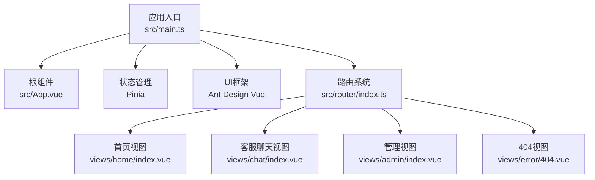
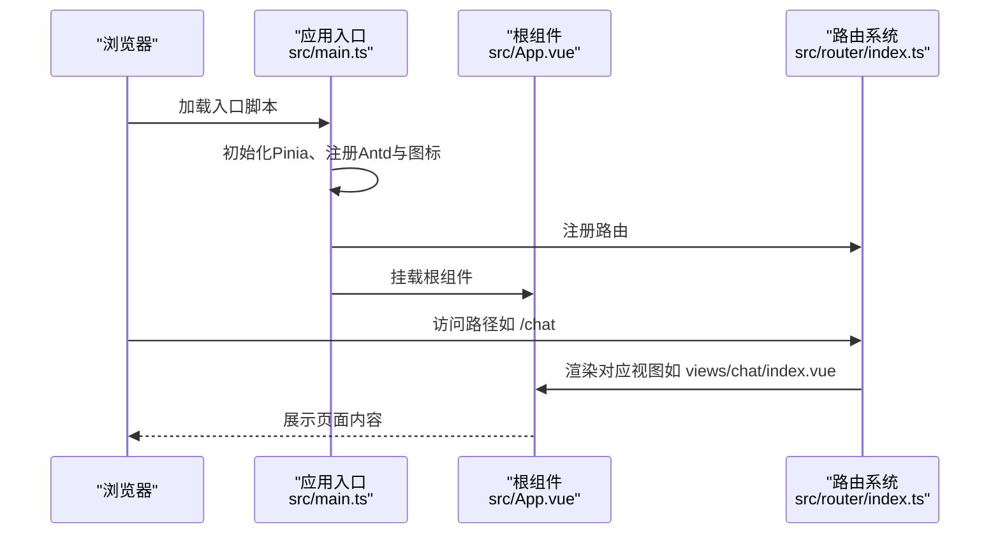
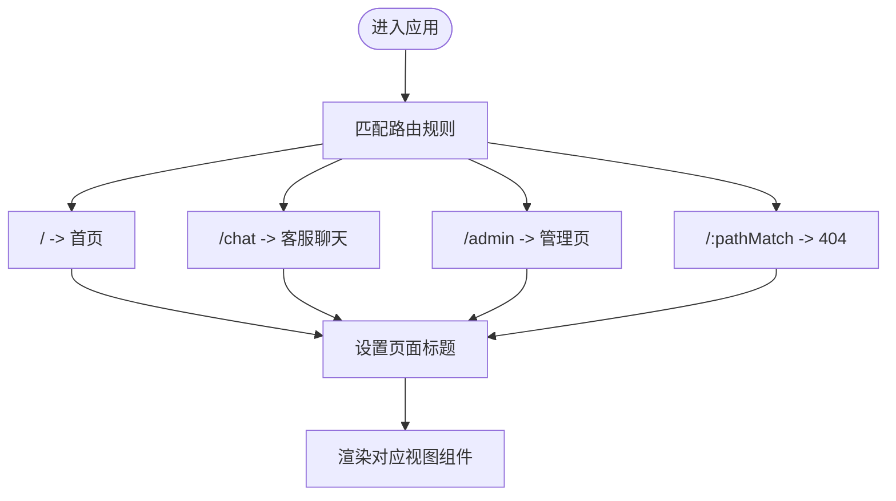
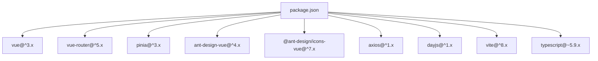

# 客服端Vue应用

<cite>
**本文引用的文件**
- [main.ts](file://fast-ui/apps/customer-service-vue/src/main.ts)
- [App.vue](file://fast-ui/apps/customer-service-vue/src/App.vue)
- [router/index.ts](file://fast-ui/apps/customer-service-vue/src/router/index.ts)
- [package.json](file://fast-ui/apps/customer-service-vue/package.json)
</cite>

## 目录
1. [简介](#简介)
2. [项目结构](#项目结构)
3. [核心组件](#核心组件)
4. [架构总览](#架构总览)
5. [详细组件分析](#详细组件分析)
6. [依赖分析](#依赖分析)
7. [性能考虑](#性能考虑)
8. [故障排查指南](#故障排查指南)
9. [结论](#结论)
10. [附录](#附录)

## 简介
本文件面向“客服端Vue应用”的技术文档，聚焦于专为客服场景设计的前端架构与实现要点。当前仓库中，客服端Vue应用位于 fast-ui/apps/customer-service-vue，采用 Vue 3 + Pinia + Vue Router + Ant Design Vue 技术栈，提供基础的路由导航与全局UI注册能力。本文将从系统架构、组件关系、数据流、处理逻辑、集成点、错误处理与性能特性等方面进行深入解析，并给出开发指南、优化建议与调试方法。

## 项目结构
客服端Vue应用位于 fast-ui/apps/customer-service-vue，核心入口与路由配置如下：
- 应用入口：src/main.ts 负责创建Vue实例、挂载Pinia、注册Ant Design Vue与图标组件。
- 根组件：src/App.vue 作为路由出口容器。
- 路由配置：src/router/index.ts 定义首页、客服聊天、管理页与404页面的路由规则，并设置页面标题钩子。

**图表来源**
- [main.ts](file://fast-ui/apps/customer-service-vue/src/main.ts#L1-L20)
- [App.vue](file://fast-ui/apps/customer-service-vue/src/App.vue#L1-L8)
- [router/index.ts](file://fast-ui/apps/customer-service-vue/src/router/index.ts#L1-L43)

**章节来源**
- [main.ts](file://fast-ui/apps/customer-service-vue/src/main.ts#L1-L20)
- [App.vue](file://fast-ui/apps/customer-service-vue/src/App.vue#L1-L8)
- [router/index.ts](file://fast-ui/apps/customer-service-vue/src/router/index.ts#L1-L43)

## 核心组件
- 应用入口与全局初始化
  - 创建Vue应用实例并注册Pinia、Vue Router、Ant Design Vue。
  - 动态注册Ant Design Vue图标组件，便于在模板中直接使用。
- 根组件
  - 通过 <router-view /> 渲染当前路由对应的视图组件。
- 路由系统
  - 定义首页、客服聊天、管理页与404页面的懒加载路由。
  - 在导航前置守卫中根据meta.title动态设置页面标题。

上述组件共同构成应用的启动流程与页面导航骨架，为后续的客服聊天窗口、状态管理与实时通信模块提供基础支撑。

**章节来源**
- [main.ts](file://fast-ui/apps/customer-service-vue/src/main.ts#L1-L20)
- [App.vue](file://fast-ui/apps/customer-service-vue/src/App.vue#L1-L8)
- [router/index.ts](file://fast-ui/apps/customer-service-vue/src/router/index.ts#L1-L43)

## 架构总览
下图展示应用启动到页面渲染的关键交互：

**图表来源**
- [main.ts](file://fast-ui/apps/customer-service-vue/src/main.ts#L1-L20)
- [App.vue](file://fast-ui/apps/customer-service-vue/src/App.vue#L1-L8)
- [router/index.ts](file://fast-ui/apps/customer-service-vue/src/router/index.ts#L1-L43)

## 详细组件分析

### 路由与导航设计
- 路由定义
  - 首页：/，组件按需加载至 views/home/index.vue。
  - 客服聊天：/chat，组件按需加载至 views/chat/index.vue。
  - 管理：/admin，组件按需加载至 views/admin/index.vue。
  - 通配：/:pathMatch(.*)*，指向 views/error/404.vue。
- 导航行为
  - 使用 createWebHashHistory 历史模式，利于静态部署与多环境兼容。
  - beforeEach 中根据路由 meta.title 设置页面标题，提升用户体验。

**图表来源**
- [router/index.ts](file://fast-ui/apps/customer-service-vue/src/router/index.ts#L1-L43)

**章节来源**
- [router/index.ts](file://fast-ui/apps/customer-service-vue/src/router/index.ts#L1-L43)

### 实时通信与消息推送（设计说明）
- 当前仓库中，客服端Vue应用尚未包含WebSocket连接管理、消息推送与用户会话处理的具体实现代码。因此，本节以“概念性设计”形式说明在该应用基础上可采用的实现思路与最佳实践，帮助开发者在后续迭代中集成实时通信能力。
- 设计要点
  - 连接管理：在Pinia中维护WebSocket连接状态、重连策略与心跳保活。
  - 消息分发：基于事件驱动的消息队列，按会话维度聚合消息，避免重复渲染。
  - 用户会话：在Pinia中持久化当前会话信息与历史消息，支持断线重连后恢复。
  - 推送机制：监听服务端推送事件，更新消息队列与UI状态，触发滚动与提示。
- 可选集成点
  - 与后端WebSocket网关对接，统一消息协议与鉴权方式。
  - 在路由切换或页面隐藏时，合理暂停/恢复消息订阅，降低资源消耗。

[本节为概念性说明，不直接分析具体源码文件，故无“章节来源”]

### 客服聊天窗口组件（设计说明）
- 组件模式
  - 视图层：采用单页组件（SFC）组织布局，包含消息列表、输入框与发送按钮。
  - 数据层：通过Pinia管理当前会话、消息列表与输入状态。
  - 交互层：封装输入处理、发送逻辑与滚动控制，确保新消息可见。
- 消息列表渲染
  - 使用虚拟滚动或分页加载策略，避免超大数据量导致的性能问题。
  - 对不同类型消息（文本、图片、系统通知）进行差异化渲染。
- 输入处理
  - 支持富文本编辑、表情选择与文件上传；对输入内容进行长度与格式校验。
  - 发送前本地预览与去抖，提升交互流畅度。

[本节为概念性说明，不直接分析具体源码文件，故无“章节来源”]

### Pinia状态管理（设计说明）
- 场景适配
  - 用户状态：登录态、权限与角色信息，用于路由守卫与功能开关控制。
  - 聊天记录：当前会话消息列表、未读数与时间戳，支持增量拉取与缓存。
  - 消息队列：待发送队列、重试队列与已发送确认，保证消息可靠投递。
- 最佳实践
  - 将状态模块化拆分（如 user、chat、ui），避免单一store臃肿。
  - 使用持久化插件（如本地存储）保存关键状态，提升体验。
  - 严格区分“状态”与“计算属性”，减少不必要的响应式开销。

[本节为概念性说明，不直接分析具体源码文件，故无“章节来源”]

## 依赖分析
- 运行时依赖
  - Vue 3：应用核心框架。
  - Pinia：状态管理。
  - Vue Router：页面路由与导航。
  - Ant Design Vue：UI组件库与样式重置。
  - Axios：HTTP请求（可用于与后端API交互）。
  - Day.js：日期时间工具。
- 开发依赖
  - Vite：构建与开发服务器。
  - TypeScript：类型系统。
  - Vue TSConfig：类型配置。

**图表来源**
- [package.json](file://fast-ui/apps/customer-service-vue/package.json#L1-L29)

**章节来源**
- [package.json](file://fast-ui/apps/customer-service-vue/package.json#L1-L29)

## 性能考虑
- 路由懒加载
  - 通过动态导入视图组件，减少首屏包体与初次渲染时间。
- 图标按需注册
  - 仅注册实际使用的图标组件，避免引入冗余资源。
- UI组件复用
  - 使用Ant Design Vue提供的通用组件，减少自定义样式与逻辑成本。
- 状态与渲染优化
  - 在聊天窗口中采用虚拟滚动、消息分页与局部刷新策略，降低DOM压力。
- 构建与打包
  - 合理配置Vite与TypeScript，启用Tree Shaking与按需编译，缩短构建时间。

[本节提供通用指导，不直接分析具体源码文件，故无“章节来源”]

## 故障排查指南
- 页面标题未更新
  - 检查路由前置守卫是否正确设置 meta.title 并执行。
- 路由跳转无效
  - 确认路由路径与组件导入是否正确，检查懒加载是否抛出异常。
- UI样式异常
  - 确认Ant Design Vue样式重置是否正确引入，避免与业务样式冲突。
- 图标无法显示
  - 检查图标是否已通过全局注册，组件内是否使用正确的图标名称。
- 开发与生产差异
  - 对比 .env.development 与 .env.production 的变量配置，确保API地址与功能开关一致。

[本节提供通用指导，不直接分析具体源码文件，故无“章节来源”]

## 结论
客服端Vue应用以简洁清晰的架构为基础，具备良好的扩展性与可维护性。当前版本已完成应用初始化、路由导航与UI注册等基础设施。后续可在Pinia中完善状态模型，在路由与组件层面集成实时通信能力，并结合性能优化策略提升用户体验。本文档提供了开发指南、集成方案与调试方法，可作为进一步迭代的参考。

## 附录
- 快速开始
  - 安装依赖：使用 pnpm 安装项目依赖。
  - 启动开发：运行 dev 脚本启动本地开发服务器。
  - 构建产物：运行 build 脚本生成生产构建。
- 扩展建议
  - 新增视图：在 views 下新增页面，并在路由中注册。
  - 新增组件：在 components 下封装通用组件，提升复用率。
  - 新增状态模块：在 stores 下新增模块，按职责划分状态域。

[本节为通用补充，不直接分析具体源码文件，故无“章节来源”]