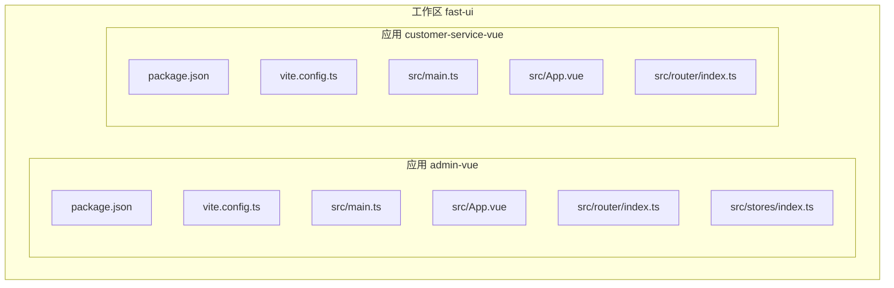
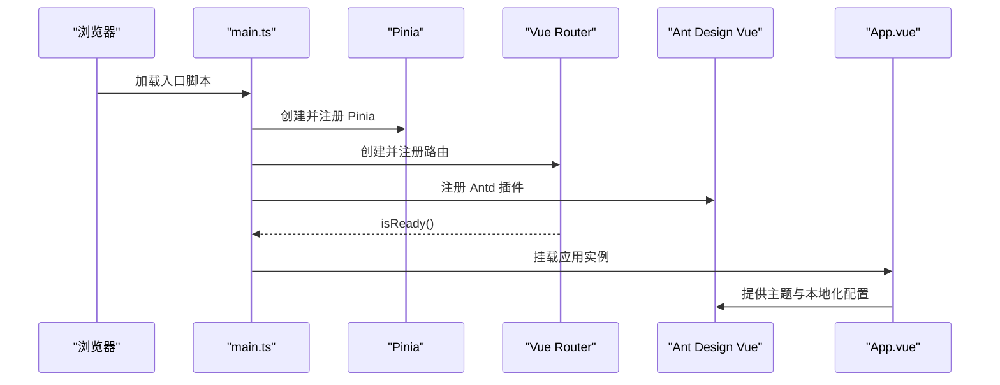
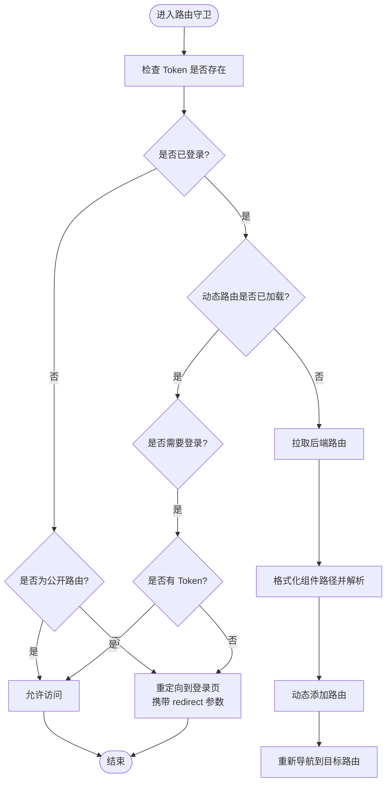
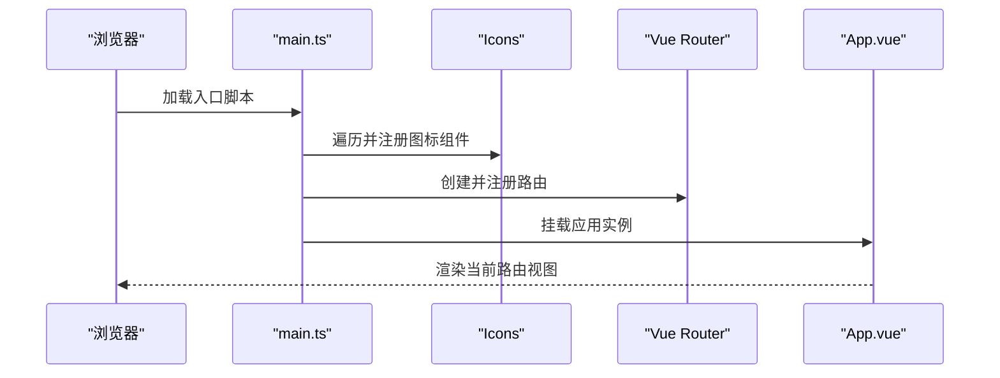
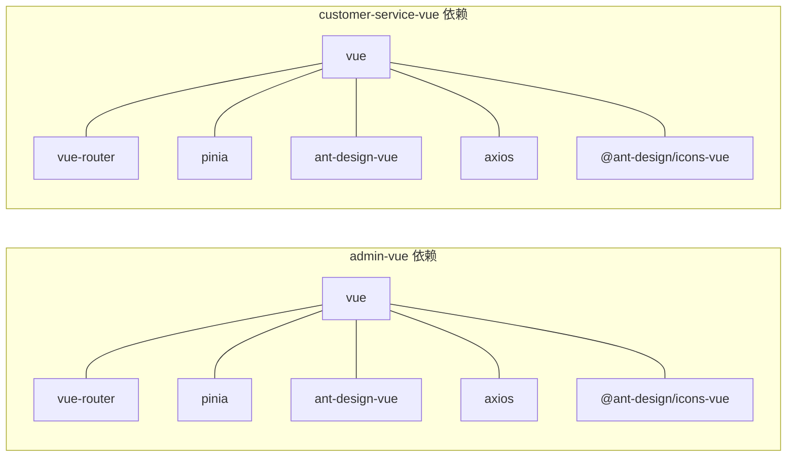

# 应用架构设计

<cite>
**本文档引用的文件**
- [admin-vue/package.json](file://fast-ui/apps/admin-vue/package.json)
- [admin-vue/vite.config.ts](file://fast-ui/apps/admin-vue/vite.config.ts)
- [admin-vue/src/main.ts](file://fast-ui/apps/admin-vue/src/main.ts)
- [admin-vue/src/App.vue](file://fast-ui/apps/admin-vue/src/App.vue)
- [admin-vue/src/router/index.ts](file://fast-ui/apps/admin-vue/src/router/index.ts)
- [admin-vue/src/stores/index.ts](file://fast-ui/apps/admin-vue/src/stores/index.ts)
- [customer-service-vue/package.json](file://fast-ui/apps/customer-service-vue/package.json)
- [customer-service-vue/vite.config.ts](file://fast-ui/apps/customer-service-vue/vite.config.ts)
- [customer-service-vue/src/main.ts](file://fast-ui/apps/customer-service-vue/src/main.ts)
- [customer-service-vue/src/App.vue](file://fast-ui/apps/customer-service-vue/src/App.vue)
- [customer-service-vue/src/router/index.ts](file://fast-ui/apps/customer-service-vue/src/router/index.ts)
</cite>

## 目录
1. [引言](#引言)
2. [项目结构](#项目结构)
3. [核心组件](#核心组件)
4. [架构总览](#架构总览)
5. [详细组件分析](#详细组件分析)
6. [依赖分析](#依赖分析)
7. [性能考虑](#性能考虑)
8. [故障排除指南](#故障排除指南)
9. [结论](#结论)

## 引言
本文件面向客服端Vue应用的架构设计与实现，系统性解析以下主题：
- Vue 3 Composition API 的使用方式与最佳实践
- 组件化设计原则与模块化组织结构
- 应用启动流程、依赖注入机制与运行时配置
- Vite 构建工具的配置选项、开发服务器设置与生产环境优化策略
- TypeScript 集成方案、类型定义管理与编译配置
- 目录结构设计、文件组织规范与命名约定
- 架构决策的技术背景、设计权衡与最佳实践指导

## 项目结构
本仓库采用多包工作区（monorepo）组织方式，其中 fast-ui/apps 下包含两个独立的前端应用：
- admin-vue：后台管理前端应用，具备动态路由、权限控制与复杂布局
- customer-service-vue：客服前端应用，采用哈希路由与简洁视图

图表来源
- [admin-vue/package.json](file://fast-ui/apps/admin-vue/package.json#L1-L50)
- [admin-vue/vite.config.ts](file://fast-ui/apps/admin-vue/vite.config.ts#L1-L56)
- [admin-vue/src/main.ts](file://fast-ui/apps/admin-vue/src/main.ts#L1-L16)
- [admin-vue/src/App.vue](file://fast-ui/apps/admin-vue/src/App.vue#L1-L41)
- [admin-vue/src/router/index.ts](file://fast-ui/apps/admin-vue/src/router/index.ts#L1-L171)
- [admin-vue/src/stores/index.ts](file://fast-ui/apps/admin-vue/src/stores/index.ts#L1-L6)
- [customer-service-vue/package.json](file://fast-ui/apps/customer-service-vue/package.json#L1-L29)
- [customer-service-vue/vite.config.ts](file://fast-ui/apps/customer-service-vue/vite.config.ts#L1-L37)
- [customer-service-vue/src/main.ts](file://fast-ui/apps/customer-service-vue/src/main.ts#L1-L20)
- [customer-service-vue/src/App.vue](file://fast-ui/apps/customer-service-vue/src/App.vue#L1-L8)
- [customer-service-vue/src/router/index.ts](file://fast-ui/apps/customer-service-vue/src/router/index.ts#L1-L43)

章节来源
- [admin-vue/package.json](file://fast-ui/apps/admin-vue/package.json#L1-L50)
- [customer-service-vue/package.json](file://fast-ui/apps/customer-service-vue/package.json#L1-L29)

## 核心组件
本节聚焦于两个应用的核心启动与运行组件，展示依赖注入、插件注册与运行时配置。

- admin-vue
  - 应用入口：在入口文件中完成 Pinia、Vue Router、Ant Design Vue 插件注册，并在路由准备完成后挂载应用
  - 根组件：通过 ConfigProvider 提供主题与本地化配置，结合 Pinia 状态计算主题算法与令牌
  - 路由：基于哈希历史记录的静态路由与动态路由组合，支持登录拦截与页面标题设置
  - 状态：集中式状态管理通过 Pinia 实现

- customer-service-vue
  - 应用入口：创建应用实例，注册 Pinia、Vue Router、Ant Design Vue，并全局注册图标组件
  - 根组件：最简模板，承载路由视图
  - 路由：基于哈希历史记录的静态路由，包含首页、聊天与管理页面

章节来源
- [admin-vue/src/main.ts](file://fast-ui/apps/admin-vue/src/main.ts#L1-L16)
- [admin-vue/src/App.vue](file://fast-ui/apps/admin-vue/src/App.vue#L1-L41)
- [admin-vue/src/router/index.ts](file://fast-ui/apps/admin-vue/src/router/index.ts#L1-L171)
- [admin-vue/src/stores/index.ts](file://fast-ui/apps/admin-vue/src/stores/index.ts#L1-L6)
- [customer-service-vue/src/main.ts](file://fast-ui/apps/customer-service-vue/src/main.ts#L1-L20)
- [customer-service-vue/src/App.vue](file://fast-ui/apps/customer-service-vue/src/App.vue#L1-L8)
- [customer-service-vue/src/router/index.ts](file://fast-ui/apps/customer-service-vue/src/router/index.ts#L1-L43)

## 架构总览
下图展示了两个应用的启动流程与关键交互：

图表来源
- [admin-vue/src/main.ts](file://fast-ui/apps/admin-vue/src/main.ts#L1-L16)
- [admin-vue/src/App.vue](file://fast-ui/apps/admin-vue/src/App.vue#L1-L41)
- [admin-vue/src/router/index.ts](file://fast-ui/apps/admin-vue/src/router/index.ts#L1-L171)
- [admin-vue/src/stores/index.ts](file://fast-ui/apps/admin-vue/src/stores/index.ts#L1-L6)
- [customer-service-vue/src/main.ts](file://fast-ui/apps/customer-service-vue/src/main.ts#L1-L20)
- [customer-service-vue/src/App.vue](file://fast-ui/apps/customer-service-vue/src/App.vue#L1-L8)
- [customer-service-vue/src/router/index.ts](file://fast-ui/apps/customer-service-vue/src/router/index.ts#L1-L43)

## 详细组件分析

### admin-vue：动态路由与权限控制
- 动态路由加载：在路由守卫中根据登录状态与权限状态决定是否拉取后端路由并动态注入
- 组件解析：通过 import.meta.glob 预扫描 views 目录，将后端返回的组件路径映射为动态导入
- 登录拦截：未登录用户访问受保护路由时重定向至登录页，并携带重定向参数
- 页面标题：afterEach 钩子统一设置 document.title

图表来源
- [admin-vue/src/router/index.ts](file://fast-ui/apps/admin-vue/src/router/index.ts#L106-L159)

章节来源
- [admin-vue/src/router/index.ts](file://fast-ui/apps/admin-vue/src/router/index.ts#L1-L171)

### customer-service-vue：静态路由与图标注册
- 路由：采用哈希历史记录，包含首页、聊天与管理页面以及 404 错误页
- 图标：在入口处遍历并全局注册 Ant Design Icons，避免重复 import
- 最简根组件：仅承载路由视图，便于快速迭代

图表来源
- [customer-service-vue/src/main.ts](file://fast-ui/apps/customer-service-vue/src/main.ts#L1-L20)
- [customer-service-vue/src/App.vue](file://fast-ui/apps/customer-service-vue/src/App.vue#L1-L8)
- [customer-service-vue/src/router/index.ts](file://fast-ui/apps/customer-service-vue/src/router/index.ts#L1-L43)

章节来源
- [customer-service-vue/src/main.ts](file://fast-ui/apps/customer-service-vue/src/main.ts#L1-L20)
- [customer-service-vue/src/router/index.ts](file://fast-ui/apps/customer-service-vue/src/router/index.ts#L1-L43)

### Vite 构建与开发服务器配置
- admin-vue
  - 开发服务器：host 允许局域网访问、端口 1234、代理 /api 到后端服务
  - 路径别名：@ 指向 src 目录
  - 构建优化：手动分包策略，将 vue 与 pinia 等库拆分为独立 vendor 包，提升缓存命中率
  - 资源命名：按类型输出到不同目录，图片与字体等静态资源单独归类

- customer-service-vue
  - 开发服务器：端口 1000
  - 路径别名：使用 import.meta.url 形式进行别名配置
  - 构建优化：统一输出到 js/css/img 目录，便于 CDN 分离与缓存策略

章节来源
- [admin-vue/vite.config.ts](file://fast-ui/apps/admin-vue/vite.config.ts#L1-L56)
- [customer-service-vue/vite.config.ts](file://fast-ui/apps/customer-service-vue/vite.config.ts#L1-L37)

### TypeScript 集成与编译配置
- 两应用均使用 TypeScript 与 Vue 3 生态，包含：
  - 编译器：vue-tsc 进行类型检查与声明生成
  - 配置：与 Vite 协同，启用 Vue 3 模板与 Composition API 支持
  - 类型定义：@types/node 提供 Node.js 环境类型

章节来源
- [admin-vue/package.json](file://fast-ui/apps/admin-vue/package.json#L41-L48)
- [customer-service-vue/package.json](file://fast-ui/apps/customer-service-vue/package.json#L20-L27)

### 目录结构设计与命名约定
- 通用约定
  - src 下按功能域划分：api、components、router、stores、utils、views
  - 视图组件以页面维度组织，支持动态导入与懒加载
  - 根组件 App.vue 统一注入主题与本地化配置
- admin-vue 特点
  - 布局层：layout/index.vue 承载主框架与菜单
  - 权限层：stores/modules/permission 管理动态路由与权限
  - 工具层：utils/token 等提供鉴权相关能力
- customer-service-vue 特点
  - 结构更扁平，适合轻量级场景
  - 视图按功能模块划分，如 home、chat、admin

章节来源
- [admin-vue/src/App.vue](file://fast-ui/apps/admin-vue/src/App.vue#L1-L41)
- [admin-vue/src/router/index.ts](file://fast-ui/apps/admin-vue/src/router/index.ts#L1-L171)
- [customer-service-vue/src/router/index.ts](file://fast-ui/apps/customer-service-vue/src/router/index.ts#L1-L43)

## 依赖分析
- admin-vue
  - 核心依赖：vue、vue-router、pinia、ant-design-vue、axios、dayjs、@ant-design/icons-vue 等
  - 开发依赖：@vitejs/plugin-vue、typescript、vue-tsc、@vue/tsconfig 等
- customer-service-vue
  - 核心依赖：vue、vue-router、pinia、ant-design-vue、axios、dayjs、@ant-design/icons-vue 等
  - 开发依赖：与 admin-vue 类似，保持一致的开发体验

图表来源
- [admin-vue/package.json](file://fast-ui/apps/admin-vue/package.json#L11-L40)
- [customer-service-vue/package.json](file://fast-ui/apps/customer-service-vue/package.json#L11-L19)

章节来源
- [admin-vue/package.json](file://fast-ui/apps/admin-vue/package.json#L1-L50)
- [customer-service-vue/package.json](file://fast-ui/apps/customer-service-vue/package.json#L1-L29)

## 性能考虑
- 代码分割与缓存优化
  - 使用 Vite 的动态导入与 Rollup 的 manualChunks，将常用第三方库拆分为独立 chunk，提升浏览器缓存命中率
  - 对图片、字体等静态资源进行分类输出，便于 CDN 缓存策略与压缩
- 构建产物命名
  - 通过自定义 assetFileNames 与 chunkFileNames，形成稳定的文件名模式，有利于长期缓存与版本管理
- 开发体验
  - 代理配置统一转发 /api 请求，减少跨域与环境差异带来的调试成本
  - 端口与 host 配置满足团队协作与远程联调需求

章节来源
- [admin-vue/vite.config.ts](file://fast-ui/apps/admin-vue/vite.config.ts#L26-L54)
- [customer-service-vue/vite.config.ts](file://fast-ui/apps/customer-service-vue/vite.config.ts#L17-L35)

## 故障排除指南
- 动态路由未生效或 404
  - 检查路由守卫中的 Token 状态与 isRoutesLoaded 标志位
  - 确认后端返回的组件路径与 views 目录结构一致，必要时补充 index.vue 兼容逻辑
- 登录后仍被重定向到登录页
  - 排查 Token 是否正确存储与读取，确认 beforeEach 中的 hasToken 判断
- 图标不显示
  - 确认入口处是否正确遍历并注册图标组件
- 构建后静态资源 404
  - 检查 base 配置与资源输出目录，确保与部署路径一致

章节来源
- [admin-vue/src/router/index.ts](file://fast-ui/apps/admin-vue/src/router/index.ts#L106-L159)
- [customer-service-vue/src/main.ts](file://fast-ui/apps/customer-service-vue/src/main.ts#L15-L17)

## 结论
本架构以 Vue 3 Composition API 为核心，结合 Pinia 实现集中式状态管理，以 Vue Router 提供路由与权限控制，并通过 Vite 提供高效的开发与构建体验。admin-vue 侧重于动态路由与权限体系，customer-service-vue 专注于简洁与可维护性。整体设计遵循高内聚、低耦合的原则，配合清晰的目录结构与命名约定，便于团队协作与长期演进。