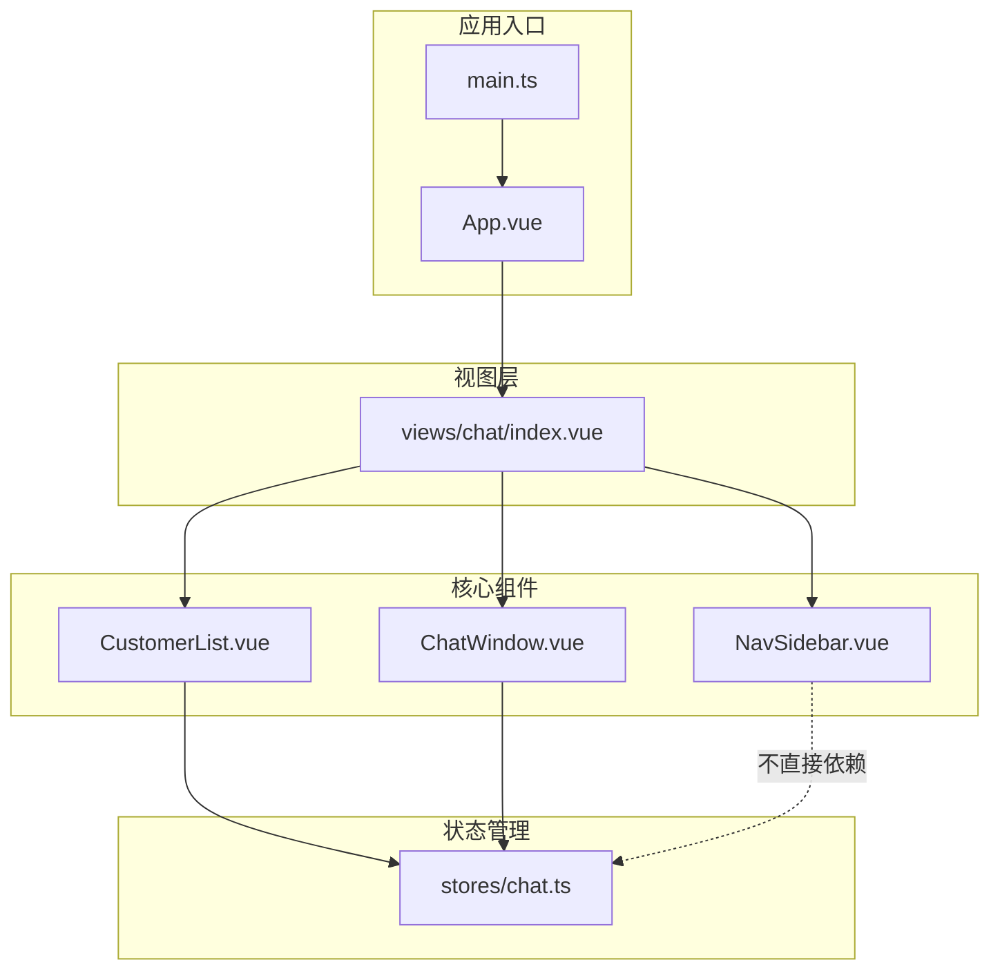
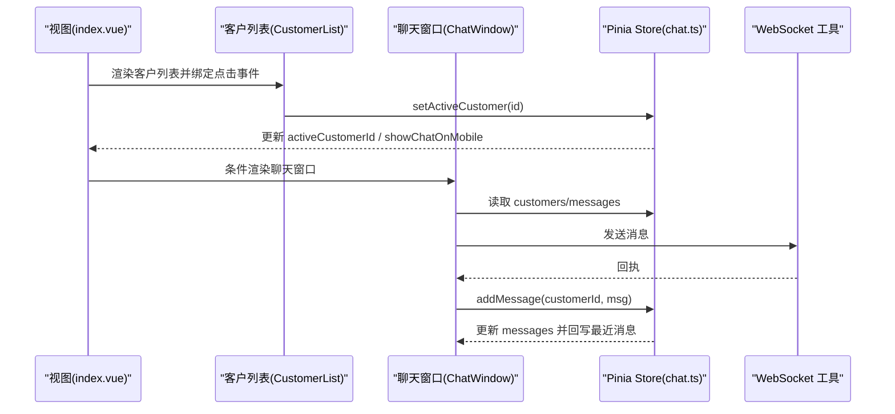
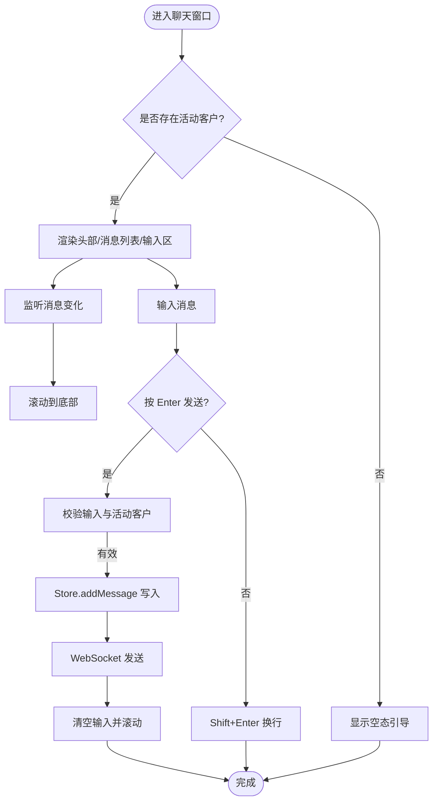
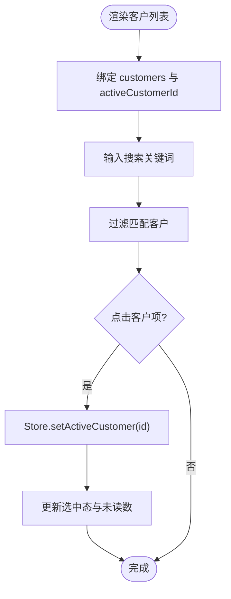
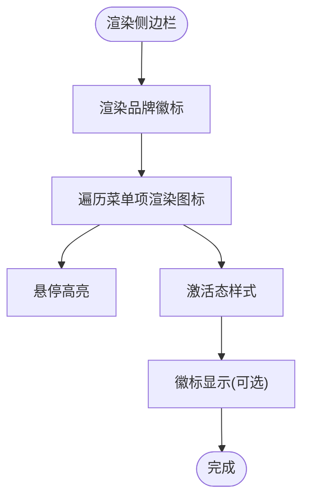
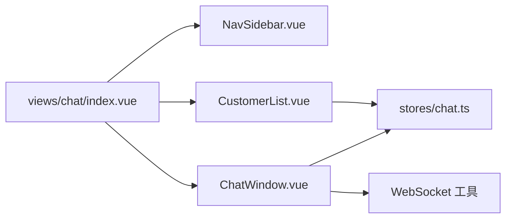

# 核心组件

<cite>
**本文引用的文件**
- [ChatWindow.vue](file://fast-ui/apps/customer-service-vue/src/components/ChatWindow.vue)
- [CustomerList.vue](file://fast-ui/apps/customer-service-vue/src/components/CustomerList.vue)
- [NavSidebar.vue](file://fast-ui/apps/customer-service-vue/src/components/NavSidebar.vue)
- [chat.ts](file://fast-ui/apps/customer-service-vue/src/stores/chat.ts)
- [index.vue](file://fast-ui/apps/customer-service-vue/src/views/chat/index.vue)
- [main.ts](file://fast-ui/apps/customer-service-vue/src/main.ts)
- [App.vue](file://fast-ui/apps/customer-service-vue/src/App.vue)
</cite>

## 目录
1. [引言](#引言)
2. [项目结构](#项目结构)
3. [核心组件](#核心组件)
4. [架构总览](#架构总览)
5. [组件详解](#组件详解)
6. [依赖关系分析](#依赖关系分析)
7. [性能考量](#性能考量)
8. [故障排查指南](#故障排查指南)
9. [结论](#结论)
10. [附录](#附录)

## 引言
本文件聚焦于客服端 Vue 应用的核心组件：聊天窗口、客户列表与导航侧边栏。我们将从设计模式、消息渲染逻辑、交互行为、状态管理、组件通信、可复用性与扩展性等维度进行系统化剖析，并提供最佳实践、性能优化与用户体验改进建议。

## 项目结构
该 Vue 客服端位于 fast-ui/apps/customer-service-vue，采用 Composition API + Pinia 状态管理 + Ant Design Vue 组件库。页面由视图层承载，核心交互通过组件与 Pinia Store 协作完成。

图表来源
- [App.vue](file://fast-ui/apps/customer-service-vue/src/App.vue#L1-L8)
- [main.ts](file://fast-ui/apps/customer-service-vue/src/main.ts#L1-L20)
- [index.vue](file://fast-ui/apps/customer-service-vue/src/views/chat/index.vue#L1-L48)
- [NavSidebar.vue](file://fast-ui/apps/customer-service-vue/src/components/NavSidebar.vue#L1-L137)
- [CustomerList.vue](file://fast-ui/apps/customer-service-vue/src/components/CustomerList.vue#L1-L292)
- [ChatWindow.vue](file://fast-ui/apps/customer-service-vue/src/components/ChatWindow.vue#L1-L606)
- [chat.ts](file://fast-ui/apps/customer-service-vue/src/stores/chat.ts#L1-L119)

章节来源
- [main.ts](file://fast-ui/apps/customer-service-vue/src/main.ts#L1-L20)
- [App.vue](file://fast-ui/apps/customer-service-vue/src/App.vue#L1-L8)
- [index.vue](file://fast-ui/apps/customer-service-vue/src/views/chat/index.vue#L1-L48)

## 核心组件
- 聊天窗口组件（ChatWindow）：负责当前会话的消息展示、输入与发送、滚动定位、空态提示、移动端返回按钮与工具条。
- 客户列表组件（CustomerList）：负责客户列表渲染、搜索过滤、在线状态、未读数、选中态切换。
- 导航侧边栏组件（NavSidebar）：负责顶部 Logo、底部设置与头像、菜单项激活态与徽标显示。

章节来源
- [ChatWindow.vue](file://fast-ui/apps/customer-service-vue/src/components/ChatWindow.vue#L1-L606)
- [CustomerList.vue](file://fast-ui/apps/customer-service-vue/src/components/CustomerList.vue#L1-L292)
- [NavSidebar.vue](file://fast-ui/apps/customer-service-vue/src/components/NavSidebar.vue#L1-L137)

## 架构总览
整体采用“视图承载 + 组件交互 + Pinia 状态”的分层架构。视图层根据屏幕宽度决定是否渲染侧边栏与左右面板；组件通过 Pinia Store 进行跨组件状态共享与更新；消息发送通过 WebSocket 工具函数实现。

图表来源
- [index.vue](file://fast-ui/apps/customer-service-vue/src/views/chat/index.vue#L1-L48)
- [CustomerList.vue](file://fast-ui/apps/customer-service-vue/src/components/CustomerList.vue#L1-L292)
- [ChatWindow.vue](file://fast-ui/apps/customer-service-vue/src/components/ChatWindow.vue#L1-L606)
- [chat.ts](file://fast-ui/apps/customer-service-vue/src/stores/chat.ts#L1-L119)

## 组件详解

### 聊天窗口组件（ChatWindow）
- 设计模式
  - 基于 Composition API 的函数式组件，使用 setup 语法糖组织逻辑。
  - 使用 Pinia Store 提供的状态与方法，避免跨层级 props 传递。
  - 使用计算属性组合 activeCustomer 与 messages，确保渲染最小化。
- 消息渲染逻辑
  - 通过 messages 计算属性聚合当前会话消息数组。
  - 每条消息根据 senderId 判断气泡样式与头像来源。
  - 时间格式化统一使用 dayjs，支持 HH:mm、昨天、MM/DD 等策略。
- 交互行为
  - 输入框支持多行，按 Enter 发送、Shift+Enter 换行。
  - 发送后调用 Store 的 addMessage 写入消息并清空输入。
  - 自动滚动到底部，保证最新消息可见。
  - 移动端显示返回按钮，点击回到客户列表。
- 空态与占位
  - 无活动客户时展示引导页，包含动画与“查看待办任务”按钮。
- 可复用性与扩展
  - 支持通过 Store 注入的类型系统扩展消息类型（如 image、file）。
  - 可通过注入的 WebSocket 工具替换为真实后端连接。
- 性能与体验
  - 使用 nextTick 确保 DOM 更新后再滚动，避免闪烁。
  - 按 Enter 发送时阻止默认行为，避免表单刷新。
  - 头像与在线状态使用内联资源，减少额外请求。

图表来源
- [ChatWindow.vue](file://fast-ui/apps/customer-service-vue/src/components/ChatWindow.vue#L1-L606)
- [chat.ts](file://fast-ui/apps/customer-service-vue/src/stores/chat.ts#L1-L119)

章节来源
- [ChatWindow.vue](file://fast-ui/apps/customer-service-vue/src/components/ChatWindow.vue#L1-L606)
- [chat.ts](file://fast-ui/apps/customer-service-vue/src/stores/chat.ts#L1-L119)

### 客户列表组件（CustomerList）
- 数据绑定与状态管理
  - 通过 Pinia Store 的 customers 读取客户集合。
  - 通过 activeCustomerId 控制当前选中项的高亮。
  - 通过 setSearchText 实现本地搜索过滤。
- 用户选择功能
  - 点击客户项触发 setActiveCustomer，切换活动客户并隐藏移动端聊天面板。
  - 在线状态以圆点徽标与灰度滤镜区分。
- 未读数与时间显示
  - 未读数超过 99 显示 “99+”，提升可读性。
  - 时间显示策略：当天 HH:mm、昨天“昨天”、其他 MM/DD。
- 响应式适配
  - 移动端隐藏标题操作区，调整布局与间距，保证触摸友好。
- 可复用性
  - 通过计算属性与图标组件解耦，便于替换图标与样式主题。

图表来源
- [CustomerList.vue](file://fast-ui/apps/customer-service-vue/src/components/CustomerList.vue#L1-L292)
- [chat.ts](file://fast-ui/apps/customer-service-vue/src/stores/chat.ts#L1-L119)

章节来源
- [CustomerList.vue](file://fast-ui/apps/customer-service-vue/src/components/CustomerList.vue#L1-L292)
- [chat.ts](file://fast-ui/apps/customer-service-vue/src/stores/chat.ts#L1-L119)

### 导航侧边栏（NavSidebar）
- 布局设计
  - 固定宽度侧栏，垂直居中排列菜单项，顶部品牌徽标，底部设置与头像。
- 菜单管理
  - 使用动态组件渲染图标，支持徽标点显示。
  - 通过 activeMenu 控制激活态，悬停与激活态颜色过渡自然。
- 响应式适配
  - 小于 768px 隐藏侧边栏，避免移动端遮挡主内容。
- 可复用性
  - 菜单项配置集中定义，便于扩展新菜单或禁用徽标。

图表来源
- [NavSidebar.vue](file://fast-ui/apps/customer-service-vue/src/components/NavSidebar.vue#L1-L137)

章节来源
- [NavSidebar.vue](file://fast-ui/apps/customer-service-vue/src/components/NavSidebar.vue#L1-L137)

### 视图容器（views/chat/index.vue）
- 页面布局
  - 根据 isMobileView 决定是否渲染侧边栏。
  - 左右两栏布局：左侧客户列表、右侧聊天窗口。
  - 移动端在 showChatOnMobile 为真时显示聊天窗口，否则显示列表。
- 组件通信
  - 通过 Pinia Store 共享状态，避免层层 props 与事件回传。
  - 使用过渡动画 fade-slide 切换面板，提升体验。
- WebSocket 集成
  - 在视图层初始化 WebSocket 工具，供聊天窗口发送消息使用。

章节来源
- [index.vue](file://fast-ui/apps/customer-service-vue/src/views/chat/index.vue#L1-L48)
- [chat.ts](file://fast-ui/apps/customer-service-vue/src/stores/chat.ts#L1-L119)

## 依赖关系分析
- 组件依赖
  - ChatWindow 与 CustomerList 均依赖 Pinia Store（chat.ts）。
  - NavSidebar 作为纯展示组件，不直接依赖 Store。
  - 视图层 index.vue 同时持有 NavSidebar、CustomerList、ChatWindow。
- 状态依赖
  - customers、messages、activeCustomerId、isMobileView、showChatOnMobile 为核心状态。
  - Store 方法包括 setActiveCustomer、backToList、updateMobileStatus、addMessage。
- 外部依赖
  - Ant Design Vue 图标与组件。
  - dayjs 用于时间格式化。
  - WebSocket 工具（通过 useWebSocket 注入）。

图表来源
- [index.vue](file://fast-ui/apps/customer-service-vue/src/views/chat/index.vue#L1-L48)
- [NavSidebar.vue](file://fast-ui/apps/customer-service-vue/src/components/NavSidebar.vue#L1-L137)
- [CustomerList.vue](file://fast-ui/apps/customer-service-vue/src/components/CustomerList.vue#L1-L292)
- [ChatWindow.vue](file://fast-ui/apps/customer-service-vue/src/components/ChatWindow.vue#L1-L606)
- [chat.ts](file://fast-ui/apps/customer-service-vue/src/stores/chat.ts#L1-L119)

章节来源
- [chat.ts](file://fast-ui/apps/customer-service-vue/src/stores/chat.ts#L1-L119)

## 性能考量
- 渲染优化
  - 使用 computed 聚合派生数据，减少重复计算。
  - 列表渲染使用 v-for + key，避免不必要的重排。
- DOM 操作
  - 滚动使用 nextTick 确保 DOM 更新后执行，避免抖动。
- 状态更新
  - Store 中对 messages 与 customers 的更新保持不可变写法，利于追踪与调试。
- 响应式尺寸
  - 通过 updateMobileStatus 监听窗口变化，避免频繁重绘。
- 资源加载
  - 头像与图标均为外部资源，建议结合懒加载与缓存策略。

## 故障排查指南
- 无法显示消息
  - 检查 activeCustomerId 是否存在，确认 Store 中 messages 对应键值存在。
  - 确认 watcher 是否正确触发滚动。
- 发送消息无效
  - 检查输入值与 activeCustomerId 校验逻辑。
  - 确认 WebSocket 工具初始化与连接状态。
- 选中客户无反应
  - 检查 setActiveCustomer 是否被调用，以及 showChatOnMobile 是否切换。
- 移动端布局异常
  - 检查 isMobileView 与 showChatOnMobile 的条件渲染逻辑。
  - 确认媒体查询样式生效。

章节来源
- [ChatWindow.vue](file://fast-ui/apps/customer-service-vue/src/components/ChatWindow.vue#L1-L606)
- [CustomerList.vue](file://fast-ui/apps/customer-service-vue/src/components/CustomerList.vue#L1-L292)
- [chat.ts](file://fast-ui/apps/customer-service-vue/src/stores/chat.ts#L1-L119)

## 结论
该客服端应用通过清晰的组件边界与 Pinia 状态管理，实现了客户列表、聊天窗口与导航侧边栏的高效协作。组件具备良好的可复用性与扩展性，配合响应式布局与交互细节，能够满足桌面与移动端的客户服务场景。后续可在消息类型扩展、WebSocket 连接健壮性、列表虚拟化与缓存策略等方面进一步优化。

## 附录
- 最佳实践
  - 使用 Pinia 管理跨组件共享状态，避免事件风暴。
  - 组件间通过 Store 方法通信，保持单向数据流。
  - 对长列表与频繁滚动场景考虑虚拟滚动与节流。
- 扩展指南
  - 新增消息类型：在 Store 的 Message 类型与 ChatWindow 渲染分支中扩展。
  - 新增菜单项：在 NavSidebar 的 menuItems 中新增条目并绑定图标。
  - 新增筛选器：在 CustomerList 中增加更多过滤条件并联动 Store。
- 自定义开发方法
  - 通过插槽（slots）暴露可定制区域（如输入区工具条），在父组件注入自定义按钮。
  - 通过属性（props）接收主题色、尺寸与文案，提升组件通用性。