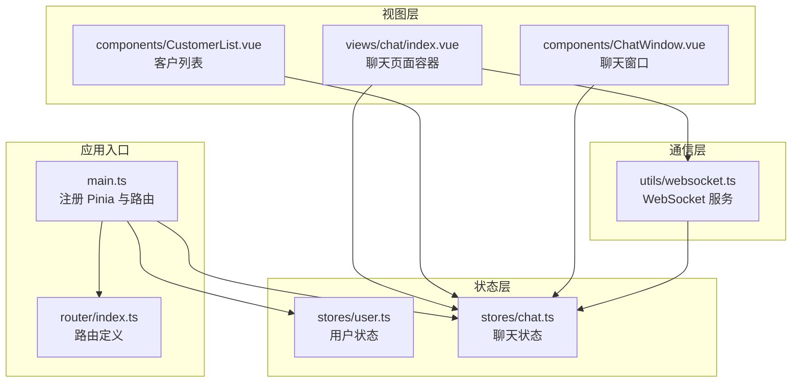
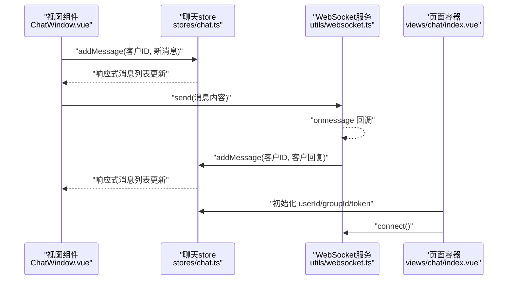
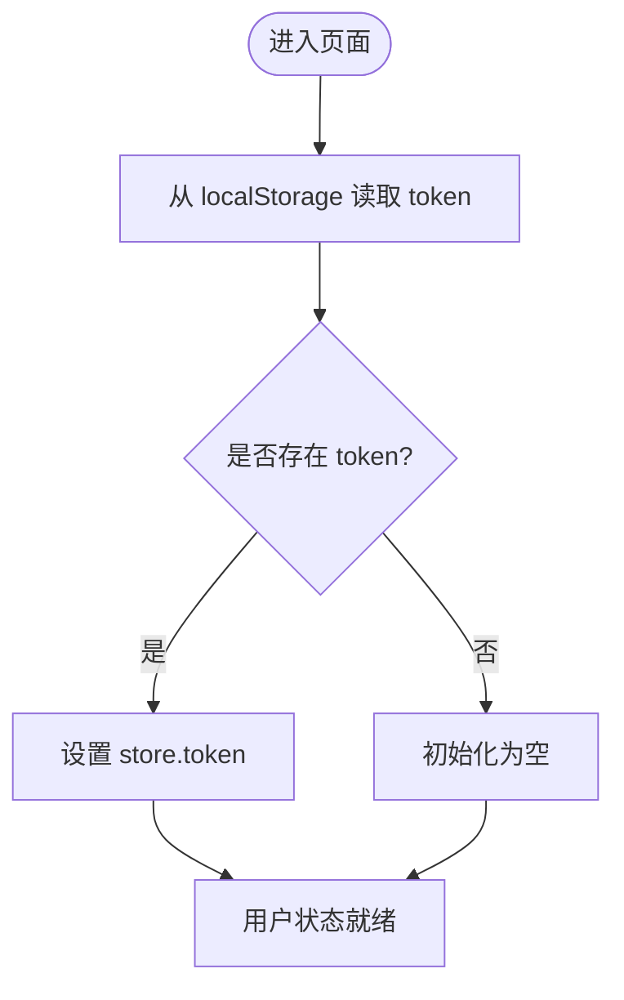
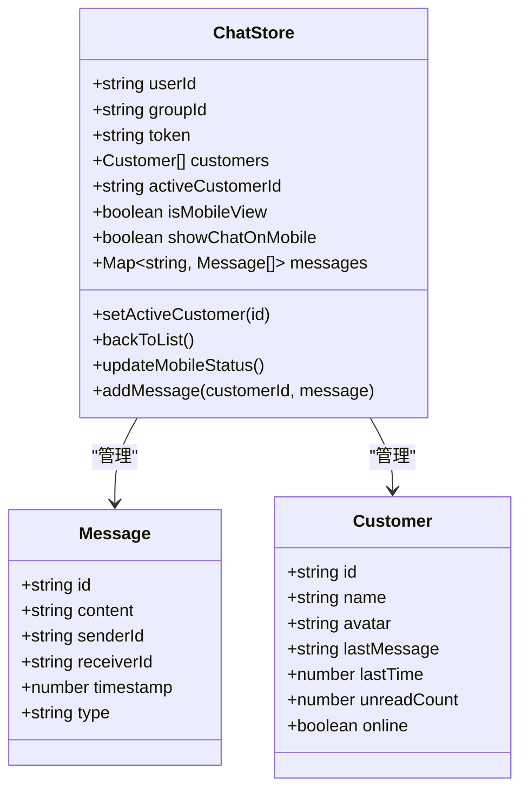
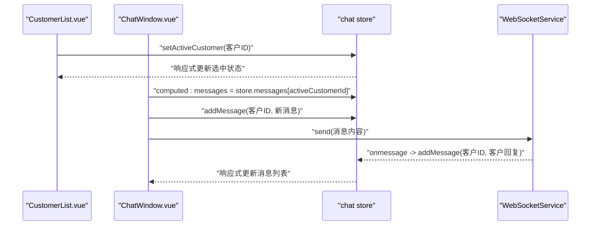
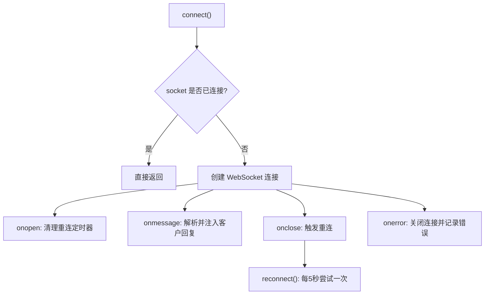
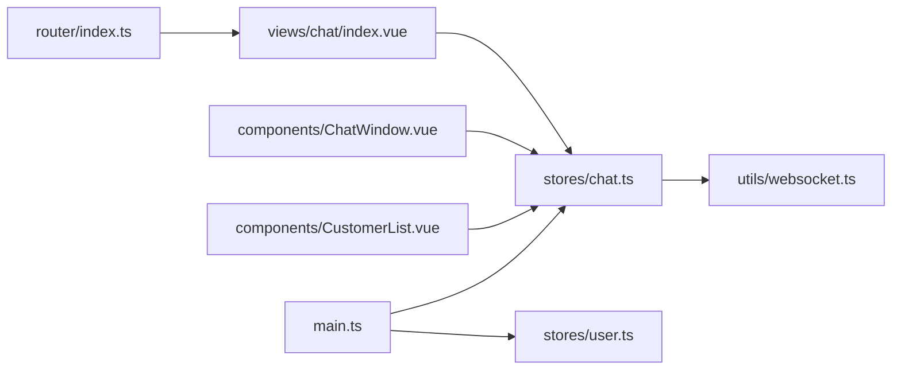

# 状态管理

<cite>
**本文引用的文件**
- [customer-service-vue/package.json](file://fast-ui/apps/customer-service-vue/package.json)
- [customer-service-vue/main.ts](file://fast-ui/apps/customer-service-vue/src/main.ts)
- [customer-service-vue/stores/user.ts](file://fast-ui/apps/customer-service-vue/src/stores/user.ts)
- [customer-service-vue/stores/chat.ts](file://fast-ui/apps/customer-service-vue/src/stores/chat.ts)
- [customer-service-vue/views/chat/index.vue](file://fast-ui/apps/customer-service-vue/src/views/chat/index.vue)
- [customer-service-vue/components/ChatWindow.vue](file://fast-ui/apps/customer-service-vue/src/components/ChatWindow.vue)
- [customer-service-vue/components/CustomerList.vue](file://fast-ui/apps/customer-service-vue/src/components/CustomerList.vue)
- [customer-service-vue/utils/websocket.ts](file://fast-ui/apps/customer-service-vue/src/utils/websocket.ts)
- [customer-service-vue/router/index.ts](file://fast-ui/apps/customer-service-vue/src/router/index.ts)
</cite>

## 目录
1. [简介](#简介)
2. [项目结构](#项目结构)
3. [核心组件](#核心组件)
4. [架构总览](#架构总览)
5. [详细组件分析](#详细组件分析)
6. [依赖关系分析](#依赖关系分析)
7. [性能考量](#性能考量)
8. [故障排查指南](#故障排查指南)
9. [结论](#结论)
10. [附录](#附录)

## 简介
本文件系统性梳理了客服端 Vue 应用（customer-service-vue）的状态管理实践，重点围绕 Pinia 的使用模式、store 设计原则与状态持久化策略展开；并深入解析聊天状态管理的设计思路（消息队列、会话状态、实时更新），以及用户状态管理（用户信息、权限状态、在线状态）。同时给出状态同步机制、响应式更新与订阅模式的实现要点，并提供状态调试工具、时间旅行调试与状态快照的使用建议，最后总结最佳实践、性能优化与内存泄漏防护措施。

## 项目结构
该应用采用 Vite + Vue 3 + TypeScript 构建，状态管理基于 Pinia。核心入口在应用主文件中注册 Pinia；聊天与用户两类状态分别以独立 store 管理；视图层通过组件消费 store 并结合 WebSocket 实现实时消息推送。

图表来源
- [customer-service-vue/main.ts](file://fast-ui/apps/customer-service-vue/src/main.ts#L1-L20)
- [customer-service-vue/router/index.ts](file://fast-ui/apps/customer-service-vue/src/router/index.ts#L1-L43)
- [customer-service-vue/stores/user.ts](file://fast-ui/apps/customer-service-vue/src/stores/user.ts#L1-L26)
- [customer-service-vue/stores/chat.ts](file://fast-ui/apps/customer-service-vue/src/stores/chat.ts#L1-L118)
- [customer-service-vue/views/chat/index.vue](file://fast-ui/apps/customer-service-vue/src/views/chat/index.vue#L1-L172)
- [customer-service-vue/components/CustomerList.vue](file://fast-ui/apps/customer-service-vue/src/components/CustomerList.vue#L1-L292)
- [customer-service-vue/components/ChatWindow.vue](file://fast-ui/apps/customer-service-vue/src/components/ChatWindow.vue#L119-L194)
- [customer-service-vue/utils/websocket.ts](file://fast-ui/apps/customer-service-vue/src/utils/websocket.ts#L1-L96)

章节来源
- [customer-service-vue/main.ts](file://fast-ui/apps/customer-service-vue/src/main.ts#L1-L20)
- [customer-service-vue/package.json](file://fast-ui/apps/customer-service-vue/package.json#L1-L29)

## 核心组件
- Pinia 注册与全局安装：在应用入口创建并挂载 Pinia，确保后续各组件可直接使用 store。
- 用户状态 store（user）：集中管理 token、用户信息与登出逻辑，支持本地存储持久化。
- 聊天状态 store（chat）：维护当前用户、分组、会话令牌、客户列表、活动会话、移动端适配、消息队列等。
- 视图组件：聊天页面容器负责初始化参数与 WebSocket 连接；聊天窗口与客户列表分别消费 store 数据并触发动作。
- WebSocket 服务：封装连接、重连、发送、接收与关闭，将服务端回显作为“客户回复”注入 store。

章节来源
- [customer-service-vue/stores/user.ts](file://fast-ui/apps/customer-service-vue/src/stores/user.ts#L1-L26)
- [customer-service-vue/stores/chat.ts](file://fast-ui/apps/customer-service-vue/src/stores/chat.ts#L1-L118)
- [customer-service-vue/views/chat/index.vue](file://fast-ui/apps/customer-service-vue/src/views/chat/index.vue#L36-L107)
- [customer-service-vue/components/ChatWindow.vue](file://fast-ui/apps/customer-service-vue/src/components/ChatWindow.vue#L119-L194)
- [customer-service-vue/components/CustomerList.vue](file://fast-ui/apps/customer-service-vue/src/components/CustomerList.vue#L48-L70)
- [customer-service-vue/utils/websocket.ts](file://fast-ui/apps/customer-service-vue/src/utils/websocket.ts#L1-L96)

## 架构总览
下图展示从用户交互到状态更新与实时推送的整体流程，体现 Pinia 在其中的核心地位与组件对 store 的消费方式。

图表来源
- [customer-service-vue/components/ChatWindow.vue](file://fast-ui/apps/customer-service-vue/src/components/ChatWindow.vue#L174-L193)
- [customer-service-vue/stores/chat.ts](file://fast-ui/apps/customer-service-vue/src/stores/chat.ts#L90-L102)
- [customer-service-vue/utils/websocket.ts](file://fast-ui/apps/customer-service-vue/src/utils/websocket.ts#L28-L47)
- [customer-service-vue/views/chat/index.vue](file://fast-ui/apps/customer-service-vue/src/views/chat/index.vue#L96-L106)

## 详细组件分析

### Pinia 初始化与依赖
- 在应用入口创建并挂载 Pinia，保证全局可用。
- 依赖版本：Vue 3、Pinia 3、Ant Design Vue 4、axios、dayjs 等。

章节来源
- [customer-service-vue/main.ts](file://fast-ui/apps/customer-service-vue/src/main.ts#L10-L11)
- [customer-service-vue/package.json](file://fast-ui/apps/customer-service-vue/package.json#L11-L18)

### 用户状态管理（user store）
- 关键字段：token、userInfo。
- 关键方法：setToken、logout。
- 持久化策略：token 同步写入 localStorage，实现刷新后恢复登录态。
- 权限状态：可通过 token 推导或在 userInfo 中扩展角色/权限集合。
- 在线状态：当前未实现在线状态字段，可在 userInfo 中扩展并在登录后拉取。

图表来源
- [customer-service-vue/stores/user.ts](file://fast-ui/apps/customer-service-vue/src/stores/user.ts#L4-L17)

章节来源
- [customer-service-vue/stores/user.ts](file://fast-ui/apps/customer-service-vue/src/stores/user.ts#L1-L26)

### 聊天状态管理（chat store）
- 数据模型
  - Message：消息实体（id、content、senderId、receiverId、timestamp、type）。
  - Customer：客户实体（id、name、avatar、lastMessage、lastTime、unreadCount、online）。
- 核心状态
  - 当前用户/分组/令牌：userId、groupId、token。
  - 客户列表：customers。
  - 活动会话：activeCustomerId。
  - 移动端适配：isMobileView、showChatOnMobile。
  - 消息队列：messages（按客户ID索引的消息数组）。
- 核心动作
  - setActiveCustomer：切换活动客户并清零未读数。
  - backToList：移动端返回列表。
  - updateMobileStatus：根据窗口宽度切换移动端模式。
  - addMessage：向指定客户追加消息并更新客户最近消息与时间。
- 设计要点
  - 使用响应式 ref/ref 与对象/数组的深层响应，确保视图自动更新。
  - 将消息按客户 ID 分桶存储，便于多会话并行管理。
  - 通过 computed 计算属性组合派生数据（如当前会话消息列表）。

图表来源
- [customer-service-vue/stores/chat.ts](file://fast-ui/apps/customer-service-vue/src/stores/chat.ts#L4-L21)
- [customer-service-vue/stores/chat.ts](file://fast-ui/apps/customer-service-vue/src/stores/chat.ts#L23-L118)

章节来源
- [customer-service-vue/stores/chat.ts](file://fast-ui/apps/customer-service-vue/src/stores/chat.ts#L1-L118)

### 视图层与状态消费
- 页面容器（views/chat/index.vue）
  - 从路由查询参数读取 userId、groupId、token 并写入 chat store。
  - 初始化 WebSocket 连接。
  - 监听窗口 resize，动态切换移动端布局。
- 客户列表（components/CustomerList.vue）
  - 基于 customers 渲染列表，支持搜索过滤。
  - 点击项调用 setActiveCustomer 切换活动会话。
- 聊天窗口（components/ChatWindow.vue）
  - 通过 computed 获取 activeCustomer 与 messages。
  - 输入框提交消息时，调用 store.addMessage 并通过 WebSocket 发送。
  - 监听 messages 与 activeCustomerId 变化，滚动到底部。

图表来源
- [customer-service-vue/components/CustomerList.vue](file://fast-ui/apps/customer-service-vue/src/components/CustomerList.vue#L22-L23)
- [customer-service-vue/components/ChatWindow.vue](file://fast-ui/apps/customer-service-vue/src/components/ChatWindow.vue#L144-L151)
- [customer-service-vue/components/ChatWindow.vue](file://fast-ui/apps/customer-service-vue/src/components/ChatWindow.vue#L174-L193)
- [customer-service-vue/stores/chat.ts](file://fast-ui/apps/customer-service-vue/src/stores/chat.ts#L73-L102)
- [customer-service-vue/utils/websocket.ts](file://fast-ui/apps/customer-service-vue/src/utils/websocket.ts#L28-L47)

章节来源
- [customer-service-vue/views/chat/index.vue](file://fast-ui/apps/customer-service-vue/src/views/chat/index.vue#L36-L107)
- [customer-service-vue/components/CustomerList.vue](file://fast-ui/apps/customer-service-vue/src/components/CustomerList.vue#L1-L292)
- [customer-service-vue/components/ChatWindow.vue](file://fast-ui/apps/customer-service-vue/src/components/ChatWindow.vue#L119-L194)

### WebSocket 实时更新机制
- 连接与重连：首次连接成功清除重连定时器；断开后每 5 秒尝试重连一次。
- 消息处理：收到服务端消息后，若存在活动客户，则构造一条“客户回复”消息注入 store，驱动 UI 即时更新。
- 发送消息：仅在连接处于 OPEN 状态时发送，否则记录错误。

图表来源
- [customer-service-vue/utils/websocket.ts](file://fast-ui/apps/customer-service-vue/src/utils/websocket.ts#L13-L66)
- [customer-service-vue/utils/websocket.ts](file://fast-ui/apps/customer-service-vue/src/utils/websocket.ts#L28-L47)

章节来源
- [customer-service-vue/utils/websocket.ts](file://fast-ui/apps/customer-service-vue/src/utils/websocket.ts#L1-L96)

### 状态持久化策略
- 用户 token：通过 localStorage 持久化，刷新后恢复登录态。
- 建议扩展：聊天 store 的主题、布局、紧凑模式等偏好可使用第三方持久化方案（如带过期控制的存储库）进行持久化，避免每次刷新丢失。
- 注意：store 内部的运行时状态（如活动会话、移动端标志）通常不建议持久化，以免与当前会话上下文冲突。

章节来源
- [customer-service-vue/stores/user.ts](file://fast-ui/apps/customer-service-vue/src/stores/user.ts#L5-L16)
- [customer-service-vue/stores/chat.ts](file://fast-ui/apps/customer-service-vue/src/stores/chat.ts#L57-L88)

### 状态同步机制、响应式更新与订阅模式
- 响应式更新：store 使用 ref/reactive 包裹状态，组件通过 computed/computed 访问并自动响应变更。
- 订阅模式：组件内使用 watch 监听 store 的响应式数据（如 messages、activeCustomerId），在变化时执行副作用（如滚动到底部）。
- 订阅示例：聊天窗口监听消息列表与活动客户变化，确保新消息自动滚动至底部。

章节来源
- [customer-service-vue/components/ChatWindow.vue](file://fast-ui/apps/customer-service-vue/src/components/ChatWindow.vue#L171-L172)

### 状态调试、时间旅行与快照
- 调试工具：推荐使用浏览器插件（如 Vue DevTools）观察 store 状态变化与组件渲染次数。
- 时间旅行调试：Pinia 本身不内置时间旅行功能，可在开发阶段通过日志记录关键动作与状态快照，配合自定义中间件模拟“回放”。
- 快照功能：可将 store 的关键状态序列化保存为 JSON 文件，用于问题复现与回归测试。

[本节为通用指导，无需列出具体文件来源]

## 依赖关系分析
- 组件对 store 的依赖：ChatWindow 与 CustomerList 直接依赖 chat store；页面容器依赖 chat store 初始化参数并驱动 WebSocket。
- store 对外部服务的依赖：chat store 不直接依赖网络，但通过 WebSocket 服务间接接入实时消息通道。
- 路由与状态：路由参数用于初始化 chat store 的用户/分组/令牌，影响后续会话行为。

图表来源
- [customer-service-vue/views/chat/index.vue](file://fast-ui/apps/customer-service-vue/src/views/chat/index.vue#L36-L47)
- [customer-service-vue/components/ChatWindow.vue](file://fast-ui/apps/customer-service-vue/src/components/ChatWindow.vue#L119-L140)
- [customer-service-vue/components/CustomerList.vue](file://fast-ui/apps/customer-service-vue/src/components/CustomerList.vue#L48-L54)
- [customer-service-vue/stores/chat.ts](file://fast-ui/apps/customer-service-vue/src/stores/chat.ts#L23-L118)
- [customer-service-vue/utils/websocket.ts](file://fast-ui/apps/customer-service-vue/src/utils/websocket.ts#L1-L96)
- [customer-service-vue/main.ts](file://fast-ui/apps/customer-service-vue/src/main.ts#L10-L11)
- [customer-service-vue/router/index.ts](file://fast-ui/apps/customer-service-vue/src/router/index.ts#L1-L43)

章节来源
- [customer-service-vue/router/index.ts](file://fast-ui/apps/customer-service-vue/src/router/index.ts#L1-L43)
- [customer-service-vue/main.ts](file://fast-ui/apps/customer-service-vue/src/main.ts#L1-L20)

## 性能考量
- 多会话消息分桶：按客户 ID 存储消息，避免全量遍历，提升渲染与查找效率。
- 响应式粒度：对大列表使用 computed 缓存派生结果，减少重复计算。
- 滚动优化：仅在消息数量或活动客户变化时滚动，避免频繁 DOM 操作。
- WebSocket 连接：保持连接复用，避免频繁创建销毁；断线重连间隔合理设置，防止风暴重连。
- 内存管理：离开页面时清理事件监听与定时器；store 中避免持有大型临时对象引用。

[本节为通用指导，无需列出具体文件来源]

## 故障排查指南
- WebSocket 无法连接
  - 检查连接 URL 与服务端地址一致性。
  - 查看浏览器控制台错误日志，确认 readyState 与 onerror 回调。
- 消息不显示或延迟
  - 确认 onmessage 是否被触发，检查 store.addMessage 是否被调用。
  - 确保组件监听了正确的响应式数据（messages、activeCustomerId）。
- 登录态丢失
  - 检查 localStorage 中 token 是否被清除或覆盖。
  - 确认 setToken 与 logout 的调用路径是否正确。
- 移动端布局异常
  - 检查 updateMobileStatus 与 isMobileView 的计算逻辑，确认窗口尺寸变化事件绑定。

章节来源
- [customer-service-vue/utils/websocket.ts](file://fast-ui/apps/customer-service-vue/src/utils/websocket.ts#L13-L66)
- [customer-service-vue/stores/chat.ts](file://fast-ui/apps/customer-service-vue/src/stores/chat.ts#L86-L88)
- [customer-service-vue/stores/user.ts](file://fast-ui/apps/customer-service-vue/src/stores/user.ts#L8-L16)

## 结论
该应用以 Pinia 为核心构建了清晰的前端状态管理：用户状态聚焦于登录态与基础信息，聊天状态围绕会话与消息队列组织，配合 WebSocket 实现实时更新。通过响应式与订阅模式，实现了高内聚、低耦合的状态流。建议后续完善用户在线状态、store 持久化策略与调试工具链，以进一步提升稳定性与可观测性。

[本节为总结性内容，无需列出具体文件来源]

## 附录
- 最佳实践清单
  - 明确 store 的职责边界，避免跨模块滥用共享状态。
  - 使用类型定义约束 store 数据结构，降低运行时风险。
  - 对外暴露只读 getter 与受控 setter，避免组件直接修改 store。
  - 为关键状态提供快照与日志，便于问题定位。
  - 在组件中仅订阅必要的响应式数据，避免过度渲染。
  - WebSocket 连接生命周期与错误处理需统一收敛。

[本节为通用指导，无需列出具体文件来源]