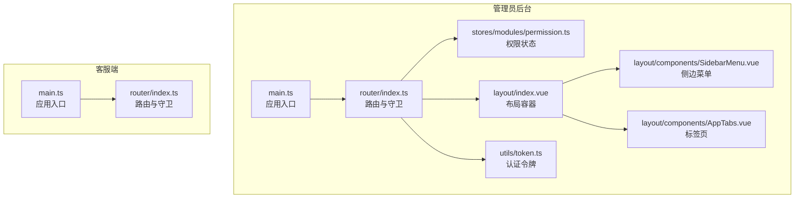
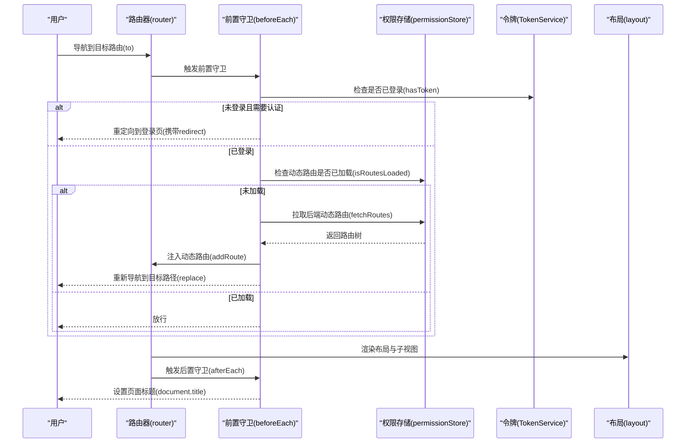
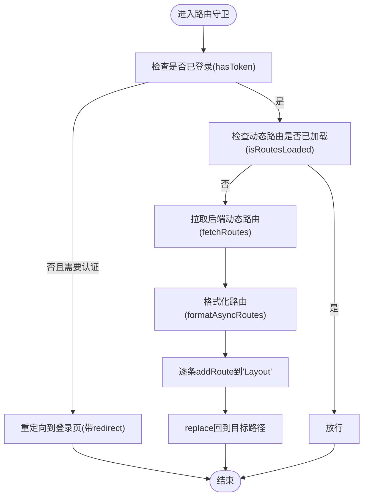
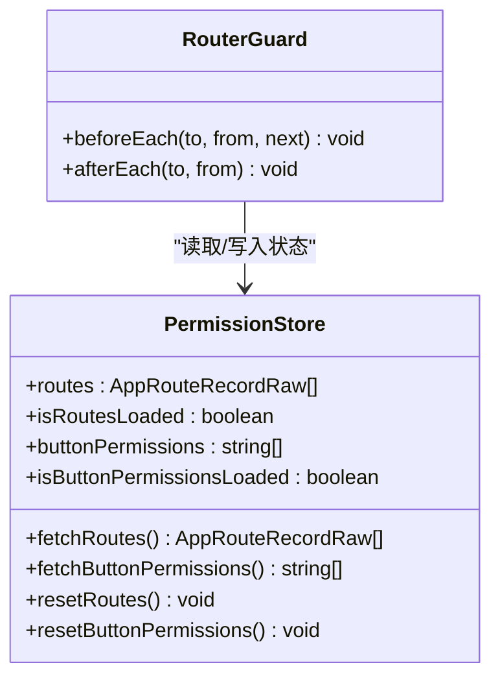
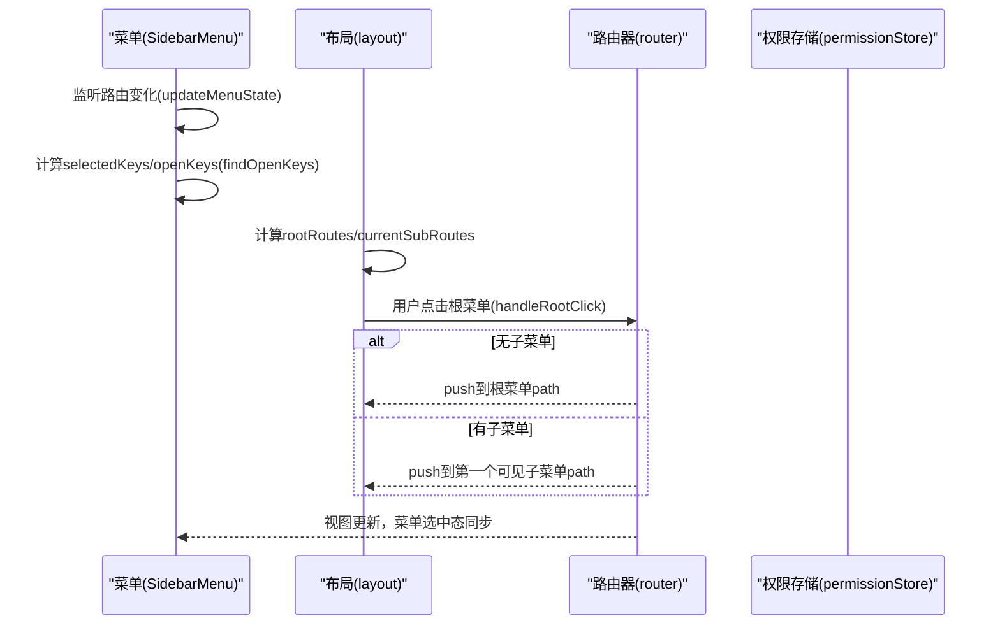
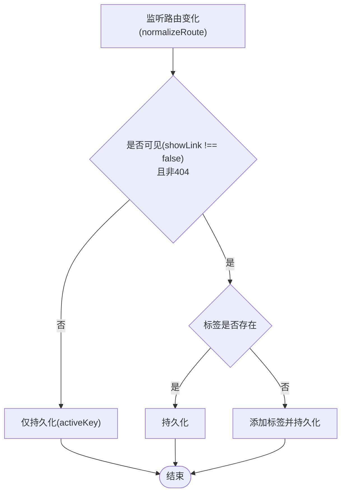
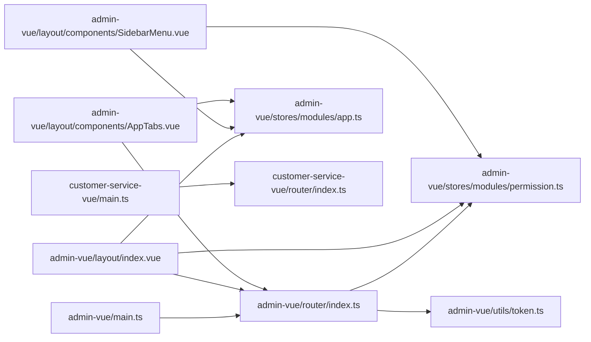

# 路由与导航

<cite>
**本文引用的文件**
- [router/index.ts](file://fast-ui/apps/admin-vue/src/router/index.ts)
- [permission.ts](file://fast-ui/apps/admin-vue/src/stores/modules/permission.ts)
- [index.vue](file://fast-ui/apps/admin-vue/src/layout/index.vue)
- [SidebarMenu.vue](file://fast-ui/apps/admin-vue/src/layout/components/SidebarMenu.vue)
- [AppTabs.vue](file://fast-ui/apps/admin-vue/src/layout/components/AppTabs.vue)
- [token.ts](file://fast-ui/apps/admin-vue/src/utils/token.ts)
- [main.ts](file://fast-ui/apps/admin-vue/src/main.ts)
- [app.ts](file://fast-ui/apps/admin-vue/src/stores/modules/app.ts)
- [router/index.ts](file://fast-ui/apps/customer-service-vue/src/router/index.ts)
- [main.ts](file://fast-ui/apps/customer-service-vue/src/main.ts)
- [package.json](file://fast-ui/apps/admin-vue/package.json)
- [package.json](file://fast-ui/apps/customer-service-vue/package.json)
</cite>

## 目录
1. [简介](#简介)
2. [项目结构](#项目结构)
3. [核心组件](#核心组件)
4. [架构总览](#架构总览)
5. [详细组件分析](#详细组件分析)
6. [依赖关系分析](#依赖关系分析)
7. [性能考量](#性能考量)
8. [故障排查指南](#故障排查指南)
9. [结论](#结论)
10. [附录](#附录)

## 简介
本文件聚焦于客户端Vue应用的路由与导航系统，围绕以下目标展开：
- 深入解析Vue Router配置策略、路由守卫机制与导航拦截逻辑
- 详解路由层级设计、嵌套路由与动态路由参数处理
- 说明页面导航实现、面包屑与标签页导航
- 分析错误页处理、404重定向与路由懒加载优化
- 提供导航菜单动态生成、权限控制与路由权限验证方案
- 给出路由性能优化技巧、预加载策略与用户体验改进建议

本仓库包含两套前端应用：管理员后台(admin-vue)与客服端(customer-service-vue)。两者均基于Vue 3 + Vue Router 5 + Pinia，采用哈希路由模式，具备完善的路由守卫、动态路由注入与菜单联动能力。

## 项目结构
- 管理员后台(admin-vue)
  - 路由定义与守卫位于 src/router/index.ts
  - 权限状态管理位于 src/stores/modules/permission.ts
  - 布局与菜单、标签页位于 src/layout 与 src/layout/components
  - 认证令牌工具位于 src/utils/token.ts
  - 应用入口位于 src/main.ts
- 客服端(customer-service-vue)
  - 路由定义位于 src/router/index.ts
  - 应用入口位于 src/main.ts

**图表来源**
- [main.ts](file://fast-ui/apps/admin-vue/src/main.ts#L1-L16)
- [index.ts](file://fast-ui/apps/admin-vue/src/router/index.ts#L1-L171)
- [permission.ts](file://fast-ui/apps/admin-vue/src/stores/modules/permission.ts#L1-L88)
- [index.vue](file://fast-ui/apps/admin-vue/src/layout/index.vue#L1-L492)
- [SidebarMenu.vue](file://fast-ui/apps/admin-vue/src/layout/components/SidebarMenu.vue#L1-L537)
- [AppTabs.vue](file://fast-ui/apps/admin-vue/src/layout/components/AppTabs.vue#L1-L361)
- [token.ts](file://fast-ui/apps/admin-vue/src/utils/token.ts#L1-L43)
- [main.ts](file://fast-ui/apps/customer-service-vue/src/main.ts#L1-L20)
- [router/index.ts](file://fast-ui/apps/customer-service-vue/src/router/index.ts#L1-L43)

**章节来源**
- [main.ts](file://fast-ui/apps/admin-vue/src/main.ts#L1-L16)
- [router/index.ts](file://fast-ui/apps/admin-vue/src/router/index.ts#L1-L171)
- [permission.ts](file://fast-ui/apps/admin-vue/src/stores/modules/permission.ts#L1-L88)
- [index.vue](file://fast-ui/apps/admin-vue/src/layout/index.vue#L1-L492)
- [SidebarMenu.vue](file://fast-ui/apps/admin-vue/src/layout/components/SidebarMenu.vue#L1-L537)
- [AppTabs.vue](file://fast-ui/apps/admin-vue/src/layout/components/AppTabs.vue#L1-L361)
- [token.ts](file://fast-ui/apps/admin-vue/src/utils/token.ts#L1-L43)
- [main.ts](file://fast-ui/apps/customer-service-vue/src/main.ts#L1-L20)
- [router/index.ts](file://fast-ui/apps/customer-service-vue/src/router/index.ts#L1-L43)

## 核心组件
- 路由器与守卫
  - 管理员后台：静态路由 + 动态路由注入；前置守卫负责登录态与动态路由加载；后置守卫负责页面标题设置
  - 客服端：静态路由 + 404兜底；前置守卫设置页面标题
- 权限状态管理
  - 提供动态路由拉取、按钮权限拉取、状态重置等能力
- 布局与菜单
  - 布局容器负责响应式侧边栏、移动端抽屉、内容区与标签页
  - 侧边菜单根据动态路由渲染，支持图标、展开/收起、选中态联动
- 标签页
  - 支持可关闭卡片式标签页、右键上下文菜单、持久化、刷新与批量关闭
- 认证令牌
  - 提供本地存储的Token读写与清理，配合路由守卫进行权限拦截

**章节来源**
- [router/index.ts](file://fast-ui/apps/admin-vue/src/router/index.ts#L1-L171)
- [permission.ts](file://fast-ui/apps/admin-vue/src/stores/modules/permission.ts#L1-L88)
- [index.vue](file://fast-ui/apps/admin-vue/src/layout/index.vue#L1-L492)
- [SidebarMenu.vue](file://fast-ui/apps/admin-vue/src/layout/components/SidebarMenu.vue#L1-L537)
- [AppTabs.vue](file://fast-ui/apps/admin-vue/src/layout/components/AppTabs.vue#L1-L361)
- [token.ts](file://fast-ui/apps/admin-vue/src/utils/token.ts#L1-L43)

## 架构总览
管理员后台采用“静态基础路由 + 动态业务路由”的双层结构：
- 静态路由：登录页、布局容器与404兜底
- 动态路由：后端返回的菜单树，经格式化后按需注入至布局容器的子路由节点
- 守卫链路：前置守卫校验登录态与动态路由加载；后置守卫统一设置页面标题

**图表来源**
- [router/index.ts](file://fast-ui/apps/admin-vue/src/router/index.ts#L107-L159)
- [permission.ts](file://fast-ui/apps/admin-vue/src/stores/modules/permission.ts#L29-L43)
- [token.ts](file://fast-ui/apps/admin-vue/src/utils/token.ts#L29-L31)
- [index.vue](file://fast-ui/apps/admin-vue/src/layout/index.vue#L60-L75)

**章节来源**
- [router/index.ts](file://fast-ui/apps/admin-vue/src/router/index.ts#L107-L168)
- [permission.ts](file://fast-ui/apps/admin-vue/src/stores/modules/permission.ts#L29-L43)
- [token.ts](file://fast-ui/apps/admin-vue/src/utils/token.ts#L29-L31)

## 详细组件分析

### 管理员后台路由与守卫
- 静态路由
  - 登录页、布局容器与首页、个人中心、404兜底
  - 布局容器内部包含children，形成嵌套路由
- 动态路由
  - 通过后端接口拉取路由树，格式化为Vue Router可识别的RouteRecordRaw
  - 组件映射：支持Layout与views目录下的组件路径，自动补齐.vue后缀与index.vue回退
  - 注入方式：以“Layout”为父节点，逐条addRoute
- 守卫策略
  - 登录拦截：未登录访问非公开路由时重定向至登录页，并携带redirect参数
  - 动态路由加载：首次访问时拉取并注入，然后replace回到目标路由
  - 标题设置：afterEach统一设置document.title

**图表来源**
- [router/index.ts](file://fast-ui/apps/admin-vue/src/router/index.ts#L107-L159)
- [permission.ts](file://fast-ui/apps/admin-vue/src/stores/modules/permission.ts#L29-L43)

**章节来源**
- [router/index.ts](file://fast-ui/apps/admin-vue/src/router/index.ts#L7-L171)
- [permission.ts](file://fast-ui/apps/admin-vue/src/stores/modules/permission.ts#L13-L104)

### 权限状态管理
- 数据模型
  - routes：后端返回的路由树
  - isRoutesLoaded：动态路由加载状态
  - buttonPermissions：按钮级权限列表
  - isButtonPermissionsLoaded：按钮权限加载状态
- 方法
  - fetchRoutes：拉取动态路由
  - fetchButtonPermissions：拉取按钮权限（按需）
  - resetRoutes/resetButtonPermissions：重置状态
- 与路由守卫协作
  - 守卫在首次导航时触发fetchRoutes，成功后formatAsyncRoutes并addRoute

**图表来源**
- [permission.ts](file://fast-ui/apps/admin-vue/src/stores/modules/permission.ts#L22-L87)
- [router/index.ts](file://fast-ui/apps/admin-vue/src/router/index.ts#L107-L168)

**章节来源**
- [permission.ts](file://fast-ui/apps/admin-vue/src/stores/modules/permission.ts#L1-L88)

### 布局容器与菜单联动
- 布局容器
  - 响应式侧边栏、移动端抽屉、内容区与标签页
  - 通过provide/inject向子组件提供reload与isMobile
- 侧边菜单
  - 根据动态路由渲染，支持图标、展开/收起、选中态联动
  - 通过findOpenKeys递归查找当前路由对应的展开项
  - 支持分栏布局下的根菜单与子菜单联动
- 菜单点击与根菜单切换
  - 根菜单点击时，若无子菜单则直接跳转；若有子菜单则跳转到首个可见子菜单

**图表来源**
- [SidebarMenu.vue](file://fast-ui/apps/admin-vue/src/layout/components/SidebarMenu.vue#L132-L196)
- [index.vue](file://fast-ui/apps/admin-vue/src/layout/index.vue#L108-L223)

**章节来源**
- [index.vue](file://fast-ui/apps/admin-vue/src/layout/index.vue#L1-L492)
- [SidebarMenu.vue](file://fast-ui/apps/admin-vue/src/layout/components/SidebarMenu.vue#L1-L537)

### 标签页导航
- 功能特性
  - 卡片式标签页、可关闭、右键上下文菜单、持久化(sessionStorage)
  - 支持刷新、关闭当前、关闭左右、关闭其他、关闭全部
- 与路由联动
  - 监听路由变化，过滤不可见路由，自动添加新标签
  - 切换标签即切换路由；关闭标签时回退到合理位置

**图表来源**
- [AppTabs.vue](file://fast-ui/apps/admin-vue/src/layout/components/AppTabs.vue#L83-L155)

**章节来源**
- [AppTabs.vue](file://fast-ui/apps/admin-vue/src/layout/components/AppTabs.vue#L1-L361)

### 客服端路由与导航
- 静态路由
  - 首页、聊天、管理、404兜底
  - 采用哈希历史记录模式
- 守卫
  - beforeEach仅设置页面标题，未做登录拦截
- 适用场景
  - 适合轻量导航与快速原型；如需权限控制，建议参考管理员后台的守卫策略

**章节来源**
- [router/index.ts](file://fast-ui/apps/customer-service-vue/src/router/index.ts#L1-L43)

### 认证令牌与登录拦截
- TokenService
  - 提供set/get/remove/has/clearAndRedirect等方法
  - 登录页访问拦截：已登录访问/login时重定向到首页
- 与守卫协作
  - 未登录且目标路由requiresAuth !== false时，重定向到登录页并携带redirect参数
  - 登录成功后，动态路由加载完成，再次导航到目标路由

**章节来源**
- [token.ts](file://fast-ui/apps/admin-vue/src/utils/token.ts#L1-L43)
- [router/index.ts](file://fast-ui/apps/admin-vue/src/router/index.ts#L107-L159)

## 依赖关系分析
- 管理员后台
  - main.ts 引入并挂载 router、pinia、Ant Design Vue
  - router 依赖 permission store 与 token service
  - layout 依赖 app store、permission store、token service
  - sidebar menu 依赖 permission store 与 app store
  - tabs 依赖 router 与 app store
- 客服端
  - main.ts 引入并挂载 router、pinia、Ant Design Vue
  - router 依赖自身静态路由

**图表来源**
- [main.ts](file://fast-ui/apps/admin-vue/src/main.ts#L1-L16)
- [router/index.ts](file://fast-ui/apps/admin-vue/src/router/index.ts#L1-L171)
- [permission.ts](file://fast-ui/apps/admin-vue/src/stores/modules/permission.ts#L1-L88)
- [token.ts](file://fast-ui/apps/admin-vue/src/utils/token.ts#L1-L43)
- [index.vue](file://fast-ui/apps/admin-vue/src/layout/index.vue#L1-L492)
- [SidebarMenu.vue](file://fast-ui/apps/admin-vue/src/layout/components/SidebarMenu.vue#L1-L537)
- [AppTabs.vue](file://fast-ui/apps/admin-vue/src/layout/components/AppTabs.vue#L1-L361)
- [app.ts](file://fast-ui/apps/admin-vue/src/stores/modules/app.ts#L1-L93)
- [main.ts](file://fast-ui/apps/customer-service-vue/src/main.ts#L1-L20)
- [router/index.ts](file://fast-ui/apps/customer-service-vue/src/router/index.ts#L1-L43)

**章节来源**
- [main.ts](file://fast-ui/apps/admin-vue/src/main.ts#L1-L16)
- [main.ts](file://fast-ui/apps/customer-service-vue/src/main.ts#L1-L20)
- [package.json](file://fast-ui/apps/admin-vue/package.json#L11-L39)
- [package.json](file://fast-ui/apps/customer-service-vue/package.json#L11-L18)

## 性能考量
- 路由懒加载
  - 通过动态import实现组件级别的懒加载，减少首屏体积
  - 客户端路由示例采用按需import组件
- 动态路由注入
  - 仅在首次访问时拉取并注入，避免重复网络请求
  - 成功注入后立即replace回到目标路由，减少二次渲染
- 标签页持久化
  - 使用sessionStorage保存标签页状态，避免频繁刷新丢失
- 菜单渲染优化
  - 通过computed与watch减少不必要的重渲染
  - 折叠状态下清空openKeys，降低DOM复杂度
- 过渡动画
  - 内容区使用淡入淡出过渡，提升视觉流畅度

**章节来源**
- [router/index.ts](file://fast-ui/apps/customer-service-vue/src/router/index.ts#L9-L15)
- [router/index.ts](file://fast-ui/apps/admin-vue/src/router/index.ts#L121-L142)
- [AppTabs.vue](file://fast-ui/apps/admin-vue/src/layout/components/AppTabs.vue#L102-L135)
- [SidebarMenu.vue](file://fast-ui/apps/admin-vue/src/layout/components/SidebarMenu.vue#L154-L196)
- [index.vue](file://fast-ui/apps/admin-vue/src/layout/index.vue#L68-L72)

## 故障排查指南
- 动态路由未生效
  - 检查permission store的isRoutesLoaded状态与fetchRoutes返回值
  - 确认formatAsyncRoutes是否正确匹配到对应组件路径
- 登录后仍被重定向到登录页
  - 检查TokenService的hasToken返回值与路由meta.requiresAuth标记
  - 确认前置守卫中对已登录用户的动态路由加载分支
- 菜单不显示或不选中
  - 检查动态路由children与meta.showLink配置
  - 确认findOpenKeys与selectedKeys计算逻辑
- 标签页异常
  - 检查normalizeRoute对404与不可见路由的过滤
  - 确认sessionStorage的序列化/反序列化逻辑
- 404页面未显示
  - 管理员后台：确认NotFound路由的meta.requiresAuth与title
  - 客服端：确认通配符路由的顺序与匹配规则

**章节来源**
- [permission.ts](file://fast-ui/apps/admin-vue/src/stores/modules/permission.ts#L29-L43)
- [router/index.ts](file://fast-ui/apps/admin-vue/src/router/index.ts#L107-L159)
- [SidebarMenu.vue](file://fast-ui/apps/admin-vue/src/layout/components/SidebarMenu.vue#L132-L196)
- [AppTabs.vue](file://fast-ui/apps/admin-vue/src/layout/components/AppTabs.vue#L83-L155)
- [router/index.ts](file://fast-ui/apps/customer-service-vue/src/router/index.ts#L24-L28)

## 结论
该路由与导航体系以“静态基础路由 + 动态业务路由”为核心，结合完善的守卫链路、权限状态管理与布局组件，实现了：
- 灵活的路由层级与嵌套
- 动态路由参数与组件映射
- 登录拦截与权限控制
- 菜单联动与标签页导航
- 错误页与404兜底
- 性能优化与用户体验提升

管理员后台的实现更为完整，建议在需要权限控制的场景优先参考其守卫与状态管理模式；客服端路由可作为轻量导航的参考，如需增强可借鉴管理员后台的动态路由与守卫策略。

## 附录
- 术语
  - 动态路由：后端下发的菜单树，运行时注入到路由器
  - 嵌套路由：布局容器的children形成父子关系
  - 守卫：beforeEach/afterEach钩子函数
  - 懒加载：按需import组件，延迟加载
- 最佳实践
  - 将公共路由与业务路由分离，便于维护
  - 对动态路由进行缓存与去重，避免重复注入
  - 在afterEach中集中处理页面标题与SEO相关元信息
  - 对菜单与标签页状态进行持久化，提升可用性
  - 在移动端与桌面端分别优化布局与交互细节