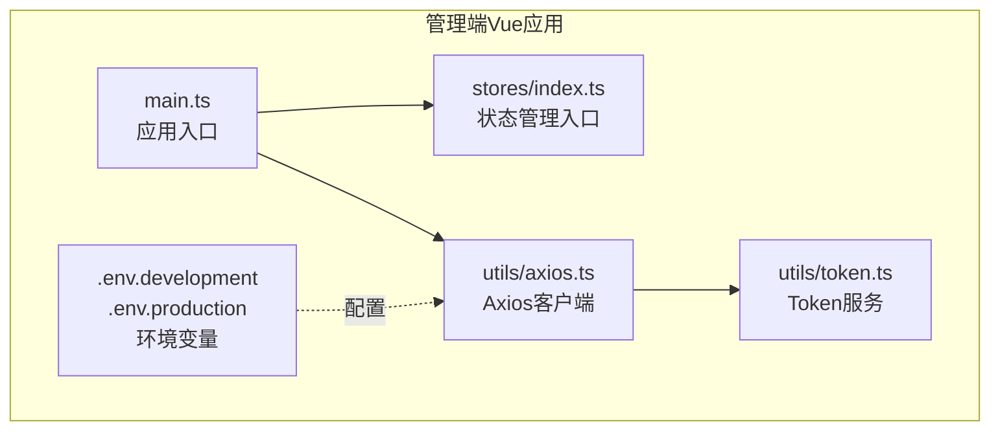
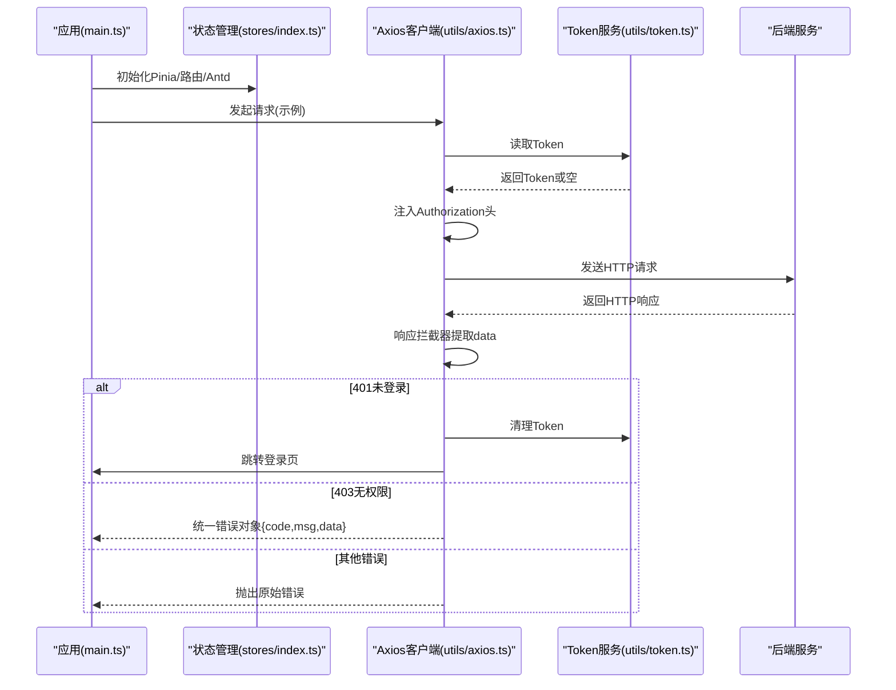
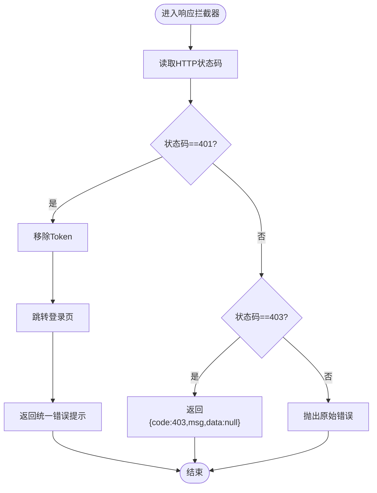
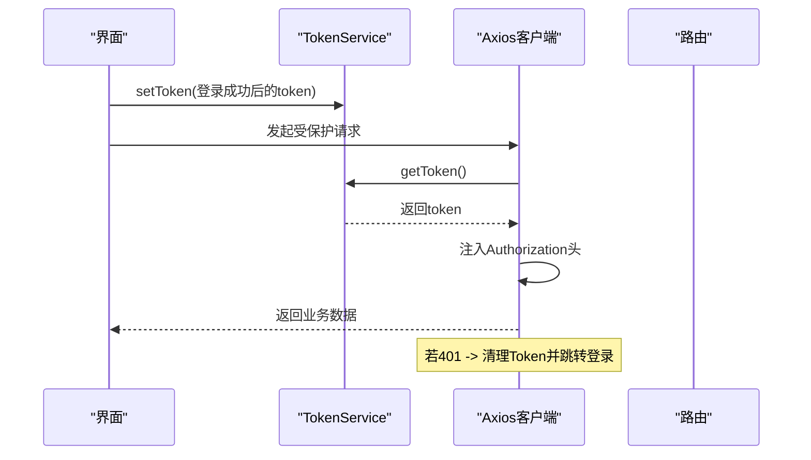
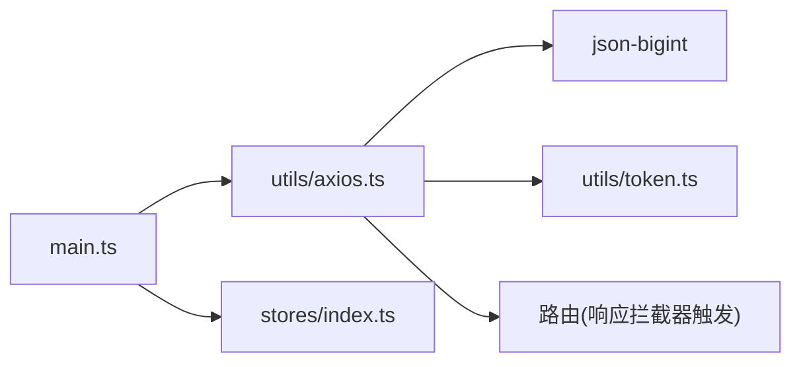

# API接口集成

<cite>
**本文引用的文件**
- [axios.ts](file://fast-ui/apps/admin-vue/src/utils/axios.ts)
- [token.ts](file://fast-ui/apps/admin-vue/src/utils/token.ts)
- [main.ts](file://fast-ui/apps/admin-vue/src/main.ts)
- [.env.development](file://fast-ui/apps/admin-vue/.env.development)
- [.env.production](file://fast-ui/apps/admin-vue/.env.production)
- [package.json](file://fast-ui/apps/admin-vue/package.json)
- [index.ts](file://fast-ui/apps/admin-vue/src/stores/index.ts)
</cite>

## 目录
1. [简介](#简介)
2. [项目结构](#项目结构)
3. [核心组件](#核心组件)
4. [架构总览](#架构总览)
5. [详细组件分析](#详细组件分析)
6. [依赖关系分析](#依赖关系分析)
7. [性能考量](#性能考量)
8. [故障排查指南](#故障排查指南)
9. [结论](#结论)
10. [附录](#附录)

## 简介
本文件面向管理端Vue应用的API接口集成，系统性梳理基于Axios的HTTP客户端配置与使用方式，重点覆盖以下方面：
- Axios实例化与基础配置（基础URL、超时、大整数解析）
- 请求拦截器与响应拦截器的职责与实现
- 统一错误处理与状态码映射（如401、403等）
- 认证流程与Token管理（本地存储、自动注入、登出清理）
- 服务端通信协议约定与数据流转
- 超时、重试与网络错误处理策略建议
- 响应数据统一处理与异常提示
- 最佳实践、性能优化与安全考虑
- 接口Mock方案、联调测试与生产部署注意事项

## 项目结构
管理端Vue应用位于 fast-ui/apps/admin-vue，API集成相关的关键文件集中在 utils 目录与环境变量配置中：
- HTTP客户端封装：src/utils/axios.ts
- Token管理：src/utils/token.ts
- 应用入口：src/main.ts
- 环境变量（开发/生产）：.env.development、.env.production
- 依赖声明：package.json
- 状态管理入口：src/stores/index.ts

图表来源
- [main.ts](file://fast-ui/apps/admin-vue/src/main.ts#L1-L16)
- [index.ts](file://fast-ui/apps/admin-vue/src/stores/index.ts#L1-L6)
- [axios.ts](file://fast-ui/apps/admin-vue/src/utils/axios.ts#L1-L60)
- [token.ts](file://fast-ui/apps/admin-vue/src/utils/token.ts#L1-L43)
- [.env.development](file://fast-ui/apps/admin-vue/.env.development#L1-L9)
- [.env.production](file://fast-ui/apps/admin-vue/.env.production#L1-L3)

章节来源
- [main.ts](file://fast-ui/apps/admin-vue/src/main.ts#L1-L16)
- [index.ts](file://fast-ui/apps/admin-vue/src/stores/index.ts#L1-L6)
- [axios.ts](file://fast-ui/apps/admin-vue/src/utils/axios.ts#L1-L60)
- [token.ts](file://fast-ui/apps/admin-vue/src/utils/token.ts#L1-L43)
- [.env.development](file://fast-ui/apps/admin-vue/.env.development#L1-L9)
- [.env.production](file://fast-ui/apps/admin-vue/.env.production#L1-L3)

## 核心组件
- Axios客户端实例
  - 基础URL来自环境变量 VITE_API_BASE_URL，默认值为 /api
  - 超时时间设置为10秒
  - 使用 json-bigint 解析响应体，避免后端大整数精度丢失
  - 请求头自动注入 Authorization: Bearer Token
  - 响应拦截器统一提取 response.data，并对常见HTTP状态进行处理
- Token服务
  - 基于 localStorage 存储 token
  - 提供 set/get/remove/has/clearAndRedirect 等方法
  - 登出时同时清理标签页缓存键
- 应用入口
  - 初始化 Pinia、路由与Ant Design Vue插件
  - 路由就绪后挂载应用

章节来源
- [axios.ts](file://fast-ui/apps/admin-vue/src/utils/axios.ts#L8-L57)
- [token.ts](file://fast-ui/apps/admin-vue/src/utils/token.ts#L3-L40)
- [main.ts](file://fast-ui/apps/admin-vue/src/main.ts#L8-L15)
- [package.json](file://fast-ui/apps/admin-vue/package.json#L32-L35)

## 架构总览
下图展示了从应用启动到API请求的整体交互路径，以及认证与错误处理的关键节点。

图表来源
- [main.ts](file://fast-ui/apps/admin-vue/src/main.ts#L8-L15)
- [index.ts](file://fast-ui/apps/admin-vue/src/stores/index.ts#L1-L6)
- [axios.ts](file://fast-ui/apps/admin-vue/src/utils/axios.ts#L25-L54)
- [token.ts](file://fast-ui/apps/admin-vue/src/utils/token.ts#L7-L24)

## 详细组件分析

### Axios客户端与拦截器
- 实例化与基础配置
  - 基础URL：优先使用 VITE_API_BASE_URL，否则回退为 /api
  - 超时：10000ms
  - 大整数解析：通过 transformResponse 使用 json-bigint 解析响应字符串，提升兼容性
- 请求拦截器
  - 从 TokenService 读取当前Token
  - 若存在则在请求头 Authorization 中附加
  - 其余场景透传配置
- 响应拦截器
  - 成功：统一返回 response.data
  - 错误：
    - 401 未登录：移除Token并跳转至登录页，返回统一错误提示
    - 403 无权限：返回统一格式 {code: 403, msg, data: null}
    - 其他错误：原样抛出

图表来源
- [axios.ts](file://fast-ui/apps/admin-vue/src/utils/axios.ts#L36-L54)

章节来源
- [axios.ts](file://fast-ui/apps/admin-vue/src/utils/axios.ts#L8-L57)

### Token管理与认证流程
- Token存储
  - 使用 localStorage 保存 token，键名固定
  - 登出时同时清理特定页面级缓存键
- 认证注入
  - 请求拦截器自动将Token写入 Authorization 头
- 登录态校验
  - 响应拦截器对401进行统一处理，触发登出与跳转
- 清理与重定向
  - 提供 clearAndRedirect 方法用于强制跳转登录页

图表来源
- [token.ts](file://fast-ui/apps/admin-vue/src/utils/token.ts#L7-L24)
- [axios.ts](file://fast-ui/apps/admin-vue/src/utils/axios.ts#L25-L34)

章节来源
- [token.ts](file://fast-ui/apps/admin-vue/src/utils/token.ts#L1-L43)
- [axios.ts](file://fast-ui/apps/admin-vue/src/utils/axios.ts#L25-L34)

### 环境变量与部署
- 开发环境
  - VITE_API_BASE_URL：指向本地或内网后端地址
  - VITE_DEFAULT_USERNAME/VITE_DEFAULT_PASSWORD：演示默认凭证（可选）
- 生产环境
  - VITE_API_BASE_URL：指向生产域名或反向代理地址
  - VITE_APP_TITLE/VITE_APP_LOGO：应用标题与图标配置

章节来源
- [.env.development](file://fast-ui/apps/admin-vue/.env.development#L1-L9)
- [.env.production](file://fast-ui/apps/admin-vue/.env.production#L1-L3)

### 数据模型与状态码映射
- 统一响应结构
  - 成功：返回后端原始 data 字段
  - 403：统一返回 {code: 403, msg, data: null}
  - 401：统一返回错误提示并触发登出
- 异常提示
  - 403：使用后端返回的 msg 或兜底文案
  - 401：统一提示“请先登录”

章节来源
- [axios.ts](file://fast-ui/apps/admin-vue/src/utils/axios.ts#L36-L54)

## 依赖关系分析
- Axios与json-bigint
  - 通过 transformResponse 对响应体进行大整数解析，避免精度丢失
- Axios与TokenService
  - 请求拦截器依赖 TokenService 获取/注入Token
  - 响应拦截器依赖 TokenService 清理无效Token
- Axios与路由
  - 响应拦截器在401时触发路由跳转
- 应用入口与状态管理
  - main.ts 初始化 Pinia，便于后续在store中集中管理登录态与全局状态

图表来源
- [axios.ts](file://fast-ui/apps/admin-vue/src/utils/axios.ts#L1-L60)
- [token.ts](file://fast-ui/apps/admin-vue/src/utils/token.ts#L1-L43)
- [main.ts](file://fast-ui/apps/admin-vue/src/main.ts#L8-L15)
- [index.ts](file://fast-ui/apps/admin-vue/src/stores/index.ts#L1-L6)

章节来源
- [axios.ts](file://fast-ui/apps/admin-vue/src/utils/axios.ts#L1-L60)
- [token.ts](file://fast-ui/apps/admin-vue/src/utils/token.ts#L1-L43)
- [main.ts](file://fast-ui/apps/admin-vue/src/main.ts#L8-L15)
- [index.ts](file://fast-ui/apps/admin-vue/src/stores/index.ts#L1-L6)

## 性能考量
- 超时控制
  - 已设置10秒超时，可根据网络环境调整
- 大整数解析
  - 使用 json-bigint 避免后端大数值精度问题，建议保持开启
- 请求头注入
  - 自动注入Authorization，避免重复手动设置
- 统一错误处理
  - 在拦截器层处理401/403，减少业务层分支判断
- 建议优化点
  - 可引入请求去重（如基于URL+参数的key）避免重复提交
  - 可增加重试策略（幂等请求）或指数退避，但需谨慎处理副作用
  - 对高频接口可考虑缓存策略（如GET接口）

## 故障排查指南
- 无法登录或频繁被踢出
  - 检查Token是否正确写入localStorage与请求头是否携带
  - 关注401处理逻辑是否触发跳转
- 403无权限
  - 查看后端返回msg字段，确认权限策略
- 大整数显示异常
  - 确认transformResponse已启用json-bigint解析
- 网络超时或不稳定
  - 调整超时阈值；必要时在上层增加重试（仅限幂等请求）
- 环境变量不生效
  - 确认VITE_API_BASE_URL在对应环境文件中配置且构建时可用

章节来源
- [axios.ts](file://fast-ui/apps/admin-vue/src/utils/axios.ts#L11-L21)
- [axios.ts](file://fast-ui/apps/admin-vue/src/utils/axios.ts#L42-L51)
- [.env.development](file://fast-ui/apps/admin-vue/.env.development#L1-L9)
- [.env.production](file://fast-ui/apps/admin-vue/.env.production#L1-L3)

## 结论
本项目在管理端Vue应用中采用简洁而稳健的API集成方案：通过Axios统一配置与拦截器实现认证、错误处理与数据规范化；借助TokenService完成Token生命周期管理；结合环境变量灵活适配开发与生产环境。整体设计具备良好的可维护性与扩展性，建议在后续迭代中补充请求去重、幂等重试与缓存策略，以进一步提升用户体验与系统稳定性。

## 附录

### 接口调用最佳实践
- 所有受保护接口均通过Axios实例发起，自动注入Token
- 成功数据统一从response.data获取，避免多层嵌套
- 对403错误按统一格式处理，前端展示友好提示
- 对401错误交由拦截器处理，确保一致的登出体验

### 性能优化与安全考虑
- 性能
  - 合理设置超时与重试策略
  - 对高频GET接口考虑缓存
- 安全
  - Token仅保存在localStorage，注意XSS防护
  - 401统一登出，防止长期持有失效Token
  - 生产环境务必使用HTTPS与安全的CORS策略

### 接口Mock方案与联调测试
- Mock方案
  - 可在开发环境使用VITE_API_BASE_URL指向本地Mock服务
  - 使用拦截器替换真实请求为本地JSON或动态生成数据
- 联调测试
  - 建议在开发环境模拟401/403场景验证拦截器行为
  - 对大整数字段进行回归测试，确保json-bigint生效

### 生产环境部署注意事项
- 确保VITE_API_BASE_URL指向正确的后端域名或反向代理
- 校验CORS与鉴权策略，避免跨域与鉴权失败
- 监控401/403发生频率，及时优化权限与提示文案