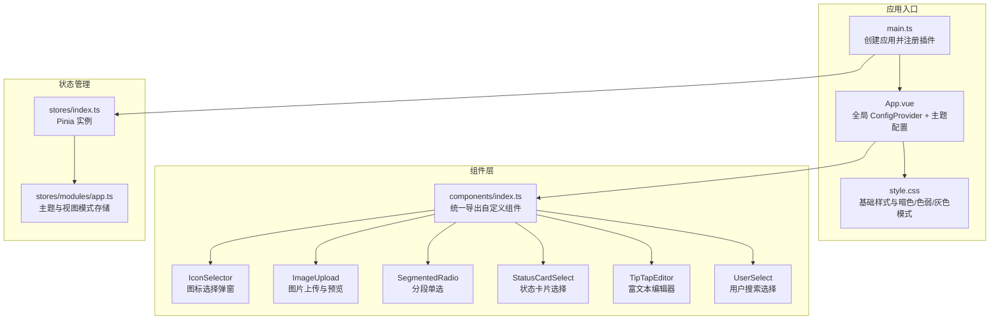
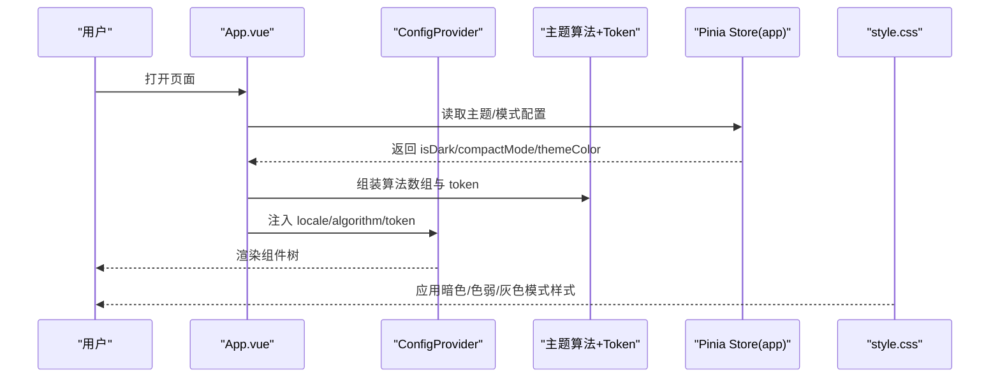
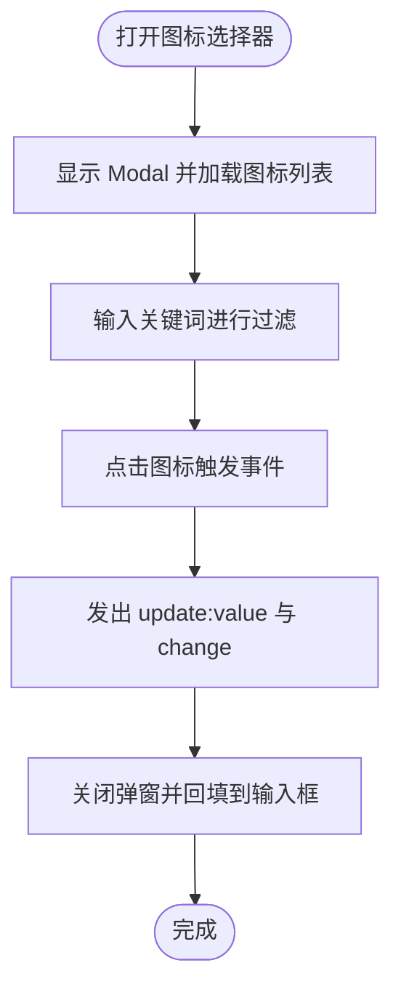
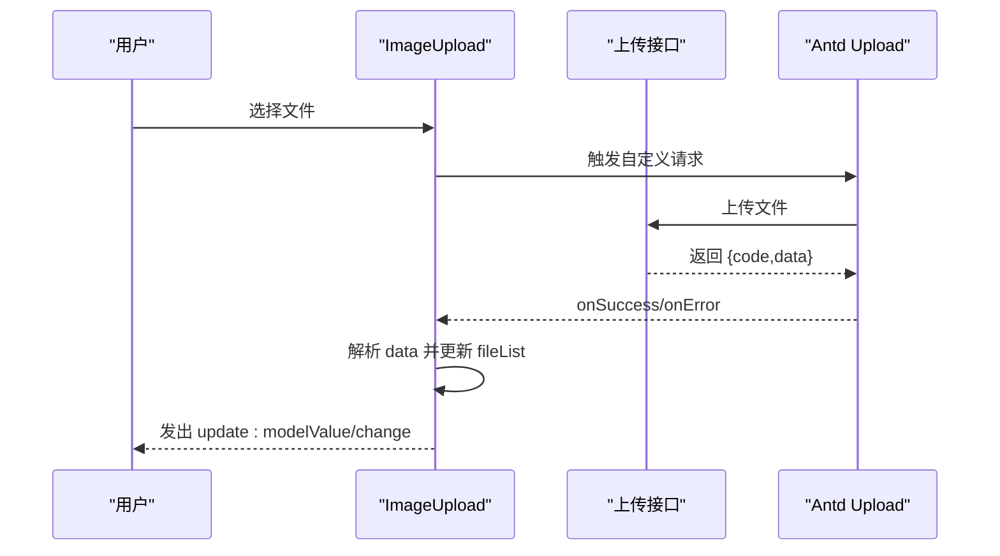
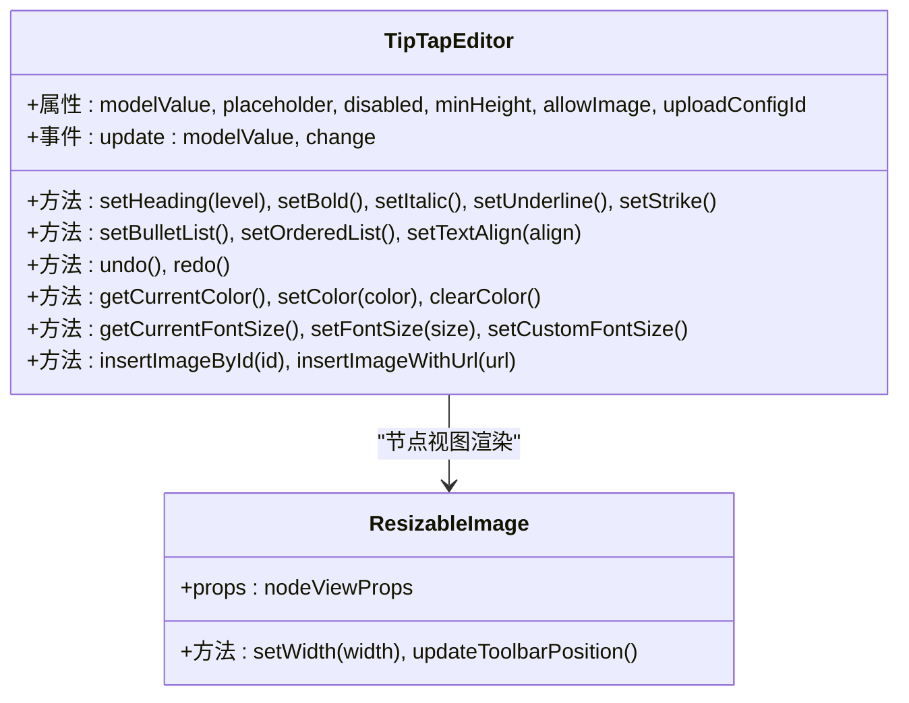
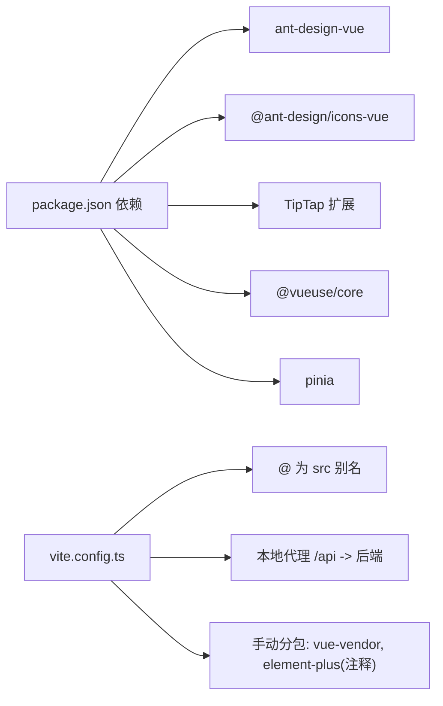

# UI组件库

<cite>
**本文引用的文件**
- [package.json](file://fast-ui/apps/admin-vue/package.json)
- [main.ts](file://fast-ui/apps/admin-vue/src/main.ts)
- [vite.config.ts](file://fast-ui/apps/admin-vue/vite.config.ts)
- [App.vue](file://fast-ui/apps/admin-vue/src/App.vue)
- [style.css](file://fast-ui/apps/admin-vue/src/style.css)
- [index.ts](file://fast-ui/apps/admin-vue/src/components/index.ts)
- [IconSelector/index.vue](file://fast-ui/apps/admin-vue/src/components/IconSelector/index.vue)
- [ImageUpload/index.vue](file://fast-ui/apps/admin-vue/src/components/ImageUpload/index.vue)
- [SegmentedRadio/index.vue](file://fast-ui/apps/admin-vue/src/components/SegmentedRadio/index.vue)
- [StatusCardSelect/index.vue](file://fast-ui/apps/admin-vue/src/components/StatusCardSelect/index.vue)
- [TipTapEditor/index.vue](file://fast-ui/apps/admin-vue/src/components/TipTapEditor/index.vue)
- [TipTapEditor/viewer.vue](file://fast-ui/apps/admin-vue/src/components/TipTapEditor/viewer.vue)
- [UserSelect/index.vue](file://fast-ui/apps/admin-vue/src/components/UserSelect/index.vue)
- [stores/index.ts](file://fast-ui/apps/admin-vue/src/stores/index.ts)
- [stores/modules/app.ts](file://fast-ui/apps/admin-vue/src/stores/modules/app.ts)
</cite>

## 目录
1. [简介](#简介)
2. [项目结构](#项目结构)
3. [核心组件](#核心组件)
4. [架构总览](#架构总览)
5. [组件详解](#组件详解)
6. [依赖关系分析](#依赖关系分析)
7. [性能与可访问性](#性能与可访问性)
8. [故障排查指南](#故障排查指南)
9. [结论](#结论)
10. [附录](#附录)

## 简介
本文件为基于 Ant Design Vue 的管理端 Vue 应用 UI 组件库的技术文档，聚焦于组件集成方案、主题定制与样式覆盖策略，以及自定义组件的设计理念与实现细节。内容涵盖图标选择器、图片上传、分段单选、状态卡片选择与富文本编辑器等组件的属性接口、事件处理、插槽使用、响应式设计、国际化支持与无障碍访问建议，并提供组件开发规范、样式定制方案与性能优化技巧。

## 项目结构
该 UI 组件库位于快应用工程的前端子项目中，采用 Vite + Vue 3 + TypeScript 技术栈，通过 Pinia 进行状态管理，Ant Design Vue 提供基础 UI 能力，同时集成了 TipTap 富文本编辑器与多种图标扩展。

图表来源
- [main.ts](file://fast-ui/apps/admin-vue/src/main.ts#L1-L16)
- [App.vue](file://fast-ui/apps/admin-vue/src/App.vue#L1-L40)
- [style.css](file://fast-ui/apps/admin-vue/src/style.css#L1-L38)
- [index.ts](file://fast-ui/apps/admin-vue/src/components/index.ts#L1-L8)
- [stores/index.ts](file://fast-ui/apps/admin-vue/src/stores/index.ts#L1-L6)
- [stores/modules/app.ts](file://fast-ui/apps/admin-vue/src/stores/modules/app.ts#L1-L93)

章节来源
- [package.json](file://fast-ui/apps/admin-vue/package.json#L1-L50)
- [main.ts](file://fast-ui/apps/admin-vue/src/main.ts#L1-L16)
- [vite.config.ts](file://fast-ui/apps/admin-vue/vite.config.ts#L1-L56)
- [App.vue](file://fast-ui/apps/admin-vue/src/App.vue#L1-L40)
- [style.css](file://fast-ui/apps/admin-vue/src/style.css#L1-L38)
- [index.ts](file://fast-ui/apps/admin-vue/src/components/index.ts#L1-L8)
- [stores/index.ts](file://fast-ui/apps/admin-vue/src/stores/index.ts#L1-L6)
- [stores/modules/app.ts](file://fast-ui/apps/admin-vue/src/stores/modules/app.ts#L1-L93)

## 核心组件
- 图标选择器：提供 Ant Design 图标库的线框、实底、双色风格分类浏览与搜索，支持选择后回填到表单项。
- 图片上传：基于 Ant Design Upload，支持简单上传、多图限制、预览、进度回调与值类型（URL/ID）切换。
- 分段单选：轻量级替代 Radio 的卡片式分段控件，支持图标与标签展示。
- 状态卡片选择：以卡片形式展示状态项，突出成功/错误/警告/信息/默认等类型，便于快速选择。
- 富文本编辑器：基于 TipTap，提供标题、加粗、斜体、下划线、删除线、列表、对齐、颜色、字体大小、表格、拖拽光标、图片插入与尺寸调整等能力。
- 用户选择器：带搜索防抖的远程用户选择，支持占位、清空与值规范化。

章节来源
- [IconSelector/index.vue](file://fast-ui/apps/admin-vue/src/components/IconSelector/index.vue#L1-L201)
- [ImageUpload/index.vue](file://fast-ui/apps/admin-vue/src/components/ImageUpload/index.vue#L1-L184)
- [SegmentedRadio/index.vue](file://fast-ui/apps/admin-vue/src/components/SegmentedRadio/index.vue#L1-L70)
- [StatusCardSelect/index.vue](file://fast-ui/apps/admin-vue/src/components/StatusCardSelect/index.vue#L1-L95)
- [TipTapEditor/index.vue](file://fast-ui/apps/admin-vue/src/components/TipTapEditor/index.vue#L1-L800)
- [UserSelect/index.vue](file://fast-ui/apps/admin-vue/src/components/UserSelect/index.vue#L1-L109)

## 架构总览
应用通过全局 ConfigProvider 注入 Ant Design 的主题算法与语言环境；主题变量由 Pinia 存储并通过 CSS 变量动态注入；组件库通过统一出口集中导出，便于按需引入与版本管理。

图表来源
- [App.vue](file://fast-ui/apps/admin-vue/src/App.vue#L1-L40)
- [stores/modules/app.ts](file://fast-ui/apps/admin-vue/src/stores/modules/app.ts#L1-L93)
- [style.css](file://fast-ui/apps/admin-vue/src/style.css#L1-L38)

章节来源
- [App.vue](file://fast-ui/apps/admin-vue/src/App.vue#L1-L40)
- [stores/modules/app.ts](file://fast-ui/apps/admin-vue/src/stores/modules/app.ts#L1-L93)
- [style.css](file://fast-ui/apps/admin-vue/src/style.css#L1-L38)

## 组件详解

### 图标选择器（IconSelector）
- 设计理念：将 Ant Design 图标库按风格分类展示，支持搜索过滤，点击即选，提升图标选择效率。
- 关键实现要点：
  - 使用动态组件渲染图标，支持三种风格列表与搜索过滤。
  - 通过 Modal 容器承载，避免影响主界面布局。
  - 支持双向绑定与 change 事件，便于与表单联动。
- 属性接口
  - value: 字符串，当前选中的图标名称
- 事件
  - update:value: 选中图标后的 v-model 更新
  - change: 选中图标后的回调
- 插槽
  - 无内置具名插槽
- 样式覆盖
  - 通过 scoped 样式控制网格布局、激活态与滚动条样式；支持暗色模式适配。

图表来源
- [IconSelector/index.vue](file://fast-ui/apps/admin-vue/src/components/IconSelector/index.vue#L1-L201)

章节来源
- [IconSelector/index.vue](file://fast-ui/apps/admin-vue/src/components/IconSelector/index.vue#L1-L201)

### 图片上传（ImageUpload）
- 设计理念：封装 Ant Design Upload，提供简单上传、多图限制、预览、进度反馈与值类型（URL/ID）转换。
- 关键实现要点：
  - 支持 modelValue 与 valueType 双向映射，自动识别 URL 或文件 ID。
  - 自定义请求函数对接后端简单上传接口，支持进度回调。
  - 预览支持本地 Base64 生成与远端图片展示。
- 属性接口
  - modelValue: 支持字符串/数组，表示已上传的值
  - valueType: 'url' | 'id'，决定回填值类型
  - limit: 数字，最大上传数量
  - disabled: 布尔，禁用状态
- 事件
  - update:modelValue: 值变更
  - change: 值变更回调
- 插槽
  - 无内置具名插槽
- 样式覆盖
  - 使用深度选择器限制图片卡片尺寸，保证视觉一致性。

图表来源
- [ImageUpload/index.vue](file://fast-ui/apps/admin-vue/src/components/ImageUpload/index.vue#L125-L144)

章节来源
- [ImageUpload/index.vue](file://fast-ui/apps/admin-vue/src/components/ImageUpload/index.vue#L1-L184)

### 分段单选（SegmentedRadio）
- 设计理念：以卡片式布局替代传统 Radio，适合少量选项的快速选择，支持图标与文字组合。
- 关键实现要点：
  - 接收选项数组，每个选项包含 value、label、icon。
  - 通过 active 类名高亮当前选中项。
- 属性接口
  - value: 当前值
  - options: 选项数组
- 事件
  - update:value / change
- 插槽
  - 无内置具名插槽
- 样式覆盖
  - 通过 scoped 样式控制容器间距、圆角、阴影与激活态配色。

章节来源
- [SegmentedRadio/index.vue](file://fast-ui/apps/admin-vue/src/components/SegmentedRadio/index.vue#L1-L70)

### 状态卡片选择（StatusCardSelect）
- 设计理念：以卡片形式直观展示不同状态，结合图标与文案，提升选择效率。
- 关键实现要点：
  - 选项包含 value、title、desc、icon、type（success/error/warning/info/default）。
  - 通过类型类名控制图标颜色，激活态高亮。
- 属性接口
  - value: 当前值
  - options: 选项数组
- 事件
  - update:value / change
- 插槽
  - 无内置具名插槽
- 样式覆盖
  - 通过 scoped 样式控制卡片边框、内边距、图标尺寸与文本排版。

章节来源
- [StatusCardSelect/index.vue](file://fast-ui/apps/admin-vue/src/components/StatusCardSelect/index.vue#L1-L95)

### 富文本编辑器（TipTapEditor）
- 设计理念：基于 TipTap 提供丰富的文本编辑能力，支持图片插入（文件 ID/URL）、表格、颜色、字体大小、对齐、拖拽光标与图片尺寸调整。
- 关键实现要点：
  - 使用 useEditor 初始化编辑器，启用基础扩展与自定义扩展（如可调整宽度的图片节点）。
  - 支持拖拽与粘贴图片触发上传流程，自动插入图片节点。
  - 表格右键菜单提供行列增删、合并拆分等操作。
  - 通过 CSS 变量与主题算法实现与整体风格一致的外观。
- 属性接口
  - modelValue: 初始 HTML 内容
  - placeholder: 占位提示
  - disabled: 禁用编辑
  - minHeight: 最小高度
  - allowImage: 是否允许图片
  - uploadConfigId: 上传配置 ID（透传给上传接口）
- 事件
  - update:modelValue / change
- 插槽
  - 无内置具名插槽
- 样式覆盖
  - 编辑器容器类名与滚动条样式通过 scoped 控制，确保与主题一致。

图表来源
- [TipTapEditor/index.vue](file://fast-ui/apps/admin-vue/src/components/TipTapEditor/index.vue#L1-L800)

章节来源
- [TipTapEditor/index.vue](file://fast-ui/apps/admin-vue/src/components/TipTapEditor/index.vue#L1-L800)
- [TipTapEditor/viewer.vue](file://fast-ui/apps/admin-vue/src/components/TipTapEditor/viewer.vue)

### 用户选择器（UserSelect）
- 设计理念：提供远程用户搜索与选择，支持占位、清空与值规范化。
- 关键实现要点：
  - 输入搜索关键词后进行防抖查询，减少请求压力。
  - 选项展示用户名与昵称，便于识别。
- 属性接口
  - value: 当前值
  - placeholder: 占位提示
- 事件
  - update:value / change
- 插槽
  - 无内置具名插槽
- 样式覆盖
  - 通过 scoped 样式控制选项布局与字号。

章节来源
- [UserSelect/index.vue](file://fast-ui/apps/admin-vue/src/components/UserSelect/index.vue#L1-L109)

## 依赖关系分析
- 组件库依赖
  - Ant Design Vue：提供基础 UI 组件与主题系统
  - @ant-design/icons-vue：提供图标集合
  - TipTap 生态：提供富文本编辑能力
  - @vueuse/core：提供持久化存储与工具函数
  - Pinia：提供状态管理
- 构建与打包
  - Vite 提供开发服务器与构建配置，支持别名与代理
  - Rollup 输出优化，手动分包策略提升缓存命中率

图表来源
- [package.json](file://fast-ui/apps/admin-vue/package.json#L11-L40)
- [vite.config.ts](file://fast-ui/apps/admin-vue/vite.config.ts#L21-L54)

章节来源
- [package.json](file://fast-ui/apps/admin-vue/package.json#L1-L50)
- [vite.config.ts](file://fast-ui/apps/admin-vue/vite.config.ts#L1-L56)

## 性能与可访问性
- 性能优化
  - 图标选择器：使用虚拟滚动与搜索过滤，减少一次性渲染的节点数量
  - 图片上传：仅在需要时生成 Base64 预览，避免大图内存占用
  - 富文本编辑器：按需启用扩展，避免不必要的功能导致体积增大
  - 构建层面：利用 Vite 与 Rollup 的代码分割策略，减少首屏体积
- 可访问性（建议）
  - 为按钮与交互元素提供键盘可达性与焦点可见性
  - 为图片与图标提供语义化描述（title 或 aria-label）
  - 保持对比度满足 WCAG 基本要求，配合暗色/色弱/灰色模式增强可用性

## 故障排查指南
- 图标选择器无法显示或搜索无效
  - 检查图标对象是否正确导入与挂载
  - 确认搜索关键词大小写与过滤逻辑
- 图片上传失败或进度不更新
  - 检查上传接口返回格式与状态码
  - 确认自定义请求函数与进度回调链路
- 富文本编辑器无法插入图片
  - 检查 beforeUpload 校验与上传接口返回字段
  - 确认图片节点扩展与节点视图渲染是否生效
- 主题不生效或切换异常
  - 检查 ConfigProvider 的 theme 注入与算法数组拼接
  - 确认 CSS 变量是否被正确设置与覆盖

章节来源
- [IconSelector/index.vue](file://fast-ui/apps/admin-vue/src/components/IconSelector/index.vue#L110-L130)
- [ImageUpload/index.vue](file://fast-ui/apps/admin-vue/src/components/ImageUpload/index.vue#L125-L144)
- [TipTapEditor/index.vue](file://fast-ui/apps/admin-vue/src/components/TipTapEditor/index.vue#L507-L564)
- [App.vue](file://fast-ui/apps/admin-vue/src/App.vue#L9-L33)
- [stores/modules/app.ts](file://fast-ui/apps/admin-vue/src/stores/modules/app.ts#L62-L77)

## 结论
该 UI 组件库以 Ant Design Vue 为基础，结合自定义组件与 TipTap 富文本编辑器，形成了一套完整且可扩展的管理端组件体系。通过 Pinia 管理主题与视图模式，配合 Vite 的构建优化，实现了良好的开发体验与运行性能。建议在后续迭代中进一步完善无障碍支持与国际化文案，持续优化组件的可测试性与可维护性。

## 附录
- 组件统一导出入口
  - 通过 components/index.ts 将各组件集中导出，便于按需引入与版本管理
- 开发规范建议
  - 统一使用 TypeScript 接口定义 props 与 emits
  - 事件命名遵循 update:value 与 change 的约定
  - 样式优先使用 scoped 与 CSS 变量，避免全局污染
  - 对外暴露的组件应提供最小可行的属性集与清晰的文档示例

章节来源
- [index.ts](file://fast-ui/apps/admin-vue/src/components/index.ts#L1-L8)