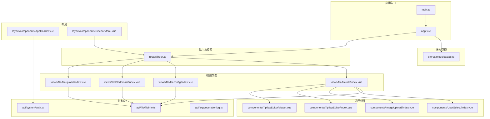
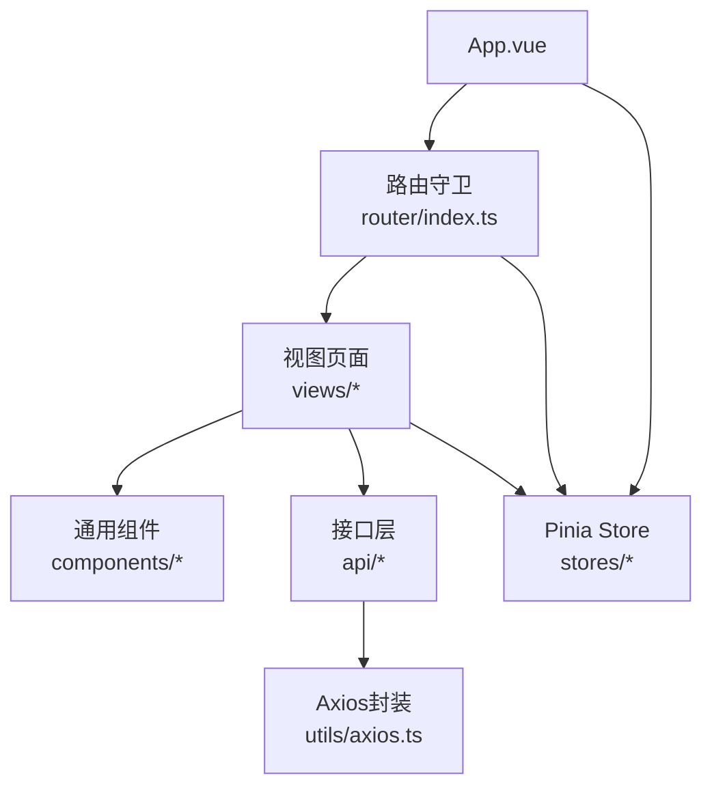
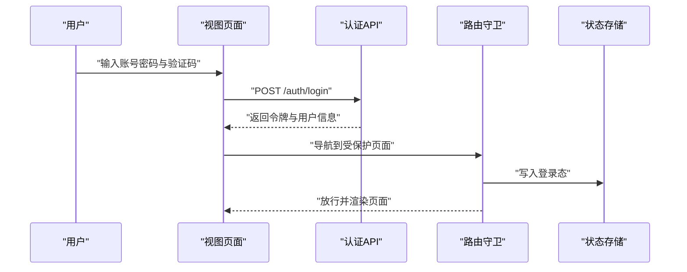
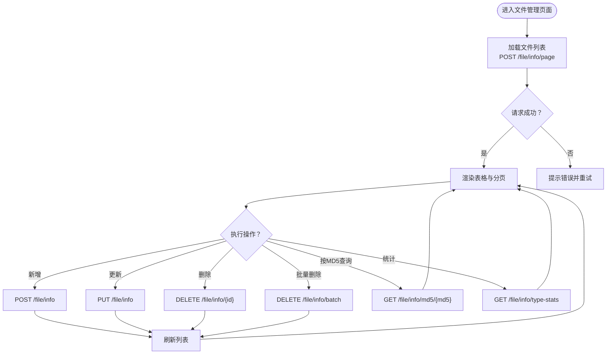
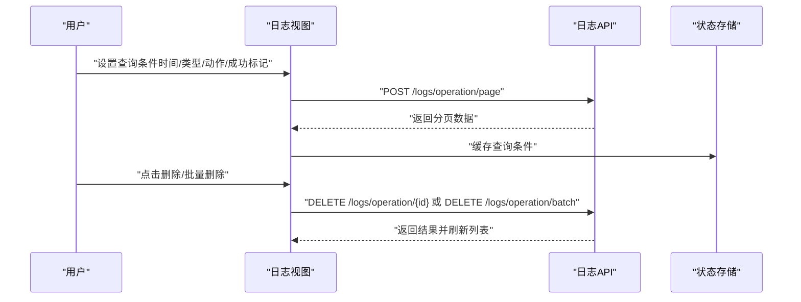
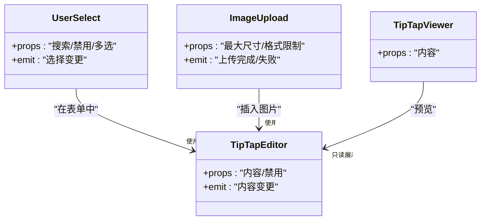
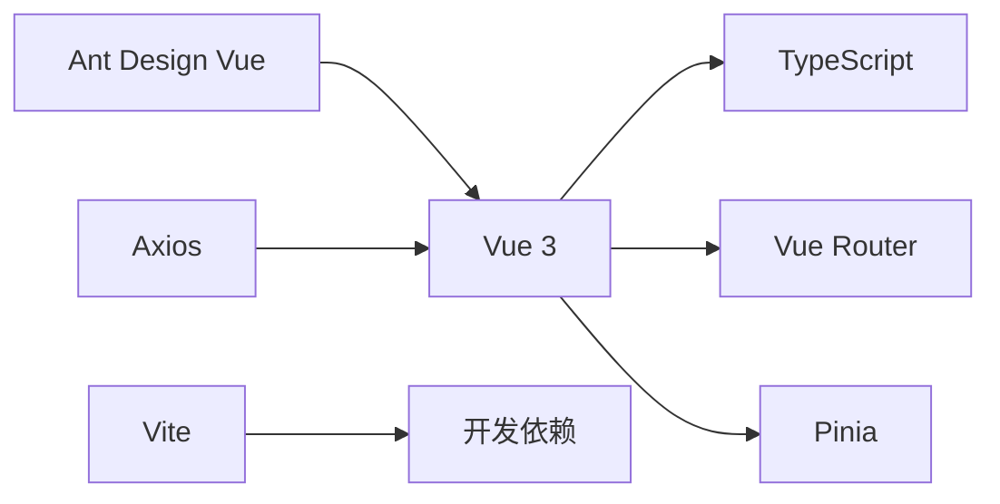

# 业务功能模块

<cite>
**本文引用的文件**
- [package.json](file://fast-ui/apps/admin-vue/package.json)
- [main.ts](file://fast-ui/apps/admin-vue/src/main.ts)
- [App.vue](file://fast-ui/apps/admin-vue/src/App.vue)
- [router/index.ts](file://fast-ui/apps/admin-vue/src/router/index.ts)
- [stores/modules/app.ts](file://fast-ui/apps/admin-vue/src/stores/modules/app.ts)
- [api/system/auth.ts](file://fast-ui/apps/admin-vue/src/api/system/auth.ts)
- [api/file/fileinfo.ts](file://fast-ui/apps/admin-vue/src/api/file/fileinfo.ts)
- [api/logs/operationlog.ts](file://fast-ui/apps/admin-vue/src/api/logs/operationlog.ts)
- [views/file/fileinfo/index.vue](file://fast-ui/apps/admin-vue/src/views/file/fileinfo/index.vue)
- [views/file/fileconfig/index.vue](file://fast-ui/apps/admin-vue/src/views/file/fileconfig/index.vue)
- [views/file/filedomain/index.vue](file://fast-ui/apps/admin-vue/src/views/file/filedomain/index.vue)
- [views/file/fileupload/index.vue](file://fast-ui/apps/admin-vue/src/views/file/fileupload/index.vue)
- [layout/components/SidebarMenu.vue](file://fast-ui/apps/admin-vue/src/layout/components/SidebarMenu.vue)
- [layout/components/AppHeader.vue](file://fast-ui/apps/admin-vue/src/layout/components/AppHeader.vue)
- [components/UserSelect/index.vue](file://fast-ui/apps/admin-vue/src/components/UserSelect/index.vue)
- [components/ImageUpload/index.vue](file://fast-ui/apps/admin-vue/src/components/ImageUpload/index.vue)
- [components/TipTapEditor/index.vue](file://fast-ui/apps/admin-vue/src/components/TipTapEditor/index.vue)
- [components/TipTapEditor/viewer.vue](file://fast-ui/apps/admin-vue/src/components/TipTapEditor/viewer.vue)
</cite>

## 目录
1. [引言](#引言)
2. [项目结构](#项目结构)
3. [核心组件](#核心组件)
4. [架构总览](#架构总览)
5. [详细组件分析](#详细组件分析)
6. [依赖关系分析](#依赖关系分析)
7. [性能考虑](#性能考虑)
8. [故障排查指南](#故障排查指南)
9. [结论](#结论)
10. [附录](#附录)

## 引言
本文件面向管理端Vue应用的业务功能模块，聚焦系统管理、文件管理、日志管理三大核心模块，系统性梳理数据模型、CRUD与权限控制、文件上传下载与分类、操作日志记录与审计追踪，并给出组件设计模式、数据流管理与用户体验优化建议，以及模块间协作、状态同步与错误处理策略。

## 项目结构
管理端基于Vue 3 + TypeScript + Vite + Pinia + Vue Router + Ant Design Vue构建，采用按功能域划分的目录组织方式：
- 应用入口与全局配置：入口、主题与布局状态、国际化与UI框架注册
- 路由与权限：静态路由与动态路由注入、路由守卫与鉴权
- API层：按业务域分组的接口定义（系统认证、文件、日志等）
- 视图层：各业务模块页面（文件管理四大页面）
- 组件层：通用业务组件（用户选择器、图片上传、编辑器等）
- 布局层：顶部导航与侧边菜单

图表来源
- [main.ts](file://fast-ui/apps/admin-vue/src/main.ts#L1-L16)
- [App.vue](file://fast-ui/apps/admin-vue/src/App.vue#L1-L41)
- [router/index.ts](file://fast-ui/apps/admin-vue/src/router/index.ts#L1-L171)
- [stores/modules/app.ts](file://fast-ui/apps/admin-vue/src/stores/modules/app.ts#L1-L93)
- [api/system/auth.ts](file://fast-ui/apps/admin-vue/src/api/system/auth.ts#L1-L64)
- [api/file/fileinfo.ts](file://fast-ui/apps/admin-vue/src/api/file/fileinfo.ts#L1-L114)
- [api/logs/operationlog.ts](file://fast-ui/apps/admin-vue/src/api/logs/operationlog.ts#L1-L97)
- [views/file/fileinfo/index.vue](file://fast-ui/apps/admin-vue/src/views/file/fileinfo/index.vue)
- [views/file/fileconfig/index.vue](file://fast-ui/apps/admin-vue/src/views/file/fileconfig/index.vue)
- [views/file/filedomain/index.vue](file://fast-ui/apps/admin-vue/src/views/file/filedomain/index.vue)
- [views/file/fileupload/index.vue](file://fast-ui/apps/admin-vue/src/views/file/fileupload/index.vue)
- [layout/components/AppHeader.vue](file://fast-ui/apps/admin-vue/src/layout/components/AppHeader.vue)
- [layout/components/SidebarMenu.vue](file://fast-ui/apps/admin-vue/src/layout/components/SidebarMenu.vue)
- [components/UserSelect/index.vue](file://fast-ui/apps/admin-vue/src/components/UserSelect/index.vue)
- [components/ImageUpload/index.vue](file://fast-ui/apps/admin-vue/src/components/ImageUpload/index.vue)
- [components/TipTapEditor/index.vue](file://fast-ui/apps/admin-vue/src/components/TipTapEditor/index.vue)
- [components/TipTapEditor/viewer.vue](file://fast-ui/apps/admin-vue/src/components/TipTapEditor/viewer.vue)

章节来源
- [package.json](file://fast-ui/apps/admin-vue/package.json#L1-L50)
- [main.ts](file://fast-ui/apps/admin-vue/src/main.ts#L1-L16)
- [App.vue](file://fast-ui/apps/admin-vue/src/App.vue#L1-L41)
- [router/index.ts](file://fast-ui/apps/admin-vue/src/router/index.ts#L1-L171)
- [stores/modules/app.ts](file://fast-ui/apps/admin-vue/src/stores/modules/app.ts#L1-L93)

## 核心组件
- 应用入口与全局配置：创建Vue实例、注册Pinia/Router/Antd；在App根组件中统一注入Antd主题与本地化
- 状态管理：Pinia Store集中管理主题、布局、颜色模式、紧凑模式、标签页与面包屑等全局偏好
- 路由与权限：静态路由+动态路由注入；前置守卫负责登录态校验与动态路由加载；后置守卫设置页面标题
- 业务API：按域抽象接口，统一返回结构体，便于视图层统一处理
- 视图与组件：文件管理四大页面与通用业务组件复用，提升开发效率与一致性

章节来源
- [main.ts](file://fast-ui/apps/admin-vue/src/main.ts#L1-L16)
- [App.vue](file://fast-ui/apps/admin-vue/src/App.vue#L1-L41)
- [stores/modules/app.ts](file://fast-ui/apps/admin-vue/src/stores/modules/app.ts#L1-L93)
- [router/index.ts](file://fast-ui/apps/admin-vue/src/router/index.ts#L1-L171)
- [api/system/auth.ts](file://fast-ui/apps/admin-vue/src/api/system/auth.ts#L1-L64)
- [api/file/fileinfo.ts](file://fast-ui/apps/admin-vue/src/api/file/fileinfo.ts#L1-L114)
- [api/logs/operationlog.ts](file://fast-ui/apps/admin-vue/src/api/logs/operationlog.ts#L1-L97)

## 架构总览
前端采用“视图-组件-状态-路由-接口”分层：
- 视图层：承载业务页面，组合通用组件与业务组件
- 组件层：封装可复用UI与交互逻辑（如用户选择、图片上传、富文本编辑器）
- 状态层：Pinia集中管理全局偏好与主题；路由守卫维护登录态与动态路由
- 接口层：统一Axios封装，按域导出REST接口，返回统一封装结果
- 路由层：静态路由+动态路由，支持后端返回的菜单树转换为前端路由

图表来源
- [router/index.ts](file://fast-ui/apps/admin-vue/src/router/index.ts#L1-L171)
- [stores/modules/app.ts](file://fast-ui/apps/admin-vue/src/stores/modules/app.ts#L1-L93)
- [App.vue](file://fast-ui/apps/admin-vue/src/App.vue#L1-L41)
- [api/file/fileinfo.ts](file://fast-ui/apps/admin-vue/src/api/file/fileinfo.ts#L1-L114)
- [api/logs/operationlog.ts](file://fast-ui/apps/admin-vue/src/api/logs/operationlog.ts#L1-L97)

## 详细组件分析

### 系统管理与认证模块
- 数据模型
  - 登录参数：用户名、密码、验证码键、验证码
  - 登录返回：令牌、用户名、昵称、头像
  - 用户信息：用户标识、用户名、昵称、头像
  - 验证码：验证码键、验证码图片
- CRUD与权限
  - 登录/登出/获取用户信息接口
  - 路由守卫在进入受保护路由前校验令牌，必要时重定向至登录页
- 设计要点
  - 统一的请求拦截与响应处理，便于错误提示与统一处理
  - 登录成功后可触发动态路由加载，实现菜单与页面权限联动

图表来源
- [api/system/auth.ts](file://fast-ui/apps/admin-vue/src/api/system/auth.ts#L1-L64)
- [router/index.ts](file://fast-ui/apps/admin-vue/src/router/index.ts#L107-L159)

章节来源
- [api/system/auth.ts](file://fast-ui/apps/admin-vue/src/api/system/auth.ts#L1-L64)
- [router/index.ts](file://fast-ui/apps/admin-vue/src/router/index.ts#L1-L171)

### 文件管理模块
- 数据模型
  - 文件信息：文件名、大小、类型、MD5、状态、存储策略、访问路径
  - 分页与查询：页码、条数、文件名、类型、状态、MD5
  - 统计：按类型统计文件数量与占用空间
- CRUD与权限
  - 列表分页查询、详情查询、按MD5去重查询
  - 新增、更新、删除、批量删除
  - 与上传模块配合，支持上传后回填文件元信息
- 设计要点
  - 通过MD5去重避免重复存储
  - 支持按类型统计，辅助容量治理
  - 与通用组件结合（用户选择、图片上传、富文本）提升编辑体验

图表来源
- [api/file/fileinfo.ts](file://fast-ui/apps/admin-vue/src/api/file/fileinfo.ts#L1-L114)
- [views/file/fileinfo/index.vue](file://fast-ui/apps/admin-vue/src/views/file/fileinfo/index.vue)

章节来源
- [api/file/fileinfo.ts](file://fast-ui/apps/admin-vue/src/api/file/fileinfo.ts#L1-L114)
- [views/file/fileinfo/index.vue](file://fast-ui/apps/admin-vue/src/views/file/fileinfo/index.vue)
- [views/file/fileconfig/index.vue](file://fast-ui/apps/admin-vue/src/views/file/fileconfig/index.vue)
- [views/file/filedomain/index.vue](file://fast-ui/apps/admin-vue/src/views/file/filedomain/index.vue)
- [views/file/fileupload/index.vue](file://fast-ui/apps/admin-vue/src/views/file/fileupload/index.vue)

### 日志管理模块
- 数据模型
  - 操作日志：描述、类型、动作、请求参数、响应数据、耗时、IP、URL、HTTP方法、类名、方法名、成功标记、错误信息、创建人、创建时间
  - 查询条件：分页、描述、类型、动作、IP、URL、成功标记、创建人、起止时间
- CRUD与权限
  - 列表分页查询、详情查询、删除、批量删除
  - 支持按多维条件筛选，便于审计追踪
- 设计要点
  - 结合后端切面注解自动采集日志，前端仅负责展示与导出
  - 提供时间范围与成功标记筛选，提升检索效率

图表来源
- [api/logs/operationlog.ts](file://fast-ui/apps/admin-vue/src/api/logs/operationlog.ts#L1-L97)
- [router/index.ts](file://fast-ui/apps/admin-vue/src/router/index.ts#L107-L159)

章节来源
- [api/logs/operationlog.ts](file://fast-ui/apps/admin-vue/src/api/logs/operationlog.ts#L1-L97)

### 通用业务组件
- 用户选择器：支持搜索与多选，常用于权限分配与操作人筛选
- 图片上传：支持拖拽、预览、缩略图与上传进度
- 富文本编辑器：支持高亮、链接、表格、颜色等扩展，Viewer用于只读展示

图表来源
- [components/UserSelect/index.vue](file://fast-ui/apps/admin-vue/src/components/UserSelect/index.vue)
- [components/ImageUpload/index.vue](file://fast-ui/apps/admin-vue/src/components/ImageUpload/index.vue)
- [components/TipTapEditor/index.vue](file://fast-ui/apps/admin-vue/src/components/TipTapEditor/index.vue)
- [components/TipTapEditor/viewer.vue](file://fast-ui/apps/admin-vue/src/components/TipTapEditor/viewer.vue)

## 依赖关系分析
- 框架与生态：Vue 3、TypeScript、Vite、Ant Design Vue、Axios、Pinia、Vue Router
- 运行时依赖：UI组件库、图标、编辑器扩展、日期工具、状态管理、路由
- 开发时依赖：TS类型检查、Vite插件、类型声明

图表来源
- [package.json](file://fast-ui/apps/admin-vue/package.json#L1-L50)

章节来源
- [package.json](file://fast-ui/apps/admin-vue/package.json#L1-L50)

## 性能考虑
- 路由懒加载：通过动态导入减少首屏体积，提升首屏渲染速度
- 组件懒加载：非关键路径组件延迟加载，降低初始资源压力
- 状态持久化：Pinia结合本地存储持久化用户偏好，减少重复初始化开销
- 请求缓存：对高频查询（如字典、配置、统计）增加缓存策略，避免重复请求
- 分页与虚拟滚动：大列表场景使用分页或虚拟滚动，避免一次性渲染过多DOM
- 主题与样式：CSS变量与暗色/紧凑模式切换在运行时生效，避免频繁重绘

## 故障排查指南
- 登录无响应
  - 检查路由守卫是否正确拦截并重定向至登录页
  - 核对令牌存储与请求头携带情况
- 动态路由不生效
  - 确认后端返回的路由树与组件路径一致，组件存在且可被动态导入
  - 查看路由格式化函数是否正确映射到views目录
- 文件列表空白
  - 检查分页查询接口返回结构与字段映射
  - 核对MD5去重查询与统计接口是否正常
- 日志查询无结果
  - 确认查询条件（时间范围、成功标记、类型/动作）是否合理
  - 检查后端分页与过滤逻辑
- 主题切换异常
  - 检查CSS变量更新与HTML类名切换逻辑
  - 确认Pinia持久化键值是否存在冲突

章节来源
- [router/index.ts](file://fast-ui/apps/admin-vue/src/router/index.ts#L107-L159)
- [stores/modules/app.ts](file://fast-ui/apps/admin-vue/src/stores/modules/app.ts#L29-L77)
- [api/file/fileinfo.ts](file://fast-ui/apps/admin-vue/src/api/file/fileinfo.ts#L62-L114)
- [api/logs/operationlog.ts](file://fast-ui/apps/admin-vue/src/api/logs/operationlog.ts#L66-L97)

## 结论
该管理端Vue应用以清晰的分层架构与模块化设计支撑系统管理、文件管理与日志管理三大核心业务。通过Pinia集中状态、Axios统一封装、路由守卫与动态路由注入，实现了良好的权限控制与用户体验。文件管理与日志管理分别围绕数据模型、CRUD与审计展开，配合通用组件提升了开发效率与一致性。后续可在缓存策略、虚拟滚动与主题切换性能方面进一步优化。

## 附录
- 术语
  - DTO/VO：数据传输对象/视图对象
  - 分页模型：包含数据数组与总数
  - 统一返回：包含状态码、数据与消息
- 最佳实践
  - 所有接口统一返回结构，便于前端统一处理
  - 路由与菜单解耦，后端返回菜单树，前端动态注入
  - 通用组件抽象复用，减少重复代码
  - 错误处理与重试策略明确，保障用户体验