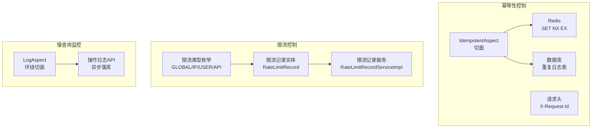
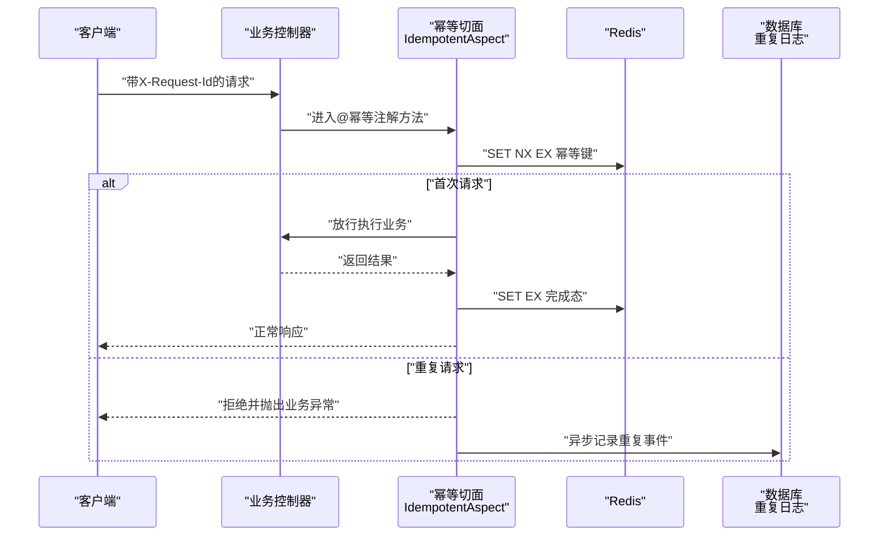
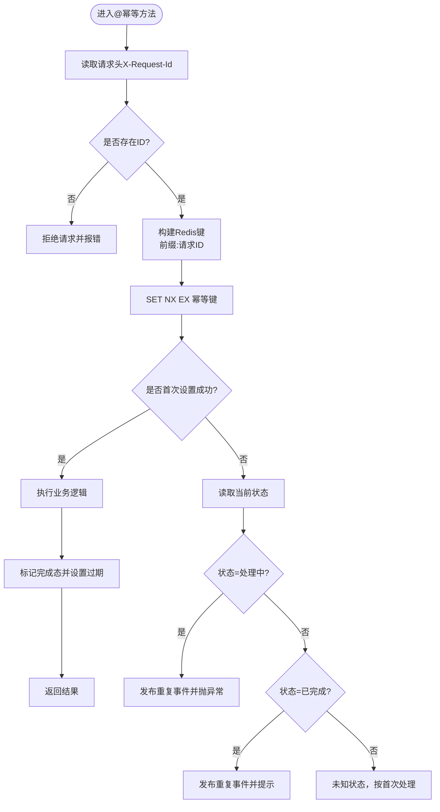
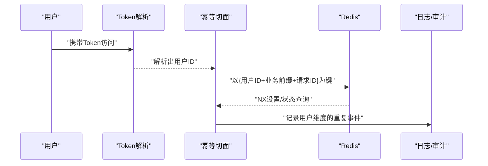
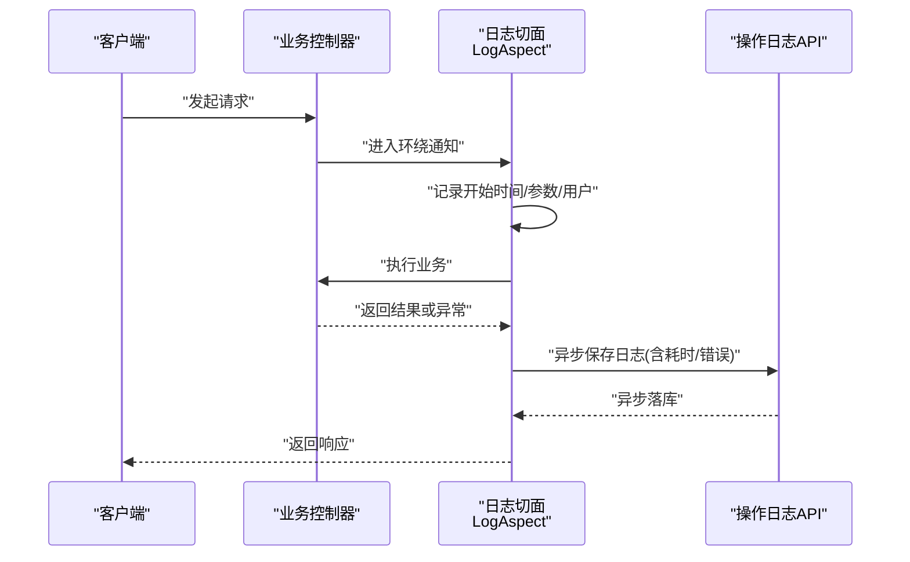
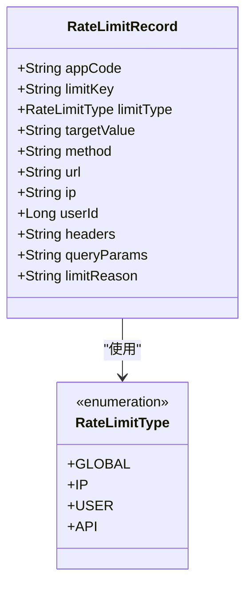
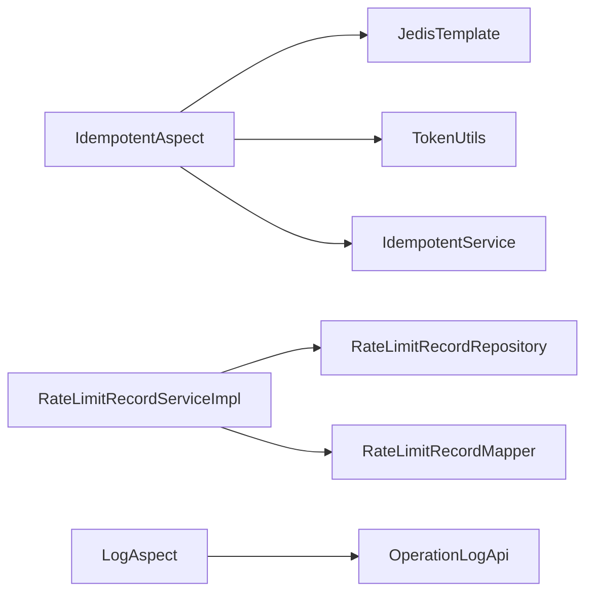

# 业务控制模块

<cite>
**本文引用的文件**
- [IdempotentAspect.java](file://idempotent-api/src/main/java/com/fastproject/idempotent/aspect/IdempotentAspect.java)
- [Idempotent.java](file://idempotent-api/src/main/java/com/fastproject/idempotent/annotation/Idempotent.java)
- [IdempotentStrategy.java](file://idempotent-api/src/main/java/com/fastproject/idempotent/enums/IdempotentStrategy.java)
- [IdempotentDuplicateLogServiceImpl.java](file://idempotent-module/src/main/java/com/fastproject/idempotent/service/impl/IdempotentDuplicateLogServiceImpl.java)
- [RateLimitRecord.java](file://ratelimit-module/src/main/java/com/fastproject/ratelimit/domain/RateLimitRecord.java)
- [RateLimitRecordServiceImpl.java](file://ratelimit-module/src/main/java/com/fastproject/ratelimit/service/impl/RateLimitRecordServiceImpl.java)
- [RateLimitType.java](file://ratelimit-api/src/main/java/com/fastproject/ratelimit/enums/RateLimitType.java)
- [LogAspect.java](file://logs-api/src/main/java/com/fastproject/logs/aspect/LogAspect.java)
</cite>

## 目录
1. [引言](#引言)
2. [项目结构](#项目结构)
3. [核心组件](#核心组件)
4. [架构总览](#架构总览)
5. [详细组件分析](#详细组件分析)
6. [依赖关系分析](#依赖关系分析)
7. [性能考量](#性能考量)
8. [故障排查指南](#故障排查指南)
9. [结论](#结论)
10. [附录](#附录)

## 引言
本技术文档聚焦于业务控制模块，围绕三大核心能力展开：幂等性控制、在线用户管理与慢查询监控、以及限流控制。文档从代码结构、实现机制、数据流与处理逻辑入手，结合可视化图示，帮助读者快速理解并高效运维。

## 项目结构
业务控制模块由多个子模块协同组成：
- 幂等性控制：通过注解与切面在请求入口进行重复请求检测，结合Redis分布式锁与数据库记录实现强一致与可追溯。
- 限流控制：以多维度限流类型（全局、IP、用户、API）为核心，记录限流触发原因与上下文，支撑流量治理与告警。
- 慢查询监控：通过统一日志切面采集请求耗时、参数、异常等信息，形成可检索的运行轨迹，辅助性能分析与优化。

**图表来源**
- [IdempotentAspect.java](file://idempotent-api/src/main/java/com/fastproject/idempotent/aspect/IdempotentAspect.java#L52-L117)
- [Idempotent.java](file://idempotent-api/src/main/java/com/fastproject/idempotent/annotation/Idempotent.java#L24-L57)
- [RateLimitType.java](file://ratelimit-api/src/main/java/com/fastproject/ratelimit/enums/RateLimitType.java#L6-L23)
- [RateLimitRecord.java](file://ratelimit-module/src/main/java/com/fastproject/ratelimit/domain/RateLimitRecord.java#L16-L84)
- [RateLimitRecordServiceImpl.java](file://ratelimit-module/src/main/java/com/fastproject/ratelimit/service/impl/RateLimitRecordServiceImpl.java#L32-L124)
- [LogAspect.java](file://logs-api/src/main/java/com/fastproject/logs/aspect/LogAspect.java#L47-L119)

**章节来源**
- [IdempotentAspect.java](file://idempotent-api/src/main/java/com/fastproject/idempotent/aspect/IdempotentAspect.java#L1-L211)
- [Idempotent.java](file://idempotent-api/src/main/java/com/fastproject/idempotent/annotation/Idempotent.java#L1-L57)
- [RateLimitType.java](file://ratelimit-api/src/main/java/com/fastproject/ratelimit/enums/RateLimitType.java#L1-L24)
- [RateLimitRecord.java](file://ratelimit-module/src/main/java/com/fastproject/ratelimit/domain/RateLimitRecord.java#L1-L84)
- [RateLimitRecordServiceImpl.java](file://ratelimit-module/src/main/java/com/fastproject/ratelimit/service/impl/RateLimitRecordServiceImpl.java#L1-L124)
- [LogAspect.java](file://logs-api/src/main/java/com/fastproject/logs/aspect/LogAspect.java#L1-L242)

## 核心组件
- 幂等性控制：基于请求头X-Request-Id与Redis分布式锁，确保同一请求在有效期内仅被处理一次；对重复请求进行事件上报与阻断。
- 在线用户管理与并发控制：通过Token解析用户身份，结合幂等键与会话维度实现并发控制与状态跟踪。
- 慢查询监控：统一记录请求耗时、参数、异常、用户信息等，支持按条件检索与趋势分析。
- 限流控制：多维度限流策略（全局、IP、用户、API），记录限流原因与上下文，支撑告警与治理。

**章节来源**
- [IdempotentAspect.java](file://idempotent-api/src/main/java/com/fastproject/idempotent/aspect/IdempotentAspect.java#L52-L117)
- [LogAspect.java](file://logs-api/src/main/java/com/fastproject/logs/aspect/LogAspect.java#L47-L119)
- [RateLimitRecord.java](file://ratelimit-module/src/main/java/com/fastproject/ratelimit/domain/RateLimitRecord.java#L16-L84)

## 架构总览
下图展示了幂等性控制、限流与慢查询监控的关键交互流程。

**图表来源**
- [IdempotentAspect.java](file://idempotent-api/src/main/java/com/fastproject/idempotent/aspect/IdempotentAspect.java#L52-L117)
- [Idempotent.java](file://idempotent-api/src/main/java/com/fastproject/idempotent/annotation/Idempotent.java#L24-L57)

## 详细组件分析

### 幂等性控制
- 分布式锁与Redis原子操作
  - 使用Redis的SET NX EX实现幂等键的原子化设置，避免并发竞争导致的重复处理。
  - 首次请求成功设置后进入业务处理；完成后将状态更新为“已完成”，并设置合理过期时间。
- 重复请求检测与事件上报
  - 若检测到请求处于“处理中”或“已完成”，立即抛出业务异常并异步记录重复事件，便于后续审计与治理。
  - 事件包含请求头、URL、方法、参数摘要、用户信息、重复次数等关键字段。
- 幂等键生成策略
  - 注解提供前缀与过期时间配置；策略枚举支持默认（用户+路径+参数MD5）、参数MD5、Token、自定义SpEL表达式等模式，满足不同业务场景。

**图表来源**
- [IdempotentAspect.java](file://idempotent-api/src/main/java/com/fastproject/idempotent/aspect/IdempotentAspect.java#L158-L207)
- [Idempotent.java](file://idempotent-api/src/main/java/com/fastproject/idempotent/annotation/Idempotent.java#L24-L57)
- [IdempotentStrategy.java](file://idempotent-api/src/main/java/com/fastproject/idempotent/enums/IdempotentStrategy.java#L7-L32)

**章节来源**
- [IdempotentAspect.java](file://idempotent-api/src/main/java/com/fastproject/idempotent/aspect/IdempotentAspect.java#L52-L117)
- [Idempotent.java](file://idempotent-api/src/main/java/com/fastproject/idempotent/annotation/Idempotent.java#L24-L57)
- [IdempotentStrategy.java](file://idempotent-api/src/main/java/com/fastproject/idempotent/enums/IdempotentStrategy.java#L1-L33)

### 在线用户管理与并发控制
- 会话监控与用户状态跟踪
  - 利用Token解析当前用户，将userId写入幂等事件与日志上下文中，实现用户级别的幂等与并发控制。
  - 结合幂等键前缀与用户维度，可实现“同一用户在同一业务动作上”的互斥访问。
- 并发控制策略
  - 基于Redis键空间隔离与原子操作，天然具备高并发下的强一致性保障。
  - 对异常场景自动清理幂等标记，避免脏键导致的永久阻塞。

**图表来源**
- [IdempotentAspect.java](file://idempotent-api/src/main/java/com/fastproject/idempotent/aspect/IdempotentAspect.java#L80-L96)
- [IdempotentAspect.java](file://idempotent-api/src/main/java/com/fastproject/idempotent/aspect/IdempotentAspect.java#L176-L189)

**章节来源**
- [IdempotentAspect.java](file://idempotent-api/src/main/java/com/fastproject/idempotent/aspect/IdempotentAspect.java#L80-L96)
- [IdempotentAspect.java](file://idempotent-api/src/main/java/com/fastproject/idempotent/aspect/IdempotentAspect.java#L176-L189)

### 慢查询监控
- 统一日志切面
  - 通过环绕通知记录请求开始时间、请求参数、用户信息、IP、URL、方法、执行耗时与异常堆栈。
  - 支持选择性保存请求参数与响应数据，避免敏感信息泄露与日志膨胀。
- SQL性能分析与优化建议
  - 将执行耗时作为慢查询判定依据，结合URL、方法、用户、IP等维度进行聚合分析。
  - 建议配合数据库慢日志与执行计划分析，定位热点SQL并实施索引优化、查询重构与缓存策略。
- 数据库监控与检索
  - 提供分页查询与多条件过滤（时间范围、URL、用户、IP等），便于运营侧进行问题回溯与趋势分析。

**图表来源**
- [LogAspect.java](file://logs-api/src/main/java/com/fastproject/logs/aspect/LogAspect.java#L47-L119)

**章节来源**
- [LogAspect.java](file://logs-api/src/main/java/com/fastproject/logs/aspect/LogAspect.java#L47-L119)

### 限流控制
- 多维度限流策略
  - 限流类型包括全局、IP、用户、API四个维度，覆盖系统级与业务级流量治理需求。
- 限流记录与治理
  - 限流记录实体包含应用编码、限流键、限流类型、目标值、方法、URL、IP、用户ID、请求头、查询参数、限流原因等字段。
  - 服务层提供分页查询与条件过滤，支持按时间范围、URL、用户、IP等维度检索，便于运营与开发侧协同治理。

**图表来源**
- [RateLimitRecord.java](file://ratelimit-module/src/main/java/com/fastproject/ratelimit/domain/RateLimitRecord.java#L16-L84)
- [RateLimitType.java](file://ratelimit-api/src/main/java/com/fastproject/ratelimit/enums/RateLimitType.java#L6-L23)

**章节来源**
- [RateLimitRecord.java](file://ratelimit-module/src/main/java/com/fastproject/ratelimit/domain/RateLimitRecord.java#L16-L84)
- [RateLimitRecordServiceImpl.java](file://ratelimit-module/src/main/java/com/fastproject/ratelimit/service/impl/RateLimitRecordServiceImpl.java#L82-L124)
- [RateLimitType.java](file://ratelimit-api/src/main/java/com/fastproject/ratelimit/enums/RateLimitType.java#L1-L24)

## 依赖关系分析
- 幂等性控制
  - 切面依赖Redis模板进行原子操作，依赖Token工具解析用户，依赖幂等服务异步记录重复事件。
- 限流控制
  - 限流记录实体与服务层构成完整的限流治理闭环，支持多维查询与统计。
- 慢查询监控
  - 日志切面统一采集与异步落库，降低主链路开销，提升系统稳定性。

**图表来源**
- [IdempotentAspect.java](file://idempotent-api/src/main/java/com/fastproject/idempotent/aspect/IdempotentAspect.java#L38-L40)
- [RateLimitRecordServiceImpl.java](file://ratelimit-module/src/main/java/com/fastproject/ratelimit/service/impl/RateLimitRecordServiceImpl.java#L34-L36)
- [LogAspect.java](file://logs-api/src/main/java/com/fastproject/logs/aspect/LogAspect.java#L34-L35)

**章节来源**
- [IdempotentAspect.java](file://idempotent-api/src/main/java/com/fastproject/idempotent/aspect/IdempotentAspect.java#L38-L40)
- [RateLimitRecordServiceImpl.java](file://ratelimit-module/src/main/java/com/fastproject/ratelimit/service/impl/RateLimitRecordServiceImpl.java#L34-L36)
- [LogAspect.java](file://logs-api/src/main/java/com/fastproject/logs/aspect/LogAspect.java#L34-L35)

## 性能考量
- Redis原子操作
  - SET NX EX保证幂等键设置的原子性，避免竞态条件；合理设置过期时间平衡资源占用与安全性。
- 日志异步化
  - 幂等重复事件与操作日志均采用异步落库，减少主链路延迟与阻塞风险。
- 查询优化建议
  - 慢查询监控应结合数据库慢日志与执行计划，优先优化高频路径与大表扫描；对重复事件与限流记录建立必要索引，提升检索效率。
- 限流策略
  - 根据业务峰值与SLA设定阈值，结合滑动窗口与令牌桶等算法，动态调整限流参数，避免误伤正常流量。

## 故障排查指南
- 幂等异常
  - 现象：收到“请求正在处理中/请勿重复提交”等提示。
  - 排查：确认请求头X-Request-Id是否正确下发；检查Redis键是否存在且未过期；查看重复事件记录与业务日志。
- Redis键异常
  - 现象：幂等键未释放或状态异常。
  - 排查：确认异常处理分支是否执行删除键逻辑；核对过期时间设置；排查网络抖动导致的原子操作失败。
- 日志缺失
  - 现象：慢查询日志未落库或字段为空。
  - 排查：检查日志切面开关与异步任务队列；确认OperationLogApi可用性；核对请求参数与响应数据大小限制。
- 限流误判
  - 现象：正常流量被限流。
  - 排查：核对限流类型与键规则；检查目标值匹配度；评估阈值与时间窗口设置；结合限流记录进行回溯分析。

**章节来源**
- [IdempotentAspect.java](file://idempotent-api/src/main/java/com/fastproject/idempotent/aspect/IdempotentAspect.java#L111-L116)
- [LogAspect.java](file://logs-api/src/main/java/com/fastproject/logs/aspect/LogAspect.java#L114-L116)
- [RateLimitRecordServiceImpl.java](file://ratelimit-module/src/main/java/com/fastproject/ratelimit/service/impl/RateLimitRecordServiceImpl.java#L82-L124)

## 结论
业务控制模块通过幂等性控制、限流与慢查询监控三者协同，实现了高并发场景下的强一致、可观测与可治理。幂等性以Redis原子操作为基础，结合数据库事件记录，确保重复请求被及时阻断与可追溯；限流以多维度策略覆盖全链路流量治理；慢查询监控通过统一切面采集关键指标，为性能优化提供数据支撑。建议在生产环境中持续完善限流阈值与告警策略，强化日志检索与SQL优化，保障系统稳定与用户体验。

## 附录
- 关键配置项
  - 幂等注解：前缀、过期时间、提示消息、标题。
  - 限流类型：全局、IP、用户、API。
  - 日志切面：是否保存请求参数、响应数据、是否记录耗时。
- 建议的监控指标
  - 幂等重复率、Redis键命中率、慢查询TopN、限流触发量与误伤率、日志异步积压。